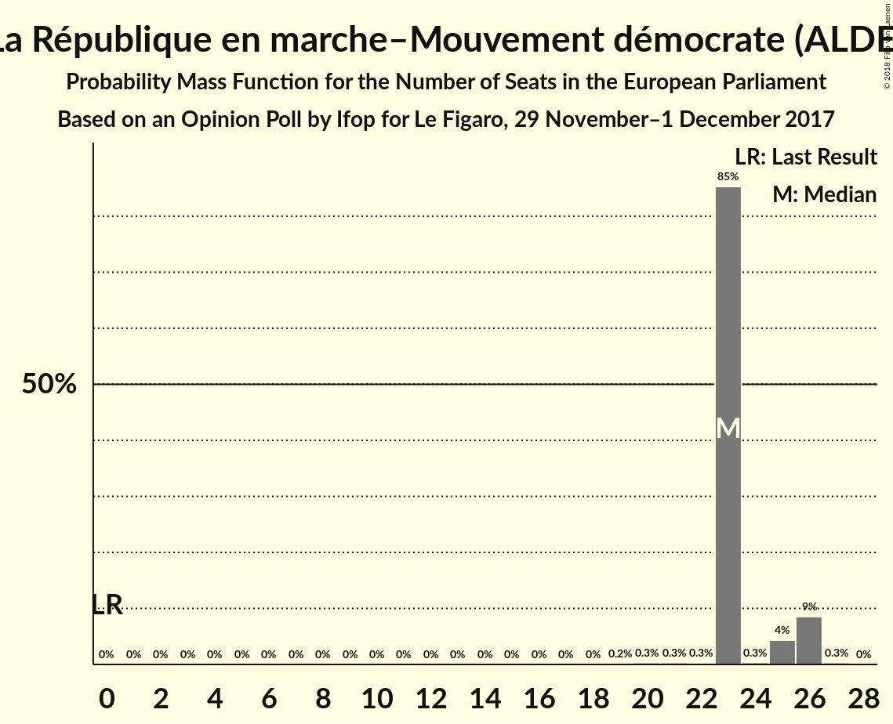
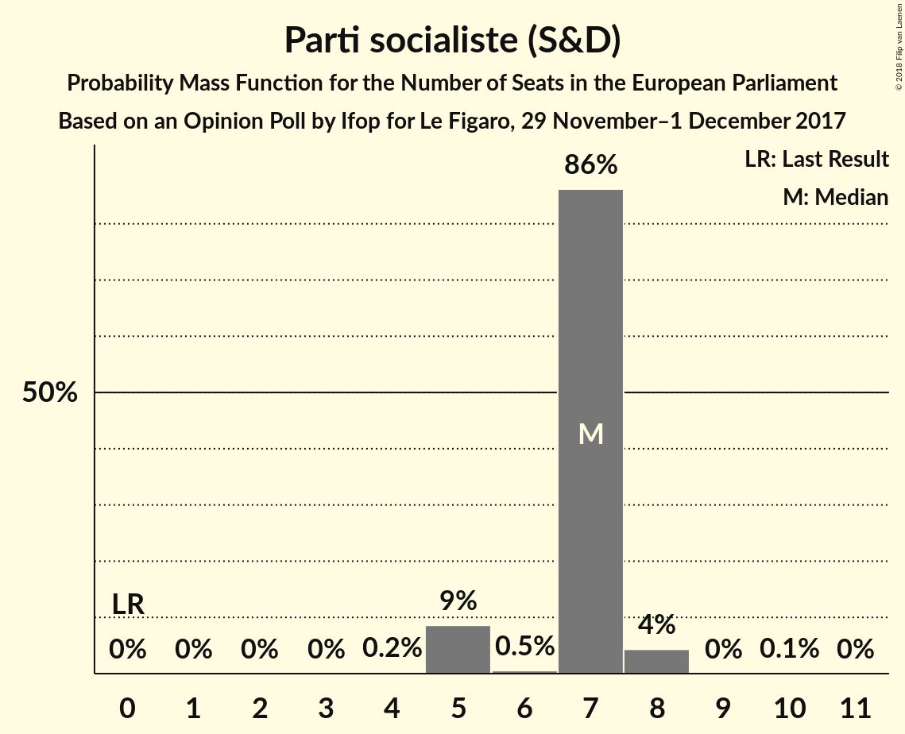
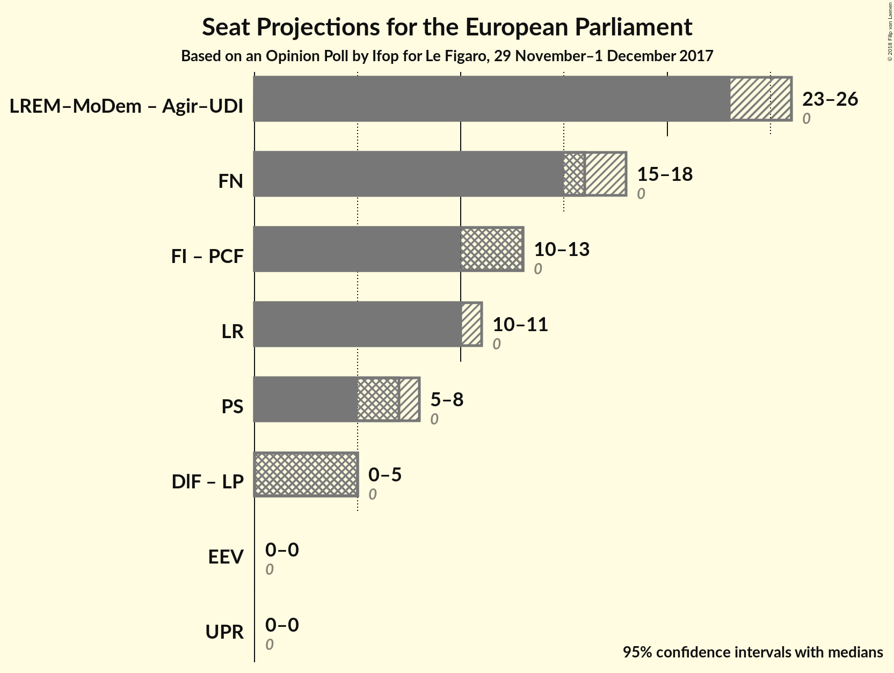

# Opinion Poll by Ifop for Le Figaro, 29 November–1 December 2017

<a href="#voting-intentions">Voting Intentions</a> | <a href="#seats">Seats</a> | <a href="#coalitions">Coalitions</a> | <a href="#technical-information">Technical Information</a>

## Voting Intentions

### Confidence Intervals

| Party | Last Result | Poll Result | 80% Confidence Interval | 90% Confidence Interval | 95% Confidence Interval | 99% Confidence Interval |
|:-----:|:-----------:|:-----------:|:-----------------------:|:-----------------------:|:-----------------------:|:-----------------------:|
| La République en marche–Mouvement démocrate (ALDE) | 0.0% | 26.0% | 24.3–27.8% |23.8–28.4% |23.4–28.8% |22.6–29.7% |
| Front national (ENF) | 0.0% | 17.0% | 15.5–18.6% |15.1–19.0% |14.8–19.4% |14.1–20.2% |
| La France insoumise (GUE/NGL) | 0.0% | 14.0% | 12.7–15.5% |12.3–15.9% |12.0–16.3% |11.4–17.0% |
| Les Républicains (EPP) | 0.0% | 12.0% | 10.8–13.4% |10.4–13.8% |10.2–14.2% |9.6–14.9% |
| Parti socialiste (S&D) | 0.0% | 8.0% | 7.0–9.3% |6.8–9.6% |6.5–9.9% |6.1–10.5% |
| Debout la France (EFDD) | 0.0% | 6.0% | 5.1–7.0% |4.9–7.3% |4.6–7.6% |4.3–8.1% |
| Europe Écologie Les Verts (Greens/EFA) | 0.0% | 4.0% | 3.3–4.9% |3.1–5.1% |2.9–5.4% |2.6–5.8% |
| Agir, la droite constructive–Union des démocrates et indépendants (ALDE) | 0.0% | 3.5% | 2.8–4.3% |2.7–4.6% |2.5–4.8% |2.2–5.2% |
| Parti communiste français (GUE/NGL) | 0.0% | 2.0% | 1.5–2.7% |1.4–2.9% |1.3–3.0% |1.1–3.4% |
| Les Patriotes (EFDD) | 0.0% | 2.0% | 1.5–2.7% |1.4–2.9% |1.3–3.0% |1.1–3.4% |
| Union populaire républicaine (—) | 0.0% | 1.5% | 1.1–2.1% |1.0–2.3% |0.9–2.5% |0.7–2.8% |

*Note:* The poll result column reflects the actual value used in the calculations. Published results may vary slightly, and in addition be rounded to fewer digits.

## Seats

### Confidence Intervals

| Party | Last Result | Median | 80% Confidence Interval | 90% Confidence Interval | 95% Confidence Interval | 99% Confidence Interval |
|:-----:|:-----------:|:------:|:-----------------------:|:-----------------------:|:-----------------------:|:-----------------------:|
| <a href="#la-république-en-marche–mouvement-démocrate-(alde)">La République en marche–Mouvement démocrate (ALDE)</a> | 0 | 21 | 19–22 |18–22 |18–22 |17–23 |
| <a href="#front-national-(enf)">Front national (ENF)</a> | 0 | 12 | 12–14 |11–14 |11–15 |11–15 |
| <a href="#la-france-insoumise-(gue/ngl)">La France insoumise (GUE/NGL)</a> | 0 | 10 | 9–11 |9–12 |9–12 |8–13 |
| <a href="#les-républicains-(epp)">Les Républicains (EPP)</a> | 0 | 9 | 8–10 |8–11 |7–11 |7–11 |
| <a href="#parti-socialiste-(s&d)">Parti socialiste (S&D)</a> | 0 | 6 | 5–7 |5–7 |5–7 |4–8 |
| <a href="#debout-la-france-(efdd)">Debout la France (EFDD)</a> | 0 | 5 | 4–5 |3–5 |3–6 |3–6 |
| <a href="#europe-Écologie-les-verts-(greens/efa)">Europe Écologie Les Verts (Greens/EFA)</a> | 0 | 3 | 2–3 |2–3 |2–4 |2–4 |
| <a href="#agir,-la-droite-constructive–union-des-démocrates-et-indépendants-(alde)">Agir, la droite constructive–Union des démocrates et indépendants (ALDE)</a> | 0 | 2 | 2–3 |2–3 |1–3 |1–4 |
| <a href="#parti-communiste-français-(gue/ngl)">Parti communiste français (GUE/NGL)</a> | 0 | 1 | 1–2 |1–2 |0–2 |0–2 |
| <a href="#les-patriotes-(efdd)">Les Patriotes (EFDD)</a> | 0 | 1 | 1–2 |1–2 |1–2 |0–2 |
| <a href="#union-populaire-républicaine-(—)">Union populaire républicaine (—)</a> | 0 | 1 | 0–1 |0–1 |0–2 |0–2 |

### La République en marche–Mouvement démocrate (ALDE)

*For a full overview of the results for this party, see the [La République en marche–Mouvement démocrate (ALDE)](party-larépubliqueenmarche–mouvementdémocratealde.html) page.*

| Number of Seats | Probability | Accumulated | Special Marks |
|:---------------:|:-----------:|:-----------:|:-------------:|
| 0 | 0% | 100% | Last Result |
| 1 | 0% | 100% |  |
| 2 | 0% | 100% |  |
| 3 | 0% | 100% |  |
| 4 | 0% | 100% |  |
| 5 | 0% | 100% |  |
| 6 | 0% | 100% |  |
| 7 | 0% | 100% |  |
| 8 | 0% | 100% |  |
| 9 | 0% | 100% |  |
| 10 | 0% | 100% |  |
| 11 | 0% | 100% |  |
| 12 | 0% | 100% |  |
| 13 | 0% | 100% |  |
| 14 | 0% | 100% |  |
| 15 | 0% | 100% |  |
| 16 | 0% | 100% |  |
| 17 | 2% | 100% |  |
| 18 | 6% | 98% |  |
| 19 | 9% | 92% |  |
| 20 | 16% | 83% |  |
| 21 | 52% | 67% | Median |
| 22 | 13% | 15% |  |
| 23 | 2% | 2% |  |
| 24 | 0.1% | 0.1% |  |
| 25 | 0% | 0% |  |

### Front national (ENF)

*For a full overview of the results for this party, see the [Front national (ENF)](party-frontnationalenf.html) page.*

| Number of Seats | Probability | Accumulated | Special Marks |
|:---------------:|:-----------:|:-----------:|:-------------:|
| 0 | 0% | 100% | Last Result |
| 1 | 0% | 100% |  |
| 2 | 0% | 100% |  |
| 3 | 0% | 100% |  |
| 4 | 0% | 100% |  |
| 5 | 0% | 100% |  |
| 6 | 0% | 100% |  |
| 7 | 0% | 100% |  |
| 8 | 0% | 100% |  |
| 9 | 0% | 100% |  |
| 10 | 0.2% | 100% |  |
| 11 | 5% | 99.8% |  |
| 12 | 49% | 94% | Median |
| 13 | 23% | 46% |  |
| 14 | 18% | 23% |  |
| 15 | 4% | 5% |  |
| 16 | 0.3% | 0.3% |  |
| 17 | 0% | 0% |  |

### La France insoumise (GUE/NGL)

*For a full overview of the results for this party, see the [La France insoumise (GUE/NGL)](party-lafranceinsoumiseguengl.html) page.*

| Number of Seats | Probability | Accumulated | Special Marks |
|:---------------:|:-----------:|:-----------:|:-------------:|
| 0 | 0% | 100% | Last Result |
| 1 | 0% | 100% |  |
| 2 | 0% | 100% |  |
| 3 | 0% | 100% |  |
| 4 | 0% | 100% |  |
| 5 | 0% | 100% |  |
| 6 | 0% | 100% |  |
| 7 | 0% | 100% |  |
| 8 | 0.5% | 100% |  |
| 9 | 11% | 99.5% |  |
| 10 | 45% | 88% | Median |
| 11 | 35% | 43% |  |
| 12 | 6% | 7% |  |
| 13 | 0.9% | 1.0% |  |
| 14 | 0.1% | 0.1% |  |
| 15 | 0% | 0% |  |

### Les Républicains (EPP)

*For a full overview of the results for this party, see the [Les Républicains (EPP)](party-lesrépublicainsepp.html) page.*

| Number of Seats | Probability | Accumulated | Special Marks |
|:---------------:|:-----------:|:-----------:|:-------------:|
| 0 | 0% | 100% | Last Result |
| 1 | 0% | 100% |  |
| 2 | 0% | 100% |  |
| 3 | 0% | 100% |  |
| 4 | 0% | 100% |  |
| 5 | 0% | 100% |  |
| 6 | 0% | 100% |  |
| 7 | 3% | 100% |  |
| 8 | 45% | 97% |  |
| 9 | 30% | 52% | Median |
| 10 | 15% | 22% |  |
| 11 | 7% | 7% |  |
| 12 | 0.2% | 0.2% |  |
| 13 | 0% | 0% |  |

### Parti socialiste (S&D)

*For a full overview of the results for this party, see the [Parti socialiste (S&D)](party-partisocialistesd.html) page.*

| Number of Seats | Probability | Accumulated | Special Marks |
|:---------------:|:-----------:|:-----------:|:-------------:|
| 0 | 0% | 100% | Last Result |
| 1 | 0% | 100% |  |
| 2 | 0% | 100% |  |
| 3 | 0% | 100% |  |
| 4 | 0.6% | 100% |  |
| 5 | 25% | 99.4% |  |
| 6 | 56% | 74% | Median |
| 7 | 16% | 19% |  |
| 8 | 2% | 2% |  |
| 9 | 0% | 0% |  |

### Debout la France (EFDD)

*For a full overview of the results for this party, see the [Debout la France (EFDD)](party-deboutlafranceefdd.html) page.*

| Number of Seats | Probability | Accumulated | Special Marks |
|:---------------:|:-----------:|:-----------:|:-------------:|
| 0 | 0% | 100% | Last Result |
| 1 | 0% | 100% |  |
| 2 | 0% | 100% |  |
| 3 | 5% | 100% |  |
| 4 | 44% | 95% |  |
| 5 | 47% | 51% | Median |
| 6 | 4% | 4% |  |
| 7 | 0.1% | 0.1% |  |
| 8 | 0% | 0% |  |

### Europe Écologie Les Verts (Greens/EFA)

*For a full overview of the results for this party, see the [Europe Écologie Les Verts (Greens/EFA)](party-europeÉcologielesvertsgreensefa.html) page.*

| Number of Seats | Probability | Accumulated | Special Marks |
|:---------------:|:-----------:|:-----------:|:-------------:|
| 0 | 0% | 100% | Last Result |
| 1 | 0.3% | 100% |  |
| 2 | 26% | 99.7% |  |
| 3 | 69% | 74% | Median |
| 4 | 5% | 5% |  |
| 5 | 0.1% | 0.1% |  |
| 6 | 0% | 0% |  |

### Agir, la droite constructive–Union des démocrates et indépendants (ALDE)

*For a full overview of the results for this party, see the [Agir, la droite constructive–Union des démocrates et indépendants (ALDE)](party-agirladroiteconstructive–uniondesdémocratesetindépendantsalde.html) page.*

| Number of Seats | Probability | Accumulated | Special Marks |
|:---------------:|:-----------:|:-----------:|:-------------:|
| 0 | 0% | 100% | Last Result |
| 1 | 3% | 100% |  |
| 2 | 75% | 97% | Median |
| 3 | 21% | 22% |  |
| 4 | 1.1% | 1.1% |  |
| 5 | 0% | 0% |  |

### Parti communiste français (GUE/NGL)

*For a full overview of the results for this party, see the [Parti communiste français (GUE/NGL)](party-particommunistefrançaisguengl.html) page.*

| Number of Seats | Probability | Accumulated | Special Marks |
|:---------------:|:-----------:|:-----------:|:-------------:|
| 0 | 4% | 100% | Last Result |
| 1 | 85% | 96% | Median |
| 2 | 11% | 11% |  |
| 3 | 0.1% | 0.1% |  |
| 4 | 0% | 0% |  |

### Les Patriotes (EFDD)

*For a full overview of the results for this party, see the [Les Patriotes (EFDD)](party-lespatriotesefdd.html) page.*

| Number of Seats | Probability | Accumulated | Special Marks |
|:---------------:|:-----------:|:-----------:|:-------------:|
| 0 | 2% | 100% | Last Result |
| 1 | 64% | 98% | Median |
| 2 | 34% | 34% |  |
| 3 | 0.1% | 0.1% |  |
| 4 | 0% | 0% |  |

### Union populaire républicaine (—)

*For a full overview of the results for this party, see the [Union populaire républicaine (—)](party-unionpopulairerépublicaine—.html) page.*

| Number of Seats | Probability | Accumulated | Special Marks |
|:---------------:|:-----------:|:-----------:|:-------------:|
| 0 | 12% | 100% | Last Result |
| 1 | 83% | 88% | Median |
| 2 | 4% | 4% |  |
| 3 | 0% | 0% |  |

## Coalitions

### Confidence Intervals

| Coalition | Last Result | Median | Majority? | 80% Confidence Interval | 90% Confidence Interval | 95% Confidence Interval | 99% Confidence Interval |
|:---------:|:-----------:|:------:|:---------:|:-----------------------:|:-----------------------:|:-----------------------:|:-----------------------:|
| La République en marche–Mouvement démocrate (ALDE) – Agir, la droite constructive–Union des démocrates et indépendants (ALDE) | 0 | 23 | 0% | 21–24 | 21–25 | 20–25 | 20–25 |
| Front national (ENF) | 0 | 12 | 0% | 12–14 | 11–14 | 11–15 | 11–15 |
| La France insoumise (GUE/NGL) – Parti communiste français (GUE/NGL) | 0 | 11 | 0% | 11–13 | 10–13 | 10–14 | 10–14 |
| Les Républicains (EPP) | 0 | 9 | 0% | 8–10 | 8–11 | 7–11 | 7–11 |
| Parti socialiste (S&D) | 0 | 6 | 0% | 5–7 | 5–7 | 5–7 | 4–8 |
| Debout la France (EFDD) – Les Patriotes (EFDD) | 0 | 6 | 0% | 5–7 | 4–7 | 4–7 | 4–7 |
| Europe Écologie Les Verts (Greens/EFA) | 0 | 3 | 0% | 2–3 | 2–3 | 2–4 | 2–4 |
| Union populaire républicaine (—) | 0 | 1 | 0% | 0–1 | 0–1 | 0–2 | 0–2 |

### La République en marche–Mouvement démocrate (ALDE) – Agir, la droite constructive–Union des démocrates et indépendants (ALDE)

| Number of Seats | Probability | Accumulated | Special Marks |
|:---------------:|:-----------:|:-----------:|:-------------:|
| 0 | 0% | 100% | Last Result |
| 1 | 0% | 100% |  |
| 2 | 0% | 100% |  |
| 3 | 0% | 100% |  |
| 4 | 0% | 100% |  |
| 5 | 0% | 100% |  |
| 6 | 0% | 100% |  |
| 7 | 0% | 100% |  |
| 8 | 0% | 100% |  |
| 9 | 0% | 100% |  |
| 10 | 0% | 100% |  |
| 11 | 0% | 100% |  |
| 12 | 0% | 100% |  |
| 13 | 0% | 100% |  |
| 14 | 0% | 100% |  |
| 15 | 0% | 100% |  |
| 16 | 0% | 100% |  |
| 17 | 0% | 100% |  |
| 18 | 0% | 100% |  |
| 19 | 0.2% | 100% |  |
| 20 | 3% | 99.8% |  |
| 21 | 12% | 96% |  |
| 22 | 15% | 85% |  |
| 23 | 48% | 70% | Median |
| 24 | 17% | 22% |  |
| 25 | 5% | 5% |  |
| 26 | 0.3% | 0.4% |  |
| 27 | 0% | 0% |  |

### Front national (ENF)

| Number of Seats | Probability | Accumulated | Special Marks |
|:---------------:|:-----------:|:-----------:|:-------------:|
| 0 | 0% | 100% | Last Result |
| 1 | 0% | 100% |  |
| 2 | 0% | 100% |  |
| 3 | 0% | 100% |  |
| 4 | 0% | 100% |  |
| 5 | 0% | 100% |  |
| 6 | 0% | 100% |  |
| 7 | 0% | 100% |  |
| 8 | 0% | 100% |  |
| 9 | 0% | 100% |  |
| 10 | 0.2% | 100% |  |
| 11 | 5% | 99.8% |  |
| 12 | 49% | 94% | Median |
| 13 | 23% | 46% |  |
| 14 | 18% | 23% |  |
| 15 | 4% | 5% |  |
| 16 | 0.3% | 0.3% |  |
| 17 | 0% | 0% |  |

### La France insoumise (GUE/NGL) – Parti communiste français (GUE/NGL)

| Number of Seats | Probability | Accumulated | Special Marks |
|:---------------:|:-----------:|:-----------:|:-------------:|
| 0 | 0% | 100% | Last Result |
| 1 | 0% | 100% |  |
| 2 | 0% | 100% |  |
| 3 | 0% | 100% |  |
| 4 | 0% | 100% |  |
| 5 | 0% | 100% |  |
| 6 | 0% | 100% |  |
| 7 | 0% | 100% |  |
| 8 | 0% | 100% |  |
| 9 | 0.4% | 100% |  |
| 10 | 9% | 99.6% |  |
| 11 | 47% | 90% | Median |
| 12 | 33% | 43% |  |
| 13 | 8% | 11% |  |
| 14 | 3% | 3% |  |
| 15 | 0.2% | 0.2% |  |
| 16 | 0% | 0% |  |

### Les Républicains (EPP)

| Number of Seats | Probability | Accumulated | Special Marks |
|:---------------:|:-----------:|:-----------:|:-------------:|
| 0 | 0% | 100% | Last Result |
| 1 | 0% | 100% |  |
| 2 | 0% | 100% |  |
| 3 | 0% | 100% |  |
| 4 | 0% | 100% |  |
| 5 | 0% | 100% |  |
| 6 | 0% | 100% |  |
| 7 | 3% | 100% |  |
| 8 | 45% | 97% |  |
| 9 | 30% | 52% | Median |
| 10 | 15% | 22% |  |
| 11 | 7% | 7% |  |
| 12 | 0.2% | 0.2% |  |
| 13 | 0% | 0% |  |

### Parti socialiste (S&D)

| Number of Seats | Probability | Accumulated | Special Marks |
|:---------------:|:-----------:|:-----------:|:-------------:|
| 0 | 0% | 100% | Last Result |
| 1 | 0% | 100% |  |
| 2 | 0% | 100% |  |
| 3 | 0% | 100% |  |
| 4 | 0.6% | 100% |  |
| 5 | 25% | 99.4% |  |
| 6 | 56% | 74% | Median |
| 7 | 16% | 19% |  |
| 8 | 2% | 2% |  |
| 9 | 0% | 0% |  |

### Debout la France (EFDD) – Les Patriotes (EFDD)

| Number of Seats | Probability | Accumulated | Special Marks |
|:---------------:|:-----------:|:-----------:|:-------------:|
| 0 | 0% | 100% | Last Result |
| 1 | 0% | 100% |  |
| 2 | 0% | 100% |  |
| 3 | 0.1% | 100% |  |
| 4 | 6% | 99.9% |  |
| 5 | 40% | 94% |  |
| 6 | 21% | 55% | Median |
| 7 | 33% | 33% |  |
| 8 | 0.4% | 0.4% |  |
| 9 | 0% | 0% |  |

### Europe Écologie Les Verts (Greens/EFA)

| Number of Seats | Probability | Accumulated | Special Marks |
|:---------------:|:-----------:|:-----------:|:-------------:|
| 0 | 0% | 100% | Last Result |
| 1 | 0.3% | 100% |  |
| 2 | 26% | 99.7% |  |
| 3 | 69% | 74% | Median |
| 4 | 5% | 5% |  |
| 5 | 0.1% | 0.1% |  |
| 6 | 0% | 0% |  |

### Union populaire républicaine (—)

| Number of Seats | Probability | Accumulated | Special Marks |
|:---------------:|:-----------:|:-----------:|:-------------:|
| 0 | 12% | 100% | Last Result |
| 1 | 83% | 88% | Median |
| 2 | 4% | 4% |  |
| 3 | 0% | 0% |  |

## Technical Information

### Opinion Poll

+ **Polling firm:** Ifop
+ **Commissioner(s):** Le Figaro
+ **Fieldwork period:** 29 November–1 December 2017

### Calculations

+ **Sample size:** 1007
+ **Simulations done:** 1,048,576
+ **Error estimate:** 1.10%

