# Opinion Poll by Ifop for Valeurs Actuelles, 7–9 May 2018

<a href="#voting-intentions">Voting Intentions</a> | <a href="#seats">Seats</a> | <a href="#coalitions">Coalitions</a> | <a href="#technical-information">Technical Information</a>

## Voting Intentions

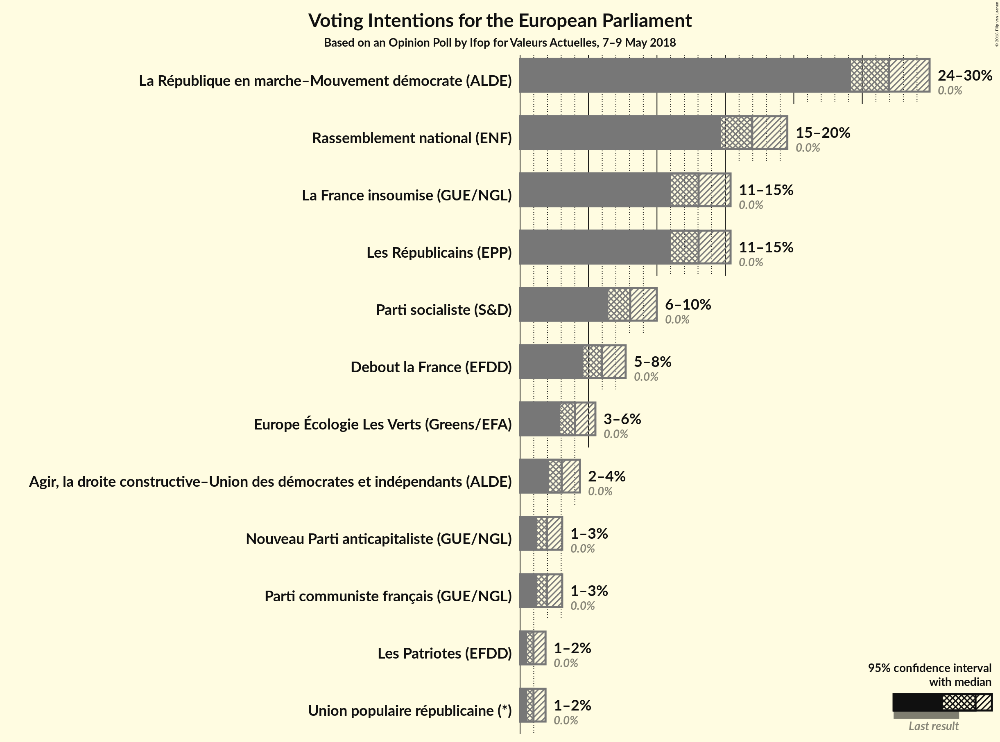

### Confidence Intervals

| Party | Last Result | Poll Result | 80% Confidence Interval | 90% Confidence Interval | 95% Confidence Interval | 99% Confidence Interval |
|:-----:|:-----------:|:-----------:|:-----------------------:|:-----------------------:|:-----------------------:|:-----------------------:|
| La République en marche–Mouvement démocrate (ALDE) | 0.0% | 27.0% | 25.1–28.9% |24.6–29.4% |24.2–29.9% |23.3–30.9% |
| Front national (ENF) | 0.0% | 17.0% | 15.5–18.6% |15.0–19.1% |14.7–19.5% |14.0–20.3% |
| La France insoumise (GUE/NGL) | 0.0% | 13.0% | 11.7–14.6% |11.3–15.0% |11.0–15.4% |10.4–16.1% |
| Les Républicains (EPP) | 0.0% | 13.0% | 11.7–14.6% |11.3–15.0% |11.0–15.4% |10.4–16.1% |
| Parti socialiste (S&D) | 0.0% | 8.0% | 7.0–9.3% |6.7–9.7% |6.4–10.0% |6.0–10.6% |
| Debout la France (EFDD) | 0.0% | 6.0% | 5.1–7.1% |4.8–7.4% |4.6–7.7% |4.2–8.3% |
| Europe Écologie Les Verts (Greens/EFA) | 0.0% | 4.0% | 3.3–5.0% |3.1–5.3% |2.9–5.5% |2.6–6.0% |
| Agir, la droite constructive–Union des démocrates et indépendants (ALDE) | 0.0% | 3.0% | 2.4–3.9% |2.3–4.1% |2.1–4.4% |1.8–4.8% |
| Parti communiste français (GUE/NGL) | 0.0% | 2.0% | 1.5–2.7% |1.3–2.9% |1.2–3.1% |1.1–3.5% |
| Les Patriotes (EFDD) | 0.0% | 1.0% | 0.7–1.5% |0.6–1.7% |0.5–1.9% |0.4–2.2% |
| Union populaire républicaine (*) | 0.0% | 1.0% | 0.7–1.5% |0.6–1.7% |0.5–1.9% |0.4–2.2% |

*Note:* The poll result column reflects the actual value used in the calculations. Published results may vary slightly, and in addition be rounded to fewer digits.

## Seats

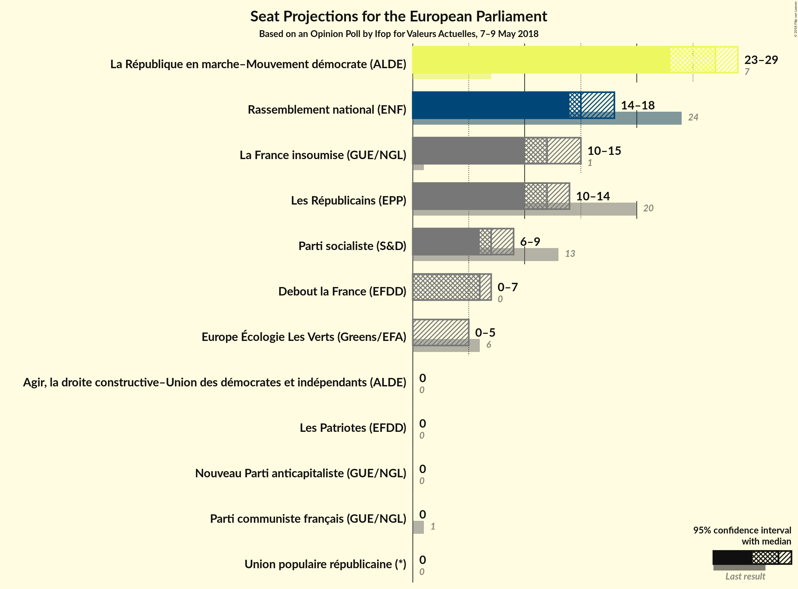

### Confidence Intervals

| Party | Last Result | Median | 80% Confidence Interval | 90% Confidence Interval | 95% Confidence Interval | 99% Confidence Interval |
|:-----:|:-----------:|:------:|:-----------------------:|:-----------------------:|:-----------------------:|:-----------------------:|
| <a href="#la-république-en-marche–mouvement-démocrate-(alde)">La République en marche–Mouvement démocrate (ALDE)</a> | 0 | 25 | 23–27 |23–27 |23–28 |21–29 |
| <a href="#front-national-(enf)">Front national (ENF)</a> | 0 | 15 | 13–18 |13–18 |13–19 |12–21 |
| <a href="#la-france-insoumise-(gue/ngl)">La France insoumise (GUE/NGL)</a> | 0 | 12 | 11–14 |10–14 |10–14 |9–15 |
| <a href="#les-républicains-(epp)">Les Républicains (EPP)</a> | 0 | 12 | 10–14 |10–14 |10–14 |9–15 |
| <a href="#parti-socialiste-(s&d)">Parti socialiste (S&D)</a> | 0 | 7 | 6–8 |6–8 |6–9 |5–10 |
| <a href="#debout-la-france-(efdd)">Debout la France (EFDD)</a> | 0 | 5 | 0–6 |0–6 |0–7 |0–8 |
| <a href="#europe-écologie-les-verts-(greens/efa)">Europe Écologie Les Verts (Greens/EFA)</a> | 0 | 0 | 0–5 |0–5 |0–5 |0–5 |
| <a href="#agir,-la-droite-constructive–union-des-démocrates-et-indépendants-(alde)">Agir, la droite constructive–Union des démocrates et indépendants (ALDE)</a> | 0 | 0 | 0–4 |0–4 |0–4 |0–4 |
| <a href="#parti-communiste-français-(gue/ngl)">Parti communiste français (GUE/NGL)</a> | 0 | 0 | 0 |0 |0 |0 |
| <a href="#les-patriotes-(efdd)">Les Patriotes (EFDD)</a> | 0 | 0 | 0 |0 |0 |0 |
| <a href="#union-populaire-républicaine-(*)">Union populaire républicaine (*)</a> | 0 | 0 | 0 |0 |0 |0 |

### La République en marche–Mouvement démocrate (ALDE)

*For a full overview of the results for this party, see the [La République en marche–Mouvement démocrate (ALDE)](party-larépubliqueenmarche–mouvementdémocratealde.html) page.*

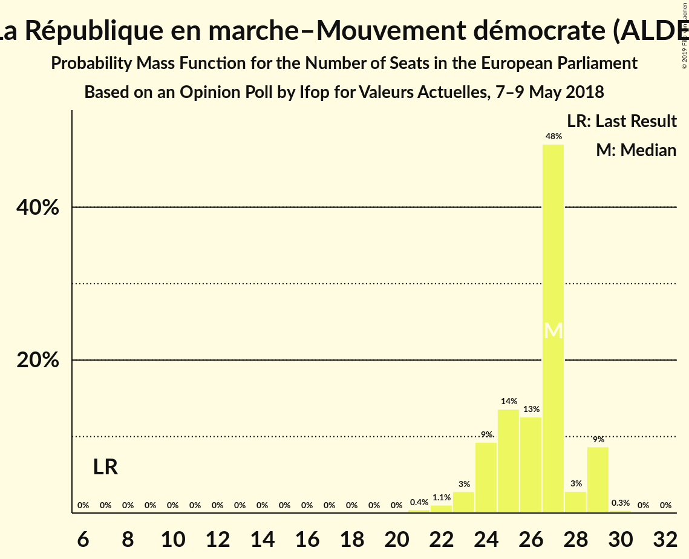

| Number of Seats | Probability | Accumulated | Special Marks |
|:---------------:|:-----------:|:-----------:|:-------------:|
| 0 | 0% | 100% | Last Result |
| 1 | 0% | 100% |  |
| 2 | 0% | 100% |  |
| 3 | 0% | 100% |  |
| 4 | 0% | 100% |  |
| 5 | 0% | 100% |  |
| 6 | 0% | 100% |  |
| 7 | 0% | 100% |  |
| 8 | 0% | 100% |  |
| 9 | 0% | 100% |  |
| 10 | 0% | 100% |  |
| 11 | 0% | 100% |  |
| 12 | 0% | 100% |  |
| 13 | 0% | 100% |  |
| 14 | 0% | 100% |  |
| 15 | 0% | 100% |  |
| 16 | 0% | 100% |  |
| 17 | 0% | 100% |  |
| 18 | 0% | 100% |  |
| 19 | 0% | 100% |  |
| 20 | 0.1% | 100% |  |
| 21 | 1.3% | 99.9% |  |
| 22 | 0.9% | 98.6% |  |
| 23 | 18% | 98% |  |
| 24 | 9% | 80% |  |
| 25 | 42% | 71% | Median |
| 26 | 7% | 29% |  |
| 27 | 17% | 22% |  |
| 28 | 3% | 4% |  |
| 29 | 0.7% | 1.1% |  |
| 30 | 0.3% | 0.4% |  |
| 31 | 0% | 0.1% |  |
| 32 | 0% | 0% |  |

### Front national (ENF)

*For a full overview of the results for this party, see the [Front national (ENF)](party-frontnationalenf.html) page.*

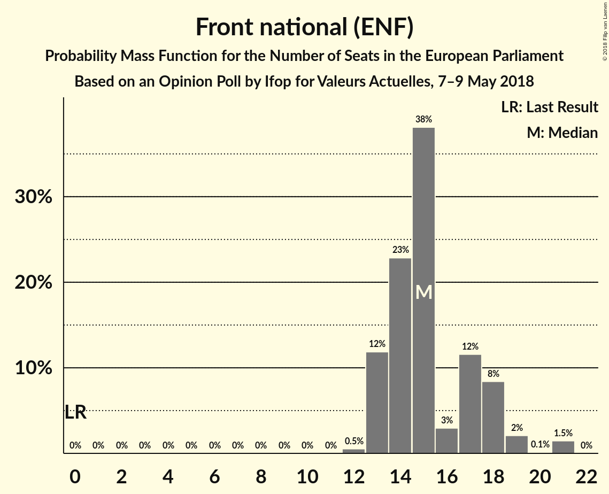

| Number of Seats | Probability | Accumulated | Special Marks |
|:---------------:|:-----------:|:-----------:|:-------------:|
| 0 | 0% | 100% | Last Result |
| 1 | 0% | 100% |  |
| 2 | 0% | 100% |  |
| 3 | 0% | 100% |  |
| 4 | 0% | 100% |  |
| 5 | 0% | 100% |  |
| 6 | 0% | 100% |  |
| 7 | 0% | 100% |  |
| 8 | 0% | 100% |  |
| 9 | 0% | 100% |  |
| 10 | 0% | 100% |  |
| 11 | 0% | 100% |  |
| 12 | 0.5% | 100% |  |
| 13 | 12% | 99.4% |  |
| 14 | 23% | 88% |  |
| 15 | 38% | 65% | Median |
| 16 | 3% | 27% |  |
| 17 | 12% | 24% |  |
| 18 | 8% | 12% |  |
| 19 | 2% | 4% |  |
| 20 | 0.1% | 2% |  |
| 21 | 1.5% | 1.5% |  |
| 22 | 0% | 0% |  |

### La France insoumise (GUE/NGL)

*For a full overview of the results for this party, see the [La France insoumise (GUE/NGL)](party-lafranceinsoumiseguengl.html) page.*

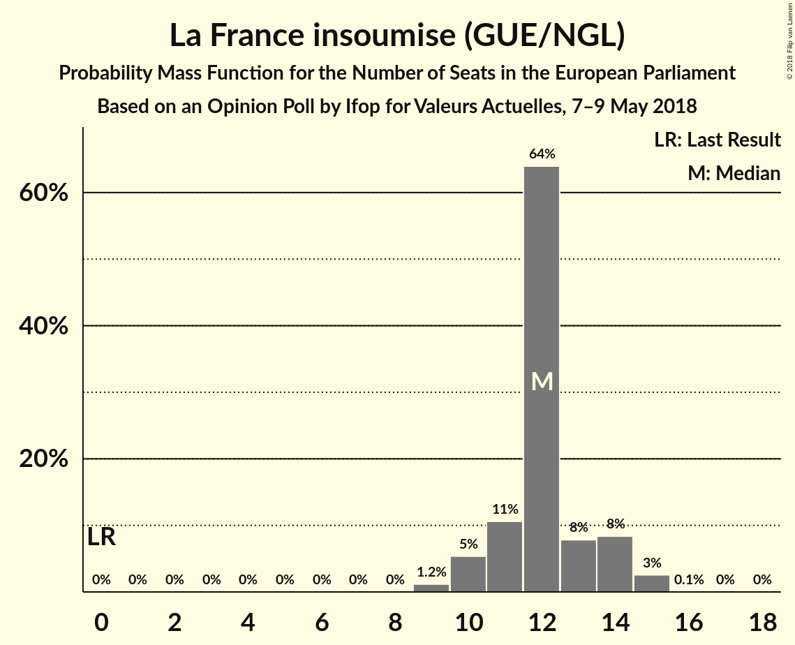

| Number of Seats | Probability | Accumulated | Special Marks |
|:---------------:|:-----------:|:-----------:|:-------------:|
| 0 | 0% | 100% | Last Result |
| 1 | 0% | 100% |  |
| 2 | 0% | 100% |  |
| 3 | 0% | 100% |  |
| 4 | 0% | 100% |  |
| 5 | 0% | 100% |  |
| 6 | 0% | 100% |  |
| 7 | 0% | 100% |  |
| 8 | 0.1% | 100% |  |
| 9 | 0.6% | 99.9% |  |
| 10 | 7% | 99.4% |  |
| 11 | 35% | 93% |  |
| 12 | 27% | 58% | Median |
| 13 | 18% | 30% |  |
| 14 | 11% | 12% |  |
| 15 | 0.9% | 0.9% |  |
| 16 | 0% | 0% |  |

### Les Républicains (EPP)

*For a full overview of the results for this party, see the [Les Républicains (EPP)](party-lesrépublicainsepp.html) page.*

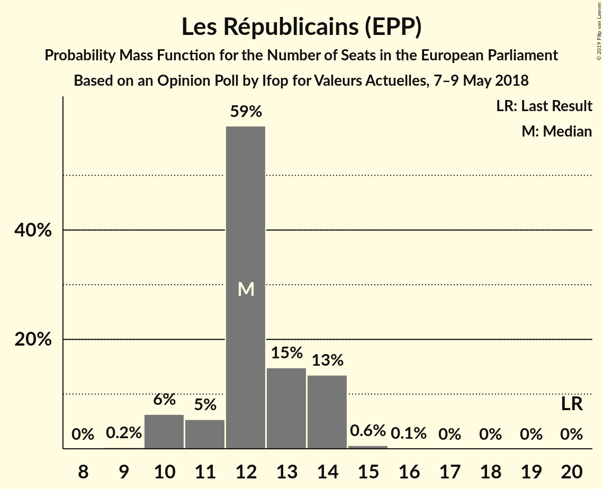

| Number of Seats | Probability | Accumulated | Special Marks |
|:---------------:|:-----------:|:-----------:|:-------------:|
| 0 | 0% | 100% | Last Result |
| 1 | 0% | 100% |  |
| 2 | 0% | 100% |  |
| 3 | 0% | 100% |  |
| 4 | 0% | 100% |  |
| 5 | 0% | 100% |  |
| 6 | 0% | 100% |  |
| 7 | 0% | 100% |  |
| 8 | 0.2% | 100% |  |
| 9 | 1.0% | 99.8% |  |
| 10 | 13% | 98.8% |  |
| 11 | 27% | 86% |  |
| 12 | 38% | 58% | Median |
| 13 | 7% | 20% |  |
| 14 | 11% | 13% |  |
| 15 | 2% | 2% |  |
| 16 | 0% | 0.1% |  |
| 17 | 0% | 0% |  |

### Parti socialiste (S&D)

*For a full overview of the results for this party, see the [Parti socialiste (S&D)](party-partisocialistesd.html) page.*

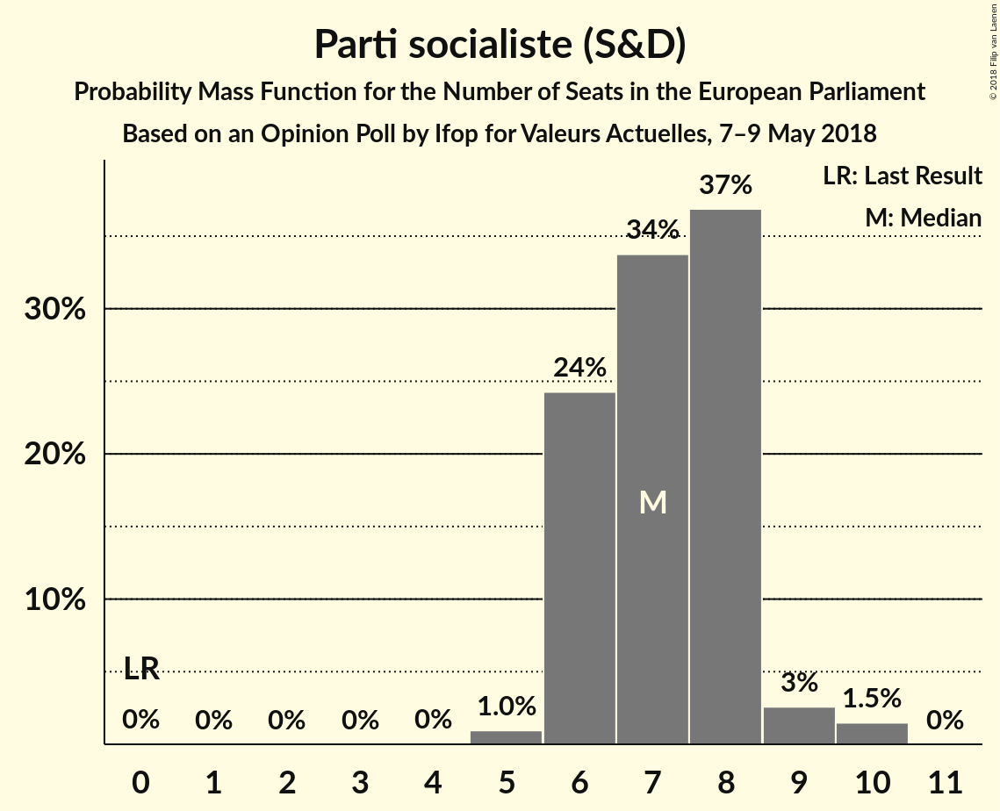

| Number of Seats | Probability | Accumulated | Special Marks |
|:---------------:|:-----------:|:-----------:|:-------------:|
| 0 | 0% | 100% | Last Result |
| 1 | 0% | 100% |  |
| 2 | 0% | 100% |  |
| 3 | 0% | 100% |  |
| 4 | 0% | 100% |  |
| 5 | 1.0% | 99.9% |  |
| 6 | 24% | 99.0% |  |
| 7 | 34% | 75% | Median |
| 8 | 37% | 41% |  |
| 9 | 3% | 4% |  |
| 10 | 1.5% | 2% |  |
| 11 | 0% | 0% |  |

### Debout la France (EFDD)

*For a full overview of the results for this party, see the [Debout la France (EFDD)](party-deboutlafranceefdd.html) page.*

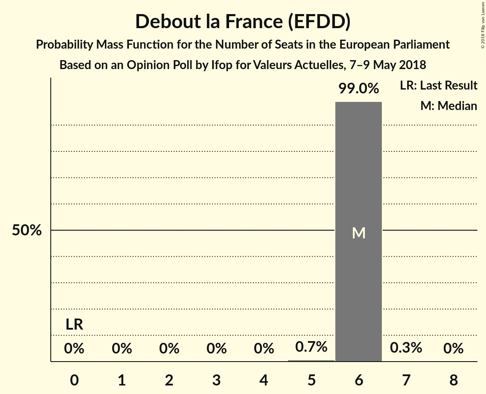

| Number of Seats | Probability | Accumulated | Special Marks |
|:---------------:|:-----------:|:-----------:|:-------------:|
| 0 | 21% | 100% | Last Result |
| 1 | 0% | 79% |  |
| 2 | 0% | 79% |  |
| 3 | 0% | 79% |  |
| 4 | 8% | 79% |  |
| 5 | 60% | 71% | Median |
| 6 | 8% | 12% |  |
| 7 | 3% | 3% |  |
| 8 | 0.6% | 0.8% |  |
| 9 | 0.2% | 0.2% |  |
| 10 | 0% | 0% |  |

### Europe Écologie Les Verts (Greens/EFA)

*For a full overview of the results for this party, see the [Europe Écologie Les Verts (Greens/EFA)](party-europeécologielesvertsgreensefa.html) page.*

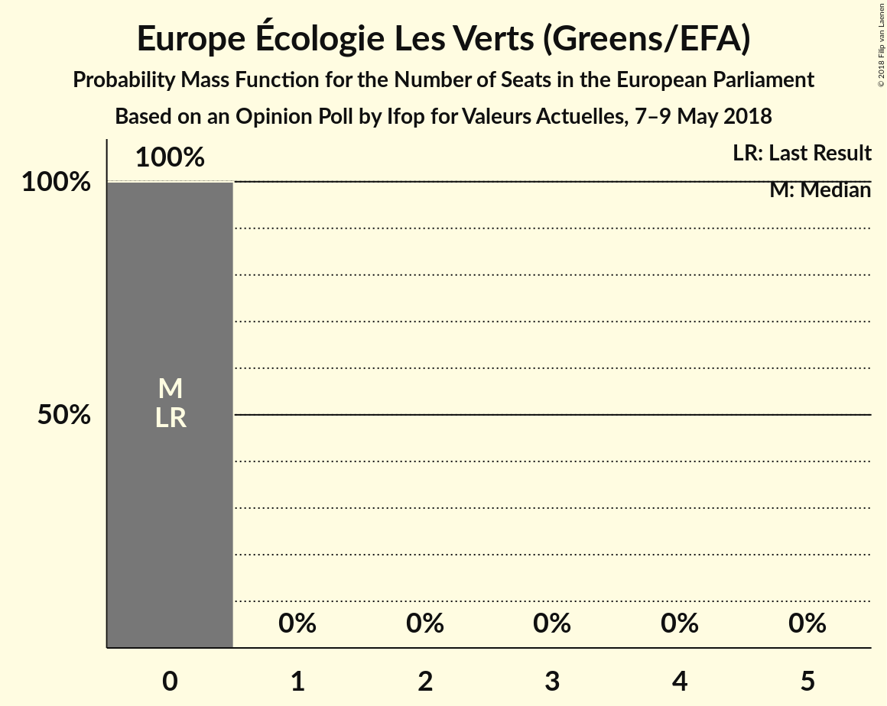

| Number of Seats | Probability | Accumulated | Special Marks |
|:---------------:|:-----------:|:-----------:|:-------------:|
| 0 | 85% | 100% | Last Result, Median |
| 1 | 0% | 15% |  |
| 2 | 0% | 15% |  |
| 3 | 0% | 15% |  |
| 4 | 0.9% | 15% |  |
| 5 | 14% | 14% |  |
| 6 | 0% | 0% |  |

### Agir, la droite constructive–Union des démocrates et indépendants (ALDE)

*For a full overview of the results for this party, see the [Agir, la droite constructive–Union des démocrates et indépendants (ALDE)](party-agirladroiteconstructive–uniondesdémocratesetindépendantsalde.html) page.*

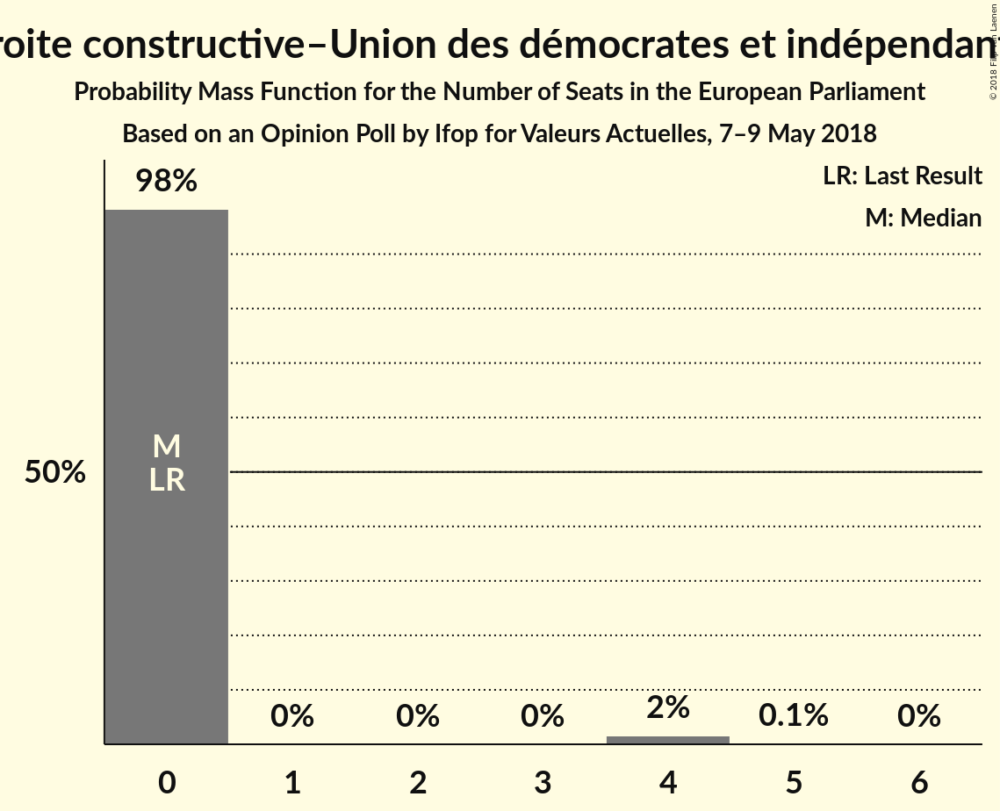

| Number of Seats | Probability | Accumulated | Special Marks |
|:---------------:|:-----------:|:-----------:|:-------------:|
| 0 | 88% | 100% | Last Result, Median |
| 1 | 0% | 12% |  |
| 2 | 0% | 12% |  |
| 3 | 0% | 12% |  |
| 4 | 12% | 12% |  |
| 5 | 0% | 0% |  |

### Parti communiste français (GUE/NGL)

*For a full overview of the results for this party, see the [Parti communiste français (GUE/NGL)](party-particommunistefrançaisguengl.html) page.*

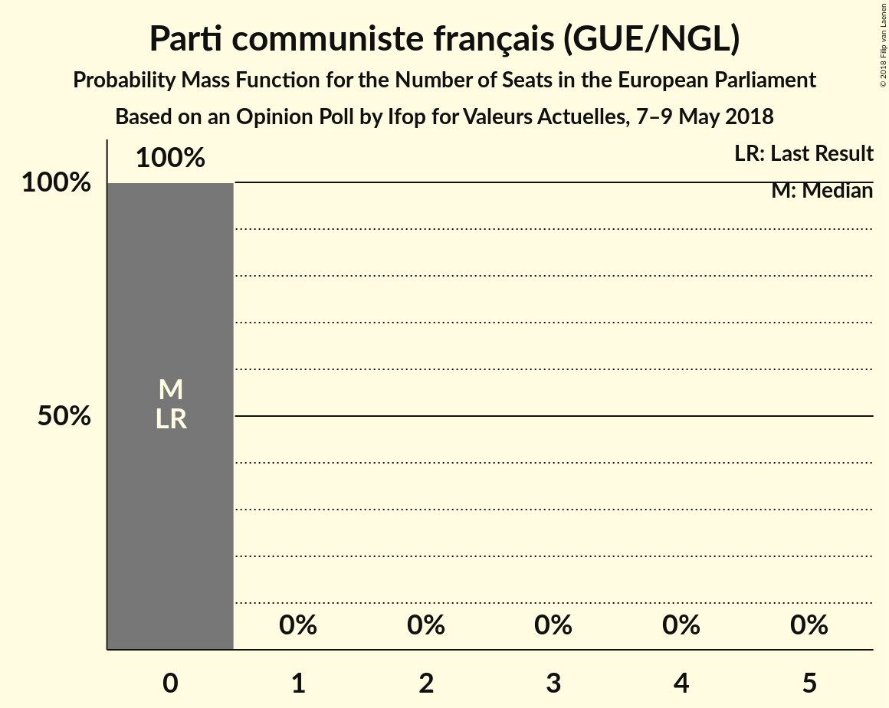

| Number of Seats | Probability | Accumulated | Special Marks |
|:---------------:|:-----------:|:-----------:|:-------------:|
| 0 | 100% | 100% | Last Result, Median |

### Les Patriotes (EFDD)

*For a full overview of the results for this party, see the [Les Patriotes (EFDD)](party-lespatriotesefdd.html) page.*

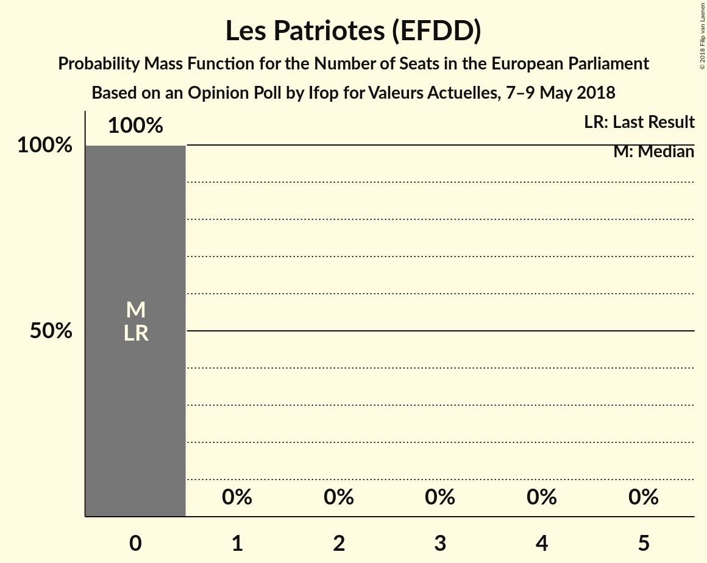

| Number of Seats | Probability | Accumulated | Special Marks |
|:---------------:|:-----------:|:-----------:|:-------------:|
| 0 | 100% | 100% | Last Result, Median |

### Union populaire républicaine (*)

*For a full overview of the results for this party, see the [Union populaire républicaine (*)](party-unionpopulairerépublicaine.html) page.*

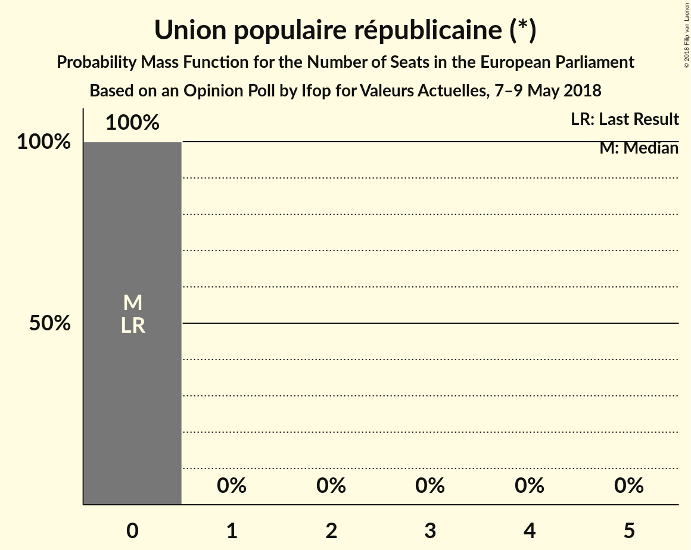

| Number of Seats | Probability | Accumulated | Special Marks |
|:---------------:|:-----------:|:-----------:|:-------------:|
| 0 | 100% | 100% | Last Result, Median |

## Coalitions

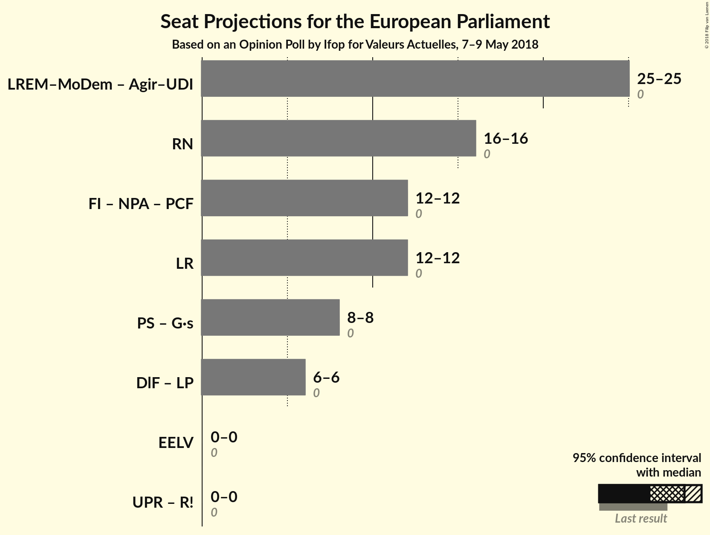

### Confidence Intervals

| Coalition | Last Result | Median | Majority? | 80% Confidence Interval | 90% Confidence Interval | 95% Confidence Interval | 99% Confidence Interval |
|:---------:|:-----------:|:------:|:---------:|:-----------------------:|:-----------------------:|:-----------------------:|:-----------------------:|
| La République en marche–Mouvement démocrate (ALDE) – Agir, la droite constructive–Union des démocrates et indépendants (ALDE) | 0 | 25 | 0% | 23–29 | 23–29 | 23–29 | 21–29 |
| Front national (ENF) | 0 | 15 | 0% | 13–18 | 13–18 | 13–19 | 12–21 |
| La France insoumise (GUE/NGL) – Parti communiste français (GUE/NGL) | 0 | 12 | 0% | 11–14 | 10–14 | 10–14 | 9–15 |
| Les Républicains (EPP) | 0 | 12 | 0% | 10–14 | 10–14 | 10–14 | 9–15 |
| Parti socialiste (S&D) | 0 | 7 | 0% | 6–8 | 6–8 | 6–9 | 5–10 |
| Debout la France (EFDD) – Les Patriotes (EFDD) | 0 | 5 | 0% | 0–6 | 0–6 | 0–7 | 0–8 |
| Europe Écologie Les Verts (Greens/EFA) | 0 | 0 | 0% | 0–5 | 0–5 | 0–5 | 0–5 |
| Union populaire républicaine (*) | 0 | 0 | 0% | 0 | 0 | 0 | 0 |

### La République en marche–Mouvement démocrate (ALDE) – Agir, la droite constructive–Union des démocrates et indépendants (ALDE)

| Number of Seats | Probability | Accumulated | Special Marks |
|:---------------:|:-----------:|:-----------:|:-------------:|
| 0 | 0% | 100% | Last Result |
| 1 | 0% | 100% |  |
| 2 | 0% | 100% |  |
| 3 | 0% | 100% |  |
| 4 | 0% | 100% |  |
| 5 | 0% | 100% |  |
| 6 | 0% | 100% |  |
| 7 | 0% | 100% |  |
| 8 | 0% | 100% |  |
| 9 | 0% | 100% |  |
| 10 | 0% | 100% |  |
| 11 | 0% | 100% |  |
| 12 | 0% | 100% |  |
| 13 | 0% | 100% |  |
| 14 | 0% | 100% |  |
| 15 | 0% | 100% |  |
| 16 | 0% | 100% |  |
| 17 | 0% | 100% |  |
| 18 | 0% | 100% |  |
| 19 | 0% | 100% |  |
| 20 | 0.1% | 100% |  |
| 21 | 1.3% | 99.9% |  |
| 22 | 0.9% | 98.6% |  |
| 23 | 18% | 98% |  |
| 24 | 9% | 80% |  |
| 25 | 30% | 71% | Median |
| 26 | 7% | 40% |  |
| 27 | 17% | 33% |  |
| 28 | 3% | 16% |  |
| 29 | 12% | 13% |  |
| 30 | 0.3% | 0.4% |  |
| 31 | 0% | 0.1% |  |
| 32 | 0% | 0% |  |

### Front national (ENF)

| Number of Seats | Probability | Accumulated | Special Marks |
|:---------------:|:-----------:|:-----------:|:-------------:|
| 0 | 0% | 100% | Last Result |
| 1 | 0% | 100% |  |
| 2 | 0% | 100% |  |
| 3 | 0% | 100% |  |
| 4 | 0% | 100% |  |
| 5 | 0% | 100% |  |
| 6 | 0% | 100% |  |
| 7 | 0% | 100% |  |
| 8 | 0% | 100% |  |
| 9 | 0% | 100% |  |
| 10 | 0% | 100% |  |
| 11 | 0% | 100% |  |
| 12 | 0.5% | 100% |  |
| 13 | 12% | 99.4% |  |
| 14 | 23% | 88% |  |
| 15 | 38% | 65% | Median |
| 16 | 3% | 27% |  |
| 17 | 12% | 24% |  |
| 18 | 8% | 12% |  |
| 19 | 2% | 4% |  |
| 20 | 0.1% | 2% |  |
| 21 | 1.5% | 1.5% |  |
| 22 | 0% | 0% |  |

### La France insoumise (GUE/NGL) – Parti communiste français (GUE/NGL)

| Number of Seats | Probability | Accumulated | Special Marks |
|:---------------:|:-----------:|:-----------:|:-------------:|
| 0 | 0% | 100% | Last Result |
| 1 | 0% | 100% |  |
| 2 | 0% | 100% |  |
| 3 | 0% | 100% |  |
| 4 | 0% | 100% |  |
| 5 | 0% | 100% |  |
| 6 | 0% | 100% |  |
| 7 | 0% | 100% |  |
| 8 | 0.1% | 100% |  |
| 9 | 0.6% | 99.9% |  |
| 10 | 7% | 99.4% |  |
| 11 | 35% | 93% |  |
| 12 | 27% | 58% | Median |
| 13 | 18% | 30% |  |
| 14 | 11% | 12% |  |
| 15 | 0.9% | 0.9% |  |
| 16 | 0% | 0% |  |

### Les Républicains (EPP)

| Number of Seats | Probability | Accumulated | Special Marks |
|:---------------:|:-----------:|:-----------:|:-------------:|
| 0 | 0% | 100% | Last Result |
| 1 | 0% | 100% |  |
| 2 | 0% | 100% |  |
| 3 | 0% | 100% |  |
| 4 | 0% | 100% |  |
| 5 | 0% | 100% |  |
| 6 | 0% | 100% |  |
| 7 | 0% | 100% |  |
| 8 | 0.2% | 100% |  |
| 9 | 1.0% | 99.8% |  |
| 10 | 13% | 98.8% |  |
| 11 | 27% | 86% |  |
| 12 | 38% | 58% | Median |
| 13 | 7% | 20% |  |
| 14 | 11% | 13% |  |
| 15 | 2% | 2% |  |
| 16 | 0% | 0.1% |  |
| 17 | 0% | 0% |  |

### Parti socialiste (S&D)

| Number of Seats | Probability | Accumulated | Special Marks |
|:---------------:|:-----------:|:-----------:|:-------------:|
| 0 | 0% | 100% | Last Result |
| 1 | 0% | 100% |  |
| 2 | 0% | 100% |  |
| 3 | 0% | 100% |  |
| 4 | 0% | 100% |  |
| 5 | 1.0% | 99.9% |  |
| 6 | 24% | 99.0% |  |
| 7 | 34% | 75% | Median |
| 8 | 37% | 41% |  |
| 9 | 3% | 4% |  |
| 10 | 1.5% | 2% |  |
| 11 | 0% | 0% |  |

### Debout la France (EFDD) – Les Patriotes (EFDD)

| Number of Seats | Probability | Accumulated | Special Marks |
|:---------------:|:-----------:|:-----------:|:-------------:|
| 0 | 21% | 100% | Last Result |
| 1 | 0% | 79% |  |
| 2 | 0% | 79% |  |
| 3 | 0% | 79% |  |
| 4 | 8% | 79% |  |
| 5 | 60% | 71% | Median |
| 6 | 8% | 12% |  |
| 7 | 3% | 3% |  |
| 8 | 0.6% | 0.8% |  |
| 9 | 0.2% | 0.2% |  |
| 10 | 0% | 0% |  |

### Europe Écologie Les Verts (Greens/EFA)

| Number of Seats | Probability | Accumulated | Special Marks |
|:---------------:|:-----------:|:-----------:|:-------------:|
| 0 | 85% | 100% | Last Result, Median |
| 1 | 0% | 15% |  |
| 2 | 0% | 15% |  |
| 3 | 0% | 15% |  |
| 4 | 0.9% | 15% |  |
| 5 | 14% | 14% |  |
| 6 | 0% | 0% |  |

### Union populaire républicaine (*)

| Number of Seats | Probability | Accumulated | Special Marks |
|:---------------:|:-----------:|:-----------:|:-------------:|
| 0 | 100% | 100% | Last Result, Median |

## Technical Information

### Opinion Poll

+ **Polling firm:** Ifop
+ **Commissioner(s):** Valeurs Actuelles
+ **Fieldwork period:** 7–9 May 2018

### Calculations

+ **Sample size:** 920
+ **Simulations done:** 131,072
+ **Error estimate:** 1.39%

