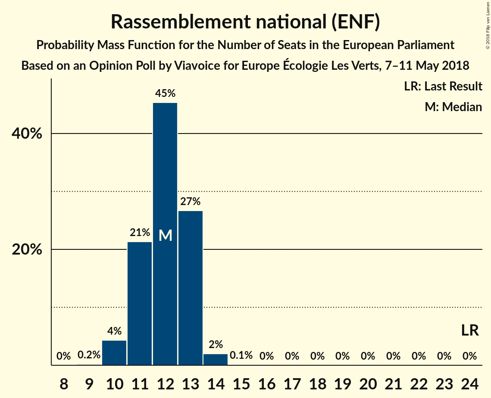
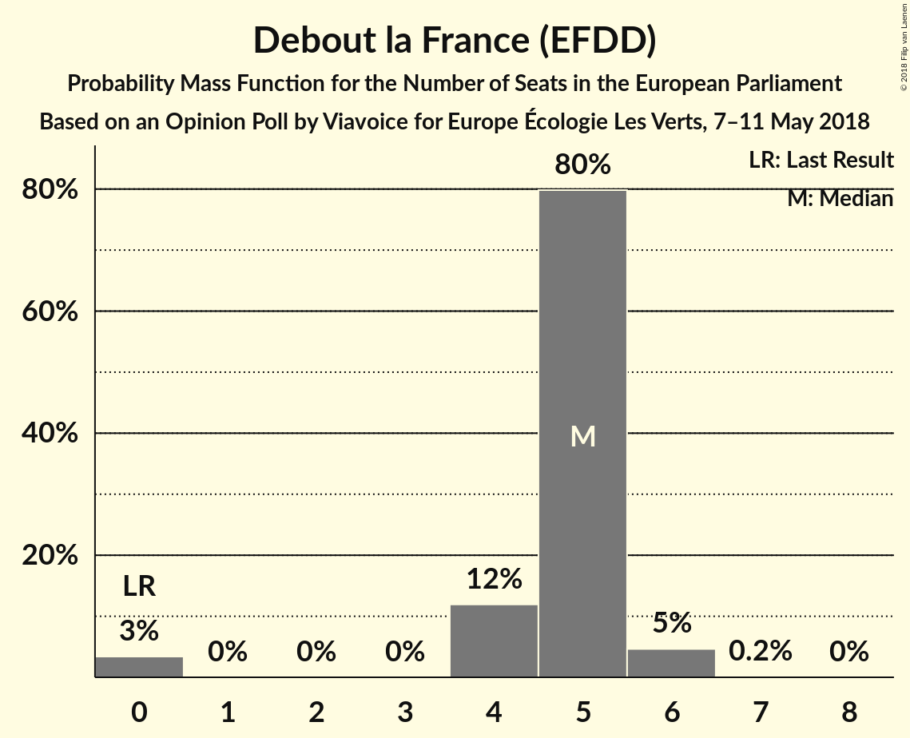
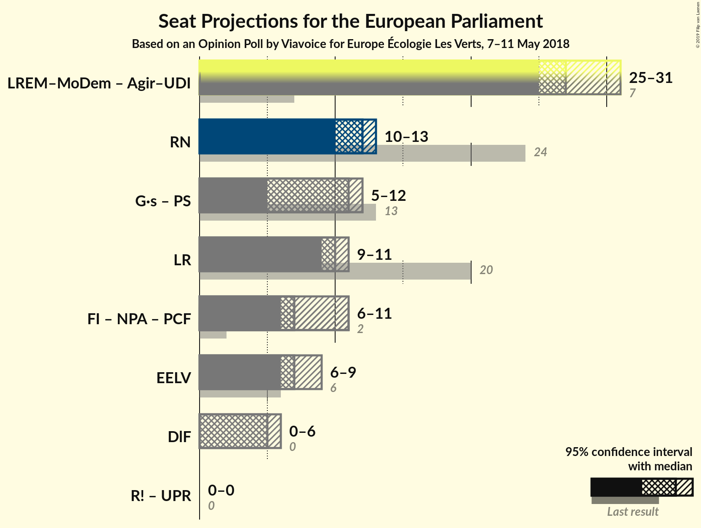

# Opinion Poll by Viavoice for Europe Écologie Les Verts, 7–11 May 2018

<a href="#voting-intentions">Voting Intentions</a> | <a href="#seats">Seats</a> | <a href="#coalitions">Coalitions</a> | <a href="#technical-information">Technical Information</a>

## Voting Intentions

### Confidence Intervals

| Party | Last Result | Poll Result | 80% Confidence Interval | 90% Confidence Interval | 95% Confidence Interval | 99% Confidence Interval |
|:-----:|:-----------:|:-----------:|:-----------------------:|:-----------------------:|:-----------------------:|:-----------------------:|
| La République en marche–Mouvement démocrate (ALDE) | 9.9% | 32.0% | 30.5–33.6% |30.1–34.0% |29.7–34.4% |29.0–35.2% |
| Rassemblement national (ENF) | 24.9% | 14.0% | 12.9–15.2% |12.6–15.6% |12.3–15.9% |11.8–16.5% |
| Les Républicains (EPP) | 20.8% | 12.0% | 11.0–13.2% |10.7–13.5% |10.5–13.8% |10.0–14.3% |
| La France insoumise (GUE/NGL) | 6.6% | 9.0% | 8.1–10.0% |7.9–10.3% |7.7–10.6% |7.3–11.1% |
| Europe Écologie Les Verts (Greens/EFA) | 9.0% | 9.0% | 8.1–10.0% |7.9–10.3% |7.7–10.6% |7.3–11.1% |
| Génération·s, le mouvement (S&D) | 0.0% | 7.0% | 6.2–7.9% |6.0–8.2% |5.8–8.4% |5.4–8.8% |
| Parti socialiste (S&D) | 14.0% | 6.0% | 5.3–6.8% |5.1–7.1% |4.9–7.3% |4.6–7.7% |
| Debout la France (EFDD) | 0.0% | 6.0% | 5.3–6.8% |5.1–7.1% |4.9–7.3% |4.6–7.7% |
| Nouveau Parti anticapitaliste (GUE/NGL) | 0.0% | 4.0% | 3.4–4.7% |3.2–4.9% |3.1–5.1% |2.9–5.5% |
| Parti communiste français (GUE/NGL) | 6.6% | 1.0% | 0.7–1.4% |0.7–1.5% |0.6–1.6% |0.5–1.9% |

*Note:* The poll result column reflects the actual value used in the calculations. Published results may vary slightly, and in addition be rounded to fewer digits.

## Seats

### Confidence Intervals

| Party | Last Result | Median | 80% Confidence Interval | 90% Confidence Interval | 95% Confidence Interval | 99% Confidence Interval |
|:-----:|:-----------:|:------:|:-----------------------:|:-----------------------:|:-----------------------:|:-----------------------:|
| <a href="#la-république-en-marche–mouvement-démocrate-(alde)">La République en marche–Mouvement démocrate (ALDE)</a> | 7 | 27 | 26–29 |26–31 |25–31 |25–31 |
| <a href="#rassemblement-national-(enf)">Rassemblement national (ENF)</a> | 24 | 12 | 11–13 |11–13 |10–13 |10–14 |
| <a href="#les-républicains-(epp)">Les Républicains (EPP)</a> | 20 | 10 | 9–11 |9–11 |9–11 |8–12 |
| <a href="#la-france-insoumise-(gue/ngl)">La France insoumise (GUE/NGL)</a> | 1 | 7 | 6–8 |6–9 |6–9 |6–10 |
| <a href="#europe-écologie-les-verts-(greens/efa)">Europe Écologie Les Verts (Greens/EFA)</a> | 6 | 7 | 7–8 |6–9 |6–9 |6–10 |
| <a href="#génération·s,-le-mouvement-(s&d)">Génération·s, le mouvement (S&D)</a> | 0 | 6 | 5–6 |5–7 |5–7 |4–7 |
| <a href="#parti-socialiste-(s&d)">Parti socialiste (S&D)</a> | 13 | 5 | 4–6 |0–6 |0–6 |0–6 |
| <a href="#debout-la-france-(efdd)">Debout la France (EFDD)</a> | 0 | 5 | 4–5 |4–5 |0–6 |0–6 |
| <a href="#nouveau-parti-anticapitaliste-(gue/ngl)">Nouveau Parti anticapitaliste (GUE/NGL)</a> | 0 | 0 | 0 |0 |0–4 |0–4 |
| <a href="#parti-communiste-français-(gue/ngl)">Parti communiste français (GUE/NGL)</a> | 1 | 0 | 0 |0 |0 |0 |

### La République en marche–Mouvement démocrate (ALDE)

*For a full overview of the results for this party, see the [La République en marche–Mouvement démocrate (ALDE)](party-larépubliqueenmarche–mouvementdémocratealde.html) page.*

| Number of Seats | Probability | Accumulated | Special Marks |
|:---------------:|:-----------:|:-----------:|:-------------:|
| 7 | 0% | 100% | Last Result |
| 8 | 0% | 100% |  |
| 9 | 0% | 100% |  |
| 10 | 0% | 100% |  |
| 11 | 0% | 100% |  |
| 12 | 0% | 100% |  |
| 13 | 0% | 100% |  |
| 14 | 0% | 100% |  |
| 15 | 0% | 100% |  |
| 16 | 0% | 100% |  |
| 17 | 0% | 100% |  |
| 18 | 0% | 100% |  |
| 19 | 0% | 100% |  |
| 20 | 0% | 100% |  |
| 21 | 0% | 100% |  |
| 22 | 0% | 100% |  |
| 23 | 0% | 100% |  |
| 24 | 0.1% | 100% |  |
| 25 | 4% | 99.9% |  |
| 26 | 40% | 96% |  |
| 27 | 27% | 56% | Median |
| 28 | 12% | 29% |  |
| 29 | 10% | 17% |  |
| 30 | 2% | 7% |  |
| 31 | 5% | 5% |  |
| 32 | 0% | 0% |  |

### Rassemblement national (ENF)

*For a full overview of the results for this party, see the [Rassemblement national (ENF)](party-rassemblementnationalenf.html) page.*

| Number of Seats | Probability | Accumulated | Special Marks |
|:---------------:|:-----------:|:-----------:|:-------------:|
| 9 | 0.2% | 100% |  |
| 10 | 4% | 99.8% |  |
| 11 | 21% | 96% |  |
| 12 | 45% | 74% | Median |
| 13 | 27% | 29% |  |
| 14 | 2% | 2% |  |
| 15 | 0.1% | 0.1% |  |
| 16 | 0% | 0% |  |
| 17 | 0% | 0% |  |
| 18 | 0% | 0% |  |
| 19 | 0% | 0% |  |
| 20 | 0% | 0% |  |
| 21 | 0% | 0% |  |
| 22 | 0% | 0% |  |
| 23 | 0% | 0% |  |
| 24 | 0% | 0% | Last Result |

### Les Républicains (EPP)

*For a full overview of the results for this party, see the [Les Républicains (EPP)](party-lesrépublicainsepp.html) page.*

| Number of Seats | Probability | Accumulated | Special Marks |
|:---------------:|:-----------:|:-----------:|:-------------:|
| 8 | 0.8% | 100% |  |
| 9 | 11% | 99.2% |  |
| 10 | 75% | 88% | Median |
| 11 | 12% | 14% |  |
| 12 | 1.2% | 2% |  |
| 13 | 0.5% | 0.5% |  |
| 14 | 0% | 0% |  |
| 15 | 0% | 0% |  |
| 16 | 0% | 0% |  |
| 17 | 0% | 0% |  |
| 18 | 0% | 0% |  |
| 19 | 0% | 0% |  |
| 20 | 0% | 0% | Last Result |

### La France insoumise (GUE/NGL)

*For a full overview of the results for this party, see the [La France insoumise (GUE/NGL)](party-lafranceinsoumiseguengl.html) page.*

| Number of Seats | Probability | Accumulated | Special Marks |
|:---------------:|:-----------:|:-----------:|:-------------:|
| 1 | 0% | 100% | Last Result |
| 2 | 0% | 100% |  |
| 3 | 0% | 100% |  |
| 4 | 0% | 100% |  |
| 5 | 0.1% | 100% |  |
| 6 | 16% | 99.9% |  |
| 7 | 56% | 83% | Median |
| 8 | 22% | 27% |  |
| 9 | 4% | 5% |  |
| 10 | 0.8% | 0.8% |  |
| 11 | 0% | 0% |  |

### Europe Écologie Les Verts (Greens/EFA)

*For a full overview of the results for this party, see the [Europe Écologie Les Verts (Greens/EFA)](party-europeécologielesvertsgreensefa.html) page.*

| Number of Seats | Probability | Accumulated | Special Marks |
|:---------------:|:-----------:|:-----------:|:-------------:|
| 5 | 0.1% | 100% |  |
| 6 | 5% | 99.9% | Last Result |
| 7 | 71% | 95% | Median |
| 8 | 15% | 24% |  |
| 9 | 7% | 9% |  |
| 10 | 2% | 2% |  |
| 11 | 0% | 0% |  |

### Génération·s, le mouvement (S&D)

*For a full overview of the results for this party, see the [Génération·s, le mouvement (S&D)](party-génération·slemouvementsd.html) page.*

| Number of Seats | Probability | Accumulated | Special Marks |
|:---------------:|:-----------:|:-----------:|:-------------:|
| 0 | 0% | 100% | Last Result |
| 1 | 0% | 100% |  |
| 2 | 0% | 100% |  |
| 3 | 0% | 100% |  |
| 4 | 2% | 100% |  |
| 5 | 34% | 98% |  |
| 6 | 57% | 64% | Median |
| 7 | 7% | 7% |  |
| 8 | 0.1% | 0.1% |  |
| 9 | 0% | 0% |  |

### Parti socialiste (S&D)

*For a full overview of the results for this party, see the [Parti socialiste (S&D)](party-partisocialistesd.html) page.*

| Number of Seats | Probability | Accumulated | Special Marks |
|:---------------:|:-----------:|:-----------:|:-------------:|
| 0 | 9% | 100% |  |
| 1 | 0% | 91% |  |
| 2 | 0% | 91% |  |
| 3 | 0% | 91% |  |
| 4 | 7% | 91% |  |
| 5 | 50% | 84% | Median |
| 6 | 34% | 34% |  |
| 7 | 0.1% | 0.1% |  |
| 8 | 0% | 0% |  |
| 9 | 0% | 0% |  |
| 10 | 0% | 0% |  |
| 11 | 0% | 0% |  |
| 12 | 0% | 0% |  |
| 13 | 0% | 0% | Last Result |

### Debout la France (EFDD)

*For a full overview of the results for this party, see the [Debout la France (EFDD)](party-deboutlafranceefdd.html) page.*

| Number of Seats | Probability | Accumulated | Special Marks |
|:---------------:|:-----------:|:-----------:|:-------------:|
| 0 | 3% | 100% | Last Result |
| 1 | 0% | 97% |  |
| 2 | 0% | 97% |  |
| 3 | 0% | 97% |  |
| 4 | 12% | 97% |  |
| 5 | 80% | 85% | Median |
| 6 | 5% | 5% |  |
| 7 | 0.2% | 0.2% |  |
| 8 | 0% | 0% |  |

### Nouveau Parti anticapitaliste (GUE/NGL)

*For a full overview of the results for this party, see the [Nouveau Parti anticapitaliste (GUE/NGL)](party-nouveaupartianticapitalisteguengl.html) page.*

| Number of Seats | Probability | Accumulated | Special Marks |
|:---------------:|:-----------:|:-----------:|:-------------:|
| 0 | 97% | 100% | Last Result, Median |
| 1 | 0% | 3% |  |
| 2 | 0% | 3% |  |
| 3 | 0% | 3% |  |
| 4 | 3% | 3% |  |
| 5 | 0.1% | 0.1% |  |
| 6 | 0% | 0% |  |

### Parti communiste français (GUE/NGL)

*For a full overview of the results for this party, see the [Parti communiste français (GUE/NGL)](party-particommunistefrançaisguengl.html) page.*

| Number of Seats | Probability | Accumulated | Special Marks |
|:---------------:|:-----------:|:-----------:|:-------------:|
| 0 | 100% | 100% | Median |
| 1 | 0% | 0% | Last Result |

## Coalitions

### Confidence Intervals

| Coalition | Last Result | Median | Majority? | 80% Confidence Interval | 90% Confidence Interval | 95% Confidence Interval | 99% Confidence Interval |
|:---------:|:-----------:|:------:|:---------:|:-----------------------:|:-----------------------:|:-----------------------:|:-----------------------:|
| Rassemblement national (ENF) | 24 | 12 | 0% | 11–13 | 11–13 | 10–13 | 10–14 |
| Génération·s, le mouvement (S&D) – Parti socialiste (S&D) | 13 | 11 | 0% | 9–12 | 6–12 | 5–12 | 5–12 |
| Les Républicains (EPP) | 20 | 10 | 0% | 9–11 | 9–11 | 9–11 | 8–12 |
| La France insoumise (GUE/NGL) – Nouveau Parti anticapitaliste (GUE/NGL) – Parti communiste français (GUE/NGL) | 2 | 7 | 0% | 6–8 | 6–9 | 6–11 | 6–11 |
| Europe Écologie Les Verts (Greens/EFA) | 6 | 7 | 0% | 7–8 | 6–9 | 6–9 | 6–10 |

### Rassemblement national (ENF)

| Number of Seats | Probability | Accumulated | Special Marks |
|:---------------:|:-----------:|:-----------:|:-------------:|
| 9 | 0.2% | 100% |  |
| 10 | 4% | 99.8% |  |
| 11 | 21% | 96% |  |
| 12 | 45% | 74% | Median |
| 13 | 27% | 29% |  |
| 14 | 2% | 2% |  |
| 15 | 0.1% | 0.1% |  |
| 16 | 0% | 0% |  |
| 17 | 0% | 0% |  |
| 18 | 0% | 0% |  |
| 19 | 0% | 0% |  |
| 20 | 0% | 0% |  |
| 21 | 0% | 0% |  |
| 22 | 0% | 0% |  |
| 23 | 0% | 0% |  |
| 24 | 0% | 0% | Last Result |

### Génération·s, le mouvement (S&D) – Parti socialiste (S&D)

| Number of Seats | Probability | Accumulated | Special Marks |
|:---------------:|:-----------:|:-----------:|:-------------:|
| 5 | 4% | 100% |  |
| 6 | 4% | 96% |  |
| 7 | 0.5% | 92% |  |
| 8 | 0.1% | 91% |  |
| 9 | 7% | 91% |  |
| 10 | 25% | 84% |  |
| 11 | 21% | 59% | Median |
| 12 | 38% | 38% |  |
| 13 | 0.2% | 0.3% | Last Result |
| 14 | 0.1% | 0.1% |  |
| 15 | 0% | 0% |  |

### Les Républicains (EPP)

| Number of Seats | Probability | Accumulated | Special Marks |
|:---------------:|:-----------:|:-----------:|:-------------:|
| 8 | 0.8% | 100% |  |
| 9 | 11% | 99.2% |  |
| 10 | 75% | 88% | Median |
| 11 | 12% | 14% |  |
| 12 | 1.2% | 2% |  |
| 13 | 0.5% | 0.5% |  |
| 14 | 0% | 0% |  |
| 15 | 0% | 0% |  |
| 16 | 0% | 0% |  |
| 17 | 0% | 0% |  |
| 18 | 0% | 0% |  |
| 19 | 0% | 0% |  |
| 20 | 0% | 0% | Last Result |

### La France insoumise (GUE/NGL) – Nouveau Parti anticapitaliste (GUE/NGL) – Parti communiste français (GUE/NGL)

| Number of Seats | Probability | Accumulated | Special Marks |
|:---------------:|:-----------:|:-----------:|:-------------:|
| 2 | 0% | 100% | Last Result |
| 3 | 0% | 100% |  |
| 4 | 0% | 100% |  |
| 5 | 0.1% | 100% |  |
| 6 | 16% | 99.9% |  |
| 7 | 54% | 84% | Median |
| 8 | 22% | 30% |  |
| 9 | 4% | 8% |  |
| 10 | 1.2% | 4% |  |
| 11 | 3% | 3% |  |
| 12 | 0.2% | 0.2% |  |
| 13 | 0% | 0% |  |

### Europe Écologie Les Verts (Greens/EFA)

| Number of Seats | Probability | Accumulated | Special Marks |
|:---------------:|:-----------:|:-----------:|:-------------:|
| 5 | 0.1% | 100% |  |
| 6 | 5% | 99.9% | Last Result |
| 7 | 71% | 95% | Median |
| 8 | 15% | 24% |  |
| 9 | 7% | 9% |  |
| 10 | 2% | 2% |  |
| 11 | 0% | 0% |  |

## Technical Information

### Opinion Poll

+ **Polling firm:** Viavoice
+ **Commissioner(s):** Europe Écologie Les Verts
+ **Fieldwork period:** 7–11 May 2018

### Calculations

+ **Sample size:** 1506
+ **Simulations done:** 1,048,576
+ **Error estimate:** 1.65%

