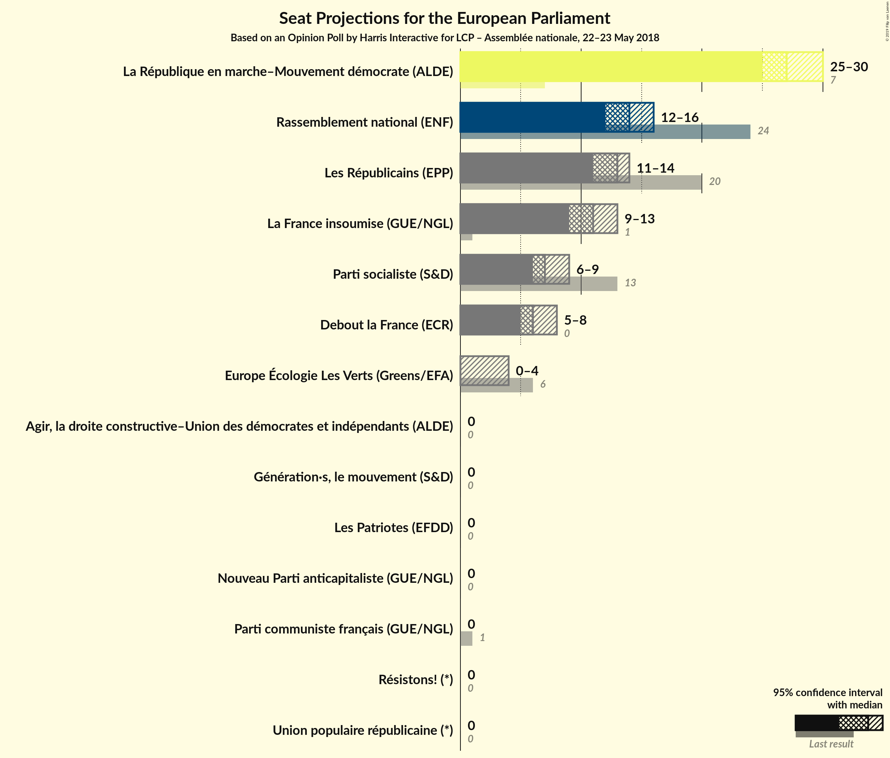
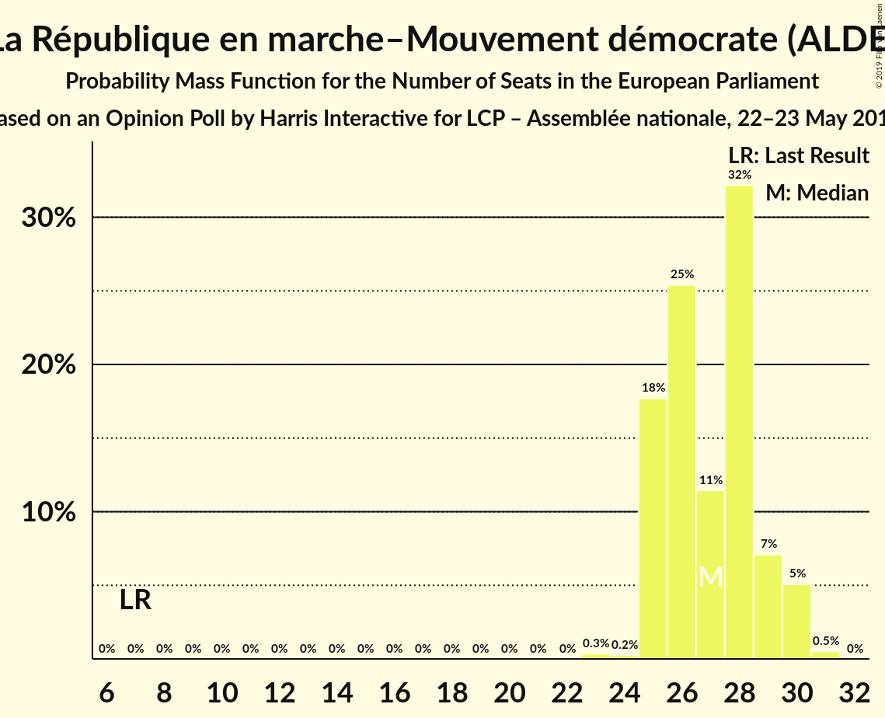
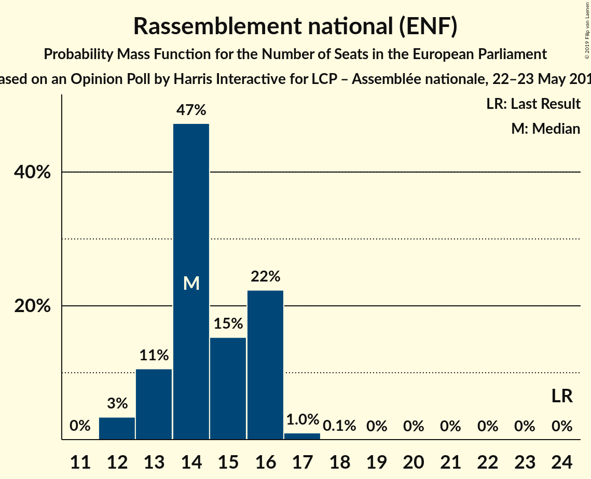
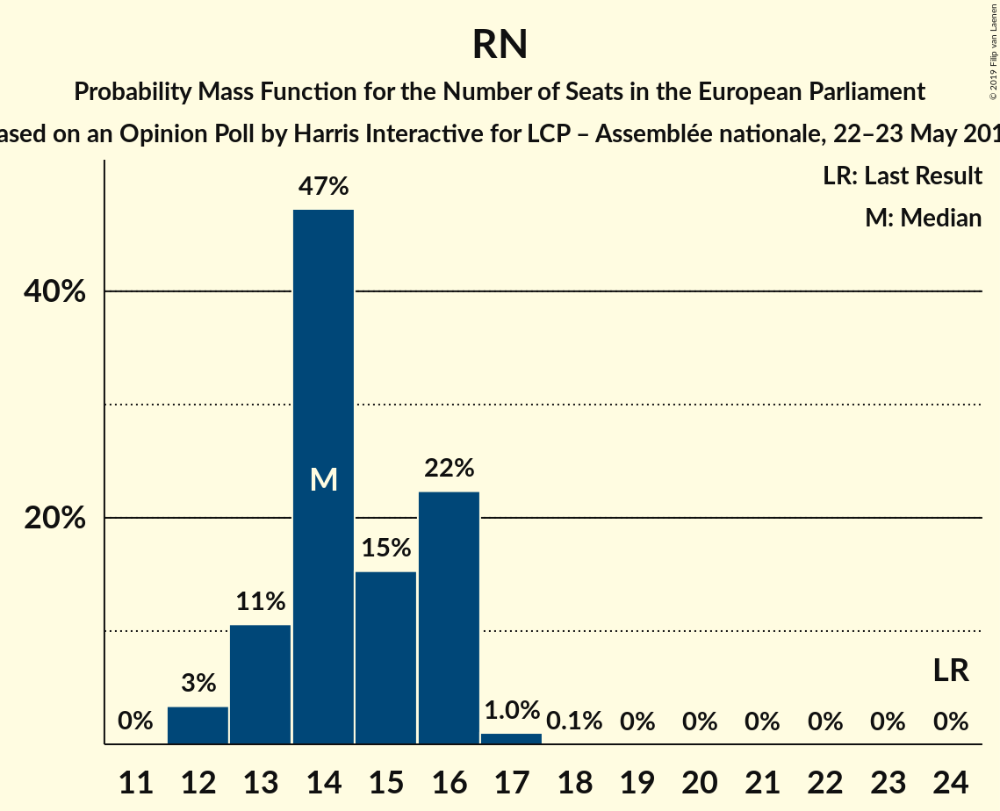
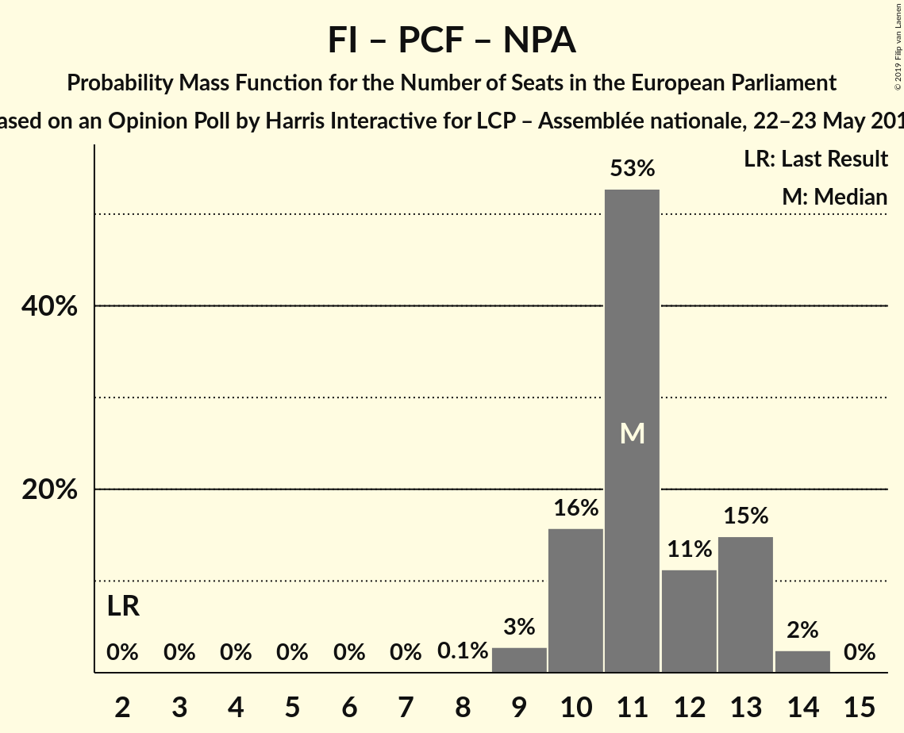
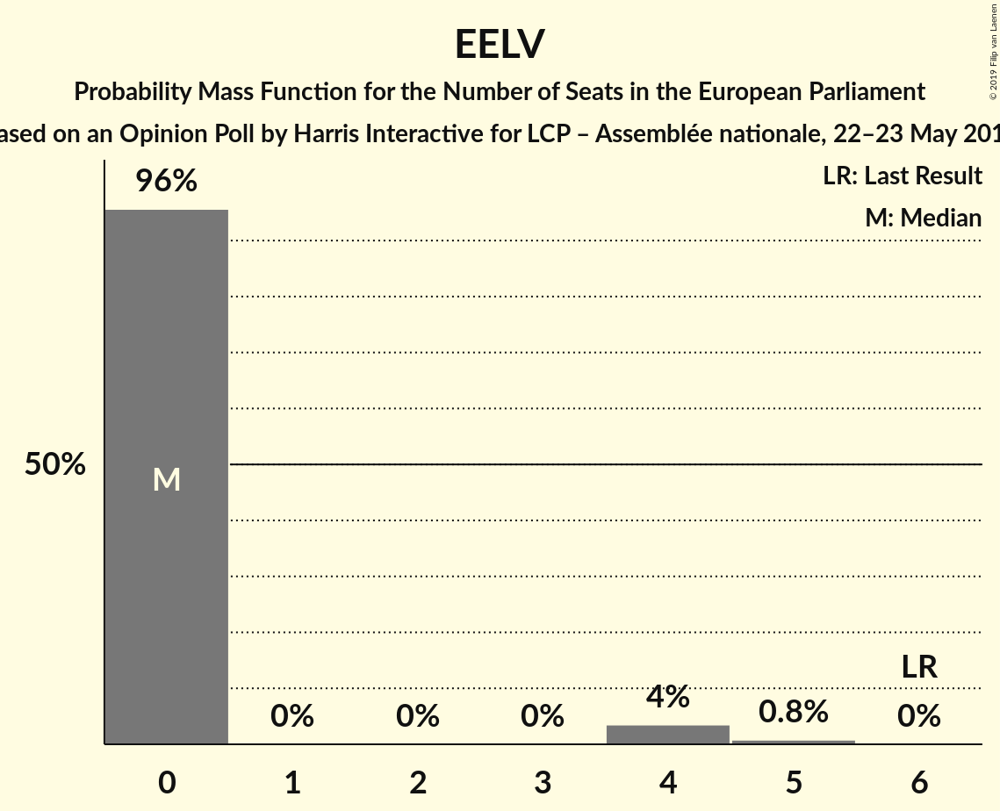

# Opinion Poll by Harris Interactive for LCP – Assemblée nationale, 22–23 May 2018

<a href="#voting-intentions">Voting Intentions</a> | <a href="#seats">Seats</a> | <a href="#coalitions">Coalitions</a> | <a href="#technical-information">Technical Information</a>

## Voting Intentions

### Confidence Intervals

| Party | Last Result | Poll Result | 80% Confidence Interval | 90% Confidence Interval | 95% Confidence Interval | 99% Confidence Interval |
|:-----:|:-----------:|:-----------:|:-----------------------:|:-----------------------:|:-----------------------:|:-----------------------:|
| La République en marche–Mouvement démocrate (ALDE) | 9.9% | 28.0% | 26.6–29.4% |26.2–29.8% |25.9–30.2% |25.2–30.9% |
| Rassemblement national (ENF) | 24.9% | 15.0% | 13.9–16.2% |13.6–16.5% |13.4–16.8% |12.9–17.4% |
| Les Républicains (EPP) | 20.8% | 13.0% | 12.0–14.1% |11.7–14.4% |11.4–14.7% |11.0–15.2% |
| La France insoumise (GUE/NGL) | 6.6% | 12.0% | 11.1–13.1% |10.8–13.4% |10.5–13.7% |10.1–14.2% |
| Parti socialiste (S&D) | 14.0% | 8.0% | 7.2–8.9% |7.0–9.2% |6.8–9.4% |6.4–9.9% |
| Debout la France (EFDD) | 0.0% | 7.0% | 6.2–7.9% |6.0–8.1% |5.9–8.3% |5.5–8.8% |
| Europe Écologie Les Verts (Greens/EFA) | 9.0% | 4.0% | 3.4–4.7% |3.3–4.9% |3.2–5.1% |2.9–5.4% |
| Parti communiste français (GUE/NGL) | 6.6% | 2.0% | 1.6–2.5% |1.5–2.6% |1.4–2.8% |1.2–3.0% |
| Génération·s, le mouvement (S&D) | 0.0% | 2.0% | 1.6–2.5% |1.5–2.6% |1.4–2.8% |1.2–3.0% |
| Agir, la droite constructive–Union des démocrates et indépendants (ALDE) | 2.0% | 2.0% | 1.6–2.5% |1.5–2.6% |1.4–2.8% |1.2–3.0% |
| Nouveau Parti anticapitaliste (GUE/NGL) | 0.0% | 1.0% | 0.8–1.4% |0.7–1.5% |0.6–1.6% |0.5–1.8% |
| Résistons! (*) | 0.0% | 1.0% | 0.8–1.4% |0.7–1.5% |0.6–1.6% |0.5–1.8% |
| Les Patriotes (EFDD) | 0.0% | 1.0% | 0.8–1.4% |0.7–1.5% |0.6–1.6% |0.5–1.8% |
| Union populaire républicaine (*) | 0.0% | 1.0% | 0.8–1.4% |0.7–1.5% |0.6–1.6% |0.5–1.8% |

*Note:* The poll result column reflects the actual value used in the calculations. Published results may vary slightly, and in addition be rounded to fewer digits.

## Seats

### Confidence Intervals

| Party | Last Result | Median | 80% Confidence Interval | 90% Confidence Interval | 95% Confidence Interval | 99% Confidence Interval |
|:-----:|:-----------:|:------:|:-----------------------:|:-----------------------:|:-----------------------:|:-----------------------:|
| <a href="#la-république-en-marche–mouvement-démocrate-(alde)">La République en marche–Mouvement démocrate (ALDE)</a> | 7 | 27 | 25–29 |25–30 |25–30 |24–31 |
| <a href="#rassemblement-national-(enf)">Rassemblement national (ENF)</a> | 24 | 14 | 13–16 |13–16 |12–16 |12–17 |
| <a href="#les-républicains-(epp)">Les Républicains (EPP)</a> | 20 | 13 | 11–13 |11–13 |11–14 |10–14 |
| <a href="#la-france-insoumise-(gue/ngl)">La France insoumise (GUE/NGL)</a> | 1 | 11 | 10–13 |10–13 |9–13 |9–14 |
| <a href="#parti-socialiste-(s&d)">Parti socialiste (S&D)</a> | 13 | 7 | 7–9 |6–9 |6–9 |6–9 |
| <a href="#debout-la-france-(efdd)">Debout la France (EFDD)</a> | 0 | 6 | 6–7 |5–8 |5–8 |5–8 |
| <a href="#europe-écologie-les-verts-(greens/efa)">Europe Écologie Les Verts (Greens/EFA)</a> | 6 | 0 | 0 |0 |0–4 |0–5 |
| <a href="#parti-communiste-français-(gue/ngl)">Parti communiste français (GUE/NGL)</a> | 1 | 0 | 0 |0 |0 |0 |
| <a href="#génération·s,-le-mouvement-(s&d)">Génération·s, le mouvement (S&D)</a> | 0 | 0 | 0 |0 |0 |0 |
| <a href="#agir,-la-droite-constructive–union-des-démocrates-et-indépendants-(alde)">Agir, la droite constructive–Union des démocrates et indépendants (ALDE)</a> | 0 | 0 | 0 |0 |0 |0 |
| <a href="#nouveau-parti-anticapitaliste-(gue/ngl)">Nouveau Parti anticapitaliste (GUE/NGL)</a> | 0 | 0 | 0 |0 |0 |0 |
| <a href="#résistons!-(*)">Résistons! (*)</a> | 0 | 0 | 0 |0 |0 |0 |
| <a href="#les-patriotes-(efdd)">Les Patriotes (EFDD)</a> | 0 | 0 | 0 |0 |0 |0 |
| <a href="#union-populaire-républicaine-(*)">Union populaire républicaine (*)</a> | 0 | 0 | 0 |0 |0 |0 |

### La République en marche–Mouvement démocrate (ALDE)

*For a full overview of the results for this party, see the [La République en marche–Mouvement démocrate (ALDE)](party-larépubliqueenmarche–mouvementdémocratealde.html) page.*

| Number of Seats | Probability | Accumulated | Special Marks |
|:---------------:|:-----------:|:-----------:|:-------------:|
| 7 | 0% | 100% | Last Result |
| 8 | 0% | 100% |  |
| 9 | 0% | 100% |  |
| 10 | 0% | 100% |  |
| 11 | 0% | 100% |  |
| 12 | 0% | 100% |  |
| 13 | 0% | 100% |  |
| 14 | 0% | 100% |  |
| 15 | 0% | 100% |  |
| 16 | 0% | 100% |  |
| 17 | 0% | 100% |  |
| 18 | 0% | 100% |  |
| 19 | 0% | 100% |  |
| 20 | 0% | 100% |  |
| 21 | 0% | 100% |  |
| 22 | 0% | 100% |  |
| 23 | 0.3% | 100% |  |
| 24 | 0.2% | 99.7% |  |
| 25 | 18% | 99.4% |  |
| 26 | 25% | 82% |  |
| 27 | 11% | 56% | Median |
| 28 | 32% | 45% |  |
| 29 | 7% | 13% |  |
| 30 | 5% | 6% |  |
| 31 | 0.5% | 0.5% |  |
| 32 | 0% | 0% |  |

### Rassemblement national (ENF)

*For a full overview of the results for this party, see the [Rassemblement national (ENF)](party-rassemblementnationalenf.html) page.*

| Number of Seats | Probability | Accumulated | Special Marks |
|:---------------:|:-----------:|:-----------:|:-------------:|
| 12 | 3% | 100% |  |
| 13 | 11% | 97% |  |
| 14 | 47% | 86% | Median |
| 15 | 15% | 39% |  |
| 16 | 22% | 23% |  |
| 17 | 1.0% | 1.1% |  |
| 18 | 0.1% | 0.1% |  |
| 19 | 0% | 0% |  |
| 20 | 0% | 0% |  |
| 21 | 0% | 0% |  |
| 22 | 0% | 0% |  |
| 23 | 0% | 0% |  |
| 24 | 0% | 0% | Last Result |

### Les Républicains (EPP)

*For a full overview of the results for this party, see the [Les Républicains (EPP)](party-lesrépublicainsepp.html) page.*

| Number of Seats | Probability | Accumulated | Special Marks |
|:---------------:|:-----------:|:-----------:|:-------------:|
| 10 | 1.5% | 100% |  |
| 11 | 30% | 98.5% |  |
| 12 | 17% | 69% |  |
| 13 | 48% | 51% | Median |
| 14 | 3% | 3% |  |
| 15 | 0.1% | 0.1% |  |
| 16 | 0% | 0% |  |
| 17 | 0% | 0% |  |
| 18 | 0% | 0% |  |
| 19 | 0% | 0% |  |
| 20 | 0% | 0% | Last Result |

### La France insoumise (GUE/NGL)

*For a full overview of the results for this party, see the [La France insoumise (GUE/NGL)](party-lafranceinsoumiseguengl.html) page.*

| Number of Seats | Probability | Accumulated | Special Marks |
|:---------------:|:-----------:|:-----------:|:-------------:|
| 1 | 0% | 100% | Last Result |
| 2 | 0% | 100% |  |
| 3 | 0% | 100% |  |
| 4 | 0% | 100% |  |
| 5 | 0% | 100% |  |
| 6 | 0% | 100% |  |
| 7 | 0% | 100% |  |
| 8 | 0.1% | 100% |  |
| 9 | 3% | 99.9% |  |
| 10 | 16% | 97% |  |
| 11 | 53% | 81% | Median |
| 12 | 11% | 29% |  |
| 13 | 15% | 17% |  |
| 14 | 2% | 2% |  |
| 15 | 0% | 0% |  |

### Parti socialiste (S&D)

*For a full overview of the results for this party, see the [Parti socialiste (S&D)](party-partisocialistesd.html) page.*

| Number of Seats | Probability | Accumulated | Special Marks |
|:---------------:|:-----------:|:-----------:|:-------------:|
| 5 | 0.1% | 100% |  |
| 6 | 6% | 99.9% |  |
| 7 | 53% | 94% | Median |
| 8 | 17% | 42% |  |
| 9 | 24% | 24% |  |
| 10 | 0.1% | 0.1% |  |
| 11 | 0% | 0% |  |
| 12 | 0% | 0% |  |
| 13 | 0% | 0% | Last Result |

### Debout la France (EFDD)

*For a full overview of the results for this party, see the [Debout la France (EFDD)](party-deboutlafranceefdd.html) page.*

| Number of Seats | Probability | Accumulated | Special Marks |
|:---------------:|:-----------:|:-----------:|:-------------:|
| 0 | 0% | 100% | Last Result |
| 1 | 0% | 100% |  |
| 2 | 0% | 100% |  |
| 3 | 0% | 100% |  |
| 4 | 0% | 100% |  |
| 5 | 8% | 100% |  |
| 6 | 62% | 92% | Median |
| 7 | 25% | 30% |  |
| 8 | 5% | 5% |  |
| 9 | 0.3% | 0.3% |  |
| 10 | 0% | 0% |  |

### Europe Écologie Les Verts (Greens/EFA)

*For a full overview of the results for this party, see the [Europe Écologie Les Verts (Greens/EFA)](party-europeécologielesvertsgreensefa.html) page.*

| Number of Seats | Probability | Accumulated | Special Marks |
|:---------------:|:-----------:|:-----------:|:-------------:|
| 0 | 96% | 100% | Median |
| 1 | 0% | 4% |  |
| 2 | 0% | 4% |  |
| 3 | 0% | 4% |  |
| 4 | 4% | 4% |  |
| 5 | 0.8% | 0.8% |  |
| 6 | 0% | 0% | Last Result |

### Parti communiste français (GUE/NGL)

*For a full overview of the results for this party, see the [Parti communiste français (GUE/NGL)](party-particommunistefrançaisguengl.html) page.*

| Number of Seats | Probability | Accumulated | Special Marks |
|:---------------:|:-----------:|:-----------:|:-------------:|
| 0 | 100% | 100% | Median |
| 1 | 0% | 0% | Last Result |

### Génération·s, le mouvement (S&D)

*For a full overview of the results for this party, see the [Génération·s, le mouvement (S&D)](party-génération·slemouvementsd.html) page.*

| Number of Seats | Probability | Accumulated | Special Marks |
|:---------------:|:-----------:|:-----------:|:-------------:|
| 0 | 100% | 100% | Last Result, Median |

### Agir, la droite constructive–Union des démocrates et indépendants (ALDE)

*For a full overview of the results for this party, see the [Agir, la droite constructive–Union des démocrates et indépendants (ALDE)](party-agirladroiteconstructive–uniondesdémocratesetindépendantsalde.html) page.*

| Number of Seats | Probability | Accumulated | Special Marks |
|:---------------:|:-----------:|:-----------:|:-------------:|
| 0 | 100% | 100% | Last Result, Median |

### Nouveau Parti anticapitaliste (GUE/NGL)

*For a full overview of the results for this party, see the [Nouveau Parti anticapitaliste (GUE/NGL)](party-nouveaupartianticapitalisteguengl.html) page.*

| Number of Seats | Probability | Accumulated | Special Marks |
|:---------------:|:-----------:|:-----------:|:-------------:|
| 0 | 100% | 100% | Last Result, Median |

### Résistons! (*)

*For a full overview of the results for this party, see the [Résistons! (*)](party-résistons.html) page.*

| Number of Seats | Probability | Accumulated | Special Marks |
|:---------------:|:-----------:|:-----------:|:-------------:|
| 0 | 100% | 100% | Last Result, Median |

### Les Patriotes (EFDD)

*For a full overview of the results for this party, see the [Les Patriotes (EFDD)](party-lespatriotesefdd.html) page.*

| Number of Seats | Probability | Accumulated | Special Marks |
|:---------------:|:-----------:|:-----------:|:-------------:|
| 0 | 100% | 100% | Last Result, Median |

### Union populaire républicaine (*)

*For a full overview of the results for this party, see the [Union populaire républicaine (*)](party-unionpopulairerépublicaine.html) page.*

| Number of Seats | Probability | Accumulated | Special Marks |
|:---------------:|:-----------:|:-----------:|:-------------:|
| 0 | 100% | 100% | Last Result, Median |

## Coalitions

### Confidence Intervals

| Coalition | Last Result | Median | Majority? | 80% Confidence Interval | 90% Confidence Interval | 95% Confidence Interval | 99% Confidence Interval |
|:---------:|:-----------:|:------:|:---------:|:-----------------------:|:-----------------------:|:-----------------------:|:-----------------------:|
| La République en marche–Mouvement démocrate (ALDE) – Agir, la droite constructive–Union des démocrates et indépendants (ALDE) | 7 | 27 | 0% | 25–29 | 25–30 | 25–30 | 24–31 |
| Rassemblement national (ENF) | 24 | 14 | 0% | 13–16 | 13–16 | 12–16 | 12–17 |
| Les Républicains (EPP) | 20 | 13 | 0% | 11–13 | 11–13 | 11–14 | 10–14 |
| La France insoumise (GUE/NGL) – Parti communiste français (GUE/NGL) – Nouveau Parti anticapitaliste (GUE/NGL) | 2 | 11 | 0% | 10–13 | 10–13 | 9–13 | 9–14 |
| Parti socialiste (S&D) – Génération·s, le mouvement (S&D) | 13 | 7 | 0% | 7–9 | 6–9 | 6–9 | 6–9 |
| Debout la France (EFDD) – Les Patriotes (EFDD) | 0 | 6 | 0% | 6–7 | 5–8 | 5–8 | 5–8 |
| Europe Écologie Les Verts (Greens/EFA) | 6 | 0 | 0% | 0 | 0 | 0–4 | 0–5 |
| Résistons! (*) – Union populaire républicaine (*) | 0 | 0 | 0% | 0 | 0 | 0 | 0 |

### La République en marche–Mouvement démocrate (ALDE) – Agir, la droite constructive–Union des démocrates et indépendants (ALDE)

| Number of Seats | Probability | Accumulated | Special Marks |
|:---------------:|:-----------:|:-----------:|:-------------:|
| 7 | 0% | 100% | Last Result |
| 8 | 0% | 100% |  |
| 9 | 0% | 100% |  |
| 10 | 0% | 100% |  |
| 11 | 0% | 100% |  |
| 12 | 0% | 100% |  |
| 13 | 0% | 100% |  |
| 14 | 0% | 100% |  |
| 15 | 0% | 100% |  |
| 16 | 0% | 100% |  |
| 17 | 0% | 100% |  |
| 18 | 0% | 100% |  |
| 19 | 0% | 100% |  |
| 20 | 0% | 100% |  |
| 21 | 0% | 100% |  |
| 22 | 0% | 100% |  |
| 23 | 0.3% | 100% |  |
| 24 | 0.2% | 99.7% |  |
| 25 | 18% | 99.4% |  |
| 26 | 25% | 82% |  |
| 27 | 11% | 56% | Median |
| 28 | 32% | 45% |  |
| 29 | 7% | 13% |  |
| 30 | 5% | 6% |  |
| 31 | 0.5% | 0.5% |  |
| 32 | 0% | 0% |  |

### Rassemblement national (ENF)

| Number of Seats | Probability | Accumulated | Special Marks |
|:---------------:|:-----------:|:-----------:|:-------------:|
| 12 | 3% | 100% |  |
| 13 | 11% | 97% |  |
| 14 | 47% | 86% | Median |
| 15 | 15% | 39% |  |
| 16 | 22% | 23% |  |
| 17 | 1.0% | 1.1% |  |
| 18 | 0.1% | 0.1% |  |
| 19 | 0% | 0% |  |
| 20 | 0% | 0% |  |
| 21 | 0% | 0% |  |
| 22 | 0% | 0% |  |
| 23 | 0% | 0% |  |
| 24 | 0% | 0% | Last Result |

### Les Républicains (EPP)

| Number of Seats | Probability | Accumulated | Special Marks |
|:---------------:|:-----------:|:-----------:|:-------------:|
| 10 | 1.5% | 100% |  |
| 11 | 30% | 98.5% |  |
| 12 | 17% | 69% |  |
| 13 | 48% | 51% | Median |
| 14 | 3% | 3% |  |
| 15 | 0.1% | 0.1% |  |
| 16 | 0% | 0% |  |
| 17 | 0% | 0% |  |
| 18 | 0% | 0% |  |
| 19 | 0% | 0% |  |
| 20 | 0% | 0% | Last Result |

### La France insoumise (GUE/NGL) – Parti communiste français (GUE/NGL) – Nouveau Parti anticapitaliste (GUE/NGL)

| Number of Seats | Probability | Accumulated | Special Marks |
|:---------------:|:-----------:|:-----------:|:-------------:|
| 2 | 0% | 100% | Last Result |
| 3 | 0% | 100% |  |
| 4 | 0% | 100% |  |
| 5 | 0% | 100% |  |
| 6 | 0% | 100% |  |
| 7 | 0% | 100% |  |
| 8 | 0.1% | 100% |  |
| 9 | 3% | 99.9% |  |
| 10 | 16% | 97% |  |
| 11 | 53% | 81% | Median |
| 12 | 11% | 29% |  |
| 13 | 15% | 17% |  |
| 14 | 2% | 2% |  |
| 15 | 0% | 0% |  |

### Parti socialiste (S&D) – Génération·s, le mouvement (S&D)

| Number of Seats | Probability | Accumulated | Special Marks |
|:---------------:|:-----------:|:-----------:|:-------------:|
| 5 | 0.1% | 100% |  |
| 6 | 6% | 99.9% |  |
| 7 | 53% | 94% | Median |
| 8 | 17% | 42% |  |
| 9 | 24% | 24% |  |
| 10 | 0.1% | 0.1% |  |
| 11 | 0% | 0% |  |
| 12 | 0% | 0% |  |
| 13 | 0% | 0% | Last Result |

### Debout la France (EFDD) – Les Patriotes (EFDD)

| Number of Seats | Probability | Accumulated | Special Marks |
|:---------------:|:-----------:|:-----------:|:-------------:|
| 0 | 0% | 100% | Last Result |
| 1 | 0% | 100% |  |
| 2 | 0% | 100% |  |
| 3 | 0% | 100% |  |
| 4 | 0% | 100% |  |
| 5 | 8% | 100% |  |
| 6 | 62% | 92% | Median |
| 7 | 25% | 30% |  |
| 8 | 5% | 5% |  |
| 9 | 0.3% | 0.3% |  |
| 10 | 0% | 0% |  |

### Europe Écologie Les Verts (Greens/EFA)

| Number of Seats | Probability | Accumulated | Special Marks |
|:---------------:|:-----------:|:-----------:|:-------------:|
| 0 | 96% | 100% | Median |
| 1 | 0% | 4% |  |
| 2 | 0% | 4% |  |
| 3 | 0% | 4% |  |
| 4 | 4% | 4% |  |
| 5 | 0.8% | 0.8% |  |
| 6 | 0% | 0% | Last Result |

### Résistons! (*) – Union populaire républicaine (*)

| Number of Seats | Probability | Accumulated | Special Marks |
|:---------------:|:-----------:|:-----------:|:-------------:|
| 0 | 100% | 100% | Last Result, Median |

## Technical Information

### Opinion Poll

+ **Polling firm:** Harris Interactive
+ **Commissioner(s):** LCP – Assemblée nationale
+ **Fieldwork period:** 22–23 May 2018

### Calculations

+ **Sample size:** 1673
+ **Simulations done:** 1,048,576
+ **Error estimate:** 2.03%

