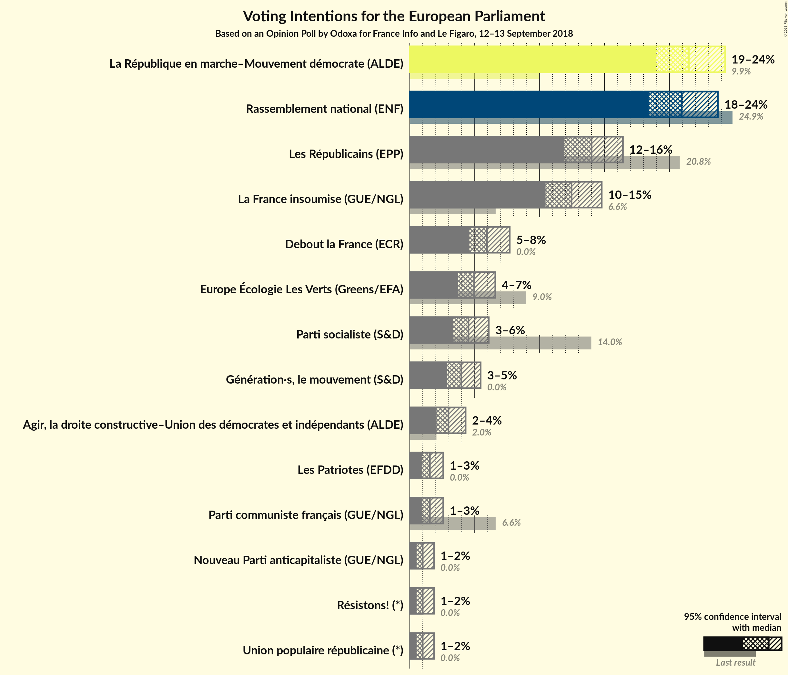

# Opinion Poll by Odoxa for France Info and Le Figaro, 12–13 September 2018

<a href="#voting-intentions">Voting Intentions</a> | <a href="#seats">Seats</a> | <a href="#coalitions">Coalitions</a> | <a href="#technical-information">Technical Information</a>

## Voting Intentions

### Confidence Intervals

| Party | Last Result | Poll Result | 80% Confidence Interval | 90% Confidence Interval | 95% Confidence Interval | 99% Confidence Interval |
|:-----:|:-----------:|:-----------:|:-----------------------:|:-----------------------:|:-----------------------:|:-----------------------:|
| La République en marche–Mouvement démocrate (ALDE) | 9.9% | 21.5% | 19.8–23.3% |19.3–23.9% |18.9–24.3% |18.2–25.2% |
| Rassemblement national (ENF) | 24.9% | 20.9% | 19.3–22.8% |18.8–23.3% |18.4–23.7% |17.6–24.6% |
| Les Républicains (EPP) | 20.8% | 14.0% | 12.6–15.6% |12.2–16.0% |11.9–16.4% |11.2–17.2% |
| La France insoumise (GUE/NGL) | 6.6% | 12.5% | 11.1–14.0% |10.8–14.4% |10.5–14.8% |9.9–15.5% |
| Debout la France (EFDD) | 0.0% | 6.0% | 5.1–7.1% |4.8–7.4% |4.6–7.7% |4.2–8.3% |
| Europe Écologie Les Verts (Greens/EFA) | 9.0% | 5.0% | 4.1–6.0% |3.9–6.3% |3.7–6.6% |3.4–7.1% |
| Parti socialiste (S&D) | 14.0% | 4.5% | 3.7–5.5% |3.5–5.8% |3.4–6.1% |3.0–6.6% |
| Génération·s, le mouvement (S&D) | 0.0% | 4.0% | 3.2–4.9% |3.0–5.2% |2.9–5.5% |2.6–6.0% |
| Agir, la droite constructive–Union des démocrates et indépendants (ALDE) | 2.0% | 3.0% | 2.4–3.8% |2.2–4.1% |2.1–4.3% |1.8–4.8% |
| Parti communiste français (GUE/NGL) | 6.6% | 1.5% | 1.1–2.2% |1.0–2.4% |0.9–2.6% |0.8–2.9% |
| Les Patriotes (EFDD) | 0.0% | 1.5% | 1.1–2.2% |1.0–2.4% |0.9–2.6% |0.8–2.9% |
| Nouveau Parti anticapitaliste (GUE/NGL) | 0.0% | 1.0% | 0.7–1.6% |0.6–1.7% |0.5–1.9% |0.4–2.2% |
| Résistons! (*) | 0.0% | 1.0% | 0.7–1.6% |0.6–1.7% |0.5–1.9% |0.4–2.2% |
| Union populaire républicaine (*) | 0.0% | 1.0% | 0.7–1.6% |0.6–1.7% |0.5–1.9% |0.4–2.2% |

*Note:* The poll result column reflects the actual value used in the calculations. Published results may vary slightly, and in addition be rounded to fewer digits.

## Seats

### Confidence Intervals

| Party | Last Result | Median | 80% Confidence Interval | 90% Confidence Interval | 95% Confidence Interval | 99% Confidence Interval |
|:-----:|:-----------:|:------:|:-----------------------:|:-----------------------:|:-----------------------:|:-----------------------:|
| <a href="#la-république-en-marche–mouvement-démocrate-(alde)">La République en marche–Mouvement démocrate (ALDE)</a> | 7 | 20 | 19–23 |19–24 |19–25 |19–25 |
| <a href="#rassemblement-national-(enf)">Rassemblement national (ENF)</a> | 24 | 22 | 20–22 |19–23 |19–24 |16–25 |
| <a href="#les-républicains-(epp)">Les Républicains (EPP)</a> | 20 | 12 | 12–17 |12–17 |12–17 |11–18 |
| <a href="#la-france-insoumise-(gue/ngl)">La France insoumise (GUE/NGL)</a> | 1 | 11 | 10–13 |10–14 |10–14 |10–15 |
| <a href="#debout-la-france-(efdd)">Debout la France (EFDD)</a> | 0 | 5 | 5–6 |5–7 |5–7 |0–8 |
| <a href="#europe-écologie-les-verts-(greens/efa)">Europe Écologie Les Verts (Greens/EFA)</a> | 6 | 4 | 0–5 |0–6 |0–6 |0–6 |
| <a href="#parti-socialiste-(s&d)">Parti socialiste (S&D)</a> | 13 | 5 | 0–5 |0–5 |0–5 |0–6 |
| <a href="#génération·s,-le-mouvement-(s&d)">Génération·s, le mouvement (S&D)</a> | 0 | 0 | 0 |0 |0 |0–5 |
| <a href="#agir,-la-droite-constructive–union-des-démocrates-et-indépendants-(alde)">Agir, la droite constructive–Union des démocrates et indépendants (ALDE)</a> | 0 | 0 | 0 |0 |0 |0 |
| <a href="#parti-communiste-français-(gue/ngl)">Parti communiste français (GUE/NGL)</a> | 1 | 0 | 0 |0 |0 |0 |
| <a href="#les-patriotes-(efdd)">Les Patriotes (EFDD)</a> | 0 | 0 | 0 |0 |0 |0 |
| <a href="#nouveau-parti-anticapitaliste-(gue/ngl)">Nouveau Parti anticapitaliste (GUE/NGL)</a> | 0 | 0 | 0 |0 |0 |0 |
| <a href="#résistons!-(*)">Résistons! (*)</a> | 0 | 0 | 0 |0 |0 |0 |
| <a href="#union-populaire-républicaine-(*)">Union populaire républicaine (*)</a> | 0 | 0 | 0 |0 |0 |0 |

### La République en marche–Mouvement démocrate (ALDE)

*For a full overview of the results for this party, see the [La République en marche–Mouvement démocrate (ALDE)](party-larépubliqueenmarche–mouvementdémocratealde.html) page.*

| Number of Seats | Probability | Accumulated | Special Marks |
|:---------------:|:-----------:|:-----------:|:-------------:|
| 7 | 0% | 100% | Last Result |
| 8 | 0% | 100% |  |
| 9 | 0% | 100% |  |
| 10 | 0% | 100% |  |
| 11 | 0% | 100% |  |
| 12 | 0% | 100% |  |
| 13 | 0% | 100% |  |
| 14 | 0% | 100% |  |
| 15 | 0% | 100% |  |
| 16 | 0% | 100% |  |
| 17 | 0% | 100% |  |
| 18 | 0.5% | 100% |  |
| 19 | 12% | 99.5% |  |
| 20 | 49% | 88% | Median |
| 21 | 17% | 39% |  |
| 22 | 8% | 22% |  |
| 23 | 5% | 14% |  |
| 24 | 4% | 9% |  |
| 25 | 4% | 5% |  |
| 26 | 0.1% | 0.2% |  |
| 27 | 0% | 0% |  |

### Rassemblement national (ENF)

*For a full overview of the results for this party, see the [Rassemblement national (ENF)](party-rassemblementnationalenf.html) page.*

| Number of Seats | Probability | Accumulated | Special Marks |
|:---------------:|:-----------:|:-----------:|:-------------:|
| 16 | 0.9% | 100% |  |
| 17 | 0.6% | 99.1% |  |
| 18 | 0.8% | 98% |  |
| 19 | 3% | 98% |  |
| 20 | 17% | 95% |  |
| 21 | 3% | 78% |  |
| 22 | 66% | 74% | Median |
| 23 | 6% | 9% |  |
| 24 | 2% | 3% | Last Result |
| 25 | 0.6% | 1.0% |  |
| 26 | 0.1% | 0.4% |  |
| 27 | 0.2% | 0.2% |  |
| 28 | 0% | 0% |  |

### Les Républicains (EPP)

*For a full overview of the results for this party, see the [Les Républicains (EPP)](party-lesrépublicainsepp.html) page.*

| Number of Seats | Probability | Accumulated | Special Marks |
|:---------------:|:-----------:|:-----------:|:-------------:|
| 11 | 0.9% | 100% |  |
| 12 | 65% | 99.1% | Median |
| 13 | 6% | 34% |  |
| 14 | 7% | 27% |  |
| 15 | 6% | 20% |  |
| 16 | 4% | 15% |  |
| 17 | 10% | 11% |  |
| 18 | 0.9% | 0.9% |  |
| 19 | 0% | 0% |  |
| 20 | 0% | 0% | Last Result |

### La France insoumise (GUE/NGL)

*For a full overview of the results for this party, see the [La France insoumise (GUE/NGL)](party-lafranceinsoumiseguengl.html) page.*

| Number of Seats | Probability | Accumulated | Special Marks |
|:---------------:|:-----------:|:-----------:|:-------------:|
| 1 | 0% | 100% | Last Result |
| 2 | 0% | 100% |  |
| 3 | 0% | 100% |  |
| 4 | 0% | 100% |  |
| 5 | 0% | 100% |  |
| 6 | 0% | 100% |  |
| 7 | 0% | 100% |  |
| 8 | 0% | 100% |  |
| 9 | 0.4% | 100% |  |
| 10 | 20% | 99.5% |  |
| 11 | 59% | 80% | Median |
| 12 | 3% | 21% |  |
| 13 | 8% | 18% |  |
| 14 | 9% | 10% |  |
| 15 | 0.2% | 0.6% |  |
| 16 | 0.3% | 0.4% |  |
| 17 | 0.1% | 0.1% |  |
| 18 | 0% | 0% |  |

### Debout la France (EFDD)

*For a full overview of the results for this party, see the [Debout la France (EFDD)](party-deboutlafranceefdd.html) page.*

| Number of Seats | Probability | Accumulated | Special Marks |
|:---------------:|:-----------:|:-----------:|:-------------:|
| 0 | 2% | 100% | Last Result |
| 1 | 0% | 98% |  |
| 2 | 0% | 98% |  |
| 3 | 0% | 98% |  |
| 4 | 0.4% | 98% |  |
| 5 | 63% | 98% | Median |
| 6 | 26% | 35% |  |
| 7 | 8% | 9% |  |
| 8 | 0.9% | 0.9% |  |
| 9 | 0% | 0% |  |

### Europe Écologie Les Verts (Greens/EFA)

*For a full overview of the results for this party, see the [Europe Écologie Les Verts (Greens/EFA)](party-europeécologielesvertsgreensefa.html) page.*

| Number of Seats | Probability | Accumulated | Special Marks |
|:---------------:|:-----------:|:-----------:|:-------------:|
| 0 | 25% | 100% |  |
| 1 | 0% | 75% |  |
| 2 | 0% | 75% |  |
| 3 | 0% | 75% |  |
| 4 | 44% | 75% | Median |
| 5 | 22% | 30% |  |
| 6 | 8% | 8% | Last Result |
| 7 | 0.3% | 0.3% |  |
| 8 | 0% | 0% |  |

### Parti socialiste (S&D)

*For a full overview of the results for this party, see the [Parti socialiste (S&D)](party-partisocialistesd.html) page.*

| Number of Seats | Probability | Accumulated | Special Marks |
|:---------------:|:-----------:|:-----------:|:-------------:|
| 0 | 30% | 100% |  |
| 1 | 0% | 70% |  |
| 2 | 0% | 70% |  |
| 3 | 0% | 70% |  |
| 4 | 1.4% | 70% |  |
| 5 | 68% | 69% | Median |
| 6 | 0.6% | 0.8% |  |
| 7 | 0.2% | 0.2% |  |
| 8 | 0% | 0% |  |
| 9 | 0% | 0% |  |
| 10 | 0% | 0% |  |
| 11 | 0% | 0% |  |
| 12 | 0% | 0% |  |
| 13 | 0% | 0% | Last Result |

### Génération·s, le mouvement (S&D)

*For a full overview of the results for this party, see the [Génération·s, le mouvement (S&D)](party-génération·slemouvementsd.html) page.*

| Number of Seats | Probability | Accumulated | Special Marks |
|:---------------:|:-----------:|:-----------:|:-------------:|
| 0 | 98% | 100% | Last Result, Median |
| 1 | 0% | 2% |  |
| 2 | 0% | 2% |  |
| 3 | 0% | 2% |  |
| 4 | 0.3% | 2% |  |
| 5 | 2% | 2% |  |
| 6 | 0.2% | 0.2% |  |
| 7 | 0% | 0% |  |

### Agir, la droite constructive–Union des démocrates et indépendants (ALDE)

*For a full overview of the results for this party, see the [Agir, la droite constructive–Union des démocrates et indépendants (ALDE)](party-agirladroiteconstructive–uniondesdémocratesetindépendantsalde.html) page.*

| Number of Seats | Probability | Accumulated | Special Marks |
|:---------------:|:-----------:|:-----------:|:-------------:|
| 0 | 100% | 100% | Last Result, Median |

### Parti communiste français (GUE/NGL)

*For a full overview of the results for this party, see the [Parti communiste français (GUE/NGL)](party-particommunistefrançaisguengl.html) page.*

| Number of Seats | Probability | Accumulated | Special Marks |
|:---------------:|:-----------:|:-----------:|:-------------:|
| 0 | 100% | 100% | Median |
| 1 | 0% | 0% | Last Result |

### Les Patriotes (EFDD)

*For a full overview of the results for this party, see the [Les Patriotes (EFDD)](party-lespatriotesefdd.html) page.*

| Number of Seats | Probability | Accumulated | Special Marks |
|:---------------:|:-----------:|:-----------:|:-------------:|
| 0 | 100% | 100% | Last Result, Median |

### Nouveau Parti anticapitaliste (GUE/NGL)

*For a full overview of the results for this party, see the [Nouveau Parti anticapitaliste (GUE/NGL)](party-nouveaupartianticapitalisteguengl.html) page.*

| Number of Seats | Probability | Accumulated | Special Marks |
|:---------------:|:-----------:|:-----------:|:-------------:|
| 0 | 100% | 100% | Last Result, Median |

### Résistons! (*)

*For a full overview of the results for this party, see the [Résistons! (*)](party-résistons.html) page.*

| Number of Seats | Probability | Accumulated | Special Marks |
|:---------------:|:-----------:|:-----------:|:-------------:|
| 0 | 100% | 100% | Last Result, Median |

### Union populaire républicaine (*)

*For a full overview of the results for this party, see the [Union populaire républicaine (*)](party-unionpopulairerépublicaine.html) page.*

| Number of Seats | Probability | Accumulated | Special Marks |
|:---------------:|:-----------:|:-----------:|:-------------:|
| 0 | 100% | 100% | Last Result, Median |

## Coalitions

### Confidence Intervals

| Coalition | Last Result | Median | Majority? | 80% Confidence Interval | 90% Confidence Interval | 95% Confidence Interval | 99% Confidence Interval |
|:---------:|:-----------:|:------:|:---------:|:-----------------------:|:-----------------------:|:-----------------------:|:-----------------------:|
| La République en marche–Mouvement démocrate (ALDE) – Agir, la droite constructive–Union des démocrates et indépendants (ALDE) | 7 | 20 | 0% | 19–23 | 19–24 | 19–25 | 19–25 |
| Rassemblement national (ENF) | 24 | 22 | 0% | 20–22 | 19–23 | 19–24 | 16–25 |
| Les Républicains (EPP) | 20 | 12 | 0% | 12–17 | 12–17 | 12–17 | 11–18 |
| La France insoumise (GUE/NGL) – Parti communiste français (GUE/NGL) – Nouveau Parti anticapitaliste (GUE/NGL) | 2 | 11 | 0% | 10–13 | 10–14 | 10–14 | 10–15 |
| Debout la France (EFDD) – Les Patriotes (EFDD) | 0 | 5 | 0% | 5–6 | 5–7 | 5–7 | 0–8 |
| Europe Écologie Les Verts (Greens/EFA) | 6 | 4 | 0% | 0–5 | 0–6 | 0–6 | 0–6 |
| Parti socialiste (S&D) – Génération·s, le mouvement (S&D) | 13 | 5 | 0% | 0–5 | 0–5 | 0–5 | 0–7 |
| Résistons! (*) – Union populaire républicaine (*) | 0 | 0 | 0% | 0 | 0 | 0 | 0 |

### La République en marche–Mouvement démocrate (ALDE) – Agir, la droite constructive–Union des démocrates et indépendants (ALDE)

| Number of Seats | Probability | Accumulated | Special Marks |
|:---------------:|:-----------:|:-----------:|:-------------:|
| 7 | 0% | 100% | Last Result |
| 8 | 0% | 100% |  |
| 9 | 0% | 100% |  |
| 10 | 0% | 100% |  |
| 11 | 0% | 100% |  |
| 12 | 0% | 100% |  |
| 13 | 0% | 100% |  |
| 14 | 0% | 100% |  |
| 15 | 0% | 100% |  |
| 16 | 0% | 100% |  |
| 17 | 0% | 100% |  |
| 18 | 0.5% | 100% |  |
| 19 | 12% | 99.5% |  |
| 20 | 49% | 88% | Median |
| 21 | 17% | 39% |  |
| 22 | 8% | 22% |  |
| 23 | 5% | 14% |  |
| 24 | 5% | 9% |  |
| 25 | 4% | 5% |  |
| 26 | 0.1% | 0.2% |  |
| 27 | 0% | 0% |  |

### Rassemblement national (ENF)

| Number of Seats | Probability | Accumulated | Special Marks |
|:---------------:|:-----------:|:-----------:|:-------------:|
| 16 | 0.9% | 100% |  |
| 17 | 0.6% | 99.1% |  |
| 18 | 0.8% | 98% |  |
| 19 | 3% | 98% |  |
| 20 | 17% | 95% |  |
| 21 | 3% | 78% |  |
| 22 | 66% | 74% | Median |
| 23 | 6% | 9% |  |
| 24 | 2% | 3% | Last Result |
| 25 | 0.6% | 1.0% |  |
| 26 | 0.1% | 0.4% |  |
| 27 | 0.2% | 0.2% |  |
| 28 | 0% | 0% |  |

### Les Républicains (EPP)

| Number of Seats | Probability | Accumulated | Special Marks |
|:---------------:|:-----------:|:-----------:|:-------------:|
| 11 | 0.9% | 100% |  |
| 12 | 65% | 99.1% | Median |
| 13 | 6% | 34% |  |
| 14 | 7% | 27% |  |
| 15 | 6% | 20% |  |
| 16 | 4% | 15% |  |
| 17 | 10% | 11% |  |
| 18 | 0.9% | 0.9% |  |
| 19 | 0% | 0% |  |
| 20 | 0% | 0% | Last Result |

### La France insoumise (GUE/NGL) – Parti communiste français (GUE/NGL) – Nouveau Parti anticapitaliste (GUE/NGL)

| Number of Seats | Probability | Accumulated | Special Marks |
|:---------------:|:-----------:|:-----------:|:-------------:|
| 2 | 0% | 100% | Last Result |
| 3 | 0% | 100% |  |
| 4 | 0% | 100% |  |
| 5 | 0% | 100% |  |
| 6 | 0% | 100% |  |
| 7 | 0% | 100% |  |
| 8 | 0% | 100% |  |
| 9 | 0.4% | 100% |  |
| 10 | 20% | 99.5% |  |
| 11 | 59% | 80% | Median |
| 12 | 3% | 21% |  |
| 13 | 8% | 18% |  |
| 14 | 9% | 10% |  |
| 15 | 0.2% | 0.6% |  |
| 16 | 0.3% | 0.4% |  |
| 17 | 0.1% | 0.1% |  |
| 18 | 0% | 0% |  |

### Debout la France (EFDD) – Les Patriotes (EFDD)

| Number of Seats | Probability | Accumulated | Special Marks |
|:---------------:|:-----------:|:-----------:|:-------------:|
| 0 | 2% | 100% | Last Result |
| 1 | 0% | 98% |  |
| 2 | 0% | 98% |  |
| 3 | 0% | 98% |  |
| 4 | 0.4% | 98% |  |
| 5 | 63% | 98% | Median |
| 6 | 26% | 35% |  |
| 7 | 8% | 9% |  |
| 8 | 0.9% | 0.9% |  |
| 9 | 0% | 0% |  |

### Europe Écologie Les Verts (Greens/EFA)

| Number of Seats | Probability | Accumulated | Special Marks |
|:---------------:|:-----------:|:-----------:|:-------------:|
| 0 | 25% | 100% |  |
| 1 | 0% | 75% |  |
| 2 | 0% | 75% |  |
| 3 | 0% | 75% |  |
| 4 | 44% | 75% | Median |
| 5 | 22% | 30% |  |
| 6 | 8% | 8% | Last Result |
| 7 | 0.3% | 0.3% |  |
| 8 | 0% | 0% |  |

### Parti socialiste (S&D) – Génération·s, le mouvement (S&D)

| Number of Seats | Probability | Accumulated | Special Marks |
|:---------------:|:-----------:|:-----------:|:-------------:|
| 0 | 28% | 100% |  |
| 1 | 0% | 72% |  |
| 2 | 0% | 72% |  |
| 3 | 0% | 72% |  |
| 4 | 1.2% | 72% |  |
| 5 | 69% | 71% | Median |
| 6 | 0.8% | 1.4% |  |
| 7 | 0.2% | 0.7% |  |
| 8 | 0.2% | 0.4% |  |
| 9 | 0% | 0.2% |  |
| 10 | 0.1% | 0.2% |  |
| 11 | 0% | 0% |  |
| 12 | 0% | 0% |  |
| 13 | 0% | 0% | Last Result |

### Résistons! (*) – Union populaire républicaine (*)

| Number of Seats | Probability | Accumulated | Special Marks |
|:---------------:|:-----------:|:-----------:|:-------------:|
| 0 | 100% | 100% | Last Result, Median |

## Technical Information

### Opinion Poll

+ **Polling firm:** Odoxa
+ **Commissioner(s):** France Info and Le Figaro
+ **Fieldwork period:** 12–13 September 2018

### Calculations

+ **Sample size:** 907
+ **Simulations done:** 1,048,576
+ **Error estimate:** 2.35%

