# Opinion Poll by Ifop-Fiducial for CNews, Paris Match and Sud Radio, 8–12 March 2019

<a href="#voting-intentions">Voting Intentions</a> | <a href="#seats">Seats</a> | <a href="#coalitions">Coalitions</a> | <a href="#technical-information">Technical Information</a>

## Voting Intentions

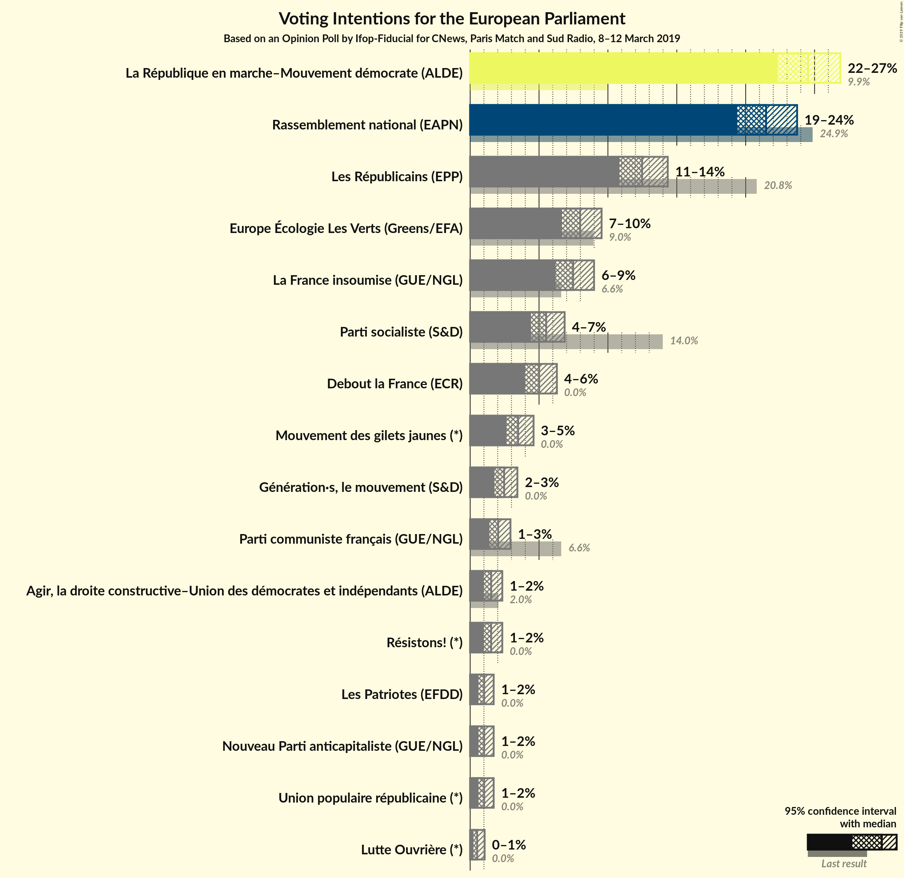

### Confidence Intervals

| Party | Last Result | Poll Result | 80% Confidence Interval | 90% Confidence Interval | 95% Confidence Interval | 99% Confidence Interval |
|:-----:|:-----------:|:-----------:|:-----------------------:|:-----------------------:|:-----------------------:|:-----------------------:|
| La République en marche–Mouvement démocrate (ALDE) | 9.9% | 24.5% | 23.1–26.1% |22.7–26.5% |22.3–26.9% |21.6–27.6% |
| Rassemblement national (ENF) | 24.9% | 21.5% | 20.1–23.0% |19.7–23.4% |19.4–23.7% |18.7–24.4% |
| Les Républicains (EPP) | 20.8% | 12.5% | 11.4–13.7% |11.1–14.0% |10.8–14.3% |10.3–14.9% |
| Europe Écologie Les Verts (Greens/EFA) | 9.0% | 8.0% | 7.1–9.0% |6.9–9.3% |6.7–9.5% |6.3–10.0% |
| La France insoumise (GUE/NGL) | 6.6% | 7.5% | 6.6–8.5% |6.4–8.7% |6.2–9.0% |5.8–9.5% |
| Parti socialiste (S&D) | 14.0% | 5.5% | 4.8–6.4% |4.6–6.6% |4.4–6.9% |4.1–7.3% |
| Debout la France (ECR) | 0.0% | 5.0% | 4.3–5.9% |4.1–6.1% |4.0–6.3% |3.7–6.7% |
| Mouvement des gilets jaunes (*) | 0.0% | 3.5% | 2.9–4.2% |2.8–4.4% |2.6–4.6% |2.4–5.0% |
| Génération·s, le mouvement (S&D) | 0.0% | 2.5% | 2.0–3.1% |1.9–3.3% |1.8–3.4% |1.6–3.8% |
| Parti communiste français (GUE/NGL) | 6.6% | 2.0% | 1.6–2.6% |1.5–2.8% |1.4–2.9% |1.2–3.2% |
| Agir, la droite constructive–Union des démocrates et indépendants (ALDE) | 2.0% | 1.5% | 1.2–2.0% |1.1–2.2% |1.0–2.3% |0.9–2.6% |
| Résistons! (*) | 0.0% | 1.5% | 1.2–2.0% |1.1–2.2% |1.0–2.3% |0.9–2.6% |
| Nouveau Parti anticapitaliste (GUE/NGL) | 0.0% | 1.0% | 0.7–1.5% |0.7–1.6% |0.6–1.7% |0.5–2.0% |
| Les Patriotes (EFDD) | 0.0% | 1.0% | 0.7–1.5% |0.7–1.6% |0.6–1.7% |0.5–2.0% |
| Union populaire républicaine (*) | 0.0% | 1.0% | 0.7–1.5% |0.7–1.6% |0.6–1.7% |0.5–2.0% |
| Lutte Ouvrière (*) | 0.0% | 0.5% | 0.3–0.9% |0.3–1.0% |0.2–1.1% |0.2–1.2% |

*Note:* The poll result column reflects the actual value used in the calculations. Published results may vary slightly, and in addition be rounded to fewer digits.

## Seats

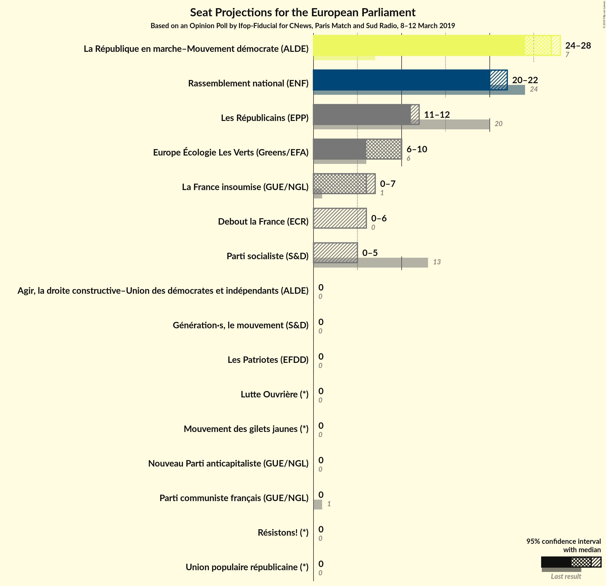

### Confidence Intervals

| Party | Last Result | Median | 80% Confidence Interval | 90% Confidence Interval | 95% Confidence Interval | 99% Confidence Interval |
|:-----:|:-----------:|:------:|:-----------------------:|:-----------------------:|:-----------------------:|:-----------------------:|
| <a href="#la-république-en-marche–mouvement-démocrate-(alde)">La République en marche–Mouvement démocrate (ALDE)</a> | 7 | 22 | 21–24 |21–24 |21–27 |21–28 |
| <a href="#rassemblement-national-(enf)">Rassemblement national (ENF)</a> | 24 | 21 | 19–23 |18–27 |18–27 |18–27 |
| <a href="#les-républicains-(epp)">Les Républicains (EPP)</a> | 20 | 11 | 10–13 |10–14 |10–14 |10–14 |
| <a href="#europe-écologie-les-verts-(greens/efa)">Europe Écologie Les Verts (Greens/EFA)</a> | 6 | 8 | 7–9 |7–9 |7–9 |6–10 |
| <a href="#la-france-insoumise-(gue/ngl)">La France insoumise (GUE/NGL)</a> | 1 | 7 | 6–8 |6–8 |6–8 |6–8 |
| <a href="#parti-socialiste-(s&d)">Parti socialiste (S&D)</a> | 13 | 6 | 4–6 |0–7 |0–7 |0–7 |
| <a href="#debout-la-france-(ecr)">Debout la France (ECR)</a> | 0 | 5 | 0–6 |0–6 |0–6 |0–6 |
| <a href="#mouvement-des-gilets-jaunes-(*)">Mouvement des gilets jaunes (*)</a> | 0 | 0 | 0 |0 |0 |0 |
| <a href="#génération·s,-le-mouvement-(s&d)">Génération·s, le mouvement (S&D)</a> | 0 | 0 | 0 |0 |0 |0 |
| <a href="#parti-communiste-français-(gue/ngl)">Parti communiste français (GUE/NGL)</a> | 1 | 0 | 0 |0 |0 |0 |
| <a href="#agir,-la-droite-constructive–union-des-démocrates-et-indépendants-(alde)">Agir, la droite constructive–Union des démocrates et indépendants (ALDE)</a> | 0 | 0 | 0 |0 |0 |0 |
| <a href="#résistons!-(*)">Résistons! (*)</a> | 0 | 0 | 0 |0 |0 |0 |
| <a href="#nouveau-parti-anticapitaliste-(gue/ngl)">Nouveau Parti anticapitaliste (GUE/NGL)</a> | 0 | 0 | 0 |0 |0 |0 |
| <a href="#les-patriotes-(efdd)">Les Patriotes (EFDD)</a> | 0 | 0 | 0 |0 |0 |0 |
| <a href="#union-populaire-républicaine-(*)">Union populaire républicaine (*)</a> | 0 | 0 | 0 |0 |0 |0 |
| <a href="#lutte-ouvrière-(*)">Lutte Ouvrière (*)</a> | 0 | 0 | 0 |0 |0 |0 |

### La République en marche–Mouvement démocrate (ALDE)

*For a full overview of the results for this party, see the [La République en marche–Mouvement démocrate (ALDE)](party-larépubliqueenmarche–mouvementdémocratealde.html) page.*

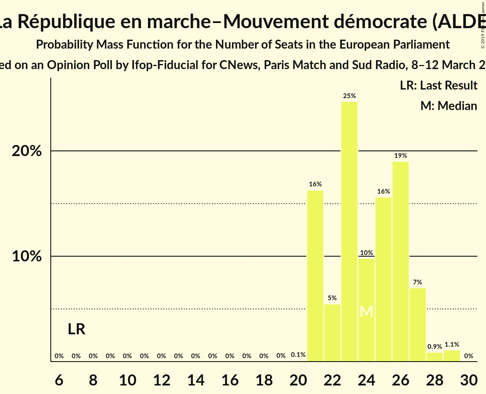

| Number of Seats | Probability | Accumulated | Special Marks |
|:---------------:|:-----------:|:-----------:|:-------------:|
| 7 | 0% | 100% | Last Result |
| 8 | 0% | 100% |  |
| 9 | 0% | 100% |  |
| 10 | 0% | 100% |  |
| 11 | 0% | 100% |  |
| 12 | 0% | 100% |  |
| 13 | 0% | 100% |  |
| 14 | 0% | 100% |  |
| 15 | 0% | 100% |  |
| 16 | 0% | 100% |  |
| 17 | 0% | 100% |  |
| 18 | 0% | 100% |  |
| 19 | 0% | 100% |  |
| 20 | 0.4% | 100% |  |
| 21 | 37% | 99.6% |  |
| 22 | 16% | 63% | Median |
| 23 | 0.3% | 46% |  |
| 24 | 42% | 46% |  |
| 25 | 0% | 4% |  |
| 26 | 1.3% | 4% |  |
| 27 | 2% | 3% |  |
| 28 | 0.9% | 0.9% |  |
| 29 | 0% | 0% |  |

### Rassemblement national (ENF)

*For a full overview of the results for this party, see the [Rassemblement national (ENF)](party-rassemblementnationalenf.html) page.*

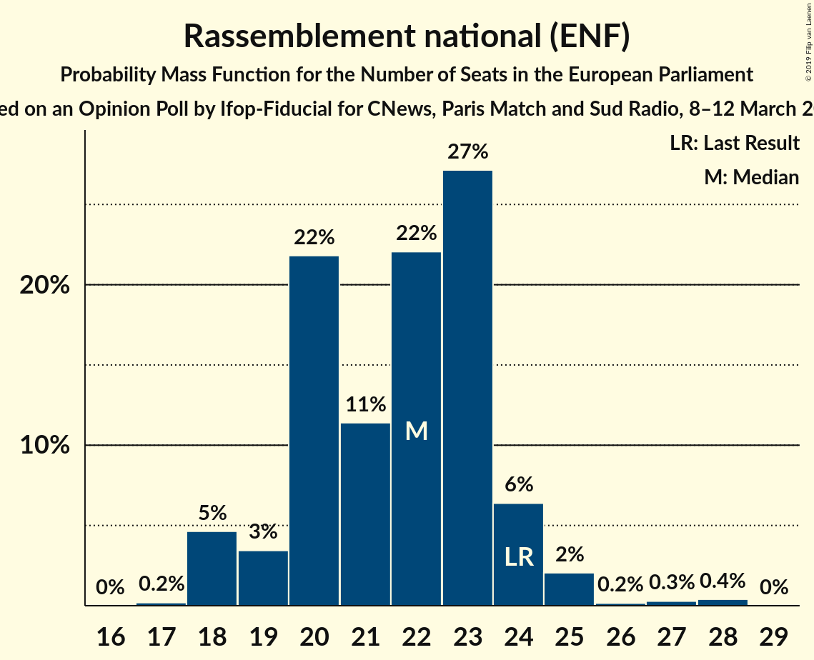

| Number of Seats | Probability | Accumulated | Special Marks |
|:---------------:|:-----------:|:-----------:|:-------------:|
| 17 | 0.2% | 100% |  |
| 18 | 8% | 99.8% |  |
| 19 | 18% | 92% |  |
| 20 | 22% | 74% |  |
| 21 | 21% | 52% | Median |
| 22 | 20% | 31% |  |
| 23 | 2% | 10% |  |
| 24 | 2% | 9% | Last Result |
| 25 | 2% | 7% |  |
| 26 | 0% | 6% |  |
| 27 | 6% | 6% |  |
| 28 | 0% | 0% |  |

### Les Républicains (EPP)

*For a full overview of the results for this party, see the [Les Républicains (EPP)](party-lesrépublicainsepp.html) page.*

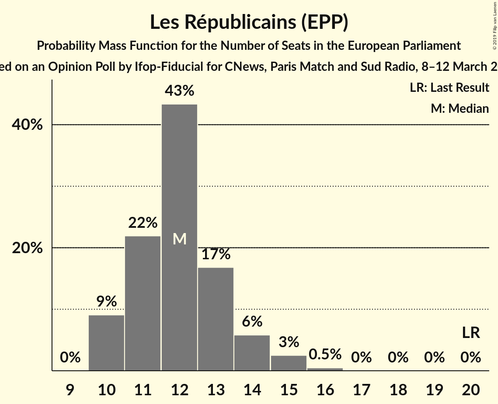

| Number of Seats | Probability | Accumulated | Special Marks |
|:---------------:|:-----------:|:-----------:|:-------------:|
| 10 | 39% | 100% |  |
| 11 | 44% | 61% | Median |
| 12 | 0.4% | 17% |  |
| 13 | 7% | 17% |  |
| 14 | 9% | 10% |  |
| 15 | 0.2% | 0.4% |  |
| 16 | 0.2% | 0.2% |  |
| 17 | 0% | 0% |  |
| 18 | 0% | 0% |  |
| 19 | 0% | 0% |  |
| 20 | 0% | 0% | Last Result |

### Europe Écologie Les Verts (Greens/EFA)

*For a full overview of the results for this party, see the [Europe Écologie Les Verts (Greens/EFA)](party-europeécologielesvertsgreensefa.html) page.*

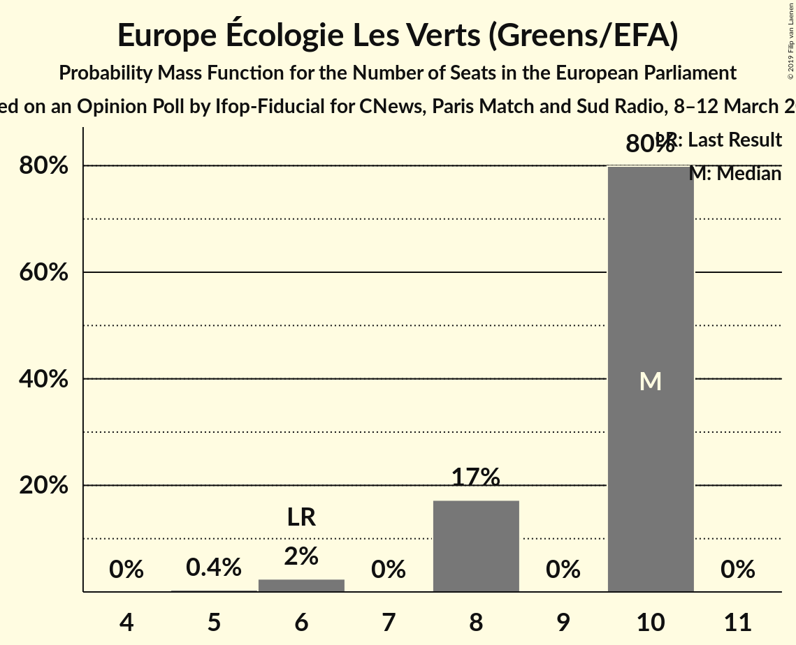

| Number of Seats | Probability | Accumulated | Special Marks |
|:---------------:|:-----------:|:-----------:|:-------------:|
| 6 | 1.2% | 100% | Last Result |
| 7 | 31% | 98.7% |  |
| 8 | 42% | 68% | Median |
| 9 | 26% | 26% |  |
| 10 | 0.5% | 0.7% |  |
| 11 | 0.1% | 0.1% |  |
| 12 | 0% | 0% |  |

### La France insoumise (GUE/NGL)

*For a full overview of the results for this party, see the [La France insoumise (GUE/NGL)](party-lafranceinsoumiseguengl.html) page.*

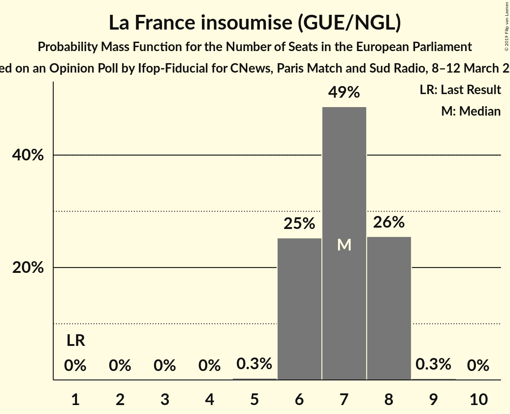

| Number of Seats | Probability | Accumulated | Special Marks |
|:---------------:|:-----------:|:-----------:|:-------------:|
| 1 | 0% | 100% | Last Result |
| 2 | 0% | 100% |  |
| 3 | 0% | 100% |  |
| 4 | 0% | 100% |  |
| 5 | 0.3% | 100% |  |
| 6 | 25% | 99.7% |  |
| 7 | 49% | 74% | Median |
| 8 | 26% | 26% |  |
| 9 | 0.3% | 0.3% |  |
| 10 | 0% | 0% |  |

### Parti socialiste (S&D)

*For a full overview of the results for this party, see the [Parti socialiste (S&D)](party-partisocialistesd.html) page.*

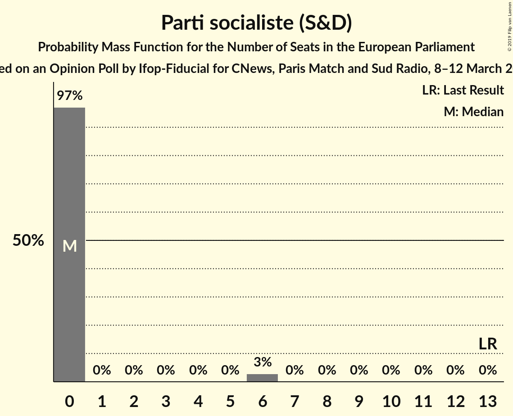

| Number of Seats | Probability | Accumulated | Special Marks |
|:---------------:|:-----------:|:-----------:|:-------------:|
| 0 | 9% | 100% |  |
| 1 | 0% | 91% |  |
| 2 | 0% | 91% |  |
| 3 | 0% | 91% |  |
| 4 | 8% | 91% |  |
| 5 | 21% | 82% |  |
| 6 | 54% | 61% | Median |
| 7 | 7% | 7% |  |
| 8 | 0% | 0% |  |
| 9 | 0% | 0% |  |
| 10 | 0% | 0% |  |
| 11 | 0% | 0% |  |
| 12 | 0% | 0% |  |
| 13 | 0% | 0% | Last Result |

### Debout la France (ECR)

*For a full overview of the results for this party, see the [Debout la France (ECR)](party-deboutlafranceecr.html) page.*

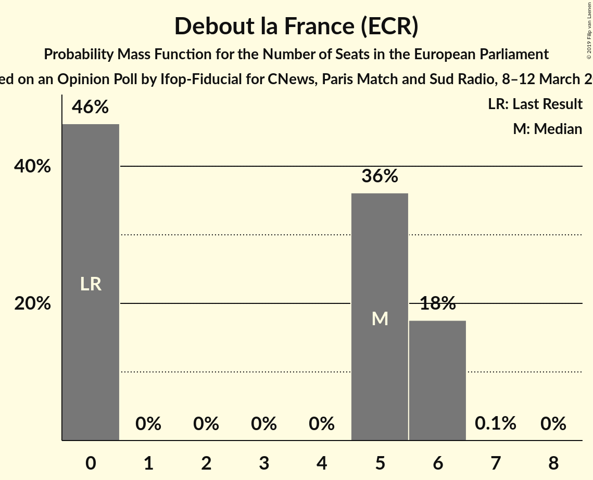

| Number of Seats | Probability | Accumulated | Special Marks |
|:---------------:|:-----------:|:-----------:|:-------------:|
| 0 | 17% | 100% | Last Result |
| 1 | 0% | 83% |  |
| 2 | 0% | 83% |  |
| 3 | 0% | 83% |  |
| 4 | 0% | 83% |  |
| 5 | 65% | 83% | Median |
| 6 | 18% | 18% |  |
| 7 | 0% | 0% |  |

### Mouvement des gilets jaunes (*)

*For a full overview of the results for this party, see the [Mouvement des gilets jaunes (*)](party-mouvementdesgiletsjaunes.html) page.*

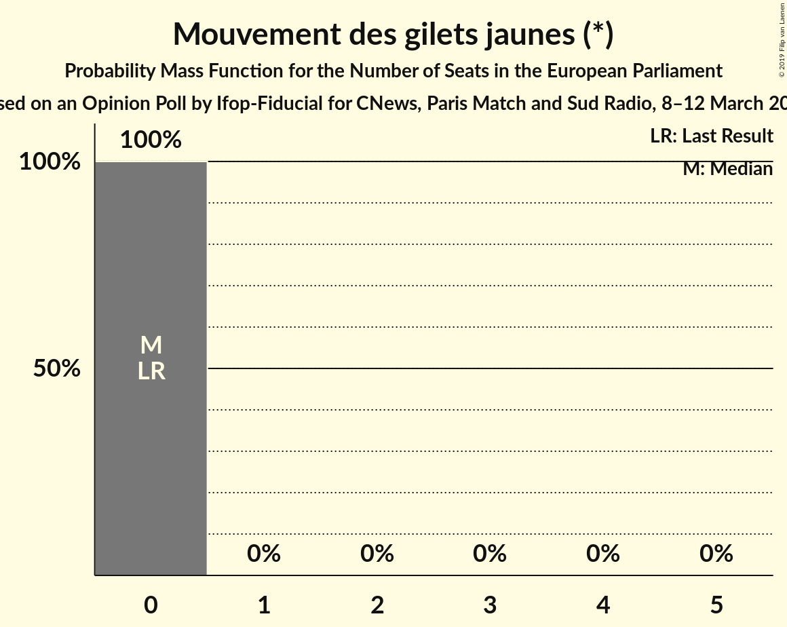

| Number of Seats | Probability | Accumulated | Special Marks |
|:---------------:|:-----------:|:-----------:|:-------------:|
| 0 | 100% | 100% | Last Result, Median |

### Génération·s, le mouvement (S&D)

*For a full overview of the results for this party, see the [Génération·s, le mouvement (S&D)](party-génération·slemouvementsd.html) page.*

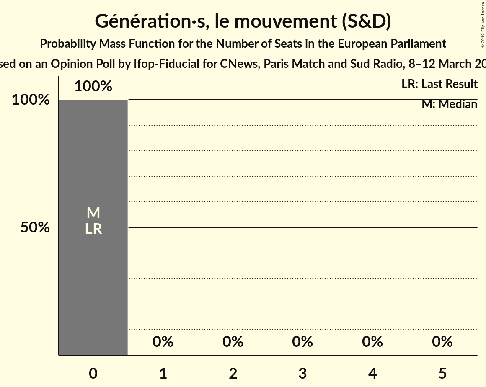

| Number of Seats | Probability | Accumulated | Special Marks |
|:---------------:|:-----------:|:-----------:|:-------------:|
| 0 | 100% | 100% | Last Result, Median |

### Parti communiste français (GUE/NGL)

*For a full overview of the results for this party, see the [Parti communiste français (GUE/NGL)](party-particommunistefrançaisguengl.html) page.*

| Number of Seats | Probability | Accumulated | Special Marks |
|:---------------:|:-----------:|:-----------:|:-------------:|
| 0 | 100% | 100% | Median |
| 1 | 0% | 0% | Last Result |

### Agir, la droite constructive–Union des démocrates et indépendants (ALDE)

*For a full overview of the results for this party, see the [Agir, la droite constructive–Union des démocrates et indépendants (ALDE)](party-agirladroiteconstructive–uniondesdémocratesetindépendantsalde.html) page.*

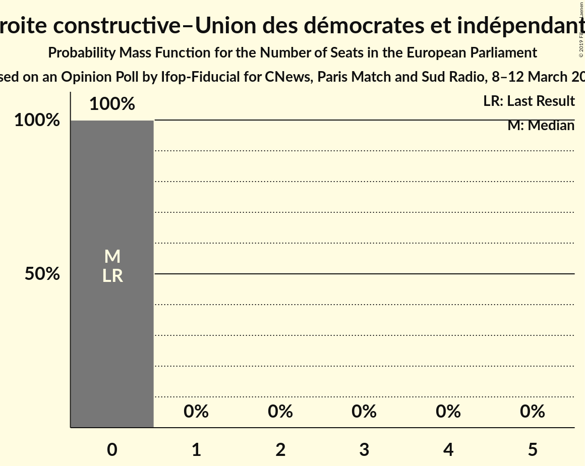

| Number of Seats | Probability | Accumulated | Special Marks |
|:---------------:|:-----------:|:-----------:|:-------------:|
| 0 | 100% | 100% | Last Result, Median |

### Résistons! (*)

*For a full overview of the results for this party, see the [Résistons! (*)](party-résistons.html) page.*

| Number of Seats | Probability | Accumulated | Special Marks |
|:---------------:|:-----------:|:-----------:|:-------------:|
| 0 | 100% | 100% | Last Result, Median |

### Nouveau Parti anticapitaliste (GUE/NGL)

*For a full overview of the results for this party, see the [Nouveau Parti anticapitaliste (GUE/NGL)](party-nouveaupartianticapitalisteguengl.html) page.*

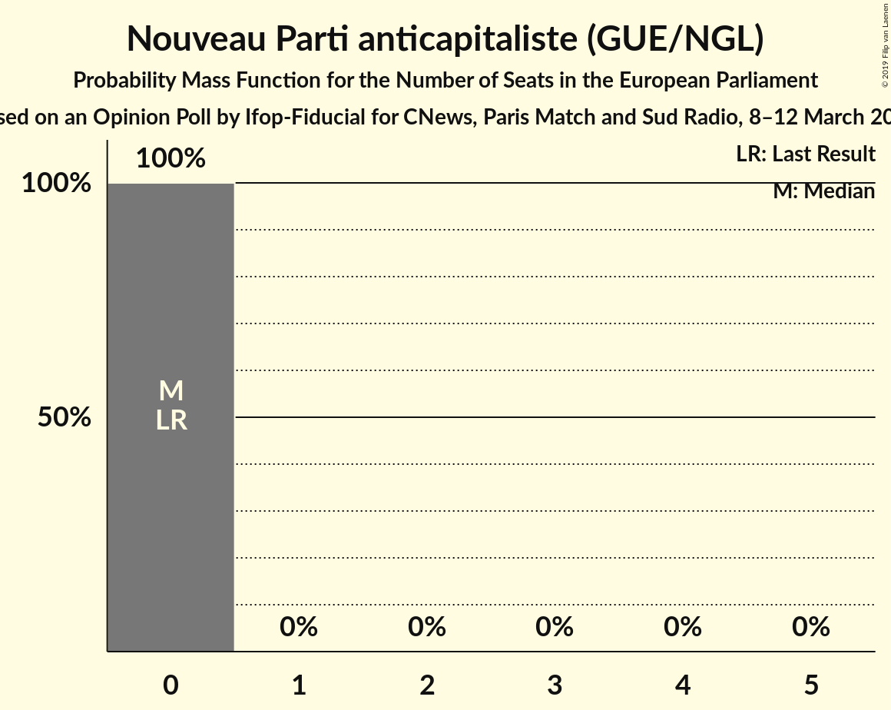

| Number of Seats | Probability | Accumulated | Special Marks |
|:---------------:|:-----------:|:-----------:|:-------------:|
| 0 | 100% | 100% | Last Result, Median |

### Les Patriotes (EFDD)

*For a full overview of the results for this party, see the [Les Patriotes (EFDD)](party-lespatriotesefdd.html) page.*

| Number of Seats | Probability | Accumulated | Special Marks |
|:---------------:|:-----------:|:-----------:|:-------------:|
| 0 | 100% | 100% | Last Result, Median |

### Union populaire républicaine (*)

*For a full overview of the results for this party, see the [Union populaire républicaine (*)](party-unionpopulairerépublicaine.html) page.*

| Number of Seats | Probability | Accumulated | Special Marks |
|:---------------:|:-----------:|:-----------:|:-------------:|
| 0 | 100% | 100% | Last Result, Median |

### Lutte Ouvrière (*)

*For a full overview of the results for this party, see the [Lutte Ouvrière (*)](party-lutteouvrière.html) page.*

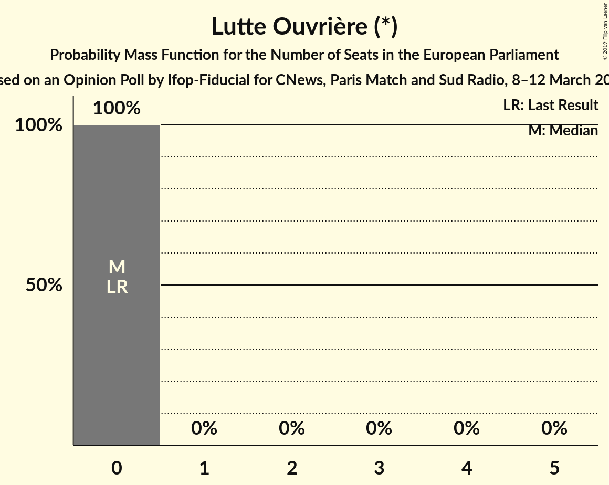

| Number of Seats | Probability | Accumulated | Special Marks |
|:---------------:|:-----------:|:-----------:|:-------------:|
| 0 | 100% | 100% | Last Result, Median |

## Coalitions

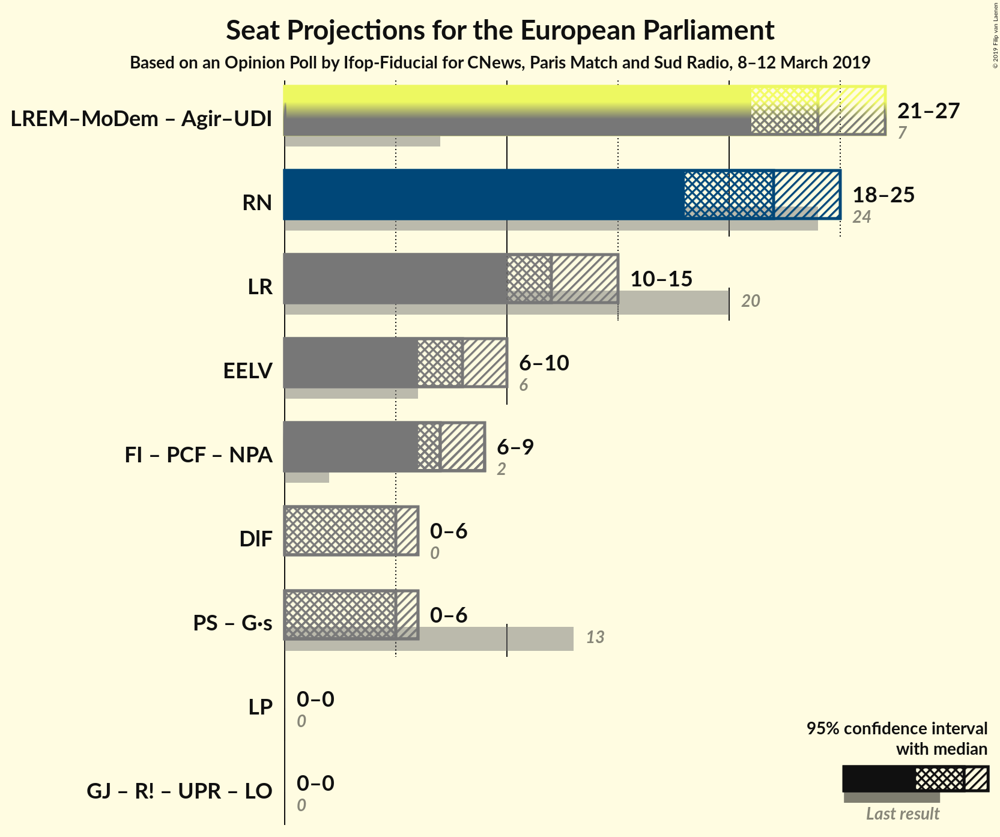

### Confidence Intervals

| Coalition | Last Result | Median | Majority? | 80% Confidence Interval | 90% Confidence Interval | 95% Confidence Interval | 99% Confidence Interval |
|:---------:|:-----------:|:------:|:---------:|:-----------------------:|:-----------------------:|:-----------------------:|:-----------------------:|
| La République en marche–Mouvement démocrate (ALDE) – Agir, la droite constructive–Union des démocrates et indépendants (ALDE) | 7 | 22 | 0% | 21–24 | 21–24 | 21–27 | 21–28 |
| Rassemblement national (ENF) | 24 | 21 | 0% | 19–23 | 18–27 | 18–27 | 18–27 |
| Les Républicains (EPP) | 20 | 11 | 0% | 10–13 | 10–14 | 10–14 | 10–14 |
| Europe Écologie Les Verts (Greens/EFA) | 6 | 8 | 0% | 7–9 | 7–9 | 7–9 | 6–10 |
| La France insoumise (GUE/NGL) – Parti communiste français (GUE/NGL) – Nouveau Parti anticapitaliste (GUE/NGL) | 2 | 7 | 0% | 6–8 | 6–8 | 6–8 | 6–8 |
| Parti socialiste (S&D) – Génération·s, le mouvement (S&D) | 13 | 6 | 0% | 4–6 | 0–7 | 0–7 | 0–7 |
| Debout la France (ECR) | 0 | 5 | 0% | 0–6 | 0–6 | 0–6 | 0–6 |
| Les Patriotes (EFDD) | 0 | 0 | 0% | 0 | 0 | 0 | 0 |
| Mouvement des gilets jaunes (*) – Résistons! (*) – Union populaire républicaine (*) – Lutte Ouvrière (*) | 0 | 0 | 0% | 0 | 0 | 0 | 0 |

### La République en marche–Mouvement démocrate (ALDE) – Agir, la droite constructive–Union des démocrates et indépendants (ALDE)

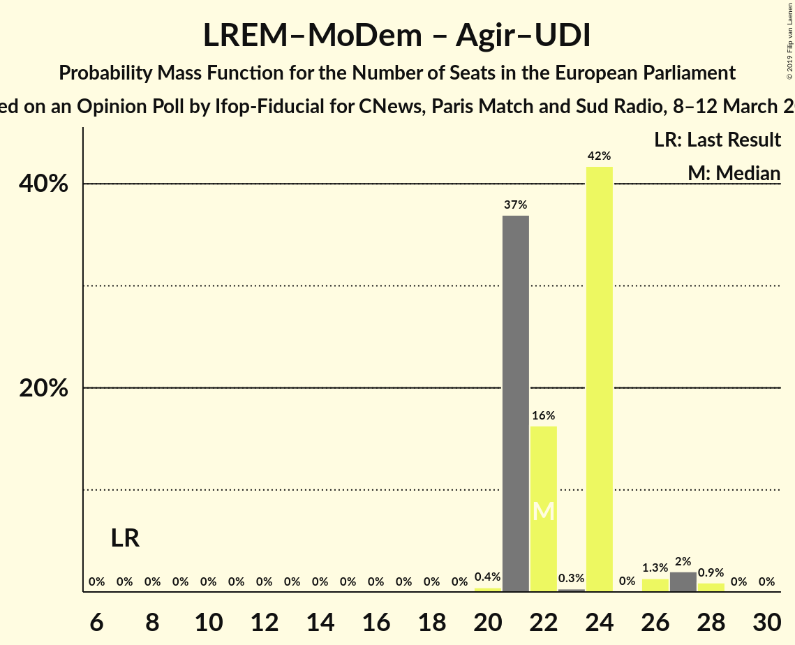

| Number of Seats | Probability | Accumulated | Special Marks |
|:---------------:|:-----------:|:-----------:|:-------------:|
| 7 | 0% | 100% | Last Result |
| 8 | 0% | 100% |  |
| 9 | 0% | 100% |  |
| 10 | 0% | 100% |  |
| 11 | 0% | 100% |  |
| 12 | 0% | 100% |  |
| 13 | 0% | 100% |  |
| 14 | 0% | 100% |  |
| 15 | 0% | 100% |  |
| 16 | 0% | 100% |  |
| 17 | 0% | 100% |  |
| 18 | 0% | 100% |  |
| 19 | 0% | 100% |  |
| 20 | 0.4% | 100% |  |
| 21 | 37% | 99.6% |  |
| 22 | 16% | 63% | Median |
| 23 | 0.3% | 46% |  |
| 24 | 42% | 46% |  |
| 25 | 0% | 4% |  |
| 26 | 1.3% | 4% |  |
| 27 | 2% | 3% |  |
| 28 | 0.9% | 0.9% |  |
| 29 | 0% | 0% |  |

### Rassemblement national (ENF)

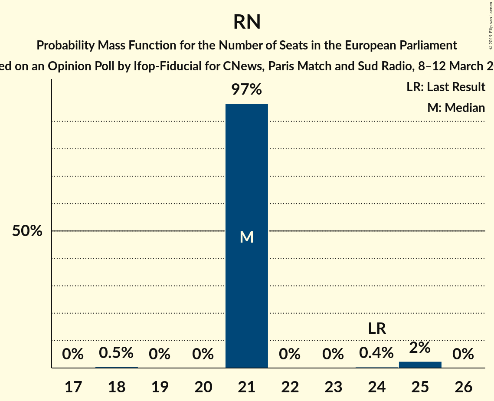

| Number of Seats | Probability | Accumulated | Special Marks |
|:---------------:|:-----------:|:-----------:|:-------------:|
| 17 | 0.2% | 100% |  |
| 18 | 8% | 99.8% |  |
| 19 | 18% | 92% |  |
| 20 | 22% | 74% |  |
| 21 | 21% | 52% | Median |
| 22 | 20% | 31% |  |
| 23 | 2% | 10% |  |
| 24 | 2% | 9% | Last Result |
| 25 | 2% | 7% |  |
| 26 | 0% | 6% |  |
| 27 | 6% | 6% |  |
| 28 | 0% | 0% |  |

### Les Républicains (EPP)

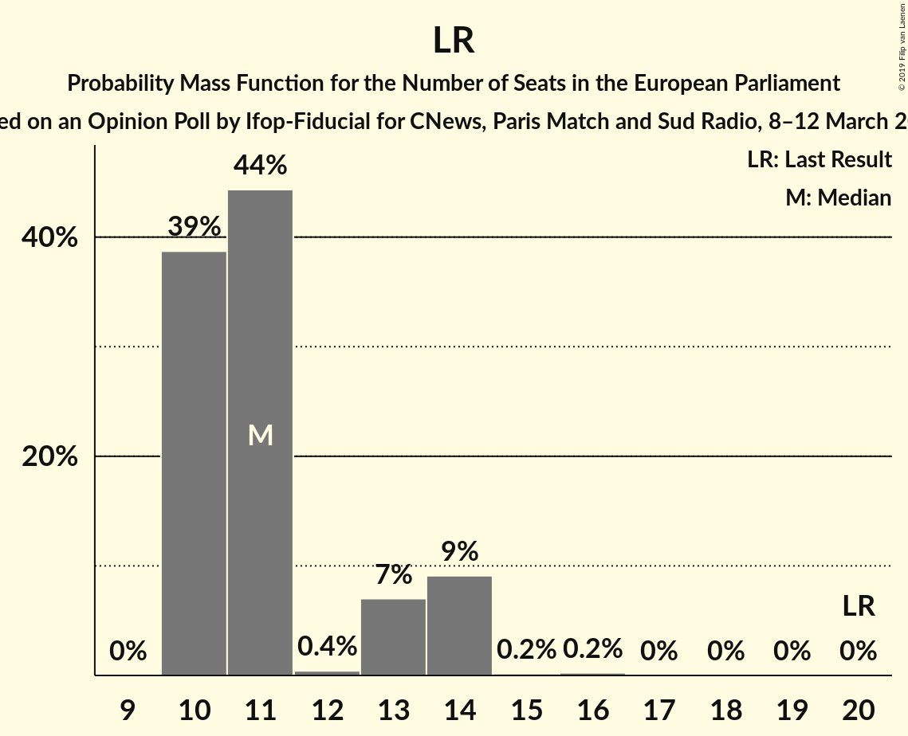

| Number of Seats | Probability | Accumulated | Special Marks |
|:---------------:|:-----------:|:-----------:|:-------------:|
| 10 | 39% | 100% |  |
| 11 | 44% | 61% | Median |
| 12 | 0.4% | 17% |  |
| 13 | 7% | 17% |  |
| 14 | 9% | 10% |  |
| 15 | 0.2% | 0.4% |  |
| 16 | 0.2% | 0.2% |  |
| 17 | 0% | 0% |  |
| 18 | 0% | 0% |  |
| 19 | 0% | 0% |  |
| 20 | 0% | 0% | Last Result |

### Europe Écologie Les Verts (Greens/EFA)

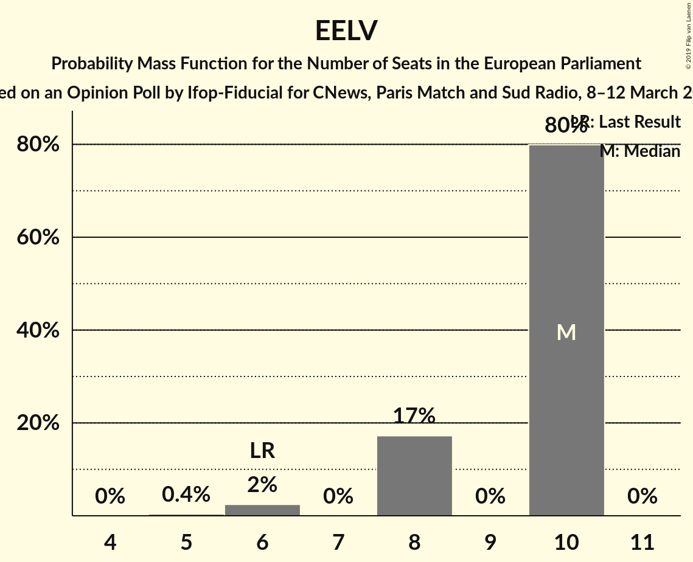

| Number of Seats | Probability | Accumulated | Special Marks |
|:---------------:|:-----------:|:-----------:|:-------------:|
| 6 | 1.2% | 100% | Last Result |
| 7 | 31% | 98.7% |  |
| 8 | 42% | 68% | Median |
| 9 | 26% | 26% |  |
| 10 | 0.5% | 0.7% |  |
| 11 | 0.1% | 0.1% |  |
| 12 | 0% | 0% |  |

### La France insoumise (GUE/NGL) – Parti communiste français (GUE/NGL) – Nouveau Parti anticapitaliste (GUE/NGL)

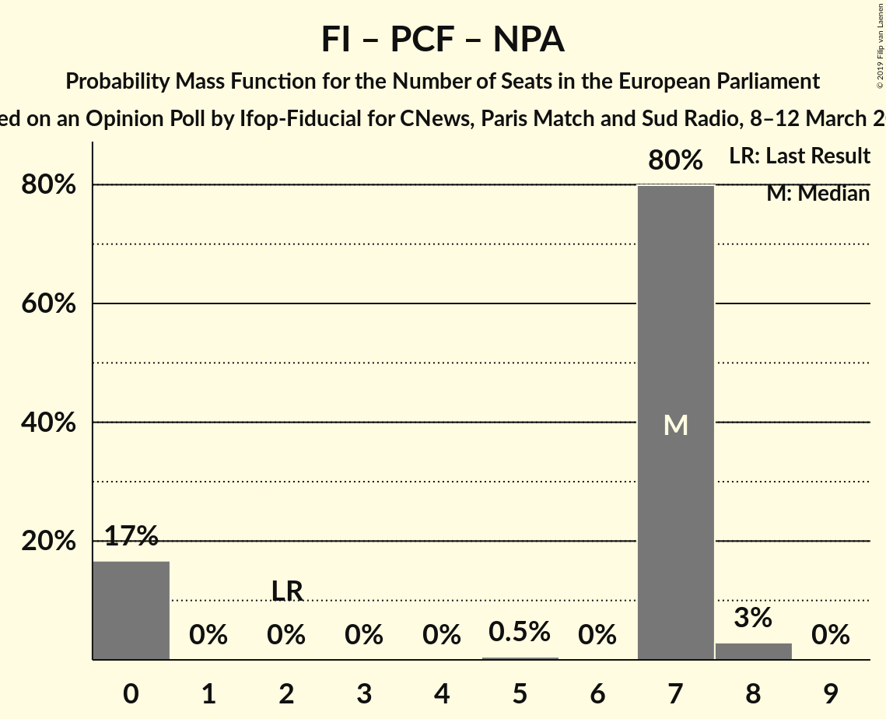

| Number of Seats | Probability | Accumulated | Special Marks |
|:---------------:|:-----------:|:-----------:|:-------------:|
| 2 | 0% | 100% | Last Result |
| 3 | 0% | 100% |  |
| 4 | 0% | 100% |  |
| 5 | 0.3% | 100% |  |
| 6 | 25% | 99.7% |  |
| 7 | 49% | 74% | Median |
| 8 | 26% | 26% |  |
| 9 | 0.3% | 0.3% |  |
| 10 | 0% | 0% |  |

### Parti socialiste (S&D) – Génération·s, le mouvement (S&D)

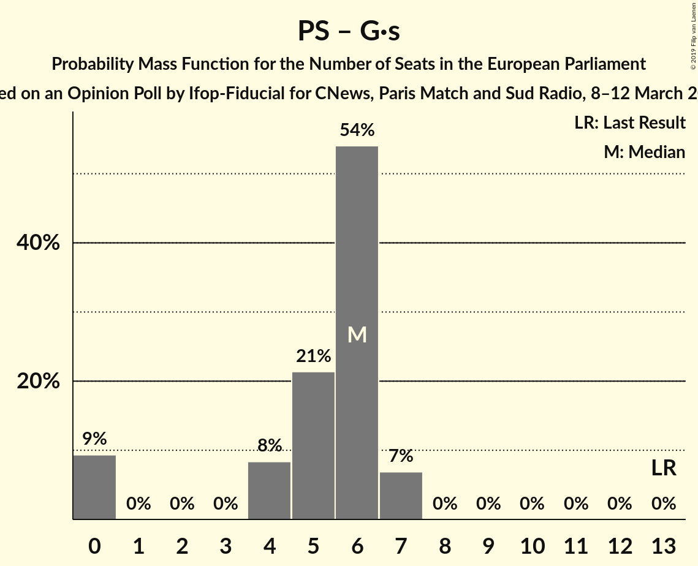

| Number of Seats | Probability | Accumulated | Special Marks |
|:---------------:|:-----------:|:-----------:|:-------------:|
| 0 | 9% | 100% |  |
| 1 | 0% | 91% |  |
| 2 | 0% | 91% |  |
| 3 | 0% | 91% |  |
| 4 | 8% | 91% |  |
| 5 | 21% | 82% |  |
| 6 | 54% | 61% | Median |
| 7 | 7% | 7% |  |
| 8 | 0% | 0% |  |
| 9 | 0% | 0% |  |
| 10 | 0% | 0% |  |
| 11 | 0% | 0% |  |
| 12 | 0% | 0% |  |
| 13 | 0% | 0% | Last Result |

### Debout la France (ECR)

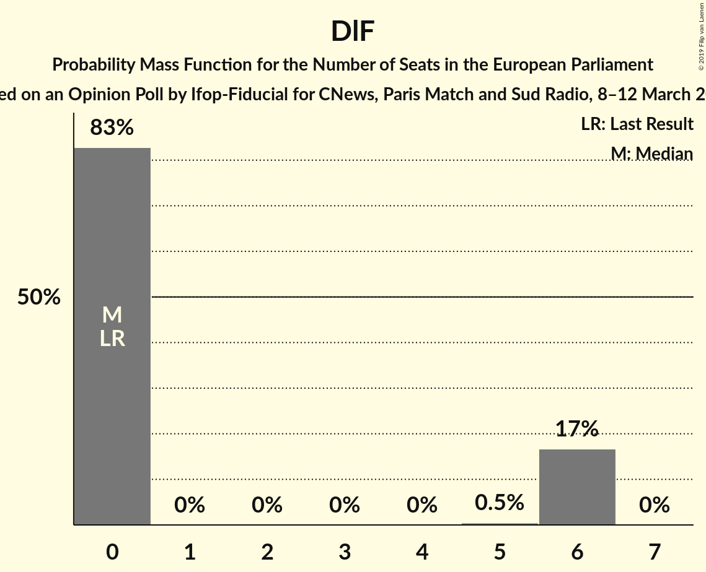

| Number of Seats | Probability | Accumulated | Special Marks |
|:---------------:|:-----------:|:-----------:|:-------------:|
| 0 | 17% | 100% | Last Result |
| 1 | 0% | 83% |  |
| 2 | 0% | 83% |  |
| 3 | 0% | 83% |  |
| 4 | 0% | 83% |  |
| 5 | 65% | 83% | Median |
| 6 | 18% | 18% |  |
| 7 | 0% | 0% |  |

### Les Patriotes (EFDD)

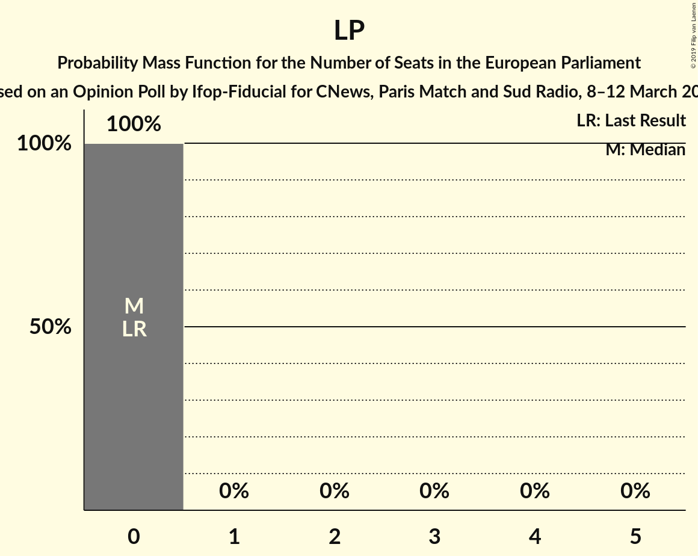

| Number of Seats | Probability | Accumulated | Special Marks |
|:---------------:|:-----------:|:-----------:|:-------------:|
| 0 | 100% | 100% | Last Result, Median |

### Mouvement des gilets jaunes (*) – Résistons! (*) – Union populaire républicaine (*) – Lutte Ouvrière (*)

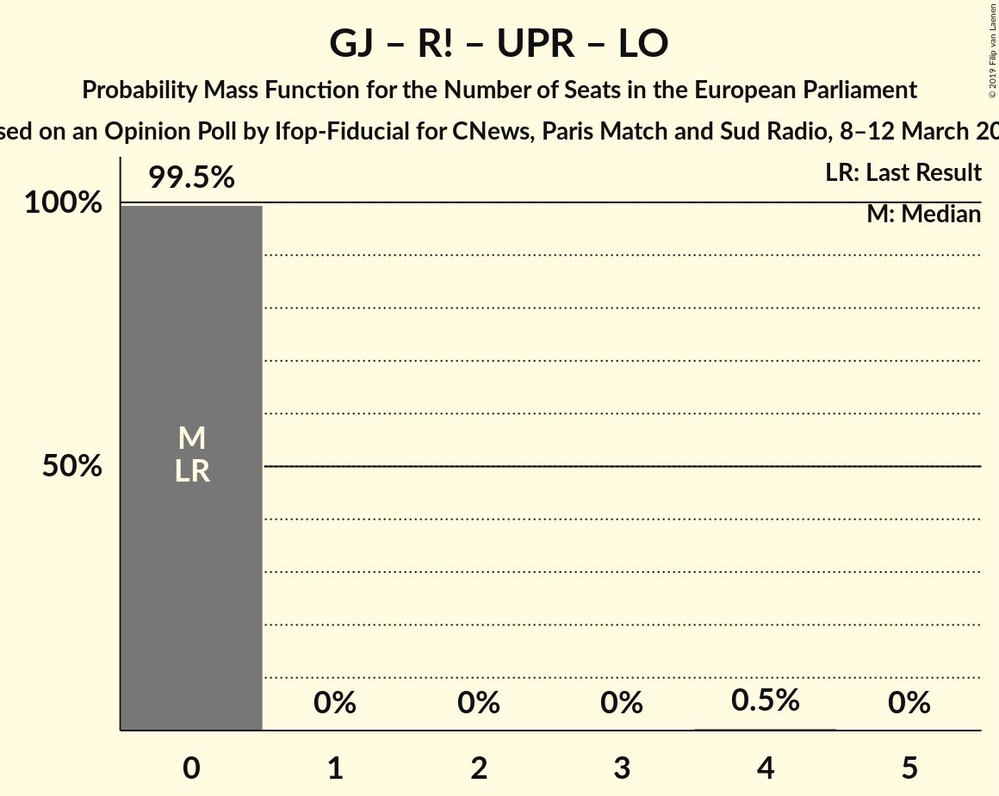

| Number of Seats | Probability | Accumulated | Special Marks |
|:---------------:|:-----------:|:-----------:|:-------------:|
| 0 | 100% | 100% | Last Result, Median |

## Technical Information

### Opinion Poll

+ **Polling firm:** Ifop-Fiducial
+ **Commissioner(s):** CNews, Paris Match and Sud Radio
+ **Fieldwork period:** 8–12 March 2019

### Calculations

+ **Sample size:** 1378
+ **Simulations done:** 131,072
+ **Error estimate:** 2.48%

