# Opinion Poll by Ipsos and Sopra Steria for CEVIPOF and Le Monde, 29 November–12 December 2023

<a href="#voting-intentions">Voting Intentions</a> | <a href="#seats">Seats</a> | <a href="#coalitions">Coalitions</a> | <a href="#technical-information">Technical Information</a>

## Voting Intentions

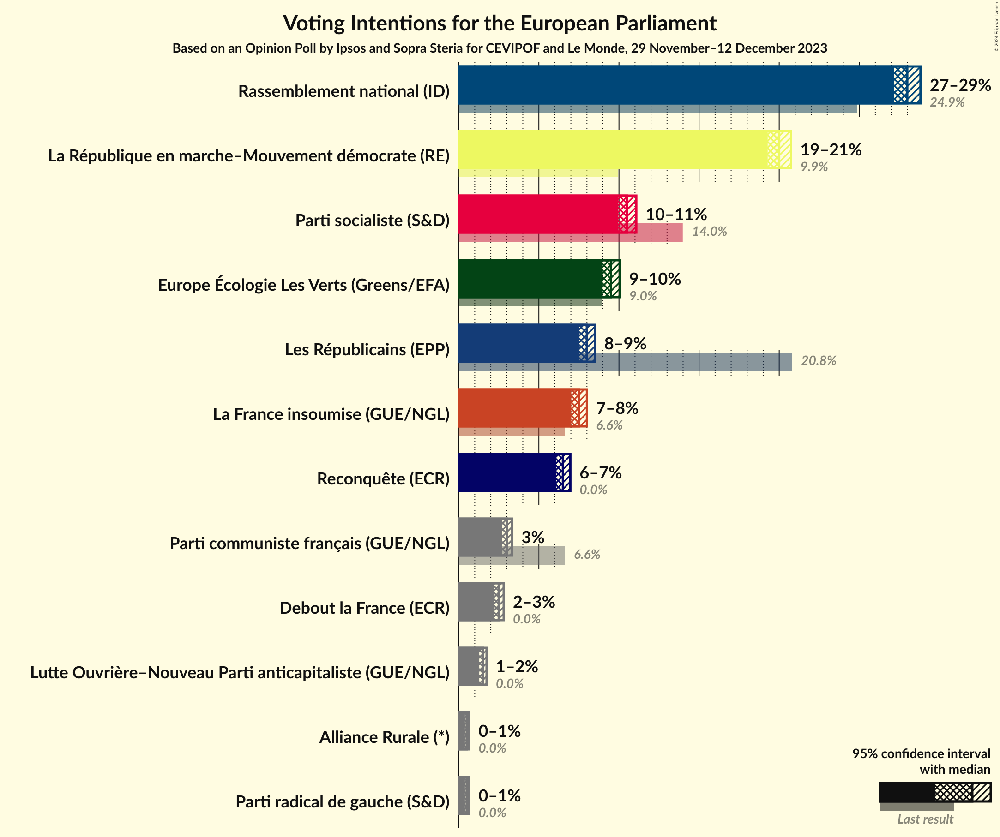

### Confidence Intervals

| Party | Last Result | Poll Result | 80% Confidence Interval | 90% Confidence Interval | 95% Confidence Interval | 99% Confidence Interval |
|:-----:|:-----------:|:-----------:|:-----------------------:|:-----------------------:|:-----------------------:|:-----------------------:|
| Rassemblement national (ID) | 24.9% | 28.0% | 27.5–28.5% |27.3–28.7% |27.2–28.8% |26.9–29.1% |
| La République en marche–Mouvement démocrate (RE) | 9.9% | 20.0% | 19.5–20.5% |19.4–20.6% |19.3–20.7% |19.1–21.0% |
| Parti socialiste (S&D) | 14.0% | 10.5% | 10.1–10.9% |10.0–11.0% |10.0–11.1% |9.8–11.3% |
| Europe Écologie Les Verts (Greens/EFA) | 9.0% | 9.5% | 9.2–9.9% |9.1–10.0% |9.0–10.1% |8.8–10.2% |
| Les Républicains (EPP) | 20.8% | 8.0% | 7.7–8.3% |7.6–8.4% |7.5–8.5% |7.4–8.7% |
| La France insoumise (GUE/NGL) | 6.6% | 7.5% | 7.2–7.8% |7.1–7.9% |7.0–8.0% |6.9–8.2% |
| Reconquête (ECR) | 0.0% | 6.5% | 6.2–6.8% |6.1–6.9% |6.1–7.0% |5.9–7.1% |
| Parti communiste français (GUE/NGL) | 6.6% | 3.0% | 2.8–3.2% |2.7–3.3% |2.7–3.3% |2.6–3.4% |
| Debout la France (ECR) | 0.0% | 2.5% | 2.3–2.7% |2.3–2.8% |2.2–2.8% |2.1–2.9% |
| Lutte Ouvrière–Nouveau Parti anticapitaliste (GUE/NGL) | 0.0% | 1.5% | 1.4–1.7% |1.3–1.7% |1.3–1.7% |1.2–1.8% |
| Alliance Rurale (*) | 0.0% | 0.5% | 0.4–0.6% |0.4–0.6% |0.4–0.7% |0.4–0.7% |
| Parti radical de gauche (S&D) | 0.0% | 0.5% | 0.4–0.6% |0.4–0.6% |0.4–0.7% |0.4–0.7% |

*Note:* The poll result column reflects the actual value used in the calculations. Published results may vary slightly, and in addition be rounded to fewer digits.

## Seats

### Confidence Intervals

| Party | Last Result | Median | 80% Confidence Interval | 90% Confidence Interval | 95% Confidence Interval | 99% Confidence Interval |
|:-----:|:-----------:|:------:|:-----------------------:|:-----------------------:|:-----------------------:|:-----------------------:|
| <a href="#rassemblement-national-(id)">Rassemblement national (ID)</a> | 24 | 26 | 25–26 |25–27 |25–27 |24–27 |
| <a href="#la-république-en-marche–mouvement-démocrate-(re)">La République en marche–Mouvement démocrate (RE)</a> | 7 | 18 | 18–19 |18–19 |17–19 |17–20 |
| <a href="#parti-socialiste-(s&d)">Parti socialiste (S&D)</a> | 13 | 9 | 9–10 |9–10 |9–10 |8–10 |
| <a href="#europe-écologie-les-verts-(greens/efa)">Europe Écologie Les Verts (Greens/EFA)</a> | 6 | 8 | 8–9 |8–9 |8–9 |8–9 |
| <a href="#les-républicains-(epp)">Les Républicains (EPP)</a> | 20 | 7 | 7 |7 |7–8 |6–8 |
| <a href="#la-france-insoumise-(gue/ngl)">La France insoumise (GUE/NGL)</a> | 1 | 7 | 6–7 |6–7 |6–7 |6–7 |
| <a href="#reconquête-(ecr)">Reconquête (ECR)</a> | 0 | 6 | 5–6 |5–6 |5–6 |5–6 |
| <a href="#parti-communiste-français-(gue/ngl)">Parti communiste français (GUE/NGL)</a> | 1 | 0 | 0 |0 |0 |0 |
| <a href="#debout-la-france-(ecr)">Debout la France (ECR)</a> | 0 | 0 | 0 |0 |0 |0 |
| <a href="#lutte-ouvrière–nouveau-parti-anticapitaliste-(gue/ngl)">Lutte Ouvrière–Nouveau Parti anticapitaliste (GUE/NGL)</a> | 0 | 0 | 0 |0 |0 |0 |
| <a href="#alliance-rurale-(*)">Alliance Rurale (*)</a> | 0 | 0 | 0 |0 |0 |0 |
| <a href="#parti-radical-de-gauche-(s&d)">Parti radical de gauche (S&D)</a> | 0 | 0 | 0 |0 |0 |0 |

### Rassemblement national (ID)

*For a full overview of the results for this party, see the [Rassemblement national (ID)](party-rassemblementnationalid.html) page.*

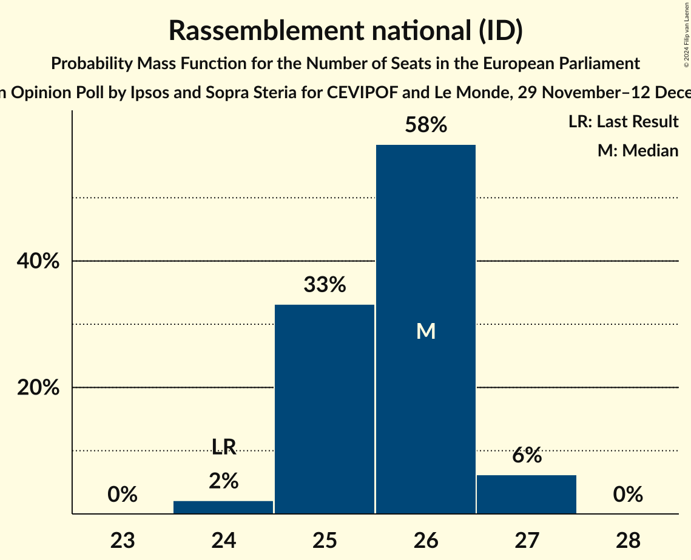

| Number of Seats | Probability | Accumulated | Special Marks |
|:---------------:|:-----------:|:-----------:|:-------------:|
| 24 | 2% | 100% | Last Result |
| 25 | 33% | 98% |  |
| 26 | 58% | 65% | Median |
| 27 | 6% | 6% |  |
| 28 | 0% | 0% |  |

### La République en marche–Mouvement démocrate (RE)

*For a full overview of the results for this party, see the [La République en marche–Mouvement démocrate (RE)](party-larépubliqueenmarche–mouvementdémocratere.html) page.*

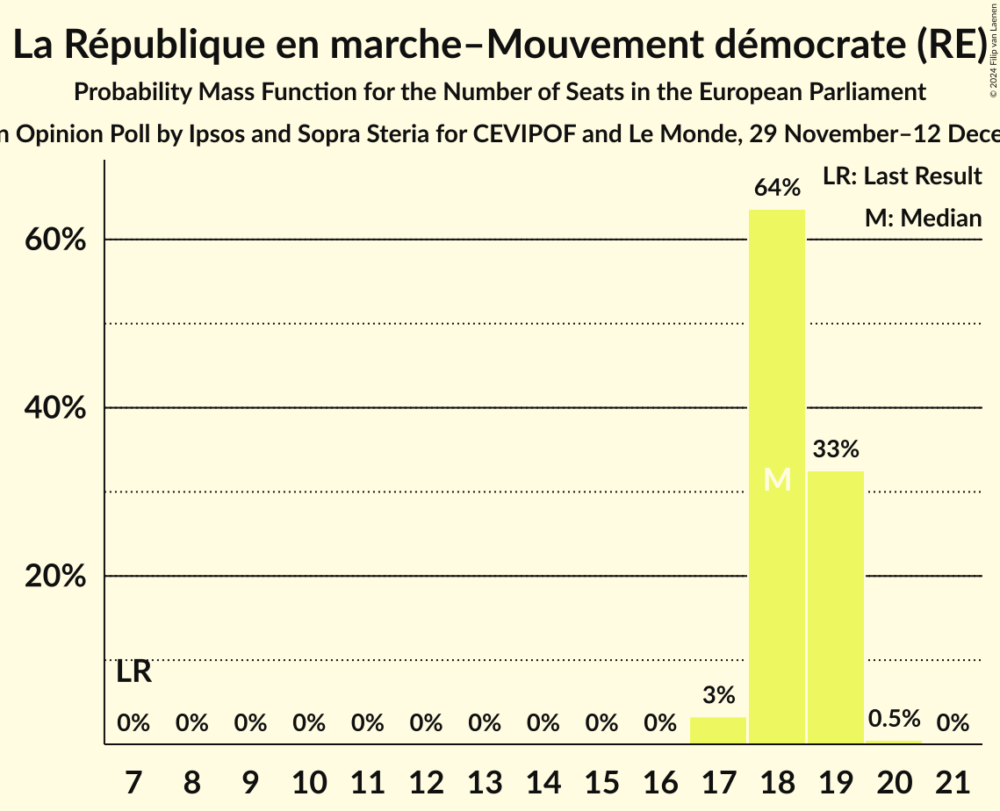

| Number of Seats | Probability | Accumulated | Special Marks |
|:---------------:|:-----------:|:-----------:|:-------------:|
| 7 | 0% | 100% | Last Result |
| 8 | 0% | 100% |  |
| 9 | 0% | 100% |  |
| 10 | 0% | 100% |  |
| 11 | 0% | 100% |  |
| 12 | 0% | 100% |  |
| 13 | 0% | 100% |  |
| 14 | 0% | 100% |  |
| 15 | 0% | 100% |  |
| 16 | 0% | 100% |  |
| 17 | 3% | 100% |  |
| 18 | 64% | 97% | Median |
| 19 | 33% | 33% |  |
| 20 | 0.5% | 0.5% |  |
| 21 | 0% | 0% |  |

### Parti socialiste (S&D)

*For a full overview of the results for this party, see the [Parti socialiste (S&D)](party-partisocialistesd.html) page.*

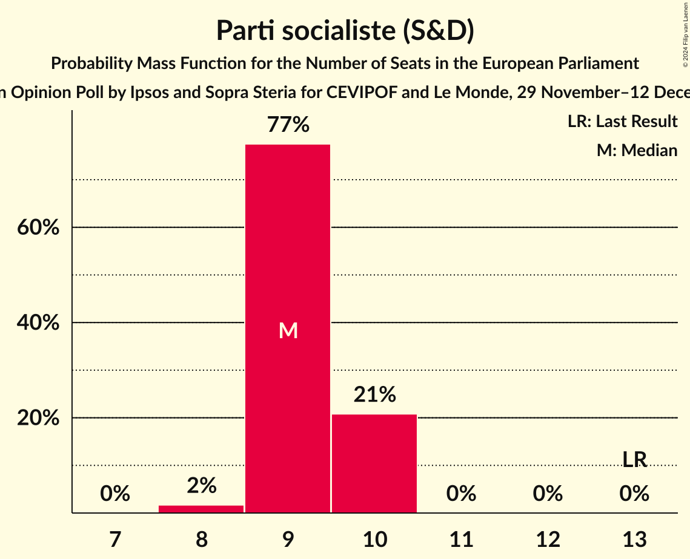

| Number of Seats | Probability | Accumulated | Special Marks |
|:---------------:|:-----------:|:-----------:|:-------------:|
| 8 | 2% | 100% |  |
| 9 | 77% | 98% | Median |
| 10 | 21% | 21% |  |
| 11 | 0% | 0% |  |
| 12 | 0% | 0% |  |
| 13 | 0% | 0% | Last Result |

### Europe Écologie Les Verts (Greens/EFA)

*For a full overview of the results for this party, see the [Europe Écologie Les Verts (Greens/EFA)](party-europeécologielesvertsgreensefa.html) page.*

| Number of Seats | Probability | Accumulated | Special Marks |
|:---------------:|:-----------:|:-----------:|:-------------:|
| 6 | 0% | 100% | Last Result |
| 7 | 0% | 100% |  |
| 8 | 68% | 100% | Median |
| 9 | 32% | 32% |  |
| 10 | 0% | 0% |  |

### Les Républicains (EPP)

*For a full overview of the results for this party, see the [Les Républicains (EPP)](party-lesrépublicainsepp.html) page.*

| Number of Seats | Probability | Accumulated | Special Marks |
|:---------------:|:-----------:|:-----------:|:-------------:|
| 6 | 2% | 100% |  |
| 7 | 95% | 98% | Median |
| 8 | 3% | 3% |  |
| 9 | 0% | 0% |  |
| 10 | 0% | 0% |  |
| 11 | 0% | 0% |  |
| 12 | 0% | 0% |  |
| 13 | 0% | 0% |  |
| 14 | 0% | 0% |  |
| 15 | 0% | 0% |  |
| 16 | 0% | 0% |  |
| 17 | 0% | 0% |  |
| 18 | 0% | 0% |  |
| 19 | 0% | 0% |  |
| 20 | 0% | 0% | Last Result |

### La France insoumise (GUE/NGL)

*For a full overview of the results for this party, see the [La France insoumise (GUE/NGL)](party-lafranceinsoumiseguengl.html) page.*

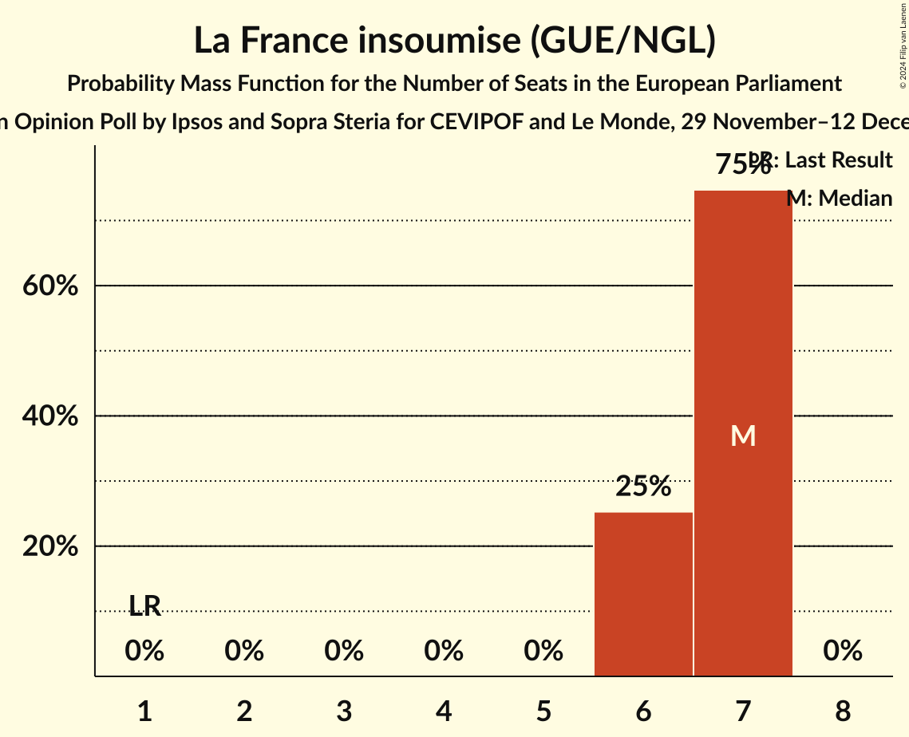

| Number of Seats | Probability | Accumulated | Special Marks |
|:---------------:|:-----------:|:-----------:|:-------------:|
| 1 | 0% | 100% | Last Result |
| 2 | 0% | 100% |  |
| 3 | 0% | 100% |  |
| 4 | 0% | 100% |  |
| 5 | 0% | 100% |  |
| 6 | 25% | 100% |  |
| 7 | 75% | 75% | Median |
| 8 | 0% | 0% |  |

### Reconquête (ECR)

*For a full overview of the results for this party, see the [Reconquête (ECR)](party-reconquêteecr.html) page.*

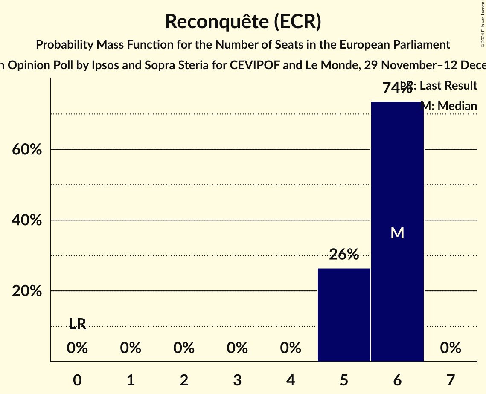

| Number of Seats | Probability | Accumulated | Special Marks |
|:---------------:|:-----------:|:-----------:|:-------------:|
| 0 | 0% | 100% | Last Result |
| 1 | 0% | 100% |  |
| 2 | 0% | 100% |  |
| 3 | 0% | 100% |  |
| 4 | 0% | 100% |  |
| 5 | 26% | 100% |  |
| 6 | 74% | 74% | Median |
| 7 | 0% | 0% |  |

### Parti communiste français (GUE/NGL)

*For a full overview of the results for this party, see the [Parti communiste français (GUE/NGL)](party-particommunistefrançaisguengl.html) page.*

| Number of Seats | Probability | Accumulated | Special Marks |
|:---------------:|:-----------:|:-----------:|:-------------:|
| 0 | 100% | 100% | Median |
| 1 | 0% | 0% | Last Result |

### Debout la France (ECR)

*For a full overview of the results for this party, see the [Debout la France (ECR)](party-deboutlafranceecr.html) page.*

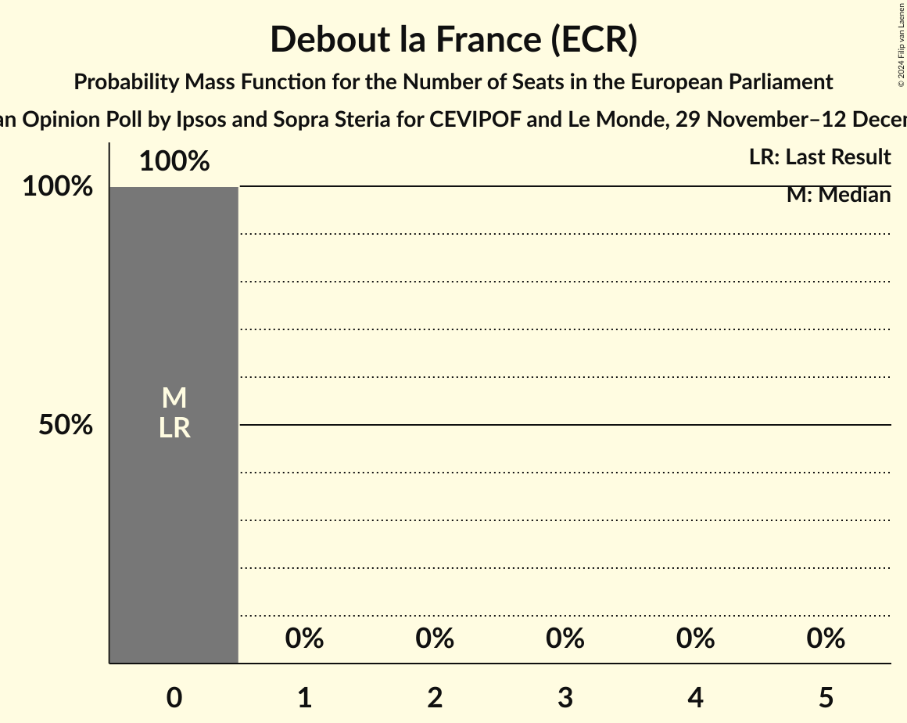

| Number of Seats | Probability | Accumulated | Special Marks |
|:---------------:|:-----------:|:-----------:|:-------------:|
| 0 | 100% | 100% | Last Result, Median |

### Lutte Ouvrière–Nouveau Parti anticapitaliste (GUE/NGL)

*For a full overview of the results for this party, see the [Lutte Ouvrière–Nouveau Parti anticapitaliste (GUE/NGL)](party-lutteouvrière–nouveaupartianticapitalisteguengl.html) page.*

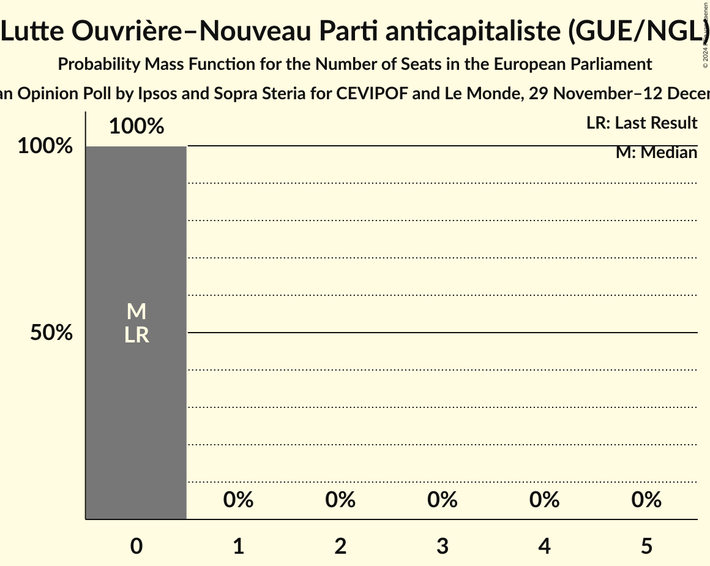

| Number of Seats | Probability | Accumulated | Special Marks |
|:---------------:|:-----------:|:-----------:|:-------------:|
| 0 | 100% | 100% | Last Result, Median |

### Alliance Rurale (*)

*For a full overview of the results for this party, see the [Alliance Rurale (*)](party-alliancerurale.html) page.*

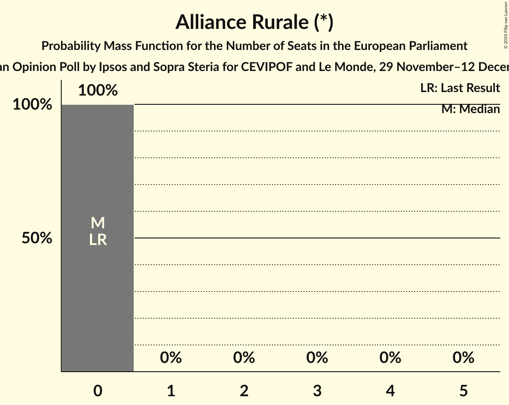

| Number of Seats | Probability | Accumulated | Special Marks |
|:---------------:|:-----------:|:-----------:|:-------------:|
| 0 | 100% | 100% | Last Result, Median |

### Parti radical de gauche (S&D)

*For a full overview of the results for this party, see the [Parti radical de gauche (S&D)](party-partiradicaldegauchesd.html) page.*

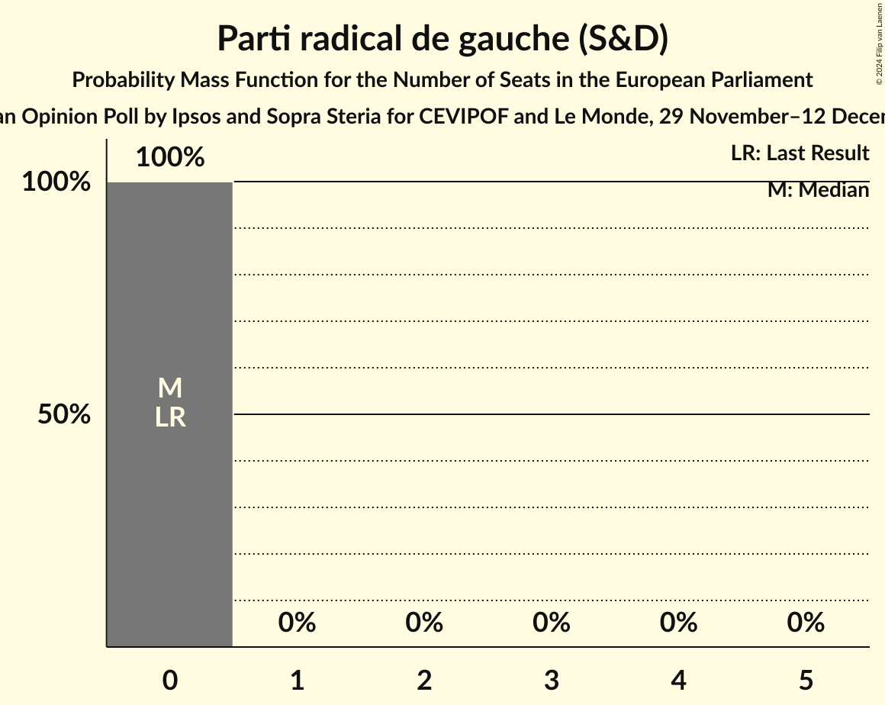

| Number of Seats | Probability | Accumulated | Special Marks |
|:---------------:|:-----------:|:-----------:|:-------------:|
| 0 | 100% | 100% | Last Result, Median |

## Coalitions

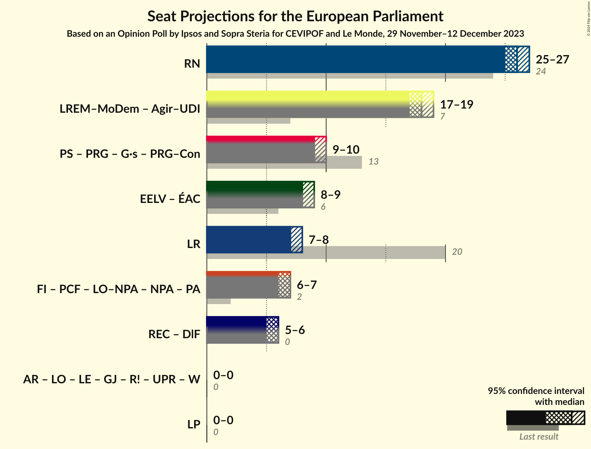

### Confidence Intervals

| Coalition | Last Result | Median | Majority? | 80% Confidence Interval | 90% Confidence Interval | 95% Confidence Interval | 99% Confidence Interval |
|:---------:|:-----------:|:------:|:---------:|:-----------------------:|:-----------------------:|:-----------------------:|:-----------------------:|
| Rassemblement national (ID) | 24 | 26 | 0% | 25–26 | 25–27 | 25–27 | 24–27 |
| Les Républicains (EPP) | 20 | 7 | 0% | 7 | 7 | 7–8 | 6–8 |
| Reconquête (ECR) – Debout la France (ECR) | 0 | 6 | 0% | 5–6 | 5–6 | 5–6 | 5–6 |

### Rassemblement national (ID)

| Number of Seats | Probability | Accumulated | Special Marks |
|:---------------:|:-----------:|:-----------:|:-------------:|
| 24 | 2% | 100% | Last Result |
| 25 | 33% | 98% |  |
| 26 | 58% | 65% | Median |
| 27 | 6% | 6% |  |
| 28 | 0% | 0% |  |

### Les Républicains (EPP)

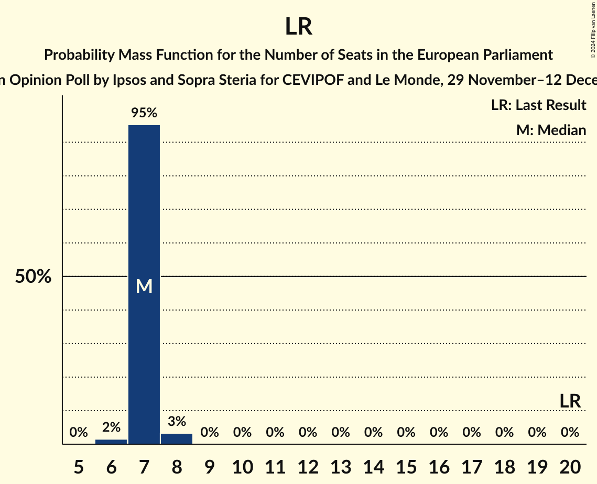

| Number of Seats | Probability | Accumulated | Special Marks |
|:---------------:|:-----------:|:-----------:|:-------------:|
| 6 | 2% | 100% |  |
| 7 | 95% | 98% | Median |
| 8 | 3% | 3% |  |
| 9 | 0% | 0% |  |
| 10 | 0% | 0% |  |
| 11 | 0% | 0% |  |
| 12 | 0% | 0% |  |
| 13 | 0% | 0% |  |
| 14 | 0% | 0% |  |
| 15 | 0% | 0% |  |
| 16 | 0% | 0% |  |
| 17 | 0% | 0% |  |
| 18 | 0% | 0% |  |
| 19 | 0% | 0% |  |
| 20 | 0% | 0% | Last Result |

### Reconquête (ECR) – Debout la France (ECR)

| Number of Seats | Probability | Accumulated | Special Marks |
|:---------------:|:-----------:|:-----------:|:-------------:|
| 0 | 0% | 100% | Last Result |
| 1 | 0% | 100% |  |
| 2 | 0% | 100% |  |
| 3 | 0% | 100% |  |
| 4 | 0% | 100% |  |
| 5 | 26% | 100% |  |
| 6 | 74% | 74% | Median |
| 7 | 0% | 0% |  |

## Technical Information

### Opinion Poll

+ **Polling firm:** Ipsos and Sopra Steria
+ **Commissioner(s):** CEVIPOF and Le Monde
+ **Fieldwork period:** 29 November–12 December 2023

### Calculations

+ **Sample size:** 11691
+ **Simulations done:** 1,048,576
+ **Error estimate:** 0.49%

