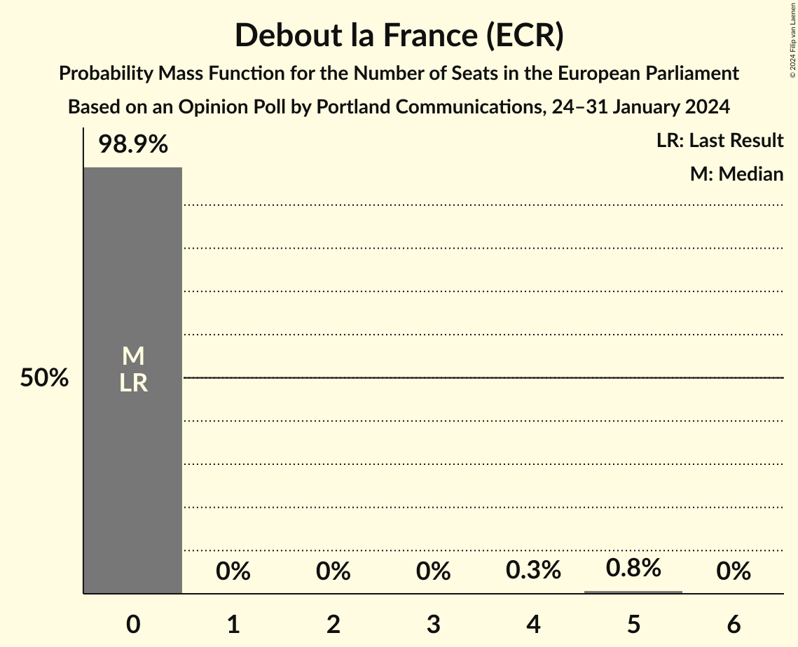
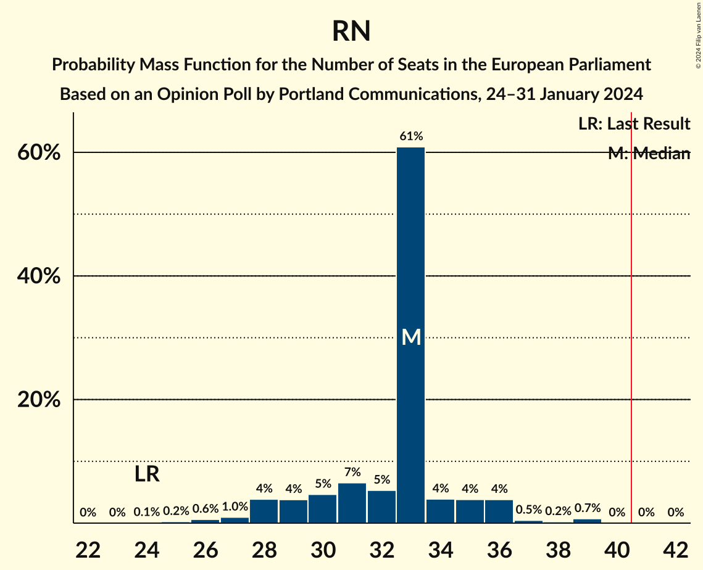

# Opinion Poll by Portland Communications, 24–31 January 2024

<a href="#voting-intentions">Voting Intentions</a> | <a href="#seats">Seats</a> | <a href="#coalitions">Coalitions</a> | <a href="#technical-information">Technical Information</a>

## Voting Intentions

### Confidence Intervals

| Party | Last Result | Poll Result | 80% Confidence Interval | 90% Confidence Interval | 95% Confidence Interval | 99% Confidence Interval |
|:-----:|:-----------:|:-----------:|:-----------------------:|:-----------------------:|:-----------------------:|:-----------------------:|
| Rassemblement national (ID) | 24.9% | 33.0% | 30.3–35.9% |29.6–36.7% |28.9–37.4% |27.7–38.8% |
| La République en marche–Mouvement démocrate (RE) | 9.9% | 14.1% | 12.2–16.3% |11.7–17.0% |11.2–17.5% |10.4–18.7% |
| Parti socialiste (S&D) | 14.0% | 9.0% | 7.5–10.9% |7.0–11.4% |6.7–11.9% |6.0–12.9% |
| Europe Écologie Les Verts (Greens/EFA) | 9.0% | 9.0% | 7.5–10.9% |7.0–11.4% |6.7–11.9% |6.0–12.9% |
| Les Républicains (EPP) | 20.8% | 8.1% | 6.7–10.0% |6.3–10.5% |6.0–10.9% |5.3–11.9% |
| Reconquête (ECR) | 0.0% | 6.0% | 4.8–7.6% |4.4–8.1% |4.2–8.5% |3.7–9.4% |
| La France insoumise (GUE/NGL) | 6.6% | 6.0% | 4.8–7.6% |4.4–8.1% |4.2–8.5% |3.7–9.4% |
| Debout la France (ECR) | 0.0% | 3.0% | 2.2–4.3% |2.0–4.6% |1.8–5.0% |1.5–5.6% |
| Parti communiste français (GUE/NGL) | 6.6% | 3.0% | 2.2–4.3% |2.0–4.6% |1.8–5.0% |1.5–5.6% |
| Lutte Ouvrière (*) | 0.0% | 1.9% | 1.3–3.0% |1.2–3.3% |1.0–3.6% |0.8–4.2% |
| Alliance Rurale (*) | 0.0% | 1.1% | 0.7–2.0% |0.5–2.2% |0.5–2.5% |0.3–3.0% |
| Parti radical de gauche (S&D) | 0.0% | 1.1% | 0.7–2.0% |0.5–2.2% |0.5–2.5% |0.3–3.0% |

*Note:* The poll result column reflects the actual value used in the calculations. Published results may vary slightly, and in addition be rounded to fewer digits.

## Seats

### Confidence Intervals

| Party | Last Result | Median | 80% Confidence Interval | 90% Confidence Interval | 95% Confidence Interval | 99% Confidence Interval |
|:-----:|:-----------:|:------:|:-----------------------:|:-----------------------:|:-----------------------:|:-----------------------:|
| <a href="#rassemblement-national-(id)">Rassemblement national (ID)</a> | 24 | 33 | 30–34 |28–36 |28–36 |26–39 |
| <a href="#la-république-en-marche–mouvement-démocrate-(re)">La République en marche–Mouvement démocrate (RE)</a> | 7 | 14 | 12–14 |11–15 |10–16 |10–17 |
| <a href="#parti-socialiste-(s&d)">Parti socialiste (S&D)</a> | 13 | 8 | 7–9 |7–10 |6–10 |6–12 |
| <a href="#europe-écologie-les-verts-(greens/efa)">Europe Écologie Les Verts (Greens/EFA)</a> | 6 | 8 | 7–9 |6–10 |6–11 |6–12 |
| <a href="#les-républicains-(epp)">Les Républicains (EPP)</a> | 20 | 8 | 7–9 |6–9 |6–10 |5–12 |
| <a href="#reconquête-(ecr)">Reconquête (ECR)</a> | 0 | 5 | 0–6 |0–7 |0–8 |0–8 |
| <a href="#la-france-insoumise-(gue/ngl)">La France insoumise (GUE/NGL)</a> | 1 | 5 | 5–6 |0–7 |0–7 |0–8 |
| <a href="#debout-la-france-(ecr)">Debout la France (ECR)</a> | 0 | 0 | 0 |0 |0 |0–5 |
| <a href="#parti-communiste-français-(gue/ngl)">Parti communiste français (GUE/NGL)</a> | 1 | 0 | 0 |0 |0 |0–5 |
| <a href="#lutte-ouvrière-(*)">Lutte Ouvrière (*)</a> | 0 | 0 | 0 |0 |0 |0 |
| <a href="#alliance-rurale-(*)">Alliance Rurale (*)</a> | 0 | 0 | 0 |0 |0 |0 |
| <a href="#parti-radical-de-gauche-(s&d)">Parti radical de gauche (S&D)</a> | 0 | 0 | 0 |0 |0 |0 |

### Rassemblement national (ID)

*For a full overview of the results for this party, see the [Rassemblement national (ID)](party-rassemblementnationalid.html) page.*

| Number of Seats | Probability | Accumulated | Special Marks |
|:---------------:|:-----------:|:-----------:|:-------------:|
| 24 | 0.1% | 100% | Last Result |
| 25 | 0.2% | 99.9% |  |
| 26 | 0.6% | 99.7% |  |
| 27 | 1.0% | 99.1% |  |
| 28 | 4% | 98% |  |
| 29 | 4% | 94% |  |
| 30 | 5% | 90% |  |
| 31 | 7% | 86% |  |
| 32 | 5% | 79% |  |
| 33 | 61% | 74% | Median |
| 34 | 4% | 13% |  |
| 35 | 4% | 9% |  |
| 36 | 4% | 5% |  |
| 37 | 0.5% | 1.5% |  |
| 38 | 0.2% | 1.0% |  |
| 39 | 0.7% | 0.8% |  |
| 40 | 0% | 0.1% |  |
| 41 | 0% | 0% | Majority |

### La République en marche–Mouvement démocrate (RE)

*For a full overview of the results for this party, see the [La République en marche–Mouvement démocrate (RE)](party-larépubliqueenmarche–mouvementdémocratere.html) page.*

| Number of Seats | Probability | Accumulated | Special Marks |
|:---------------:|:-----------:|:-----------:|:-------------:|
| 7 | 0% | 100% | Last Result |
| 8 | 0% | 100% |  |
| 9 | 0.4% | 100% |  |
| 10 | 2% | 99.6% |  |
| 11 | 5% | 97% |  |
| 12 | 5% | 92% |  |
| 13 | 11% | 87% |  |
| 14 | 67% | 75% | Median |
| 15 | 4% | 9% |  |
| 16 | 3% | 5% |  |
| 17 | 1.2% | 2% |  |
| 18 | 0.2% | 0.3% |  |
| 19 | 0.1% | 0.1% |  |
| 20 | 0% | 0% |  |

### Parti socialiste (S&D)

*For a full overview of the results for this party, see the [Parti socialiste (S&D)](party-partisocialistesd.html) page.*

| Number of Seats | Probability | Accumulated | Special Marks |
|:---------------:|:-----------:|:-----------:|:-------------:|
| 5 | 0.2% | 100% |  |
| 6 | 4% | 99.8% |  |
| 7 | 8% | 96% |  |
| 8 | 65% | 87% | Median |
| 9 | 13% | 22% |  |
| 10 | 6% | 9% |  |
| 11 | 2% | 2% |  |
| 12 | 0.5% | 0.6% |  |
| 13 | 0% | 0.1% | Last Result |
| 14 | 0% | 0% |  |

### Europe Écologie Les Verts (Greens/EFA)

*For a full overview of the results for this party, see the [Europe Écologie Les Verts (Greens/EFA)](party-europeécologielesvertsgreensefa.html) page.*

| Number of Seats | Probability | Accumulated | Special Marks |
|:---------------:|:-----------:|:-----------:|:-------------:|
| 4 | 0.1% | 100% |  |
| 5 | 0.3% | 99.9% |  |
| 6 | 5% | 99.5% | Last Result |
| 7 | 9% | 95% |  |
| 8 | 65% | 85% | Median |
| 9 | 10% | 20% |  |
| 10 | 6% | 10% |  |
| 11 | 3% | 4% |  |
| 12 | 0.7% | 0.8% |  |
| 13 | 0.1% | 0.1% |  |
| 14 | 0% | 0% |  |

### Les Républicains (EPP)

*For a full overview of the results for this party, see the [Les Républicains (EPP)](party-lesrépublicainsepp.html) page.*

| Number of Seats | Probability | Accumulated | Special Marks |
|:---------------:|:-----------:|:-----------:|:-------------:|
| 0 | 0.1% | 100% |  |
| 1 | 0% | 99.9% |  |
| 2 | 0% | 99.9% |  |
| 3 | 0% | 99.9% |  |
| 4 | 0.1% | 99.9% |  |
| 5 | 2% | 99.8% |  |
| 6 | 7% | 98% |  |
| 7 | 16% | 91% |  |
| 8 | 65% | 75% | Median |
| 9 | 6% | 11% |  |
| 10 | 4% | 5% |  |
| 11 | 0.5% | 1.0% |  |
| 12 | 0.5% | 0.5% |  |
| 13 | 0% | 0% |  |
| 14 | 0% | 0% |  |
| 15 | 0% | 0% |  |
| 16 | 0% | 0% |  |
| 17 | 0% | 0% |  |
| 18 | 0% | 0% |  |
| 19 | 0% | 0% |  |
| 20 | 0% | 0% | Last Result |

### Reconquête (ECR)

*For a full overview of the results for this party, see the [Reconquête (ECR)](party-reconquêteecr.html) page.*

| Number of Seats | Probability | Accumulated | Special Marks |
|:---------------:|:-----------:|:-----------:|:-------------:|
| 0 | 12% | 100% | Last Result |
| 1 | 0% | 88% |  |
| 2 | 0% | 88% |  |
| 3 | 0% | 88% |  |
| 4 | 2% | 88% |  |
| 5 | 68% | 86% | Median |
| 6 | 9% | 18% |  |
| 7 | 5% | 9% |  |
| 8 | 4% | 4% |  |
| 9 | 0.2% | 0.2% |  |
| 10 | 0.1% | 0.1% |  |
| 11 | 0% | 0% |  |

### La France insoumise (GUE/NGL)

*For a full overview of the results for this party, see the [La France insoumise (GUE/NGL)](party-lafranceinsoumiseguengl.html) page.*

| Number of Seats | Probability | Accumulated | Special Marks |
|:---------------:|:-----------:|:-----------:|:-------------:|
| 0 | 9% | 100% |  |
| 1 | 0% | 91% | Last Result |
| 2 | 0% | 91% |  |
| 3 | 0% | 91% |  |
| 4 | 0.1% | 91% |  |
| 5 | 70% | 91% | Median |
| 6 | 13% | 21% |  |
| 7 | 6% | 8% |  |
| 8 | 2% | 2% |  |
| 9 | 0.2% | 0.3% |  |
| 10 | 0.1% | 0.1% |  |
| 11 | 0% | 0% |  |

### Debout la France (ECR)

*For a full overview of the results for this party, see the [Debout la France (ECR)](party-deboutlafranceecr.html) page.*

| Number of Seats | Probability | Accumulated | Special Marks |
|:---------------:|:-----------:|:-----------:|:-------------:|
| 0 | 98.9% | 100% | Last Result, Median |
| 1 | 0% | 1.1% |  |
| 2 | 0% | 1.1% |  |
| 3 | 0% | 1.1% |  |
| 4 | 0.3% | 1.1% |  |
| 5 | 0.8% | 0.8% |  |
| 6 | 0% | 0% |  |

### Parti communiste français (GUE/NGL)

*For a full overview of the results for this party, see the [Parti communiste français (GUE/NGL)](party-particommunistefrançaisguengl.html) page.*

| Number of Seats | Probability | Accumulated | Special Marks |
|:---------------:|:-----------:|:-----------:|:-------------:|
| 0 | 98.8% | 100% | Median |
| 1 | 0% | 1.2% | Last Result |
| 2 | 0% | 1.2% |  |
| 3 | 0% | 1.2% |  |
| 4 | 0.3% | 1.2% |  |
| 5 | 0.9% | 0.9% |  |
| 6 | 0% | 0% |  |

### Lutte Ouvrière (*)

*For a full overview of the results for this party, see the [Lutte Ouvrière (*)](party-lutteouvrière.html) page.*

| Number of Seats | Probability | Accumulated | Special Marks |
|:---------------:|:-----------:|:-----------:|:-------------:|
| 0 | 100% | 100% | Last Result, Median |

### Alliance Rurale (*)

*For a full overview of the results for this party, see the [Alliance Rurale (*)](party-alliancerurale.html) page.*

| Number of Seats | Probability | Accumulated | Special Marks |
|:---------------:|:-----------:|:-----------:|:-------------:|
| 0 | 100% | 100% | Last Result, Median |

### Parti radical de gauche (S&D)

*For a full overview of the results for this party, see the [Parti radical de gauche (S&D)](party-partiradicaldegauchesd.html) page.*

| Number of Seats | Probability | Accumulated | Special Marks |
|:---------------:|:-----------:|:-----------:|:-------------:|
| 0 | 100% | 100% | Last Result, Median |

## Coalitions

### Confidence Intervals

| Coalition | Last Result | Median | Majority? | 80% Confidence Interval | 90% Confidence Interval | 95% Confidence Interval | 99% Confidence Interval |
|:---------:|:-----------:|:------:|:---------:|:-----------------------:|:-----------------------:|:-----------------------:|:-----------------------:|
| Rassemblement national (ID) | 24 | 33 | 0% | 30–34 | 28–36 | 28–36 | 26–39 |
| Les Républicains (EPP) | 20 | 8 | 0% | 7–9 | 6–9 | 6–10 | 5–12 |
| Reconquête (ECR) – Debout la France (ECR) | 0 | 5 | 0% | 0–6 | 0–8 | 0–8 | 0–10 |

### Rassemblement national (ID)

| Number of Seats | Probability | Accumulated | Special Marks |
|:---------------:|:-----------:|:-----------:|:-------------:|
| 24 | 0.1% | 100% | Last Result |
| 25 | 0.2% | 99.9% |  |
| 26 | 0.6% | 99.7% |  |
| 27 | 1.0% | 99.1% |  |
| 28 | 4% | 98% |  |
| 29 | 4% | 94% |  |
| 30 | 5% | 90% |  |
| 31 | 7% | 86% |  |
| 32 | 5% | 79% |  |
| 33 | 61% | 74% | Median |
| 34 | 4% | 13% |  |
| 35 | 4% | 9% |  |
| 36 | 4% | 5% |  |
| 37 | 0.5% | 1.5% |  |
| 38 | 0.2% | 1.0% |  |
| 39 | 0.7% | 0.8% |  |
| 40 | 0% | 0.1% |  |
| 41 | 0% | 0% | Majority |

### Les Républicains (EPP)

| Number of Seats | Probability | Accumulated | Special Marks |
|:---------------:|:-----------:|:-----------:|:-------------:|
| 0 | 0.1% | 100% |  |
| 1 | 0% | 99.9% |  |
| 2 | 0% | 99.9% |  |
| 3 | 0% | 99.9% |  |
| 4 | 0.1% | 99.9% |  |
| 5 | 2% | 99.8% |  |
| 6 | 7% | 98% |  |
| 7 | 16% | 91% |  |
| 8 | 65% | 75% | Median |
| 9 | 6% | 11% |  |
| 10 | 4% | 5% |  |
| 11 | 0.5% | 1.0% |  |
| 12 | 0.5% | 0.5% |  |
| 13 | 0% | 0% |  |
| 14 | 0% | 0% |  |
| 15 | 0% | 0% |  |
| 16 | 0% | 0% |  |
| 17 | 0% | 0% |  |
| 18 | 0% | 0% |  |
| 19 | 0% | 0% |  |
| 20 | 0% | 0% | Last Result |

### Reconquête (ECR) – Debout la France (ECR)

| Number of Seats | Probability | Accumulated | Special Marks |
|:---------------:|:-----------:|:-----------:|:-------------:|
| 0 | 12% | 100% | Last Result |
| 1 | 0% | 88% |  |
| 2 | 0% | 88% |  |
| 3 | 0% | 88% |  |
| 4 | 1.4% | 88% |  |
| 5 | 68% | 87% | Median |
| 6 | 9% | 19% |  |
| 7 | 4% | 10% |  |
| 8 | 4% | 5% |  |
| 9 | 0.4% | 1.1% |  |
| 10 | 0.5% | 0.7% |  |
| 11 | 0.2% | 0.2% |  |
| 12 | 0% | 0% |  |

## Technical Information

### Opinion Poll

+ **Polling firm:** Portland Communications
+ **Commissioner(s):** —
+ **Fieldwork period:** 24–31 January 2024

### Calculations

+ **Sample size:** 469
+ **Simulations done:** 2,097,152
+ **Error estimate:** 2.70%

