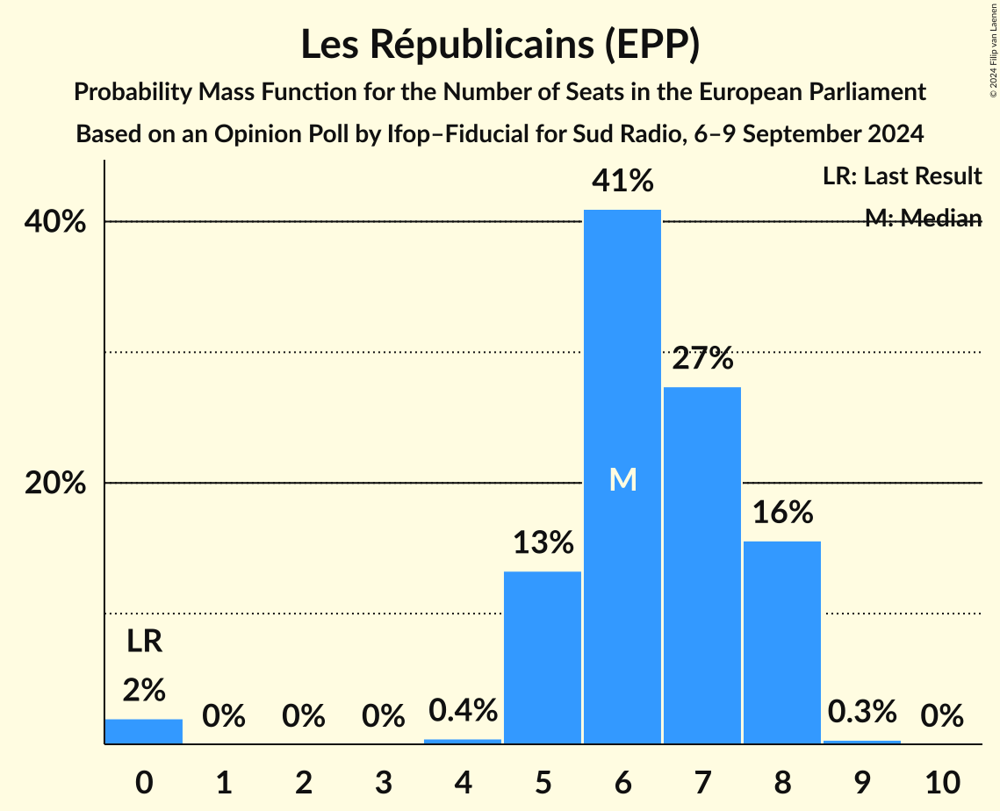
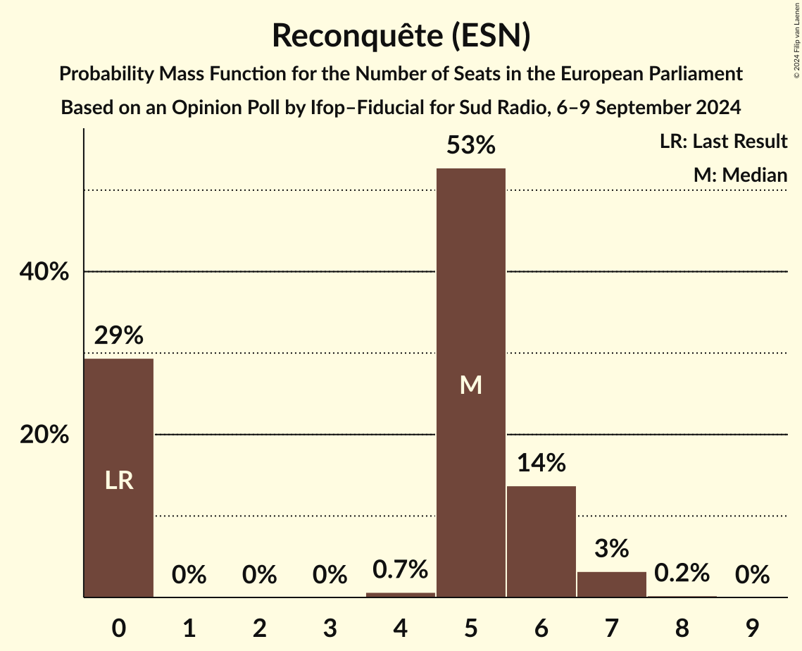
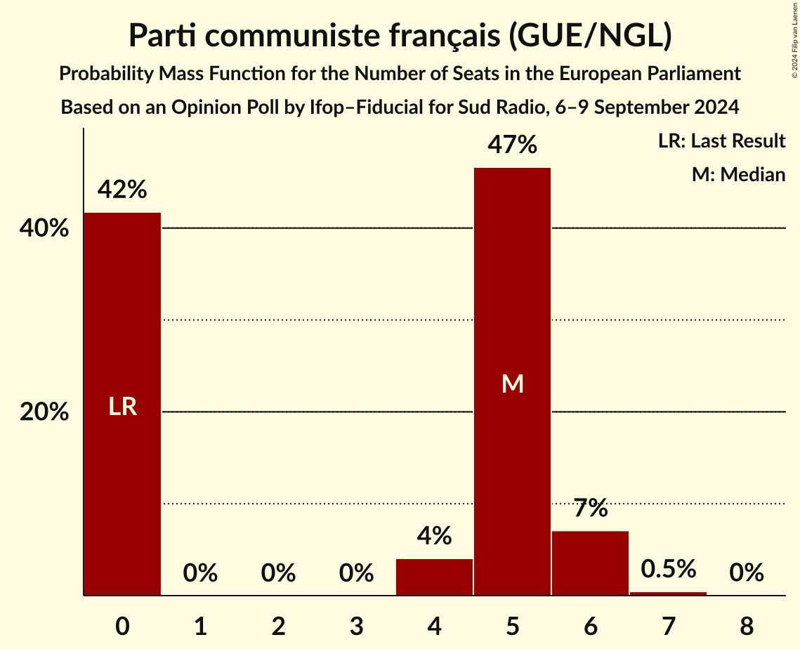
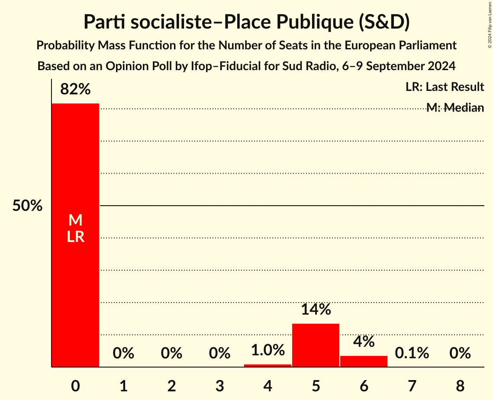
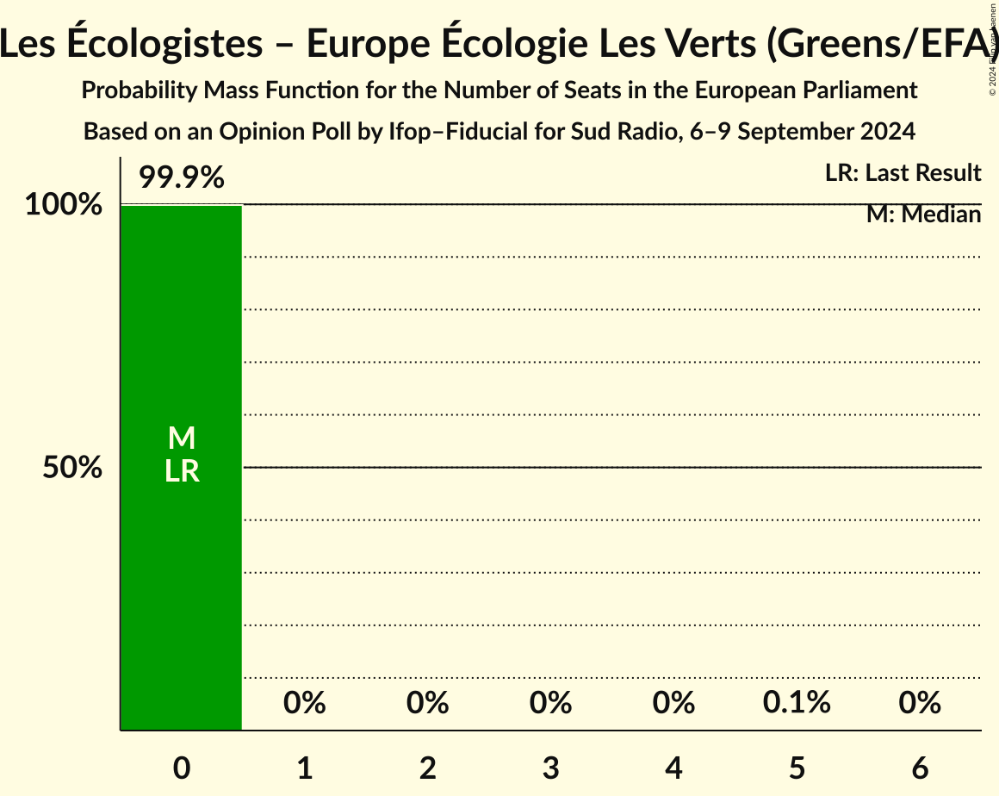

# Opinion Poll by Ifop–Fiducial for Sud Radio, 6–9 September 2024

<a href="#voting-intentions">Voting Intentions</a> | <a href="#seats">Seats</a> | <a href="#coalitions">Coalitions</a> | <a href="#technical-information">Technical Information</a>

## Voting Intentions

### Confidence Intervals

| Party | Last Result | Poll Result | 80% Confidence Interval | 90% Confidence Interval | 95% Confidence Interval | 99% Confidence Interval |
|:-----:|:-----------:|:-----------:|:-----------------------:|:-----------------------:|:-----------------------:|:-----------------------:|
| Rassemblement national (PfE) | 0.0% | 34.3% | 32.5–36.2% |32.0–36.7% |31.5–37.2% |30.7–38.1% |
| Renaissance–Mouvement démocrate–Horizons (RE) | 0.0% | 21.3% | 19.7–22.9% |19.3–23.4% |18.9–23.8% |18.2–24.6% |
| La France insoumise (GUE/NGL) | 0.0% | 12.2% | 11.0–13.5% |10.7–13.9% |10.4–14.3% |9.8–15.0% |
| Les Républicains (EPP) | 0.0% | 6.4% | 5.5–7.5% |5.3–7.8% |5.1–8.0% |4.7–8.6% |
| Reconquête (ESN) | 0.0% | 5.5% | 4.7–6.5% |4.5–6.8% |4.3–7.0% |3.9–7.5% |
| Parti communiste français (GUE/NGL) | 0.0% | 4.9% | 4.2–5.9% |4.0–6.2% |3.8–6.4% |3.5–6.9% |
| Parti socialiste–Place Publique (S&D) | 0.0% | 4.7% | 3.9–5.6% |3.7–5.9% |3.6–6.1% |3.2–6.6% |
| Les Écologistes – Europe Écologie Les Verts (Greens/EFA) | 0.0% | 3.1% | 2.5–3.9% |2.4–4.1% |2.2–4.3% |2.0–4.7% |
| Debout la France (ECR) | 0.0% | 2.4% | 1.9–3.1% |1.7–3.3% |1.6–3.5% |1.4–3.8% |
| Résistons! (*) | 0.0% | 1.9% | 1.5–2.6% |1.4–2.8% |1.3–2.9% |1.1–3.3% |
| Nouveau Parti anticapitaliste (GUE/NGL) | 0.0% | 1.6% | 1.2–2.3% |1.1–2.4% |1.0–2.6% |0.9–2.9% |
| Lutte Ouvrière (*) | 0.0% | 1.3% | 0.9–1.8% |0.8–2.0% |0.8–2.1% |0.6–2.5% |

*Note:* The poll result column reflects the actual value used in the calculations. Published results may vary slightly, and in addition be rounded to fewer digits.

## Seats

### Confidence Intervals

| Party | Last Result | Median | 80% Confidence Interval | 90% Confidence Interval | 95% Confidence Interval | 99% Confidence Interval |
|:-----:|:-----------:|:------:|:-----------------------:|:-----------------------:|:-----------------------:|:-----------------------:|
| <a href="#rassemblement-national-(pfe)">Rassemblement national (PfE)</a> | 0 | 34 | 32–37 |31–37 |30–39 |29–40 |
| <a href="#renaissance–mouvement-démocrate–horizons-(re)">Renaissance–Mouvement démocrate–Horizons (RE)</a> | 0 | 21 | 19–23 |18–23 |18–24 |17–25 |
| <a href="#la-france-insoumise-(gue/ngl)">La France insoumise (GUE/NGL)</a> | 0 | 12 | 11–13 |10–14 |10–14 |9–15 |
| <a href="#les-républicains-(epp)">Les Républicains (EPP)</a> | 0 | 6 | 5–8 |5–8 |5–8 |0–8 |
| <a href="#reconquête-(esn)">Reconquête (ESN)</a> | 0 | 5 | 0–6 |0–6 |0–7 |0–7 |
| <a href="#parti-communiste-français-(gue/ngl)">Parti communiste français (GUE/NGL)</a> | 0 | 5 | 0–5 |0–6 |0–6 |0–6 |
| <a href="#parti-socialiste–place-publique-(s&d)">Parti socialiste–Place Publique (S&D)</a> | 0 | 0 | 0–5 |0–5 |0–6 |0–6 |
| <a href="#les-écologistes-–-europe-écologie-les-verts-(greens/efa)">Les Écologistes – Europe Écologie Les Verts (Greens/EFA)</a> | 0 | 0 | 0 |0 |0 |0 |
| <a href="#debout-la-france-(ecr)">Debout la France (ECR)</a> | 0 | 0 | 0 |0 |0 |0 |
| <a href="#résistons!-(*)">Résistons! (*)</a> | 0 | 0 | 0 |0 |0 |0 |
| <a href="#nouveau-parti-anticapitaliste-(gue/ngl)">Nouveau Parti anticapitaliste (GUE/NGL)</a> | 0 | 0 | 0 |0 |0 |0 |
| <a href="#lutte-ouvrière-(*)">Lutte Ouvrière (*)</a> | 0 | 0 | 0 |0 |0 |0 |

### Rassemblement national (PfE)

*For a full overview of the results for this party, see the [Rassemblement national (PfE)](party-rassemblementnationalpfe.html) page.*

| Number of Seats | Probability | Accumulated | Special Marks |
|:---------------:|:-----------:|:-----------:|:-------------:|
| 0 | 0% | 100% | Last Result |
| 1 | 0% | 100% |  |
| 2 | 0% | 100% |  |
| 3 | 0% | 100% |  |
| 4 | 0% | 100% |  |
| 5 | 0% | 100% |  |
| 6 | 0% | 100% |  |
| 7 | 0% | 100% |  |
| 8 | 0% | 100% |  |
| 9 | 0% | 100% |  |
| 10 | 0% | 100% |  |
| 11 | 0% | 100% |  |
| 12 | 0% | 100% |  |
| 13 | 0% | 100% |  |
| 14 | 0% | 100% |  |
| 15 | 0% | 100% |  |
| 16 | 0% | 100% |  |
| 17 | 0% | 100% |  |
| 18 | 0% | 100% |  |
| 19 | 0% | 100% |  |
| 20 | 0% | 100% |  |
| 21 | 0% | 100% |  |
| 22 | 0% | 100% |  |
| 23 | 0% | 100% |  |
| 24 | 0% | 100% |  |
| 25 | 0% | 100% |  |
| 26 | 0% | 100% |  |
| 27 | 0% | 100% |  |
| 28 | 0.1% | 100% |  |
| 29 | 2% | 99.9% |  |
| 30 | 1.5% | 98% |  |
| 31 | 6% | 97% |  |
| 32 | 6% | 91% |  |
| 33 | 30% | 85% |  |
| 34 | 15% | 54% | Median |
| 35 | 14% | 39% |  |
| 36 | 12% | 26% |  |
| 37 | 10% | 14% |  |
| 38 | 1.0% | 4% |  |
| 39 | 0.6% | 3% |  |
| 40 | 2% | 2% |  |
| 41 | 0.1% | 0.2% | Majority |
| 42 | 0% | 0.1% |  |
| 43 | 0% | 0% |  |

### Renaissance–Mouvement démocrate–Horizons (RE)

*For a full overview of the results for this party, see the [Renaissance–Mouvement démocrate–Horizons (RE)](party-renaissance–mouvementdémocrate–horizonsre.html) page.*

| Number of Seats | Probability | Accumulated | Special Marks |
|:---------------:|:-----------:|:-----------:|:-------------:|
| 0 | 0% | 100% | Last Result |
| 1 | 0% | 100% |  |
| 2 | 0% | 100% |  |
| 3 | 0% | 100% |  |
| 4 | 0% | 100% |  |
| 5 | 0% | 100% |  |
| 6 | 0% | 100% |  |
| 7 | 0% | 100% |  |
| 8 | 0% | 100% |  |
| 9 | 0% | 100% |  |
| 10 | 0% | 100% |  |
| 11 | 0% | 100% |  |
| 12 | 0% | 100% |  |
| 13 | 0% | 100% |  |
| 14 | 0% | 100% |  |
| 15 | 0% | 100% |  |
| 16 | 0.1% | 100% |  |
| 17 | 1.3% | 99.9% |  |
| 18 | 4% | 98.6% |  |
| 19 | 9% | 94% |  |
| 20 | 32% | 85% |  |
| 21 | 13% | 53% | Median |
| 22 | 12% | 40% |  |
| 23 | 25% | 28% |  |
| 24 | 3% | 3% |  |
| 25 | 0.4% | 0.7% |  |
| 26 | 0.2% | 0.3% |  |
| 27 | 0% | 0% |  |

### La France insoumise (GUE/NGL)

*For a full overview of the results for this party, see the [La France insoumise (GUE/NGL)](party-lafranceinsoumiseguengl.html) page.*

| Number of Seats | Probability | Accumulated | Special Marks |
|:---------------:|:-----------:|:-----------:|:-------------:|
| 0 | 0% | 100% | Last Result |
| 1 | 0% | 100% |  |
| 2 | 0% | 100% |  |
| 3 | 0% | 100% |  |
| 4 | 0% | 100% |  |
| 5 | 0% | 100% |  |
| 6 | 0% | 100% |  |
| 7 | 0% | 100% |  |
| 8 | 0% | 100% |  |
| 9 | 2% | 100% |  |
| 10 | 8% | 98% |  |
| 11 | 24% | 90% |  |
| 12 | 42% | 66% | Median |
| 13 | 19% | 24% |  |
| 14 | 4% | 6% |  |
| 15 | 1.3% | 2% |  |
| 16 | 0.4% | 0.5% |  |
| 17 | 0.1% | 0.1% |  |
| 18 | 0% | 0% |  |

### Les Républicains (EPP)

*For a full overview of the results for this party, see the [Les Républicains (EPP)](party-lesrépublicainsepp.html) page.*

| Number of Seats | Probability | Accumulated | Special Marks |
|:---------------:|:-----------:|:-----------:|:-------------:|
| 0 | 2% | 100% | Last Result |
| 1 | 0% | 98% |  |
| 2 | 0% | 98% |  |
| 3 | 0% | 98% |  |
| 4 | 0.4% | 98% |  |
| 5 | 13% | 98% |  |
| 6 | 41% | 84% | Median |
| 7 | 27% | 43% |  |
| 8 | 16% | 16% |  |
| 9 | 0.3% | 0.4% |  |
| 10 | 0% | 0% |  |

### Reconquête (ESN)

*For a full overview of the results for this party, see the [Reconquête (ESN)](party-reconquêteesn.html) page.*

| Number of Seats | Probability | Accumulated | Special Marks |
|:---------------:|:-----------:|:-----------:|:-------------:|
| 0 | 29% | 100% | Last Result |
| 1 | 0% | 71% |  |
| 2 | 0% | 71% |  |
| 3 | 0% | 71% |  |
| 4 | 0.7% | 71% |  |
| 5 | 53% | 70% | Median |
| 6 | 14% | 17% |  |
| 7 | 3% | 3% |  |
| 8 | 0.2% | 0.2% |  |
| 9 | 0% | 0% |  |

### Parti communiste français (GUE/NGL)

*For a full overview of the results for this party, see the [Parti communiste français (GUE/NGL)](party-particommunistefrançaisguengl.html) page.*

| Number of Seats | Probability | Accumulated | Special Marks |
|:---------------:|:-----------:|:-----------:|:-------------:|
| 0 | 42% | 100% | Last Result |
| 1 | 0% | 58% |  |
| 2 | 0% | 58% |  |
| 3 | 0% | 58% |  |
| 4 | 4% | 58% |  |
| 5 | 47% | 54% | Median |
| 6 | 7% | 8% |  |
| 7 | 0.5% | 0.5% |  |
| 8 | 0% | 0% |  |

### Parti socialiste–Place Publique (S&D)

*For a full overview of the results for this party, see the [Parti socialiste–Place Publique (S&D)](party-partisocialiste–placepubliquesd.html) page.*

| Number of Seats | Probability | Accumulated | Special Marks |
|:---------------:|:-----------:|:-----------:|:-------------:|
| 0 | 82% | 100% | Last Result, Median |
| 1 | 0% | 18% |  |
| 2 | 0% | 18% |  |
| 3 | 0% | 18% |  |
| 4 | 1.0% | 18% |  |
| 5 | 14% | 17% |  |
| 6 | 4% | 4% |  |
| 7 | 0.1% | 0.1% |  |
| 8 | 0% | 0% |  |

### Les Écologistes – Europe Écologie Les Verts (Greens/EFA)

*For a full overview of the results for this party, see the [Les Écologistes – Europe Écologie Les Verts (Greens/EFA)](party-lesécologistes–europeécologielesvertsgreensefa.html) page.*

| Number of Seats | Probability | Accumulated | Special Marks |
|:---------------:|:-----------:|:-----------:|:-------------:|
| 0 | 99.9% | 100% | Last Result, Median |
| 1 | 0% | 0.1% |  |
| 2 | 0% | 0.1% |  |
| 3 | 0% | 0.1% |  |
| 4 | 0% | 0.1% |  |
| 5 | 0.1% | 0.1% |  |
| 6 | 0% | 0% |  |

### Debout la France (ECR)

*For a full overview of the results for this party, see the [Debout la France (ECR)](party-deboutlafranceecr.html) page.*

| Number of Seats | Probability | Accumulated | Special Marks |
|:---------------:|:-----------:|:-----------:|:-------------:|
| 0 | 100% | 100% | Last Result, Median |

### Résistons! (*)

*For a full overview of the results for this party, see the [Résistons! (*)](party-résistons.html) page.*

| Number of Seats | Probability | Accumulated | Special Marks |
|:---------------:|:-----------:|:-----------:|:-------------:|
| 0 | 100% | 100% | Last Result, Median |

### Nouveau Parti anticapitaliste (GUE/NGL)

*For a full overview of the results for this party, see the [Nouveau Parti anticapitaliste (GUE/NGL)](party-nouveaupartianticapitalisteguengl.html) page.*

| Number of Seats | Probability | Accumulated | Special Marks |
|:---------------:|:-----------:|:-----------:|:-------------:|
| 0 | 100% | 100% | Last Result, Median |

### Lutte Ouvrière (*)

*For a full overview of the results for this party, see the [Lutte Ouvrière (*)](party-lutteouvrière.html) page.*

| Number of Seats | Probability | Accumulated | Special Marks |
|:---------------:|:-----------:|:-----------:|:-------------:|
| 0 | 100% | 100% | Last Result, Median |

## Coalitions

### Confidence Intervals

| Coalition | Last Result | Median | Majority? | 80% Confidence Interval | 90% Confidence Interval | 95% Confidence Interval | 99% Confidence Interval |
|:---------:|:-----------:|:------:|:---------:|:-----------------------:|:-----------------------:|:-----------------------:|:-----------------------:|
| Rassemblement national (PfE) | 0 | 34 | 0.2% | 32–37 | 31–37 | 30–39 | 29–40 |
| Les Républicains (EPP) | 0 | 6 | 0% | 5–8 | 5–8 | 5–8 | 0–8 |
| Reconquête (ESN) | 0 | 5 | 0% | 0–6 | 0–6 | 0–7 | 0–7 |
| Debout la France (ECR) | 0 | 0 | 0% | 0 | 0 | 0 | 0 |

### Rassemblement national (PfE)

| Number of Seats | Probability | Accumulated | Special Marks |
|:---------------:|:-----------:|:-----------:|:-------------:|
| 0 | 0% | 100% | Last Result |
| 1 | 0% | 100% |  |
| 2 | 0% | 100% |  |
| 3 | 0% | 100% |  |
| 4 | 0% | 100% |  |
| 5 | 0% | 100% |  |
| 6 | 0% | 100% |  |
| 7 | 0% | 100% |  |
| 8 | 0% | 100% |  |
| 9 | 0% | 100% |  |
| 10 | 0% | 100% |  |
| 11 | 0% | 100% |  |
| 12 | 0% | 100% |  |
| 13 | 0% | 100% |  |
| 14 | 0% | 100% |  |
| 15 | 0% | 100% |  |
| 16 | 0% | 100% |  |
| 17 | 0% | 100% |  |
| 18 | 0% | 100% |  |
| 19 | 0% | 100% |  |
| 20 | 0% | 100% |  |
| 21 | 0% | 100% |  |
| 22 | 0% | 100% |  |
| 23 | 0% | 100% |  |
| 24 | 0% | 100% |  |
| 25 | 0% | 100% |  |
| 26 | 0% | 100% |  |
| 27 | 0% | 100% |  |
| 28 | 0.1% | 100% |  |
| 29 | 2% | 99.9% |  |
| 30 | 1.5% | 98% |  |
| 31 | 6% | 97% |  |
| 32 | 6% | 91% |  |
| 33 | 30% | 85% |  |
| 34 | 15% | 54% | Median |
| 35 | 14% | 39% |  |
| 36 | 12% | 26% |  |
| 37 | 10% | 14% |  |
| 38 | 1.0% | 4% |  |
| 39 | 0.6% | 3% |  |
| 40 | 2% | 2% |  |
| 41 | 0.1% | 0.2% | Majority |
| 42 | 0% | 0.1% |  |
| 43 | 0% | 0% |  |

### Les Républicains (EPP)

| Number of Seats | Probability | Accumulated | Special Marks |
|:---------------:|:-----------:|:-----------:|:-------------:|
| 0 | 2% | 100% | Last Result |
| 1 | 0% | 98% |  |
| 2 | 0% | 98% |  |
| 3 | 0% | 98% |  |
| 4 | 0.4% | 98% |  |
| 5 | 13% | 98% |  |
| 6 | 41% | 84% | Median |
| 7 | 27% | 43% |  |
| 8 | 16% | 16% |  |
| 9 | 0.3% | 0.4% |  |
| 10 | 0% | 0% |  |

### Reconquête (ESN)

| Number of Seats | Probability | Accumulated | Special Marks |
|:---------------:|:-----------:|:-----------:|:-------------:|
| 0 | 29% | 100% | Last Result |
| 1 | 0% | 71% |  |
| 2 | 0% | 71% |  |
| 3 | 0% | 71% |  |
| 4 | 0.7% | 71% |  |
| 5 | 53% | 70% | Median |
| 6 | 14% | 17% |  |
| 7 | 3% | 3% |  |
| 8 | 0.2% | 0.2% |  |
| 9 | 0% | 0% |  |

### Debout la France (ECR)

| Number of Seats | Probability | Accumulated | Special Marks |
|:---------------:|:-----------:|:-----------:|:-------------:|
| 0 | 100% | 100% | Last Result, Median |

## Technical Information

### Opinion Poll

+ **Polling firm:** Ifop–Fiducial
+ **Commissioner(s):** Sud Radio
+ **Fieldwork period:** 6–9 September 2024

### Calculations

+ **Sample size:** 1091
+ **Simulations done:** 2,097,152
+ **Error estimate:** 2.94%

