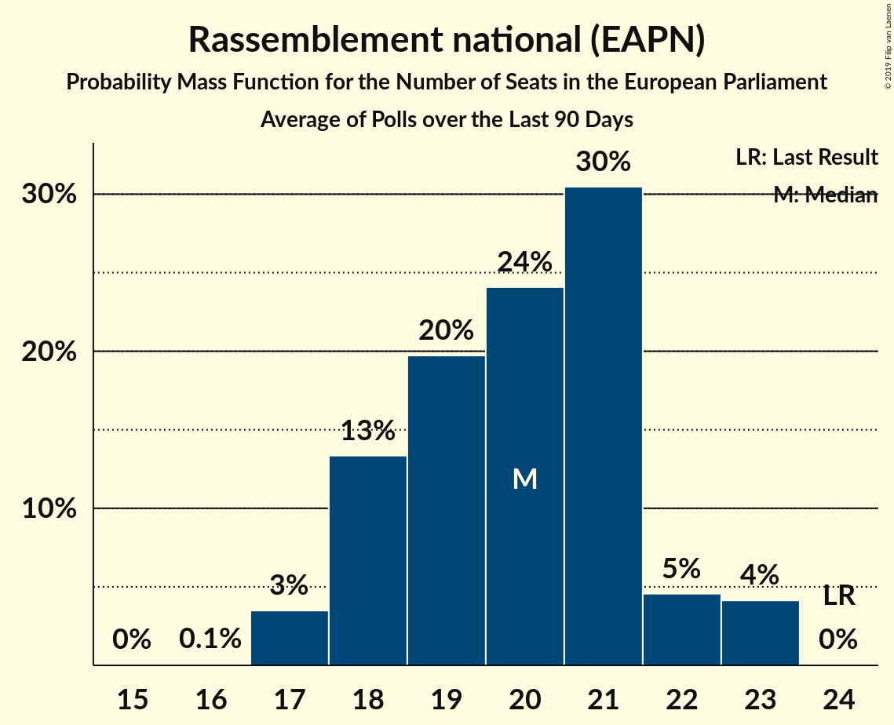
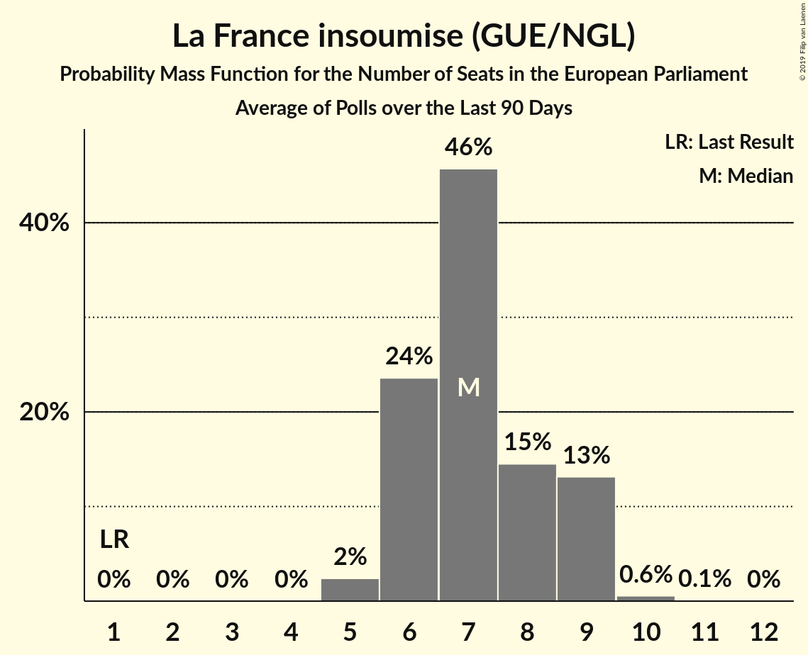
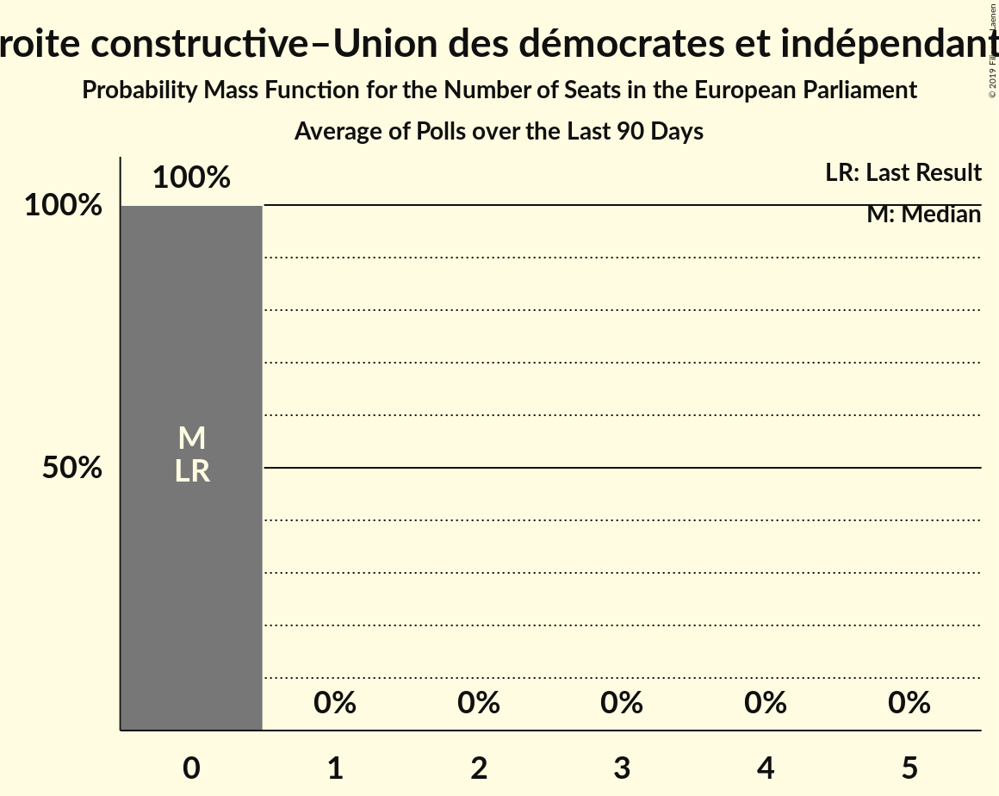
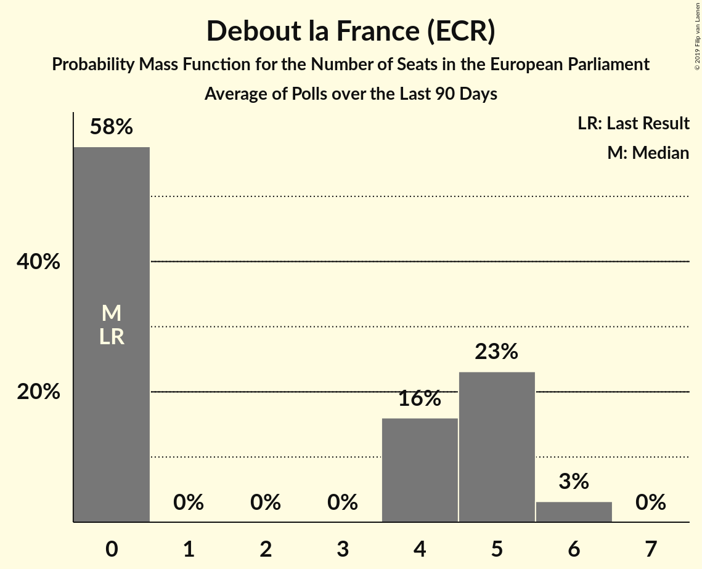
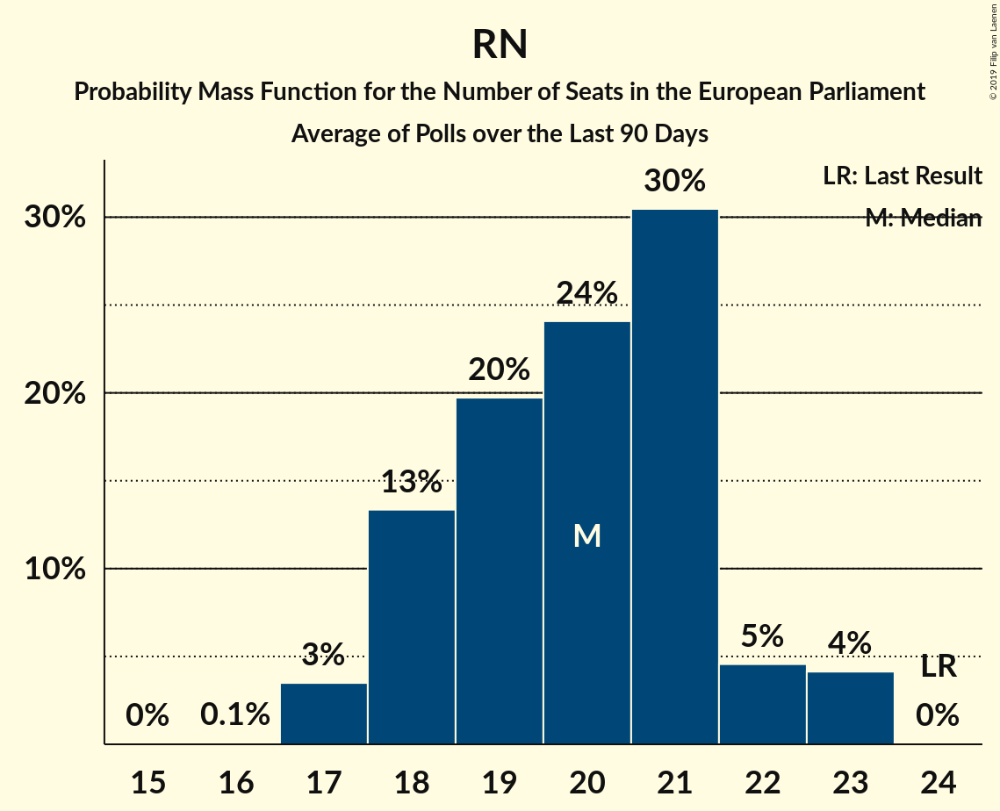
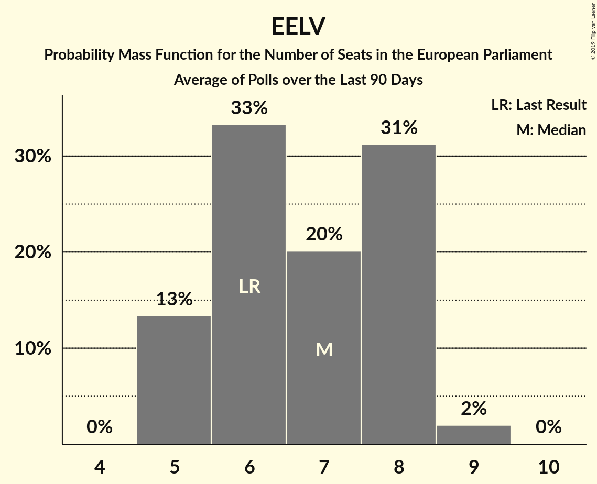
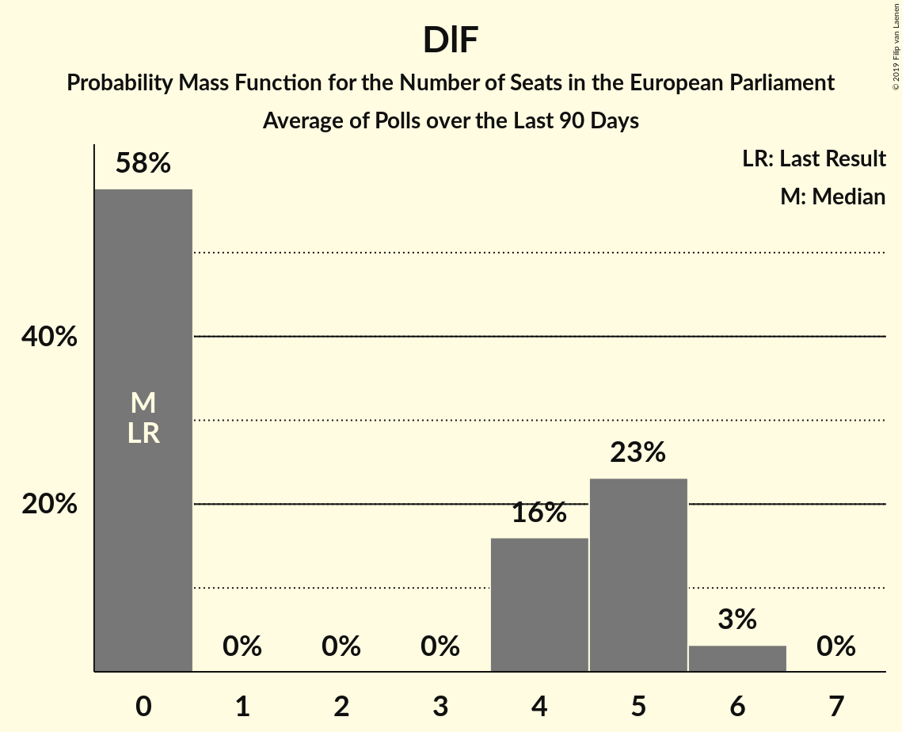

# Poll Average

<a href="#voting-intentions">Voting Intentions</a> | <a href="#seats">Seats</a> | <a href="#coalitions">Coalitions</a> | <a href="#technical-information">Technical Information</a>

## Summary

The table below lists the polls on which the average is based. They are the most recent polls (less than 90 days old) registered and analyzed so far.

| Period     | Polling firm/Commissioner(s) | RN | LR | PS | LREM–MoDem | EELV | PCF | FI | Agir–UDI | DlF | LP | UPR | NPA | G·s | R! | LO | GJ |
|:----------:|:----------------------------:|:--:|:--:|:--:|:--:|:--:|:--:|:--:|:--:|:--:|:--:|:--:|:--:|:--:|:--:|:--:|:--:|
| 25 May 2014 | General Election | 24.9%   24 | 20.8%   20 | 14.0%   13 | 9.9%   7 | 9.0%   6 | 6.6%   1 | 6.6%   1 | 2.0%   0 | 0.0%   0 | 0.0%   0 | 0.0%   0 | 0.0%   0 | 0.0%   0 | 0.0%   0 | 0.0%   0 | 0.0%   0 |
| N/A | Poll Average | 19–24%   17–23 | 11–16%   10–14 | 5–8%   0–6 | 20–26%   18–26 | 6–10%   5–9 | 2–4%   0 | 6–10%   5–9 | 2–4%   0 | 3–7%   0–6 | 0–2%   0 | 1–3%   0 | 0–1%   0 | 2–6%   0–4 | 0–2%   0 | 0–2%   0 | 2–4%   0 |
| [11–15 April 2019](2019-04-15-Ifop-Fiducial.html) | Ifop-Fiducial   CNews, Paris Match and Sud Radio | 19–24%   18–21 | 11–15%   10–14 | 5–7%   4–6 | 19–24%   18–21 | 7–10%   6–8 | 2–4%   0 | 7–10%   6–10 | 1–3%   0 | 4–6%   0–6 | 1–2%   0 | 1–2%   0 | N/A   N/A | 3–5%   0 | 0–1%   0 | 1–2%   0 | 2–4%   0 |
| [12–13 April 2019](2019-04-13-HarrisInteractive.html) | Harris Interactive   LCI, Le Figaro, RTL and TF1 | 19–24%   17–21 | 12–16%   11–14 | 5–8%   5–7 | 20–25%   18–22 | 6–10%   6–8 | 2–4%   0 | 8–11%   7–10 | 1–3%   0 | 3–5%   0–4 | 1–2%   0 | 1–3%   0 | N/A   N/A | 3–5%   0–4 | N/A   N/A | 1–2%   0 | N/A   N/A |
| [10–11 April 2019](2019-04-11-BVA.html) | BVA   Europe 1 and La Tribune | 18–22%   17–23 | 12–16%   12–14 | 4–7%   0–6 | 22–27%   22–26 | 6–9%   5–7 | 1–3%   0 | 7–10%   7–9 | 1–3%   0 | 3–5%   0–4 | 1–2%   0 | 1–2%   0 | N/A   N/A | 3–5%   0 | 1–2%   0 | 1–2%   0 | 2–4%   0 |
| [25–27 March 2019](2019-03-27-ELABE.html) | ELABE   BFMTV | 20–24%   17–23 | 12–16%   11–15 | 5–7%   0–6 | 20–25%   18–23 | 7–11%   7–10 | 1–3%   0 | 6–9%   5–8 | 3–5%   0 | 2–4%   0 | 1–2%   0 | 1–2%   0 | 0–1%   0 | 4–6%   0–5 | N/A   N/A | N/A   N/A | N/A   N/A |
| [20–26 March 2019](2019-03-26-OpinionWay–Tilder.html) | OpinionWay–Tilder   Les Echos and Radio Classique | 21–25%   18–23 | 12–15%   10–12 | 5–7%   0–6 | 21–25%   19–22 | 6–8%   5–7 | 2–4%   0 | 6–8%   5–7 | 2–4%   0 | 5–7%   4–6 | 1–2%   0 | 1–2%   0 | N/A   N/A | 1–3%   0 | N/A   N/A | 1–3%   0 | N/A   N/A |
| [15–21 March 2019](2019-03-21-Ipsos.html) | Ipsos   Le CEVIPOF, La Fondation Jean Jaurès and Le Monde | 21–23%   19–21 | 11–13%   10–11 | 6–7%   5–6 | 22–25%   21–23 | 7–9%   6–8 | 2%   0 | 7–9%   7–8 | 2%   0 | 4–6%   0–4 | 0–1%   0 | 1%   0 | 1%   0 | 4–5%   0 | 1–2%   0 | 0–1%   0 | N/A   N/A |
| 25 May 2014 | General Election | 24.9%   24 | 20.8%   20 | 14.0%   13 | 9.9%   7 | 9.0%   6 | 6.6%   1 | 6.6%   1 | 2.0%   0 | 0.0%   0 | 0.0%   0 | 0.0%   0 | 0.0%   0 | 0.0%   0 | 0.0%   0 | 0.0%   0 | 0.0%   0 |

Only polls for which at least the sample size has been published are included in the table above.

**Legend:**
+ **Top half of each row:** Voting intentions (95% confidence interval)
+ **Bottom half of each row:** Seat projections for the European Parliament (95% confidence interval)
+ **RN:** Rassemblement national (EAPN)
+ **LR:** Les Républicains (EPP)
+ **PS:** Parti socialiste (S&D)
+ **LREM–MoDem:** La République en marche–Mouvement démocrate (ALDE)
+ **EELV:** Europe Écologie Les Verts (Greens/EFA)
+ **PCF:** Parti communiste français (GUE/NGL)
+ **FI:** La France insoumise (GUE/NGL)
+ **Agir–UDI:** Agir, la droite constructive–Union des démocrates et indépendants (ALDE)
+ **DlF:** Debout la France (ECR)
+ **LP:** Les Patriotes (EFDD)
+ **UPR:** Union populaire républicaine (*)
+ **NPA:** Nouveau Parti anticapitaliste (GUE/NGL)
+ **G·s:** Génération·s, le mouvement (S&D)
+ **R!:** Résistons! (*)
+ **LO:** Lutte Ouvrière (*)
+ **GJ:** Mouvement des gilets jaunes (*)
+ **N/A (single party):** Party not included the published results
+ **N/A (entire row):** Calculation for this opinion poll not started yet

## Voting Intentions

### Confidence Intervals

| Party | Last Result | Median | 80% Confidence Interval | 90% Confidence Interval | 95% Confidence Interval | 99% Confidence Interval |
|:-----:|:-----------:|:------:|:-----------------------:|:-----------------------:|:-----------------------:|:-----------------------:|
| <a href="#rassemblement-national-(eapn)">Rassemblement national (EAPN)</a> | 24.9% | 21.7% | 19.8–23.3% |19.3–23.8% | 18.9–24.2% | 18.1–25.0% |
| <a href="#les-républicains-(epp)">Les Républicains (EPP)</a> | 20.8% | 13.3% | 11.9–14.8% |11.6–15.3% | 11.4–15.7% | 11.1–16.4% |
| <a href="#parti-socialiste-(s&d)">Parti socialiste (S&D)</a> | 14.0% | 6.1% | 5.3–7.0% |5.0–7.3% | 4.8–7.6% | 4.4–8.2% |
| <a href="#la-république-en-marche–mouvement-démocrate-(alde)">La République en marche–Mouvement démocrate (ALDE)</a> | 9.9% | 23.0% | 21.1–24.6% |20.6–25.1% | 20.1–25.6% | 19.3–26.5% |
| <a href="#europe-écologie-les-verts-(greens/efa)">Europe Écologie Les Verts (Greens/EFA)</a> | 9.0% | 7.9% | 6.7–9.3% |6.4–9.7% | 6.2–10.1% | 5.8–10.7% |
| <a href="#parti-communiste-français-(gue/ngl)">Parti communiste français (GUE/NGL)</a> | 6.6% | 2.4% | 1.8–3.3% |1.6–3.6% | 1.5–3.8% | 1.3–4.1% |
| <a href="#la-france-insoumise-(gue/ngl)">La France insoumise (GUE/NGL)</a> | 6.6% | 7.9% | 6.8–9.5% |6.5–10.1% | 6.3–10.5% | 5.9–11.4% |
| <a href="#agir,-la-droite-constructive–union-des-démocrates-et-indépendants-(alde)">Agir, la droite constructive–Union des démocrates et indépendants (ALDE)</a> | 2.0% | 2.3% | 1.7–3.6% |1.6–3.9% | 1.5–4.1% | 1.3–4.6% |
| <a href="#debout-la-france-(ecr)">Debout la France (ECR)</a> | 0.0% | 4.7% | 3.1–6.0% |2.8–6.3% | 2.6–6.6% | 2.2–7.1% |
| <a href="#les-patriotes-(efdd)">Les Patriotes (EFDD)</a> | 0.0% | 1.0% | 0.5–1.4% |0.4–1.5% | 0.4–1.7% | 0.4–1.9% |
| <a href="#union-populaire-républicaine-(*)">Union populaire républicaine (*)</a> | 0.0% | 1.2% | 0.8–2.1% |0.7–2.4% | 0.7–2.6% | 0.5–3.1% |
| <a href="#nouveau-parti-anticapitaliste-(gue/ngl)">Nouveau Parti anticapitaliste (GUE/NGL)</a> | 0.0% | 0.9% | 0.4–1.1% |0.3–1.2% | 0.3–1.2% | 0.2–1.4% |
| <a href="#génération·s,-le-mouvement-(s&d)">Génération·s, le mouvement (S&D)</a> | 0.0% | 3.8% | 2.1–5.0% |1.9–5.4% | 1.7–5.8% | 1.5–6.3% |
| <a href="#résistons!-(*)">Résistons! (*)</a> | 0.0% | 1.4% | 0.4–1.8% |0.4–1.9% | 0.3–2.1% | 0.2–2.4% |
| <a href="#lutte-ouvrière-(*)">Lutte Ouvrière (*)</a> | 0.0% | 1.2% | 0.5–2.1% |0.4–2.3% | 0.4–2.5% | 0.3–2.8% |
| <a href="#mouvement-des-gilets-jaunes-(*)">Mouvement des gilets jaunes (*)</a> | 0.0% | 3.1% | 2.5–3.7% |2.4–3.9% | 2.2–4.0% | 2.0–4.4% |

### Rassemblement national (EAPN)

*For a full overview of the results for this party, see the [Rassemblement national (EAPN)](party-rassemblementnationaleapn.html) page.*

| Voting Intentions | Probability | Accumulated | Special Marks |
|:-----------------:|:-----------:|:-----------:|:-------------:|
| 15.5–16.5% | 0% | 100% |  |
| 16.5–17.5% | 0.1% | 100% |  |
| 17.5–18.5% | 1.2% | 99.9% |  |
| 18.5–19.5% | 6% | 98.7% |  |
| 19.5–20.5% | 14% | 93% |  |
| 20.5–21.5% | 23% | 79% |  |
| 21.5–22.5% | 31% | 56% | Median |
| 22.5–23.5% | 17% | 25% |  |
| 23.5–24.5% | 6% | 8% |  |
| 24.5–25.5% | 1.3% | 1.4% | Last Result |
| 25.5–26.5% | 0.1% | 0.1% |  |
| 26.5–27.5% | 0% | 0% |  |

### Les Républicains (EPP)

*For a full overview of the results for this party, see the [Les Républicains (EPP)](party-lesrépublicainsepp.html) page.*

| Voting Intentions | Probability | Accumulated | Special Marks |
|:-----------------:|:-----------:|:-----------:|:-------------:|
| 9.5–10.5% | 0% | 100% |  |
| 10.5–11.5% | 4% | 100% |  |
| 11.5–12.5% | 24% | 96% |  |
| 12.5–13.5% | 31% | 72% | Median |
| 13.5–14.5% | 27% | 41% |  |
| 14.5–15.5% | 11% | 14% |  |
| 15.5–16.5% | 3% | 3% |  |
| 16.5–17.5% | 0.3% | 0.4% |  |
| 17.5–18.5% | 0% | 0% |  |
| 18.5–19.5% | 0% | 0% |  |
| 19.5–20.5% | 0% | 0% |  |
| 20.5–21.5% | 0% | 0% | Last Result |

### Parti socialiste (S&D)

*For a full overview of the results for this party, see the [Parti socialiste (S&D)](party-partisocialistesd.html) page.*

| Voting Intentions | Probability | Accumulated | Special Marks |
|:-----------------:|:-----------:|:-----------:|:-------------:|
| 2.5–3.5% | 0% | 100% |  |
| 3.5–4.5% | 0.9% | 100% |  |
| 4.5–5.5% | 19% | 99.1% |  |
| 5.5–6.5% | 53% | 80% | Median |
| 6.5–7.5% | 25% | 27% |  |
| 7.5–8.5% | 2% | 3% |  |
| 8.5–9.5% | 0.2% | 0.2% |  |
| 9.5–10.5% | 0% | 0% |  |
| 10.5–11.5% | 0% | 0% |  |
| 11.5–12.5% | 0% | 0% |  |
| 12.5–13.5% | 0% | 0% |  |
| 13.5–14.5% | 0% | 0% | Last Result |

### La République en marche–Mouvement démocrate (ALDE)

*For a full overview of the results for this party, see the [La République en marche–Mouvement démocrate (ALDE)](party-larépubliqueenmarche–mouvementdémocratealde.html) page.*

| Voting Intentions | Probability | Accumulated | Special Marks |
|:-----------------:|:-----------:|:-----------:|:-------------:|
| 9.5–10.5% | 0% | 100% | Last Result |
| 10.5–11.5% | 0% | 100% |  |
| 11.5–12.5% | 0% | 100% |  |
| 12.5–13.5% | 0% | 100% |  |
| 13.5–14.5% | 0% | 100% |  |
| 14.5–15.5% | 0% | 100% |  |
| 15.5–16.5% | 0% | 100% |  |
| 16.5–17.5% | 0% | 100% |  |
| 17.5–18.5% | 0.1% | 100% |  |
| 18.5–19.5% | 0.7% | 99.9% |  |
| 19.5–20.5% | 4% | 99.2% |  |
| 20.5–21.5% | 12% | 95% |  |
| 21.5–22.5% | 21% | 83% |  |
| 22.5–23.5% | 30% | 62% | Median |
| 23.5–24.5% | 22% | 33% |  |
| 24.5–25.5% | 7% | 10% |  |
| 25.5–26.5% | 2% | 3% |  |
| 26.5–27.5% | 0.4% | 0.5% |  |
| 27.5–28.5% | 0% | 0% |  |
| 28.5–29.5% | 0% | 0% |  |

### Europe Écologie Les Verts (Greens/EFA)

*For a full overview of the results for this party, see the [Europe Écologie Les Verts (Greens/EFA)](party-europeécologielesvertsgreensefa.html) page.*

| Voting Intentions | Probability | Accumulated | Special Marks |
|:-----------------:|:-----------:|:-----------:|:-------------:|
| 3.5–4.5% | 0% | 100% |  |
| 4.5–5.5% | 0.2% | 100% |  |
| 5.5–6.5% | 7% | 99.8% |  |
| 6.5–7.5% | 27% | 92% |  |
| 7.5–8.5% | 40% | 66% | Median |
| 8.5–9.5% | 20% | 26% | Last Result |
| 9.5–10.5% | 6% | 7% |  |
| 10.5–11.5% | 0.8% | 0.8% |  |
| 11.5–12.5% | 0% | 0% |  |

### Parti communiste français (GUE/NGL)

*For a full overview of the results for this party, see the [Parti communiste français (GUE/NGL)](party-particommunistefrançaisguengl.html) page.*

| Voting Intentions | Probability | Accumulated | Special Marks |
|:-----------------:|:-----------:|:-----------:|:-------------:|
| 0.0–0.5% | 0% | 100% |  |
| 0.5–1.5% | 3% | 100% |  |
| 1.5–2.5% | 54% | 97% | Median |
| 2.5–3.5% | 38% | 43% |  |
| 3.5–4.5% | 5% | 5% |  |
| 4.5–5.5% | 0.1% | 0.1% |  |
| 5.5–6.5% | 0% | 0% |  |
| 6.5–7.5% | 0% | 0% | Last Result |

### La France insoumise (GUE/NGL)

*For a full overview of the results for this party, see the [La France insoumise (GUE/NGL)](party-lafranceinsoumiseguengl.html) page.*

| Voting Intentions | Probability | Accumulated | Special Marks |
|:-----------------:|:-----------:|:-----------:|:-------------:|
| 3.5–4.5% | 0% | 100% |  |
| 4.5–5.5% | 0.1% | 100% |  |
| 5.5–6.5% | 5% | 99.9% |  |
| 6.5–7.5% | 26% | 95% | Last Result |
| 7.5–8.5% | 43% | 69% | Median |
| 8.5–9.5% | 17% | 26% |  |
| 9.5–10.5% | 7% | 9% |  |
| 10.5–11.5% | 2% | 2% |  |
| 11.5–12.5% | 0.3% | 0.3% |  |
| 12.5–13.5% | 0% | 0% |  |

### Agir, la droite constructive–Union des démocrates et indépendants (ALDE)

*For a full overview of the results for this party, see the [Agir, la droite constructive–Union des démocrates et indépendants (ALDE)](party-agirladroiteconstructive–uniondesdémocratesetindépendantsalde.html) page.*

| Voting Intentions | Probability | Accumulated | Special Marks |
|:-----------------:|:-----------:|:-----------:|:-------------:|
| 0.0–0.5% | 0% | 100% |  |
| 0.5–1.5% | 4% | 100% |  |
| 1.5–2.5% | 58% | 96% | Last Result, Median |
| 2.5–3.5% | 28% | 38% |  |
| 3.5–4.5% | 10% | 10% |  |
| 4.5–5.5% | 0.7% | 0.7% |  |
| 5.5–6.5% | 0% | 0% |  |

### Lutte Ouvrière (*)

*For a full overview of the results for this party, see the [Lutte Ouvrière (*)](party-lutteouvrière.html) page.*

| Voting Intentions | Probability | Accumulated | Special Marks |
|:-----------------:|:-----------:|:-----------:|:-------------:|
| 0.0–0.5% | 14% | 100% | Last Result |
| 0.5–1.5% | 55% | 86% | Median |
| 1.5–2.5% | 30% | 31% |  |
| 2.5–3.5% | 2% | 2% |  |
| 3.5–4.5% | 0% | 0% |  |

### Génération·s, le mouvement (S&D)

*For a full overview of the results for this party, see the [Génération·s, le mouvement (S&D)](party-génération·slemouvementsd.html) page.*

| Voting Intentions | Probability | Accumulated | Special Marks |
|:-----------------:|:-----------:|:-----------:|:-------------:|
| 0.0–0.5% | 0% | 100% | Last Result |
| 0.5–1.5% | 0.8% | 100% |  |
| 1.5–2.5% | 15% | 99.2% |  |
| 2.5–3.5% | 21% | 84% |  |
| 3.5–4.5% | 46% | 64% | Median |
| 4.5–5.5% | 14% | 18% |  |
| 5.5–6.5% | 4% | 4% |  |
| 6.5–7.5% | 0.2% | 0.2% |  |
| 7.5–8.5% | 0% | 0% |  |

### Résistons! (*)

*For a full overview of the results for this party, see the [Résistons! (*)](party-résistons.html) page.*

| Voting Intentions | Probability | Accumulated | Special Marks |
|:-----------------:|:-----------:|:-----------:|:-------------:|
| 0.0–0.5% | 17% | 100% | Last Result |
| 0.5–1.5% | 55% | 83% | Median |
| 1.5–2.5% | 29% | 29% |  |
| 2.5–3.5% | 0.2% | 0.2% |  |
| 3.5–4.5% | 0% | 0% |  |

### Debout la France (ECR)

*For a full overview of the results for this party, see the [Debout la France (ECR)](party-deboutlafranceecr.html) page.*

| Voting Intentions | Probability | Accumulated | Special Marks |
|:-----------------:|:-----------:|:-----------:|:-------------:|
| 0.0–0.5% | 0% | 100% | Last Result |
| 0.5–1.5% | 0% | 100% |  |
| 1.5–2.5% | 2% | 100% |  |
| 2.5–3.5% | 17% | 98% |  |
| 3.5–4.5% | 27% | 80% |  |
| 4.5–5.5% | 35% | 53% | Median |
| 5.5–6.5% | 15% | 18% |  |
| 6.5–7.5% | 3% | 3% |  |
| 7.5–8.5% | 0.1% | 0.1% |  |
| 8.5–9.5% | 0% | 0% |  |

### Les Patriotes (EFDD)

*For a full overview of the results for this party, see the [Les Patriotes (EFDD)](party-lespatriotesefdd.html) page.*

| Voting Intentions | Probability | Accumulated | Special Marks |
|:-----------------:|:-----------:|:-----------:|:-------------:|
| 0.0–0.5% | 12% | 100% | Last Result |
| 0.5–1.5% | 83% | 88% | Median |
| 1.5–2.5% | 5% | 5% |  |
| 2.5–3.5% | 0% | 0% |  |

### Union populaire républicaine (*)

*For a full overview of the results for this party, see the [Union populaire républicaine (*)](party-unionpopulairerépublicaine.html) page.*

| Voting Intentions | Probability | Accumulated | Special Marks |
|:-----------------:|:-----------:|:-----------:|:-------------:|
| 0.0–0.5% | 0.6% | 100% | Last Result |
| 0.5–1.5% | 73% | 99.4% | Median |
| 1.5–2.5% | 23% | 26% |  |
| 2.5–3.5% | 3% | 3% |  |
| 3.5–4.5% | 0.1% | 0.1% |  |
| 4.5–5.5% | 0% | 0% |  |

### Mouvement des gilets jaunes (*)

*For a full overview of the results for this party, see the [Mouvement des gilets jaunes (*)](party-mouvementdesgiletsjaunes.html) page.*

| Voting Intentions | Probability | Accumulated | Special Marks |
|:-----------------:|:-----------:|:-----------:|:-------------:|
| 0.0–0.5% | 0% | 100% | Last Result |
| 0.5–1.5% | 0% | 100% |  |
| 1.5–2.5% | 12% | 100% |  |
| 2.5–3.5% | 73% | 88% | Median |
| 3.5–4.5% | 15% | 15% |  |
| 4.5–5.5% | 0.2% | 0.2% |  |
| 5.5–6.5% | 0% | 0% |  |

### Nouveau Parti anticapitaliste (GUE/NGL)

*For a full overview of the results for this party, see the [Nouveau Parti anticapitaliste (GUE/NGL)](party-nouveaupartianticapitalisteguengl.html) page.*

| Voting Intentions | Probability | Accumulated | Special Marks |
|:-----------------:|:-----------:|:-----------:|:-------------:|
| 0.0–0.5% | 24% | 100% | Last Result |
| 0.5–1.5% | 76% | 76% | Median |
| 1.5–2.5% | 0% | 0% |  |
| 2.5–3.5% | 0% | 0% |  |

## Seats

### Confidence Intervals

| Party | Last Result | Median | 80% Confidence Interval | 90% Confidence Interval | 95% Confidence Interval | 99% Confidence Interval |
|:-----:|:-----------:|:------:|:-----------------------:|:-----------------------:|:-----------------------:|:-----------------------:|
| <a href="#rassemblement-national-(eapn)">Rassemblement national (EAPN)</a> | 24 | 20 | 18–21 |18–22 | 17–23 | 17–23 |
| <a href="#les-républicains-(epp)">Les Républicains (EPP)</a> | 20 | 12 | 11–14 |10–14 | 10–14 | 10–15 |
| <a href="#parti-socialiste-(s&d)">Parti socialiste (S&D)</a> | 13 | 5 | 4–6 |0–6 | 0–6 | 0–7 |
| <a href="#la-république-en-marche–mouvement-démocrate-(alde)">La République en marche–Mouvement démocrate (ALDE)</a> | 7 | 22 | 19–23 |18–23 | 18–26 | 17–26 |
| <a href="#europe-écologie-les-verts-(greens/efa)">Europe Écologie Les Verts (Greens/EFA)</a> | 6 | 7 | 5–8 |5–8 | 5–9 | 5–10 |
| <a href="#parti-communiste-français-(gue/ngl)">Parti communiste français (GUE/NGL)</a> | 1 | 0 | 0 |0 | 0 | 0 |
| <a href="#la-france-insoumise-(gue/ngl)">La France insoumise (GUE/NGL)</a> | 1 | 7 | 6–9 |6–9 | 5–9 | 5–10 |
| <a href="#agir,-la-droite-constructive–union-des-démocrates-et-indépendants-(alde)">Agir, la droite constructive–Union des démocrates et indépendants (ALDE)</a> | 0 | 0 | 0 |0 | 0 | 0 |
| <a href="#debout-la-france-(ecr)">Debout la France (ECR)</a> | 0 | 0 | 0–5 |0–5 | 0–6 | 0–6 |
| <a href="#les-patriotes-(efdd)">Les Patriotes (EFDD)</a> | 0 | 0 | 0 |0 | 0 | 0 |
| <a href="#union-populaire-républicaine-(*)">Union populaire républicaine (*)</a> | 0 | 0 | 0 |0 | 0 | 0 |
| <a href="#nouveau-parti-anticapitaliste-(gue/ngl)">Nouveau Parti anticapitaliste (GUE/NGL)</a> | 0 | 0 | 0 |0 | 0 | 0 |
| <a href="#génération·s,-le-mouvement-(s&d)">Génération·s, le mouvement (S&D)</a> | 0 | 0 | 0–4 |0–4 | 0–4 | 0–5 |
| <a href="#résistons!-(*)">Résistons! (*)</a> | 0 | 0 | 0 |0 | 0 | 0 |
| <a href="#lutte-ouvrière-(*)">Lutte Ouvrière (*)</a> | 0 | 0 | 0 |0 | 0 | 0 |
| <a href="#mouvement-des-gilets-jaunes-(*)">Mouvement des gilets jaunes (*)</a> | 0 | 0 | 0 |0 | 0 | 0 |

### Rassemblement national (EAPN)

*For a full overview of the results for this party, see the [Rassemblement national (EAPN)](party-rassemblementnationaleapn.html) page.*

| Number of Seats | Probability | Accumulated | Special Marks |
|:---------------:|:-----------:|:-----------:|:-------------:|
| 16 | 0.4% | 100% |  |
| 17 | 3% | 99.6% |  |
| 18 | 14% | 97% |  |
| 19 | 25% | 83% |  |
| 20 | 22% | 58% | Median |
| 21 | 30% | 36% |  |
| 22 | 2% | 6% |  |
| 23 | 4% | 4% |  |
| 24 | 0% | 0.1% | Last Result |
| 25 | 0% | 0% |  |

### Les Républicains (EPP)

*For a full overview of the results for this party, see the [Les Républicains (EPP)](party-lesrépublicainsepp.html) page.*

| Number of Seats | Probability | Accumulated | Special Marks |
|:---------------:|:-----------:|:-----------:|:-------------:|
| 9 | 0.2% | 100% |  |
| 10 | 7% | 99.8% |  |
| 11 | 35% | 93% |  |
| 12 | 18% | 58% | Median |
| 13 | 14% | 39% |  |
| 14 | 24% | 25% |  |
| 15 | 0.4% | 0.8% |  |
| 16 | 0.3% | 0.3% |  |
| 17 | 0% | 0% |  |
| 18 | 0% | 0% |  |
| 19 | 0% | 0% |  |
| 20 | 0% | 0% | Last Result |

### Parti socialiste (S&D)

*For a full overview of the results for this party, see the [Parti socialiste (S&D)](party-partisocialistesd.html) page.*

| Number of Seats | Probability | Accumulated | Special Marks |
|:---------------:|:-----------:|:-----------:|:-------------:|
| 0 | 8% | 100% |  |
| 1 | 0% | 92% |  |
| 2 | 0% | 92% |  |
| 3 | 0% | 92% |  |
| 4 | 16% | 92% |  |
| 5 | 56% | 76% | Median |
| 6 | 18% | 20% |  |
| 7 | 1.2% | 1.3% |  |
| 8 | 0.1% | 0.1% |  |
| 9 | 0% | 0% |  |
| 10 | 0% | 0% |  |
| 11 | 0% | 0% |  |
| 12 | 0% | 0% |  |
| 13 | 0% | 0% | Last Result |

### La République en marche–Mouvement démocrate (ALDE)

*For a full overview of the results for this party, see the [La République en marche–Mouvement démocrate (ALDE)](party-larépubliqueenmarche–mouvementdémocratealde.html) page.*

| Number of Seats | Probability | Accumulated | Special Marks |
|:---------------:|:-----------:|:-----------:|:-------------:|
| 7 | 0% | 100% | Last Result |
| 8 | 0% | 100% |  |
| 9 | 0% | 100% |  |
| 10 | 0% | 100% |  |
| 11 | 0% | 100% |  |
| 12 | 0% | 100% |  |
| 13 | 0% | 100% |  |
| 14 | 0% | 100% |  |
| 15 | 0% | 100% |  |
| 16 | 0% | 100% |  |
| 17 | 0.5% | 100% |  |
| 18 | 5% | 99.4% |  |
| 19 | 8% | 94% |  |
| 20 | 25% | 86% |  |
| 21 | 10% | 61% |  |
| 22 | 33% | 51% | Median |
| 23 | 13% | 18% |  |
| 24 | 1.4% | 5% |  |
| 25 | 0.5% | 3% |  |
| 26 | 3% | 3% |  |
| 27 | 0% | 0% |  |

### Europe Écologie Les Verts (Greens/EFA)

*For a full overview of the results for this party, see the [Europe Écologie Les Verts (Greens/EFA)](party-europeécologielesvertsgreensefa.html) page.*

| Number of Seats | Probability | Accumulated | Special Marks |
|:---------------:|:-----------:|:-----------:|:-------------:|
| 5 | 11% | 100% |  |
| 6 | 33% | 89% | Last Result |
| 7 | 27% | 55% | Median |
| 8 | 24% | 28% |  |
| 9 | 4% | 5% |  |
| 10 | 1.2% | 1.2% |  |
| 11 | 0% | 0% |  |

### Parti communiste français (GUE/NGL)

*For a full overview of the results for this party, see the [Parti communiste français (GUE/NGL)](party-particommunistefrançaisguengl.html) page.*

| Number of Seats | Probability | Accumulated | Special Marks |
|:---------------:|:-----------:|:-----------:|:-------------:|
| 0 | 100% | 100% | Median |
| 1 | 0% | 0% | Last Result |

### La France insoumise (GUE/NGL)

*For a full overview of the results for this party, see the [La France insoumise (GUE/NGL)](party-lafranceinsoumiseguengl.html) page.*

| Number of Seats | Probability | Accumulated | Special Marks |
|:---------------:|:-----------:|:-----------:|:-------------:|
| 1 | 0% | 100% | Last Result |
| 2 | 0% | 100% |  |
| 3 | 0% | 100% |  |
| 4 | 0% | 100% |  |
| 5 | 4% | 100% |  |
| 6 | 28% | 96% |  |
| 7 | 45% | 67% | Median |
| 8 | 12% | 23% |  |
| 9 | 10% | 11% |  |
| 10 | 1.1% | 1.2% |  |
| 11 | 0.1% | 0.1% |  |
| 12 | 0% | 0% |  |

### Agir, la droite constructive–Union des démocrates et indépendants (ALDE)

*For a full overview of the results for this party, see the [Agir, la droite constructive–Union des démocrates et indépendants (ALDE)](party-agirladroiteconstructive–uniondesdémocratesetindépendantsalde.html) page.*

| Number of Seats | Probability | Accumulated | Special Marks |
|:---------------:|:-----------:|:-----------:|:-------------:|
| 0 | 99.9% | 100% | Last Result, Median |
| 1 | 0% | 0.1% |  |
| 2 | 0% | 0.1% |  |
| 3 | 0% | 0.1% |  |
| 4 | 0.1% | 0.1% |  |
| 5 | 0% | 0% |  |

### Lutte Ouvrière (*)

*For a full overview of the results for this party, see the [Lutte Ouvrière (*)](party-lutteouvrière.html) page.*

| Number of Seats | Probability | Accumulated | Special Marks |
|:---------------:|:-----------:|:-----------:|:-------------:|
| 0 | 100% | 100% | Last Result, Median |

### Génération·s, le mouvement (S&D)

*For a full overview of the results for this party, see the [Génération·s, le mouvement (S&D)](party-génération·slemouvementsd.html) page.*

| Number of Seats | Probability | Accumulated | Special Marks |
|:---------------:|:-----------:|:-----------:|:-------------:|
| 0 | 88% | 100% | Last Result, Median |
| 1 | 0% | 12% |  |
| 2 | 0% | 12% |  |
| 3 | 0% | 12% |  |
| 4 | 10% | 12% |  |
| 5 | 2% | 2% |  |
| 6 | 0.2% | 0.2% |  |
| 7 | 0% | 0% |  |

### Résistons! (*)

*For a full overview of the results for this party, see the [Résistons! (*)](party-résistons.html) page.*

| Number of Seats | Probability | Accumulated | Special Marks |
|:---------------:|:-----------:|:-----------:|:-------------:|
| 0 | 100% | 100% | Last Result, Median |

### Debout la France (ECR)

*For a full overview of the results for this party, see the [Debout la France (ECR)](party-deboutlafranceecr.html) page.*

| Number of Seats | Probability | Accumulated | Special Marks |
|:---------------:|:-----------:|:-----------:|:-------------:|
| 0 | 61% | 100% | Last Result, Median |
| 1 | 0% | 39% |  |
| 2 | 0% | 39% |  |
| 3 | 0% | 39% |  |
| 4 | 10% | 39% |  |
| 5 | 25% | 28% |  |
| 6 | 3% | 3% |  |
| 7 | 0.1% | 0.1% |  |
| 8 | 0% | 0% |  |

### Les Patriotes (EFDD)

*For a full overview of the results for this party, see the [Les Patriotes (EFDD)](party-lespatriotesefdd.html) page.*

| Number of Seats | Probability | Accumulated | Special Marks |
|:---------------:|:-----------:|:-----------:|:-------------:|
| 0 | 100% | 100% | Last Result, Median |

### Union populaire républicaine (*)

*For a full overview of the results for this party, see the [Union populaire républicaine (*)](party-unionpopulairerépublicaine.html) page.*

| Number of Seats | Probability | Accumulated | Special Marks |
|:---------------:|:-----------:|:-----------:|:-------------:|
| 0 | 100% | 100% | Last Result, Median |

### Mouvement des gilets jaunes (*)

*For a full overview of the results for this party, see the [Mouvement des gilets jaunes (*)](party-mouvementdesgiletsjaunes.html) page.*

| Number of Seats | Probability | Accumulated | Special Marks |
|:---------------:|:-----------:|:-----------:|:-------------:|
| 0 | 100% | 100% | Last Result, Median |

### Nouveau Parti anticapitaliste (GUE/NGL)

*For a full overview of the results for this party, see the [Nouveau Parti anticapitaliste (GUE/NGL)](party-nouveaupartianticapitalisteguengl.html) page.*

| Number of Seats | Probability | Accumulated | Special Marks |
|:---------------:|:-----------:|:-----------:|:-------------:|
| 0 | 100% | 100% | Last Result, Median |

## Coalitions

### Confidence Intervals

| Coalition | Last Result | Median | Majority? | 80% Confidence Interval | 90% Confidence Interval | 95% Confidence Interval | 99% Confidence Interval |
|:---------:|:-----------:|:------:|:---------:|:-----------------------:|:-----------------------:|:-----------------------:|:-----------------------:|
| La République en marche–Mouvement démocrate (ALDE) – Agir, la droite constructive–Union des démocrates et indépendants (ALDE) | 7 | 22 | 0% | 19–23 | 18–23 | 18–26 | 17–26 |
| Rassemblement national (EAPN) | 24 | 20 | 0% | 18–21 | 18–22 | 17–23 | 17–23 |
| Les Républicains (EPP) | 20 | 12 | 0% | 11–14 | 10–14 | 10–14 | 10–15 |
| Parti socialiste (S&D) – Génération·s, le mouvement (S&D) | 13 | 5 | 0% | 4–9 | 0–9 | 0–10 | 0–10 |
| Europe Écologie Les Verts (Greens/EFA) | 6 | 7 | 0% | 5–8 | 5–8 | 5–9 | 5–10 |
| La France insoumise (GUE/NGL) – Parti communiste français (GUE/NGL) – Nouveau Parti anticapitaliste (GUE/NGL) | 2 | 7 | 0% | 6–9 | 6–9 | 5–9 | 5–10 |
| Debout la France (ECR) | 0 | 0 | 0% | 0–5 | 0–5 | 0–6 | 0–6 |
| Les Patriotes (EFDD) | 0 | 0 | 0% | 0 | 0 | 0 | 0 |
| Lutte Ouvrière (*) – Mouvement des gilets jaunes (*) – Résistons! (*) – Union populaire républicaine (*) | 0 | 0 | 0% | 0 | 0 | 0 | 0 |

### La République en marche–Mouvement démocrate (ALDE) – Agir, la droite constructive–Union des démocrates et indépendants (ALDE)

| Number of Seats | Probability | Accumulated | Special Marks |
|:---------------:|:-----------:|:-----------:|:-------------:|
| 7 | 0% | 100% | Last Result |
| 8 | 0% | 100% |  |
| 9 | 0% | 100% |  |
| 10 | 0% | 100% |  |
| 11 | 0% | 100% |  |
| 12 | 0% | 100% |  |
| 13 | 0% | 100% |  |
| 14 | 0% | 100% |  |
| 15 | 0% | 100% |  |
| 16 | 0% | 100% |  |
| 17 | 0.5% | 100% |  |
| 18 | 5% | 99.4% |  |
| 19 | 8% | 94% |  |
| 20 | 25% | 86% |  |
| 21 | 10% | 61% |  |
| 22 | 33% | 51% | Median |
| 23 | 13% | 18% |  |
| 24 | 1.5% | 5% |  |
| 25 | 0.5% | 3% |  |
| 26 | 3% | 3% |  |
| 27 | 0% | 0% |  |

### Rassemblement national (EAPN)

| Number of Seats | Probability | Accumulated | Special Marks |
|:---------------:|:-----------:|:-----------:|:-------------:|
| 16 | 0.4% | 100% |  |
| 17 | 3% | 99.6% |  |
| 18 | 14% | 97% |  |
| 19 | 25% | 83% |  |
| 20 | 22% | 58% | Median |
| 21 | 30% | 36% |  |
| 22 | 2% | 6% |  |
| 23 | 4% | 4% |  |
| 24 | 0% | 0.1% | Last Result |
| 25 | 0% | 0% |  |

### Les Républicains (EPP)

| Number of Seats | Probability | Accumulated | Special Marks |
|:---------------:|:-----------:|:-----------:|:-------------:|
| 9 | 0.2% | 100% |  |
| 10 | 7% | 99.8% |  |
| 11 | 35% | 93% |  |
| 12 | 18% | 58% | Median |
| 13 | 14% | 39% |  |
| 14 | 24% | 25% |  |
| 15 | 0.4% | 0.8% |  |
| 16 | 0.3% | 0.3% |  |
| 17 | 0% | 0% |  |
| 18 | 0% | 0% |  |
| 19 | 0% | 0% |  |
| 20 | 0% | 0% | Last Result |

### Parti socialiste (S&D) – Génération·s, le mouvement (S&D)

| Number of Seats | Probability | Accumulated | Special Marks |
|:---------------:|:-----------:|:-----------:|:-------------:|
| 0 | 8% | 100% |  |
| 1 | 0% | 92% |  |
| 2 | 0% | 92% |  |
| 3 | 0% | 92% |  |
| 4 | 15% | 92% |  |
| 5 | 49% | 77% | Median |
| 6 | 16% | 29% |  |
| 7 | 1.1% | 13% |  |
| 8 | 0.5% | 12% |  |
| 9 | 7% | 11% |  |
| 10 | 4% | 4% |  |
| 11 | 0.4% | 0.4% |  |
| 12 | 0% | 0% |  |
| 13 | 0% | 0% | Last Result |

### Europe Écologie Les Verts (Greens/EFA)

| Number of Seats | Probability | Accumulated | Special Marks |
|:---------------:|:-----------:|:-----------:|:-------------:|
| 5 | 11% | 100% |  |
| 6 | 33% | 89% | Last Result |
| 7 | 27% | 55% | Median |
| 8 | 24% | 28% |  |
| 9 | 4% | 5% |  |
| 10 | 1.2% | 1.2% |  |
| 11 | 0% | 0% |  |

### La France insoumise (GUE/NGL) – Parti communiste français (GUE/NGL) – Nouveau Parti anticapitaliste (GUE/NGL)

| Number of Seats | Probability | Accumulated | Special Marks |
|:---------------:|:-----------:|:-----------:|:-------------:|
| 2 | 0% | 100% | Last Result |
| 3 | 0% | 100% |  |
| 4 | 0% | 100% |  |
| 5 | 4% | 100% |  |
| 6 | 28% | 96% |  |
| 7 | 45% | 67% | Median |
| 8 | 12% | 23% |  |
| 9 | 10% | 11% |  |
| 10 | 1.1% | 1.2% |  |
| 11 | 0.1% | 0.1% |  |
| 12 | 0% | 0% |  |

### Debout la France (ECR)

| Number of Seats | Probability | Accumulated | Special Marks |
|:---------------:|:-----------:|:-----------:|:-------------:|
| 0 | 61% | 100% | Last Result, Median |
| 1 | 0% | 39% |  |
| 2 | 0% | 39% |  |
| 3 | 0% | 39% |  |
| 4 | 10% | 39% |  |
| 5 | 25% | 28% |  |
| 6 | 3% | 3% |  |
| 7 | 0.1% | 0.1% |  |
| 8 | 0% | 0% |  |

### Les Patriotes (EFDD)

| Number of Seats | Probability | Accumulated | Special Marks |
|:---------------:|:-----------:|:-----------:|:-------------:|
| 0 | 100% | 100% | Last Result, Median |

### Lutte Ouvrière (*) – Mouvement des gilets jaunes (*) – Résistons! (*) – Union populaire républicaine (*)

| Number of Seats | Probability | Accumulated | Special Marks |
|:---------------:|:-----------:|:-----------:|:-------------:|
| 0 | 100% | 100% | Last Result, Median |

## Technical Information

+ **Number of polls included in this average:** 6
+ **Lowest number of simulations done in a poll included in this average:** 131,072
+ **Total number of simulations done in the polls included in this average:** 5,373,952
+ **Error estimate:** 3.48%
