# Poll Average

<a href="#voting-intentions">Voting Intentions</a> | <a href="#seats">Seats</a> | <a href="#coalitions">Coalitions</a> | <a href="#technical-information">Technical Information</a>

## Summary

The table below lists the polls on which the average is based. They are the most recent polls (less than 90 days old) registered and analyzed so far.

| Period     | Polling firm/Commissioner(s) | RN | LR | PS | LREM–MoDem | EELV | PCF | FI | Agir–UDI | DlF | LP | UPR | NPA | G·s | R! | LO | GJ | REC | LE | W |
|:----------:|:----------------------------:|:--:|:--:|:--:|:--:|:--:|:--:|:--:|:--:|:--:|:--:|:--:|:--:|:--:|:--:|:--:|:--:|:--:|:--:|:--:|
| 26 May 2019 | General Election | 24.9%   24 | 20.8%   20 | 14.0%   13 | 9.9%   7 | 9.0%   6 | 6.6%   1 | 6.6%   1 | 2.0%   0 | 0.0%   0 | 0.0%   0 | 0.0%   0 | 0.0%   0 | 0.0%   0 | 0.0%   0 | 0.0%   0 | 0.0%   0 | 0.0%   0 | 0.0%   0 | 0.0%   0 |
| N/A | Poll Average | 14–19%   12–17 | 13–20%   11–18 | 2–6%   0–5 | 22–29%   20–27 | 4–9%   0–8 | 1–4%   0 | 8–14%   7–14 | N/A   N/A | 1–3%   0 | 0–2%   0 | 0–1%   0 | 0–2%   0 | N/A   N/A | 0–2%   0 | 0–2%   0 | N/A   N/A | 11–17%   9–15 | 1–3%   0 | 4–7%   0–5 |
| [28–31 December 2021](2021-12-31-HarrisInteractive.html) | Harris Interactive   Challenges | 14–17%   15–16 | 14–17%   14–15 | 3–5%   0 | 22–26%   20–22 | 6–8%   5–6 | 2–4%   0 | 9–11%   9 | N/A   N/A | 1–3%   0 | 0%   0 | 0%   0 | 1–2%   0 | N/A   N/A | 0%   0 | 0%   0 | N/A   N/A | 14–17%   13–14 | 1–2%   0 | N/A   N/A |
| [27–31 December 2021](2021-12-31-Cluster17.html) | Cluster17   Marianne | 13–16%   13–15 | 13–17%   14–16 | 1–3%   0 | 21–25%   20–24 | 3–5%   0 | 1–2%   0 | 11–15%   10–14 | N/A   N/A | 1–2%   0 | 1–2%   0 | 1–2%   0 | 1–2%   0 | N/A   N/A | 1–2%   0 | 0–1%   0 | N/A   N/A | 13–17%   13–16 | 1–2%   0 | 4–6%   0–5 |
| [17–20 December 2021](2021-12-20-Elabe.html) | Elabe   BFMTV, L’Express and SFR | 14–18%   13–16 | 15–19%   15–16 | 2–4%   0 | 24–28%   25–27 | 4–6%   0–4 | 1–2%   0 | 9–13%   9–10 | N/A   N/A | 1–3%   0 | 1–2%   0 | 0–1%   0 | 1–2%   0 | N/A   N/A | 1–2%   0 | 1–2%   0 | N/A   N/A | 11–15%   11 | 1–3%   0 | N/A   N/A |
| [13–15 December 2021](2021-12-15-OpinionWay.html) | OpinionWay   Les Echos, CNews and Radio Classique | N/A   N/A | N/A   N/A | N/A   N/A | N/A   N/A | N/A   N/A | N/A   N/A | N/A   N/A | N/A   N/A | N/A   N/A | N/A   N/A | N/A   N/A | N/A   N/A | N/A   N/A | N/A   N/A | N/A   N/A | N/A   N/A | N/A   N/A | N/A   N/A | N/A   N/A |
| [14–15 December 2021](2021-12-15-Ifop–Fiducial.html) | Ifop–Fiducial   Sud Radio | 14–18%   12–16 | 16–20%   13–18 | 3–6%   0–4 | 23–28%   21–25 | 6–9%   5–8 | 2–4%   0 | 8–11%   6–11 | N/A   N/A | 1–3%   0 | N/A   N/A | N/A   N/A | 1–2%   0 | N/A   N/A | 0–1%   0 | 0–1%   0 | N/A   N/A | 10–14%   9–12 | 1–2%   0 | N/A   N/A |
| [7–13 December 2021](2021-12-13-IpsosandSopraSteria.html) | Ipsos and Sopra Steria   CEVIPOF, FJJ and Le Monde | 13–15%   12–14 | 16–18%   15–16 | 4–5%   0–4 | 23–25%   21–23 | 8–9%   7–8 | 2%   0 | 8–9%   7–8 | N/A   N/A | 3%   0 | N/A   N/A | N/A   N/A | 1–2%   0 | N/A   N/A | 1%   0 | 0–1%   0 | N/A   N/A | 13–15%   12–14 | 1–2%   0 | N/A   N/A |
| [7–9 December 2021](2021-12-09-Odoxa.html) | Odoxa   L’Obs and Mascaret | 15–19%   13–18 | 17–21%   16–19 | 2–4%   0 | 22–26%   20–23 | 5–7%   4–7 | 1–3%   0 | 9–12%   7–10 | N/A   N/A | 2–3%   0 | N/A   N/A | N/A   N/A | 1–2%   0 | N/A   N/A | 1–2%   0 | 1–2%   0 | N/A   N/A | 10–14%   9–13 | 1–2%   0 | N/A   N/A |
| [6–8 December 2021](2021-12-08-BVA.html) | BVA   RTL and Orange | 14–19%   11–17 | 14–20%   12–17 | 4–7%   0–6 | 21–27%   18–25 | 5–9%   4–8 | 2–4%   0 | 7–11%   6–10 | N/A   N/A | 2–4%   0 | N/A   N/A | N/A   N/A | 1–3%   0 | N/A   N/A | 0–2%   0 | 0–1%   0 | N/A   N/A | 11–16%   9–14 | 0–2%   0 | N/A   N/A |
| [5–6 December 2021](2021-12-06-Kantar.html) | Kantar | 13–19%   12–17 | 11–17%   10–15 | 3–6%   0–5 | 23–31%   22–28 | 4–9%   0–7 | N/A   N/A | 8–13%   6–11 | N/A   N/A | 1–4%   0 | N/A   N/A | N/A   N/A | N/A   N/A | N/A   N/A | N/A   N/A | N/A   N/A | N/A   N/A | 11–17%   10–15 | 1–4%   0 | 3–7%   0–6 |
| [4–6 December 2021](2021-12-06-Ifop-Fiducial.html) | Ifop-Fiducial   Le Figaro and LCI | 15–19%   14–17 | 15–19%   13–17 | 4–6%   0–5 | 23–27%   20–25 | 5–7%   4–6 | 2–3%   0 | 8–11%   7–9 | N/A   N/A | 2–3%   0 | N/A   N/A | N/A   N/A | 0–1%   0 | N/A   N/A | 0–1%   0 | 0–1%   0 | N/A   N/A | 11–15%   10–12 | 1–2%   0 | N/A   N/A |
| 26 May 2019 | General Election | 24.9%   24 | 20.8%   20 | 14.0%   13 | 9.9%   7 | 9.0%   6 | 6.6%   1 | 6.6%   1 | 2.0%   0 | 0.0%   0 | 0.0%   0 | 0.0%   0 | 0.0%   0 | 0.0%   0 | 0.0%   0 | 0.0%   0 | 0.0%   0 | 0.0%   0 | 0.0%   0 | 0.0%   0 |

Only polls for which at least the sample size has been published are included in the table above.

**Legend:**
+ **Top half of each row:** Voting intentions (95% confidence interval)
+ **Bottom half of each row:** Seat projections for the European Parliament (95% confidence interval)
+ **RN:** Rassemblement national (ID)
+ **LR:** Les Républicains (EPP)
+ **PS:** Parti socialiste (S&D)
+ **LREM–MoDem:** La République en marche–Mouvement démocrate (RE)
+ **EELV:** Europe Écologie Les Verts (Greens/EFA)
+ **PCF:** Parti communiste français (GUE/NGL)
+ **FI:** La France insoumise (GUE/NGL)
+ **Agir–UDI:** Agir, la droite constructive–Union des démocrates et indépendants (RE)
+ **DlF:** Debout la France (ECR)
+ **LP:** Les Patriotes (NI)
+ **UPR:** Union populaire républicaine (*)
+ **NPA:** Nouveau Parti anticapitaliste (GUE/NGL)
+ **G·s:** Génération·s, le mouvement (S&D)
+ **R!:** Résistons! (*)
+ **LO:** Lutte Ouvrière (*)
+ **GJ:** Mouvement des gilets jaunes (*)
+ **REC:** Reconquête (*)
+ **LE:** L’Engagement (*)
+ **W:** Walwari (*)
+ **N/A (single party):** Party not included the published results
+ **N/A (entire row):** Calculation for this opinion poll not started yet

## Voting Intentions

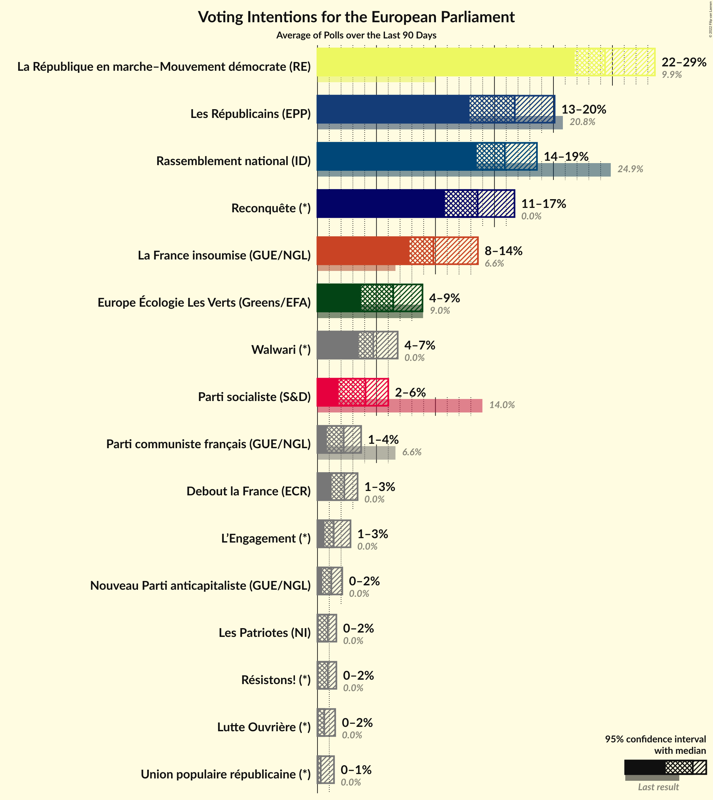

### Confidence Intervals

| Party | Last Result | Median | 80% Confidence Interval | 90% Confidence Interval | 95% Confidence Interval | 99% Confidence Interval |
|:-----:|:-----------:|:------:|:-----------------------:|:-----------------------:|:-----------------------:|:-----------------------:|
| <a href="#rassemblement-national-(id)">Rassemblement national (ID)</a> | 24.9% | 15.9% | 14.1–17.7% |13.8–18.2% | 13.5–18.6% | 12.8–19.5% |
| <a href="#les-républicains-(epp)">Les Républicains (EPP)</a> | 20.8% | 16.7% | 14.4–18.9% |13.6–19.5% | 12.9–20.1% | 11.5–20.9% |
| <a href="#parti-socialiste-(s&d)">Parti socialiste (S&D)</a> | 14.0% | 4.1% | 2.3–5.3% |2.0–5.7% | 1.8–6.0% | 1.5–6.7% |
| <a href="#la-république-en-marche–mouvement-démocrate-(re)">La République en marche–Mouvement démocrate (RE)</a> | 9.9% | 24.4% | 22.7–27.0% |22.2–27.8% | 21.8–28.6% | 20.9–30.3% |
| <a href="#europe-écologie-les-verts-(greens/efa)">Europe Écologie Les Verts (Greens/EFA)</a> | 9.0% | 6.4% | 4.4–8.3% |3.9–8.6% | 3.7–8.9% | 3.3–9.4% |
| <a href="#parti-communiste-français-(gue/ngl)">Parti communiste français (GUE/NGL)</a> | 6.6% | 2.2% | 1.2–3.3% |1.0–3.5% | 0.8–3.7% | 0.6–4.2% |
| <a href="#la-france-insoumise-(gue/ngl)">La France insoumise (GUE/NGL)</a> | 6.6% | 9.8% | 8.3–12.4% |8.0–13.2% | 7.8–13.6% | 7.2–14.4% |
| <a href="#agir,-la-droite-constructive–union-des-démocrates-et-indépendants-(re)">Agir, la droite constructive–Union des démocrates et indépendants (RE)</a> | 2.0% | N/A | N/A |N/A | N/A | N/A |
| <a href="#debout-la-france-(ecr)">Debout la France (ECR)</a> | 0.0% | 2.3% | 1.5–3.1% |1.4–3.3% | 1.2–3.4% | 1.0–3.9% |
| <a href="#les-patriotes-(ni)">Les Patriotes (NI)</a> | 0.0% | 0.9% | 0.1–1.3% |0.1–1.5% | 0.1–1.6% | 0.0–1.9% |
| <a href="#union-populaire-républicaine-(*)">Union populaire républicaine (*)</a> | 0.0% | 0.3% | 0.1–1.2% |0.1–1.3% | 0.1–1.4% | 0.0–1.7% |
| <a href="#nouveau-parti-anticapitaliste-(gue/ngl)">Nouveau Parti anticapitaliste (GUE/NGL)</a> | 0.0% | 1.2% | 0.6–1.7% |0.5–1.9% | 0.4–2.1% | 0.3–2.5% |
| <a href="#génération·s,-le-mouvement-(s&d)">Génération·s, le mouvement (S&D)</a> | 0.0% | N/A | N/A |N/A | N/A | N/A |
| <a href="#résistons!-(*)">Résistons! (*)</a> | 0.0% | 0.9% | 0.2–1.3% |0.1–1.5% | 0.1–1.6% | 0.1–1.9% |
| <a href="#lutte-ouvrière-(*)">Lutte Ouvrière (*)</a> | 0.0% | 0.6% | 0.1–1.2% |0.1–1.3% | 0.1–1.5% | 0.0–1.8% |
| <a href="#mouvement-des-gilets-jaunes-(*)">Mouvement des gilets jaunes (*)</a> | 0.0% | N/A | N/A |N/A | N/A | N/A |
| <a href="#reconquête-(*)">Reconquête (*)</a> | 0.0% | 13.6% | 11.5–15.8% |11.1–16.3% | 10.8–16.7% | 10.1–17.5% |
| <a href="#l’engagement-(*)">L’Engagement (*)</a> | 0.0% | 1.4% | 0.8–2.2% |0.7–2.5% | 0.6–2.8% | 0.5–3.4% |
| <a href="#walwari-(*)">Walwari (*)</a> | 0.0% | 4.7% | 3.9–5.9% |3.7–6.4% | 3.5–6.8% | 3.1–7.6% |

### Rassemblement national (ID)

*For a full overview of the results for this party, see the [Rassemblement national (ID)](party-rassemblementnationalid.html) page.*

| Voting Intentions | Probability | Accumulated | Special Marks |
|:-----------------:|:-----------:|:-----------:|:-------------:|
| 10.5–11.5% | 0% | 100% |  |
| 11.5–12.5% | 0.2% | 100% |  |
| 12.5–13.5% | 3% | 99.7% |  |
| 13.5–14.5% | 16% | 97% |  |
| 14.5–15.5% | 22% | 81% |  |
| 15.5–16.5% | 26% | 58% | Median |
| 16.5–17.5% | 20% | 32% |  |
| 17.5–18.5% | 9% | 12% |  |
| 18.5–19.5% | 2% | 3% |  |
| 19.5–20.5% | 0.4% | 0.5% |  |
| 20.5–21.5% | 0.1% | 0.1% |  |
| 21.5–22.5% | 0% | 0% |  |
| 22.5–23.5% | 0% | 0% |  |
| 23.5–24.5% | 0% | 0% |  |
| 24.5–25.5% | 0% | 0% | Last Result |

### Les Républicains (EPP)

*For a full overview of the results for this party, see the [Les Républicains (EPP)](party-lesrépublicainsepp.html) page.*

| Voting Intentions | Probability | Accumulated | Special Marks |
|:-----------------:|:-----------:|:-----------:|:-------------:|
| 8.5–9.5% | 0% | 100% |  |
| 9.5–10.5% | 0.1% | 100% |  |
| 10.5–11.5% | 0.4% | 99.9% |  |
| 11.5–12.5% | 1.3% | 99.5% |  |
| 12.5–13.5% | 3% | 98% |  |
| 13.5–14.5% | 7% | 95% |  |
| 14.5–15.5% | 13% | 89% |  |
| 15.5–16.5% | 21% | 76% |  |
| 16.5–17.5% | 25% | 54% | Median |
| 17.5–18.5% | 15% | 29% |  |
| 18.5–19.5% | 9% | 14% |  |
| 19.5–20.5% | 4% | 5% |  |
| 20.5–21.5% | 1.0% | 1.1% | Last Result |
| 21.5–22.5% | 0.1% | 0.1% |  |
| 22.5–23.5% | 0% | 0% |  |

### Parti socialiste (S&D)

*For a full overview of the results for this party, see the [Parti socialiste (S&D)](party-partisocialistesd.html) page.*

| Voting Intentions | Probability | Accumulated | Special Marks |
|:-----------------:|:-----------:|:-----------:|:-------------:|
| 0.0–0.5% | 0% | 100% |  |
| 0.5–1.5% | 0.7% | 100% |  |
| 1.5–2.5% | 13% | 99.3% |  |
| 2.5–3.5% | 22% | 86% |  |
| 3.5–4.5% | 34% | 64% | Median |
| 4.5–5.5% | 24% | 31% |  |
| 5.5–6.5% | 6% | 7% |  |
| 6.5–7.5% | 0.7% | 0.7% |  |
| 7.5–8.5% | 0% | 0% |  |
| 8.5–9.5% | 0% | 0% |  |
| 9.5–10.5% | 0% | 0% |  |
| 10.5–11.5% | 0% | 0% |  |
| 11.5–12.5% | 0% | 0% |  |
| 12.5–13.5% | 0% | 0% |  |
| 13.5–14.5% | 0% | 0% | Last Result |

### La République en marche–Mouvement démocrate (RE)

*For a full overview of the results for this party, see the [La République en marche–Mouvement démocrate (RE)](party-larépubliqueenmarche–mouvementdémocratere.html) page.*

| Voting Intentions | Probability | Accumulated | Special Marks |
|:-----------------:|:-----------:|:-----------:|:-------------:|
| 9.5–10.5% | 0% | 100% | Last Result |
| 10.5–11.5% | 0% | 100% |  |
| 11.5–12.5% | 0% | 100% |  |
| 12.5–13.5% | 0% | 100% |  |
| 13.5–14.5% | 0% | 100% |  |
| 14.5–15.5% | 0% | 100% |  |
| 15.5–16.5% | 0% | 100% |  |
| 16.5–17.5% | 0% | 100% |  |
| 17.5–18.5% | 0% | 100% |  |
| 18.5–19.5% | 0% | 100% |  |
| 19.5–20.5% | 0.2% | 100% |  |
| 20.5–21.5% | 1.5% | 99.8% |  |
| 21.5–22.5% | 7% | 98% |  |
| 22.5–23.5% | 19% | 92% |  |
| 23.5–24.5% | 27% | 73% | Median |
| 24.5–25.5% | 19% | 46% |  |
| 25.5–26.5% | 13% | 27% |  |
| 26.5–27.5% | 8% | 14% |  |
| 27.5–28.5% | 4% | 6% |  |
| 28.5–29.5% | 2% | 3% |  |
| 29.5–30.5% | 0.7% | 1.1% |  |
| 30.5–31.5% | 0.3% | 0.4% |  |
| 31.5–32.5% | 0.1% | 0.1% |  |
| 32.5–33.5% | 0% | 0% |  |

### Europe Écologie Les Verts (Greens/EFA)

*For a full overview of the results for this party, see the [Europe Écologie Les Verts (Greens/EFA)](party-europeécologielesvertsgreensefa.html) page.*

| Voting Intentions | Probability | Accumulated | Special Marks |
|:-----------------:|:-----------:|:-----------:|:-------------:|
| 1.5–2.5% | 0% | 100% |  |
| 2.5–3.5% | 2% | 100% |  |
| 3.5–4.5% | 11% | 98% |  |
| 4.5–5.5% | 16% | 87% |  |
| 5.5–6.5% | 25% | 72% | Median |
| 6.5–7.5% | 23% | 47% |  |
| 7.5–8.5% | 17% | 23% |  |
| 8.5–9.5% | 6% | 6% | Last Result |
| 9.5–10.5% | 0.3% | 0.3% |  |
| 10.5–11.5% | 0% | 0% |  |

### Parti communiste français (GUE/NGL)

*For a full overview of the results for this party, see the [Parti communiste français (GUE/NGL)](party-particommunistefrançaisguengl.html) page.*

| Voting Intentions | Probability | Accumulated | Special Marks |
|:-----------------:|:-----------:|:-----------:|:-------------:|
| 0.0–0.5% | 0.2% | 100% |  |
| 0.5–1.5% | 19% | 99.8% |  |
| 1.5–2.5% | 45% | 81% | Median |
| 2.5–3.5% | 31% | 36% |  |
| 3.5–4.5% | 4% | 4% |  |
| 4.5–5.5% | 0.1% | 0.1% |  |
| 5.5–6.5% | 0% | 0% |  |
| 6.5–7.5% | 0% | 0% | Last Result |

### La France insoumise (GUE/NGL)

*For a full overview of the results for this party, see the [La France insoumise (GUE/NGL)](party-lafranceinsoumiseguengl.html) page.*

| Voting Intentions | Probability | Accumulated | Special Marks |
|:-----------------:|:-----------:|:-----------:|:-------------:|
| 5.5–6.5% | 0.1% | 100% |  |
| 6.5–7.5% | 1.2% | 99.9% | Last Result |
| 7.5–8.5% | 15% | 98.7% |  |
| 8.5–9.5% | 26% | 83% |  |
| 9.5–10.5% | 27% | 57% | Median |
| 10.5–11.5% | 15% | 31% |  |
| 11.5–12.5% | 7% | 16% |  |
| 12.5–13.5% | 6% | 9% |  |
| 13.5–14.5% | 3% | 3% |  |
| 14.5–15.5% | 0.3% | 0.4% |  |
| 15.5–16.5% | 0% | 0% |  |

### Lutte Ouvrière (*)

*For a full overview of the results for this party, see the [Lutte Ouvrière (*)](party-lutteouvrière.html) page.*

| Voting Intentions | Probability | Accumulated | Special Marks |
|:-----------------:|:-----------:|:-----------:|:-------------:|
| 0.0–0.5% | 50% | 100% | Last Result |
| 0.5–1.5% | 49% | 50% | Median |
| 1.5–2.5% | 2% | 2% |  |
| 2.5–3.5% | 0% | 0% |  |

### Nouveau Parti anticapitaliste (GUE/NGL)

*For a full overview of the results for this party, see the [Nouveau Parti anticapitaliste (GUE/NGL)](party-nouveaupartianticapitalisteguengl.html) page.*

| Voting Intentions | Probability | Accumulated | Special Marks |
|:-----------------:|:-----------:|:-----------:|:-------------:|
| 0.0–0.5% | 6% | 100% | Last Result |
| 0.5–1.5% | 74% | 94% | Median |
| 1.5–2.5% | 19% | 20% |  |
| 2.5–3.5% | 0.5% | 0.5% |  |
| 3.5–4.5% | 0% | 0% |  |

### Résistons! (*)

*For a full overview of the results for this party, see the [Résistons! (*)](party-résistons.html) page.*

| Voting Intentions | Probability | Accumulated | Special Marks |
|:-----------------:|:-----------:|:-----------:|:-------------:|
| 0.0–0.5% | 25% | 100% | Last Result |
| 0.5–1.5% | 71% | 75% | Median |
| 1.5–2.5% | 3% | 3% |  |
| 2.5–3.5% | 0% | 0% |  |

### Debout la France (ECR)

*For a full overview of the results for this party, see the [Debout la France (ECR)](party-deboutlafranceecr.html) page.*

| Voting Intentions | Probability | Accumulated | Special Marks |
|:-----------------:|:-----------:|:-----------:|:-------------:|
| 0.0–0.5% | 0% | 100% | Last Result |
| 0.5–1.5% | 10% | 100% |  |
| 1.5–2.5% | 55% | 90% | Median |
| 2.5–3.5% | 33% | 34% |  |
| 3.5–4.5% | 2% | 2% |  |
| 4.5–5.5% | 0.1% | 0.1% |  |
| 5.5–6.5% | 0% | 0% |  |

### Les Patriotes (NI)

*For a full overview of the results for this party, see the [Les Patriotes (NI)](party-lespatriotesni.html) page.*

| Voting Intentions | Probability | Accumulated | Special Marks |
|:-----------------:|:-----------:|:-----------:|:-------------:|
| 0.0–0.5% | 34% | 100% | Last Result |
| 0.5–1.5% | 63% | 66% | Median |
| 1.5–2.5% | 3% | 3% |  |
| 2.5–3.5% | 0% | 0% |  |

### Union populaire républicaine (*)

*For a full overview of the results for this party, see the [Union populaire républicaine (*)](party-unionpopulairerépublicaine.html) page.*

| Voting Intentions | Probability | Accumulated | Special Marks |
|:-----------------:|:-----------:|:-----------:|:-------------:|
| 0.0–0.5% | 66% | 100% | Last Result, Median |
| 0.5–1.5% | 33% | 34% |  |
| 1.5–2.5% | 1.0% | 1.0% |  |
| 2.5–3.5% | 0% | 0% |  |

### L’Engagement (*)

*For a full overview of the results for this party, see the [L’Engagement (*)](party-l’engagement.html) page.*

| Voting Intentions | Probability | Accumulated | Special Marks |
|:-----------------:|:-----------:|:-----------:|:-------------:|
| 0.0–0.5% | 1.0% | 100% | Last Result |
| 0.5–1.5% | 62% | 99.0% | Median |
| 1.5–2.5% | 33% | 37% |  |
| 2.5–3.5% | 4% | 4% |  |
| 3.5–4.5% | 0.3% | 0.3% |  |
| 4.5–5.5% | 0% | 0% |  |

### Reconquête (*)

*For a full overview of the results for this party, see the [Reconquête (*)](party-reconquête.html) page.*

| Voting Intentions | Probability | Accumulated | Special Marks |
|:-----------------:|:-----------:|:-----------:|:-------------:|
| 0.0–0.5% | 0% | 100% | Last Result |
| 0.5–1.5% | 0% | 100% |  |
| 1.5–2.5% | 0% | 100% |  |
| 2.5–3.5% | 0% | 100% |  |
| 3.5–4.5% | 0% | 100% |  |
| 4.5–5.5% | 0% | 100% |  |
| 5.5–6.5% | 0% | 100% |  |
| 6.5–7.5% | 0% | 100% |  |
| 7.5–8.5% | 0% | 100% |  |
| 8.5–9.5% | 0.1% | 100% |  |
| 9.5–10.5% | 1.5% | 99.9% |  |
| 10.5–11.5% | 8% | 98% |  |
| 11.5–12.5% | 19% | 90% |  |
| 12.5–13.5% | 21% | 71% |  |
| 13.5–14.5% | 22% | 50% | Median |
| 14.5–15.5% | 16% | 29% |  |
| 15.5–16.5% | 9% | 13% |  |
| 16.5–17.5% | 3% | 3% |  |
| 17.5–18.5% | 0.4% | 0.4% |  |
| 18.5–19.5% | 0% | 0% |  |

### Walwari (*)

*For a full overview of the results for this party, see the [Walwari (*)](party-walwari.html) page.*

| Voting Intentions | Probability | Accumulated | Special Marks |
|:-----------------:|:-----------:|:-----------:|:-------------:|
| 0.0–0.5% | 0% | 100% | Last Result |
| 0.5–1.5% | 0% | 100% |  |
| 1.5–2.5% | 0% | 100% |  |
| 2.5–3.5% | 3% | 100% |  |
| 3.5–4.5% | 38% | 97% |  |
| 4.5–5.5% | 42% | 59% | Median |
| 5.5–6.5% | 13% | 16% |  |
| 6.5–7.5% | 3% | 4% |  |
| 7.5–8.5% | 0.5% | 0.5% |  |
| 8.5–9.5% | 0% | 0.1% |  |
| 9.5–10.5% | 0% | 0% |  |

## Seats

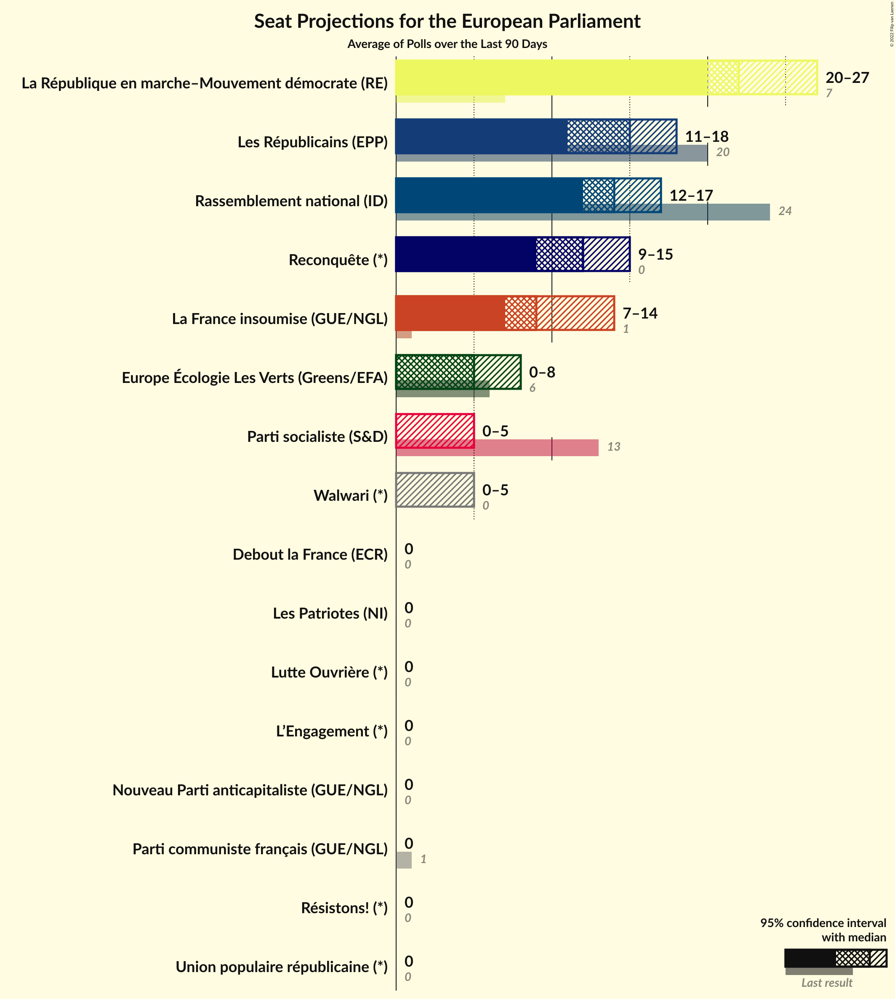

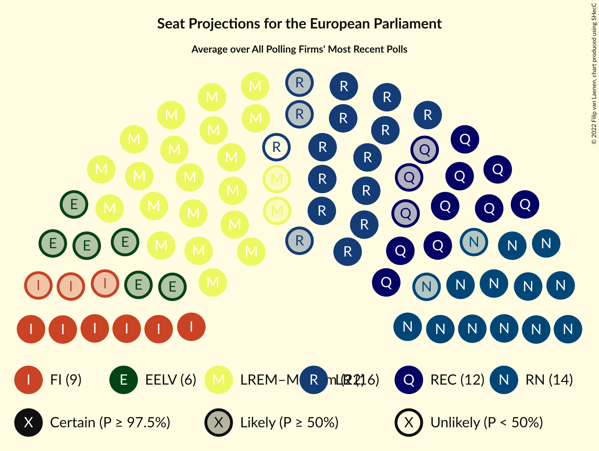

### Confidence Intervals

| Party | Last Result | Median | 80% Confidence Interval | 90% Confidence Interval | 95% Confidence Interval | 99% Confidence Interval |
|:-----:|:-----------:|:------:|:-----------------------:|:-----------------------:|:-----------------------:|:-----------------------:|
| <a href="#rassemblement-national-(id)">Rassemblement national (ID)</a> | 24 | 14 | 13–16 |12–17 | 12–17 | 11–18 |
| <a href="#les-républicains-(epp)">Les Républicains (EPP)</a> | 20 | 15 | 13–17 |12–18 | 11–18 | 10–19 |
| <a href="#parti-socialiste-(s&d)">Parti socialiste (S&D)</a> | 13 | 0 | 0–4 |0–5 | 0–5 | 0–6 |
| <a href="#la-république-en-marche–mouvement-démocrate-(re)">La République en marche–Mouvement démocrate (RE)</a> | 7 | 22 | 20–27 |20–27 | 20–27 | 19–28 |
| <a href="#europe-écologie-les-verts-(greens/efa)">Europe Écologie Les Verts (Greens/EFA)</a> | 6 | 5 | 0–8 |0–8 | 0–8 | 0–8 |
| <a href="#parti-communiste-français-(gue/ngl)">Parti communiste français (GUE/NGL)</a> | 1 | 0 | 0 |0 | 0 | 0 |
| <a href="#la-france-insoumise-(gue/ngl)">La France insoumise (GUE/NGL)</a> | 1 | 9 | 7–11 |7–14 | 7–14 | 6–14 |
| <a href="#agir,-la-droite-constructive–union-des-démocrates-et-indépendants-(re)">Agir, la droite constructive–Union des démocrates et indépendants (RE)</a> | 0 | N/A | N/A |N/A | N/A | N/A |
| <a href="#debout-la-france-(ecr)">Debout la France (ECR)</a> | 0 | 0 | 0 |0 | 0 | 0 |
| <a href="#les-patriotes-(ni)">Les Patriotes (NI)</a> | 0 | 0 | 0 |0 | 0 | 0 |
| <a href="#union-populaire-républicaine-(*)">Union populaire républicaine (*)</a> | 0 | 0 | 0 |0 | 0 | 0 |
| <a href="#nouveau-parti-anticapitaliste-(gue/ngl)">Nouveau Parti anticapitaliste (GUE/NGL)</a> | 0 | 0 | 0 |0 | 0 | 0 |
| <a href="#génération·s,-le-mouvement-(s&d)">Génération·s, le mouvement (S&D)</a> | 0 | N/A | N/A |N/A | N/A | N/A |
| <a href="#résistons!-(*)">Résistons! (*)</a> | 0 | 0 | 0 |0 | 0 | 0 |
| <a href="#lutte-ouvrière-(*)">Lutte Ouvrière (*)</a> | 0 | 0 | 0 |0 | 0 | 0 |
| <a href="#mouvement-des-gilets-jaunes-(*)">Mouvement des gilets jaunes (*)</a> | 0 | N/A | N/A |N/A | N/A | N/A |
| <a href="#reconquête-(*)">Reconquête (*)</a> | 0 | 12 | 10–14 |10–15 | 9–15 | 9–16 |
| <a href="#l’engagement-(*)">L’Engagement (*)</a> | 0 | 0 | 0 |0 | 0 | 0 |
| <a href="#walwari-(*)">Walwari (*)</a> | 0 | 0 | 0–5 |0–5 | 0–5 | 0–6 |

### Rassemblement national (ID)

*For a full overview of the results for this party, see the [Rassemblement national (ID)](party-rassemblementnationalid.html) page.*

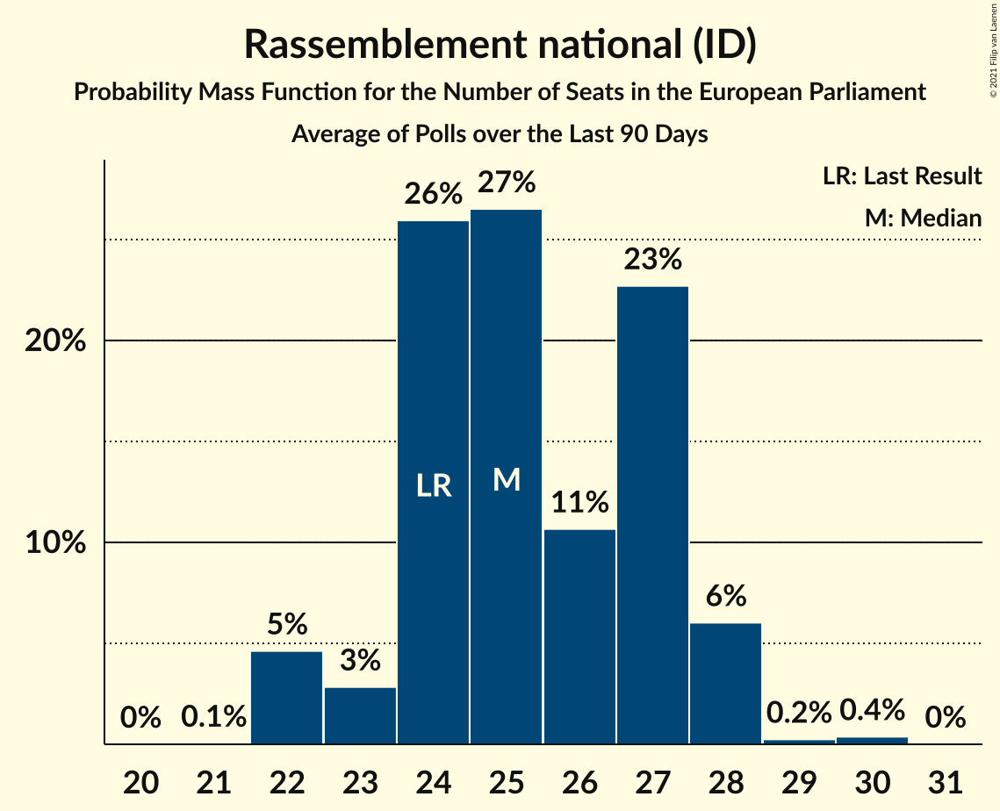

| Number of Seats | Probability | Accumulated | Special Marks |
|:---------------:|:-----------:|:-----------:|:-------------:|
| 11 | 0.6% | 100% |  |
| 12 | 6% | 99.4% |  |
| 13 | 23% | 94% |  |
| 14 | 24% | 70% | Median |
| 15 | 20% | 46% |  |
| 16 | 18% | 26% |  |
| 17 | 7% | 8% |  |
| 18 | 0.5% | 0.6% |  |
| 19 | 0.1% | 0.1% |  |
| 20 | 0% | 0% |  |
| 21 | 0% | 0% |  |
| 22 | 0% | 0% |  |
| 23 | 0% | 0% |  |
| 24 | 0% | 0% | Last Result |

### Les Républicains (EPP)

*For a full overview of the results for this party, see the [Les Républicains (EPP)](party-lesrépublicainsepp.html) page.*

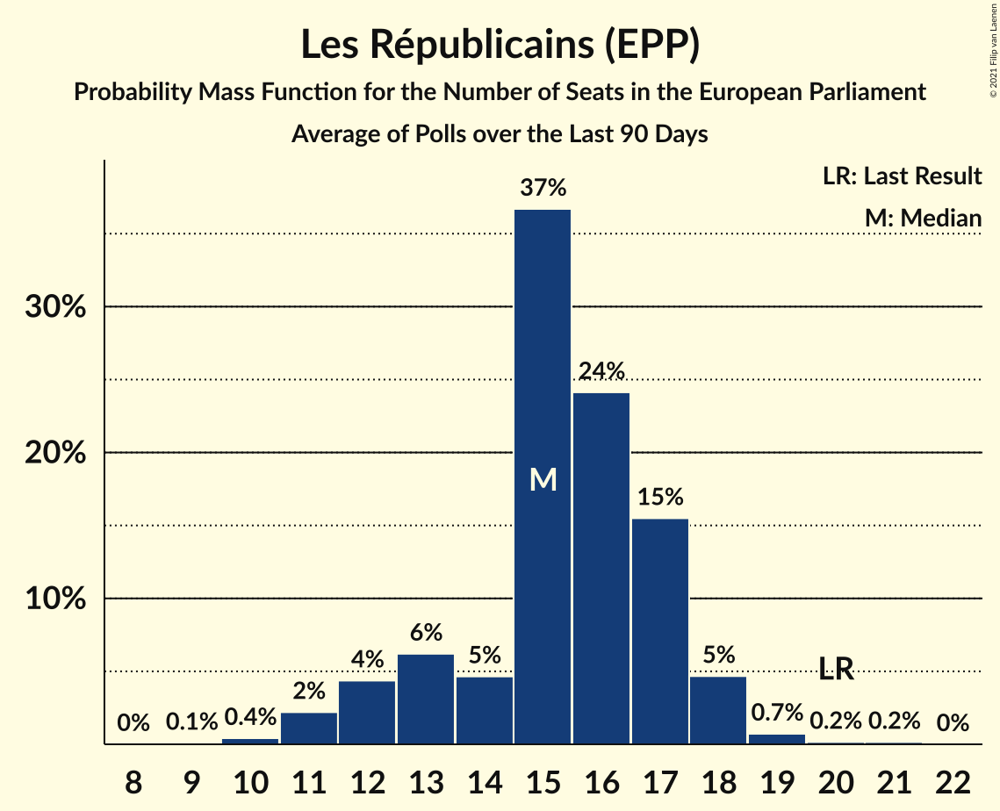

| Number of Seats | Probability | Accumulated | Special Marks |
|:---------------:|:-----------:|:-----------:|:-------------:|
| 9 | 0.1% | 100% |  |
| 10 | 1.5% | 99.8% |  |
| 11 | 2% | 98% |  |
| 12 | 4% | 96% |  |
| 13 | 7% | 92% |  |
| 14 | 19% | 85% |  |
| 15 | 25% | 66% | Median |
| 16 | 28% | 41% |  |
| 17 | 7% | 13% |  |
| 18 | 5% | 6% |  |
| 19 | 0.6% | 0.9% |  |
| 20 | 0.1% | 0.3% | Last Result |
| 21 | 0.2% | 0.2% |  |
| 22 | 0% | 0% |  |

### Parti socialiste (S&D)

*For a full overview of the results for this party, see the [Parti socialiste (S&D)](party-partisocialistesd.html) page.*

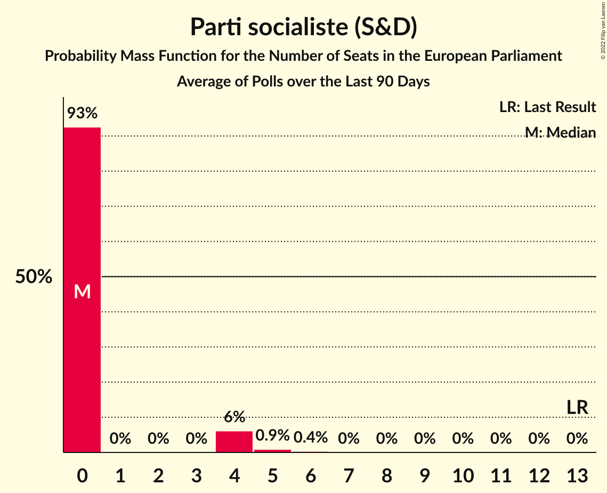

| Number of Seats | Probability | Accumulated | Special Marks |
|:---------------:|:-----------:|:-----------:|:-------------:|
| 0 | 85% | 100% | Median |
| 1 | 0% | 15% |  |
| 2 | 0% | 15% |  |
| 3 | 0% | 15% |  |
| 4 | 7% | 15% |  |
| 5 | 7% | 7% |  |
| 6 | 0.7% | 0.7% |  |
| 7 | 0% | 0% |  |
| 8 | 0% | 0% |  |
| 9 | 0% | 0% |  |
| 10 | 0% | 0% |  |
| 11 | 0% | 0% |  |
| 12 | 0% | 0% |  |
| 13 | 0% | 0% | Last Result |

### La République en marche–Mouvement démocrate (RE)

*For a full overview of the results for this party, see the [La République en marche–Mouvement démocrate (RE)](party-larépubliqueenmarche–mouvementdémocratere.html) page.*

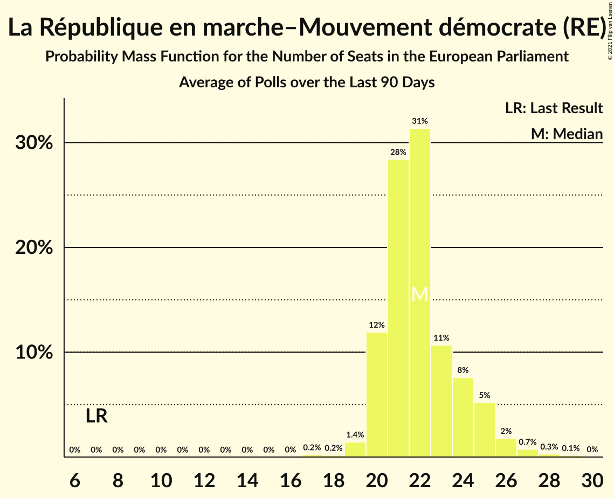

| Number of Seats | Probability | Accumulated | Special Marks |
|:---------------:|:-----------:|:-----------:|:-------------:|
| 7 | 0% | 100% | Last Result |
| 8 | 0% | 100% |  |
| 9 | 0% | 100% |  |
| 10 | 0% | 100% |  |
| 11 | 0% | 100% |  |
| 12 | 0% | 100% |  |
| 13 | 0% | 100% |  |
| 14 | 0% | 100% |  |
| 15 | 0% | 100% |  |
| 16 | 0% | 100% |  |
| 17 | 0.2% | 100% |  |
| 18 | 0.1% | 99.8% |  |
| 19 | 0.4% | 99.7% |  |
| 20 | 20% | 99.3% |  |
| 21 | 19% | 79% |  |
| 22 | 18% | 60% | Median |
| 23 | 15% | 43% |  |
| 24 | 6% | 28% |  |
| 25 | 9% | 22% |  |
| 26 | 1.4% | 14% |  |
| 27 | 12% | 12% |  |
| 28 | 0.3% | 0.6% |  |
| 29 | 0.2% | 0.3% |  |
| 30 | 0% | 0% |  |

### Europe Écologie Les Verts (Greens/EFA)

*For a full overview of the results for this party, see the [Europe Écologie Les Verts (Greens/EFA)](party-europeécologielesvertsgreensefa.html) page.*

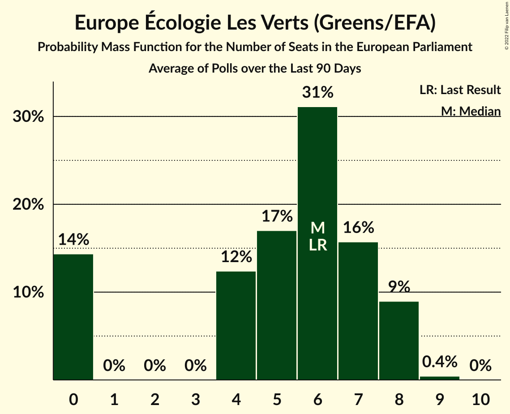

| Number of Seats | Probability | Accumulated | Special Marks |
|:---------------:|:-----------:|:-----------:|:-------------:|
| 0 | 13% | 100% |  |
| 1 | 0% | 87% |  |
| 2 | 0% | 87% |  |
| 3 | 0% | 87% |  |
| 4 | 19% | 87% |  |
| 5 | 20% | 67% | Median |
| 6 | 24% | 47% | Last Result |
| 7 | 9% | 23% |  |
| 8 | 14% | 14% |  |
| 9 | 0.2% | 0.2% |  |
| 10 | 0% | 0% |  |

### Parti communiste français (GUE/NGL)

*For a full overview of the results for this party, see the [Parti communiste français (GUE/NGL)](party-particommunistefrançaisguengl.html) page.*

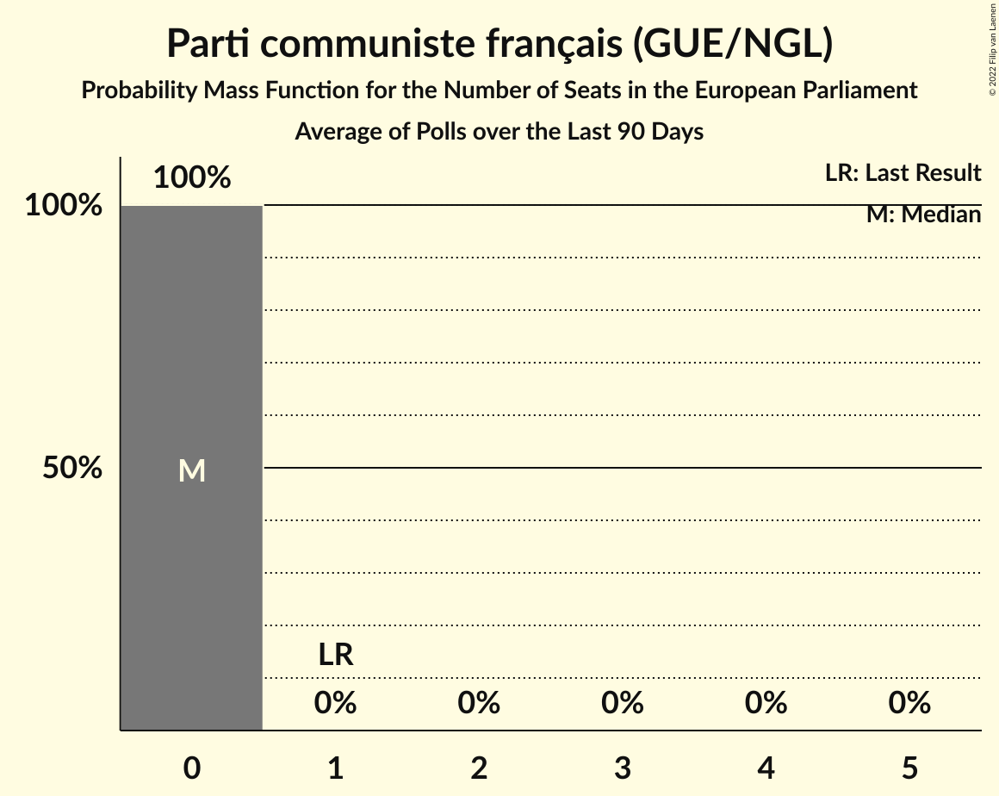

| Number of Seats | Probability | Accumulated | Special Marks |
|:---------------:|:-----------:|:-----------:|:-------------:|
| 0 | 100% | 100% | Median |
| 1 | 0% | 0% | Last Result |

### La France insoumise (GUE/NGL)

*For a full overview of the results for this party, see the [La France insoumise (GUE/NGL)](party-lafranceinsoumiseguengl.html) page.*

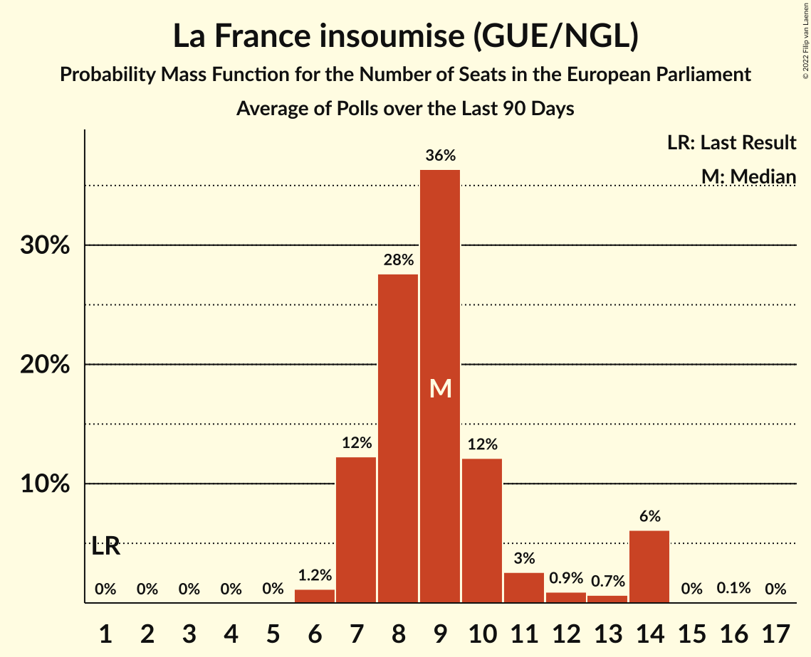

| Number of Seats | Probability | Accumulated | Special Marks |
|:---------------:|:-----------:|:-----------:|:-------------:|
| 1 | 0% | 100% | Last Result |
| 2 | 0% | 100% |  |
| 3 | 0% | 100% |  |
| 4 | 0% | 100% |  |
| 5 | 0% | 100% |  |
| 6 | 1.2% | 100% |  |
| 7 | 12% | 98.8% |  |
| 8 | 28% | 87% |  |
| 9 | 36% | 59% | Median |
| 10 | 12% | 23% |  |
| 11 | 3% | 10% |  |
| 12 | 0.9% | 8% |  |
| 13 | 0.7% | 7% |  |
| 14 | 6% | 6% |  |
| 15 | 0% | 0.1% |  |
| 16 | 0.1% | 0.1% |  |
| 17 | 0% | 0% |  |

### Agir, la droite constructive–Union des démocrates et indépendants (RE)

*For a full overview of the results for this party, see the [Agir, la droite constructive–Union des démocrates et indépendants (RE)](party-agirladroiteconstructive–uniondesdémocratesetindépendantsre.html) page.*

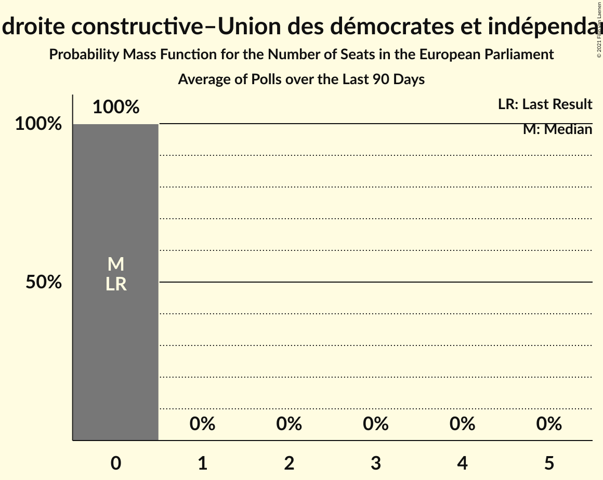

### Debout la France (ECR)

*For a full overview of the results for this party, see the [Debout la France (ECR)](party-deboutlafranceecr.html) page.*

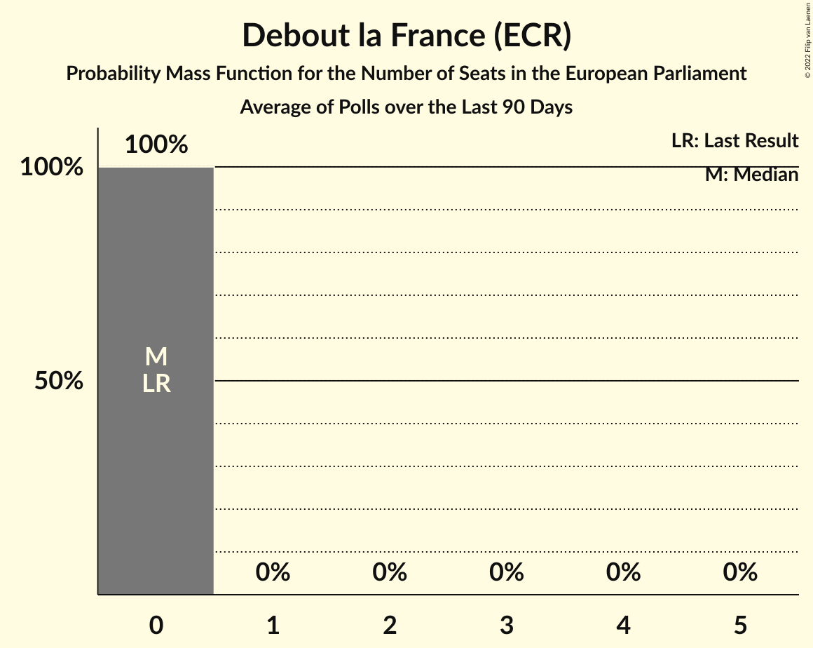

| Number of Seats | Probability | Accumulated | Special Marks |
|:---------------:|:-----------:|:-----------:|:-------------:|
| 0 | 100% | 100% | Last Result, Median |

### Les Patriotes (NI)

*For a full overview of the results for this party, see the [Les Patriotes (NI)](party-lespatriotesni.html) page.*

| Number of Seats | Probability | Accumulated | Special Marks |
|:---------------:|:-----------:|:-----------:|:-------------:|
| 0 | 100% | 100% | Last Result, Median |

### Union populaire républicaine (*)

*For a full overview of the results for this party, see the [Union populaire républicaine (*)](party-unionpopulairerépublicaine.html) page.*

| Number of Seats | Probability | Accumulated | Special Marks |
|:---------------:|:-----------:|:-----------:|:-------------:|
| 0 | 100% | 100% | Last Result, Median |

### Nouveau Parti anticapitaliste (GUE/NGL)

*For a full overview of the results for this party, see the [Nouveau Parti anticapitaliste (GUE/NGL)](party-nouveaupartianticapitalisteguengl.html) page.*

| Number of Seats | Probability | Accumulated | Special Marks |
|:---------------:|:-----------:|:-----------:|:-------------:|
| 0 | 100% | 100% | Last Result, Median |

### Génération·s, le mouvement (S&D)

*For a full overview of the results for this party, see the [Génération·s, le mouvement (S&D)](party-génération·slemouvementsd.html) page.*

### Résistons! (*)

*For a full overview of the results for this party, see the [Résistons! (*)](party-résistons.html) page.*

| Number of Seats | Probability | Accumulated | Special Marks |
|:---------------:|:-----------:|:-----------:|:-------------:|
| 0 | 100% | 100% | Last Result, Median |

### Lutte Ouvrière (*)

*For a full overview of the results for this party, see the [Lutte Ouvrière (*)](party-lutteouvrière.html) page.*

| Number of Seats | Probability | Accumulated | Special Marks |
|:---------------:|:-----------:|:-----------:|:-------------:|
| 0 | 100% | 100% | Last Result, Median |

### Mouvement des gilets jaunes (*)

*For a full overview of the results for this party, see the [Mouvement des gilets jaunes (*)](party-mouvementdesgiletsjaunes.html) page.*

### Reconquête (*)

*For a full overview of the results for this party, see the [Reconquête (*)](party-reconquête.html) page.*

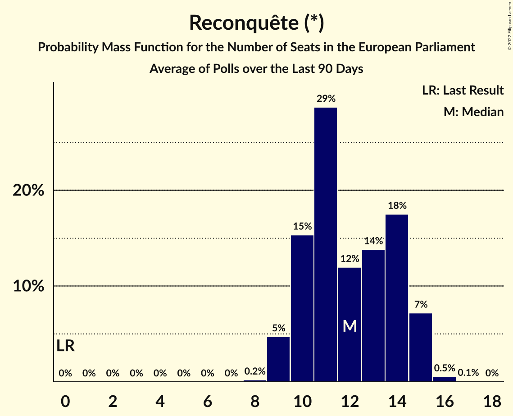

| Number of Seats | Probability | Accumulated | Special Marks |
|:---------------:|:-----------:|:-----------:|:-------------:|
| 0 | 0% | 100% | Last Result |
| 1 | 0% | 100% |  |
| 2 | 0% | 100% |  |
| 3 | 0% | 100% |  |
| 4 | 0% | 100% |  |
| 5 | 0% | 100% |  |
| 6 | 0% | 100% |  |
| 7 | 0% | 100% |  |
| 8 | 0.2% | 100% |  |
| 9 | 5% | 99.8% |  |
| 10 | 15% | 95% |  |
| 11 | 29% | 80% |  |
| 12 | 12% | 51% | Median |
| 13 | 14% | 39% |  |
| 14 | 18% | 25% |  |
| 15 | 7% | 8% |  |
| 16 | 0.5% | 0.6% |  |
| 17 | 0.1% | 0.1% |  |
| 18 | 0% | 0% |  |

### L’Engagement (*)

*For a full overview of the results for this party, see the [L’Engagement (*)](party-l’engagement.html) page.*

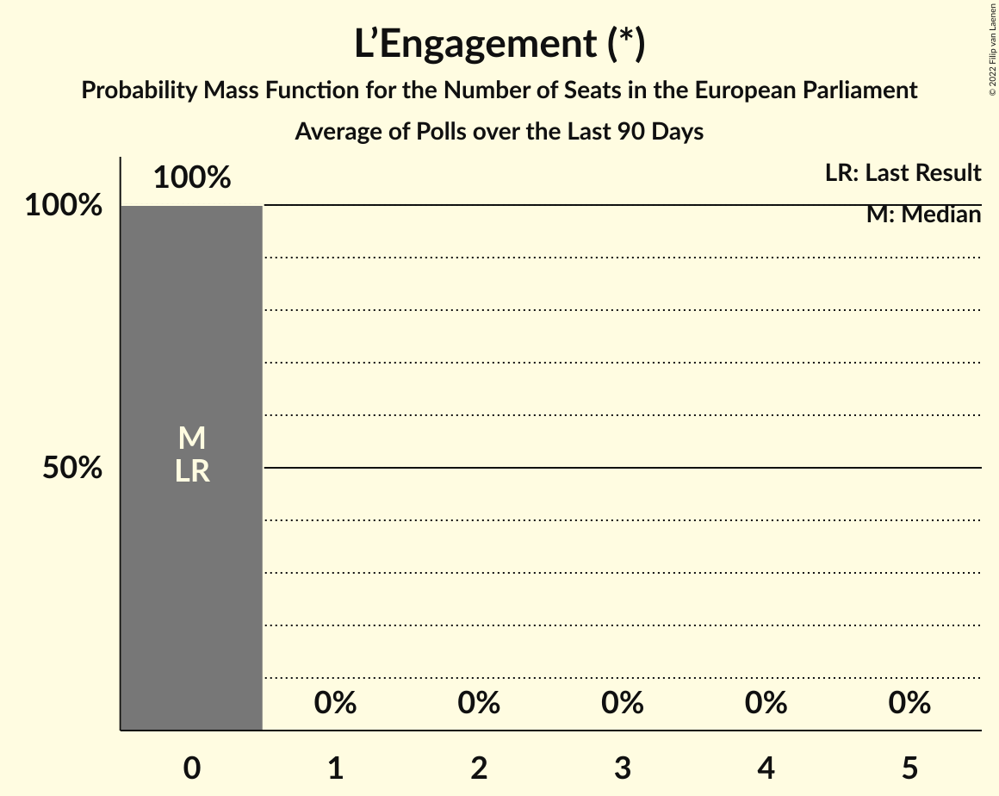

| Number of Seats | Probability | Accumulated | Special Marks |
|:---------------:|:-----------:|:-----------:|:-------------:|
| 0 | 100% | 100% | Last Result, Median |

### Walwari (*)

*For a full overview of the results for this party, see the [Walwari (*)](party-walwari.html) page.*

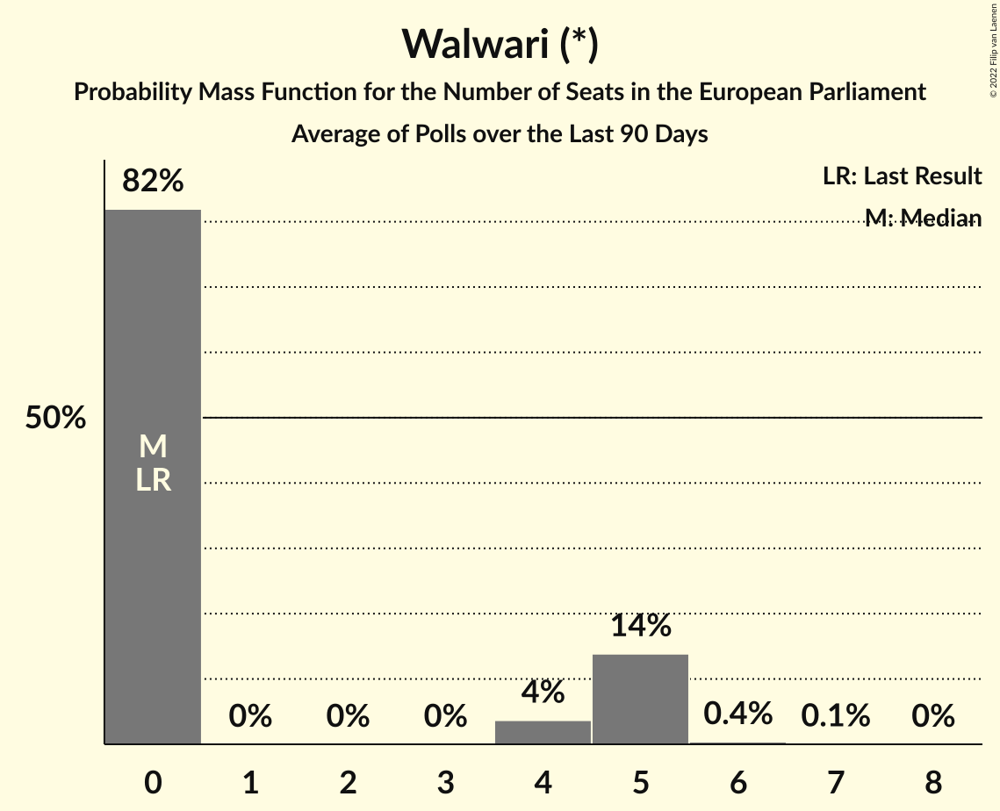

| Number of Seats | Probability | Accumulated | Special Marks |
|:---------------:|:-----------:|:-----------:|:-------------:|
| 0 | 65% | 100% | Last Result, Median |
| 1 | 0% | 35% |  |
| 2 | 0% | 35% |  |
| 3 | 0% | 35% |  |
| 4 | 8% | 35% |  |
| 5 | 25% | 27% |  |
| 6 | 2% | 2% |  |
| 7 | 0.2% | 0.2% |  |
| 8 | 0% | 0% |  |

## Coalitions

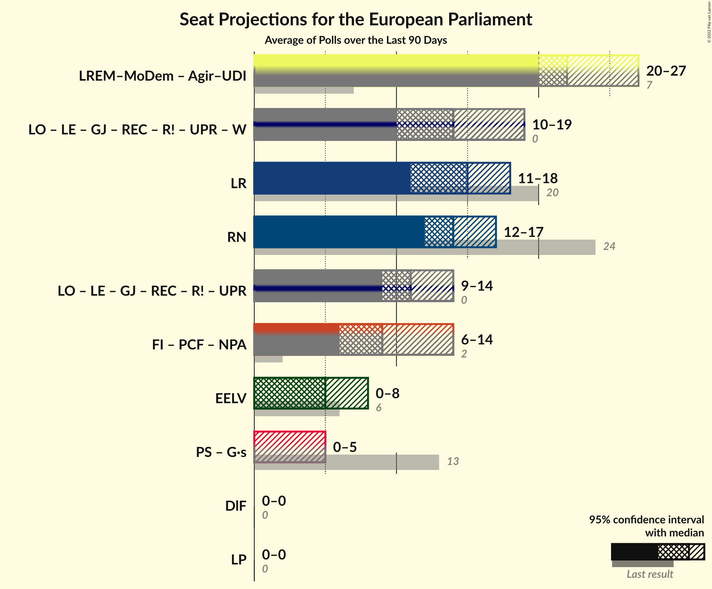

### Confidence Intervals

| Coalition | Last Result | Median | Majority? | 80% Confidence Interval | 90% Confidence Interval | 95% Confidence Interval | 99% Confidence Interval |
|:---------:|:-----------:|:------:|:---------:|:-----------------------:|:-----------------------:|:-----------------------:|:-----------------------:|
| La République en marche–Mouvement démocrate (RE) – Agir, la droite constructive–Union des démocrates et indépendants (RE) | 7 | 22 | 0% | 20–27 | 20–27 | 20–27 | 19–28 |
| Lutte Ouvrière (*) – L’Engagement (*) – Mouvement des gilets jaunes (*) – Reconquête (*) – Résistons! (*) – Union populaire républicaine (*) – Walwari (*) | 0 | 14 | 0% | 12–19 | 11–19 | 10–19 | 10–20 |
| Les Républicains (EPP) | 20 | 15 | 0% | 13–17 | 12–18 | 11–18 | 10–19 |
| Rassemblement national (ID) | 24 | 14 | 0% | 13–16 | 12–17 | 12–17 | 11–18 |
| Lutte Ouvrière (*) – L’Engagement (*) – Mouvement des gilets jaunes (*) – Reconquête (*) – Résistons! (*) – Union populaire républicaine (*) | 0 | 11 | 0% | 10–13 | 9–13 | 9–14 | 9–14 |
| La France insoumise (GUE/NGL) – Parti communiste français (GUE/NGL) – Nouveau Parti anticapitaliste (GUE/NGL) | 2 | 9 | 0% | 7–11 | 7–14 | 7–14 | 6–14 |
| Europe Écologie Les Verts (Greens/EFA) | 6 | 5 | 0% | 0–8 | 0–8 | 0–8 | 0–8 |
| Parti socialiste (S&D) – Génération·s, le mouvement (S&D) | 13 | 0 | 0% | 0–4 | 0–5 | 0–5 | 0–6 |
| Debout la France (ECR) | 0 | 0 | 0% | 0 | 0 | 0 | 0 |
| Les Patriotes (NI) | 0 | 0 | 0% | 0 | 0 | 0 | 0 |

### La République en marche–Mouvement démocrate (RE) – Agir, la droite constructive–Union des démocrates et indépendants (RE)

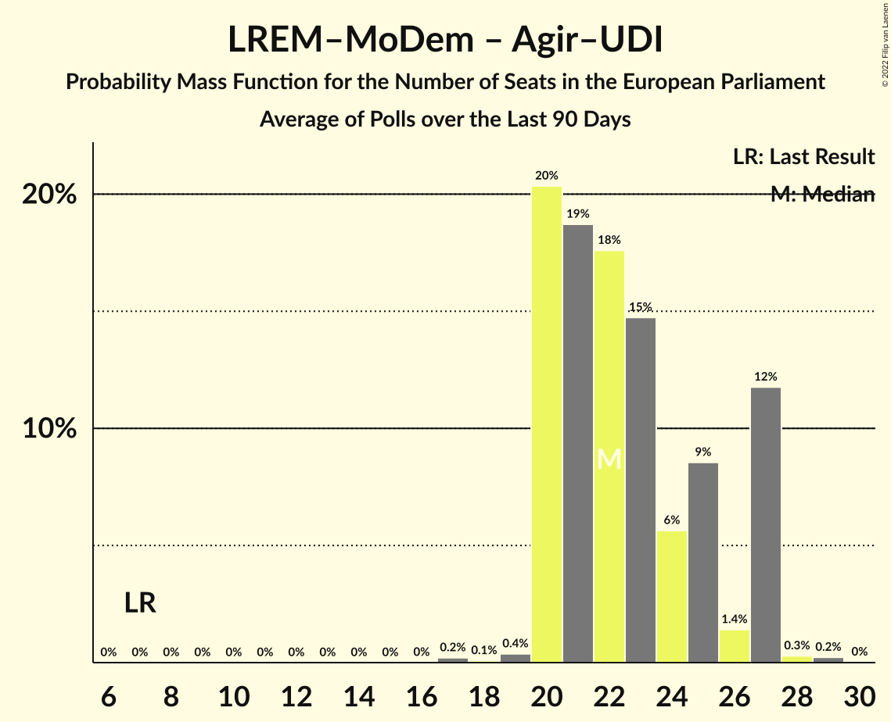

| Number of Seats | Probability | Accumulated | Special Marks |
|:---------------:|:-----------:|:-----------:|:-------------:|
| 7 | 0% | 100% | Last Result |
| 8 | 0% | 100% |  |
| 9 | 0% | 100% |  |
| 10 | 0% | 100% |  |
| 11 | 0% | 100% |  |
| 12 | 0% | 100% |  |
| 13 | 0% | 100% |  |
| 14 | 0% | 100% |  |
| 15 | 0% | 100% |  |
| 16 | 0% | 100% |  |
| 17 | 0.2% | 100% |  |
| 18 | 0.1% | 99.8% |  |
| 19 | 0.4% | 99.7% |  |
| 20 | 20% | 99.3% |  |
| 21 | 19% | 79% |  |
| 22 | 18% | 60% | Median |
| 23 | 15% | 43% |  |
| 24 | 6% | 28% |  |
| 25 | 9% | 22% |  |
| 26 | 1.4% | 14% |  |
| 27 | 12% | 12% |  |
| 28 | 0.3% | 0.6% |  |
| 29 | 0.2% | 0.3% |  |
| 30 | 0% | 0% |  |

### Lutte Ouvrière (*) – L’Engagement (*) – Mouvement des gilets jaunes (*) – Reconquête (*) – Résistons! (*) – Union populaire républicaine (*) – Walwari (*)

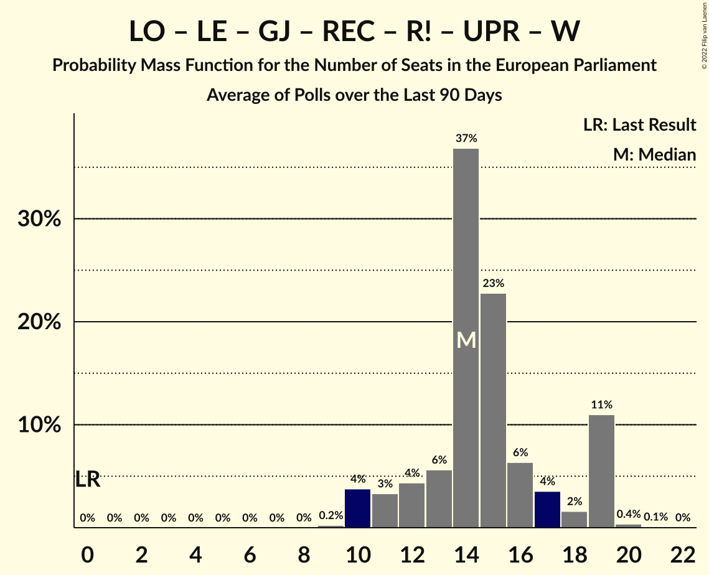

| Number of Seats | Probability | Accumulated | Special Marks |
|:---------------:|:-----------:|:-----------:|:-------------:|
| 0 | 0% | 100% | Last Result |
| 1 | 0% | 100% |  |
| 2 | 0% | 100% |  |
| 3 | 0% | 100% |  |
| 4 | 0% | 100% |  |
| 5 | 0% | 100% |  |
| 6 | 0% | 100% |  |
| 7 | 0% | 100% |  |
| 8 | 0% | 100% |  |
| 9 | 0.2% | 100% |  |
| 10 | 4% | 99.7% |  |
| 11 | 3% | 96% |  |
| 12 | 4% | 93% | Median |
| 13 | 6% | 88% |  |
| 14 | 37% | 83% |  |
| 15 | 23% | 46% |  |
| 16 | 6% | 23% |  |
| 17 | 4% | 17% |  |
| 18 | 2% | 13% |  |
| 19 | 11% | 11% |  |
| 20 | 0.4% | 0.5% |  |
| 21 | 0.1% | 0.1% |  |
| 22 | 0% | 0% |  |

### Les Républicains (EPP)

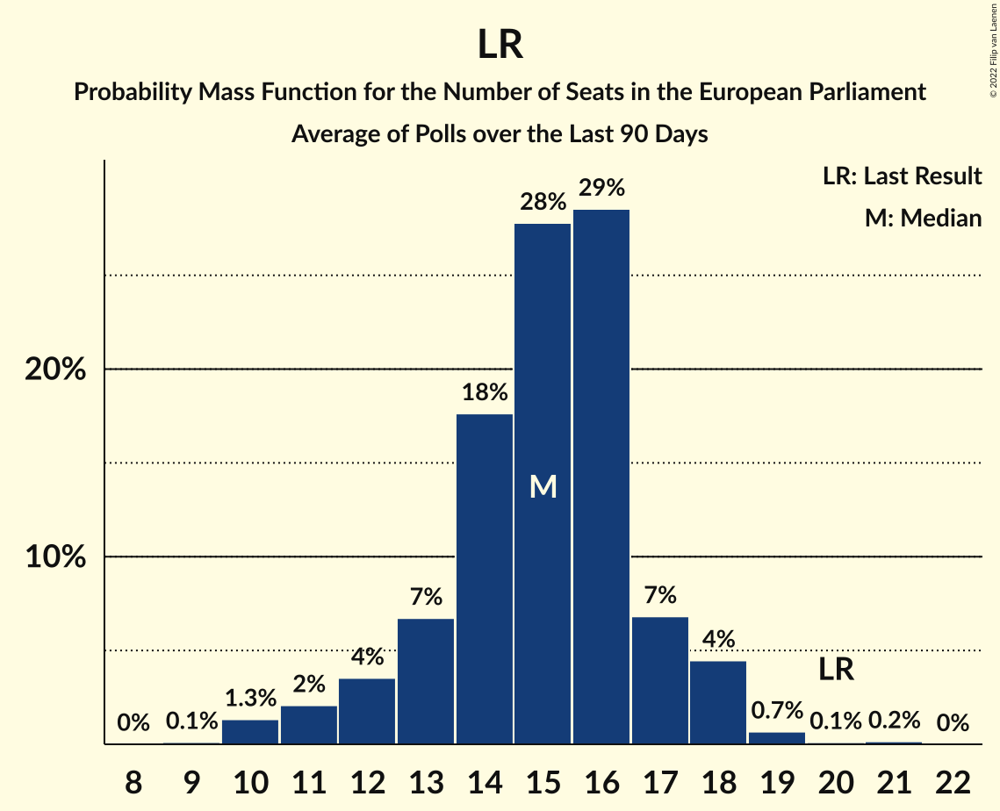

| Number of Seats | Probability | Accumulated | Special Marks |
|:---------------:|:-----------:|:-----------:|:-------------:|
| 9 | 0.1% | 100% |  |
| 10 | 1.5% | 99.8% |  |
| 11 | 2% | 98% |  |
| 12 | 4% | 96% |  |
| 13 | 7% | 92% |  |
| 14 | 19% | 85% |  |
| 15 | 25% | 66% | Median |
| 16 | 28% | 41% |  |
| 17 | 7% | 13% |  |
| 18 | 5% | 6% |  |
| 19 | 0.6% | 0.9% |  |
| 20 | 0.1% | 0.3% | Last Result |
| 21 | 0.2% | 0.2% |  |
| 22 | 0% | 0% |  |

### Rassemblement national (ID)

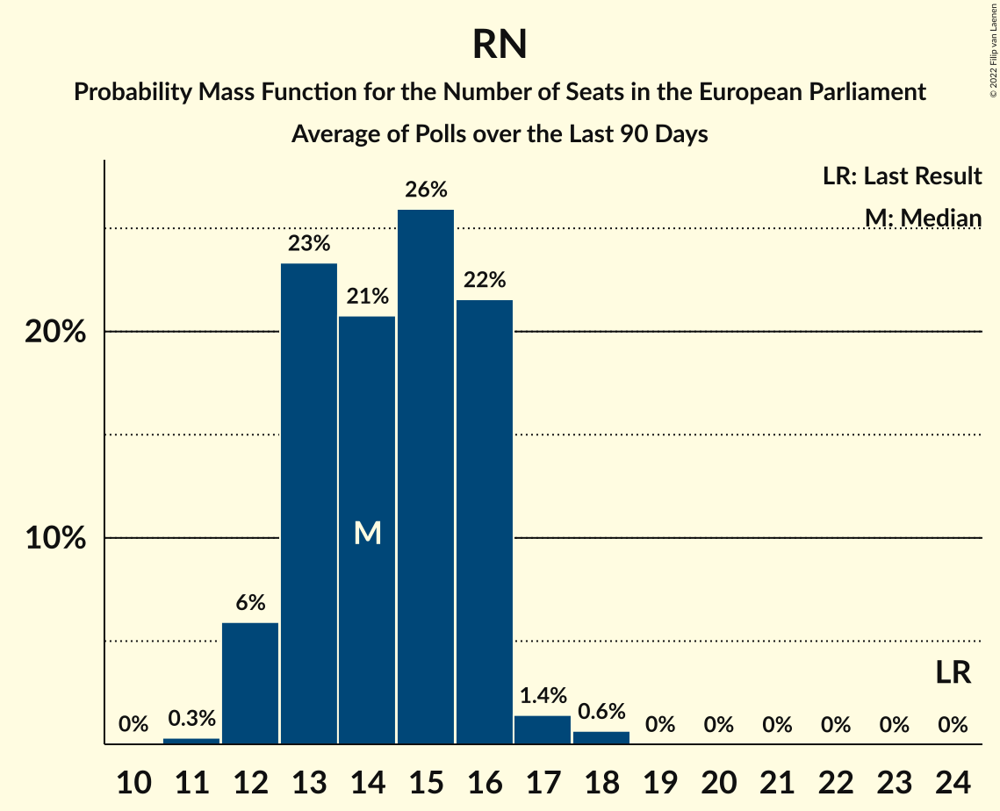

| Number of Seats | Probability | Accumulated | Special Marks |
|:---------------:|:-----------:|:-----------:|:-------------:|
| 11 | 0.6% | 100% |  |
| 12 | 6% | 99.4% |  |
| 13 | 23% | 94% |  |
| 14 | 24% | 70% | Median |
| 15 | 20% | 46% |  |
| 16 | 18% | 26% |  |
| 17 | 7% | 8% |  |
| 18 | 0.5% | 0.6% |  |
| 19 | 0.1% | 0.1% |  |
| 20 | 0% | 0% |  |
| 21 | 0% | 0% |  |
| 22 | 0% | 0% |  |
| 23 | 0% | 0% |  |
| 24 | 0% | 0% | Last Result |

### Lutte Ouvrière (*) – L’Engagement (*) – Mouvement des gilets jaunes (*) – Reconquête (*) – Résistons! (*) – Union populaire républicaine (*)

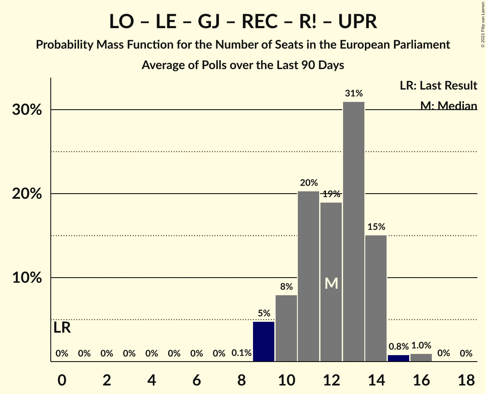

| Number of Seats | Probability | Accumulated | Special Marks |
|:---------------:|:-----------:|:-----------:|:-------------:|
| 0 | 0% | 100% | Last Result |
| 1 | 0% | 100% |  |
| 2 | 0% | 100% |  |
| 3 | 0% | 100% |  |
| 4 | 0% | 100% |  |
| 5 | 0% | 100% |  |
| 6 | 0% | 100% |  |
| 7 | 0% | 100% |  |
| 8 | 0.3% | 100% |  |
| 9 | 7% | 99.7% |  |
| 10 | 20% | 93% |  |
| 11 | 40% | 72% |  |
| 12 | 13% | 32% | Median |
| 13 | 17% | 19% |  |
| 14 | 3% | 3% |  |
| 15 | 0.1% | 0.1% |  |
| 16 | 0% | 0% |  |

### La France insoumise (GUE/NGL) – Parti communiste français (GUE/NGL) – Nouveau Parti anticapitaliste (GUE/NGL)

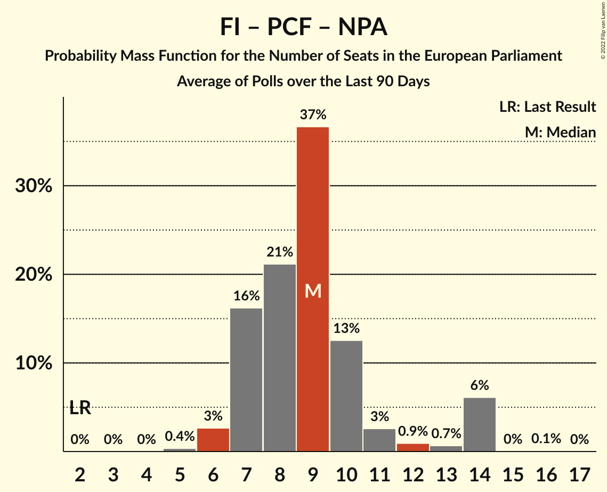

| Number of Seats | Probability | Accumulated | Special Marks |
|:---------------:|:-----------:|:-----------:|:-------------:|
| 2 | 0% | 100% | Last Result |
| 3 | 0% | 100% |  |
| 4 | 0% | 100% |  |
| 5 | 0% | 100% |  |
| 6 | 1.2% | 100% |  |
| 7 | 12% | 98.8% |  |
| 8 | 28% | 87% |  |
| 9 | 36% | 59% | Median |
| 10 | 12% | 23% |  |
| 11 | 3% | 10% |  |
| 12 | 0.9% | 8% |  |
| 13 | 0.7% | 7% |  |
| 14 | 6% | 6% |  |
| 15 | 0% | 0.1% |  |
| 16 | 0.1% | 0.1% |  |
| 17 | 0% | 0% |  |

### Europe Écologie Les Verts (Greens/EFA)

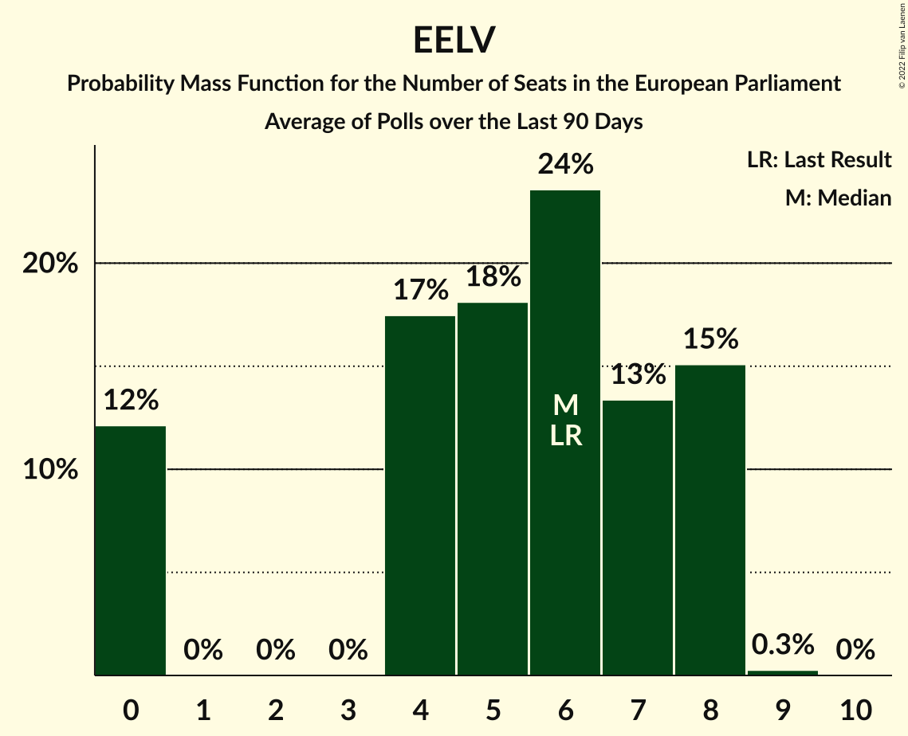

| Number of Seats | Probability | Accumulated | Special Marks |
|:---------------:|:-----------:|:-----------:|:-------------:|
| 0 | 13% | 100% |  |
| 1 | 0% | 87% |  |
| 2 | 0% | 87% |  |
| 3 | 0% | 87% |  |
| 4 | 19% | 87% |  |
| 5 | 20% | 67% | Median |
| 6 | 24% | 47% | Last Result |
| 7 | 9% | 23% |  |
| 8 | 14% | 14% |  |
| 9 | 0.2% | 0.2% |  |
| 10 | 0% | 0% |  |

### Parti socialiste (S&D) – Génération·s, le mouvement (S&D)

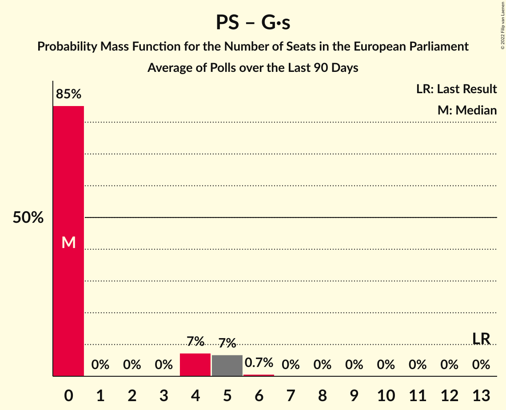

| Number of Seats | Probability | Accumulated | Special Marks |
|:---------------:|:-----------:|:-----------:|:-------------:|
| 0 | 85% | 100% | Median |
| 1 | 0% | 15% |  |
| 2 | 0% | 15% |  |
| 3 | 0% | 15% |  |
| 4 | 7% | 15% |  |
| 5 | 7% | 7% |  |
| 6 | 0.7% | 0.7% |  |
| 7 | 0% | 0% |  |
| 8 | 0% | 0% |  |
| 9 | 0% | 0% |  |
| 10 | 0% | 0% |  |
| 11 | 0% | 0% |  |
| 12 | 0% | 0% |  |
| 13 | 0% | 0% | Last Result |

### Debout la France (ECR)

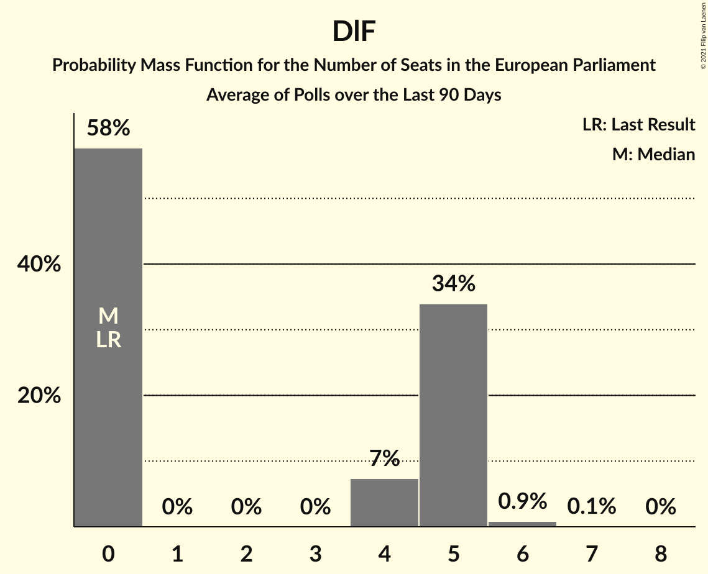

| Number of Seats | Probability | Accumulated | Special Marks |
|:---------------:|:-----------:|:-----------:|:-------------:|
| 0 | 100% | 100% | Last Result, Median |

### Les Patriotes (NI)

| Number of Seats | Probability | Accumulated | Special Marks |
|:---------------:|:-----------:|:-----------:|:-------------:|
| 0 | 100% | 100% | Last Result, Median |

## Technical Information

+ **Number of polls included in this average:** 10
+ **Lowest number of simulations done in a poll included in this average:** 0
+ **Total number of simulations done in the polls included in this average:** 9,437,184
+ **Error estimate:** 4.16%
