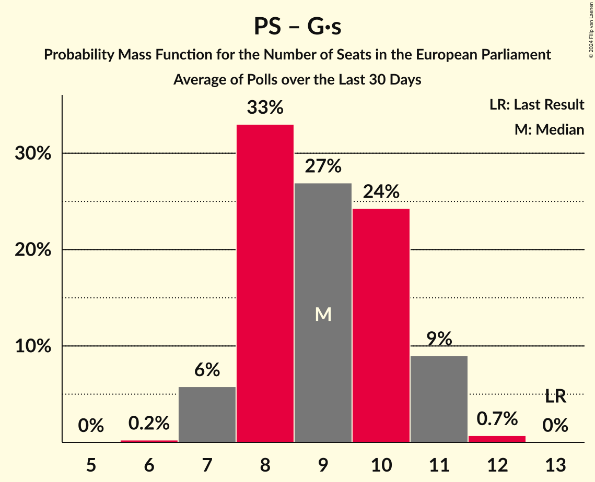

# Poll Average

<a href="#voting-intentions">Voting Intentions</a> | <a href="#seats">Seats</a> | <a href="#coalitions">Coalitions</a> | <a href="#technical-information">Technical Information</a>

## Summary

The table below lists the polls on which the average is based. They are the most recent polls (less than 90 days old) registered and analyzed so far.

| Period     | Polling firm/Commissioner(s) | RN | LR | PS | LREM–MoDem | EELV | PCF | FI | Agir–UDI | DlF | LP | UPR | NPA | G·s | R! |
|:----------:|:----------------------------:|:--:|:--:|:--:|:--:|:--:|:--:|:--:|:--:|:--:|:--:|:--:|:--:|:--:|:--:|
| 25 May 2014 | General Election | 24.9%   24 | 20.8%   20 | 14.0%   13 | 9.9%   7 | 9.0%   6 | 6.6%   1 | 6.6%   1 | 2.0%   0 | 0.0%   0 | 0.0%   0 | 0.0%   0 | 0.0%   0 | 0.0%   0 | 0.0%   0 |
| N/A | Poll Average | 18–26%   16–24 | 7–15%   7–14 | 4–8%   0–7 | 17–26%   16–26 | 5–11%   5–12 | 1–4%   0 | 6–13%   5–13 | 1–4%   0 | 4–9%   0–9 | 1–2%   0 | 0–2%   0 | 1–3%   0 | 2–6%   0–4 | 1–4%   0 |
| [20–27 February 2019](2019-02-27-OpinionWay–Tilder.html) | OpinionWay–Tilder   Les Echos and Radio Classique | 20–24%   19–20 | 13–16%   10–13 | 5–7%   5–6 | 20–24%   19–20 | 5–7%   5–6 | 1–3%   0 | 6–8%   6–7 | 1–3%   0 | 4–6%   0–5 | 1–2%   0 | 1–2%   0 | N/A   N/A | 3–5%   0 | N/A   N/A |
| [25–27 February 2019](2019-02-27-ELABE.html) | ELABE   BFMTV | 20–24%   19–24 | 11–15%   11–15 | 4–6%   0 | 20–24%   19–23 | 8–12%   10–12 | 2–4%   0 | 7–10%   6–9 | 1–3%   0 | 4–7%   0–6 | 1–2%   0 | 1–2%   0 | 1–2%   0 | 2–4%   0 | N/A   N/A |
| [22–23 February 2019](2019-02-23-HarrisInteractive.html) | Harris Interactive   LCI, Le Figaro, RTL and TF1 | 18–23%   14–19 | 10–14%   11–14 | 5–8%   0–6 | 20–25%   19–26 | 7–10%   6–8 | 1–3%   0 | 7–10%   5–8 | 1–3%   0 | 5–8%   5–7 | 1–2%   0 | 1–2%   0 | 1–3%   0 | 3–5%   0 | 1–2%   0 |
| [15–21 February 2019](2019-02-21-Ipsos.html) | Ipsos   Le Monde | 20–22%   17–20 | 11–13%   9–11 | 5–6%   4–5 | 22–24%   21 | 8–9%   7–8 | 2%   0 | 8–9%   8–9 | 2–3%   0 | 6–7%   5 | 1%   0 | 0–1%   0 | 1%   0 | 5–6%   4 | 2%   0 |
| [20–21 February 2019](2019-02-21-BVA.html) | BVA   La Tribune and RTL | 17–22%   16–20 | 8–12%   8–12 | 4–7%   0–4 | 22–28%   22–26 | 7–11%   7–9 | 1–3%   0 | 6–9%   6–7 | 1–3%   0 | 5–8%   5–7 | 1–2%   0 | 0–1%   0 | 1–2%   0 | 2–4%   0 | 1–3%   0 |
| [13–15 February 2019](2019-02-15-Ifop-Fiducial.html) | Ifop-Fiducial   CNews, Paris Match and Sud Radio | 18–22%   19–20 | 9–12%   8–10 | 5–7%   5–6 | 22–26%   22–25 | 8–11%   8–9 | 2–4%   0 | 6–9%   7 | 1–3%   0 | 5–7%   5–6 | 1–2%   0 | 0–1%   0 | 1–2%   0 | 3–5%   0 | 1–3%   0 |
| [19–20 December 2018](2018-12-20-Odoxa.html) | Odoxa   France Info | 21–28%   20–28 | 6–11%   6–10 | 5–9%   0–8 | 16–22%   16–21 | 5–9%   0–8 | 1–3%   0 | 9–14%   9–14 | 2–4%   0 | 5–9%   5–8 | 0–2%   0 | 0–2%   0 | 2–4%   0 | 2–5%   0 | 2–5%   0 |
| [7–10 December 2018](2018-12-10-Ifop.html) | Ifop   L’Opinion | 21–27%   22–26 | 9–13%   9–12 | 3–6%   0–5 | 16–21%   16–21 | 6–10%   6–9 | 2–4%   0 | 7–11%   8–11 | 2–4%   0 | 6–10%   7–9 | 1–2%   0 | 0–1%   0 | 1–2%   0 | 3–5%   0 | 2–4%   0 |
| 25 May 2014 | General Election | 24.9%   24 | 20.8%   20 | 14.0%   13 | 9.9%   7 | 9.0%   6 | 6.6%   1 | 6.6%   1 | 2.0%   0 | 0.0%   0 | 0.0%   0 | 0.0%   0 | 0.0%   0 | 0.0%   0 | 0.0%   0 |

Only polls for which at least the sample size has been published are included in the table above.

**Legend:**
+ **Top half of each row:** Voting intentions (95% confidence interval)
+ **Bottom half of each row:** Seat projections for the European Parliament (95% confidence interval)
+ **RN:** Rassemblement national (ENF)
+ **LR:** Les Républicains (EPP)
+ **PS:** Parti socialiste (S&D)
+ **LREM–MoDem:** La République en marche–Mouvement démocrate (ALDE)
+ **EELV:** Europe Écologie Les Verts (Greens/EFA)
+ **PCF:** Parti communiste français (GUE/NGL)
+ **FI:** La France insoumise (GUE/NGL)
+ **Agir–UDI:** Agir, la droite constructive–Union des démocrates et indépendants (ALDE)
+ **DlF:** Debout la France (EFDD)
+ **LP:** Les Patriotes (EFDD)
+ **UPR:** Union populaire républicaine (*)
+ **NPA:** Nouveau Parti anticapitaliste (GUE/NGL)
+ **G·s:** Génération·s, le mouvement (S&D)
+ **R!:** Résistons! (*)
+ **N/A (single party):** Party not included the published results
+ **N/A (entire row):** Calculation for this opinion poll not started yet

## Voting Intentions

### Confidence Intervals

| Party | Last Result | Median | 80% Confidence Interval | 90% Confidence Interval | 95% Confidence Interval | 99% Confidence Interval |
|:-----:|:-----------:|:------:|:-----------------------:|:-----------------------:|:-----------------------:|:-----------------------:|
| <a href="#rassemblement-national-(enf)">Rassemblement national (ENF)</a> | 24.9% | 21.3% | 19.0–24.5% |18.3–25.4% | 17.8–26.1% | 16.8–27.4% |
| <a href="#les-républicains-(epp)">Les Républicains (EPP)</a> | 20.8% | 11.5% | 8.7–13.9% |7.8–14.4% | 7.2–14.8% | 6.3–15.5% |
| <a href="#parti-socialiste-(s&d)">Parti socialiste (S&D)</a> | 14.0% | 5.6% | 4.4–7.0% |4.1–7.6% | 3.8–8.1% | 3.4–9.1% |
| <a href="#la-république-en-marche–mouvement-démocrate-(alde)">La République en marche–Mouvement démocrate (ALDE)</a> | 9.9% | 22.3% | 18.1–24.9% |17.3–25.7% | 16.7–26.3% | 15.7–27.6% |
| <a href="#europe-écologie-les-verts-(greens/efa)">Europe Écologie Les Verts (Greens/EFA)</a> | 9.0% | 8.4% | 6.0–10.0% |5.7–10.5% | 5.4–10.9% | 4.9–11.7% |
| <a href="#parti-communiste-français-(gue/ngl)">Parti communiste français (GUE/NGL)</a> | 6.6% | 2.2% | 1.7–3.1% |1.5–3.4% | 1.4–3.6% | 1.2–4.0% |
| <a href="#la-france-insoumise-(gue/ngl)">La France insoumise (GUE/NGL)</a> | 6.6% | 8.2% | 6.8–10.8% |6.5–12.0% | 6.3–12.8% | 5.9–14.1% |
| <a href="#agir,-la-droite-constructive–union-des-démocrates-et-indépendants-(alde)">Agir, la droite constructive–Union des démocrates et indépendants (ALDE)</a> | 2.0% | 2.3% | 1.7–3.1% |1.5–3.4% | 1.4–3.7% | 1.2–4.3% |
| <a href="#debout-la-france-(efdd)">Debout la France (EFDD)</a> | 0.0% | 6.2% | 5.0–7.9% |4.7–8.5% | 4.5–9.0% | 4.2–9.8% |
| <a href="#les-patriotes-(efdd)">Les Patriotes (EFDD)</a> | 0.0% | 1.1% | 0.7–1.6% |0.6–1.8% | 0.6–2.0% | 0.4–2.4% |
| <a href="#union-populaire-républicaine-(*)">Union populaire républicaine (*)</a> | 0.0% | 0.8% | 0.4–1.3% |0.4–1.5% | 0.3–1.7% | 0.2–2.1% |
| <a href="#nouveau-parti-anticapitaliste-(gue/ngl)">Nouveau Parti anticapitaliste (GUE/NGL)</a> | 0.0% | 1.3% | 0.8–2.6% |0.7–2.9% | 0.6–3.3% | 0.5–4.0% |
| <a href="#génération·s,-le-mouvement-(s&d)">Génération·s, le mouvement (S&D)</a> | 0.0% | 3.7% | 2.7–5.3% |2.5–5.6% | 2.3–5.8% | 1.9–6.2% |
| <a href="#résistons!-(*)">Résistons! (*)</a> | 0.0% | 2.0% | 1.1–3.2% |0.9–3.6% | 0.8–4.0% | 0.6–4.7% |

### Rassemblement national (ENF)

*For a full overview of the results for this party, see the [Rassemblement national (ENF)](party-rassemblementnationalenf.html) page.*

| Voting Intentions | Probability | Accumulated | Special Marks |
|:-----------------:|:-----------:|:-----------:|:-------------:|
| 14.5–15.5% | 0% | 100% |  |
| 15.5–16.5% | 0.3% | 100% |  |
| 16.5–17.5% | 1.4% | 99.7% |  |
| 17.5–18.5% | 5% | 98% |  |
| 18.5–19.5% | 10% | 93% |  |
| 19.5–20.5% | 16% | 83% |  |
| 20.5–21.5% | 21% | 67% | Median |
| 21.5–22.5% | 17% | 46% |  |
| 22.5–23.5% | 11% | 29% |  |
| 23.5–24.5% | 8% | 17% |  |
| 24.5–25.5% | 5% | 10% | Last Result |
| 25.5–26.5% | 3% | 4% |  |
| 26.5–27.5% | 1.1% | 1.5% |  |
| 27.5–28.5% | 0.3% | 0.4% |  |
| 28.5–29.5% | 0.1% | 0.1% |  |
| 29.5–30.5% | 0% | 0% |  |

### Les Républicains (EPP)

*For a full overview of the results for this party, see the [Les Républicains (EPP)](party-lesrépublicainsepp.html) page.*

| Voting Intentions | Probability | Accumulated | Special Marks |
|:-----------------:|:-----------:|:-----------:|:-------------:|
| 4.5–5.5% | 0.1% | 100% |  |
| 5.5–6.5% | 0.7% | 99.9% |  |
| 6.5–7.5% | 3% | 99.2% |  |
| 7.5–8.5% | 5% | 96% |  |
| 8.5–9.5% | 10% | 91% |  |
| 9.5–10.5% | 15% | 81% |  |
| 10.5–11.5% | 17% | 66% | Median |
| 11.5–12.5% | 21% | 49% |  |
| 12.5–13.5% | 14% | 28% |  |
| 13.5–14.5% | 10% | 14% |  |
| 14.5–15.5% | 4% | 4% |  |
| 15.5–16.5% | 0.4% | 0.4% |  |
| 16.5–17.5% | 0% | 0% |  |
| 17.5–18.5% | 0% | 0% |  |
| 18.5–19.5% | 0% | 0% |  |
| 19.5–20.5% | 0% | 0% |  |
| 20.5–21.5% | 0% | 0% | Last Result |

### Parti socialiste (S&D)

*For a full overview of the results for this party, see the [Parti socialiste (S&D)](party-partisocialistesd.html) page.*

| Voting Intentions | Probability | Accumulated | Special Marks |
|:-----------------:|:-----------:|:-----------:|:-------------:|
| 1.5–2.5% | 0% | 100% |  |
| 2.5–3.5% | 0.9% | 100% |  |
| 3.5–4.5% | 12% | 99.1% |  |
| 4.5–5.5% | 33% | 88% |  |
| 5.5–6.5% | 37% | 54% | Median |
| 6.5–7.5% | 12% | 17% |  |
| 7.5–8.5% | 4% | 5% |  |
| 8.5–9.5% | 1.1% | 1.3% |  |
| 9.5–10.5% | 0.2% | 0.2% |  |
| 10.5–11.5% | 0% | 0% |  |
| 11.5–12.5% | 0% | 0% |  |
| 12.5–13.5% | 0% | 0% |  |
| 13.5–14.5% | 0% | 0% | Last Result |

### La République en marche–Mouvement démocrate (ALDE)

*For a full overview of the results for this party, see the [La République en marche–Mouvement démocrate (ALDE)](party-larépubliqueenmarche–mouvementdémocratealde.html) page.*

| Voting Intentions | Probability | Accumulated | Special Marks |
|:-----------------:|:-----------:|:-----------:|:-------------:|
| 9.5–10.5% | 0% | 100% | Last Result |
| 10.5–11.5% | 0% | 100% |  |
| 11.5–12.5% | 0% | 100% |  |
| 12.5–13.5% | 0% | 100% |  |
| 13.5–14.5% | 0% | 100% |  |
| 14.5–15.5% | 0.3% | 100% |  |
| 15.5–16.5% | 2% | 99.6% |  |
| 16.5–17.5% | 4% | 98% |  |
| 17.5–18.5% | 7% | 94% |  |
| 18.5–19.5% | 6% | 87% |  |
| 19.5–20.5% | 6% | 81% |  |
| 20.5–21.5% | 11% | 74% |  |
| 21.5–22.5% | 18% | 63% | Median |
| 22.5–23.5% | 20% | 45% |  |
| 23.5–24.5% | 12% | 25% |  |
| 24.5–25.5% | 7% | 13% |  |
| 25.5–26.5% | 4% | 6% |  |
| 26.5–27.5% | 1.5% | 2% |  |
| 27.5–28.5% | 0.4% | 0.5% |  |
| 28.5–29.5% | 0.1% | 0.1% |  |
| 29.5–30.5% | 0% | 0% |  |

### Europe Écologie Les Verts (Greens/EFA)

*For a full overview of the results for this party, see the [Europe Écologie Les Verts (Greens/EFA)](party-europeécologielesvertsgreensefa.html) page.*

| Voting Intentions | Probability | Accumulated | Special Marks |
|:-----------------:|:-----------:|:-----------:|:-------------:|
| 2.5–3.5% | 0% | 100% |  |
| 3.5–4.5% | 0.1% | 100% |  |
| 4.5–5.5% | 4% | 99.9% |  |
| 5.5–6.5% | 14% | 96% |  |
| 6.5–7.5% | 13% | 83% |  |
| 7.5–8.5% | 26% | 70% | Median |
| 8.5–9.5% | 26% | 44% | Last Result |
| 9.5–10.5% | 13% | 17% |  |
| 10.5–11.5% | 4% | 5% |  |
| 11.5–12.5% | 0.7% | 0.7% |  |
| 12.5–13.5% | 0% | 0% |  |
| 13.5–14.5% | 0% | 0% |  |

### Parti communiste français (GUE/NGL)

*For a full overview of the results for this party, see the [Parti communiste français (GUE/NGL)](party-particommunistefrançaisguengl.html) page.*

| Voting Intentions | Probability | Accumulated | Special Marks |
|:-----------------:|:-----------:|:-----------:|:-------------:|
| 0.0–0.5% | 0% | 100% |  |
| 0.5–1.5% | 5% | 100% |  |
| 1.5–2.5% | 63% | 95% | Median |
| 2.5–3.5% | 28% | 31% |  |
| 3.5–4.5% | 3% | 3% |  |
| 4.5–5.5% | 0% | 0% |  |
| 5.5–6.5% | 0% | 0% |  |
| 6.5–7.5% | 0% | 0% | Last Result |

### La France insoumise (GUE/NGL)

*For a full overview of the results for this party, see the [La France insoumise (GUE/NGL)](party-lafranceinsoumiseguengl.html) page.*

| Voting Intentions | Probability | Accumulated | Special Marks |
|:-----------------:|:-----------:|:-----------:|:-------------:|
| 3.5–4.5% | 0% | 100% |  |
| 4.5–5.5% | 0.1% | 100% |  |
| 5.5–6.5% | 5% | 99.9% |  |
| 6.5–7.5% | 25% | 95% | Last Result |
| 7.5–8.5% | 34% | 70% | Median |
| 8.5–9.5% | 20% | 37% |  |
| 9.5–10.5% | 6% | 17% |  |
| 10.5–11.5% | 4% | 11% |  |
| 11.5–12.5% | 4% | 7% |  |
| 12.5–13.5% | 2% | 3% |  |
| 13.5–14.5% | 0.8% | 1.1% |  |
| 14.5–15.5% | 0.2% | 0.2% |  |
| 15.5–16.5% | 0% | 0% |  |

### Agir, la droite constructive–Union des démocrates et indépendants (ALDE)

*For a full overview of the results for this party, see the [Agir, la droite constructive–Union des démocrates et indépendants (ALDE)](party-agirladroiteconstructive–uniondesdémocratesetindépendantsalde.html) page.*

| Voting Intentions | Probability | Accumulated | Special Marks |
|:-----------------:|:-----------:|:-----------:|:-------------:|
| 0.0–0.5% | 0% | 100% |  |
| 0.5–1.5% | 6% | 100% |  |
| 1.5–2.5% | 64% | 94% | Last Result, Median |
| 2.5–3.5% | 27% | 30% |  |
| 3.5–4.5% | 4% | 4% |  |
| 4.5–5.5% | 0.2% | 0.2% |  |
| 5.5–6.5% | 0% | 0% |  |

### Génération·s, le mouvement (S&D)

*For a full overview of the results for this party, see the [Génération·s, le mouvement (S&D)](party-génération·slemouvementsd.html) page.*

| Voting Intentions | Probability | Accumulated | Special Marks |
|:-----------------:|:-----------:|:-----------:|:-------------:|
| 0.0–0.5% | 0% | 100% | Last Result |
| 0.5–1.5% | 0% | 100% |  |
| 1.5–2.5% | 7% | 100% |  |
| 2.5–3.5% | 38% | 93% |  |
| 3.5–4.5% | 36% | 55% | Median |
| 4.5–5.5% | 13% | 19% |  |
| 5.5–6.5% | 6% | 6% |  |
| 6.5–7.5% | 0% | 0% |  |
| 7.5–8.5% | 0% | 0% |  |

### Debout la France (EFDD)

*For a full overview of the results for this party, see the [Debout la France (EFDD)](party-deboutlafranceefdd.html) page.*

| Voting Intentions | Probability | Accumulated | Special Marks |
|:-----------------:|:-----------:|:-----------:|:-------------:|
| 0.0–0.5% | 0% | 100% | Last Result |
| 0.5–1.5% | 0% | 100% |  |
| 1.5–2.5% | 0% | 100% |  |
| 2.5–3.5% | 0% | 100% |  |
| 3.5–4.5% | 3% | 100% |  |
| 4.5–5.5% | 23% | 97% |  |
| 5.5–6.5% | 37% | 74% | Median |
| 6.5–7.5% | 23% | 37% |  |
| 7.5–8.5% | 10% | 15% |  |
| 8.5–9.5% | 4% | 5% |  |
| 9.5–10.5% | 0.8% | 0.9% |  |
| 10.5–11.5% | 0.1% | 0.1% |  |
| 11.5–12.5% | 0% | 0% |  |

### Les Patriotes (EFDD)

*For a full overview of the results for this party, see the [Les Patriotes (EFDD)](party-lespatriotesefdd.html) page.*

| Voting Intentions | Probability | Accumulated | Special Marks |
|:-----------------:|:-----------:|:-----------:|:-------------:|
| 0.0–0.5% | 2% | 100% | Last Result |
| 0.5–1.5% | 85% | 98% | Median |
| 1.5–2.5% | 13% | 13% |  |
| 2.5–3.5% | 0.2% | 0.2% |  |
| 3.5–4.5% | 0% | 0% |  |

### Union populaire républicaine (*)

*For a full overview of the results for this party, see the [Union populaire républicaine (*)](party-unionpopulairerépublicaine.html) page.*

| Voting Intentions | Probability | Accumulated | Special Marks |
|:-----------------:|:-----------:|:-----------:|:-------------:|
| 0.0–0.5% | 25% | 100% | Last Result |
| 0.5–1.5% | 70% | 75% | Median |
| 1.5–2.5% | 5% | 5% |  |
| 2.5–3.5% | 0.1% | 0.1% |  |
| 3.5–4.5% | 0% | 0% |  |

### Nouveau Parti anticapitaliste (GUE/NGL)

*For a full overview of the results for this party, see the [Nouveau Parti anticapitaliste (GUE/NGL)](party-nouveaupartianticapitalisteguengl.html) page.*

| Voting Intentions | Probability | Accumulated | Special Marks |
|:-----------------:|:-----------:|:-----------:|:-------------:|
| 0.0–0.5% | 0.9% | 100% | Last Result |
| 0.5–1.5% | 62% | 99.1% | Median |
| 1.5–2.5% | 27% | 37% |  |
| 2.5–3.5% | 9% | 10% |  |
| 3.5–4.5% | 1.3% | 1.4% |  |
| 4.5–5.5% | 0.1% | 0.1% |  |
| 5.5–6.5% | 0% | 0% |  |

### Résistons! (*)

*For a full overview of the results for this party, see the [Résistons! (*)](party-résistons.html) page.*

| Voting Intentions | Probability | Accumulated | Special Marks |
|:-----------------:|:-----------:|:-----------:|:-------------:|
| 0.0–0.5% | 0.3% | 100% | Last Result |
| 0.5–1.5% | 25% | 99.7% |  |
| 1.5–2.5% | 51% | 75% | Median |
| 2.5–3.5% | 18% | 24% |  |
| 3.5–4.5% | 5% | 5% |  |
| 4.5–5.5% | 0.6% | 0.6% |  |
| 5.5–6.5% | 0% | 0% |  |

## Seats

### Confidence Intervals

| Party | Last Result | Median | 80% Confidence Interval | 90% Confidence Interval | 95% Confidence Interval | 99% Confidence Interval |
|:-----:|:-----------:|:------:|:-----------------------:|:-----------------------:|:-----------------------:|:-----------------------:|
| <a href="#rassemblement-national-(enf)">Rassemblement national (ENF)</a> | 24 | 19 | 17–23 |16–24 | 16–24 | 14–28 |
| <a href="#les-républicains-(epp)">Les Républicains (EPP)</a> | 20 | 10 | 8–13 |7–13 | 7–14 | 6–15 |
| <a href="#parti-socialiste-(s&d)">Parti socialiste (S&D)</a> | 13 | 5 | 0–6 |0–7 | 0–7 | 0–8 |
| <a href="#la-république-en-marche–mouvement-démocrate-(alde)">La République en marche–Mouvement démocrate (ALDE)</a> | 7 | 21 | 17–24 |16–26 | 16–26 | 16–26 |
| <a href="#europe-écologie-les-verts-(greens/efa)">Europe Écologie Les Verts (Greens/EFA)</a> | 6 | 8 | 5–11 |5–12 | 5–12 | 0–12 |
| <a href="#parti-communiste-français-(gue/ngl)">Parti communiste français (GUE/NGL)</a> | 1 | 0 | 0 |0 | 0 | 0 |
| <a href="#la-france-insoumise-(gue/ngl)">La France insoumise (GUE/NGL)</a> | 1 | 7 | 6–10 |6–11 | 5–13 | 5–14 |
| <a href="#agir,-la-droite-constructive–union-des-démocrates-et-indépendants-(alde)">Agir, la droite constructive–Union des démocrates et indépendants (ALDE)</a> | 0 | 0 | 0 |0 | 0 | 0 |
| <a href="#debout-la-france-(efdd)">Debout la France (EFDD)</a> | 0 | 6 | 0–7 |0–8 | 0–9 | 0–9 |
| <a href="#les-patriotes-(efdd)">Les Patriotes (EFDD)</a> | 0 | 0 | 0 |0 | 0 | 0 |
| <a href="#union-populaire-républicaine-(*)">Union populaire républicaine (*)</a> | 0 | 0 | 0 |0 | 0 | 0 |
| <a href="#nouveau-parti-anticapitaliste-(gue/ngl)">Nouveau Parti anticapitaliste (GUE/NGL)</a> | 0 | 0 | 0 |0 | 0 | 0 |
| <a href="#génération·s,-le-mouvement-(s&d)">Génération·s, le mouvement (S&D)</a> | 0 | 0 | 0–4 |0–4 | 0–4 | 0–4 |
| <a href="#résistons!-(*)">Résistons! (*)</a> | 0 | 0 | 0 |0 | 0 | 0 |

### Rassemblement national (ENF)

*For a full overview of the results for this party, see the [Rassemblement national (ENF)](party-rassemblementnationalenf.html) page.*

| Number of Seats | Probability | Accumulated | Special Marks |
|:---------------:|:-----------:|:-----------:|:-------------:|
| 14 | 0.8% | 100% |  |
| 15 | 0% | 99.2% |  |
| 16 | 8% | 99.2% |  |
| 17 | 13% | 91% |  |
| 18 | 6% | 79% |  |
| 19 | 24% | 73% | Median |
| 20 | 21% | 49% |  |
| 21 | 1.3% | 28% |  |
| 22 | 3% | 26% |  |
| 23 | 15% | 23% |  |
| 24 | 6% | 8% | Last Result |
| 25 | 0.6% | 2% |  |
| 26 | 0.8% | 2% |  |
| 27 | 0.2% | 0.7% |  |
| 28 | 0.6% | 0.6% |  |
| 29 | 0% | 0% |  |

### Les Républicains (EPP)

*For a full overview of the results for this party, see the [Les Républicains (EPP)](party-lesrépublicainsepp.html) page.*

| Number of Seats | Probability | Accumulated | Special Marks |
|:---------------:|:-----------:|:-----------:|:-------------:|
| 5 | 0.1% | 100% |  |
| 6 | 1.1% | 99.9% |  |
| 7 | 6% | 98.8% |  |
| 8 | 7% | 93% |  |
| 9 | 12% | 86% |  |
| 10 | 29% | 75% | Median |
| 11 | 17% | 45% |  |
| 12 | 5% | 28% |  |
| 13 | 21% | 23% |  |
| 14 | 0.8% | 3% |  |
| 15 | 2% | 2% |  |
| 16 | 0.1% | 0.1% |  |
| 17 | 0% | 0% |  |
| 18 | 0% | 0% |  |
| 19 | 0% | 0% |  |
| 20 | 0% | 0% | Last Result |

### Parti socialiste (S&D)

*For a full overview of the results for this party, see the [Parti socialiste (S&D)](party-partisocialistesd.html) page.*

| Number of Seats | Probability | Accumulated | Special Marks |
|:---------------:|:-----------:|:-----------:|:-------------:|
| 0 | 30% | 100% |  |
| 1 | 0% | 70% |  |
| 2 | 0% | 70% |  |
| 3 | 0% | 70% |  |
| 4 | 9% | 70% |  |
| 5 | 35% | 60% | Median |
| 6 | 19% | 25% |  |
| 7 | 5% | 6% |  |
| 8 | 1.2% | 1.4% |  |
| 9 | 0.2% | 0.2% |  |
| 10 | 0% | 0% |  |
| 11 | 0% | 0% |  |
| 12 | 0% | 0% |  |
| 13 | 0% | 0% | Last Result |

### La République en marche–Mouvement démocrate (ALDE)

*For a full overview of the results for this party, see the [La République en marche–Mouvement démocrate (ALDE)](party-larépubliqueenmarche–mouvementdémocratealde.html) page.*

| Number of Seats | Probability | Accumulated | Special Marks |
|:---------------:|:-----------:|:-----------:|:-------------:|
| 7 | 0% | 100% | Last Result |
| 8 | 0% | 100% |  |
| 9 | 0% | 100% |  |
| 10 | 0% | 100% |  |
| 11 | 0% | 100% |  |
| 12 | 0% | 100% |  |
| 13 | 0% | 100% |  |
| 14 | 0.1% | 100% |  |
| 15 | 0.1% | 99.9% |  |
| 16 | 9% | 99.8% |  |
| 17 | 3% | 90% |  |
| 18 | 4% | 88% |  |
| 19 | 16% | 84% |  |
| 20 | 11% | 67% |  |
| 21 | 15% | 56% | Median |
| 22 | 16% | 41% |  |
| 23 | 12% | 24% |  |
| 24 | 5% | 12% |  |
| 25 | 0.1% | 7% |  |
| 26 | 7% | 7% |  |
| 27 | 0% | 0% |  |

### Europe Écologie Les Verts (Greens/EFA)

*For a full overview of the results for this party, see the [Europe Écologie Les Verts (Greens/EFA)](party-europeécologielesvertsgreensefa.html) page.*

| Number of Seats | Probability | Accumulated | Special Marks |
|:---------------:|:-----------:|:-----------:|:-------------:|
| 0 | 0.7% | 100% |  |
| 1 | 0% | 99.3% |  |
| 2 | 0% | 99.3% |  |
| 3 | 0% | 99.3% |  |
| 4 | 0% | 99.3% |  |
| 5 | 13% | 99.2% |  |
| 6 | 8% | 87% | Last Result |
| 7 | 22% | 78% |  |
| 8 | 23% | 56% | Median |
| 9 | 21% | 34% |  |
| 10 | 0.5% | 13% |  |
| 11 | 3% | 12% |  |
| 12 | 9% | 9% |  |
| 13 | 0% | 0% |  |

### Parti communiste français (GUE/NGL)

*For a full overview of the results for this party, see the [Parti communiste français (GUE/NGL)](party-particommunistefrançaisguengl.html) page.*

| Number of Seats | Probability | Accumulated | Special Marks |
|:---------------:|:-----------:|:-----------:|:-------------:|
| 0 | 100% | 100% | Median |
| 1 | 0% | 0% | Last Result |

### La France insoumise (GUE/NGL)

*For a full overview of the results for this party, see the [La France insoumise (GUE/NGL)](party-lafranceinsoumiseguengl.html) page.*

| Number of Seats | Probability | Accumulated | Special Marks |
|:---------------:|:-----------:|:-----------:|:-------------:|
| 1 | 0% | 100% | Last Result |
| 2 | 0% | 100% |  |
| 3 | 0% | 100% |  |
| 4 | 0% | 100% |  |
| 5 | 3% | 100% |  |
| 6 | 14% | 97% |  |
| 7 | 44% | 83% | Median |
| 8 | 11% | 39% |  |
| 9 | 15% | 28% |  |
| 10 | 5% | 13% |  |
| 11 | 3% | 8% |  |
| 12 | 0.4% | 5% |  |
| 13 | 3% | 4% |  |
| 14 | 2% | 2% |  |
| 15 | 0% | 0% |  |

### Agir, la droite constructive–Union des démocrates et indépendants (ALDE)

*For a full overview of the results for this party, see the [Agir, la droite constructive–Union des démocrates et indépendants (ALDE)](party-agirladroiteconstructive–uniondesdémocratesetindépendantsalde.html) page.*

| Number of Seats | Probability | Accumulated | Special Marks |
|:---------------:|:-----------:|:-----------:|:-------------:|
| 0 | 100% | 100% | Last Result, Median |

### Génération·s, le mouvement (S&D)

*For a full overview of the results for this party, see the [Génération·s, le mouvement (S&D)](party-génération·slemouvementsd.html) page.*

| Number of Seats | Probability | Accumulated | Special Marks |
|:---------------:|:-----------:|:-----------:|:-------------:|
| 0 | 87% | 100% | Last Result, Median |
| 1 | 0% | 13% |  |
| 2 | 0% | 13% |  |
| 3 | 0% | 13% |  |
| 4 | 12% | 13% |  |
| 5 | 0.3% | 0.3% |  |
| 6 | 0% | 0% |  |

### Debout la France (EFDD)

*For a full overview of the results for this party, see the [Debout la France (EFDD)](party-deboutlafranceefdd.html) page.*

| Number of Seats | Probability | Accumulated | Special Marks |
|:---------------:|:-----------:|:-----------:|:-------------:|
| 0 | 12% | 100% | Last Result |
| 1 | 0% | 88% |  |
| 2 | 0% | 88% |  |
| 3 | 0% | 88% |  |
| 4 | 0% | 88% |  |
| 5 | 32% | 88% |  |
| 6 | 29% | 56% | Median |
| 7 | 18% | 27% |  |
| 8 | 6% | 8% |  |
| 9 | 3% | 3% |  |
| 10 | 0% | 0.1% |  |
| 11 | 0% | 0% |  |

### Les Patriotes (EFDD)

*For a full overview of the results for this party, see the [Les Patriotes (EFDD)](party-lespatriotesefdd.html) page.*

| Number of Seats | Probability | Accumulated | Special Marks |
|:---------------:|:-----------:|:-----------:|:-------------:|
| 0 | 100% | 100% | Last Result, Median |

### Union populaire républicaine (*)

*For a full overview of the results for this party, see the [Union populaire républicaine (*)](party-unionpopulairerépublicaine.html) page.*

| Number of Seats | Probability | Accumulated | Special Marks |
|:---------------:|:-----------:|:-----------:|:-------------:|
| 0 | 100% | 100% | Last Result, Median |

### Nouveau Parti anticapitaliste (GUE/NGL)

*For a full overview of the results for this party, see the [Nouveau Parti anticapitaliste (GUE/NGL)](party-nouveaupartianticapitalisteguengl.html) page.*

| Number of Seats | Probability | Accumulated | Special Marks |
|:---------------:|:-----------:|:-----------:|:-------------:|
| 0 | 100% | 100% | Last Result, Median |

### Résistons! (*)

*For a full overview of the results for this party, see the [Résistons! (*)](party-résistons.html) page.*

| Number of Seats | Probability | Accumulated | Special Marks |
|:---------------:|:-----------:|:-----------:|:-------------:|
| 0 | 99.8% | 100% | Last Result, Median |
| 1 | 0% | 0.2% |  |
| 2 | 0% | 0.2% |  |
| 3 | 0% | 0.2% |  |
| 4 | 0% | 0.2% |  |
| 5 | 0.2% | 0.2% |  |
| 6 | 0% | 0% |  |

## Coalitions

### Confidence Intervals

| Coalition | Last Result | Median | Majority? | 80% Confidence Interval | 90% Confidence Interval | 95% Confidence Interval | 99% Confidence Interval |
|:---------:|:-----------:|:------:|:---------:|:-----------------------:|:-----------------------:|:-----------------------:|:-----------------------:|
| La République en marche–Mouvement démocrate (ALDE) – Agir, la droite constructive–Union des démocrates et indépendants (ALDE) | 7 | 21 | 0% | 17–24 | 16–26 | 16–26 | 16–26 |
| Rassemblement national (ENF) | 24 | 19 | 0% | 17–23 | 16–24 | 16–24 | 14–28 |
| Les Républicains (EPP) | 20 | 10 | 0% | 8–13 | 7–13 | 7–14 | 6–15 |
| La France insoumise (GUE/NGL) – Parti communiste français (GUE/NGL) – Nouveau Parti anticapitaliste (GUE/NGL) | 2 | 7 | 0% | 6–10 | 6–11 | 5–13 | 5–14 |
| Europe Écologie Les Verts (Greens/EFA) | 6 | 8 | 0% | 5–11 | 5–12 | 5–12 | 0–12 |
| Debout la France (EFDD) – Les Patriotes (EFDD) | 0 | 6 | 0% | 0–7 | 0–8 | 0–9 | 0–9 |
| Parti socialiste (S&D) – Génération·s, le mouvement (S&D) | 13 | 5 | 0% | 0–8 | 0–9 | 0–9 | 0–9 |
| Résistons! (*) – Union populaire républicaine (*) | 0 | 0 | 0% | 0 | 0 | 0 | 0 |

### La République en marche–Mouvement démocrate (ALDE) – Agir, la droite constructive–Union des démocrates et indépendants (ALDE)

| Number of Seats | Probability | Accumulated | Special Marks |
|:---------------:|:-----------:|:-----------:|:-------------:|
| 7 | 0% | 100% | Last Result |
| 8 | 0% | 100% |  |
| 9 | 0% | 100% |  |
| 10 | 0% | 100% |  |
| 11 | 0% | 100% |  |
| 12 | 0% | 100% |  |
| 13 | 0% | 100% |  |
| 14 | 0.1% | 100% |  |
| 15 | 0.1% | 99.9% |  |
| 16 | 9% | 99.8% |  |
| 17 | 3% | 90% |  |
| 18 | 4% | 88% |  |
| 19 | 16% | 84% |  |
| 20 | 11% | 67% |  |
| 21 | 15% | 56% | Median |
| 22 | 16% | 41% |  |
| 23 | 12% | 24% |  |
| 24 | 5% | 12% |  |
| 25 | 0.1% | 7% |  |
| 26 | 7% | 7% |  |
| 27 | 0% | 0% |  |

### Rassemblement national (ENF)

| Number of Seats | Probability | Accumulated | Special Marks |
|:---------------:|:-----------:|:-----------:|:-------------:|
| 14 | 0.8% | 100% |  |
| 15 | 0% | 99.2% |  |
| 16 | 8% | 99.2% |  |
| 17 | 13% | 91% |  |
| 18 | 6% | 79% |  |
| 19 | 24% | 73% | Median |
| 20 | 21% | 49% |  |
| 21 | 1.3% | 28% |  |
| 22 | 3% | 26% |  |
| 23 | 15% | 23% |  |
| 24 | 6% | 8% | Last Result |
| 25 | 0.6% | 2% |  |
| 26 | 0.8% | 2% |  |
| 27 | 0.2% | 0.7% |  |
| 28 | 0.6% | 0.6% |  |
| 29 | 0% | 0% |  |

### Les Républicains (EPP)

| Number of Seats | Probability | Accumulated | Special Marks |
|:---------------:|:-----------:|:-----------:|:-------------:|
| 5 | 0.1% | 100% |  |
| 6 | 1.1% | 99.9% |  |
| 7 | 6% | 98.8% |  |
| 8 | 7% | 93% |  |
| 9 | 12% | 86% |  |
| 10 | 29% | 75% | Median |
| 11 | 17% | 45% |  |
| 12 | 5% | 28% |  |
| 13 | 21% | 23% |  |
| 14 | 0.8% | 3% |  |
| 15 | 2% | 2% |  |
| 16 | 0.1% | 0.1% |  |
| 17 | 0% | 0% |  |
| 18 | 0% | 0% |  |
| 19 | 0% | 0% |  |
| 20 | 0% | 0% | Last Result |

### La France insoumise (GUE/NGL) – Parti communiste français (GUE/NGL) – Nouveau Parti anticapitaliste (GUE/NGL)

| Number of Seats | Probability | Accumulated | Special Marks |
|:---------------:|:-----------:|:-----------:|:-------------:|
| 2 | 0% | 100% | Last Result |
| 3 | 0% | 100% |  |
| 4 | 0% | 100% |  |
| 5 | 3% | 100% |  |
| 6 | 14% | 97% |  |
| 7 | 44% | 83% | Median |
| 8 | 11% | 39% |  |
| 9 | 15% | 28% |  |
| 10 | 5% | 13% |  |
| 11 | 3% | 8% |  |
| 12 | 0.4% | 5% |  |
| 13 | 3% | 4% |  |
| 14 | 2% | 2% |  |
| 15 | 0% | 0% |  |

### Europe Écologie Les Verts (Greens/EFA)

| Number of Seats | Probability | Accumulated | Special Marks |
|:---------------:|:-----------:|:-----------:|:-------------:|
| 0 | 0.7% | 100% |  |
| 1 | 0% | 99.3% |  |
| 2 | 0% | 99.3% |  |
| 3 | 0% | 99.3% |  |
| 4 | 0% | 99.3% |  |
| 5 | 13% | 99.2% |  |
| 6 | 8% | 87% | Last Result |
| 7 | 22% | 78% |  |
| 8 | 23% | 56% | Median |
| 9 | 21% | 34% |  |
| 10 | 0.5% | 13% |  |
| 11 | 3% | 12% |  |
| 12 | 9% | 9% |  |
| 13 | 0% | 0% |  |

### Debout la France (EFDD) – Les Patriotes (EFDD)

| Number of Seats | Probability | Accumulated | Special Marks |
|:---------------:|:-----------:|:-----------:|:-------------:|
| 0 | 12% | 100% | Last Result |
| 1 | 0% | 88% |  |
| 2 | 0% | 88% |  |
| 3 | 0% | 88% |  |
| 4 | 0% | 88% |  |
| 5 | 32% | 88% |  |
| 6 | 29% | 56% | Median |
| 7 | 18% | 27% |  |
| 8 | 6% | 8% |  |
| 9 | 3% | 3% |  |
| 10 | 0% | 0.1% |  |
| 11 | 0% | 0% |  |

### Parti socialiste (S&D) – Génération·s, le mouvement (S&D)

| Number of Seats | Probability | Accumulated | Special Marks |
|:---------------:|:-----------:|:-----------:|:-------------:|
| 0 | 30% | 100% |  |
| 1 | 0% | 70% |  |
| 2 | 0% | 70% |  |
| 3 | 0% | 70% |  |
| 4 | 2% | 70% |  |
| 5 | 30% | 68% | Median |
| 6 | 19% | 38% |  |
| 7 | 5% | 19% |  |
| 8 | 9% | 14% |  |
| 9 | 5% | 5% |  |
| 10 | 0.1% | 0.2% |  |
| 11 | 0% | 0.1% |  |
| 12 | 0% | 0% |  |
| 13 | 0% | 0% | Last Result |

### Résistons! (*) – Union populaire républicaine (*)

| Number of Seats | Probability | Accumulated | Special Marks |
|:---------------:|:-----------:|:-----------:|:-------------:|
| 0 | 99.8% | 100% | Last Result, Median |
| 1 | 0% | 0.2% |  |
| 2 | 0% | 0.2% |  |
| 3 | 0% | 0.2% |  |
| 4 | 0% | 0.2% |  |
| 5 | 0.2% | 0.2% |  |
| 6 | 0% | 0% |  |

## Technical Information

+ **Number of polls included in this average:** 8
+ **Lowest number of simulations done in a poll included in this average:** 1,024
+ **Total number of simulations done in the polls included in this average:** 2,363,392
+ **Error estimate:** 4.48%
