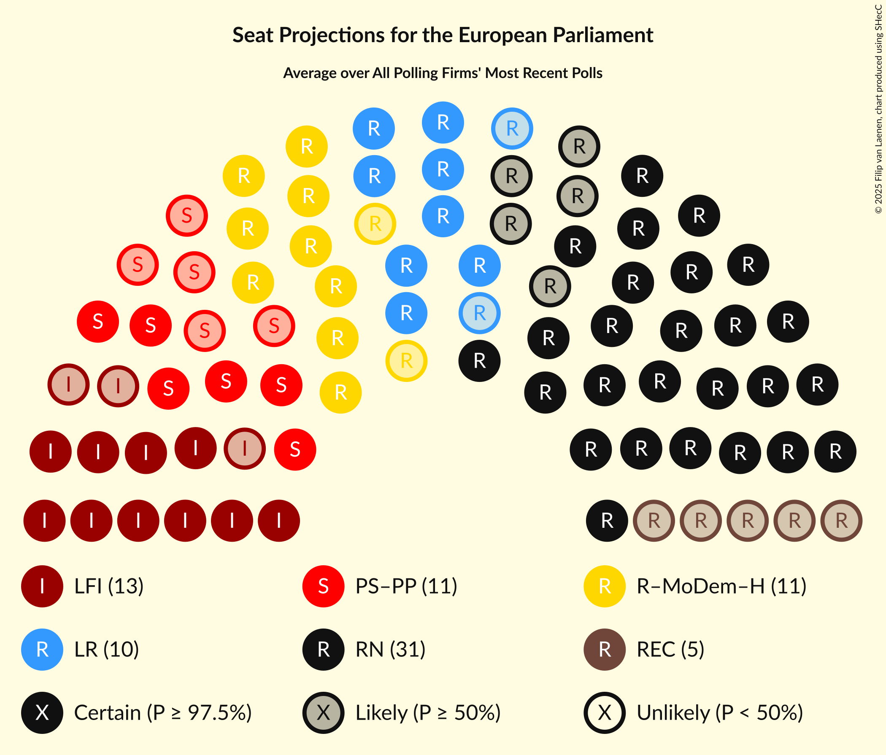

# Overview

The table below lists the most recent polls (less than 30 days old) registered and analyzed so far.

| Period     | Polling firm/Commissioner(s) | RN | LR | PS | LREM–MoDem | EELV | PCF | FI | Agir–UDI | DlF | LP | UPR | NPA | G·s | R! | LO | GJ | REC | LE | W | PRG–Con | PRG | ÉAC | LO–NPA | PA | AR |
|:----------:|:----------------------------:|:--:|:--:|:--:|:--:|:--:|:--:|:--:|:--:|:--:|:--:|:--:|:--:|:--:|:--:|:--:|:--:|:--:|:--:|:--:|:--:|:--:|:--:|:--:|:--:|:--:|
| 26 May 2019 | General Election | 24.9%   24 | 20.8%   20 | 14.0%   13 | 9.9%   7 | 9.0%   6 | 6.6%   1 | 6.6%   1 | 2.0%   0 | 0.0%   0 | 0.0%   0 | 0.0%   0 | 0.0%   0 | 0.0%   0 | 0.0%   0 | 0.0%   0 | 0.0%   0 | 0.0%   0 | 0.0%   0 | 0.0%   0 | 0.0%   0 | 0.0%   0 | 0.0%   0 | 0.0%   0 | 0.0%   0 | 0.0%   0 |
| N/A | [Poll Average](average.html) | 26–33%   26–32 | 6–9%   5–8 | 9–14%   9–13 | 15–22%   14–20 | 5–10%   4–9 | 2–4%   0 | 5–9%   5–9 | N/A   N/A | 2–4%   0 | 0–2%   0 | 0–2%   0 | 0–1%   0 | N/A   N/A | N/A   N/A | 0–2%   0 | N/A   N/A | 5–7%   0–8 | N/A   N/A | N/A   N/A | 1–2%   0 | 0–1%   0 | 0–2%   0 | 1–2%   0 | 1–2%   0 | 1–2%   0 |
| [5–7 April 2024](2024-04-07-Ifop–Fiducial.html) | Ifop–Fiducial   JDD | 30–35%   28–33 | 6–9%   5–8 | 9–13%   8–12 | 17–21%   16–19 | 5–8%   5–7 | 2–4%   0 | 6–9%   6–8 | N/A   N/A | N/A   N/A | 0–1%   0 | 0–1%   0 | N/A   N/A | N/A   N/A | N/A   N/A | N/A   N/A | N/A   N/A | 5–7%   0–6 | N/A   N/A | N/A   N/A | 1–2%   0 | N/A   N/A | 1–2%   0 | 1–2%   0 | 1–3%   0 | 1–2%   0 |
| [2–4 April 2024](2024-04-04-ELABE.html) | ELABE   BFMTV and La Tribune Dimanche | 28–32%   27–31 | 6–8%   5–8 | 10–14%   10–13 | 15–18%   14–18 | 7–10%   7–10 | 2–3%   0 | 6–9%   6–8 | N/A   N/A | N/A   N/A | 0–1%   0 | 0–1%   0 | N/A   N/A | N/A   N/A | N/A   N/A | 1–2%   0 | N/A   N/A | 4–7%   0–6 | N/A   N/A | N/A   N/A | N/A   N/A | 0–1%   0 | 1–3%   0 | N/A   N/A | 1–2%   0 | 1–2%   0 |
| [28–29 March 2024](2024-03-29-HarrisInteractive.html) | Harris Interactive   Challenges, M6 and RTL | 29–33%   27–32 | 6–8%   5–8 | 12–14%   10–13 | 15–19%   15–17 | 5–7%   5–6 | 2–4%   0 | 7–9%   6–8 | N/A   N/A | N/A   N/A | 1–2%   0 | 0–1%   0 | N/A   N/A | N/A   N/A | N/A   N/A | 1–2%   0 | N/A   N/A | 5–7%   0–6 | N/A   N/A | N/A   N/A | N/A   N/A | 0–1%   0 | 0–1%   0 | N/A   N/A | 1–2%   0 | 1–2%   0 |
| [27–28 March 2024](2024-03-28-BVA.html) | BVA   RTL | 28–32%   27–28 | 7–9%   7–8 | 10–13%   10–12 | 18–22%   17–19 | 5–7%   4–6 | 2–3%   0 | 6–8%   6–7 | N/A   N/A | 2–4%   0 | 1–2%   0 | 1–2%   0 | 0–1%   0 | N/A   N/A | N/A   N/A | 1–2%   0 | N/A   N/A | 4–7%   5–6 | N/A   N/A | N/A   N/A | N/A   N/A | 0%   0 | 0–1%   0 | N/A   N/A | 1–2%   0 | 1–2%   0 |
| [13–14 March 2024](2024-03-14-OpinionWay–Tilder.html) | OpinionWay–Tilder   Les Echos and Radio Classique | 24–30%   23–30 | 7–10%   5–9 | 9–13%   9–13 | 18–23%   18–22 | 7–10%   5–9 | 1–3%   0 | 5–8%   0–7 | N/A   N/A | 2–4%   0 | N/A   N/A | 1–2%   0 | N/A   N/A | N/A   N/A | N/A   N/A | 1–2%   0 | N/A   N/A | 5–8%   0–7 | N/A   N/A | N/A   N/A | 1–2%   0 | N/A   N/A | 1–2%   0 | N/A   N/A | 1–2%   0 | 1–2%   0 |
| [8–9 March 2024](2024-03-09-Cluster17.html) | Cluster17   Le Point | 27–32%   27–31 | 6–9%   5–7 | 8–12%   8–11 | 15–19%   14–18 | 6–10%   5–9 | 2–4%   0 | 6–10%   6–9 | N/A   N/A | 2–4%   0 | N/A   N/A | 1–2%   0 | N/A   N/A | N/A   N/A | N/A   N/A | 0–1%   0 | N/A   N/A | 5–8%   0–8 | N/A   N/A | N/A   N/A | N/A   N/A | 0–1%   0 | 1–2%   0 | N/A   N/A | 1–2%   0 | 1–3%   0 |
| 26 May 2019 | General Election | 24.9%   24 | 20.8%   20 | 14.0%   13 | 9.9%   7 | 9.0%   6 | 6.6%   1 | 6.6%   1 | 2.0%   0 | 0.0%   0 | 0.0%   0 | 0.0%   0 | 0.0%   0 | 0.0%   0 | 0.0%   0 | 0.0%   0 | 0.0%   0 | 0.0%   0 | 0.0%   0 | 0.0%   0 | 0.0%   0 | 0.0%   0 | 0.0%   0 | 0.0%   0 | 0.0%   0 | 0.0%   0 |

Only polls for which at least the sample size has been published are included in the table above.

**Legend:**
+ **Top half of each row:** Voting intentions (95% confidence interval)
+ **Bottom half of each row:** Seat projections for the European Parliament (95% confidence interval)
+ **RN:** Rassemblement national (ID)
+ **LR:** Les Républicains (EPP)
+ **PS:** Parti socialiste (S&D)
+ **LREM–MoDem:** La République en marche–Mouvement démocrate (RE)
+ **EELV:** Europe Écologie Les Verts (Greens/EFA)
+ **PCF:** Parti communiste français (GUE/NGL)
+ **FI:** La France insoumise (GUE/NGL)
+ **Agir–UDI:** Agir, la droite constructive–Union des démocrates et indépendants (RE)
+ **DlF:** Debout la France (ECR)
+ **LP:** Les Patriotes (NI)
+ **UPR:** Union populaire républicaine (*)
+ **NPA:** Nouveau Parti anticapitaliste (GUE/NGL)
+ **G·s:** Génération·s, le mouvement (S&D)
+ **R!:** Résistons! (*)
+ **LO:** Lutte Ouvrière (*)
+ **GJ:** Mouvement des gilets jaunes (*)
+ **REC:** Reconquête (ECR)
+ **LE:** L’Engagement (*)
+ **W:** Walwari (*)
+ **PRG–Con:** Parti radical de gauche–La Convention (S&D)
+ **PRG:** Parti radical de gauche (S&D)
+ **ÉAC:** Écologie au centre (Greens/EFA)
+ **LO–NPA:** Lutte Ouvrière–Nouveau Parti anticapitaliste (GUE/NGL)
+ **PA:** Parti animaliste (GUE/NGL)
+ **AR:** Alliance Rurale (*)
+ **N/A (single party):** Party not included the published results
+ **N/A (entire row):** Calculation for this opinion poll not started yet

