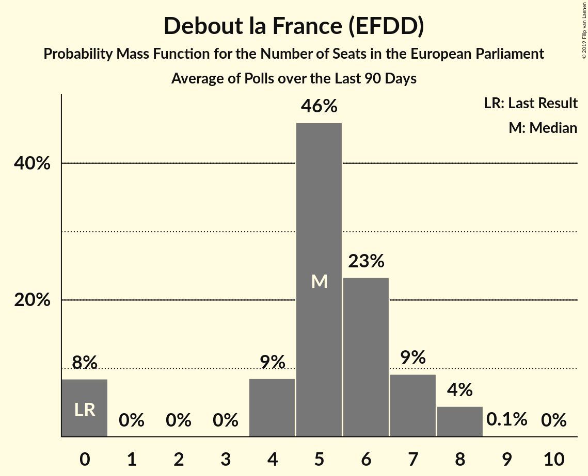

# Debout la France (EFDD)

<a href="#voting-intentions">Voting Intentions</a> | <a href="#seats">Seats</a>

## Voting Intentions

Last result: **0.0%** (General Election of 25 May 2014)

### Confidence Intervals

| Period     | Polling firm/Commissioner(s) | Median | 80% Confidence Interval | 90% Confidence Interval | 95% Confidence Interval | 99% Confidence Interval |
|:----------:|:----------------:|:-----------:|:-----------------------:|:-----------------------:|:-----------------------:|:-----------------------:|
| N/A | [Poll Average](average.html) | 6.0% | 5.1–7.1% | 4.8–7.4% | 4.6–7.7% | 4.2–8.3% |
| [7–9 May 2018](2018-05-09-Ifop.html) | Ifop   Valeurs Actuelles | 6.0% | 5.1–7.1% | 4.8–7.4% | 4.6–7.7% | 4.2–8.3% |
| [29 November–1 December 2017](2017-12-01-Ifop.html) | Ifop   Le Figaro | 6.0% | 5.1–7.0% | 4.9–7.3% | 4.6–7.6% | 4.3–8.1% |

### Probability Mass Function

The following table shows the probability mass function per percentage block of voting intentions for the [poll average](average.html) for Debout la France (EFDD).

| Voting Intentions | Probability | Accumulated | Special Marks |
|:-----------------:|:-----------:|:-----------:|:-------------:|
| 0.0–0.5% | 0% | 100% | Last Result |
| 0.5–1.5% | 0% | 100% |  |
| 1.5–2.5% | 0% | 100% |  |
| 2.5–3.5% | 0% | 100% |  |
| 3.5–4.5% | 2% | 100% |  |
| 4.5–5.5% | 24% | 98% |  |
| 5.5–6.5% | 48% | 74% | Median |
| 6.5–7.5% | 23% | 26% |  |
| 7.5–8.5% | 3% | 4% |  |
| 8.5–9.5% | 0.2% | 0.2% |  |
| 9.5–10.5% | 0% | 0% |  |

## Seats

Last result: **0** seats (General Election of 25 May 2014)

### Confidence Intervals

| Period     | Polling firm/Commissioner(s) | Median | 80% Confidence Interval | 90% Confidence Interval | 95% Confidence Interval | 99% Confidence Interval |
|:----------:|:----------------:|:------:|:-----------------------:|:-----------------------:|:-----------------------:|:-----------------------:|
| N/A | [Poll Average](average.html) | 5 | 0–6 | 0–6 | 0–7 | 0–8 |
| [7–9 May 2018](2018-05-09-Ifop.html) | Ifop   Valeurs Actuelles | 5 | 0–6 | 0–6 | 0–7 | 0–8 |
| [29 November–1 December 2017](2017-12-01-Ifop.html) | Ifop   Le Figaro | 6 | 5–6 | 4–7 | 0–7 | 0–7 |

### Probability Mass Function

The following table shows the probability mass function per seat for the [poll average](average.html) for Debout la France (EFDD).

| Number of Seats | Probability | Accumulated | Special Marks |
|:---------------:|:-----------:|:-----------:|:-------------:|
| 0 | 21% | 100% | Last Result |
| 1 | 0% | 79% |  |
| 2 | 0% | 79% |  |
| 3 | 0% | 79% |  |
| 4 | 8% | 79% |  |
| 5 | 60% | 71% | Median |
| 6 | 8% | 12% |  |
| 7 | 3% | 3% |  |
| 8 | 0.6% | 0.8% |  |
| 9 | 0.2% | 0.2% |  |
| 10 | 0% | 0% |  |

