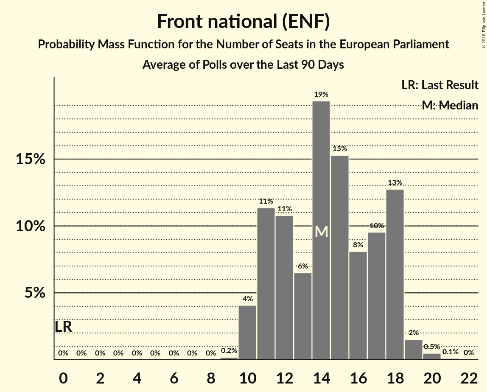

# Front national (ENF)

<a href="#voting-intentions">Voting Intentions</a> | <a href="#seats">Seats</a>

## Voting Intentions

Last result: **0.0%** (General Election of 25 May 2014)

### Confidence Intervals

| Period     | Polling firm/Commissioner(s) | Median | 80% Confidence Interval | 90% Confidence Interval | 95% Confidence Interval | 99% Confidence Interval |
|:----------:|:----------------:|:-----------:|:-----------------------:|:-----------------------:|:-----------------------:|:-----------------------:|
| N/A | [Poll Average](average.html) | 15.3% | 13.5–17.7% | 13.1–18.3% | 12.8–18.8% | 12.2–19.8% |
| [22–23 May 2018](2018-05-23-HarrisInteractive.html) | Harris Interactive   LCP – Assemblée nationale | 15.3% | 14.2–16.5% | 13.9–16.8% | 13.7–17.1% | 13.2–17.7% |
| [7–11 May 2018](2018-05-11-Viavoice.html) | Viavoice   Europe Écologie Les Verts | 14.0% | 12.9–15.2% | 12.6–15.6% | 12.3–15.9% | 11.8–16.5% |
| [7–9 May 2018](2018-05-09-Ifop.html) | Ifop   Valeurs Actuelles | 17.0% | 15.5–18.6% | 15.0–19.1% | 14.7–19.5% | 14.0–20.3% |
| [29 November–1 December 2017](2017-12-01-Ifop.html) | Ifop   Le Figaro | 17.0% | 15.5–18.6% | 15.1–19.0% | 14.8–19.4% | 14.1–20.2% |

### Probability Mass Function

The following table shows the probability mass function per percentage block of voting intentions for the [poll average](average.html) for Front national (ENF).

| Voting Intentions | Probability | Accumulated | Special Marks |
|:-----------------:|:-----------:|:-----------:|:-------------:|
| 0.0–0.5% | 0% | 100% | Last Result |
| 0.5–1.5% | 0% | 100% |  |
| 1.5–2.5% | 0% | 100% |  |
| 2.5–3.5% | 0% | 100% |  |
| 3.5–4.5% | 0% | 100% |  |
| 4.5–5.5% | 0% | 100% |  |
| 5.5–6.5% | 0% | 100% |  |
| 6.5–7.5% | 0% | 100% |  |
| 7.5–8.5% | 0% | 100% |  |
| 8.5–9.5% | 0% | 100% |  |
| 9.5–10.5% | 0% | 100% |  |
| 10.5–11.5% | 0.1% | 100% |  |
| 11.5–12.5% | 1.4% | 99.9% |  |
| 12.5–13.5% | 9% | 98.6% |  |
| 13.5–14.5% | 20% | 90% |  |
| 14.5–15.5% | 25% | 69% | Median |
| 15.5–16.5% | 20% | 45% |  |
| 16.5–17.5% | 13% | 24% |  |
| 17.5–18.5% | 8% | 11% |  |
| 18.5–19.5% | 3% | 4% |  |
| 19.5–20.5% | 0.7% | 0.8% |  |
| 20.5–21.5% | 0.1% | 0.1% |  |
| 21.5–22.5% | 0% | 0% |  |

## Seats

Last result: **0** seats (General Election of 25 May 2014)

### Confidence Intervals

| Period     | Polling firm/Commissioner(s) | Median | 80% Confidence Interval | 90% Confidence Interval | 95% Confidence Interval | 99% Confidence Interval |
|:----------:|:----------------:|:------:|:-----------------------:|:-----------------------:|:-----------------------:|:-----------------------:|
| N/A | [Poll Average](average.html) | 14 | 11–16 | 10–17 | 10–17 | 10–19 |
| [22–23 May 2018](2018-05-23-HarrisInteractive.html) | Harris Interactive   LCP – Assemblée nationale | 14 | 14 | 13–14 | 13–14 | 12–15 |
| [7–11 May 2018](2018-05-11-Viavoice.html) | Viavoice   Europe Écologie Les Verts | 11 | 10–13 | 10–13 | 10–13 | 9–14 |
| [7–9 May 2018](2018-05-09-Ifop.html) | Ifop   Valeurs Actuelles | 15 | 14–17 | 14–17 | 13–18 | 12–20 |
| [29 November–1 December 2017](2017-12-01-Ifop.html) | Ifop   Le Figaro | 15 | 14–18 | 14–18 | 14–18 | 13–19 |

### Probability Mass Function

The following table shows the probability mass function per seat for the [poll average](average.html) for Front national (ENF).

| Number of Seats | Probability | Accumulated | Special Marks |
|:---------------:|:-----------:|:-----------:|:-------------:|
| 0 | 0% | 100% | Last Result |
| 1 | 0% | 100% |  |
| 2 | 0% | 100% |  |
| 3 | 0% | 100% |  |
| 4 | 0% | 100% |  |
| 5 | 0% | 100% |  |
| 6 | 0% | 100% |  |
| 7 | 0% | 100% |  |
| 8 | 0% | 100% |  |
| 9 | 0.2% | 100% |  |
| 10 | 7% | 99.8% |  |
| 11 | 15% | 93% |  |
| 12 | 9% | 78% |  |
| 13 | 7% | 70% |  |
| 14 | 41% | 63% | Median |
| 15 | 10% | 21% |  |
| 16 | 6% | 12% |  |
| 17 | 4% | 6% |  |
| 18 | 1.0% | 2% |  |
| 19 | 0.4% | 0.6% |  |
| 20 | 0.2% | 0.3% |  |
| 21 | 0.1% | 0.1% |  |
| 22 | 0% | 0% |  |

