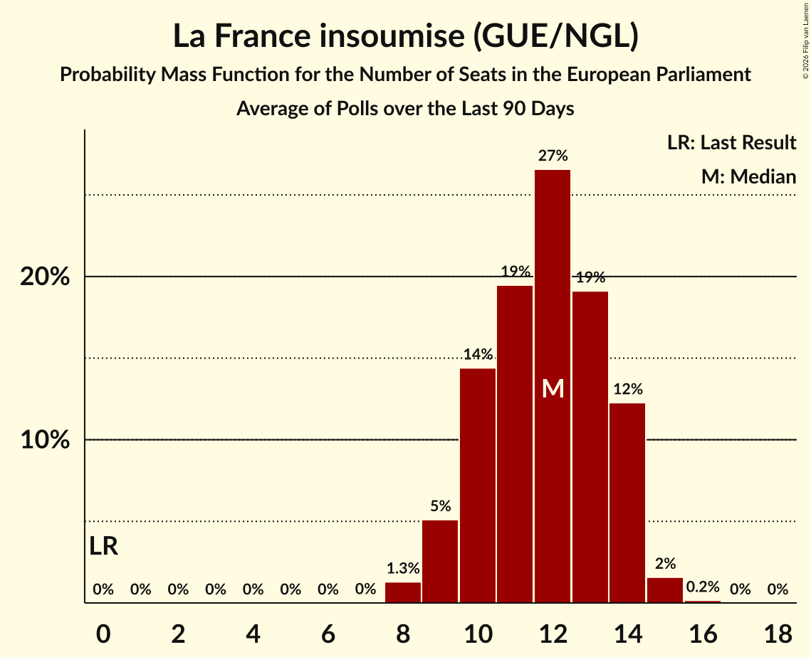

# La France insoumise (GUE/NGL)

<a href="#voting-intentions">Voting Intentions</a> | <a href="#seats">Seats</a>

## Voting Intentions

Last result: **0.0%** (General Election of 9 June 2024)

### Confidence Intervals

| Period     | Polling firm/Commissioner(s) | Median | 80% Confidence Interval | 90% Confidence Interval | 95% Confidence Interval | 99% Confidence Interval |
|:----------:|:----------------:|:-----------:|:-----------------------:|:-----------------------:|:-----------------------:|:-----------------------:|
| N/A | [Poll Average](average.html) | 13.3% | 10.4–15.2% | 10.0–15.7% | 9.6–16.2% | 9.0–17.0% |
| [26–27 March 2026](2026-03-27-OpinionWay.html) | OpinionWay | 14.5% | 13.1–16.0% | 12.7–16.4% | 12.4–16.8% | 11.8–17.5% |
| [25–27 March 2026](2026-03-27-ELABE.html) | ELABE   BFMTV and La Tribune Dimanche | 13.6% | 12.5–14.8% | 12.1–15.1% | 11.9–15.4% | 11.4–16.0% |
| [25–26 March 2026](2026-03-26-Odoxa.html) | Odoxa   Public Sénat | 12.5% | N/A | N/A | N/A | N/A |
| [22 March 2026](2026-03-22-HarrisInteractive.html) | Harris Interactive   M6 and RTL | 11.9% | N/A | N/A | N/A | N/A |
| [26–27 February 2026](2026-02-27-Ifop–Fiducial.html) | Ifop–Fiducial   Le Figaro and Sud Radio | 10.9% | 9.8–12.1% | 9.4–12.5% | 9.2–12.8% | 8.7–13.5% |
| [18–20 November 2025](2025-11-20-Verian.html) | Verian | 11.7% | 10.5–13.2% | 10.1–13.6% | 9.8–13.9% | 9.2–14.7% |
| [19–20 November 2025](2025-11-20-Odoxa.html) | Odoxa   Public Sénat | 11.6% | 10.5–12.9% | 10.1–13.3% | 9.9–13.6% | 9.3–14.2% |
| [30–31 October 2025](2025-10-31-ELABE.html) | ELABE   BFMTV and La Tribune Dimanche | 12.5% | 11.5–13.7% | 11.2–14.1% | 10.9–14.3% | 10.4–14.9% |
| [7 October 2025](2025-10-07-HarrisInteractive.html) | Harris Interactive   RTL | 14.0% | 12.7–15.4% | 12.4–15.8% | 12.1–16.2% | 11.5–16.9% |
| [30 September–1 October 2025](2025-10-01-Cluster17.html) | Cluster17   Le Point | 14.7% | 13.6–15.9% | 13.2–16.2% | 13.0–16.5% | 12.5–17.1% |
| [24–25 September 2025](2025-09-25-Ifop–Fiducial.html) | Ifop–Fiducial   L’Opinion and Sud Radio | 12.8% | 11.6–14.1% | 11.2–14.5% | 10.9–14.9% | 10.4–15.5% |
| [19–20 May 2025](2025-05-20-Ifop–Fiducial.html) | Ifop–Fiducial   Le Figaro and Sud Radio | 13.0% | N/A | N/A | N/A | N/A |
| [19 May 2025](2025-05-19-HarrisInteractive.html) | Harris Interactive   LCI | 14.0% | N/A | N/A | N/A | N/A |
| [11–30 April 2025](2025-04-30-Ifop.html) | Ifop   Hexagone | 15.0% | N/A | N/A | N/A | N/A |
| [23–24 April 2025](2025-04-24-Odoxa.html) | Odoxa   Public Sénat | 12.0% | N/A | N/A | N/A | N/A |
| [2–4 April 2025](2025-04-04-ELABE.html) | ELABE   BFMTV and La Tribune Dimanche | 10.0% | N/A | N/A | N/A | N/A |
| [31 March 2025](2025-03-31-HarrisInteractive.html) | Harris Interactive   RTL | 13.0% | N/A | N/A | N/A | N/A |
| [26–27 March 2025](2025-03-27-Ifop.html) | Ifop   Le Journal du Dimanche | 12.7% | N/A | N/A | N/A | N/A |
| [6–9 December 2024](2024-12-09-Ifop–Fiducial.html) | Ifop–Fiducial   Le Figaro and Sud Radio | 11.8% | N/A | N/A | N/A | N/A |
| [11–12 September 2024](2024-09-12-OpinionWay.html) | OpinionWay | 12.2% | N/A | N/A | N/A | N/A |
| [6–9 September 2024](2024-09-09-Ifop–Fiducial.html) | Ifop–Fiducial   Sud Radio | 12.2% | N/A | N/A | N/A | N/A |
| [7–8 July 2024](2024-07-08-HarrisInteractive.html) | Harris Interactive   Challenges, M6 and RTL | 15.6% | N/A | N/A | N/A | N/A |

### Probability Mass Function

The following table shows the probability mass function per percentage block of voting intentions for the [poll average](average.html) for La France insoumise (GUE/NGL).

| Voting Intentions | Probability | Accumulated | Special Marks |
|:-----------------:|:-----------:|:-----------:|:-------------:|
| 0.0–0.5% | 0% | 100% | Last Result |
| 0.5–1.5% | 0% | 100% |  |
| 1.5–2.5% | 0% | 100% |  |
| 2.5–3.5% | 0% | 100% |  |
| 3.5–4.5% | 0% | 100% |  |
| 4.5–5.5% | 0% | 100% |  |
| 5.5–6.5% | 0% | 100% |  |
| 6.5–7.5% | 0% | 100% |  |
| 7.5–8.5% | 0.1% | 100% |  |
| 8.5–9.5% | 2% | 99.9% |  |
| 9.5–10.5% | 9% | 98% |  |
| 10.5–11.5% | 14% | 89% |  |
| 11.5–12.5% | 12% | 75% |  |
| 12.5–13.5% | 19% | 63% | Median |
| 13.5–14.5% | 23% | 44% |  |
| 14.5–15.5% | 14% | 21% |  |
| 15.5–16.5% | 5% | 7% |  |
| 16.5–17.5% | 1.1% | 1.3% |  |
| 17.5–18.5% | 0.1% | 0.2% |  |
| 18.5–19.5% | 0% | 0% |  |

## Seats

Last result: **0** seats (General Election of 9 June 2024)

### Confidence Intervals

| Period     | Polling firm/Commissioner(s) | Median | 80% Confidence Interval | 90% Confidence Interval | 95% Confidence Interval | 99% Confidence Interval |
|:----------:|:----------------:|:------:|:-----------------------:|:-----------------------:|:-----------------------:|:-----------------------:|
| N/A | [Poll Average](average.html) | 12 | 10–14 | 9–14 | 9–14 | 8–15 |
| [26–27 March 2026](2026-03-27-OpinionWay.html) | OpinionWay | 12 | 11–13 | 10–14 | 10–14 | 10–15 |
| [25–27 March 2026](2026-03-27-ELABE.html) | ELABE   BFMTV and La Tribune Dimanche | 14 | 13–14 | 12–14 | 12–14 | 12–16 |
| [25–26 March 2026](2026-03-26-Odoxa.html) | Odoxa   Public Sénat |  |  |  |  |  |
| [22 March 2026](2026-03-22-HarrisInteractive.html) | Harris Interactive   M6 and RTL |  |  |  |  |  |
| [26–27 February 2026](2026-02-27-Ifop–Fiducial.html) | Ifop–Fiducial   Le Figaro and Sud Radio | 10 | 9–11 | 8–12 | 8–13 | 8–14 |
| [18–20 November 2025](2025-11-20-Verian.html) | Verian | 11 | 9–12 | 9–13 | 9–13 | 8–14 |
| [19–20 November 2025](2025-11-20-Odoxa.html) | Odoxa   Public Sénat | 10 | 9–11 | 9–12 | 9–12 | 8–13 |
| [30–31 October 2025](2025-10-31-ELABE.html) | ELABE   BFMTV and La Tribune Dimanche | 13 | 11–13 | 10–14 | 10–14 | 10–15 |
| [7 October 2025](2025-10-07-HarrisInteractive.html) | Harris Interactive   RTL | 12 | 11–14 | 11–14 | 11–14 | 10–15 |
| [30 September–1 October 2025](2025-10-01-Cluster17.html) | Cluster17   Le Point | 14 | 12–15 | 12–15 | 12–15 | 11–16 |
| [24–25 September 2025](2025-09-25-Ifop–Fiducial.html) | Ifop–Fiducial   L’Opinion and Sud Radio | 12 | 11–13 | 10–13 | 10–13 | 9–14 |
| [19–20 May 2025](2025-05-20-Ifop–Fiducial.html) | Ifop–Fiducial   Le Figaro and Sud Radio |  |  |  |  |  |
| [19 May 2025](2025-05-19-HarrisInteractive.html) | Harris Interactive   LCI |  |  |  |  |  |
| [11–30 April 2025](2025-04-30-Ifop.html) | Ifop   Hexagone |  |  |  |  |  |
| [23–24 April 2025](2025-04-24-Odoxa.html) | Odoxa   Public Sénat |  |  |  |  |  |
| [2–4 April 2025](2025-04-04-ELABE.html) | ELABE   BFMTV and La Tribune Dimanche |  |  |  |  |  |
| [31 March 2025](2025-03-31-HarrisInteractive.html) | Harris Interactive   RTL |  |  |  |  |  |
| [26–27 March 2025](2025-03-27-Ifop.html) | Ifop   Le Journal du Dimanche |  |  |  |  |  |
| [6–9 December 2024](2024-12-09-Ifop–Fiducial.html) | Ifop–Fiducial   Le Figaro and Sud Radio |  |  |  |  |  |
| [11–12 September 2024](2024-09-12-OpinionWay.html) | OpinionWay |  |  |  |  |  |
| [6–9 September 2024](2024-09-09-Ifop–Fiducial.html) | Ifop–Fiducial   Sud Radio |  |  |  |  |  |
| [7–8 July 2024](2024-07-08-HarrisInteractive.html) | Harris Interactive   Challenges, M6 and RTL |  |  |  |  |  |

### Probability Mass Function

The following table shows the probability mass function per seat for the [poll average](average.html) for La France insoumise (GUE/NGL).

| Number of Seats | Probability | Accumulated | Special Marks |
|:---------------:|:-----------:|:-----------:|:-------------:|
| 0 | 0% | 100% | Last Result |
| 1 | 0% | 100% |  |
| 2 | 0% | 100% |  |
| 3 | 0% | 100% |  |
| 4 | 0% | 100% |  |
| 5 | 0% | 100% |  |
| 6 | 0% | 100% |  |
| 7 | 0% | 100% |  |
| 8 | 2% | 100% |  |
| 9 | 7% | 98% |  |
| 10 | 16% | 90% |  |
| 11 | 15% | 74% |  |
| 12 | 17% | 59% | Median |
| 13 | 13% | 42% |  |
| 14 | 28% | 29% |  |
| 15 | 0.4% | 0.6% |  |
| 16 | 0.2% | 0.2% |  |
| 17 | 0% | 0% |  |

