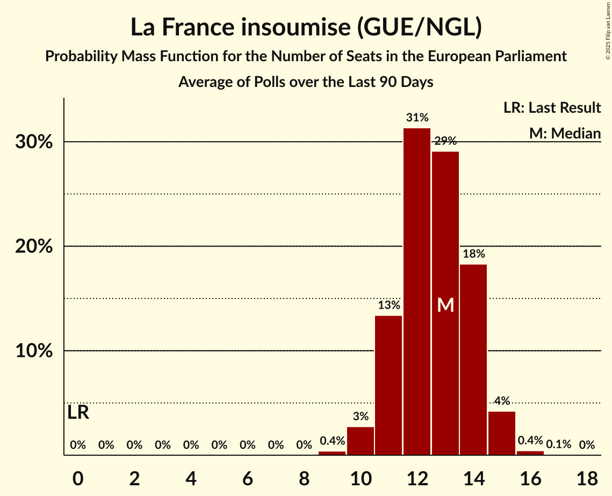

# La France insoumise (GUE/NGL)

<a href="#voting-intentions">Voting Intentions</a> | <a href="#seats">Seats</a>

## Voting Intentions

Last result: **6.6%** (General Election of 26 May 2019)

### Confidence Intervals

| Period     | Polling firm/Commissioner(s) | Median | 80% Confidence Interval | 90% Confidence Interval | 95% Confidence Interval | 99% Confidence Interval |
|:----------:|:----------------:|:-----------:|:-----------------------:|:-----------------------:|:-----------------------:|:-----------------------:|
| N/A | [Poll Average](average.html) | 9.5% | 8.0–12.2% | 7.6–13.2% | 7.3–13.8% | 6.7–14.8% |
| [13–15 December 2021](2021-12-15-OpinionWay.html) | OpinionWay   Les Echos, CNews and Radio Classique | 9.1% | 8.1–10.2% | 7.8–10.5% | 7.6–10.8% | 7.1–11.4% |
| [12–15 December 2021](2021-12-15-Cluster17.html) | Cluster17 | 13.0% | 11.8–14.3% | 11.4–14.7% | 11.2–15.1% | 10.6–15.7% |
| [7–13 December 2021](2021-12-13-IpsosandSopraSteria.html) | Ipsos and Sopra Steria   CEVIPOF, FJJ and Le Monde | 8.4% | 7.9–8.9% | 7.8–9.1% | 7.7–9.1% | 7.5–9.4% |
| [10–13 December 2021](2021-12-13-HarrisInteractive.html) | Harris Interactive   Challenges | 10.9% | 10.1–11.8% | 9.8–12.1% | 9.6–12.3% | 9.3–12.7% |
| [8–9 December 2021](2021-12-09-OpinionWay.html) | OpinionWay   Mieux voter | 8.0% | N/A | N/A | N/A | N/A |
| [7–9 December 2021](2021-12-09-Odoxa.html) | Odoxa   L’Obs and Mascaret | 10.0% | 9.1–11.1% | 8.8–11.4% | 8.6–11.6% | 8.1–12.2% |
| [5 November–8 December 2021](2021-12-08-Odoxa.html) | Odoxa   Saegus and L’Obs | 8.5% | N/A | N/A | N/A | N/A |
| [6–8 December 2021](2021-12-08-IpsosandSopraSteria.html) | Ipsos and Sopra Steria   France Info and Le Parisien | 8.0% | 7.1–9.0% | 6.9–9.3% | 6.7–9.6% | 6.3–10.1% |
| [4–8 December 2021](2021-12-08-Cluster17.html) | Cluster17 | 13.0% | N/A | N/A | N/A | N/A |
| [6–8 December 2021](2021-12-08-BVA.html) | BVA   RTL and Orange | 9.0% | 7.8–10.5% | 7.5–10.9% | 7.2–11.3% | 6.6–12.1% |
| [6–7 December 2021](2021-12-07-Elabe.html) | Elabe   BFMTV, L’Express and SFR | 8.0% | 7.0–9.1% | 6.8–9.4% | 6.6–9.7% | 6.1–10.2% |
| [5–6 December 2021](2021-12-06-Kantar.html) | Kantar | 10.0% | 8.5–11.9% | 8.0–12.4% | 7.7–12.9% | 7.0–13.9% |
| [4–6 December 2021](2021-12-06-Ifop-Fiducial.html) | Ifop-Fiducial   Le Figaro and LCI | 9.0% | 8.1–10.1% | 7.8–10.4% | 7.6–10.7% | 7.2–11.2% |
| [3–6 December 2021](2021-12-06-HarrisInteractive.html) | Harris Interactive   Challenges | 10.9% | N/A | N/A | N/A | N/A |
| [26–29 November 2021](2021-11-29-HarrisInteractive.html) | Harris Interactive   Challenges | 9.9% | 9.1–10.9% | 8.9–11.1% | 8.7–11.3% | 8.4–11.8% |
| [23–24 November 2021](2021-11-24-Elabe.html) | Elabe   BFMTV, L’Express and SFR | 8.9% | 7.9–10.1% | 7.7–10.4% | 7.4–10.7% | 7.0–11.3% |
| [19–22 November 2021](2021-11-22-HarrisInteractive.html) | Harris Interactive   Challenges | 9.9% | N/A | N/A | N/A | N/A |
| [15–17 November 2021](2021-11-17-OpinionWay.html) | OpinionWay   Les Echos, CNews and Radio Classique | 9.0% | N/A | N/A | N/A | N/A |
| [12–15 November 2021](2021-11-15-HarrisInteractive.html) | Harris Interactive   Challenges | 9.9% | N/A | N/A | N/A | N/A |
| [12–15 November 2021](2021-11-15-BVA.html) | BVA   RTL and Orange | 7.5% | N/A | N/A | N/A | N/A |
| [10–11 November 2021](2021-11-11-Elabe.html) | Elabe   BFMTV, L’Express and SFR | 8.0% | N/A | N/A | N/A | N/A |
| [5–8 November 2021](2021-11-08-HarrisInteractive.html) | Harris Interactive   Challenges | 9.9% | N/A | N/A | N/A | N/A |
| [28–30 October 2021](2021-10-30-HarrisInteractive.html) | Harris Interactive   Challenges | 9.9% | N/A | N/A | N/A | N/A |
| [25–27 October 2021](2021-10-27-Elabe.html) | Elabe   BFMTV, L’Express and SFR | 6.1% | N/A | N/A | N/A | N/A |
| [22–25 October 2021](2021-10-25-HarrisInteractive.html) | Harris Interactive   Challenges | 9.9% | N/A | N/A | N/A | N/A |
| [18–20 October 2021](2021-10-20-OpinionWay.html) | OpinionWay   Les Echos, CNews and Radio Classique | 8.9% | N/A | N/A | N/A | N/A |
| [15–18 October 2021](2021-10-18-HarrisInteractive.html) | Harris Interactive   Challenges | 9.9% | N/A | N/A | N/A | N/A |
| [7–13 October 2021](2021-10-13-IpsosandSopraSteria.html) | Ipsos and Sopra Steria   CEVIPOF, FJJ and Le Monde | 8.0% | N/A | N/A | N/A | N/A |
| [5–11 October 2021](2021-10-11-Odoxa.html) | Odoxa   L’Obs | 7.5% | N/A | N/A | N/A | N/A |
| [8–11 October 2021](2021-10-11-HarrisInteractive.html) | Harris Interactive   Challenges | 10.8% | N/A | N/A | N/A | N/A |
| [7–11 October 2021](2021-10-11-BVA.html) | BVA   RTL and Orange | 8.0% | N/A | N/A | N/A | N/A |
| [5–6 October 2021](2021-10-06-Elabe.html) | Elabe   BFMTV, L’Express and SFR | 8.0% | N/A | N/A | N/A | N/A |
| [1–4 October 2021](2021-10-04-HarrisInteractive.html) | Harris Interactive   Challenges | 10.9% | N/A | N/A | N/A | N/A |
| [29–30 September 2021](2021-09-30-IpsosandSopraSteria.html) | Ipsos and Sopra Steria   Le Parisien and France Info | 9.0% | N/A | N/A | N/A | N/A |
| [24–27 September 2021](2021-09-27-HarrisInteractive.html) | Harris Interactive   Challenges | 12.9% | N/A | N/A | N/A | N/A |
| [22–23 September 2021](2021-09-23-Odoxa.html) | Odoxa   L’Obs | 9.0% | N/A | N/A | N/A | N/A |
| [17–20 September 2021](2021-09-20-HarrisInteractive.html) | Harris Interactive   Challenges | 11.0% | N/A | N/A | N/A | N/A |
| [10–13 September 2021](2021-09-13-HarrisInteractive.html) | Harris Interactive   Challenges | 11.1% | N/A | N/A | N/A | N/A |
| [11–13 September 2021](2021-09-13-Elabe.html) | Elabe   BFMTV, L’Express and SFR | 7.9% | N/A | N/A | N/A | N/A |
| [2–3 September 2021](2021-09-03-IpsosandSopraSteria.html) | Ipsos and Sopra Steria   Le Parisien and France Info | 8.5% | N/A | N/A | N/A | N/A |
| [27–30 August 2021](2021-08-30-HarrisInteractive.html) | Harris Interactive   Challenges | 12.0% | N/A | N/A | N/A | N/A |
| [20–23 August 2021](2021-08-23-HarrisInteractive.html) | Harris Interactive   Challenges | 11.1% | N/A | N/A | N/A | N/A |
| [20–22 August 2021](2021-08-22-Ipsos.html) | Ipsos   Libres! | 8.1% | N/A | N/A | N/A | N/A |
| [2–5 July 2021](2021-07-05-HarrisInteractive.html) | Harris Interactive   Challenges | 10.1% | N/A | N/A | N/A | N/A |
| [20–21 June 2021](2021-06-21-HarrisInteractive.html) | Harris Interactive | 10.0% | 9.0–11.2% | 8.7–11.5% | 8.5–11.8% | 8.0–12.3% |
| [4–7 June 2021](2021-06-07-HarrisInteractive.html) | Harris Interactive | 11.0% | 9.9–12.2% | 9.6–12.5% | 9.4–12.8% | 8.9–13.4% |
| [28–31 May 2021](2021-05-31-HarrisInteractive.html) | Harris Interactive | 13.0% | 11.9–14.3% | 11.6–14.6% | 11.3–14.9% | 10.8–15.5% |
| [21–24 May 2021](2021-05-24-HarrisInteractive.html) | Harris Interactive | 13.0% | 11.8–14.3% | 11.5–14.6% | 11.2–14.9% | 10.7–15.6% |
| [18–20 May 2021](2021-05-20-Ifop.html) | Ifop | 11.8% | 10.7–13.0% | 10.5–13.4% | 10.2–13.6% | 9.7–14.2% |
| [14–17 May 2021](2021-05-17-HarrisInteractive.html) | Harris Interactive | 13.0% | 11.9–14.3% | 11.5–14.7% | 11.3–15.0% | 10.7–15.7% |
| [16–19 April 2021](2021-04-19-HarrisInteractive.html) | Harris Interactive | 11.0% | 9.9–12.2% | 9.6–12.5% | 9.3–12.8% | 8.8–13.5% |
| [9–15 April 2021](2021-04-15-Ipsos.html) | Ipsos | 8.0% | 7.7–8.4% | 7.6–8.5% | 7.5–8.6% | 7.3–8.7% |
| [12–14 April 2021](2021-04-14-Elabe.html) | Elabe | 11.0% | 10.1–11.9% | 9.9–12.2% | 9.7–12.4% | 9.3–12.9% |
| [2–8 April 2021](2021-04-08-Ifop.html) | Ifop | 10.5% | 9.3–11.8% | 9.0–12.2% | 8.7–12.6% | 8.2–13.2% |
| [3–4 March 2021](2021-03-04-HarrisInteractive.html) | Harris Interactive   CommStrat and L’Opinion | 11.0% | 9.8–12.4% | 9.5–12.8% | 9.2–13.1% | 8.7–13.8% |
| [27–28 January 2021](2021-01-28-Ipsos.html) | Ipsos   FranceInfo and L’Obs | 10.0% | 8.9–11.3% | 8.6–11.7% | 8.3–12.0% | 7.8–12.7% |
| [19–21 January 2021](2021-01-21-HarrisInteractive.html) | Harris Interactive   CommStrat and L’Opinion | 10.8% | 9.8–11.9% | 9.5–12.2% | 9.2–12.5% | 8.8–13.1% |
| [28 September–1 October 2020](2020-10-01-Ifop-Fiducial.html) | Ifop-Fiducial   Le Journal du Dimanche and Sud Radio | 11.1% | 10.2–12.1% | 10.0–12.4% | 9.8–12.7% | 9.4–13.2% |
| [2–3 July 2020](2020-07-03-HarrisInteractive.html) | Harris Interactive   CommStrat | 12.2% | 11.2–13.4% | 10.9–13.8% | 10.6–14.1% | 10.2–14.6% |
| [30 June–1 July 2020](2020-07-01-ELABE.html) | ELABE   BFMTV | 12.0% | 10.5–13.9% | 10.0–14.4% | 9.7–14.9% | 9.0–15.8% |
| [18–19 June 2020](2020-06-19-Ifop-Fiducial.html) | Ifop-Fiducial   CNews and Sud Radio | 11.5% | 10.3–12.9% | 9.9–13.3% | 9.6–13.6% | 9.1–14.3% |
| [28–30 October 2019](2019-10-30-Ifop.html) | Ifop   Le Journal du Dimanche | 11.0% | 10.0–12.2% | 9.7–12.5% | 9.5–12.8% | 9.0–13.4% |
| [28–29 October 2019](2019-10-29-ELABE.html) | ELABE   BFMTV | 12.9% | 11.6–14.3% | 11.2–14.7% | 10.9–15.1% | 10.3–15.8% |

### Probability Mass Function

The following table shows the probability mass function per percentage block of voting intentions for the [poll average](average.html) for La France insoumise (GUE/NGL).

| Voting Intentions | Probability | Accumulated | Special Marks |
|:-----------------:|:-----------:|:-----------:|:-------------:|
| 4.5–5.5% | 0% | 100% |  |
| 5.5–6.5% | 0.3% | 100% |  |
| 6.5–7.5% | 4% | 99.7% | Last Result |
| 7.5–8.5% | 21% | 96% |  |
| 8.5–9.5% | 26% | 74% | Median |
| 9.5–10.5% | 20% | 48% |  |
| 10.5–11.5% | 13% | 28% |  |
| 11.5–12.5% | 6% | 15% |  |
| 12.5–13.5% | 5% | 8% |  |
| 13.5–14.5% | 3% | 3% |  |
| 14.5–15.5% | 0.7% | 0.8% |  |
| 15.5–16.5% | 0.1% | 0.1% |  |
| 16.5–17.5% | 0% | 0% |  |

## Seats

Last result: **1** seats (General Election of 26 May 2019)

### Confidence Intervals

| Period     | Polling firm/Commissioner(s) | Median | 80% Confidence Interval | 90% Confidence Interval | 95% Confidence Interval | 99% Confidence Interval |
|:----------:|:----------------:|:------:|:-----------------------:|:-----------------------:|:-----------------------:|:-----------------------:|
| N/A | [Poll Average](average.html) | 8 | 7–12 | 7–12 | 6–12 | 6–12 |
| [13–15 December 2021](2021-12-15-OpinionWay.html) | OpinionWay   Les Echos, CNews and Radio Classique | 8 | 7–9 | 7–9 | 7–10 | 6–10 |
| [12–15 December 2021](2021-12-15-Cluster17.html) | Cluster17 | 12 | 11–12 | 11–12 | 11–12 | 10–13 |
| [7–13 December 2021](2021-12-13-IpsosandSopraSteria.html) | Ipsos and Sopra Steria   CEVIPOF, FJJ and Le Monde |  |  |  |  |  |
| [10–13 December 2021](2021-12-13-HarrisInteractive.html) | Harris Interactive   Challenges | 8 | 8 | 8–10 | 8–10 | 8–10 |
| [8–9 December 2021](2021-12-09-OpinionWay.html) | OpinionWay   Mieux voter |  |  |  |  |  |
| [7–9 December 2021](2021-12-09-Odoxa.html) | Odoxa   L’Obs and Mascaret | 9 | 7–10 | 7–10 | 7–10 | 7–11 |
| [5 November–8 December 2021](2021-12-08-Odoxa.html) | Odoxa   Saegus and L’Obs |  |  |  |  |  |
| [6–8 December 2021](2021-12-08-IpsosandSopraSteria.html) | Ipsos and Sopra Steria   France Info and Le Parisien | 7 | 6–8 | 6–8 | 6–9 | 6–9 |
| [4–8 December 2021](2021-12-08-Cluster17.html) | Cluster17 |  |  |  |  |  |
| [6–8 December 2021](2021-12-08-BVA.html) | BVA   RTL and Orange | 8 | 7–10 | 7–10 | 6–10 | 6–11 |
| [6–7 December 2021](2021-12-07-Elabe.html) | Elabe   BFMTV, L’Express and SFR | 8 | 6–8 | 6–8 | 6–8 | 6–9 |
| [5–6 December 2021](2021-12-06-Kantar.html) | Kantar | 9 | 7–10 | 7–11 | 6–11 | 6–12 |
| [4–6 December 2021](2021-12-06-Ifop-Fiducial.html) | Ifop-Fiducial   Le Figaro and LCI | 8 | 8–9 | 8–9 | 7–9 | 7–9 |
| [3–6 December 2021](2021-12-06-HarrisInteractive.html) | Harris Interactive   Challenges |  |  |  |  |  |
| [26–29 November 2021](2021-11-29-HarrisInteractive.html) | Harris Interactive   Challenges | 9 | 8–9 | 8–10 | 8–10 | 7–10 |
| [23–24 November 2021](2021-11-24-Elabe.html) | Elabe   BFMTV, L’Express and SFR | 9 | 8–9 | 8–9 | 7–9 | 7–11 |
| [19–22 November 2021](2021-11-22-HarrisInteractive.html) | Harris Interactive   Challenges |  |  |  |  |  |
| [15–17 November 2021](2021-11-17-OpinionWay.html) | OpinionWay   Les Echos, CNews and Radio Classique |  |  |  |  |  |
| [12–15 November 2021](2021-11-15-HarrisInteractive.html) | Harris Interactive   Challenges |  |  |  |  |  |
| [12–15 November 2021](2021-11-15-BVA.html) | BVA   RTL and Orange |  |  |  |  |  |
| [10–11 November 2021](2021-11-11-Elabe.html) | Elabe   BFMTV, L’Express and SFR |  |  |  |  |  |
| [5–8 November 2021](2021-11-08-HarrisInteractive.html) | Harris Interactive   Challenges |  |  |  |  |  |
| [28–30 October 2021](2021-10-30-HarrisInteractive.html) | Harris Interactive   Challenges |  |  |  |  |  |
| [25–27 October 2021](2021-10-27-Elabe.html) | Elabe   BFMTV, L’Express and SFR |  |  |  |  |  |
| [22–25 October 2021](2021-10-25-HarrisInteractive.html) | Harris Interactive   Challenges |  |  |  |  |  |
| [18–20 October 2021](2021-10-20-OpinionWay.html) | OpinionWay   Les Echos, CNews and Radio Classique |  |  |  |  |  |
| [15–18 October 2021](2021-10-18-HarrisInteractive.html) | Harris Interactive   Challenges |  |  |  |  |  |
| [7–13 October 2021](2021-10-13-IpsosandSopraSteria.html) | Ipsos and Sopra Steria   CEVIPOF, FJJ and Le Monde |  |  |  |  |  |
| [5–11 October 2021](2021-10-11-Odoxa.html) | Odoxa   L’Obs |  |  |  |  |  |
| [8–11 October 2021](2021-10-11-HarrisInteractive.html) | Harris Interactive   Challenges |  |  |  |  |  |
| [7–11 October 2021](2021-10-11-BVA.html) | BVA   RTL and Orange |  |  |  |  |  |
| [5–6 October 2021](2021-10-06-Elabe.html) | Elabe   BFMTV, L’Express and SFR |  |  |  |  |  |
| [1–4 October 2021](2021-10-04-HarrisInteractive.html) | Harris Interactive   Challenges |  |  |  |  |  |
| [29–30 September 2021](2021-09-30-IpsosandSopraSteria.html) | Ipsos and Sopra Steria   Le Parisien and France Info |  |  |  |  |  |
| [24–27 September 2021](2021-09-27-HarrisInteractive.html) | Harris Interactive   Challenges |  |  |  |  |  |
| [22–23 September 2021](2021-09-23-Odoxa.html) | Odoxa   L’Obs |  |  |  |  |  |
| [17–20 September 2021](2021-09-20-HarrisInteractive.html) | Harris Interactive   Challenges |  |  |  |  |  |
| [10–13 September 2021](2021-09-13-HarrisInteractive.html) | Harris Interactive   Challenges |  |  |  |  |  |
| [11–13 September 2021](2021-09-13-Elabe.html) | Elabe   BFMTV, L’Express and SFR |  |  |  |  |  |
| [2–3 September 2021](2021-09-03-IpsosandSopraSteria.html) | Ipsos and Sopra Steria   Le Parisien and France Info |  |  |  |  |  |
| [27–30 August 2021](2021-08-30-HarrisInteractive.html) | Harris Interactive   Challenges |  |  |  |  |  |
| [20–23 August 2021](2021-08-23-HarrisInteractive.html) | Harris Interactive   Challenges |  |  |  |  |  |
| [20–22 August 2021](2021-08-22-Ipsos.html) | Ipsos   Libres! |  |  |  |  |  |
| [2–5 July 2021](2021-07-05-HarrisInteractive.html) | Harris Interactive   Challenges |  |  |  |  |  |
| [20–21 June 2021](2021-06-21-HarrisInteractive.html) | Harris Interactive | 9 | 8–9 | 8–9 | 8–9 | 7–10 |
| [4–7 June 2021](2021-06-07-HarrisInteractive.html) | Harris Interactive | 9 | 8–10 | 8–11 | 8–11 | 8–12 |
| [28–31 May 2021](2021-05-31-HarrisInteractive.html) | Harris Interactive | 11 | 10–12 | 10–13 | 9–13 | 9–14 |
| [21–24 May 2021](2021-05-24-HarrisInteractive.html) | Harris Interactive | 12 | 10–13 | 10–13 | 10–14 | 9–14 |
| [18–20 May 2021](2021-05-20-Ifop.html) | Ifop | 10 | 9–11 | 9–12 | 9–12 | 8–12 |
| [14–17 May 2021](2021-05-17-HarrisInteractive.html) | Harris Interactive | 12 | 11–13 | 11–13 | 10–13 | 10–14 |
| [16–19 April 2021](2021-04-19-HarrisInteractive.html) | Harris Interactive | 9 | 8–11 | 8–11 | 7–11 | 7–12 |
| [9–15 April 2021](2021-04-15-Ipsos.html) | Ipsos | 7 | 6–7 | 6–7 | 6–7 | 6–7 |
| [12–14 April 2021](2021-04-14-Elabe.html) | Elabe | 11 | 10–11 | 10–11 | 9–11 | 9–12 |
| [2–8 April 2021](2021-04-08-Ifop.html) | Ifop | 10 | 8–11 | 7–11 | 7–11 | 7–11 |
| [3–4 March 2021](2021-03-04-HarrisInteractive.html) | Harris Interactive   CommStrat and L’Opinion | 9 | 8–10 | 8–10 | 8–10 | 7–12 |
| [27–28 January 2021](2021-01-28-Ipsos.html) | Ipsos   FranceInfo and L’Obs | 8 | 7–9 | 7–9 | 6–10 | 6–10 |
| [19–21 January 2021](2021-01-21-HarrisInteractive.html) | Harris Interactive   CommStrat and L’Opinion | 9 | 8–9 | 8–10 | 8–11 | 7–11 |
| [28 September–1 October 2020](2020-10-01-Ifop-Fiducial.html) | Ifop-Fiducial   Le Journal du Dimanche and Sud Radio | 10 | 10 | 10 | 10 | 9–10 |
| [2–3 July 2020](2020-07-03-HarrisInteractive.html) | Harris Interactive   CommStrat | 11 | 10–11 | 9–12 | 9–12 | 9–13 |
| [30 June–1 July 2020](2020-07-01-ELABE.html) | ELABE   BFMTV | 10 | 9–12 | 9–12 | 8–12 | 8–14 |
| [18–19 June 2020](2020-06-19-Ifop-Fiducial.html) | Ifop-Fiducial   CNews and Sud Radio | 10 | 8–12 | 8–12 | 8–12 | 8–13 |
| [28–30 October 2019](2019-10-30-Ifop.html) | Ifop   Le Journal du Dimanche | 9 | 8–10 | 8–11 | 8–11 | 8–11 |
| [28–29 October 2019](2019-10-29-ELABE.html) | ELABE   BFMTV | 11 | 10–12 | 9–13 | 9–13 | 9–14 |

### Probability Mass Function

The following table shows the probability mass function per seat for the [poll average](average.html) for La France insoumise (GUE/NGL).

| Number of Seats | Probability | Accumulated | Special Marks |
|:---------------:|:-----------:|:-----------:|:-------------:|
| 1 | 0% | 100% | Last Result |
| 2 | 0% | 100% |  |
| 3 | 0% | 100% |  |
| 4 | 0% | 100% |  |
| 5 | 0.1% | 100% |  |
| 6 | 3% | 99.9% |  |
| 7 | 13% | 97% |  |
| 8 | 46% | 85% | Median |
| 9 | 16% | 38% |  |
| 10 | 8% | 22% |  |
| 11 | 3% | 14% |  |
| 12 | 11% | 11% |  |
| 13 | 0.2% | 0.2% |  |
| 14 | 0% | 0% |  |

