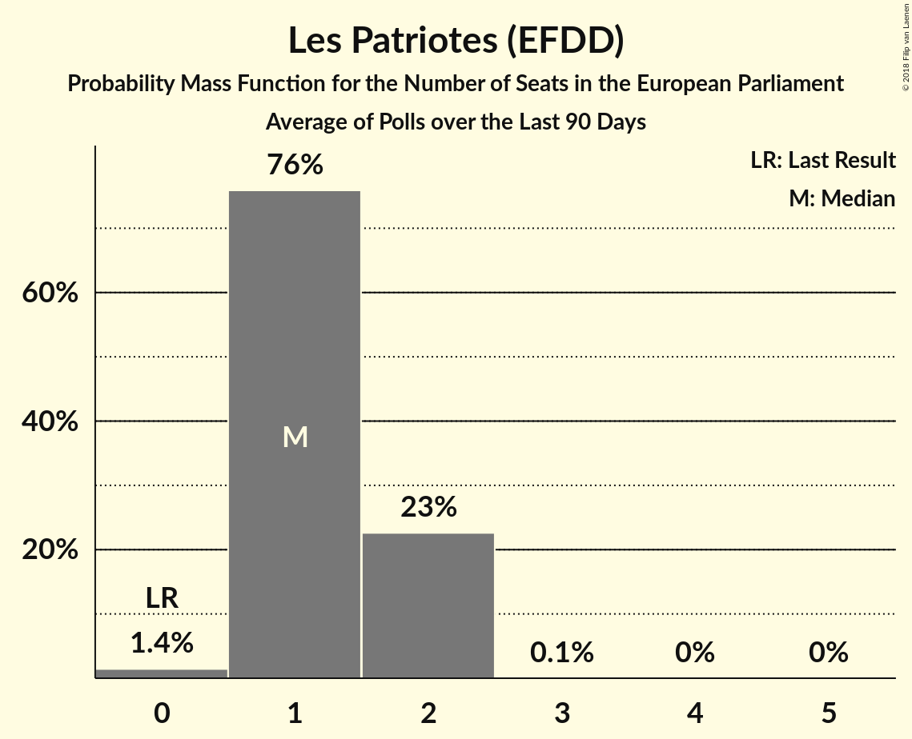

# Les Patriotes (EFDD)

<a href="#voting-intentions">Voting Intentions</a> | <a href="#seats">Seats</a>

## Voting Intentions

Last result: **0.0%** (General Election of 25 May 2014)

### Confidence Intervals

| Period     | Polling firm/Commissioner(s) | Median | 80% Confidence Interval | 90% Confidence Interval | 95% Confidence Interval | 99% Confidence Interval |
|:----------:|:----------------:|:-----------:|:-----------------------:|:-----------------------:|:-----------------------:|:-----------------------:|
| N/A | [Poll Average](average.html) | 1.2% | 0.8–1.8% | 0.7–2.0% | 0.6–2.2% | 0.5–2.6% |
| [29–30 May 2018](2018-05-30-ELABE.html) | ELABE   BFMTV | 1.5% | 1.1–2.1% | 1.0–2.3% | 0.9–2.5% | 0.7–2.8% |
| [22–23 May 2018](2018-05-23-HarrisInteractive.html) | Harris Interactive   LCP – Assemblée nationale | 1.0% | 0.8–1.4% | 0.7–1.5% | 0.6–1.6% | 0.5–1.8% |
| [7–11 May 2018](2018-05-11-Viavoice.html) | Viavoice   Europe Écologie Les Verts | 0.0% | N/A | N/A | N/A | N/A |
| [7–9 May 2018](2018-05-09-Ifop.html) | Ifop   Valeurs Actuelles | 1.0% | 0.7–1.5% | 0.6–1.7% | 0.5–1.9% | 0.4–2.2% |
| [29 November–1 December 2017](2017-12-01-Ifop.html) | Ifop   Le Figaro | 2.0% | 1.5–2.7% | 1.4–2.9% | 1.3–3.0% | 1.1–3.4% |

### Probability Mass Function

The following table shows the probability mass function per percentage block of voting intentions for the [poll average](average.html) for Les Patriotes (EFDD).

| Voting Intentions | Probability | Accumulated | Special Marks |
|:-----------------:|:-----------:|:-----------:|:-------------:|
| 0.0–0.5% | 1.3% | 100% | Last Result |
| 0.5–1.5% | 77% | 98.7% | Median |
| 1.5–2.5% | 21% | 21% |  |
| 2.5–3.5% | 0.6% | 0.6% |  |
| 3.5–4.5% | 0% | 0% |  |

## Seats

Last result: **0** seats (General Election of 25 May 2014)

### Confidence Intervals

| Period     | Polling firm/Commissioner(s) | Median | 80% Confidence Interval | 90% Confidence Interval | 95% Confidence Interval | 99% Confidence Interval |
|:----------:|:----------------:|:------:|:-----------------------:|:-----------------------:|:-----------------------:|:-----------------------:|
| N/A | [Poll Average](average.html) | 0 | 0 | 0 | 0 | 0 |
| [29–30 May 2018](2018-05-30-ELABE.html) | ELABE   BFMTV | 0 | 0 | 0 | 0 | 0 |
| [22–23 May 2018](2018-05-23-HarrisInteractive.html) | Harris Interactive   LCP – Assemblée nationale | 0 | 0 | 0 | 0 | 0 |
| [7–11 May 2018](2018-05-11-Viavoice.html) | Viavoice   Europe Écologie Les Verts |  |  |  |  |  |
| [7–9 May 2018](2018-05-09-Ifop.html) | Ifop   Valeurs Actuelles | 0 | 0 | 0 | 0 | 0 |
| [29 November–1 December 2017](2017-12-01-Ifop.html) | Ifop   Le Figaro | 0 | 0 | 0 | 0 | 0 |

### Probability Mass Function

The following table shows the probability mass function per seat for the [poll average](average.html) for Les Patriotes (EFDD).

| Number of Seats | Probability | Accumulated | Special Marks |
|:---------------:|:-----------:|:-----------:|:-------------:|
| 0 | 100% | 100% | Last Result, Median |

