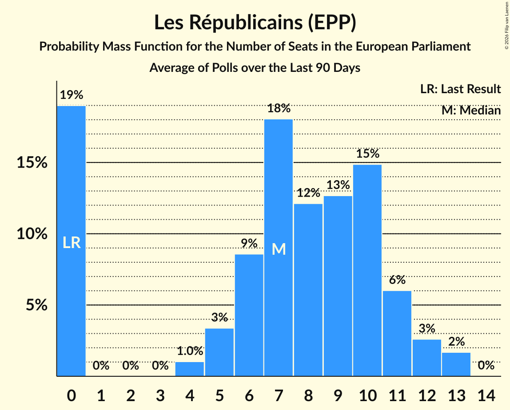

# Les Républicains (EPP)

<a href="#voting-intentions">Voting Intentions</a> | <a href="#seats">Seats</a>

## Voting Intentions

Last result: **20.8%** (General Election of 25 May 2014)

### Confidence Intervals

| Period     | Polling firm/Commissioner(s) | Median | 80% Confidence Interval | 90% Confidence Interval | 95% Confidence Interval | 99% Confidence Interval |
|:----------:|:----------------:|:-----------:|:-----------------------:|:-----------------------:|:-----------------------:|:-----------------------:|
| N/A | [Poll Average](average.html) | 13.3% | 11.9–14.8% | 11.6–15.3% | 11.4–15.7% | 11.1–16.4% |
| [23–26 April 2019](2019-04-26-Ifop-Fiducial.html) | Ifop-Fiducial   CNews, Paris Match and Sud Radio | 14.9% | 13.8–16.2% | 13.4–16.6% | 13.2–16.9% | 12.6–17.6% |
| [25–26 April 2019](2019-04-26-HarrisInteractive.html) | Harris Interactive   LCI, Le Figaro, RTL and TF1 | 13.8% | 12.5–15.2% | 12.2–15.7% | 11.9–16.0% | 11.3–16.7% |
| [20–24 April 2019](2019-04-24-Ifop-Fiducial.html) | Ifop-Fiducial   CNews, Paris Match and Sud Radio | 15.0% | 13.8–16.3% | 13.5–16.7% | 13.2–17.0% | 12.7–17.6% |
| [17–23 April 2019](2019-04-23-OpinionWay–Tilder.html) | OpinionWay–Tilder   Les Echos and Radio Classique | 13.6% | 12.6–14.6% | 12.4–14.9% | 12.1–15.2% | 11.7–15.7% |
| [19–23 April 2019](2019-04-23-Ifop-Fiducial.html) | Ifop-Fiducial   CNews, Paris Match and Sud Radio | 14.5% | 13.4–15.8% | 13.0–16.2% | 12.8–16.5% | 12.2–17.1% |
| [18–22 April 2019](2019-04-22-Ipsos.html) | Ipsos   Le CEVIPOF, La Fondation Jean Jaurès and Le Monde | 13.5% | 13.0–14.0% | 12.9–14.1% | 12.8–14.2% | 12.6–14.5% |
| [15–21 April 2019](2019-04-21-BVA.html) | BVA   Europe 1 and La Tribune | 13.0% | 12.1–13.9% | 11.9–14.1% | 11.7–14.3% | 11.3–14.8% |
| [16–19 April 2019](2019-04-19-Ifop-Fiducial.html) | Ifop-Fiducial   CNews, Paris Match and Sud Radio | 14.0% | 12.9–15.3% | 12.6–15.7% | 12.3–16.0% | 11.8–16.6% |
| [15–18 April 2019](2019-04-18-Ifop-Fiducial.html) | Ifop-Fiducial   CNews, Paris Match and Sud Radio | 13.5% | 12.4–14.8% | 12.0–15.1% | 11.8–15.5% | 11.2–16.1% |
| [13–17 April 2019](2019-04-17-Ifop-Fiducial.html) | Ifop-Fiducial   CNews, Paris Match and Sud Radio | 13.5% | 12.3–14.8% | 12.0–15.1% | 11.8–15.4% | 11.2–16.0% |
| [12–16 April 2019](2019-04-16-Ifop-Fiducial.html) | Ifop-Fiducial   CNews, Paris Match and Sud Radio | 13.0% | 11.8–14.2% | 11.5–14.6% | 11.3–14.9% | 10.8–15.5% |
| [11–15 April 2019](2019-04-15-Ifop-Fiducial.html) | Ifop-Fiducial   CNews, Paris Match and Sud Radio | 13.0% | 11.9–14.2% | 11.6–14.6% | 11.3–14.9% | 10.8–15.5% |
| [12–13 April 2019](2019-04-13-HarrisInteractive.html) | Harris Interactive   LCI, Le Figaro, RTL and TF1 | 14.0% | 12.7–15.4% | 12.3–15.9% | 12.0–16.2% | 11.4–16.9% |
| [9–12 April 2019](2019-04-12-Ifop-Fiducial.html) | Ifop-Fiducial   CNews, Paris Match and Sud Radio | 13.0% | 11.9–14.2% | 11.6–14.5% | 11.3–14.8% | 10.8–15.5% |
| [8–11 April 2019](2019-04-11-Ifop-Fiducial.html) | Ifop-Fiducial   CNews, Paris Match and Sud Radio | 13.5% | 12.4–14.7% | 12.0–15.1% | 11.8–15.4% | 11.3–16.0% |
| [10–11 April 2019](2019-04-11-BVA.html) | BVA   Europe 1 and La Tribune | 13.6% | 12.5–14.9% | 12.2–15.2% | 11.9–15.5% | 11.4–16.1% |
| [6–10 April 2019](2019-04-10-Ifop-Fiducial.html) | Ifop-Fiducial   CNews, Paris Match and Sud Radio | 13.5% | 12.4–14.7% | 12.1–15.1% | 11.8–15.4% | 11.3–16.0% |
| [5–9 April 2019](2019-04-09-Ifop-Fiducial.html) | Ifop-Fiducial   CNews, Paris Match and Sud Radio | 13.0% | 11.9–14.2% | 11.6–14.5% | 11.3–14.8% | 10.8–15.4% |
| [4–8 April 2019](2019-04-08-Ifop-Fiducial.html) | Ifop-Fiducial   CNews, Paris Match and Sud Radio | 13.0% | 11.9–14.2% | 11.6–14.6% | 11.3–14.9% | 10.8–15.5% |
| [5–6 April 2019](2019-04-06-HarrisInteractive.html) | Harris Interactive   LCI, Le Figaro, RTL and TF1 | 13.0% | N/A | N/A | N/A | N/A |
| [2–5 April 2019](2019-04-05-Ifop-Fiducial.html) | Ifop-Fiducial   CNews, Paris Match and Sud Radio | 13.0% | 11.9–14.3% | 11.6–14.6% | 11.3–14.9% | 10.8–15.5% |
| [1–4 April 2019](2019-04-04-Ifop-Fiducial.html) | Ifop-Fiducial   CNews, Paris Match and Sud Radio | 13.0% | 11.9–14.2% | 11.6–14.5% | 11.3–14.9% | 10.8–15.5% |
| [30 March–3 April 2019](2019-04-03-Ifop-Fiducial.html) | Ifop-Fiducial   CNews, Paris Match and Sud Radio | 13.0% | 11.9–14.2% | 11.6–14.6% | 11.3–14.9% | 10.8–15.5% |
| [29 March–2 April 2019](2019-04-02-Ifop-Fiducial.html) | Ifop-Fiducial   CNews, Paris Match and Sud Radio | 13.5% | 12.4–14.8% | 12.1–15.1% | 11.8–15.4% | 11.3–16.0% |
| [28 March–1 April 2019](2019-04-01-Ifop-Fiducial.html) | Ifop-Fiducial   CNews, Paris Match and Sud Radio | 14.0% | 12.9–15.3% | 12.5–15.7% | 12.3–16.0% | 11.7–16.6% |
| [26–29 March 2019](2019-03-29-Ifop-Fiducial.html) | Ifop-Fiducial   CNews, Paris Match and Sud Radio | 14.0% | 12.8–15.3% | 12.5–15.6% | 12.2–15.9% | 11.7–16.6% |
| [25–28 March 2019](2019-03-28-Ifop-Fiducial.html) | Ifop-Fiducial   CNews, Paris Match and Sud Radio | 14.0% | 12.8–15.2% | 12.5–15.6% | 12.2–15.9% | 11.7–16.5% |
| [22–27 March 2019](2019-03-27-Ifop-Fiducial.html) | Ifop-Fiducial   CNews, Paris Match and Sud Radio | 14.5% | 13.5–15.6% | 13.2–15.9% | 13.0–16.2% | 12.5–16.7% |
| [25–27 March 2019](2019-03-27-ELABE.html) | ELABE   BFMTV | 14.0% | 12.8–15.3% | 12.4–15.7% | 12.1–16.1% | 11.6–16.8% |
| [20–26 March 2019](2019-03-26-OpinionWay–Tilder.html) | OpinionWay–Tilder   Les Echos and Radio Classique | 13.0% | 12.1–14.1% | 11.8–14.4% | 11.6–14.6% | 11.1–15.1% |
| [22–26 March 2019](2019-03-26-Ifop-Fiducial.html) | Ifop-Fiducial   CNews, Paris Match and Sud Radio | 14.0% | 12.8–15.2% | 12.5–15.6% | 12.3–15.9% | 11.7–16.5% |
| [21–25 March 2019](2019-03-25-Ifop-Fiducial.html) | Ifop-Fiducial   CNews, Paris Match and Sud Radio | 14.0% | 12.8–15.2% | 12.5–15.6% | 12.3–15.9% | 11.7–16.5% |
| [22–23 March 2019](2019-03-23-HarrisInteractive.html) | Harris Interactive   LCI, Le Figaro, RTL and TF1 | 13.0% | 11.8–14.4% | 11.4–14.8% | 11.1–15.2% | 10.5–15.9% |
| [19–22 March 2019](2019-03-22-Ifop-Fiducial.html) | Ifop-Fiducial   CNews, Paris Match and Sud Radio | 13.5% | 12.4–14.8% | 12.1–15.1% | 11.8–15.4% | 11.3–16.0% |
| [19–22 March 2019](2019-03-22-BVA.html) | BVA   Europe 1 and La Tribune | 13.5% | 12.4–14.8% | 12.1–15.1% | 11.8–15.4% | 11.3–16.0% |
| [15–21 March 2019](2019-03-21-Ipsos.html) | Ipsos   Le CEVIPOF, La Fondation Jean Jaurès and Le Monde | 12.0% | 11.5–12.6% | 11.3–12.7% | 11.2–12.9% | 10.9–13.1% |
| [18–21 March 2019](2019-03-21-Ifop-Fiducial.html) | Ifop-Fiducial   CNews, Paris Match and Sud Radio | 13.0% | 11.9–14.2% | 11.6–14.6% | 11.3–14.8% | 10.8–15.5% |
| [16–20 March 2019](2019-03-20-Ifop-Fiducial.html) | Ifop-Fiducial   CNews, Paris Match and Sud Radio | 13.0% | 11.9–14.2% | 11.6–14.6% | 11.4–14.9% | 10.9–15.5% |
| [15–19 March 2019](2019-03-19-Ifop-Fiducial.html) | Ifop-Fiducial   CNews, Paris Match and Sud Radio | 13.0% | 11.9–14.2% | 11.6–14.6% | 11.3–14.9% | 10.8–15.5% |
| [14–18 March 2019](2019-03-18-Ifop-Fiducial.html) | Ifop-Fiducial   CNews, Paris Match and Sud Radio | 13.5% | 12.4–14.7% | 12.1–15.1% | 11.8–15.4% | 11.3–16.0% |
| [12–15 March 2019](2019-03-15-Ifop-Fiducial.html) | Ifop-Fiducial   CNews, Paris Match and Sud Radio | 13.5% | 12.4–14.8% | 12.1–15.1% | 11.8–15.4% | 11.3–16.0% |
| [10–14 March 2019](2019-03-14-Ifop-Fiducial.html) | Ifop-Fiducial   CNews, Paris Match and Sud Radio | 13.5% | 12.4–14.7% | 12.1–15.1% | 11.8–15.4% | 11.3–16.0% |
| [9–13 March 2019](2019-03-13-Ifop-Fiducial.html) | Ifop-Fiducial   CNews, Paris Match and Sud Radio | 13.0% | 11.9–14.2% | 11.6–14.6% | 11.3–14.9% | 10.8–15.5% |
| [8–12 March 2019](2019-03-12-Ifop-Fiducial.html) | Ifop-Fiducial   CNews, Paris Match and Sud Radio | 12.5% | 11.4–13.7% | 11.1–14.0% | 10.8–14.3% | 10.3–14.9% |
| [7–11 March 2019](2019-03-11-Ifop-Fiducial.html) | Ifop-Fiducial   CNews, Paris Match and Sud Radio | 12.5% | 11.4–13.7% | 11.1–14.0% | 10.8–14.3% | 10.3–14.9% |
| [8–9 March 2019](2019-03-09-HarrisInteractive.html) | Harris Interactive   LCI, Le Figaro, RTL and TF1 | 14.0% | N/A | N/A | N/A | N/A |
| [5–8 March 2019](2019-03-08-Ifop-Fiducial.html) | Ifop-Fiducial   CNews, Paris Match and Sud Radio | 13.0% | N/A | N/A | N/A | N/A |
| [4–7 March 2019](2019-03-07-Ifop-Fiducial.html) | Ifop-Fiducial   CNews, Paris Match and Sud Radio | 13.0% | N/A | N/A | N/A | N/A |
| [20–27 February 2019](2019-02-27-OpinionWay–Tilder.html) | OpinionWay–Tilder   Les Echos and Radio Classique | 14.0% | N/A | N/A | N/A | N/A |
| [25–27 February 2019](2019-02-27-ELABE.html) | ELABE   BFMTV | 13.0% | N/A | N/A | N/A | N/A |
| [22–23 February 2019](2019-02-23-HarrisInteractive.html) | Harris Interactive   LCI, Le Figaro, RTL and TF1 | 12.0% | N/A | N/A | N/A | N/A |
| [15–21 February 2019](2019-02-21-Ipsos.html) | Ipsos   Le Monde | 12.0% | N/A | N/A | N/A | N/A |
| [20–21 February 2019](2019-02-21-Ifop.html) | Ifop   SWG | 10.0% | N/A | N/A | N/A | N/A |
| [20–21 February 2019](2019-02-21-BVA.html) | BVA   La Tribune and RTL | 10.0% | N/A | N/A | N/A | N/A |
| [13–15 February 2019](2019-02-15-Ifop-Fiducial.html) | Ifop-Fiducial   CNews, Paris Match and Sud Radio | 10.0% | N/A | N/A | N/A | N/A |
| [17–25 January 2019](2019-01-25-OpinionWay–Tilder.html) | OpinionWay–Tilder   Les Echos and Radio Classique | 12.0% | N/A | N/A | N/A | N/A |
| [22–23 January 2019](2019-01-23-ELABE.html) | ELABE   BFMTV | 12.5% | N/A | N/A | N/A | N/A |
| [8–9 January 2019](2019-01-09-Ifop-Fiducial.html) | Ifop-Fiducial   Valeurs Actuelles and Sud Radio | 10.0% | N/A | N/A | N/A | N/A |
| [19–20 December 2018](2018-12-20-Odoxa.html) | Odoxa   France Info | 8.1% | 6.8–9.7% | 6.4–10.1% | 6.1–10.5% | 5.6–11.3% |
| [7–10 December 2018](2018-12-10-Ifop.html) | Ifop   L’Opinion | 11.0% | N/A | N/A | N/A | N/A |
| [5–6 December 2018](2018-12-06-Ipsos.html) | Ipsos   La République en Marche | 12.5% | N/A | N/A | N/A | N/A |
| [26 November–6 December 2018](2018-12-06-BVA.html) | BVA   Presse régionale | 12.0% | N/A | N/A | N/A | N/A |
| [3–4 December 2018](2018-12-04-Ifop.html) | Ifop   Place publique | 12.5% | N/A | N/A | N/A | N/A |
| [9–12 November 2018](2018-11-12-Ifop.html) | Ifop | 13.0% | N/A | N/A | N/A | N/A |
| [6–7 November 2018](2018-11-07-ELABE.html) | ELABE   BFMTV | 15.0% | N/A | N/A | N/A | N/A |
| [30–31 October 2018](2018-10-31-Ifop.html) | Ifop   La Lettre de l’Expansion | 13.0% | N/A | N/A | N/A | N/A |
| [12–13 September 2018](2018-09-13-Odoxa.html) | Odoxa   France Info and Le Figaro | 14.0% | N/A | N/A | N/A | N/A |
| [30–31 August 2018](2018-08-31-Ifop-Fiducial.html) | Ifop-Fiducial   Paris Match and Sud Radio | 15.0% | N/A | N/A | N/A | N/A |
| [27 June–2 July 2018](2018-07-02-Ipsos.html) | Ipsos   Le Monde | 15.0% | N/A | N/A | N/A | N/A |
| [25–27 June 2018](2018-06-27-Ifop-Fiducial.html) | Ifop-Fiducial   CNews and Sud Radio | 15.0% | N/A | N/A | N/A | N/A |
| [29–30 May 2018](2018-05-30-ELABE.html) | ELABE   BFMTV | 15.0% | N/A | N/A | N/A | N/A |
| [22–23 May 2018](2018-05-23-HarrisInteractive.html) | Harris Interactive   LCP – Assemblée nationale | 13.0% | N/A | N/A | N/A | N/A |
| [7–11 May 2018](2018-05-11-Viavoice.html) | Viavoice   Europe Écologie Les Verts | 12.0% | N/A | N/A | N/A | N/A |
| [7–9 May 2018](2018-05-09-Ifop.html) | Ifop   Valeurs Actuelles | 13.0% | N/A | N/A | N/A | N/A |
| [29 November–1 December 2017](2017-12-01-Ifop.html) | Ifop   Le Figaro | 12.0% | 10.8–13.4% | 10.4–13.8% | 10.2–14.2% | 9.6–14.9% |

### Probability Mass Function

The following table shows the probability mass function per percentage block of voting intentions for the [poll average](average.html) for Les Républicains (EPP).

| Voting Intentions | Probability | Accumulated | Special Marks |
|:-----------------:|:-----------:|:-----------:|:-------------:|
| 9.5–10.5% | 0% | 100% |  |
| 10.5–11.5% | 4% | 100% |  |
| 11.5–12.5% | 24% | 96% |  |
| 12.5–13.5% | 31% | 72% | Median |
| 13.5–14.5% | 27% | 41% |  |
| 14.5–15.5% | 11% | 14% |  |
| 15.5–16.5% | 3% | 3% |  |
| 16.5–17.5% | 0.3% | 0.4% |  |
| 17.5–18.5% | 0% | 0% |  |
| 18.5–19.5% | 0% | 0% |  |
| 19.5–20.5% | 0% | 0% |  |
| 20.5–21.5% | 0% | 0% | Last Result |

## Seats

Last result: **20** seats (General Election of 25 May 2014)

### Confidence Intervals

| Period     | Polling firm/Commissioner(s) | Median | 80% Confidence Interval | 90% Confidence Interval | 95% Confidence Interval | 99% Confidence Interval |
|:----------:|:----------------:|:------:|:-----------------------:|:-----------------------:|:-----------------------:|:-----------------------:|
| N/A | [Poll Average](average.html) | 12 | 11–14 | 10–15 | 10–15 | 10–15 |
| [23–26 April 2019](2019-04-26-Ifop-Fiducial.html) | Ifop-Fiducial   CNews, Paris Match and Sud Radio | 13 | 13–14 | 13–15 | 13–15 | 12–16 |
| [25–26 April 2019](2019-04-26-HarrisInteractive.html) | Harris Interactive   LCI, Le Figaro, RTL and TF1 | 11 | 11–13 | 11–13 | 11–13 | 11–15 |
| [20–24 April 2019](2019-04-24-Ifop-Fiducial.html) | Ifop-Fiducial   CNews, Paris Match and Sud Radio | 14 | 14 | 14–15 | 13–15 | 12–16 |
| [17–23 April 2019](2019-04-23-OpinionWay–Tilder.html) | OpinionWay–Tilder   Les Echos and Radio Classique | 12 | 11–13 | 11–13 | 11–14 | 11–14 |
| [19–23 April 2019](2019-04-23-Ifop-Fiducial.html) | Ifop-Fiducial   CNews, Paris Match and Sud Radio | 13 | 13–14 | 13–14 | 12–15 | 11–16 |
| [18–22 April 2019](2019-04-22-Ipsos.html) | Ipsos   Le CEVIPOF, La Fondation Jean Jaurès and Le Monde | 12 | 12–13 | 12–13 | 12–13 | 12–13 |
| [15–21 April 2019](2019-04-21-BVA.html) | BVA   Europe 1 and La Tribune | 13 | 11–13 | 11–13 | 11–13 | 11–14 |
| [16–19 April 2019](2019-04-19-Ifop-Fiducial.html) | Ifop-Fiducial   CNews, Paris Match and Sud Radio | 13 | 12–13 | 12–13 | 12–13 | 11–14 |
| [15–18 April 2019](2019-04-18-Ifop-Fiducial.html) | Ifop-Fiducial   CNews, Paris Match and Sud Radio | 12 | 12 | 12 | 11–12 | 11–12 |
| [13–17 April 2019](2019-04-17-Ifop-Fiducial.html) | Ifop-Fiducial   CNews, Paris Match and Sud Radio | 12 | 12 | 12 | 12 | 12 |
| [12–16 April 2019](2019-04-16-Ifop-Fiducial.html) | Ifop-Fiducial   CNews, Paris Match and Sud Radio | 14 | 14 | 12–14 | 12–14 | 12–14 |
| [11–15 April 2019](2019-04-15-Ifop-Fiducial.html) | Ifop-Fiducial   CNews, Paris Match and Sud Radio | 11 | 10–15 | 10–15 | 10–15 | 10–15 |
| [12–13 April 2019](2019-04-13-HarrisInteractive.html) | Harris Interactive   LCI, Le Figaro, RTL and TF1 | 11 | 11–13 | 11–14 | 11–14 | 11–15 |
| [9–12 April 2019](2019-04-12-Ifop-Fiducial.html) | Ifop-Fiducial   CNews, Paris Match and Sud Radio | 12 | 11–14 | 11–14 | 11–14 | 10–14 |
| [8–11 April 2019](2019-04-11-Ifop-Fiducial.html) | Ifop-Fiducial   CNews, Paris Match and Sud Radio | 13 | 12–14 | 11–14 | 10–15 | 10–16 |
| [10–11 April 2019](2019-04-11-BVA.html) | BVA   Europe 1 and La Tribune | 14 | 12–14 | 12–14 | 12–14 | 11–14 |
| [6–10 April 2019](2019-04-10-Ifop-Fiducial.html) | Ifop-Fiducial   CNews, Paris Match and Sud Radio | 13 | 11–15 | 11–15 | 11–15 | 11–15 |
| [5–9 April 2019](2019-04-09-Ifop-Fiducial.html) | Ifop-Fiducial   CNews, Paris Match and Sud Radio | 10 | 10–13 | 10–13 | 10–13 | 10–14 |
| [4–8 April 2019](2019-04-08-Ifop-Fiducial.html) | Ifop-Fiducial   CNews, Paris Match and Sud Radio | 12 | 12 | 11–12 | 11–13 | 10–14 |
| [5–6 April 2019](2019-04-06-HarrisInteractive.html) | Harris Interactive   LCI, Le Figaro, RTL and TF1 |  |  |  |  |  |
| [2–5 April 2019](2019-04-05-Ifop-Fiducial.html) | Ifop-Fiducial   CNews, Paris Match and Sud Radio | 12 | 12–14 | 12–14 | 10–14 | 10–14 |
| [1–4 April 2019](2019-04-04-Ifop-Fiducial.html) | Ifop-Fiducial   CNews, Paris Match and Sud Radio | 11 | 11–13 | 10–14 | 10–14 | 10–14 |
| [30 March–3 April 2019](2019-04-03-Ifop-Fiducial.html) | Ifop-Fiducial   CNews, Paris Match and Sud Radio | 11 | 10–11 | 10–13 | 9–13 | 9–15 |
| [29 March–2 April 2019](2019-04-02-Ifop-Fiducial.html) | Ifop-Fiducial   CNews, Paris Match and Sud Radio | 13 | 12–13 | 12–13 | 11–13 | 11–14 |
| [28 March–1 April 2019](2019-04-01-Ifop-Fiducial.html) | Ifop-Fiducial   CNews, Paris Match and Sud Radio | 12 | 12–15 | 12–15 | 12–15 | 12–15 |
| [26–29 March 2019](2019-03-29-Ifop-Fiducial.html) | Ifop-Fiducial   CNews, Paris Match and Sud Radio | 10 | 10 | 10–12 | 10–12 | 10–13 |
| [25–28 March 2019](2019-03-28-Ifop-Fiducial.html) | Ifop-Fiducial   CNews, Paris Match and Sud Radio | 12 | 12 | 12 | 12 | 12 |
| [22–27 March 2019](2019-03-27-Ifop-Fiducial.html) | Ifop-Fiducial   CNews, Paris Match and Sud Radio | 15 | 14–15 | 14–15 | 14–15 | 14–15 |
| [25–27 March 2019](2019-03-27-ELABE.html) | ELABE   BFMTV | 13 | 11–14 | 11–14 | 11–15 | 10–16 |
| [20–26 March 2019](2019-03-26-OpinionWay–Tilder.html) | OpinionWay–Tilder   Les Echos and Radio Classique | 11 | 11–12 | 11–12 | 10–12 | 9–13 |
| [22–26 March 2019](2019-03-26-Ifop-Fiducial.html) | Ifop-Fiducial   CNews, Paris Match and Sud Radio | 14 | 14 | 13–14 | 13–14 | 10–14 |
| [21–25 March 2019](2019-03-25-Ifop-Fiducial.html) | Ifop-Fiducial   CNews, Paris Match and Sud Radio | 12 | 12 | 12 | 12 | 12 |
| [22–23 March 2019](2019-03-23-HarrisInteractive.html) | Harris Interactive   LCI, Le Figaro, RTL and TF1 | 12 | 12 | 12 | 12 | 12 |
| [19–22 March 2019](2019-03-22-Ifop-Fiducial.html) | Ifop-Fiducial   CNews, Paris Match and Sud Radio | 12 | 9–13 | 9–13 | 9–13 | 9–13 |
| [19–22 March 2019](2019-03-22-BVA.html) | BVA   Europe 1 and La Tribune | 12 | 9–13 | 9–13 | 9–13 | 9–13 |
| [15–21 March 2019](2019-03-21-Ipsos.html) | Ipsos   Le CEVIPOF, La Fondation Jean Jaurès and Le Monde | 11 | 10–11 | 10–11 | 10–11 | 10–11 |
| [18–21 March 2019](2019-03-21-Ifop-Fiducial.html) | Ifop-Fiducial   CNews, Paris Match and Sud Radio | 13 | 13 | 13 | 12–13 | 11–14 |
| [16–20 March 2019](2019-03-20-Ifop-Fiducial.html) | Ifop-Fiducial   CNews, Paris Match and Sud Radio | 10 | 10 | 10–11 | 10–11 | 10–13 |
| [15–19 March 2019](2019-03-19-Ifop-Fiducial.html) | Ifop-Fiducial   CNews, Paris Match and Sud Radio | 10 | 10–13 | 10–13 | 10–13 | 10–13 |
| [14–18 March 2019](2019-03-18-Ifop-Fiducial.html) | Ifop-Fiducial   CNews, Paris Match and Sud Radio | 13 | 12–14 | 12–14 | 11–14 | 11–14 |
| [12–15 March 2019](2019-03-15-Ifop-Fiducial.html) | Ifop-Fiducial   CNews, Paris Match and Sud Radio | 10 | 10 | 10–12 | 10–12 | 10–12 |
| [10–14 March 2019](2019-03-14-Ifop-Fiducial.html) | Ifop-Fiducial   CNews, Paris Match and Sud Radio | 12 | 12 | 10–12 | 10–16 | 10–16 |
| [9–13 March 2019](2019-03-13-Ifop-Fiducial.html) | Ifop-Fiducial   CNews, Paris Match and Sud Radio | 12 | 12 | 12 | 12 | 12 |
| [8–12 March 2019](2019-03-12-Ifop-Fiducial.html) | Ifop-Fiducial   CNews, Paris Match and Sud Radio | 11 | 11–12 | 11–12 | 11–12 | 8–12 |
| [7–11 March 2019](2019-03-11-Ifop-Fiducial.html) | Ifop-Fiducial   CNews, Paris Match and Sud Radio | 13 | 13 | 10–13 | 10–13 | 10–13 |
| [8–9 March 2019](2019-03-09-HarrisInteractive.html) | Harris Interactive   LCI, Le Figaro, RTL and TF1 |  |  |  |  |  |
| [5–8 March 2019](2019-03-08-Ifop-Fiducial.html) | Ifop-Fiducial   CNews, Paris Match and Sud Radio |  |  |  |  |  |
| [4–7 March 2019](2019-03-07-Ifop-Fiducial.html) | Ifop-Fiducial   CNews, Paris Match and Sud Radio |  |  |  |  |  |
| [20–27 February 2019](2019-02-27-OpinionWay–Tilder.html) | OpinionWay–Tilder   Les Echos and Radio Classique |  |  |  |  |  |
| [25–27 February 2019](2019-02-27-ELABE.html) | ELABE   BFMTV |  |  |  |  |  |
| [22–23 February 2019](2019-02-23-HarrisInteractive.html) | Harris Interactive   LCI, Le Figaro, RTL and TF1 |  |  |  |  |  |
| [15–21 February 2019](2019-02-21-Ipsos.html) | Ipsos   Le Monde |  |  |  |  |  |
| [20–21 February 2019](2019-02-21-Ifop.html) | Ifop   SWG |  |  |  |  |  |
| [20–21 February 2019](2019-02-21-BVA.html) | BVA   La Tribune and RTL |  |  |  |  |  |
| [13–15 February 2019](2019-02-15-Ifop-Fiducial.html) | Ifop-Fiducial   CNews, Paris Match and Sud Radio |  |  |  |  |  |
| [17–25 January 2019](2019-01-25-OpinionWay–Tilder.html) | OpinionWay–Tilder   Les Echos and Radio Classique |  |  |  |  |  |
| [22–23 January 2019](2019-01-23-ELABE.html) | ELABE   BFMTV |  |  |  |  |  |
| [8–9 January 2019](2019-01-09-Ifop-Fiducial.html) | Ifop-Fiducial   Valeurs Actuelles and Sud Radio |  |  |  |  |  |
| [19–20 December 2018](2018-12-20-Odoxa.html) | Odoxa   France Info | 8 | 8 | 8 | 8 | 8 |
| [7–10 December 2018](2018-12-10-Ifop.html) | Ifop   L’Opinion |  |  |  |  |  |
| [5–6 December 2018](2018-12-06-Ipsos.html) | Ipsos   La République en Marche |  |  |  |  |  |
| [26 November–6 December 2018](2018-12-06-BVA.html) | BVA   Presse régionale |  |  |  |  |  |
| [3–4 December 2018](2018-12-04-Ifop.html) | Ifop   Place publique |  |  |  |  |  |
| [9–12 November 2018](2018-11-12-Ifop.html) | Ifop |  |  |  |  |  |
| [6–7 November 2018](2018-11-07-ELABE.html) | ELABE   BFMTV |  |  |  |  |  |
| [30–31 October 2018](2018-10-31-Ifop.html) | Ifop   La Lettre de l’Expansion |  |  |  |  |  |
| [12–13 September 2018](2018-09-13-Odoxa.html) | Odoxa   France Info and Le Figaro |  |  |  |  |  |
| [30–31 August 2018](2018-08-31-Ifop-Fiducial.html) | Ifop-Fiducial   Paris Match and Sud Radio |  |  |  |  |  |
| [27 June–2 July 2018](2018-07-02-Ipsos.html) | Ipsos   Le Monde |  |  |  |  |  |
| [25–27 June 2018](2018-06-27-Ifop-Fiducial.html) | Ifop-Fiducial   CNews and Sud Radio |  |  |  |  |  |
| [29–30 May 2018](2018-05-30-ELABE.html) | ELABE   BFMTV |  |  |  |  |  |
| [22–23 May 2018](2018-05-23-HarrisInteractive.html) | Harris Interactive   LCP – Assemblée nationale |  |  |  |  |  |
| [7–11 May 2018](2018-05-11-Viavoice.html) | Viavoice   Europe Écologie Les Verts |  |  |  |  |  |
| [7–9 May 2018](2018-05-09-Ifop.html) | Ifop   Valeurs Actuelles |  |  |  |  |  |
| [29 November–1 December 2017](2017-12-01-Ifop.html) | Ifop   Le Figaro | 10 | 10–11 | 10–11 | 10–11 | 10–11 |

### Probability Mass Function

The following table shows the probability mass function per seat for the [poll average](average.html) for Les Républicains (EPP).

| Number of Seats | Probability | Accumulated | Special Marks |
|:---------------:|:-----------:|:-----------:|:-------------:|
| 9 | 0.1% | 100% |  |
| 10 | 8% | 99.9% |  |
| 11 | 42% | 92% |  |
| 12 | 17% | 51% | Median |
| 13 | 9% | 34% |  |
| 14 | 17% | 25% |  |
| 15 | 7% | 7% |  |
| 16 | 0.3% | 0.3% |  |
| 17 | 0% | 0% |  |
| 18 | 0% | 0% |  |
| 19 | 0% | 0% |  |
| 20 | 0% | 0% | Last Result |

