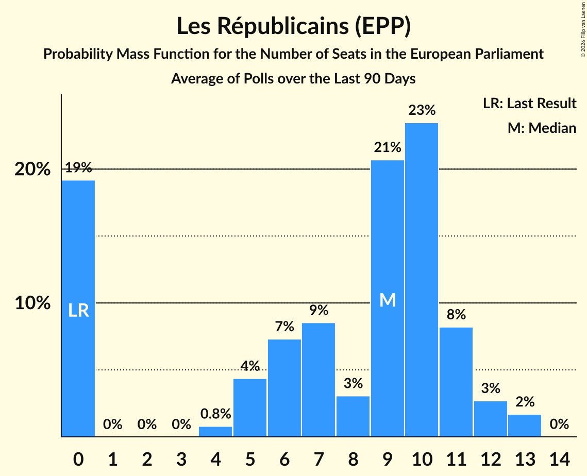

# Les Républicains (EPP)

<a href="#voting-intentions">Voting Intentions</a> | <a href="#seats">Seats</a>

## Voting Intentions

Last result: **0.0%** (General Election of 9 June 2024)

### Confidence Intervals

| Period     | Polling firm/Commissioner(s) | Median | 80% Confidence Interval | 90% Confidence Interval | 95% Confidence Interval | 99% Confidence Interval |
|:----------:|:----------------:|:-----------:|:-----------------------:|:-----------------------:|:-----------------------:|:-----------------------:|
| N/A | [Poll Average](average.html) | 10.6% | 5.8–12.3% | 5.5–12.7% | 5.3–13.1% | 4.9–13.9% |
| [26–27 March 2026](2026-03-27-OpinionWay.html) | OpinionWay | 11.5% | 10.3–12.9% | 10.0–13.3% | 9.7–13.6% | 9.1–14.3% |
| [25–27 March 2026](2026-03-27-ELABE.html) | ELABE   BFMTV and La Tribune Dimanche | 6.1% | 5.4–7.0% | 5.2–7.3% | 5.0–7.5% | 4.6–7.9% |
| [25–26 March 2026](2026-03-26-Odoxa.html) | Odoxa   Public Sénat | 4.0% | N/A | N/A | N/A | N/A |
| [22 March 2026](2026-03-22-HarrisInteractive.html) | Harris Interactive   M6 and RTL | 8.4% | N/A | N/A | N/A | N/A |
| [26–27 February 2026](2026-02-27-Ifop–Fiducial.html) | Ifop–Fiducial   Le Figaro and Sud Radio | 10.9% | 9.8–12.1% | 9.4–12.5% | 9.2–12.8% | 8.7–13.5% |
| [18–20 November 2025](2025-11-20-Verian.html) | Verian | 7.5% | 6.5–8.7% | 6.2–9.0% | 5.9–9.3% | 5.5–9.9% |
| [19–20 November 2025](2025-11-20-Odoxa.html) | Odoxa   Public Sénat | 9.1% | 8.1–10.3% | 7.8–10.6% | 7.6–10.9% | 7.1–11.5% |
| [30–31 October 2025](2025-10-31-ELABE.html) | ELABE   BFMTV and La Tribune Dimanche | 6.1% | 5.4–7.0% | 5.2–7.3% | 5.0–7.5% | 4.7–7.9% |
| [7 October 2025](2025-10-07-HarrisInteractive.html) | Harris Interactive   RTL | 10.4% | 9.3–11.7% | 9.0–12.1% | 8.8–12.4% | 8.3–13.0% |
| [30 September–1 October 2025](2025-10-01-Cluster17.html) | Cluster17   Le Point | 12.5% | 11.5–13.7% | 11.2–14.0% | 10.9–14.3% | 10.5–14.8% |
| [24–25 September 2025](2025-09-25-Ifop–Fiducial.html) | Ifop–Fiducial   L’Opinion and Sud Radio | 11.3% | 10.2–12.6% | 9.9–13.0% | 9.6–13.3% | 9.1–14.0% |
| [19–20 May 2025](2025-05-20-Ifop–Fiducial.html) | Ifop–Fiducial   Le Figaro and Sud Radio | 16.0% | N/A | N/A | N/A | N/A |
| [19 May 2025](2025-05-19-HarrisInteractive.html) | Harris Interactive   LCI | 14.9% | N/A | N/A | N/A | N/A |
| [11–30 April 2025](2025-04-30-Ifop.html) | Ifop   Hexagone | 8.0% | N/A | N/A | N/A | N/A |
| [23–24 April 2025](2025-04-24-Odoxa.html) | Odoxa   Public Sénat | 9.5% | N/A | N/A | N/A | N/A |
| [2–4 April 2025](2025-04-04-ELABE.html) | ELABE   BFMTV and La Tribune Dimanche | 7.4% | N/A | N/A | N/A | N/A |
| [31 March 2025](2025-03-31-HarrisInteractive.html) | Harris Interactive   RTL | 5.4% | N/A | N/A | N/A | N/A |
| [26–27 March 2025](2025-03-27-Ifop.html) | Ifop   Le Journal du Dimanche | 7.2% | N/A | N/A | N/A | N/A |
| [6–9 December 2024](2024-12-09-Ifop–Fiducial.html) | Ifop–Fiducial   Le Figaro and Sud Radio | 6.6% | N/A | N/A | N/A | N/A |
| [11–12 September 2024](2024-09-12-OpinionWay.html) | OpinionWay | 5.1% | N/A | N/A | N/A | N/A |
| [6–9 September 2024](2024-09-09-Ifop–Fiducial.html) | Ifop–Fiducial   Sud Radio | 6.4% | N/A | N/A | N/A | N/A |
| [7–8 July 2024](2024-07-08-HarrisInteractive.html) | Harris Interactive   Challenges, M6 and RTL | 5.0% | N/A | N/A | N/A | N/A |

### Probability Mass Function

The following table shows the probability mass function per percentage block of voting intentions for the [poll average](average.html) for Les Républicains (EPP).

| Voting Intentions | Probability | Accumulated | Special Marks |
|:-----------------:|:-----------:|:-----------:|:-------------:|
| 0.0–0.5% | 0% | 100% | Last Result |
| 0.5–1.5% | 0% | 100% |  |
| 1.5–2.5% | 0% | 100% |  |
| 2.5–3.5% | 0% | 100% |  |
| 3.5–4.5% | 0.1% | 100% |  |
| 4.5–5.5% | 5% | 99.9% |  |
| 5.5–6.5% | 19% | 95% |  |
| 6.5–7.5% | 8% | 76% |  |
| 7.5–8.5% | 0.8% | 67% |  |
| 8.5–9.5% | 3% | 67% |  |
| 9.5–10.5% | 14% | 64% |  |
| 10.5–11.5% | 25% | 50% | Median |
| 11.5–12.5% | 18% | 25% |  |
| 12.5–13.5% | 6% | 7% |  |
| 13.5–14.5% | 1.0% | 1.1% |  |
| 14.5–15.5% | 0.1% | 0.1% |  |
| 15.5–16.5% | 0% | 0% |  |

## Seats

Last result: **0** seats (General Election of 9 June 2024)

### Confidence Intervals

| Period     | Polling firm/Commissioner(s) | Median | 80% Confidence Interval | 90% Confidence Interval | 95% Confidence Interval | 99% Confidence Interval |
|:----------:|:----------------:|:------:|:-----------------------:|:-----------------------:|:-----------------------:|:-----------------------:|
| N/A | [Poll Average](average.html) | 9 | 7–11 | 6–12 | 5–13 | 5–13 |
| [26–27 March 2026](2026-03-27-OpinionWay.html) | OpinionWay | 9 | 8–11 | 8–11 | 8–11 | 7–12 |
| [25–27 March 2026](2026-03-27-ELABE.html) | ELABE   BFMTV and La Tribune Dimanche | 7 | 5–7 | 5–7 | 5–7 | 5–7 |
| [25–26 March 2026](2026-03-26-Odoxa.html) | Odoxa   Public Sénat |  |  |  |  |  |
| [22 March 2026](2026-03-22-HarrisInteractive.html) | Harris Interactive   M6 and RTL |  |  |  |  |  |
| [26–27 February 2026](2026-02-27-Ifop–Fiducial.html) | Ifop–Fiducial   Le Figaro and Sud Radio | 10 | 9–12 | 9–13 | 9–13 | 8–13 |
| [18–20 November 2025](2025-11-20-Verian.html) | Verian | 7 | 6–8 | 5–8 | 5–8 | 5–9 |
| [19–20 November 2025](2025-11-20-Odoxa.html) | Odoxa   Public Sénat | 8 | 7–9 | 6–9 | 6–10 | 6–10 |
| [30–31 October 2025](2025-10-31-ELABE.html) | ELABE   BFMTV and La Tribune Dimanche | 5 | 5–6 | 4–7 | 0–7 | 0–7 |
| [7 October 2025](2025-10-07-HarrisInteractive.html) | Harris Interactive   RTL | 9 | 8–10 | 8–10 | 7–11 | 7–12 |
| [30 September–1 October 2025](2025-10-01-Cluster17.html) | Cluster17   Le Point | 11 | 11–13 | 10–13 | 10–13 | 9–14 |
| [24–25 September 2025](2025-09-25-Ifop–Fiducial.html) | Ifop–Fiducial   L’Opinion and Sud Radio | 11 | 10–12 | 9–12 | 9–12 | 8–13 |
| [19–20 May 2025](2025-05-20-Ifop–Fiducial.html) | Ifop–Fiducial   Le Figaro and Sud Radio |  |  |  |  |  |
| [19 May 2025](2025-05-19-HarrisInteractive.html) | Harris Interactive   LCI |  |  |  |  |  |
| [11–30 April 2025](2025-04-30-Ifop.html) | Ifop   Hexagone |  |  |  |  |  |
| [23–24 April 2025](2025-04-24-Odoxa.html) | Odoxa   Public Sénat |  |  |  |  |  |
| [2–4 April 2025](2025-04-04-ELABE.html) | ELABE   BFMTV and La Tribune Dimanche |  |  |  |  |  |
| [31 March 2025](2025-03-31-HarrisInteractive.html) | Harris Interactive   RTL |  |  |  |  |  |
| [26–27 March 2025](2025-03-27-Ifop.html) | Ifop   Le Journal du Dimanche |  |  |  |  |  |
| [6–9 December 2024](2024-12-09-Ifop–Fiducial.html) | Ifop–Fiducial   Le Figaro and Sud Radio |  |  |  |  |  |
| [11–12 September 2024](2024-09-12-OpinionWay.html) | OpinionWay |  |  |  |  |  |
| [6–9 September 2024](2024-09-09-Ifop–Fiducial.html) | Ifop–Fiducial   Sud Radio |  |  |  |  |  |
| [7–8 July 2024](2024-07-08-HarrisInteractive.html) | Harris Interactive   Challenges, M6 and RTL |  |  |  |  |  |

### Probability Mass Function

The following table shows the probability mass function per seat for the [poll average](average.html) for Les Républicains (EPP).

| Number of Seats | Probability | Accumulated | Special Marks |
|:---------------:|:-----------:|:-----------:|:-------------:|
| 0 | 0.1% | 100% | Last Result |
| 1 | 0% | 99.9% |  |
| 2 | 0% | 99.9% |  |
| 3 | 0% | 99.9% |  |
| 4 | 0% | 99.9% |  |
| 5 | 3% | 99.9% |  |
| 6 | 6% | 97% |  |
| 7 | 24% | 90% |  |
| 8 | 5% | 66% |  |
| 9 | 20% | 62% | Median |
| 10 | 25% | 42% |  |
| 11 | 10% | 17% |  |
| 12 | 4% | 7% |  |
| 13 | 3% | 3% |  |
| 14 | 0% | 0% |  |

