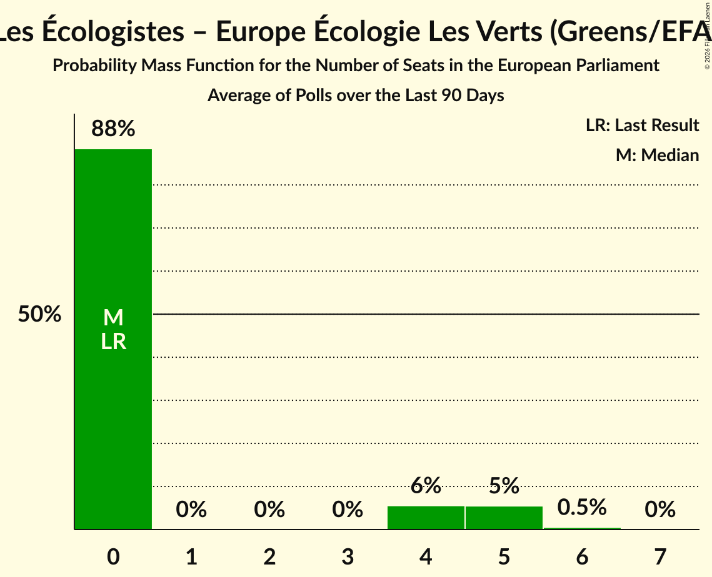

# Les Écologistes – Europe Écologie Les Verts (Greens/EFA)

<a href="#voting-intentions">Voting Intentions</a> | <a href="#seats">Seats</a>

## Voting Intentions

Last result: **0.0%** (General Election of 9 June 2024)

### Confidence Intervals

| Period     | Polling firm/Commissioner(s) | Median | 80% Confidence Interval | 90% Confidence Interval | 95% Confidence Interval | 99% Confidence Interval |
|:----------:|:----------------:|:-----------:|:-----------------------:|:-----------------------:|:-----------------------:|:-----------------------:|
| N/A | [Poll Average](average.html) | 3.1% | 2.3–5.5% | 2.1–5.8% | 2.0–6.1% | 1.7–6.6% |
| [30–31 October 2025](2025-10-31-ELABE.html) | ELABE   BFMTV and La Tribune Dimanche | 5.1% | 4.5–6.0% | 4.3–6.2% | 4.1–6.4% | 3.8–6.8% |
| [7 October 2025](2025-10-07-HarrisInteractive.html) | Harris Interactive   RTL | 3.0% | 2.4–3.8% | 2.3–4.0% | 2.1–4.2% | 1.9–4.6% |
| [30 September–1 October 2025](2025-10-01-Cluster17.html) | Cluster17   Le Point | 2.5% | 2.0–3.1% | 1.9–3.2% | 1.8–3.4% | 1.6–3.7% |
| [24–25 September 2025](2025-09-25-Ifop–Fiducial.html) | Ifop–Fiducial   L’Opinion and Sud Radio | 0.0% | N/A | N/A | N/A | N/A |
| [19–20 May 2025](2025-05-20-Ifop–Fiducial.html) | Ifop–Fiducial   Le Figaro and Sud Radio | 4.5% | N/A | N/A | N/A | N/A |
| [19 May 2025](2025-05-19-HarrisInteractive.html) | Harris Interactive   LCI | 3.0% | N/A | N/A | N/A | N/A |
| [11–30 April 2025](2025-04-30-Ifop.html) | Ifop   Hexagone | 1.9% | N/A | N/A | N/A | N/A |
| [23–24 April 2025](2025-04-24-Odoxa.html) | Odoxa   Public Sénat | 4.0% | N/A | N/A | N/A | N/A |
| [2–4 April 2025](2025-04-04-ELABE.html) | ELABE   BFMTV and La Tribune Dimanche | 4.7% | N/A | N/A | N/A | N/A |
| [31 March 2025](2025-03-31-HarrisInteractive.html) | Harris Interactive   RTL | 4.0% | N/A | N/A | N/A | N/A |
| [26–27 March 2025](2025-03-27-Ifop.html) | Ifop   Le Journal du Dimanche | 3.0% | N/A | N/A | N/A | N/A |
| [6–9 December 2024](2024-12-09-Ifop–Fiducial.html) | Ifop–Fiducial   Le Figaro and Sud Radio | 4.6% | N/A | N/A | N/A | N/A |
| [11–12 September 2024](2024-09-12-OpinionWay.html) | OpinionWay | 0.7% | N/A | N/A | N/A | N/A |
| [6–9 September 2024](2024-09-09-Ifop–Fiducial.html) | Ifop–Fiducial   Sud Radio | 3.1% | N/A | N/A | N/A | N/A |
| [7–8 July 2024](2024-07-08-HarrisInteractive.html) | Harris Interactive   Challenges, M6 and RTL | 3.4% | N/A | N/A | N/A | N/A |

### Probability Mass Function

The following table shows the probability mass function per percentage block of voting intentions for the [poll average](average.html) for Les Écologistes – Europe Écologie Les Verts (Greens/EFA).

| Voting Intentions | Probability | Accumulated | Special Marks |
|:-----------------:|:-----------:|:-----------:|:-------------:|
| 0.0–0.5% | 0% | 100% | Last Result |
| 0.5–1.5% | 0.1% | 100% |  |
| 1.5–2.5% | 22% | 99.9% |  |
| 2.5–3.5% | 38% | 78% | Median |
| 3.5–4.5% | 11% | 40% |  |
| 4.5–5.5% | 20% | 29% |  |
| 5.5–6.5% | 9% | 9% |  |
| 6.5–7.5% | 0.5% | 0.5% |  |
| 7.5–8.5% | 0% | 0% |  |

## Seats

Last result: **0** seats (General Election of 9 June 2024)

### Confidence Intervals

| Period     | Polling firm/Commissioner(s) | Median | 80% Confidence Interval | 90% Confidence Interval | 95% Confidence Interval | 99% Confidence Interval |
|:----------:|:----------------:|:------:|:-----------------------:|:-----------------------:|:-----------------------:|:-----------------------:|
| N/A | [Poll Average](average.html) | 0 | 0–5 | 0–5 | 0–6 | 0–6 |
| [30–31 October 2025](2025-10-31-ELABE.html) | ELABE   BFMTV and La Tribune Dimanche | 4 | 0–5 | 0–6 | 0–6 | 0–6 |
| [7 October 2025](2025-10-07-HarrisInteractive.html) | Harris Interactive   RTL | 0 | 0 | 0 | 0 | 0 |
| [30 September–1 October 2025](2025-10-01-Cluster17.html) | Cluster17   Le Point | 0 | 0 | 0 | 0 | 0 |
| [24–25 September 2025](2025-09-25-Ifop–Fiducial.html) | Ifop–Fiducial   L’Opinion and Sud Radio |  |  |  |  |  |
| [19–20 May 2025](2025-05-20-Ifop–Fiducial.html) | Ifop–Fiducial   Le Figaro and Sud Radio |  |  |  |  |  |
| [19 May 2025](2025-05-19-HarrisInteractive.html) | Harris Interactive   LCI |  |  |  |  |  |
| [11–30 April 2025](2025-04-30-Ifop.html) | Ifop   Hexagone |  |  |  |  |  |
| [23–24 April 2025](2025-04-24-Odoxa.html) | Odoxa   Public Sénat |  |  |  |  |  |
| [2–4 April 2025](2025-04-04-ELABE.html) | ELABE   BFMTV and La Tribune Dimanche |  |  |  |  |  |
| [31 March 2025](2025-03-31-HarrisInteractive.html) | Harris Interactive   RTL |  |  |  |  |  |
| [26–27 March 2025](2025-03-27-Ifop.html) | Ifop   Le Journal du Dimanche |  |  |  |  |  |
| [6–9 December 2024](2024-12-09-Ifop–Fiducial.html) | Ifop–Fiducial   Le Figaro and Sud Radio |  |  |  |  |  |
| [11–12 September 2024](2024-09-12-OpinionWay.html) | OpinionWay |  |  |  |  |  |
| [6–9 September 2024](2024-09-09-Ifop–Fiducial.html) | Ifop–Fiducial   Sud Radio |  |  |  |  |  |
| [7–8 July 2024](2024-07-08-HarrisInteractive.html) | Harris Interactive   Challenges, M6 and RTL |  |  |  |  |  |

### Probability Mass Function

The following table shows the probability mass function per seat for the [poll average](average.html) for Les Écologistes – Europe Écologie Les Verts (Greens/EFA).

| Number of Seats | Probability | Accumulated | Special Marks |
|:---------------:|:-----------:|:-----------:|:-------------:|
| 0 | 83% | 100% | Last Result, Median |
| 1 | 0% | 17% |  |
| 2 | 0% | 17% |  |
| 3 | 0% | 17% |  |
| 4 | 0.9% | 17% |  |
| 5 | 13% | 16% |  |
| 6 | 3% | 3% |  |
| 7 | 0.1% | 0.1% |  |
| 8 | 0% | 0% |  |

