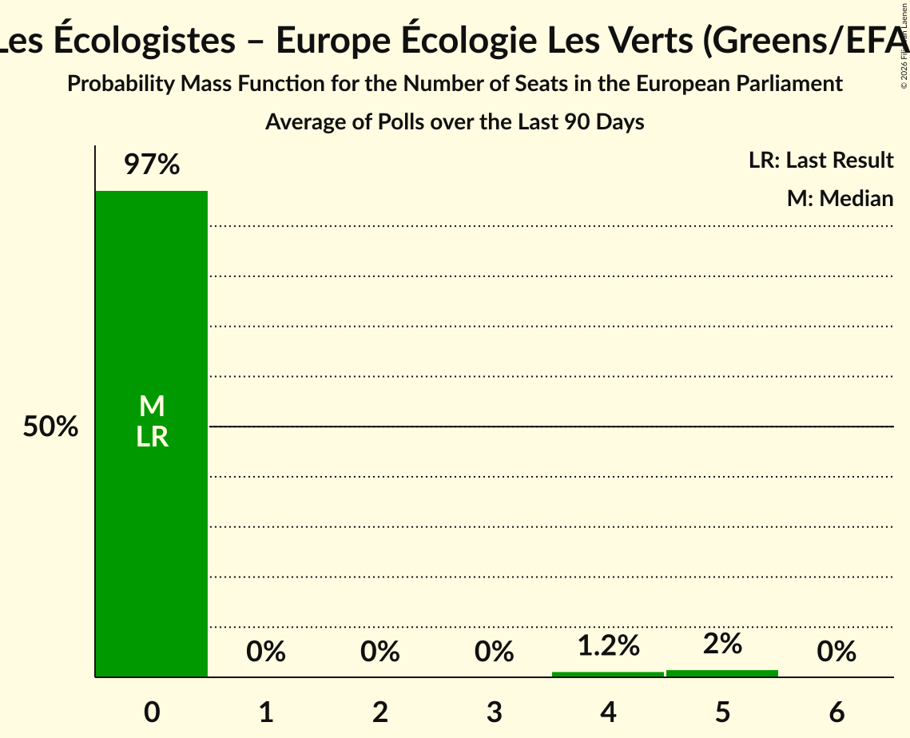

# Les Écologistes – Europe Écologie Les Verts (Greens/EFA)

<a href="#voting-intentions">Voting Intentions</a> | <a href="#seats">Seats</a>

## Voting Intentions

Last result: **0.0%** (General Election of 9 June 2024)

### Confidence Intervals

| Period     | Polling firm/Commissioner(s) | Median | 80% Confidence Interval | 90% Confidence Interval | 95% Confidence Interval | 99% Confidence Interval |
|:----------:|:----------------:|:-----------:|:-----------------------:|:-----------------------:|:-----------------------:|:-----------------------:|
| N/A | [Poll Average](average.html) | 3.6% | 2.4–5.0% | 2.2–5.4% | 2.1–5.7% | 1.8–6.3% |
| [18–19 August 2026](2026-08-19-HarrisInteractive.html) | Harris Interactive   M6 and RTL | 3.4% | 2.8–4.1% | 2.6–4.3% | 2.5–4.5% | 2.2–4.9% |
| [8–10 July 2026](2026-07-10-Verian.html) | Verian   L’Hémicycle | 0.0% | N/A | N/A | N/A | N/A |
| [9–10 July 2026](2026-07-10-ELABE.html) | ELABE   BFMTV and La Tribune Dimanche | 2.5% | 2.1–3.1% | 1.9–3.3% | 1.8–3.5% | 1.6–3.8% |
| [8–9 July 2026](2026-07-09-OpinionWay.html) | OpinionWay   Les Echos | 4.7% | 3.9–5.7% | 3.7–6.0% | 3.5–6.2% | 3.1–6.7% |
| [7–8 July 2026](2026-07-08-Ifop–Fiducial.html) | Ifop–Fiducial   LCI and Le Figaro | 3.7% | 3.1–4.6% | 2.9–4.9% | 2.7–5.1% | 2.4–5.6% |
| [7–8 July 2026](2026-07-08-HarrisInteractive.html) | Harris Interactive   M6 and RTL | 3.3% | 2.8–4.1% | 2.6–4.3% | 2.5–4.5% | 2.2–5.0% |
| [22–24 June 2026](2026-06-24-Ifop–Fiducial.html) | Ifop–Fiducial   LCI, Le Figaro and Sud Radio | 2.5% | 2.1–3.2% | 2.0–3.4% | 1.8–3.5% | 1.6–3.8% |
| [10–11 June 2026](2026-06-11-OpinionWay.html) | OpinionWay   Le Journal du Dimanche | 3.0% | 2.4–3.9% | 2.2–4.1% | 2.1–4.3% | 1.8–4.8% |
| [27–28 May 2026](2026-05-28-Ipsos.html) | Ipsos   Le Parisien | 4.1% | 3.5–4.9% | 3.4–5.1% | 3.2–5.3% | 3.0–5.6% |
| [26–28 May 2026](2026-05-28-Ifop–Fiducial.html) | Ifop–Fiducial   LCI, Le Figaro and Sud Radio | 3.3% | 2.8–4.2% | 2.6–4.4% | 2.5–4.6% | 2.2–5.0% |
| [25–27 May 2026](2026-05-27-HarrisInteractive.html) | Harris Interactive   M6 and RTL | 3.0% | 2.4–3.7% | 2.3–3.9% | 2.1–4.1% | 1.9–4.4% |
| [20–21 May 2026](2026-05-21-Odoxa.html) | Odoxa   Public Sénat | 4.0% | 3.3–4.9% | 3.1–5.2% | 2.9–5.4% | 2.6–5.9% |
| [28–30 April 2026](2026-04-30-HarrisInteractive.html) | Harris Interactive   M6 and RTL | 4.0% | 3.4–4.7% | 3.2–4.9% | 3.1–5.1% | 2.9–5.5% |
| [26–27 March 2026](2026-03-27-OpinionWay.html) | OpinionWay | 0.0% | N/A | N/A | N/A | N/A |
| [25–27 March 2026](2026-03-27-ELABE.html) | ELABE   BFMTV and La Tribune Dimanche | 3.5% | 3.0–4.3% | 2.8–4.5% | 2.7–4.6% | 2.5–5.0% |
| [25–26 March 2026](2026-03-26-Odoxa.html) | Odoxa   Public Sénat | 4.5% | 3.7–5.4% | 3.5–5.7% | 3.4–5.9% | 3.0–6.4% |
| [22 March 2026](2026-03-22-HarrisInteractive.html) | Harris Interactive   M6 and RTL | 4.5% | 3.7–5.4% | 3.5–5.7% | 3.4–6.0% | 3.0–6.4% |
| [26–27 February 2026](2026-02-27-Ifop–Fiducial.html) | Ifop–Fiducial   Le Figaro and Sud Radio | 4.5% | 3.8–5.4% | 3.6–5.7% | 3.4–5.9% | 3.1–6.3% |
| [18–20 November 2025](2025-11-20-Verian.html) | Verian | 5.1% | 4.3–6.2% | 4.1–6.5% | 3.9–6.7% | 3.5–7.3% |
| [19–20 November 2025](2025-11-20-Odoxa.html) | Odoxa   Public Sénat | 6.3% | 5.5–7.3% | 5.2–7.6% | 5.0–7.9% | 4.7–8.4% |
| [30–31 October 2025](2025-10-31-ELABE.html) | ELABE   BFMTV and La Tribune Dimanche | 5.1% | 4.5–6.0% | 4.3–6.2% | 4.1–6.4% | 3.8–6.8% |
| [7 October 2025](2025-10-07-HarrisInteractive.html) | Harris Interactive   RTL | 3.0% | 2.4–3.8% | 2.3–4.0% | 2.1–4.2% | 1.9–4.6% |
| [30 September–1 October 2025](2025-10-01-Cluster17.html) | Cluster17   Le Point | 2.5% | 2.0–3.1% | 1.9–3.2% | 1.8–3.4% | 1.6–3.7% |
| [24–25 September 2025](2025-09-25-Ifop–Fiducial.html) | Ifop–Fiducial   L’Opinion and Sud Radio | 0.0% | N/A | N/A | N/A | N/A |
| [19–20 May 2025](2025-05-20-Ifop–Fiducial.html) | Ifop–Fiducial   Le Figaro and Sud Radio | 4.5% | N/A | N/A | N/A | N/A |
| [19 May 2025](2025-05-19-HarrisInteractive.html) | Harris Interactive   LCI | 3.0% | N/A | N/A | N/A | N/A |
| [11–30 April 2025](2025-04-30-Ifop.html) | Ifop   Hexagone | 1.9% | N/A | N/A | N/A | N/A |
| [23–24 April 2025](2025-04-24-Odoxa.html) | Odoxa   Public Sénat | 4.0% | N/A | N/A | N/A | N/A |
| [2–4 April 2025](2025-04-04-ELABE.html) | ELABE   BFMTV and La Tribune Dimanche | 4.7% | N/A | N/A | N/A | N/A |
| [31 March 2025](2025-03-31-HarrisInteractive.html) | Harris Interactive   RTL | 4.0% | N/A | N/A | N/A | N/A |
| [26–27 March 2025](2025-03-27-Ifop.html) | Ifop   Le Journal du Dimanche | 3.0% | N/A | N/A | N/A | N/A |
| [6–9 December 2024](2024-12-09-Ifop–Fiducial.html) | Ifop–Fiducial   Le Figaro and Sud Radio | 4.5% | N/A | N/A | N/A | N/A |
| [11–12 September 2024](2024-09-12-OpinionWay.html) | OpinionWay | 0.7% | N/A | N/A | N/A | N/A |
| [6–9 September 2024](2024-09-09-Ifop–Fiducial.html) | Ifop–Fiducial   Sud Radio | 3.2% | N/A | N/A | N/A | N/A |
| [7–8 July 2024](2024-07-08-HarrisInteractive.html) | Harris Interactive   Challenges, M6 and RTL | 3.3% | N/A | N/A | N/A | N/A |

### Probability Mass Function

The following table shows the probability mass function per percentage block of voting intentions for the [poll average](average.html) for Les Écologistes – Europe Écologie Les Verts (Greens/EFA).

| Voting Intentions | Probability | Accumulated | Special Marks |
|:-----------------:|:-----------:|:-----------:|:-------------:|
| 0.0–0.5% | 0% | 100% | Last Result |
| 0.5–1.5% | 0.1% | 100% |  |
| 1.5–2.5% | 13% | 99.9% |  |
| 2.5–3.5% | 36% | 87% |  |
| 3.5–4.5% | 33% | 51% | Median |
| 4.5–5.5% | 15% | 18% |  |
| 5.5–6.5% | 3% | 3% |  |
| 6.5–7.5% | 0.2% | 0.2% |  |
| 7.5–8.5% | 0% | 0% |  |

## Seats

Last result: **0** seats (General Election of 9 June 2024)

### Confidence Intervals

| Period     | Polling firm/Commissioner(s) | Median | 80% Confidence Interval | 90% Confidence Interval | 95% Confidence Interval | 99% Confidence Interval |
|:----------:|:----------------:|:------:|:-----------------------:|:-----------------------:|:-----------------------:|:-----------------------:|
| N/A | [Poll Average](average.html) | 0 | 0 | 0–4 | 0–4 | 0–5 |
| [18–19 August 2026](2026-08-19-HarrisInteractive.html) | Harris Interactive   M6 and RTL | 0 | 0 | 0 | 0 | 0 |
| [8–10 July 2026](2026-07-10-Verian.html) | Verian   L’Hémicycle |  |  |  |  |  |
| [9–10 July 2026](2026-07-10-ELABE.html) | ELABE   BFMTV and La Tribune Dimanche | 0 | 0 | 0 | 0 | 0 |
| [8–9 July 2026](2026-07-09-OpinionWay.html) | OpinionWay   Les Echos | 0 | 0–4 | 0–5 | 0–5 | 0–5 |
| [7–8 July 2026](2026-07-08-Ifop–Fiducial.html) | Ifop–Fiducial   LCI and Le Figaro | 0 | 0 | 0 | 0 | 0–4 |
| [7–8 July 2026](2026-07-08-HarrisInteractive.html) | Harris Interactive   M6 and RTL | 0 | 0 | 0 | 0 | 0 |
| [22–24 June 2026](2026-06-24-Ifop–Fiducial.html) | Ifop–Fiducial   LCI, Le Figaro and Sud Radio | 0 | 0 | 0 | 0 | 0 |
| [10–11 June 2026](2026-06-11-OpinionWay.html) | OpinionWay   Le Journal du Dimanche | 0 | 0 | 0 | 0 | 0 |
| [27–28 May 2026](2026-05-28-Ipsos.html) | Ipsos   Le Parisien | 0 | 0 | 0–4 | 0–5 | 0–5 |
| [26–28 May 2026](2026-05-28-Ifop–Fiducial.html) | Ifop–Fiducial   LCI, Le Figaro and Sud Radio | 0 | 0 | 0 | 0 | 0 |
| [25–27 May 2026](2026-05-27-HarrisInteractive.html) | Harris Interactive   M6 and RTL | 0 | 0 | 0 | 0 | 0 |
| [20–21 May 2026](2026-05-21-Odoxa.html) | Odoxa   Public Sénat | 0 | 0 | 0–4 | 0–4 | 0–5 |
| [28–30 April 2026](2026-04-30-HarrisInteractive.html) | Harris Interactive   M6 and RTL | 0 | 0 | 0 | 0 | 0–4 |
| [26–27 March 2026](2026-03-27-OpinionWay.html) | OpinionWay |  |  |  |  |  |
| [25–27 March 2026](2026-03-27-ELABE.html) | ELABE   BFMTV and La Tribune Dimanche | 0 | 0 | 0 | 0 | 0–4 |
| [25–26 March 2026](2026-03-26-Odoxa.html) | Odoxa   Public Sénat | 0 | 0–5 | 0–5 | 0–5 | 0–5 |
| [22 March 2026](2026-03-22-HarrisInteractive.html) | Harris Interactive   M6 and RTL | 0 | 0–4 | 0–5 | 0–5 | 0–6 |
| [26–27 February 2026](2026-02-27-Ifop–Fiducial.html) | Ifop–Fiducial   Le Figaro and Sud Radio | 0 | 0–4 | 0–5 | 0–5 | 0–6 |
| [18–20 November 2025](2025-11-20-Verian.html) | Verian | 4 | 0–5 | 0–5 | 0–6 | 0–6 |
| [19–20 November 2025](2025-11-20-Odoxa.html) | Odoxa   Public Sénat | 5 | 5–6 | 4–7 | 4–7 | 0–7 |
| [30–31 October 2025](2025-10-31-ELABE.html) | ELABE   BFMTV and La Tribune Dimanche | 4 | 0–5 | 0–6 | 0–6 | 0–6 |
| [7 October 2025](2025-10-07-HarrisInteractive.html) | Harris Interactive   RTL | 0 | 0 | 0 | 0 | 0 |
| [30 September–1 October 2025](2025-10-01-Cluster17.html) | Cluster17   Le Point | 0 | 0 | 0 | 0 | 0 |
| [24–25 September 2025](2025-09-25-Ifop–Fiducial.html) | Ifop–Fiducial   L’Opinion and Sud Radio |  |  |  |  |  |
| [19–20 May 2025](2025-05-20-Ifop–Fiducial.html) | Ifop–Fiducial   Le Figaro and Sud Radio |  |  |  |  |  |
| [19 May 2025](2025-05-19-HarrisInteractive.html) | Harris Interactive   LCI |  |  |  |  |  |
| [11–30 April 2025](2025-04-30-Ifop.html) | Ifop   Hexagone |  |  |  |  |  |
| [23–24 April 2025](2025-04-24-Odoxa.html) | Odoxa   Public Sénat |  |  |  |  |  |
| [2–4 April 2025](2025-04-04-ELABE.html) | ELABE   BFMTV and La Tribune Dimanche |  |  |  |  |  |
| [31 March 2025](2025-03-31-HarrisInteractive.html) | Harris Interactive   RTL |  |  |  |  |  |
| [26–27 March 2025](2025-03-27-Ifop.html) | Ifop   Le Journal du Dimanche |  |  |  |  |  |
| [6–9 December 2024](2024-12-09-Ifop–Fiducial.html) | Ifop–Fiducial   Le Figaro and Sud Radio |  |  |  |  |  |
| [11–12 September 2024](2024-09-12-OpinionWay.html) | OpinionWay |  |  |  |  |  |
| [6–9 September 2024](2024-09-09-Ifop–Fiducial.html) | Ifop–Fiducial   Sud Radio |  |  |  |  |  |
| [7–8 July 2024](2024-07-08-HarrisInteractive.html) | Harris Interactive   Challenges, M6 and RTL |  |  |  |  |  |

### Probability Mass Function

The following table shows the probability mass function per seat for the [poll average](average.html) for Les Écologistes – Europe Écologie Les Verts (Greens/EFA).

| Number of Seats | Probability | Accumulated | Special Marks |
|:---------------:|:-----------:|:-----------:|:-------------:|
| 0 | 91% | 100% | Last Result, Median |
| 1 | 0% | 9% |  |
| 2 | 0% | 9% |  |
| 3 | 0% | 9% |  |
| 4 | 6% | 9% |  |
| 5 | 2% | 2% |  |
| 6 | 0.1% | 0.1% |  |
| 7 | 0% | 0% |  |

