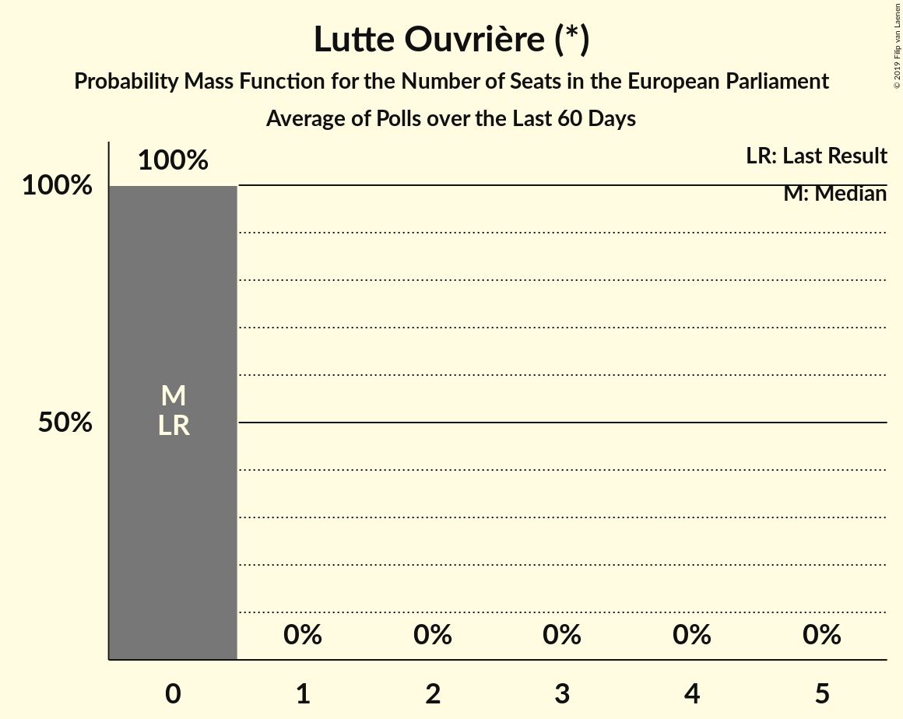

# Lutte Ouvrière (*)

<a href="#voting-intentions">Voting Intentions</a> | <a href="#seats">Seats</a>

## Voting Intentions

Last result: **0.0%** (General Election of 9 June 2024)

### Confidence Intervals

| Period     | Polling firm/Commissioner(s) | Median | 80% Confidence Interval | 90% Confidence Interval | 95% Confidence Interval | 99% Confidence Interval |
|:----------:|:----------------:|:-----------:|:-----------------------:|:-----------------------:|:-----------------------:|:-----------------------:|
| N/A | [Poll Average](average.html) | 1.1% | 0.7–2.0% | 0.6–2.2% | 0.5–2.4% | 0.4–2.8% |
| [26–27 March 2026](2026-03-27-OpinionWay.html) | OpinionWay | 1.0% | 0.7–1.5% | 0.6–1.7% | 0.5–1.8% | 0.4–2.1% |
| [25–27 March 2026](2026-03-27-ELABE.html) | ELABE   BFMTV and La Tribune Dimanche | 0.8% | 0.5–1.2% | 0.5–1.3% | 0.4–1.4% | 0.3–1.6% |
| [25–26 March 2026](2026-03-26-Odoxa.html) | Odoxa   Public Sénat | 1.0% | 0.7–1.5% | 0.6–1.7% | 0.5–1.8% | 0.4–2.1% |
| [22 March 2026](2026-03-22-HarrisInteractive.html) | Harris Interactive   M6 and RTL | 1.0% | 0.7–1.5% | 0.6–1.7% | 0.5–1.8% | 0.4–2.1% |
| [26–27 February 2026](2026-02-27-Ifop–Fiducial.html) | Ifop–Fiducial   Le Figaro and Sud Radio | 1.9% | 1.4–2.5% | 1.3–2.7% | 1.2–2.8% | 1.0–3.2% |
| [18–20 November 2025](2025-11-20-Verian.html) | Verian | 0.0% | N/A | N/A | N/A | N/A |
| [19–20 November 2025](2025-11-20-Odoxa.html) | Odoxa   Public Sénat | 1.0% | 0.7–1.5% | 0.7–1.7% | 0.6–1.8% | 0.5–2.1% |
| [30–31 October 2025](2025-10-31-ELABE.html) | ELABE   BFMTV and La Tribune Dimanche | 1.1% | 0.8–1.6% | 0.7–1.7% | 0.7–1.8% | 0.6–2.0% |
| [7 October 2025](2025-10-07-HarrisInteractive.html) | Harris Interactive   RTL | 1.0% | 0.7–1.5% | 0.6–1.7% | 0.6–1.8% | 0.4–2.1% |
| [30 September–1 October 2025](2025-10-01-Cluster17.html) | Cluster17   Le Point | 1.0% | 0.7–1.4% | 0.6–1.5% | 0.6–1.6% | 0.5–1.8% |
| [24–25 September 2025](2025-09-25-Ifop–Fiducial.html) | Ifop–Fiducial   L’Opinion and Sud Radio | 1.3% | 0.9–1.8% | 0.8–2.0% | 0.7–2.1% | 0.6–2.4% |
| [19–20 May 2025](2025-05-20-Ifop–Fiducial.html) | Ifop–Fiducial   Le Figaro and Sud Radio | 1.0% | N/A | N/A | N/A | N/A |
| [19 May 2025](2025-05-19-HarrisInteractive.html) | Harris Interactive   LCI | 1.1% | N/A | N/A | N/A | N/A |
| [11–30 April 2025](2025-04-30-Ifop.html) | Ifop   Hexagone | 1.1% | N/A | N/A | N/A | N/A |
| [23–24 April 2025](2025-04-24-Odoxa.html) | Odoxa   Public Sénat | 1.0% | N/A | N/A | N/A | N/A |
| [2–4 April 2025](2025-04-04-ELABE.html) | ELABE   BFMTV and La Tribune Dimanche | 1.1% | N/A | N/A | N/A | N/A |
| [31 March 2025](2025-03-31-HarrisInteractive.html) | Harris Interactive   RTL | 1.0% | N/A | N/A | N/A | N/A |
| [26–27 March 2025](2025-03-27-Ifop.html) | Ifop   Le Journal du Dimanche | 1.0% | N/A | N/A | N/A | N/A |
| [6–9 December 2024](2024-12-09-Ifop–Fiducial.html) | Ifop–Fiducial   Le Figaro and Sud Radio | 0.9% | N/A | N/A | N/A | N/A |
| [11–12 September 2024](2024-09-12-OpinionWay.html) | OpinionWay | 0.3% | N/A | N/A | N/A | N/A |
| [6–9 September 2024](2024-09-09-Ifop–Fiducial.html) | Ifop–Fiducial   Sud Radio | 1.3% | N/A | N/A | N/A | N/A |
| [7–8 July 2024](2024-07-08-HarrisInteractive.html) | Harris Interactive   Challenges, M6 and RTL | 1.0% | N/A | N/A | N/A | N/A |

### Probability Mass Function

The following table shows the probability mass function per percentage block of voting intentions for the [poll average](average.html) for Lutte Ouvrière (*).

| Voting Intentions | Probability | Accumulated | Special Marks |
|:-----------------:|:-----------:|:-----------:|:-------------:|
| 0.0–0.5% | 4% | 100% | Last Result |
| 0.5–1.5% | 74% | 96% | Median |
| 1.5–2.5% | 20% | 22% |  |
| 2.5–3.5% | 2% | 2% |  |
| 3.5–4.5% | 0% | 0% |  |

## Seats

Last result: **0** seats (General Election of 9 June 2024)

### Confidence Intervals

| Period     | Polling firm/Commissioner(s) | Median | 80% Confidence Interval | 90% Confidence Interval | 95% Confidence Interval | 99% Confidence Interval |
|:----------:|:----------------:|:------:|:-----------------------:|:-----------------------:|:-----------------------:|:-----------------------:|
| N/A | [Poll Average](average.html) | 0 | 0 | 0 | 0 | 0 |
| [26–27 March 2026](2026-03-27-OpinionWay.html) | OpinionWay | 0 | 0 | 0 | 0 | 0 |
| [25–27 March 2026](2026-03-27-ELABE.html) | ELABE   BFMTV and La Tribune Dimanche | 0 | 0 | 0 | 0 | 0 |
| [25–26 March 2026](2026-03-26-Odoxa.html) | Odoxa   Public Sénat | 0 | 0 | 0 | 0 | 0 |
| [22 March 2026](2026-03-22-HarrisInteractive.html) | Harris Interactive   M6 and RTL | 0 | 0 | 0 | 0 | 0 |
| [26–27 February 2026](2026-02-27-Ifop–Fiducial.html) | Ifop–Fiducial   Le Figaro and Sud Radio | 0 | 0 | 0 | 0 | 0 |
| [18–20 November 2025](2025-11-20-Verian.html) | Verian |  |  |  |  |  |
| [19–20 November 2025](2025-11-20-Odoxa.html) | Odoxa   Public Sénat | 0 | 0 | 0 | 0 | 0 |
| [30–31 October 2025](2025-10-31-ELABE.html) | ELABE   BFMTV and La Tribune Dimanche | 0 | 0 | 0 | 0 | 0 |
| [7 October 2025](2025-10-07-HarrisInteractive.html) | Harris Interactive   RTL | 0 | 0 | 0 | 0 | 0 |
| [30 September–1 October 2025](2025-10-01-Cluster17.html) | Cluster17   Le Point | 0 | 0 | 0 | 0 | 0 |
| [24–25 September 2025](2025-09-25-Ifop–Fiducial.html) | Ifop–Fiducial   L’Opinion and Sud Radio | 0 | 0 | 0 | 0 | 0 |
| [19–20 May 2025](2025-05-20-Ifop–Fiducial.html) | Ifop–Fiducial   Le Figaro and Sud Radio |  |  |  |  |  |
| [19 May 2025](2025-05-19-HarrisInteractive.html) | Harris Interactive   LCI |  |  |  |  |  |
| [11–30 April 2025](2025-04-30-Ifop.html) | Ifop   Hexagone |  |  |  |  |  |
| [23–24 April 2025](2025-04-24-Odoxa.html) | Odoxa   Public Sénat |  |  |  |  |  |
| [2–4 April 2025](2025-04-04-ELABE.html) | ELABE   BFMTV and La Tribune Dimanche |  |  |  |  |  |
| [31 March 2025](2025-03-31-HarrisInteractive.html) | Harris Interactive   RTL |  |  |  |  |  |
| [26–27 March 2025](2025-03-27-Ifop.html) | Ifop   Le Journal du Dimanche |  |  |  |  |  |
| [6–9 December 2024](2024-12-09-Ifop–Fiducial.html) | Ifop–Fiducial   Le Figaro and Sud Radio |  |  |  |  |  |
| [11–12 September 2024](2024-09-12-OpinionWay.html) | OpinionWay |  |  |  |  |  |
| [6–9 September 2024](2024-09-09-Ifop–Fiducial.html) | Ifop–Fiducial   Sud Radio |  |  |  |  |  |
| [7–8 July 2024](2024-07-08-HarrisInteractive.html) | Harris Interactive   Challenges, M6 and RTL |  |  |  |  |  |

### Probability Mass Function

The following table shows the probability mass function per seat for the [poll average](average.html) for Lutte Ouvrière (*).

| Number of Seats | Probability | Accumulated | Special Marks |
|:---------------:|:-----------:|:-----------:|:-------------:|
| 0 | 100% | 100% | Last Result, Median |

