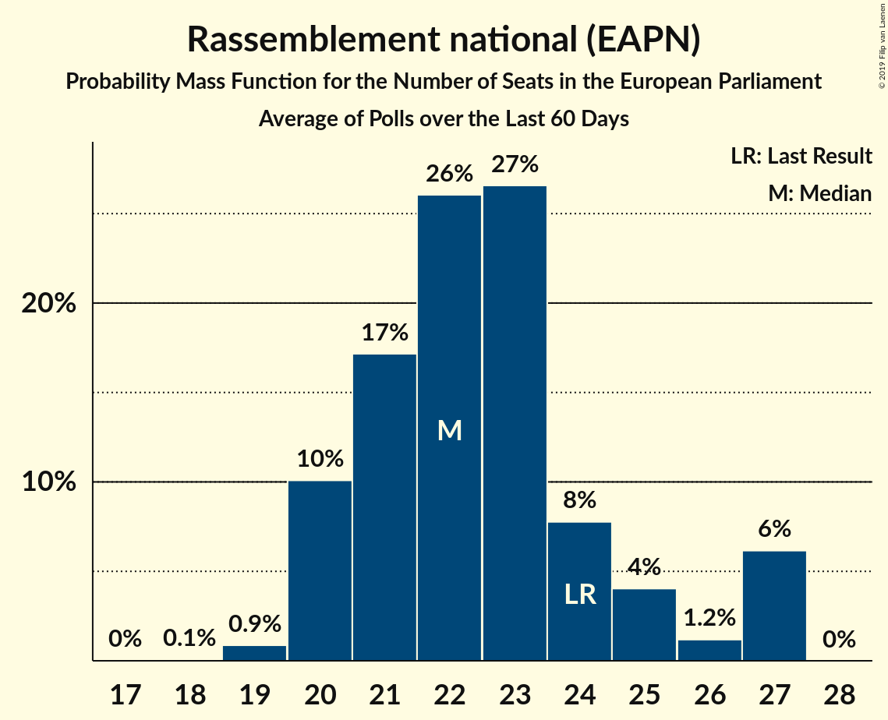

# Rassemblement national (EAPN)

<a href="#voting-intentions">Voting Intentions</a> | <a href="#seats">Seats</a>

## Voting Intentions

Last result: **24.9%** (General Election of 25 May 2014)

### Confidence Intervals

| Period     | Polling firm/Commissioner(s) | Median | 80% Confidence Interval | 90% Confidence Interval | 95% Confidence Interval | 99% Confidence Interval |
|:----------:|:----------------:|:-----------:|:-----------------------:|:-----------------------:|:-----------------------:|:-----------------------:|
| N/A | [Poll Average](average.html) | 23.3% | 21.5–24.9% | 20.8–25.5% | 20.1–26.1% | 18.9–27.3% |
| [16–20 May 2019](2019-05-20-Ifop-Fiducial.html) | Ifop-Fiducial   CNews, Paris Match and Sud Radio | 23.1% | 22.1–24.2% | 21.8–24.4% | 21.6–24.7% | 21.1–25.2% |
| [19–20 May 2019](2019-05-20-HarrisInteractive.html) | Harris Interactive   LCI, Le Figaro, RTL and TF1 | 24.7% | 23.0–26.5% | 22.5–27.0% | 22.1–27.4% | 21.3–28.3% |
| [18–19 May 2019](2019-05-19-HarrisInteractive.html) | Harris Interactive   LCI, Le Figaro, RTL and TF1 | 23.9% | 22.2–25.7% | 21.7–26.2% | 21.3–26.6% | 20.5–27.5% |
| [17–18 May 2019](2019-05-18-HarrisInteractive.html) | Harris Interactive   LCI, Le Figaro, RTL and TF1 | 24.7% | 23.1–26.5% | 22.6–27.0% | 22.2–27.5% | 21.4–28.3% |
| [14–17 May 2019](2019-05-17-Ipsos.html) | Ipsos   Le CEVIPOF, La Fondation Jean Jaurès and Le Monde | 23.9% | 23.0–24.7% | 22.8–25.0% | 22.6–25.2% | 22.2–25.6% |
| [14–17 May 2019](2019-05-17-Ifop-Fiducial.html) | Ifop-Fiducial   CNews, Paris Match and Sud Radio | 23.2% | 22.2–24.2% | 21.9–24.5% | 21.6–24.8% | 21.2–25.3% |
| [16–17 May 2019](2019-05-17-HarrisInteractive.html) | Harris Interactive   LCI, Le Figaro, RTL and TF1 | 24.1% | 22.4–25.8% | 21.9–26.4% | 21.5–26.8% | 20.7–27.7% |
| [13–16 May 2019](2019-05-16-Ifop-Fiducial.html) | Ifop-Fiducial   CNews, Paris Match and Sud Radio | 23.9% | 22.8–24.9% | 22.6–25.2% | 22.3–25.5% | 21.8–26.0% |
| [15–16 May 2019](2019-05-16-HarrisInteractive.html) | Harris Interactive   LCI, Le Figaro, RTL and TF1 | 23.6% | 22.0–25.4% | 21.5–25.9% | 21.1–26.3% | 20.4–27.2% |
| [8–15 May 2019](2019-05-15-OpinionWay–Tilder.html) | OpinionWay–Tilder   Les Echos and Radio Classique | 23.3% | 22.1–24.6% | 21.8–25.0% | 21.5–25.3% | 20.9–25.9% |
| [11–15 May 2019](2019-05-15-Ifop-Fiducial.html) | Ifop-Fiducial   CNews, Paris Match and Sud Radio | 23.4% | 22.3–24.6% | 22.0–24.9% | 21.7–25.2% | 21.2–25.7% |
| [14–15 May 2019](2019-05-15-HarrisInteractive.html) | Harris Interactive   LCI, Le Figaro, RTL and TF1 | 23.7% | 22.1–25.5% | 21.6–26.0% | 21.2–26.4% | 20.5–27.3% |
| [10–14 May 2019](2019-05-14-Ifop-Fiducial.html) | Ifop-Fiducial   CNews, Paris Match and Sud Radio | 22.7% | 21.4–23.9% | 21.1–24.3% | 20.8–24.6% | 20.2–25.2% |
| [13–14 May 2019](2019-05-14-HarrisInteractive.html) | Harris Interactive   LCI, Le Figaro, RTL and TF1 | 23.1% | 21.5–24.8% | 21.0–25.3% | 20.7–25.7% | 19.9–26.6% |
| [12–14 May 2019](2019-05-14-ELABE.html) | ELABE   BFMTV | 22.6% | 21.4–23.8% | 21.1–24.2% | 20.8–24.5% | 20.2–25.1% |
| [9–13 May 2019](2019-05-13-Ifop-Fiducial.html) | Ifop-Fiducial   CNews, Paris Match and Sud Radio | 22.5% | 21.1–24.0% | 20.7–24.4% | 20.3–24.8% | 19.7–25.5% |
| [12–13 May 2019](2019-05-13-HarrisInteractive.html) | Harris Interactive   LCI, Le Figaro, RTL and TF1 | 22.8% | 21.2–24.6% | 20.8–25.1% | 20.4–25.5% | 19.6–26.3% |
| [11–12 May 2019](2019-05-12-HarrisInteractive.html) | Harris Interactive   LCI, Le Figaro, RTL and TF1 | 22.9% | 21.3–24.7% | 20.9–25.2% | 20.5–25.6% | 19.7–26.5% |
| [10–11 May 2019](2019-05-11-HarrisInteractive.html) | Harris Interactive   LCI, Le Figaro, RTL and TF1 | 23.2% | 21.6–25.0% | 21.1–25.5% | 20.8–25.9% | 20.0–26.8% |
| [7–10 May 2019](2019-05-10-Ifop-Fiducial.html) | Ifop-Fiducial   CNews, Paris Match and Sud Radio | 21.9% | 20.5–23.4% | 20.1–23.8% | 19.7–24.1% | 19.1–24.9% |
| [9–10 May 2019](2019-05-10-HarrisInteractive.html) | Harris Interactive   LCI, Le Figaro, RTL and TF1 | 22.7% | 21.1–24.4% | 20.7–24.9% | 20.3–25.3% | 19.5–26.2% |
| [6–9 May 2019](2019-05-09-Ifop-Fiducial.html) | Ifop-Fiducial   CNews, Paris Match and Sud Radio | 21.5% | 20.1–23.0% | 19.7–23.4% | 19.4–23.7% | 18.7–24.4% |
| [8–9 May 2019](2019-05-09-HarrisInteractive.html) | Harris Interactive   LCI, Le Figaro, RTL and TF1 | 22.8% | 21.2–24.5% | 20.7–25.0% | 20.3–25.4% | 19.6–26.3% |
| [4–8 May 2019](2019-05-08-Ifop-Fiducial.html) | Ifop-Fiducial   CNews, Paris Match and Sud Radio | 22.3% | 20.9–23.8% | 20.5–24.2% | 20.2–24.6% | 19.6–25.3% |
| [7–8 May 2019](2019-05-08-HarrisInteractive.html) | Harris Interactive   LCI, Le Figaro, RTL and TF1 | 21.9% | 20.3–23.6% | 19.9–24.1% | 19.5–24.5% | 18.8–25.3% |
| [4–7 May 2019](2019-05-07-Ifop-Fiducial.html) | Ifop-Fiducial   CNews, Paris Match and Sud Radio | 22.2% | 20.8–23.7% | 20.4–24.1% | 20.1–24.5% | 19.5–25.2% |
| [6–7 May 2019](2019-05-07-HarrisInteractive.html) | Harris Interactive   LCI, Le Figaro, RTL and TF1 | 22.1% | 20.5–23.8% | 20.0–24.2% | 19.6–24.7% | 18.9–25.5% |
| [6–7 May 2019](2019-05-07-ELABE.html) | ELABE   BFMTV | 22.0% | 20.5–23.6% | 20.1–24.0% | 19.7–24.4% | 19.0–25.2% |
| [4–6 May 2019](2019-05-06-OpinionWay–Tilder.html) | OpinionWay–Tilder   Les Echos and Radio Classique | 23.3% | 22.1–24.6% | 21.8–25.0% | 21.5–25.3% | 20.9–25.9% |
| [4–6 May 2019](2019-05-06-Ifop-Fiducial.html) | Ifop-Fiducial   CNews, Paris Match and Sud Radio | 22.8% | 21.1–24.6% | 20.6–25.1% | 20.2–25.5% | 19.4–26.4% |
| [5–6 May 2019](2019-05-06-HarrisInteractive.html) | Harris Interactive   LCI, Le Figaro, RTL and TF1 | 22.0% | 20.4–23.7% | 19.9–24.2% | 19.5–24.6% | 18.8–25.5% |
| [3–4 May 2019](2019-05-04-HarrisInteractive.html) | Harris Interactive   LCI, Le Figaro, RTL and TF1 | 20.5% | 19.0–22.2% | 18.6–22.7% | 18.2–23.1% | 17.5–23.9% |
| [2–3 May 2019](2019-05-03-Ipsos.html) | Ipsos   Le CEVIPOF, La Fondation Jean Jaurès and Le Monde | 22.1% | 20.3–24.0% | 19.8–24.5% | 19.4–25.0% | 18.6–25.9% |
| [30 April–3 May 2019](2019-05-03-Ifop-Fiducial.html) | Ifop-Fiducial   CNews, Paris Match and Sud Radio | 23.3% | 21.9–24.8% | 21.5–25.2% | 21.1–25.6% | 20.5–26.3% |
| [2–3 May 2019](2019-05-03-HarrisInteractive.html) | Harris Interactive   LCI, Le Figaro, RTL and TF1 | 20.0% | 18.5–21.6% | 18.0–22.1% | 17.7–22.5% | 17.0–23.3% |
| [29 April–2 May 2019](2019-05-02-Ifop-Fiducial.html) | Ifop-Fiducial   CNews, Paris Match and Sud Radio | 22.5% | 21.1–24.0% | 20.7–24.4% | 20.4–24.8% | 19.7–25.5% |
| [1–2 May 2019](2019-05-02-HarrisInteractive.html) | Harris Interactive   LCI, Le Figaro, RTL and TF1 | 20.0% | 18.4–21.6% | 18.0–22.1% | 17.6–22.5% | 16.9–23.3% |
| [30 April–2 May 2019](2019-05-02-BVA.html) | BVA   Europe 1 and La Tribune | 21.7% | 19.8–23.7% | 19.3–24.3% | 18.8–24.8% | 17.9–25.8% |
| [28 April–1 May 2019](2019-05-01-HarrisInteractive.html) | Harris Interactive   LCI, Le Figaro, RTL and TF1 | 20.6% | 19.1–22.3% | 18.6–22.8% | 18.3–23.2% | 17.5–24.0% |
| [24–30 April 2019](2019-04-30-OpinionWay–Tilder.html) | OpinionWay–Tilder   Les Echos and Radio Classique | 23.3% | 22.1–24.6% | 21.8–25.0% | 21.5–25.3% | 20.9–25.9% |
| [26–30 April 2019](2019-04-30-Ifop-Fiducial.html) | Ifop-Fiducial   CNews, Paris Match and Sud Radio | 21.9% | 20.5–23.4% | 20.1–23.8% | 19.8–24.2% | 19.1–24.9% |
| [29–30 April 2019](2019-04-30-HarrisInteractive.html) | Harris Interactive   LCI, Le Figaro, RTL and TF1 | 21.2% | 19.6–22.9% | 19.2–23.4% | 18.8–23.8% | 18.1–24.6% |
| [25–29 April 2019](2019-04-29-Ifop-Fiducial.html) | Ifop-Fiducial   CNews, Paris Match and Sud Radio | 21.4% | 20.0–22.9% | 19.6–23.3% | 19.3–23.7% | 18.7–24.4% |
| [28–29 April 2019](2019-04-29-HarrisInteractive.html) | Harris Interactive   LCI, Le Figaro, RTL and TF1 | 21.4% | 19.8–23.1% | 19.4–23.6% | 19.0–24.0% | 18.3–24.8% |
| [27–28 April 2019](2019-04-28-HarrisInteractive.html) | Harris Interactive   LCI, Le Figaro, RTL and TF1 | 20.9% | 19.4–22.6% | 18.9–23.1% | 18.6–23.5% | 17.8–24.3% |
| [26–27 April 2019](2019-04-27-HarrisInteractive.html) | Harris Interactive   LCI, Le Figaro, RTL and TF1 | 20.8% | 19.2–22.5% | 18.8–22.9% | 18.4–23.3% | 17.7–24.1% |
| [23–26 April 2019](2019-04-26-Ifop-Fiducial.html) | Ifop-Fiducial   CNews, Paris Match and Sud Radio | 21.4% | 20.0–22.8% | 19.6–23.3% | 19.3–23.6% | 18.7–24.3% |
| [25–26 April 2019](2019-04-26-HarrisInteractive.html) | Harris Interactive   LCI, Le Figaro, RTL and TF1 | 20.2% | 18.7–21.9% | 18.3–22.4% | 17.9–22.8% | 17.2–23.6% |
| [20–24 April 2019](2019-04-24-Ifop-Fiducial.html) | Ifop-Fiducial   CNews, Paris Match and Sud Radio | 20.5% | 19.2–22.0% | 18.8–22.4% | 18.5–22.7% | 17.9–23.4% |
| [17–23 April 2019](2019-04-23-OpinionWay–Tilder.html) | OpinionWay–Tilder   Les Echos and Radio Classique | 23.3% | 22.1–24.6% | 21.8–24.9% | 21.5–25.2% | 20.9–25.8% |
| [19–23 April 2019](2019-04-23-Ifop-Fiducial.html) | Ifop-Fiducial   CNews, Paris Match and Sud Radio | 21.0% | 19.6–22.4% | 19.2–22.8% | 18.9–23.2% | 18.2–23.9% |
| [18–22 April 2019](2019-04-22-Ipsos.html) | Ipsos   Le CEVIPOF, La Fondation Jean Jaurès and Le Monde | 22.0% | 21.4–22.6% | 21.3–22.7% | 21.1–22.9% | 20.9–23.2% |
| [15–21 April 2019](2019-04-21-BVA.html) | BVA   Europe 1 and La Tribune | 21.9% | 20.8–23.0% | 20.5–23.3% | 20.3–23.5% | 19.8–24.1% |
| [16–19 April 2019](2019-04-19-Ifop-Fiducial.html) | Ifop-Fiducial   CNews, Paris Match and Sud Radio | 22.5% | 21.1–24.0% | 20.7–24.4% | 20.3–24.8% | 19.7–25.5% |
| [15–18 April 2019](2019-04-18-Ifop-Fiducial.html) | Ifop-Fiducial   CNews, Paris Match and Sud Radio | 22.0% | 20.6–23.5% | 20.2–23.9% | 19.8–24.3% | 19.2–25.0% |
| [13–17 April 2019](2019-04-17-Ifop-Fiducial.html) | Ifop-Fiducial   CNews, Paris Match and Sud Radio | 21.5% | 20.1–23.0% | 19.7–23.4% | 19.4–23.8% | 18.7–24.5% |
| [12–16 April 2019](2019-04-16-Ifop-Fiducial.html) | Ifop-Fiducial   CNews, Paris Match and Sud Radio | 21.0% | 19.6–22.5% | 19.2–22.9% | 18.9–23.2% | 18.3–24.0% |
| [11–15 April 2019](2019-04-15-Ifop-Fiducial.html) | Ifop-Fiducial   CNews, Paris Match and Sud Radio | 21.5% | 20.1–23.0% | 19.7–23.4% | 19.4–23.7% | 18.8–24.4% |
| [12–13 April 2019](2019-04-13-HarrisInteractive.html) | Harris Interactive   LCI, Le Figaro, RTL and TF1 | 21.0% | 19.5–22.8% | 19.0–23.2% | 18.7–23.7% | 17.9–24.5% |
| [9–12 April 2019](2019-04-12-Ifop-Fiducial.html) | Ifop-Fiducial   CNews, Paris Match and Sud Radio | 21.5% | 20.1–22.9% | 19.7–23.4% | 19.4–23.7% | 18.7–24.4% |
| [8–11 April 2019](2019-04-11-Ifop-Fiducial.html) | Ifop-Fiducial   CNews, Paris Match and Sud Radio | 22.0% | 20.6–23.5% | 20.2–23.9% | 19.9–24.3% | 19.3–25.0% |
| [10–11 April 2019](2019-04-11-BVA.html) | BVA   Europe 1 and La Tribune | 20.2% | 18.9–21.6% | 18.5–22.0% | 18.2–22.4% | 17.5–23.1% |
| [6–10 April 2019](2019-04-10-Ifop-Fiducial.html) | Ifop-Fiducial   CNews, Paris Match and Sud Radio | 21.0% | 19.6–22.4% | 19.3–22.8% | 18.9–23.2% | 18.3–23.9% |
| [5–9 April 2019](2019-04-09-Ifop-Fiducial.html) | Ifop-Fiducial   CNews, Paris Match and Sud Radio | 21.0% | 19.6–22.4% | 19.3–22.8% | 18.9–23.2% | 18.3–23.9% |
| [4–8 April 2019](2019-04-08-Ifop-Fiducial.html) | Ifop-Fiducial   CNews, Paris Match and Sud Radio | 20.5% | 19.2–22.0% | 18.8–22.4% | 18.5–22.7% | 17.8–23.5% |
| [5–6 April 2019](2019-04-06-HarrisInteractive.html) | Harris Interactive   LCI, Le Figaro, RTL and TF1 | 21.0% | 19.5–22.7% | 19.0–23.2% | 18.7–23.6% | 17.9–24.4% |
| [2–5 April 2019](2019-04-05-Ifop-Fiducial.html) | Ifop-Fiducial   CNews, Paris Match and Sud Radio | 21.0% | 19.6–22.5% | 19.2–22.9% | 18.9–23.2% | 18.3–23.9% |
| [1–4 April 2019](2019-04-04-Ifop-Fiducial.html) | Ifop-Fiducial   CNews, Paris Match and Sud Radio | 22.0% | 20.6–23.5% | 20.2–23.9% | 19.9–24.3% | 19.2–25.0% |
| [30 March–3 April 2019](2019-04-03-Ifop-Fiducial.html) | Ifop-Fiducial   CNews, Paris Match and Sud Radio | 21.0% | 19.7–22.5% | 19.3–22.9% | 18.9–23.3% | 18.3–24.0% |
| [29 March–2 April 2019](2019-04-02-Ifop-Fiducial.html) | Ifop-Fiducial   CNews, Paris Match and Sud Radio | 20.5% | 19.1–21.9% | 18.8–22.3% | 18.4–22.7% | 17.8–23.4% |
| [28 March–1 April 2019](2019-04-01-Ifop-Fiducial.html) | Ifop-Fiducial   CNews, Paris Match and Sud Radio | 21.0% | 19.7–22.5% | 19.3–22.9% | 18.9–23.3% | 18.3–24.0% |
| [26–29 March 2019](2019-03-29-Ifop-Fiducial.html) | Ifop-Fiducial   CNews, Paris Match and Sud Radio | 21.0% | 19.6–22.5% | 19.3–22.9% | 18.9–23.3% | 18.3–24.0% |
| [28–29 March 2019](2019-03-29-ELABE.html) | ELABE   BFMTV | 21.0% | 19.5–22.6% | 19.1–23.0% | 18.8–23.4% | 18.1–24.2% |
| [25–28 March 2019](2019-03-28-Ifop-Fiducial.html) | Ifop-Fiducial   CNews, Paris Match and Sud Radio | 20.9% | 19.6–22.4% | 19.2–22.8% | 18.9–23.2% | 18.2–23.9% |
| [22–27 March 2019](2019-03-27-Ifop-Fiducial.html) | Ifop-Fiducial   CNews, Paris Match and Sud Radio | 21.5% | 20.3–22.8% | 20.0–23.1% | 19.7–23.4% | 19.1–24.1% |
| [25–27 March 2019](2019-03-27-ELABE.html) | ELABE   BFMTV | 22.0% | 20.5–23.6% | 20.1–24.0% | 19.7–24.4% | 19.0–25.2% |
| [20–26 March 2019](2019-03-26-OpinionWay–Tilder.html) | OpinionWay–Tilder   Les Echos and Radio Classique | 23.0% | 21.8–24.3% | 21.4–24.6% | 21.1–24.9% | 20.6–25.6% |
| [22–26 March 2019](2019-03-26-Ifop-Fiducial.html) | Ifop-Fiducial   CNews, Paris Match and Sud Radio | 20.0% | 18.6–21.4% | 18.3–21.8% | 18.0–22.2% | 17.3–22.8% |
| [21–25 March 2019](2019-03-25-Ifop-Fiducial.html) | Ifop-Fiducial   CNews, Paris Match and Sud Radio | 20.0% | 18.7–21.4% | 18.3–21.8% | 18.0–22.2% | 17.4–22.9% |
| [22–23 March 2019](2019-03-23-HarrisInteractive.html) | Harris Interactive   LCI, Le Figaro, RTL and TF1 | 22.0% | 20.4–23.7% | 20.0–24.2% | 19.6–24.6% | 18.9–25.4% |
| [19–22 March 2019](2019-03-22-Ifop-Fiducial.html) | Ifop-Fiducial   CNews, Paris Match and Sud Radio | 20.5% | 19.2–21.9% | 18.8–22.4% | 18.5–22.7% | 17.8–23.4% |
| [19–22 March 2019](2019-03-22-BVA.html) | BVA   Europe 1 and La Tribune | 20.5% | 19.2–21.9% | 18.8–22.4% | 18.5–22.7% | 17.8–23.4% |
| [15–21 March 2019](2019-03-21-Ipsos.html) | Ipsos   Le CEVIPOF, La Fondation Jean Jaurès and Le Monde | 22.0% | 21.3–22.7% | 21.1–22.9% | 20.9–23.1% | 20.6–23.4% |
| [18–21 March 2019](2019-03-21-Ifop-Fiducial.html) | Ifop-Fiducial   CNews, Paris Match and Sud Radio | 21.0% | 19.6–22.4% | 19.2–22.8% | 18.9–23.2% | 18.3–23.9% |
| [16–20 March 2019](2019-03-20-Ifop-Fiducial.html) | Ifop-Fiducial   CNews, Paris Match and Sud Radio | 21.5% | 20.1–23.0% | 19.8–23.4% | 19.4–23.7% | 18.8–24.4% |
| [15–19 March 2019](2019-03-19-Ifop-Fiducial.html) | Ifop-Fiducial   CNews, Paris Match and Sud Radio | 20.5% | 19.2–22.0% | 18.8–22.4% | 18.5–22.7% | 17.8–23.4% |
| [14–18 March 2019](2019-03-18-Ifop-Fiducial.html) | Ifop-Fiducial   CNews, Paris Match and Sud Radio | 20.5% | 19.2–22.0% | 18.8–22.4% | 18.5–22.7% | 17.9–23.4% |
| [12–15 March 2019](2019-03-15-Ifop-Fiducial.html) | Ifop-Fiducial   CNews, Paris Match and Sud Radio | 21.0% | 19.7–22.5% | 19.3–22.9% | 19.0–23.3% | 18.3–24.0% |
| [10–14 March 2019](2019-03-14-Ifop-Fiducial.html) | Ifop-Fiducial   CNews, Paris Match and Sud Radio | 21.0% | 19.6–22.4% | 19.3–22.8% | 18.9–23.2% | 18.3–23.9% |
| [9–13 March 2019](2019-03-13-Ifop-Fiducial.html) | Ifop-Fiducial   CNews, Paris Match and Sud Radio | 21.5% | 20.2–23.0% | 19.8–23.4% | 19.4–23.8% | 18.8–24.5% |
| [8–12 March 2019](2019-03-12-Ifop-Fiducial.html) | Ifop-Fiducial   CNews, Paris Match and Sud Radio | 21.5% | 20.1–23.0% | 19.7–23.4% | 19.4–23.7% | 18.7–24.4% |
| [7–11 March 2019](2019-03-11-Ifop-Fiducial.html) | Ifop-Fiducial   CNews, Paris Match and Sud Radio | 21.5% | 20.1–23.0% | 19.8–23.4% | 19.4–23.8% | 18.8–24.5% |
| [8–9 March 2019](2019-03-09-HarrisInteractive.html) | Harris Interactive   LCI, Le Figaro, RTL and TF1 | 21.0% | 19.5–22.7% | 19.1–23.1% | 18.7–23.5% | 18.0–24.3% |
| [5–8 March 2019](2019-03-08-Ifop-Fiducial.html) | Ifop-Fiducial   CNews, Paris Match and Sud Radio | 22.0% | 20.6–23.5% | 20.2–23.9% | 19.9–24.3% | 19.3–25.0% |
| [4–7 March 2019](2019-03-07-Ifop-Fiducial.html) | Ifop-Fiducial   CNews, Paris Match and Sud Radio | 22.0% | 20.6–23.6% | 20.2–24.0% | 19.9–24.3% | 19.2–25.1% |
| [20–27 February 2019](2019-02-27-OpinionWay–Tilder.html) | OpinionWay–Tilder   Les Echos and Radio Classique | 22.0% | N/A | N/A | N/A | N/A |
| [25–27 February 2019](2019-02-27-ELABE.html) | ELABE   BFMTV | 22.0% | N/A | N/A | N/A | N/A |
| [22–23 February 2019](2019-02-23-HarrisInteractive.html) | Harris Interactive   LCI, Le Figaro, RTL and TF1 | 20.0% | N/A | N/A | N/A | N/A |
| [15–21 February 2019](2019-02-21-Ipsos.html) | Ipsos   Le Monde | 21.0% | N/A | N/A | N/A | N/A |
| [20–21 February 2019](2019-02-21-Ifop.html) | Ifop   SWG | 23.0% | N/A | N/A | N/A | N/A |
| [20–21 February 2019](2019-02-21-BVA.html) | BVA   La Tribune and RTL | 19.1% | N/A | N/A | N/A | N/A |
| [13–15 February 2019](2019-02-15-Ifop-Fiducial.html) | Ifop-Fiducial   CNews, Paris Match and Sud Radio | 20.0% | N/A | N/A | N/A | N/A |
| [17–25 January 2019](2019-01-25-OpinionWay–Tilder.html) | OpinionWay–Tilder   Les Echos and Radio Classique | 22.0% | N/A | N/A | N/A | N/A |
| [22–23 January 2019](2019-01-23-ELABE.html) | ELABE   BFMTV | 20.5% | N/A | N/A | N/A | N/A |
| [8–9 January 2019](2019-01-09-Ifop-Fiducial.html) | Ifop-Fiducial   Valeurs Actuelles and Sud Radio | 21.0% | N/A | N/A | N/A | N/A |
| [19–20 December 2018](2018-12-20-Odoxa.html) | Odoxa   France Info | 24.0% | 21.9–26.4% | 21.2–27.0% | 20.7–27.6% | 19.7–28.7% |
| [7–10 December 2018](2018-12-10-Ifop.html) | Ifop   L’Opinion | 24.0% | N/A | N/A | N/A | N/A |
| [5–6 December 2018](2018-12-06-Ipsos.html) | Ipsos   La République en Marche | 17.0% | N/A | N/A | N/A | N/A |
| [26 November–6 December 2018](2018-12-06-BVA.html) | BVA   Presse régionale | 21.0% | N/A | N/A | N/A | N/A |
| [3–4 December 2018](2018-12-04-Ifop.html) | Ifop   Place publique | 24.0% | N/A | N/A | N/A | N/A |
| [9–12 November 2018](2018-11-12-Ifop.html) | Ifop | 22.0% | N/A | N/A | N/A | N/A |
| [6–7 November 2018](2018-11-07-ELABE.html) | ELABE   BFMTV | 20.0% | N/A | N/A | N/A | N/A |
| [30–31 October 2018](2018-10-31-Ifop.html) | Ifop   La Lettre de l’Expansion | 21.0% | N/A | N/A | N/A | N/A |
| [12–13 September 2018](2018-09-13-Odoxa.html) | Odoxa   France Info and Le Figaro | 20.9% | N/A | N/A | N/A | N/A |
| [30–31 August 2018](2018-08-31-Ifop-Fiducial.html) | Ifop-Fiducial   Paris Match and Sud Radio | 17.0% | N/A | N/A | N/A | N/A |
| [27 June–2 July 2018](2018-07-02-Ipsos.html) | Ipsos   Le Monde | 18.0% | N/A | N/A | N/A | N/A |
| [25–27 June 2018](2018-06-27-Ifop-Fiducial.html) | Ifop-Fiducial   CNews and Sud Radio | 19.0% | N/A | N/A | N/A | N/A |
| [29–30 May 2018](2018-05-30-ELABE.html) | ELABE   BFMTV | 19.5% | N/A | N/A | N/A | N/A |
| [22–23 May 2018](2018-05-23-HarrisInteractive.html) | Harris Interactive   LCP – Assemblée nationale | 15.0% | N/A | N/A | N/A | N/A |
| [7–11 May 2018](2018-05-11-Viavoice.html) | Viavoice   Europe Écologie Les Verts | 14.0% | N/A | N/A | N/A | N/A |
| [7–9 May 2018](2018-05-09-Ifop.html) | Ifop   Valeurs Actuelles | 17.0% | N/A | N/A | N/A | N/A |
| [29 November–1 December 2017](2017-12-01-Ifop.html) | Ifop   Le Figaro | 17.0% | N/A | N/A | N/A | N/A |

### Probability Mass Function

The following table shows the probability mass function per percentage block of voting intentions for the [poll average](average.html) for Rassemblement national (EAPN).

| Voting Intentions | Probability | Accumulated | Special Marks |
|:-----------------:|:-----------:|:-----------:|:-------------:|
| 16.5–17.5% | 0% | 100% |  |
| 17.5–18.5% | 0.2% | 100% |  |
| 18.5–19.5% | 1.0% | 99.7% |  |
| 19.5–20.5% | 3% | 98.8% |  |
| 20.5–21.5% | 7% | 96% |  |
| 21.5–22.5% | 18% | 89% |  |
| 22.5–23.5% | 30% | 71% | Median |
| 23.5–24.5% | 26% | 41% |  |
| 24.5–25.5% | 10% | 15% | Last Result |
| 25.5–26.5% | 3% | 5% |  |
| 26.5–27.5% | 1.2% | 2% |  |
| 27.5–28.5% | 0.3% | 0.3% |  |
| 28.5–29.5% | 0% | 0% |  |
| 29.5–30.5% | 0% | 0% |  |

## Seats

Last result: **24** seats (General Election of 25 May 2014)

### Confidence Intervals

| Period     | Polling firm/Commissioner(s) | Median | 80% Confidence Interval | 90% Confidence Interval | 95% Confidence Interval | 99% Confidence Interval |
|:----------:|:----------------:|:------:|:-----------------------:|:-----------------------:|:-----------------------:|:-----------------------:|
| N/A | [Poll Average](average.html) | 22 | 20–23 | 19–25 | 19–25 | 17–26 |
| [16–20 May 2019](2019-05-20-Ifop-Fiducial.html) | Ifop-Fiducial   CNews, Paris Match and Sud Radio | 22 | 20–22 | 20–22 | 20–24 | 19–24 |
| [19–20 May 2019](2019-05-20-HarrisInteractive.html) | Harris Interactive   LCI, Le Figaro, RTL and TF1 | 23 | 21–25 | 21–25 | 20–26 | 19–27 |
| [18–19 May 2019](2019-05-19-HarrisInteractive.html) | Harris Interactive   LCI, Le Figaro, RTL and TF1 | 22 | 22–24 | 22–24 | 22–24 | 22–24 |
| [17–18 May 2019](2019-05-18-HarrisInteractive.html) | Harris Interactive   LCI, Le Figaro, RTL and TF1 | 24 | 23–24 | 22–24 | 21–28 | 20–28 |
| [14–17 May 2019](2019-05-17-Ipsos.html) | Ipsos   Le CEVIPOF, La Fondation Jean Jaurès and Le Monde | 22 | 22 | 21–22 | 21–23 | 20–23 |
| [14–17 May 2019](2019-05-17-Ifop-Fiducial.html) | Ifop-Fiducial   CNews, Paris Match and Sud Radio | 21 | 19–21 | 19–21 | 19–21 | 19–22 |
| [16–17 May 2019](2019-05-17-HarrisInteractive.html) | Harris Interactive   LCI, Le Figaro, RTL and TF1 | 23 | 21–25 | 20–25 | 20–25 | 19–27 |
| [13–16 May 2019](2019-05-16-Ifop-Fiducial.html) | Ifop-Fiducial   CNews, Paris Match and Sud Radio | 22 | 21–25 | 20–25 | 20–25 | 20–25 |
| [15–16 May 2019](2019-05-16-HarrisInteractive.html) | Harris Interactive   LCI, Le Figaro, RTL and TF1 | 23 | 20–25 | 20–25 | 20–26 | 18–27 |
| [8–15 May 2019](2019-05-15-OpinionWay–Tilder.html) | OpinionWay–Tilder   Les Echos and Radio Classique | 23 | 21–23 | 20–23 | 20–23 | 19–24 |
| [11–15 May 2019](2019-05-15-Ifop-Fiducial.html) | Ifop-Fiducial   CNews, Paris Match and Sud Radio | 22 | 21–22 | 20–23 | 20–23 | 19–24 |
| [14–15 May 2019](2019-05-15-HarrisInteractive.html) | Harris Interactive   LCI, Le Figaro, RTL and TF1 | 23 | 20–24 | 20–24 | 20–25 | 19–25 |
| [10–14 May 2019](2019-05-14-Ifop-Fiducial.html) | Ifop-Fiducial   CNews, Paris Match and Sud Radio | 20 | 20–22 | 20–23 | 19–24 | 19–24 |
| [13–14 May 2019](2019-05-14-HarrisInteractive.html) | Harris Interactive   LCI, Le Figaro, RTL and TF1 | 21 | 21–24 | 20–24 | 20–24 | 19–25 |
| [12–14 May 2019](2019-05-14-ELABE.html) | ELABE   BFMTV | 20 | 20–21 | 20–21 | 20–23 | 20–23 |
| [9–13 May 2019](2019-05-13-Ifop-Fiducial.html) | Ifop-Fiducial   CNews, Paris Match and Sud Radio | 22 | 19–22 | 19–22 | 19–22 | 19–22 |
| [12–13 May 2019](2019-05-13-HarrisInteractive.html) | Harris Interactive   LCI, Le Figaro, RTL and TF1 | 23 | 21–23 | 18–23 | 18–23 | 18–25 |
| [11–12 May 2019](2019-05-12-HarrisInteractive.html) | Harris Interactive   LCI, Le Figaro, RTL and TF1 | 20 | 20–23 | 20–24 | 19–24 | 18–26 |
| [10–11 May 2019](2019-05-11-HarrisInteractive.html) | Harris Interactive   LCI, Le Figaro, RTL and TF1 | 22 | 22–24 | 21–24 | 21–25 | 19–25 |
| [7–10 May 2019](2019-05-10-Ifop-Fiducial.html) | Ifop-Fiducial   CNews, Paris Match and Sud Radio | 19 | 18–22 | 18–22 | 18–23 | 17–23 |
| [9–10 May 2019](2019-05-10-HarrisInteractive.html) | Harris Interactive   LCI, Le Figaro, RTL and TF1 | 22 | 20–24 | 20–24 | 19–24 | 19–25 |
| [6–9 May 2019](2019-05-09-Ifop-Fiducial.html) | Ifop-Fiducial   CNews, Paris Match and Sud Radio | 19 | 19–21 | 18–22 | 18–22 | 17–23 |
| [8–9 May 2019](2019-05-09-HarrisInteractive.html) | Harris Interactive   LCI, Le Figaro, RTL and TF1 | 20 | 20–23 | 20–24 | 19–24 | 18–24 |
| [4–8 May 2019](2019-05-08-Ifop-Fiducial.html) | Ifop-Fiducial   CNews, Paris Match and Sud Radio | 20 | 19–22 | 18–23 | 18–23 | 17–23 |
| [7–8 May 2019](2019-05-08-HarrisInteractive.html) | Harris Interactive   LCI, Le Figaro, RTL and TF1 | 21 | 20–24 | 19–24 | 18–24 | 18–24 |
| [4–7 May 2019](2019-05-07-Ifop-Fiducial.html) | Ifop-Fiducial   CNews, Paris Match and Sud Radio | 20 | 19–22 | 19–22 | 18–22 | 17–26 |
| [6–7 May 2019](2019-05-07-HarrisInteractive.html) | Harris Interactive   LCI, Le Figaro, RTL and TF1 | 21 | 20–22 | 20–24 | 19–24 | 18–24 |
| [6–7 May 2019](2019-05-07-ELABE.html) | ELABE   BFMTV | 21 | 19–23 | 19–23 | 19–24 | 18–24 |
| [4–6 May 2019](2019-05-06-OpinionWay–Tilder.html) | OpinionWay–Tilder   Les Echos and Radio Classique | 21 | 21–23 | 21–23 | 21–23 | 20–25 |
| [4–6 May 2019](2019-05-06-Ifop-Fiducial.html) | Ifop-Fiducial   CNews, Paris Match and Sud Radio | 19 | 18–22 | 18–23 | 17–24 | 17–24 |
| [5–6 May 2019](2019-05-06-HarrisInteractive.html) | Harris Interactive   LCI, Le Figaro, RTL and TF1 | 21 | 20–23 | 20–23 | 20–24 | 18–24 |
| [3–4 May 2019](2019-05-04-HarrisInteractive.html) | Harris Interactive   LCI, Le Figaro, RTL and TF1 | 19 | 17–22 | 17–22 | 17–23 | 16–23 |
| [2–3 May 2019](2019-05-03-Ipsos.html) | Ipsos   Le CEVIPOF, La Fondation Jean Jaurès and Le Monde | 21 | 18–24 | 18–24 | 17–24 | 17–24 |
| [30 April–3 May 2019](2019-05-03-Ifop-Fiducial.html) | Ifop-Fiducial   CNews, Paris Match and Sud Radio | 21 | 21–22 | 20–22 | 19–22 | 18–23 |
| [2–3 May 2019](2019-05-03-HarrisInteractive.html) | Harris Interactive   LCI, Le Figaro, RTL and TF1 | 19 | 18–20 | 17–21 | 16–21 | 16–22 |
| [29 April–2 May 2019](2019-05-02-Ifop-Fiducial.html) | Ifop-Fiducial   CNews, Paris Match and Sud Radio | 21 | 20–23 | 20–23 | 20–25 | 18–26 |
| [1–2 May 2019](2019-05-02-HarrisInteractive.html) | Harris Interactive   LCI, Le Figaro, RTL and TF1 | 19 | 18–22 | 17–22 | 17–22 | 16–22 |
| [30 April–2 May 2019](2019-05-02-BVA.html) | BVA   Europe 1 and La Tribune | 20 | 18–22 | 17–22 | 17–23 | 17–26 |
| [28 April–1 May 2019](2019-05-01-HarrisInteractive.html) | Harris Interactive   LCI, Le Figaro, RTL and TF1 | 19 | 18–21 | 17–22 | 17–22 | 17–24 |
| [24–30 April 2019](2019-04-30-OpinionWay–Tilder.html) | OpinionWay–Tilder   Les Echos and Radio Classique | 22 | 21–23 | 21–23 | 20–23 | 19–24 |
| [26–30 April 2019](2019-04-30-Ifop-Fiducial.html) | Ifop-Fiducial   CNews, Paris Match and Sud Radio | 20 | 20–21 | 20–21 | 20–21 | 17–22 |
| [29–30 April 2019](2019-04-30-HarrisInteractive.html) | Harris Interactive   LCI, Le Figaro, RTL and TF1 | 19 | 18–22 | 17–22 | 17–23 | 17–23 |
| [25–29 April 2019](2019-04-29-Ifop-Fiducial.html) | Ifop-Fiducial   CNews, Paris Match and Sud Radio | 19 | 19–20 | 19–21 | 19–21 | 17–22 |
| [28–29 April 2019](2019-04-29-HarrisInteractive.html) | Harris Interactive   LCI, Le Figaro, RTL and TF1 | 20 | 19–22 | 18–23 | 18–23 | 17–23 |
| [27–28 April 2019](2019-04-28-HarrisInteractive.html) | Harris Interactive   LCI, Le Figaro, RTL and TF1 | 20 | 19–20 | 19–20 | 19–20 | 17–22 |
| [26–27 April 2019](2019-04-27-HarrisInteractive.html) | Harris Interactive   LCI, Le Figaro, RTL and TF1 | 20 | 18–21 | 17–21 | 17–21 | 16–22 |
| [23–26 April 2019](2019-04-26-Ifop-Fiducial.html) | Ifop-Fiducial   CNews, Paris Match and Sud Radio | 19 | 18–21 | 18–21 | 18–21 | 18–22 |
| [25–26 April 2019](2019-04-26-HarrisInteractive.html) | Harris Interactive   LCI, Le Figaro, RTL and TF1 | 20 | 18–20 | 17–20 | 17–20 | 17–21 |
| [20–24 April 2019](2019-04-24-Ifop-Fiducial.html) | Ifop-Fiducial   CNews, Paris Match and Sud Radio | 19 | 18–19 | 18–20 | 17–20 | 16–21 |
| [17–23 April 2019](2019-04-23-OpinionWay–Tilder.html) | OpinionWay–Tilder   Les Echos and Radio Classique | 21 | 20–22 | 19–22 | 19–23 | 19–24 |
| [19–23 April 2019](2019-04-23-Ifop-Fiducial.html) | Ifop-Fiducial   CNews, Paris Match and Sud Radio | 20 | 18–21 | 18–21 | 17–21 | 16–23 |
| [18–22 April 2019](2019-04-22-Ipsos.html) | Ipsos   Le CEVIPOF, La Fondation Jean Jaurès and Le Monde | 21 | 20–21 | 20–21 | 20–21 | 19–22 |
| [15–21 April 2019](2019-04-21-BVA.html) | BVA   Europe 1 and La Tribune | 21 | 20–22 | 20–22 | 20–22 | 19–23 |
| [16–19 April 2019](2019-04-19-Ifop-Fiducial.html) | Ifop-Fiducial   CNews, Paris Match and Sud Radio | 22 | 22–23 | 21–23 | 20–23 | 19–23 |
| [15–18 April 2019](2019-04-18-Ifop-Fiducial.html) | Ifop-Fiducial   CNews, Paris Match and Sud Radio | 20 | 18–20 | 18–21 | 17–21 | 17–23 |
| [13–17 April 2019](2019-04-17-Ifop-Fiducial.html) | Ifop-Fiducial   CNews, Paris Match and Sud Radio | 19 | 19–21 | 18–21 | 18–22 | 17–22 |
| [12–16 April 2019](2019-04-16-Ifop-Fiducial.html) | Ifop-Fiducial   CNews, Paris Match and Sud Radio | 20 | 20 | 20 | 20 | 20 |
| [11–15 April 2019](2019-04-15-Ifop-Fiducial.html) | Ifop-Fiducial   CNews, Paris Match and Sud Radio | 19 | 18–22 | 18–22 | 18–22 | 17–23 |
| [12–13 April 2019](2019-04-13-HarrisInteractive.html) | Harris Interactive   LCI, Le Figaro, RTL and TF1 | 20 | 17–21 | 17–21 | 17–21 | 17–21 |
| [9–12 April 2019](2019-04-12-Ifop-Fiducial.html) | Ifop-Fiducial   CNews, Paris Match and Sud Radio | 21 | 19–22 | 18–22 | 18–23 | 18–23 |
| [8–11 April 2019](2019-04-11-Ifop-Fiducial.html) | Ifop-Fiducial   CNews, Paris Match and Sud Radio | 21 | 19–24 | 19–24 | 19–24 | 17–25 |
| [10–11 April 2019](2019-04-11-BVA.html) | BVA   Europe 1 and La Tribune | 20 | 19–21 | 17–23 | 17–23 | 17–23 |
| [6–10 April 2019](2019-04-10-Ifop-Fiducial.html) | Ifop-Fiducial   CNews, Paris Match and Sud Radio | 20 | 19–23 | 18–23 | 18–23 | 17–23 |
| [5–9 April 2019](2019-04-09-Ifop-Fiducial.html) | Ifop-Fiducial   CNews, Paris Match and Sud Radio | 20 | 18–20 | 18–21 | 18–21 | 18–22 |
| [4–8 April 2019](2019-04-08-Ifop-Fiducial.html) | Ifop-Fiducial   CNews, Paris Match and Sud Radio | 19 | 17–22 | 17–23 | 17–23 | 17–23 |
| [5–6 April 2019](2019-04-06-HarrisInteractive.html) | Harris Interactive   LCI, Le Figaro, RTL and TF1 | 20 | 17–20 | 17–21 | 17–22 | 16–22 |
| [2–5 April 2019](2019-04-05-Ifop-Fiducial.html) | Ifop-Fiducial   CNews, Paris Match and Sud Radio | 19 | 18–21 | 18–21 | 18–22 | 17–22 |
| [1–4 April 2019](2019-04-04-Ifop-Fiducial.html) | Ifop-Fiducial   CNews, Paris Match and Sud Radio | 20 | 19–23 | 19–23 | 18–23 | 17–24 |
| [30 March–3 April 2019](2019-04-03-Ifop-Fiducial.html) | Ifop-Fiducial   CNews, Paris Match and Sud Radio | 20 | 18–20 | 17–20 | 17–21 | 17–23 |
| [29 March–2 April 2019](2019-04-02-Ifop-Fiducial.html) | Ifop-Fiducial   CNews, Paris Match and Sud Radio | 19 | 17–19 | 17–19 | 17–20 | 16–21 |
| [28 March–1 April 2019](2019-04-01-Ifop-Fiducial.html) | Ifop-Fiducial   CNews, Paris Match and Sud Radio | 20 | 18–20 | 18–21 | 17–21 | 17–23 |
| [26–29 March 2019](2019-03-29-Ifop-Fiducial.html) | Ifop-Fiducial   CNews, Paris Match and Sud Radio | 20 | 20 | 19–20 | 19–20 | 19–20 |
| [28–29 March 2019](2019-03-29-ELABE.html) | ELABE   BFMTV | 22 | 21–23 | 20–23 | 19–23 | 18–24 |
| [25–28 March 2019](2019-03-28-Ifop-Fiducial.html) | Ifop-Fiducial   CNews, Paris Match and Sud Radio | 18 | 18 | 18 | 18 | 18–19 |
| [22–27 March 2019](2019-03-27-Ifop-Fiducial.html) | Ifop-Fiducial   CNews, Paris Match and Sud Radio | 17 | 17–21 | 17–21 | 17–21 | 17–21 |
| [25–27 March 2019](2019-03-27-ELABE.html) | ELABE   BFMTV | 20 | 19–22 | 18–22 | 17–23 | 17–23 |
| [20–26 March 2019](2019-03-26-OpinionWay–Tilder.html) | OpinionWay–Tilder   Les Echos and Radio Classique | 20 | 19–23 | 19–23 | 18–23 | 18–23 |
| [22–26 March 2019](2019-03-26-Ifop-Fiducial.html) | Ifop-Fiducial   CNews, Paris Match and Sud Radio | 16 | 16 | 16–20 | 16–20 | 16–20 |
| [21–25 March 2019](2019-03-25-Ifop-Fiducial.html) | Ifop-Fiducial   CNews, Paris Match and Sud Radio | 18 | 18 | 18 | 18 | 18 |
| [22–23 March 2019](2019-03-23-HarrisInteractive.html) | Harris Interactive   LCI, Le Figaro, RTL and TF1 | 19 | 19 | 19 | 19 | 19 |
| [19–22 March 2019](2019-03-22-Ifop-Fiducial.html) | Ifop-Fiducial   CNews, Paris Match and Sud Radio | 19 | 19 | 19–20 | 18–20 | 18–20 |
| [19–22 March 2019](2019-03-22-BVA.html) | BVA   Europe 1 and La Tribune | 19 | 19 | 19–20 | 18–20 | 18–20 |
| [15–21 March 2019](2019-03-21-Ipsos.html) | Ipsos   Le CEVIPOF, La Fondation Jean Jaurès and Le Monde | 21 | 19–21 | 19–21 | 19–21 | 18–22 |
| [18–21 March 2019](2019-03-21-Ifop-Fiducial.html) | Ifop-Fiducial   CNews, Paris Match and Sud Radio | 18 | 18 | 18 | 18–19 | 18–20 |
| [16–20 March 2019](2019-03-20-Ifop-Fiducial.html) | Ifop-Fiducial   CNews, Paris Match and Sud Radio | 20 | 20 | 20 | 19–21 | 19–22 |
| [15–19 March 2019](2019-03-19-Ifop-Fiducial.html) | Ifop-Fiducial   CNews, Paris Match and Sud Radio | 17 | 17–20 | 17–20 | 17–20 | 17–20 |
| [14–18 March 2019](2019-03-18-Ifop-Fiducial.html) | Ifop-Fiducial   CNews, Paris Match and Sud Radio | 19 | 18–20 | 17–20 | 17–20 | 17–21 |
| [12–15 March 2019](2019-03-15-Ifop-Fiducial.html) | Ifop-Fiducial   CNews, Paris Match and Sud Radio | 17 | 17 | 17 | 17 | 17 |
| [10–14 March 2019](2019-03-14-Ifop-Fiducial.html) | Ifop-Fiducial   CNews, Paris Match and Sud Radio | 18 | 18 | 18–19 | 18–21 | 15–21 |
| [9–13 March 2019](2019-03-13-Ifop-Fiducial.html) | Ifop-Fiducial   CNews, Paris Match and Sud Radio | 20 | 20 | 20 | 20 | 20 |
| [8–12 March 2019](2019-03-12-Ifop-Fiducial.html) | Ifop-Fiducial   CNews, Paris Match and Sud Radio | 20 | 20 | 20 | 20–22 | 19–24 |
| [7–11 March 2019](2019-03-11-Ifop-Fiducial.html) | Ifop-Fiducial   CNews, Paris Match and Sud Radio | 19 | 19 | 19–20 | 19–20 | 19–22 |
| [8–9 March 2019](2019-03-09-HarrisInteractive.html) | Harris Interactive   LCI, Le Figaro, RTL and TF1 | 19 | 18–23 | 18–23 | 18–23 | 18–25 |
| [5–8 March 2019](2019-03-08-Ifop-Fiducial.html) | Ifop-Fiducial   CNews, Paris Match and Sud Radio | 21 | 21 | 21 | 21–22 | 19–22 |
| [4–7 March 2019](2019-03-07-Ifop-Fiducial.html) | Ifop-Fiducial   CNews, Paris Match and Sud Radio |  |  |  |  |  |
| [20–27 February 2019](2019-02-27-OpinionWay–Tilder.html) | OpinionWay–Tilder   Les Echos and Radio Classique |  |  |  |  |  |
| [25–27 February 2019](2019-02-27-ELABE.html) | ELABE   BFMTV |  |  |  |  |  |
| [22–23 February 2019](2019-02-23-HarrisInteractive.html) | Harris Interactive   LCI, Le Figaro, RTL and TF1 |  |  |  |  |  |
| [15–21 February 2019](2019-02-21-Ipsos.html) | Ipsos   Le Monde |  |  |  |  |  |
| [20–21 February 2019](2019-02-21-Ifop.html) | Ifop   SWG |  |  |  |  |  |
| [20–21 February 2019](2019-02-21-BVA.html) | BVA   La Tribune and RTL |  |  |  |  |  |
| [13–15 February 2019](2019-02-15-Ifop-Fiducial.html) | Ifop-Fiducial   CNews, Paris Match and Sud Radio |  |  |  |  |  |
| [17–25 January 2019](2019-01-25-OpinionWay–Tilder.html) | OpinionWay–Tilder   Les Echos and Radio Classique |  |  |  |  |  |
| [22–23 January 2019](2019-01-23-ELABE.html) | ELABE   BFMTV |  |  |  |  |  |
| [8–9 January 2019](2019-01-09-Ifop-Fiducial.html) | Ifop-Fiducial   Valeurs Actuelles and Sud Radio |  |  |  |  |  |
| [19–20 December 2018](2018-12-20-Odoxa.html) | Odoxa   France Info | 21 | 21 | 21 | 21 | 21 |
| [7–10 December 2018](2018-12-10-Ifop.html) | Ifop   L’Opinion |  |  |  |  |  |
| [5–6 December 2018](2018-12-06-Ipsos.html) | Ipsos   La République en Marche |  |  |  |  |  |
| [26 November–6 December 2018](2018-12-06-BVA.html) | BVA   Presse régionale |  |  |  |  |  |
| [3–4 December 2018](2018-12-04-Ifop.html) | Ifop   Place publique |  |  |  |  |  |
| [9–12 November 2018](2018-11-12-Ifop.html) | Ifop |  |  |  |  |  |
| [6–7 November 2018](2018-11-07-ELABE.html) | ELABE   BFMTV |  |  |  |  |  |
| [30–31 October 2018](2018-10-31-Ifop.html) | Ifop   La Lettre de l’Expansion |  |  |  |  |  |
| [12–13 September 2018](2018-09-13-Odoxa.html) | Odoxa   France Info and Le Figaro |  |  |  |  |  |
| [30–31 August 2018](2018-08-31-Ifop-Fiducial.html) | Ifop-Fiducial   Paris Match and Sud Radio |  |  |  |  |  |
| [27 June–2 July 2018](2018-07-02-Ipsos.html) | Ipsos   Le Monde |  |  |  |  |  |
| [25–27 June 2018](2018-06-27-Ifop-Fiducial.html) | Ifop-Fiducial   CNews and Sud Radio |  |  |  |  |  |
| [29–30 May 2018](2018-05-30-ELABE.html) | ELABE   BFMTV |  |  |  |  |  |
| [22–23 May 2018](2018-05-23-HarrisInteractive.html) | Harris Interactive   LCP – Assemblée nationale |  |  |  |  |  |
| [7–11 May 2018](2018-05-11-Viavoice.html) | Viavoice   Europe Écologie Les Verts |  |  |  |  |  |
| [7–9 May 2018](2018-05-09-Ifop.html) | Ifop   Valeurs Actuelles |  |  |  |  |  |
| [29 November–1 December 2017](2017-12-01-Ifop.html) | Ifop   Le Figaro |  |  |  |  |  |

### Probability Mass Function

The following table shows the probability mass function per seat for the [poll average](average.html) for Rassemblement national (EAPN).

| Number of Seats | Probability | Accumulated | Special Marks |
|:---------------:|:-----------:|:-----------:|:-------------:|
| 17 | 0.9% | 100% |  |
| 18 | 0.8% | 99.0% |  |
| 19 | 7% | 98% |  |
| 20 | 14% | 91% |  |
| 21 | 19% | 77% |  |
| 22 | 31% | 58% | Median |
| 23 | 17% | 27% |  |
| 24 | 2% | 10% | Last Result |
| 25 | 7% | 7% |  |
| 26 | 0.5% | 0.6% |  |
| 27 | 0.1% | 0.1% |  |
| 28 | 0% | 0% |  |

