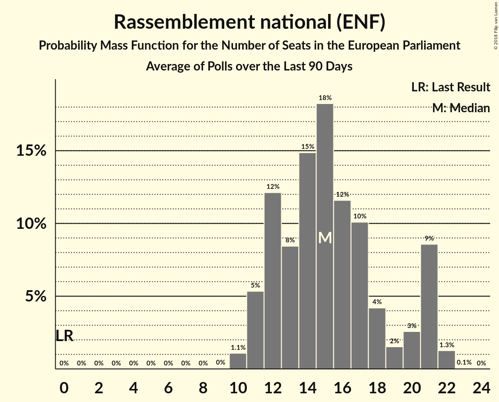

# Rassemblement national (ENF)

<a href="#voting-intentions">Voting Intentions</a> | <a href="#seats">Seats</a>

## Voting Intentions

Last result: **24.9%** (General Election of 25 May 2014)

### Confidence Intervals

| Period     | Polling firm/Commissioner(s) | Median | 80% Confidence Interval | 90% Confidence Interval | 95% Confidence Interval | 99% Confidence Interval |
|:----------:|:----------------:|:-----------:|:-----------------------:|:-----------------------:|:-----------------------:|:-----------------------:|
| N/A | [Poll Average](average.html) | 21.8% | 20.0–23.4% | 19.5–23.9% | 19.1–24.3% | 18.4–25.1% |
| [26–29 March 2019](2019-03-29-Ifop-Fiducial.html) | Ifop-Fiducial   CNews, Paris Match and Sud Radio | 21.0% | 19.6–22.5% | 19.3–22.9% | 18.9–23.3% | 18.3–24.0% |
| [25–28 March 2019](2019-03-28-Ifop-Fiducial.html) | Ifop-Fiducial   CNews, Paris Match and Sud Radio | 20.9% | 19.6–22.4% | 19.2–22.8% | 18.9–23.2% | 18.2–23.9% |
| [22–27 March 2019](2019-03-27-Ifop-Fiducial.html) | Ifop-Fiducial   CNews, Paris Match and Sud Radio | 21.5% | 20.3–22.8% | 20.0–23.1% | 19.7–23.4% | 19.1–24.1% |
| [25–27 March 2019](2019-03-27-ELABE.html) | ELABE   BFMTV | 22.0% | 20.5–23.6% | 20.1–24.0% | 19.7–24.4% | 19.0–25.2% |
| [20–26 March 2019](2019-03-26-OpinionWay–Tilder.html) | OpinionWay–Tilder   Les Echos and Radio Classique | 23.0% | 21.8–24.3% | 21.4–24.6% | 21.1–24.9% | 20.6–25.6% |
| [22–26 March 2019](2019-03-26-Ifop-Fiducial.html) | Ifop-Fiducial   CNews, Paris Match and Sud Radio | 20.0% | 18.6–21.4% | 18.3–21.8% | 18.0–22.2% | 17.3–22.8% |
| [21–25 March 2019](2019-03-25-Ifop-Fiducial.html) | Ifop-Fiducial   CNews, Paris Match and Sud Radio | 20.0% | 18.7–21.4% | 18.3–21.8% | 18.0–22.2% | 17.4–22.9% |
| [22–23 March 2019](2019-03-23-HarrisInteractive.html) | Harris Interactive   LCI, Le Figaro, RTL and TF1 | 22.0% | 20.4–23.7% | 20.0–24.2% | 19.6–24.6% | 18.9–25.4% |
| [19–22 March 2019](2019-03-22-Ifop-Fiducial.html) | Ifop-Fiducial   CNews, Paris Match and Sud Radio | 20.5% | 19.2–21.9% | 18.8–22.4% | 18.5–22.7% | 17.8–23.4% |
| [19–22 March 2019](2019-03-22-BVA.html) | BVA   Europe 1 and La Tribune | 20.5% | 19.2–21.9% | 18.8–22.4% | 18.5–22.7% | 17.8–23.4% |
| [15–21 March 2019](2019-03-21-Ipsos.html) | Ipsos   Le CEVIPOF, La Fondation Jean Jaurès and Le Monde | 22.0% | 21.3–22.7% | 21.1–22.9% | 20.9–23.1% | 20.6–23.4% |
| [18–21 March 2019](2019-03-21-Ifop-Fiducial.html) | Ifop-Fiducial   CNews, Paris Match and Sud Radio | 21.0% | 19.6–22.4% | 19.2–22.8% | 18.9–23.2% | 18.3–23.9% |
| [16–20 March 2019](2019-03-20-Ifop-Fiducial.html) | Ifop-Fiducial   CNews, Paris Match and Sud Radio | 21.5% | 20.1–23.0% | 19.8–23.4% | 19.4–23.7% | 18.8–24.4% |
| [15–19 March 2019](2019-03-19-Ifop-Fiducial.html) | Ifop-Fiducial   CNews, Paris Match and Sud Radio | 20.5% | 19.2–22.0% | 18.8–22.4% | 18.5–22.7% | 17.8–23.4% |
| [14–18 March 2019](2019-03-18-Ifop-Fiducial.html) | Ifop-Fiducial   CNews, Paris Match and Sud Radio | 20.5% | 19.2–22.0% | 18.8–22.4% | 18.5–22.7% | 17.9–23.4% |
| [12–15 March 2019](2019-03-15-Ifop-Fiducial.html) | Ifop-Fiducial   CNews, Paris Match and Sud Radio | 21.0% | 19.7–22.5% | 19.3–22.9% | 19.0–23.3% | 18.3–24.0% |
| [10–14 March 2019](2019-03-14-Ifop-Fiducial.html) | Ifop-Fiducial   CNews, Paris Match and Sud Radio | 21.0% | 19.6–22.4% | 19.3–22.8% | 18.9–23.2% | 18.3–23.9% |
| [9–13 March 2019](2019-03-13-Ifop-Fiducial.html) | Ifop-Fiducial   CNews, Paris Match and Sud Radio | 21.5% | 20.2–23.0% | 19.8–23.4% | 19.4–23.8% | 18.8–24.5% |
| [8–12 March 2019](2019-03-12-Ifop-Fiducial.html) | Ifop-Fiducial   CNews, Paris Match and Sud Radio | 21.5% | 20.1–23.0% | 19.7–23.4% | 19.4–23.7% | 18.7–24.4% |
| [7–11 March 2019](2019-03-11-Ifop-Fiducial.html) | Ifop-Fiducial   CNews, Paris Match and Sud Radio | 21.5% | 20.1–23.0% | 19.8–23.4% | 19.4–23.8% | 18.8–24.5% |
| [8–9 March 2019](2019-03-09-HarrisInteractive.html) | Harris Interactive   LCI, Le Figaro, RTL and TF1 | 21.0% | 19.5–22.7% | 19.1–23.1% | 18.7–23.5% | 18.0–24.3% |
| [5–8 March 2019](2019-03-08-Ifop-Fiducial.html) | Ifop-Fiducial   CNews, Paris Match and Sud Radio | 22.0% | 20.6–23.5% | 20.2–23.9% | 19.9–24.3% | 19.3–25.0% |
| [4–7 March 2019](2019-03-07-Ifop-Fiducial.html) | Ifop-Fiducial   CNews, Paris Match and Sud Radio | 22.0% | 20.6–23.5% | 20.2–23.9% | 19.9–24.3% | 19.3–25.0% |
| [20–27 February 2019](2019-02-27-OpinionWay–Tilder.html) | OpinionWay–Tilder   Les Echos and Radio Classique | 22.0% | 20.9–23.2% | 20.6–23.5% | 20.3–23.8% | 19.8–24.3% |
| [25–27 February 2019](2019-02-27-ELABE.html) | ELABE   BFMTV | 22.0% | 20.5–23.6% | 20.1–24.0% | 19.7–24.4% | 19.0–25.2% |
| [22–23 February 2019](2019-02-23-HarrisInteractive.html) | Harris Interactive   LCI, Le Figaro, RTL and TF1 | 20.0% | 18.5–21.7% | 18.1–22.1% | 17.7–22.5% | 17.0–23.4% |
| [15–21 February 2019](2019-02-21-Ipsos.html) | Ipsos   Le Monde | 21.0% | 20.2–21.8% | 20.0–22.1% | 19.8–22.3% | 19.4–22.7% |
| [20–21 February 2019](2019-02-21-Ifop.html) | Ifop   SWG | 23.0% | 21.4–24.8% | 20.9–25.3% | 20.5–25.7% | 19.7–26.6% |
| [20–21 February 2019](2019-02-21-BVA.html) | BVA   La Tribune and RTL | 19.1% | 17.5–20.8% | 17.0–21.3% | 16.6–21.7% | 15.9–22.6% |
| [13–15 February 2019](2019-02-15-Ifop-Fiducial.html) | Ifop-Fiducial   CNews, Paris Match and Sud Radio | 20.0% | 18.6–21.4% | 18.3–21.8% | 17.9–22.2% | 17.3–22.9% |
| [17–25 January 2019](2019-01-25-OpinionWay–Tilder.html) | OpinionWay–Tilder   Les Echos and Radio Classique | 22.0% | 20.8–23.3% | 20.4–23.6% | 20.1–24.0% | 19.6–24.6% |
| [22–23 January 2019](2019-01-23-ELABE.html) | ELABE   BFMTV | 20.5% | 18.9–22.2% | 18.5–22.7% | 18.1–23.1% | 17.4–24.0% |
| [8–9 January 2019](2019-01-09-Ifop-Fiducial.html) | Ifop-Fiducial   Valeurs Actuelles and Sud Radio | 21.0% | 19.3–22.8% | 18.9–23.3% | 18.5–23.7% | 17.7–24.6% |
| [19–20 December 2018](2018-12-20-Odoxa.html) | Odoxa   France Info | 24.0% | 21.9–26.4% | 21.2–27.0% | 20.7–27.6% | 19.7–28.7% |
| [7–10 December 2018](2018-12-10-Ifop.html) | Ifop   L’Opinion | 24.0% | 22.3–25.8% | 21.8–26.4% | 21.4–26.8% | 20.6–27.7% |
| [5–6 December 2018](2018-12-06-Ipsos.html) | Ipsos   La République en Marche | 17.0% | 15.5–18.7% | 15.1–19.1% | 14.8–19.6% | 14.1–20.4% |
| [26 November–6 December 2018](2018-12-06-BVA.html) | BVA   Presse régionale | 21.0% | 20.0–22.1% | 19.7–22.4% | 19.4–22.6% | 18.9–23.2% |
| [3–4 December 2018](2018-12-04-Ifop.html) | Ifop   Place publique | 24.0% | 22.3–25.9% | 21.8–26.4% | 21.4–26.9% | 20.6–27.8% |
| [9–12 November 2018](2018-11-12-Ifop.html) | Ifop | 22.0% | 20.3–23.8% | 19.9–24.3% | 19.5–24.8% | 18.7–25.7% |
| [6–7 November 2018](2018-11-07-ELABE.html) | ELABE   BFMTV | 20.0% | 18.4–21.7% | 18.0–22.1% | 17.6–22.6% | 16.9–23.4% |
| [30–31 October 2018](2018-10-31-Ifop.html) | Ifop   La Lettre de l’Expansion | 21.0% | 19.3–22.8% | 18.9–23.3% | 18.5–23.8% | 17.7–24.7% |
| [12–13 September 2018](2018-09-13-Odoxa.html) | Odoxa   France Info and Le Figaro | 20.9% | 19.3–22.8% | 18.8–23.3% | 18.4–23.7% | 17.6–24.6% |
| [30–31 August 2018](2018-08-31-Ifop-Fiducial.html) | Ifop-Fiducial   Paris Match and Sud Radio | 17.0% | 15.8–18.4% | 15.5–18.8% | 15.2–19.1% | 14.6–19.8% |
| [27 June–2 July 2018](2018-07-02-Ipsos.html) | Ipsos   Le Monde | 18.0% | 16.6–19.7% | 16.1–20.1% | 15.8–20.5% | 15.1–21.4% |
| [25–27 June 2018](2018-06-27-Ifop-Fiducial.html) | Ifop-Fiducial   CNews and Sud Radio | 19.0% | 17.7–20.4% | 17.3–20.8% | 17.0–21.2% | 16.4–21.9% |
| [29–30 May 2018](2018-05-30-ELABE.html) | ELABE   BFMTV | 19.5% | 18.0–21.2% | 17.6–21.7% | 17.2–22.1% | 16.5–22.9% |
| [22–23 May 2018](2018-05-23-HarrisInteractive.html) | Harris Interactive   LCP – Assemblée nationale | 15.0% | 13.9–16.2% | 13.6–16.5% | 13.4–16.8% | 12.9–17.4% |
| [7–11 May 2018](2018-05-11-Viavoice.html) | Viavoice   Europe Écologie Les Verts | 14.0% | 12.9–15.2% | 12.6–15.6% | 12.3–15.9% | 11.8–16.5% |
| [7–9 May 2018](2018-05-09-Ifop.html) | Ifop   Valeurs Actuelles | 17.0% | 15.5–18.6% | 15.0–19.1% | 14.7–19.5% | 14.0–20.3% |
| [29 November–1 December 2017](2017-12-01-Ifop.html) | Ifop   Le Figaro | 17.0% | 15.5–18.6% | 15.1–19.0% | 14.8–19.4% | 14.1–20.2% |

### Probability Mass Function

The following table shows the probability mass function per percentage block of voting intentions for the [poll average](average.html) for Rassemblement national (ENF).

| Voting Intentions | Probability | Accumulated | Special Marks |
|:-----------------:|:-----------:|:-----------:|:-------------:|
| 16.5–17.5% | 0% | 100% |  |
| 17.5–18.5% | 0.7% | 100% |  |
| 18.5–19.5% | 4% | 99.3% |  |
| 19.5–20.5% | 13% | 95% |  |
| 20.5–21.5% | 23% | 82% |  |
| 21.5–22.5% | 32% | 59% | Median |
| 22.5–23.5% | 18% | 27% |  |
| 23.5–24.5% | 7% | 9% |  |
| 24.5–25.5% | 2% | 2% | Last Result |
| 25.5–26.5% | 0.2% | 0.2% |  |
| 26.5–27.5% | 0% | 0% |  |

## Seats

Last result: **24** seats (General Election of 25 May 2014)

### Confidence Intervals

| Period     | Polling firm/Commissioner(s) | Median | 80% Confidence Interval | 90% Confidence Interval | 95% Confidence Interval | 99% Confidence Interval |
|:----------:|:----------------:|:------:|:-----------------------:|:-----------------------:|:-----------------------:|:-----------------------:|
| N/A | [Poll Average](average.html) | 22 | 19–23 | 19–23 | 18–24 | 17–25 |
| [26–29 March 2019](2019-03-29-Ifop-Fiducial.html) | Ifop-Fiducial   CNews, Paris Match and Sud Radio | 22 | 20–22 | 19–22 | 19–22 | 18–24 |
| [25–28 March 2019](2019-03-28-Ifop-Fiducial.html) | Ifop-Fiducial   CNews, Paris Match and Sud Radio | 21 | 18–22 | 18–22 | 18–22 | 18–23 |
| [22–27 March 2019](2019-03-27-Ifop-Fiducial.html) | Ifop-Fiducial   CNews, Paris Match and Sud Radio | 21 | 21–22 | 21–22 | 21–22 | 20–23 |
| [25–27 March 2019](2019-03-27-ELABE.html) | ELABE   BFMTV | 21 | 20–23 | 19–24 | 19–25 | 18–25 |
| [20–26 March 2019](2019-03-26-OpinionWay–Tilder.html) | OpinionWay–Tilder   Les Echos and Radio Classique | 22 | 22 | 21–23 | 21–25 | 21–25 |
| [22–26 March 2019](2019-03-26-Ifop-Fiducial.html) | Ifop-Fiducial   CNews, Paris Match and Sud Radio | 19 | 18–19 | 17–20 | 17–22 | 16–22 |
| [21–25 March 2019](2019-03-25-Ifop-Fiducial.html) | Ifop-Fiducial   CNews, Paris Match and Sud Radio | 19 | 18–20 | 18–22 | 18–22 | 18–22 |
| [22–23 March 2019](2019-03-23-HarrisInteractive.html) | Harris Interactive   LCI, Le Figaro, RTL and TF1 | 23 | 19–23 | 19–24 | 19–24 | 17–24 |
| [19–22 March 2019](2019-03-22-Ifop-Fiducial.html) | Ifop-Fiducial   CNews, Paris Match and Sud Radio | 20 | 18–23 | 18–23 | 17–23 | 17–24 |
| [19–22 March 2019](2019-03-22-BVA.html) | BVA   Europe 1 and La Tribune | 20 | 18–23 | 18–23 | 17–23 | 17–24 |
| [15–21 March 2019](2019-03-21-Ipsos.html) | Ipsos   Le CEVIPOF, La Fondation Jean Jaurès and Le Monde | 20 | 20 | 20 | 20 | 20–23 |
| [18–21 March 2019](2019-03-21-Ifop-Fiducial.html) | Ifop-Fiducial   CNews, Paris Match and Sud Radio | 19 | 19 | 19 | 19–21 | 19–22 |
| [16–20 March 2019](2019-03-20-Ifop-Fiducial.html) | Ifop-Fiducial   CNews, Paris Match and Sud Radio | 22 | 20–22 | 20–23 | 20–23 | 19–23 |
| [15–19 March 2019](2019-03-19-Ifop-Fiducial.html) | Ifop-Fiducial   CNews, Paris Match and Sud Radio | 25 | 20–25 | 19–25 | 19–25 | 19–25 |
| [14–18 March 2019](2019-03-18-Ifop-Fiducial.html) | Ifop-Fiducial   CNews, Paris Match and Sud Radio | 21 | 18–22 | 18–22 | 18–22 | 18–24 |
| [12–15 March 2019](2019-03-15-Ifop-Fiducial.html) | Ifop-Fiducial   CNews, Paris Match and Sud Radio | 18 | 18 | 18 | 18 | 18 |
| [10–14 March 2019](2019-03-14-Ifop-Fiducial.html) | Ifop-Fiducial   CNews, Paris Match and Sud Radio | 18 | 18 | 18–20 | 18–23 | 17–23 |
| [9–13 March 2019](2019-03-13-Ifop-Fiducial.html) | Ifop-Fiducial   CNews, Paris Match and Sud Radio | 21 | 21–23 | 20–23 | 20–23 | 19–23 |
| [8–12 March 2019](2019-03-12-Ifop-Fiducial.html) | Ifop-Fiducial   CNews, Paris Match and Sud Radio | 21 | 21 | 21 | 21–24 | 19–25 |
| [7–11 March 2019](2019-03-11-Ifop-Fiducial.html) | Ifop-Fiducial   CNews, Paris Match and Sud Radio | 22 | 21–22 | 19–22 | 19–22 | 18–24 |
| [8–9 March 2019](2019-03-09-HarrisInteractive.html) | Harris Interactive   LCI, Le Figaro, RTL and TF1 | 19 | 19 | 19 | 19 | 19 |
| [5–8 March 2019](2019-03-08-Ifop-Fiducial.html) | Ifop-Fiducial   CNews, Paris Match and Sud Radio | 23 | 20–23 | 20–23 | 20–23 | 20–23 |
| [4–7 March 2019](2019-03-07-Ifop-Fiducial.html) | Ifop-Fiducial   CNews, Paris Match and Sud Radio | 18 | 18–26 | 18–26 | 18–26 | 18–26 |
| [20–27 February 2019](2019-02-27-OpinionWay–Tilder.html) | OpinionWay–Tilder   Les Echos and Radio Classique | 20 | 19–21 | 18–22 | 18–22 | 18–23 |
| [25–27 February 2019](2019-02-27-ELABE.html) | ELABE   BFMTV | 21 | 19–23 | 19–24 | 19–26 | 18–26 |
| [22–23 February 2019](2019-02-23-HarrisInteractive.html) | Harris Interactive   LCI, Le Figaro, RTL and TF1 | 19 | 18–21 | 17–23 | 16–25 | 15–25 |
| [15–21 February 2019](2019-02-21-Ipsos.html) | Ipsos   Le Monde | 19 | 19 | 19–20 | 18–20 | 17–20 |
| [20–21 February 2019](2019-02-21-Ifop.html) | Ifop   SWG | 20 | 19–22 | 18–23 | 18–23 | 17–24 |
| [20–21 February 2019](2019-02-21-BVA.html) | BVA   La Tribune and RTL | 18 | 16–20 | 16–20 | 16–20 | 15–21 |
| [13–15 February 2019](2019-02-15-Ifop-Fiducial.html) | Ifop-Fiducial   CNews, Paris Match and Sud Radio | 19 | 18–20 | 17–21 | 17–21 | 17–23 |
| [17–25 January 2019](2019-01-25-OpinionWay–Tilder.html) | OpinionWay–Tilder   Les Echos and Radio Classique | 19 | 18–21 | 18–21 | 18–21 | 18–22 |
| [22–23 January 2019](2019-01-23-ELABE.html) | ELABE   BFMTV | 19 | 17–21 | 17–22 | 16–22 | 16–23 |
| [8–9 January 2019](2019-01-09-Ifop-Fiducial.html) | Ifop-Fiducial   Valeurs Actuelles and Sud Radio | 22 | 20–22 | 20–22 | 19–23 | 19–24 |
| [19–20 December 2018](2018-12-20-Odoxa.html) | Odoxa   France Info | 23 | 22–24 | 21–25 | 20–28 | 19–28 |
| [7–10 December 2018](2018-12-10-Ifop.html) | Ifop   L’Opinion | 23 | 23–24 | 23–26 | 22–26 | 21–28 |
| [5–6 December 2018](2018-12-06-Ipsos.html) | Ipsos   La République en Marche | 17 | 16–17 | 16–17 | 16–17 | 14–17 |
| [26 November–6 December 2018](2018-12-06-BVA.html) | BVA   Presse régionale | 20 | 20 | 20 | 20–21 | 19–23 |
| [3–4 December 2018](2018-12-04-Ifop.html) | Ifop   Place publique | 22 | 21–24 | 21–25 | 20–26 | 19–27 |
| [9–12 November 2018](2018-11-12-Ifop.html) | Ifop | 21 | 19–24 | 19–24 | 18–25 | 17–26 |
| [6–7 November 2018](2018-11-07-ELABE.html) | ELABE   BFMTV | 19 | 17–19 | 17–20 | 16–20 | 16–21 |
| [30–31 October 2018](2018-10-31-Ifop.html) | Ifop   La Lettre de l’Expansion | 20 | 18–21 | 17–22 | 17–22 | 16–23 |
| [12–13 September 2018](2018-09-13-Odoxa.html) | Odoxa   France Info and Le Figaro | 22 | 20–22 | 19–23 | 19–24 | 16–25 |
| [30–31 August 2018](2018-08-31-Ifop-Fiducial.html) | Ifop-Fiducial   Paris Match and Sud Radio | 16 | 14–17 | 14–18 | 14–18 | 14–19 |
| [27 June–2 July 2018](2018-07-02-Ipsos.html) | Ipsos   Le Monde | 18 | 15–20 | 15–21 | 15–21 | 15–21 |
| [25–27 June 2018](2018-06-27-Ifop-Fiducial.html) | Ifop-Fiducial   CNews and Sud Radio | 18 | 17–20 | 16–21 | 16–21 | 15–22 |
| [29–30 May 2018](2018-05-30-ELABE.html) | ELABE   BFMTV | 19 | 16–21 | 16–22 | 16–22 | 15–22 |
| [22–23 May 2018](2018-05-23-HarrisInteractive.html) | Harris Interactive   LCP – Assemblée nationale | 14 | 13–16 | 13–16 | 12–16 | 12–17 |
| [7–11 May 2018](2018-05-11-Viavoice.html) | Viavoice   Europe Écologie Les Verts | 12 | 11–13 | 11–13 | 10–13 | 10–14 |
| [7–9 May 2018](2018-05-09-Ifop.html) | Ifop   Valeurs Actuelles | 15 | 15–17 | 14–18 | 14–18 | 13–19 |
| [29 November–1 December 2017](2017-12-01-Ifop.html) | Ifop   Le Figaro | 16 | 15–17 | 14–18 | 14–19 | 14–20 |

### Probability Mass Function

The following table shows the probability mass function per seat for the [poll average](average.html) for Rassemblement national (ENF).

| Number of Seats | Probability | Accumulated | Special Marks |
|:---------------:|:-----------:|:-----------:|:-------------:|
| 17 | 0.9% | 100% |  |
| 18 | 3% | 99.1% |  |
| 19 | 8% | 96% |  |
| 20 | 29% | 88% |  |
| 21 | 8% | 60% |  |
| 22 | 32% | 52% | Median |
| 23 | 17% | 20% |  |
| 24 | 3% | 4% | Last Result |
| 25 | 1.1% | 1.2% |  |
| 26 | 0% | 0% |  |

