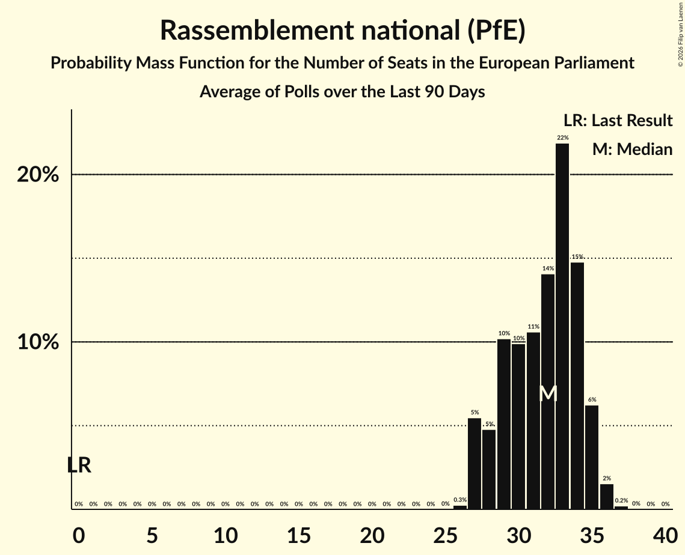

# Rassemblement national (PfE)

<a href="#voting-intentions">Voting Intentions</a> | <a href="#seats">Seats</a>

## Voting Intentions

Last result: **0.0%** (General Election of 9 June 2024)

### Confidence Intervals

| Period     | Polling firm/Commissioner(s) | Median | 80% Confidence Interval | 90% Confidence Interval | 95% Confidence Interval | 99% Confidence Interval |
|:----------:|:----------------:|:-----------:|:-----------------------:|:-----------------------:|:-----------------------:|:-----------------------:|
| N/A | [Poll Average](average.html) | 34.2% | 30.3–36.4% | 29.5–37.1% | 29.0–37.6% | 28.0–38.6% |
| [31 August–2 September 2026](2026-09-02-Ipsos.html) | Ipsos   Le Parisien | 34.7% | 33.2–36.3% | 32.7–36.8% | 32.4–37.2% | 31.6–38.0% |
| [31 August–1 September 2026](2026-09-01-Cluster17.html) | Cluster17   Le Point | 30.3% | 28.8–31.8% | 28.4–32.3% | 28.0–32.7% | 27.3–33.4% |
| [26–28 August 2026](2026-08-28-ELABE.html) | ELABE   BFMTV and La Tribune Dimanche | 34.3% | 32.8–36.0% | 32.3–36.4% | 31.9–36.8% | 31.2–37.6% |
| [24–25 August 2026](2026-08-25-Ifop–Fiducial.html) | Ifop–Fiducial   LCI, Le Figaro and Sud Radio | 33.6% | 31.8–35.5% | 31.3–36.1% | 30.9–36.5% | 30.0–37.4% |
| [18–19 August 2026](2026-08-19-HarrisInteractive.html) | Harris Interactive   M6 and RTL | 35.8% | 34.1–37.6% | 33.6–38.1% | 33.2–38.6% | 32.4–39.4% |
| [22–24 July 2026](2026-07-24-Cluster17.html) | Cluster17   Le Grand Continent | 30.0% | 28.5–31.6% | 28.0–32.1% | 27.6–32.4% | 26.9–33.2% |
| [8–10 July 2026](2026-07-10-Verian.html) | Verian   L’Hémicycle | 36.9% | 35.0–38.9% | 34.5–39.5% | 34.0–40.0% | 33.1–41.0% |
| [9–10 July 2026](2026-07-10-ELABE.html) | ELABE   BFMTV and La Tribune Dimanche | 34.8% | 33.2–36.5% | 32.8–36.9% | 32.4–37.3% | 31.6–38.1% |
| [8–9 July 2026](2026-07-09-OpinionWay.html) | OpinionWay   Les Echos | 34.8% | 32.9–36.9% | 32.3–37.5% | 31.8–38.0% | 30.9–39.0% |
| [7–8 July 2026](2026-07-08-Ifop–Fiducial.html) | Ifop–Fiducial   LCI and Le Figaro | 35.9% | 33.9–37.9% | 33.4–38.4% | 32.9–38.9% | 32.0–39.9% |
| [7–8 July 2026](2026-07-08-HarrisInteractive.html) | Harris Interactive   M6 and RTL | 35.0% | 33.3–36.9% | 32.8–37.4% | 32.4–37.8% | 31.5–38.7% |
| [22–24 June 2026](2026-06-24-Ifop–Fiducial.html) | Ifop–Fiducial   LCI, Le Figaro and Sud Radio | 35.1% | 33.5–36.8% | 33.0–37.2% | 32.6–37.6% | 31.9–38.4% |
| [10–11 June 2026](2026-06-11-OpinionWay.html) | OpinionWay   Le Journal du Dimanche | 34.0% | 32.0–36.0% | 31.4–36.6% | 30.9–37.1% | 30.0–38.1% |
| [27–28 May 2026](2026-05-28-Ipsos.html) | Ipsos   Le Parisien | 34.6% | 33.0–36.2% | 32.6–36.6% | 32.2–37.0% | 31.5–37.8% |
| [26–28 May 2026](2026-05-28-Ifop–Fiducial.html) | Ifop–Fiducial   LCI, Le Figaro and Sud Radio | 34.0% | 32.3–35.9% | 31.8–36.4% | 31.3–36.9% | 30.5–37.8% |
| [25–27 May 2026](2026-05-27-HarrisInteractive.html) | Harris Interactive   M6 and RTL | 33.1% | 31.4–34.9% | 31.0–35.4% | 30.6–35.8% | 29.8–36.6% |
| [20–21 May 2026](2026-05-21-Odoxa.html) | Odoxa   Public Sénat | 32.0% | 30.2–34.0% | 29.7–34.5% | 29.2–35.0% | 28.3–35.9% |
| [28–30 April 2026](2026-04-30-HarrisInteractive.html) | Harris Interactive   M6 and RTL | 34.7% | 33.1–36.3% | 32.7–36.7% | 32.3–37.1% | 31.6–37.9% |
| [26–27 March 2026](2026-03-27-OpinionWay.html) | OpinionWay | 37.9% | 36.0–39.9% | 35.4–40.5% | 35.0–41.0% | 34.1–41.9% |
| [25–27 March 2026](2026-03-27-ELABE.html) | ELABE   BFMTV and La Tribune Dimanche | 37.4% | 35.8–39.0% | 35.3–39.5% | 34.9–39.9% | 34.2–40.7% |
| [25–26 March 2026](2026-03-26-Odoxa.html) | Odoxa   Public Sénat | 36.0% | 34.1–38.0% | 33.6–38.6% | 33.1–39.0% | 32.2–40.0% |
| [22 March 2026](2026-03-22-HarrisInteractive.html) | Harris Interactive   M6 and RTL | 35.1% | 33.2–37.0% | 32.6–37.6% | 32.2–38.1% | 31.3–39.0% |
| [26–27 February 2026](2026-02-27-Ifop–Fiducial.html) | Ifop–Fiducial   Le Figaro and Sud Radio | 36.5% | 34.7–38.4% | 34.2–38.9% | 33.8–39.4% | 32.9–40.3% |
| [18–20 November 2025](2025-11-20-Verian.html) | Verian | 35.7% | 33.7–37.7% | 33.2–38.3% | 32.7–38.8% | 31.7–39.8% |
| [19–20 November 2025](2025-11-20-Odoxa.html) | Odoxa   Public Sénat | 35.5% | 33.7–37.3% | 33.2–37.8% | 32.8–38.3% | 31.9–39.2% |
| [30–31 October 2025](2025-10-31-ELABE.html) | ELABE   BFMTV and La Tribune Dimanche | 35.9% | 34.3–37.6% | 33.9–38.0% | 33.5–38.4% | 32.7–39.2% |
| [7 October 2025](2025-10-07-HarrisInteractive.html) | Harris Interactive   RTL | 34.9% | 33.1–36.8% | 32.6–37.3% | 32.1–37.8% | 31.3–38.7% |
| [30 September–1 October 2025](2025-10-01-Cluster17.html) | Cluster17   Le Point | 30.4% | 28.8–31.9% | 28.4–32.3% | 28.1–32.7% | 27.4–33.4% |
| [24–25 September 2025](2025-09-25-Ifop–Fiducial.html) | Ifop–Fiducial   L’Opinion and Sud Radio | 34.1% | 32.4–36.0% | 31.9–36.6% | 31.4–37.0% | 30.6–37.9% |
| [19–20 May 2025](2025-05-20-Ifop–Fiducial.html) | Ifop–Fiducial   Le Figaro and Sud Radio | 31.0% | N/A | N/A | N/A | N/A |
| [19 May 2025](2025-05-19-HarrisInteractive.html) | Harris Interactive   LCI | 30.4% | N/A | N/A | N/A | N/A |
| [11–30 April 2025](2025-04-30-Ifop.html) | Ifop   Hexagone | 32.5% | N/A | N/A | N/A | N/A |
| [23–24 April 2025](2025-04-24-Odoxa.html) | Odoxa   Public Sénat | 31.5% | N/A | N/A | N/A | N/A |
| [2–4 April 2025](2025-04-04-ELABE.html) | ELABE   BFMTV and La Tribune Dimanche | 32.7% | N/A | N/A | N/A | N/A |
| [31 March 2025](2025-03-31-HarrisInteractive.html) | Harris Interactive   RTL | 35.5% | N/A | N/A | N/A | N/A |
| [26–27 March 2025](2025-03-27-Ifop.html) | Ifop   Le Journal du Dimanche | 35.4% | N/A | N/A | N/A | N/A |
| [6–9 December 2024](2024-12-09-Ifop–Fiducial.html) | Ifop–Fiducial   Le Figaro and Sud Radio | 35.7% | N/A | N/A | N/A | N/A |
| [11–12 September 2024](2024-09-12-OpinionWay.html) | OpinionWay | 36.3% | N/A | N/A | N/A | N/A |
| [6–9 September 2024](2024-09-09-Ifop–Fiducial.html) | Ifop–Fiducial   Sud Radio | 34.2% | N/A | N/A | N/A | N/A |
| [7–8 July 2024](2024-07-08-HarrisInteractive.html) | Harris Interactive   Challenges, M6 and RTL | 31.3% | N/A | N/A | N/A | N/A |

### Probability Mass Function

The following table shows the probability mass function per percentage block of voting intentions for the [poll average](average.html) for Rassemblement national (PfE).

| Voting Intentions | Probability | Accumulated | Special Marks |
|:-----------------:|:-----------:|:-----------:|:-------------:|
| 0.0–0.5% | 0% | 100% | Last Result |
| 0.5–1.5% | 0% | 100% |  |
| 1.5–2.5% | 0% | 100% |  |
| 2.5–3.5% | 0% | 100% |  |
| 3.5–4.5% | 0% | 100% |  |
| 4.5–5.5% | 0% | 100% |  |
| 5.5–6.5% | 0% | 100% |  |
| 6.5–7.5% | 0% | 100% |  |
| 7.5–8.5% | 0% | 100% |  |
| 8.5–9.5% | 0% | 100% |  |
| 9.5–10.5% | 0% | 100% |  |
| 10.5–11.5% | 0% | 100% |  |
| 11.5–12.5% | 0% | 100% |  |
| 12.5–13.5% | 0% | 100% |  |
| 13.5–14.5% | 0% | 100% |  |
| 14.5–15.5% | 0% | 100% |  |
| 15.5–16.5% | 0% | 100% |  |
| 16.5–17.5% | 0% | 100% |  |
| 17.5–18.5% | 0% | 100% |  |
| 18.5–19.5% | 0% | 100% |  |
| 19.5–20.5% | 0% | 100% |  |
| 20.5–21.5% | 0% | 100% |  |
| 21.5–22.5% | 0% | 100% |  |
| 22.5–23.5% | 0% | 100% |  |
| 23.5–24.5% | 0% | 100% |  |
| 24.5–25.5% | 0% | 100% |  |
| 25.5–26.5% | 0% | 100% |  |
| 26.5–27.5% | 0.2% | 100% |  |
| 27.5–28.5% | 1.2% | 99.8% |  |
| 28.5–29.5% | 4% | 98.6% |  |
| 29.5–30.5% | 7% | 95% |  |
| 30.5–31.5% | 7% | 88% |  |
| 31.5–32.5% | 7% | 81% |  |
| 32.5–33.5% | 12% | 74% |  |
| 33.5–34.5% | 19% | 61% | Median |
| 34.5–35.5% | 20% | 42% |  |
| 35.5–36.5% | 13% | 22% |  |
| 36.5–37.5% | 6% | 9% |  |
| 37.5–38.5% | 2% | 3% |  |
| 38.5–39.5% | 0.5% | 0.6% |  |
| 39.5–40.5% | 0.1% | 0.1% |  |
| 40.5–41.5% | 0% | 0% |  |

## Seats

Last result: **0** seats (General Election of 9 June 2024)

### Confidence Intervals

| Period     | Polling firm/Commissioner(s) | Median | 80% Confidence Interval | 90% Confidence Interval | 95% Confidence Interval | 99% Confidence Interval |
|:----------:|:----------------:|:------:|:-----------------------:|:-----------------------:|:-----------------------:|:-----------------------:|
| N/A | [Poll Average](average.html) | 32 | 28–34 | 27–35 | 27–35 | 27–36 |
| [31 August–2 September 2026](2026-09-02-Ipsos.html) | Ipsos   Le Parisien | 33 | 31–34 | 31–35 | 30–35 | 29–36 |
| [31 August–1 September 2026](2026-09-01-Cluster17.html) | Cluster17   Le Point | 28 | 27–30 | 27–30 | 27–31 | 26–32 |
| [26–28 August 2026](2026-08-28-ELABE.html) | ELABE   BFMTV and La Tribune Dimanche | 34 | 32–35 | 31–35 | 31–35 | 30–37 |
| [24–25 August 2026](2026-08-25-Ifop–Fiducial.html) | Ifop–Fiducial   LCI, Le Figaro and Sud Radio | 30 | 29–32 | 29–33 | 28–33 | 27–34 |
| [18–19 August 2026](2026-08-19-HarrisInteractive.html) | Harris Interactive   M6 and RTL | 33 | 32–35 | 32–36 | 31–36 | 31–37 |
| [22–24 July 2026](2026-07-24-Cluster17.html) | Cluster17   Le Grand Continent | 30 | 28–31 | 28–32 | 27–32 | 26–33 |
| [8–10 July 2026](2026-07-10-Verian.html) | Verian   L’Hémicycle | 32 | 30–34 | 30–34 | 29–35 | 29–35 |
| [9–10 July 2026](2026-07-10-ELABE.html) | ELABE   BFMTV and La Tribune Dimanche | 33 | 31–34 | 31–34 | 30–35 | 30–36 |
| [8–9 July 2026](2026-07-09-OpinionWay.html) | OpinionWay   Les Echos | 32 | 29–34 | 29–34 | 28–34 | 28–35 |
| [7–8 July 2026](2026-07-08-Ifop–Fiducial.html) | Ifop–Fiducial   LCI and Le Figaro | 34 | 32–35 | 31–36 | 31–37 | 30–37 |
| [7–8 July 2026](2026-07-08-HarrisInteractive.html) | Harris Interactive   M6 and RTL | 32 | 31–33 | 30–35 | 30–35 | 29–36 |
| [22–24 June 2026](2026-06-24-Ifop–Fiducial.html) | Ifop–Fiducial   LCI, Le Figaro and Sud Radio | 33 | 30–34 | 30–34 | 29–34 | 29–35 |
| [10–11 June 2026](2026-06-11-OpinionWay.html) | OpinionWay   Le Journal du Dimanche | 32 | 30–34 | 29–34 | 29–35 | 28–35 |
| [27–28 May 2026](2026-05-28-Ipsos.html) | Ipsos   Le Parisien | 33 | 31–35 | 31–35 | 30–35 | 30–36 |
| [26–28 May 2026](2026-05-28-Ifop–Fiducial.html) | Ifop–Fiducial   LCI, Le Figaro and Sud Radio | 32 | 30–34 | 30–35 | 29–35 | 29–36 |
| [25–27 May 2026](2026-05-27-HarrisInteractive.html) | Harris Interactive   M6 and RTL | 30 | 28–32 | 28–33 | 27–34 | 27–34 |
| [20–21 May 2026](2026-05-21-Odoxa.html) | Odoxa   Public Sénat | 30 | 27–31 | 27–32 | 27–32 | 26–34 |
| [28–30 April 2026](2026-04-30-HarrisInteractive.html) | Harris Interactive   M6 and RTL | 34 | 31–34 | 30–34 | 30–34 | 29–35 |
| [26–27 March 2026](2026-03-27-OpinionWay.html) | OpinionWay | 32 | 30–34 | 30–35 | 29–36 | 29–36 |
| [25–27 March 2026](2026-03-27-ELABE.html) | ELABE   BFMTV and La Tribune Dimanche | 37 | 36–39 | 36–40 | 35–40 | 34–40 |
| [25–26 March 2026](2026-03-26-Odoxa.html) | Odoxa   Public Sénat | 35 | 31–38 | 31–38 | 31–39 | 29–40 |
| [22 March 2026](2026-03-22-HarrisInteractive.html) | Harris Interactive   M6 and RTL | 33 | 30–35 | 29–36 | 28–36 | 28–37 |
| [26–27 February 2026](2026-02-27-Ifop–Fiducial.html) | Ifop–Fiducial   Le Figaro and Sud Radio | 36 | 34–38 | 34–40 | 33–40 | 31–40 |
| [18–20 November 2025](2025-11-20-Verian.html) | Verian | 33 | 31–36 | 30–37 | 30–37 | 29–38 |
| [19–20 November 2025](2025-11-20-Odoxa.html) | Odoxa   Public Sénat | 33 | 31–35 | 30–35 | 30–35 | 29–36 |
| [30–31 October 2025](2025-10-31-ELABE.html) | ELABE   BFMTV and La Tribune Dimanche | 35 | 33–39 | 33–39 | 32–39 | 31–40 |
| [7 October 2025](2025-10-07-HarrisInteractive.html) | Harris Interactive   RTL | 31 | 29–34 | 29–34 | 29–34 | 29–35 |
| [30 September–1 October 2025](2025-10-01-Cluster17.html) | Cluster17   Le Point | 29 | 27–30 | 26–31 | 26–31 | 25–32 |
| [24–25 September 2025](2025-09-25-Ifop–Fiducial.html) | Ifop–Fiducial   L’Opinion and Sud Radio | 33 | 31–35 | 30–35 | 30–35 | 29–36 |
| [19–20 May 2025](2025-05-20-Ifop–Fiducial.html) | Ifop–Fiducial   Le Figaro and Sud Radio |  |  |  |  |  |
| [19 May 2025](2025-05-19-HarrisInteractive.html) | Harris Interactive   LCI |  |  |  |  |  |
| [11–30 April 2025](2025-04-30-Ifop.html) | Ifop   Hexagone |  |  |  |  |  |
| [23–24 April 2025](2025-04-24-Odoxa.html) | Odoxa   Public Sénat |  |  |  |  |  |
| [2–4 April 2025](2025-04-04-ELABE.html) | ELABE   BFMTV and La Tribune Dimanche |  |  |  |  |  |
| [31 March 2025](2025-03-31-HarrisInteractive.html) | Harris Interactive   RTL |  |  |  |  |  |
| [26–27 March 2025](2025-03-27-Ifop.html) | Ifop   Le Journal du Dimanche |  |  |  |  |  |
| [6–9 December 2024](2024-12-09-Ifop–Fiducial.html) | Ifop–Fiducial   Le Figaro and Sud Radio |  |  |  |  |  |
| [11–12 September 2024](2024-09-12-OpinionWay.html) | OpinionWay |  |  |  |  |  |
| [6–9 September 2024](2024-09-09-Ifop–Fiducial.html) | Ifop–Fiducial   Sud Radio |  |  |  |  |  |
| [7–8 July 2024](2024-07-08-HarrisInteractive.html) | Harris Interactive   Challenges, M6 and RTL |  |  |  |  |  |

### Probability Mass Function

The following table shows the probability mass function per seat for the [poll average](average.html) for Rassemblement national (PfE).

| Number of Seats | Probability | Accumulated | Special Marks |
|:---------------:|:-----------:|:-----------:|:-------------:|
| 0 | 0% | 100% | Last Result |
| 1 | 0% | 100% |  |
| 2 | 0% | 100% |  |
| 3 | 0% | 100% |  |
| 4 | 0% | 100% |  |
| 5 | 0% | 100% |  |
| 6 | 0% | 100% |  |
| 7 | 0% | 100% |  |
| 8 | 0% | 100% |  |
| 9 | 0% | 100% |  |
| 10 | 0% | 100% |  |
| 11 | 0% | 100% |  |
| 12 | 0% | 100% |  |
| 13 | 0% | 100% |  |
| 14 | 0% | 100% |  |
| 15 | 0% | 100% |  |
| 16 | 0% | 100% |  |
| 17 | 0% | 100% |  |
| 18 | 0% | 100% |  |
| 19 | 0% | 100% |  |
| 20 | 0% | 100% |  |
| 21 | 0% | 100% |  |
| 22 | 0% | 100% |  |
| 23 | 0% | 100% |  |
| 24 | 0% | 100% |  |
| 25 | 0% | 100% |  |
| 26 | 0.3% | 100% |  |
| 27 | 6% | 99.7% |  |
| 28 | 5% | 93% |  |
| 29 | 11% | 88% |  |
| 30 | 8% | 77% |  |
| 31 | 10% | 69% |  |
| 32 | 11% | 58% | Median |
| 33 | 22% | 47% |  |
| 34 | 17% | 25% |  |
| 35 | 6% | 8% |  |
| 36 | 2% | 2% |  |
| 37 | 0.2% | 0.3% |  |
| 38 | 0% | 0% |  |

