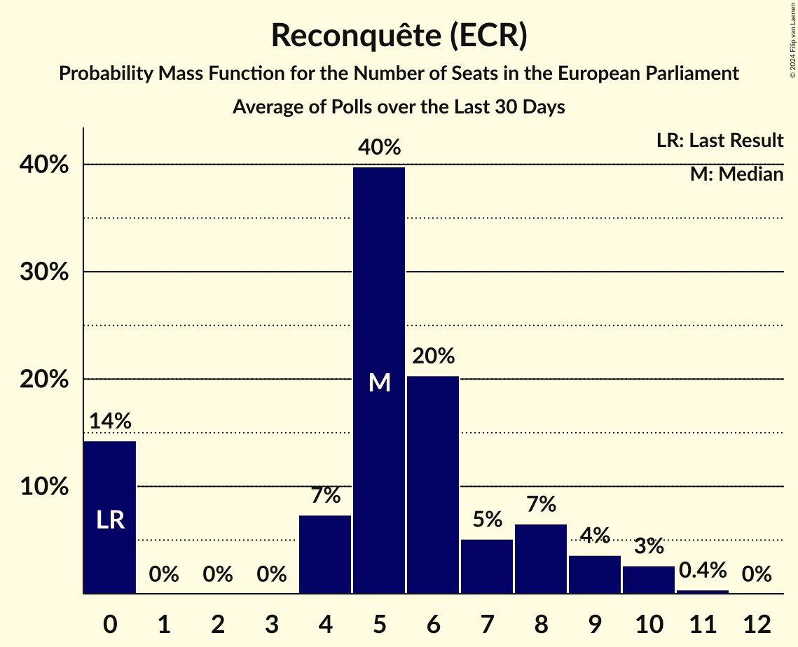

# Reconquête (ECR)

<a href="#voting-intentions">Voting Intentions</a> | <a href="#seats">Seats</a>

## Voting Intentions

Last result: **0.0%** (General Election of 26 May 2019)

### Confidence Intervals

| Period     | Polling firm/Commissioner(s) | Median | 80% Confidence Interval | 90% Confidence Interval | 95% Confidence Interval | 99% Confidence Interval |
|:----------:|:----------------:|:-----------:|:-----------------------:|:-----------------------:|:-----------------------:|:-----------------------:|
| N/A | [Poll Average](average.html) | 5.4% | 4.4–6.6% | 3.9–6.9% | 3.6–7.1% | 3.1–7.7% |
| [30 May–3 June 2024](2024-06-03-Ifop–Fiducial.html) | Ifop–Fiducial   LCI, Le Figaro and Sud Radio | 6.0% | 5.4–6.6% | 5.3–6.8% | 5.2–7.0% | 4.9–7.3% |
| [2–3 June 2024](2024-06-03-HarrisInteractive.html) | Harris Interactive   Challenges, M6 and RTL | 5.0% | 4.5–5.7% | 4.3–5.9% | 4.2–6.0% | 3.9–6.4% |
| [28–31 May 2024](2024-05-31-Ifop–Fiducial.html) | Ifop–Fiducial   LCI, Le Figaro and Sud Radio | 6.5% | 5.9–7.1% | 5.7–7.3% | 5.6–7.5% | 5.3–7.8% |
| [30–31 May 2024](2024-05-31-HarrisInteractive.html) | Harris Interactive   Challenges, M6 and RTL | 5.5% | 4.9–6.2% | 4.8–6.4% | 4.6–6.6% | 4.4–6.9% |
| [29–31 May 2024](2024-05-31-ELABE.html) | ELABE   BFMTV and La Tribune Dimanche | 5.0% | 4.4–5.7% | 4.2–5.9% | 4.1–6.1% | 3.8–6.5% |
| [28–30 May 2024](2024-05-30-OpinionWay–Tilder.html) | OpinionWay–Tilder | 6.0% | 5.4–6.7% | 5.2–6.9% | 5.1–7.1% | 4.8–7.5% |
| [27–30 May 2024](2024-05-30-Ipsos.html) | Ipsos   CEVIPOF, Fondation Jean Jaurès, Institut Montaigne and Le Monde | 5.0% | 4.7–5.3% | 4.7–5.4% | 4.6–5.4% | 4.5–5.6% |
| [26–30 May 2024](2024-05-30-Ifop–Fiducial.html) | Ifop–Fiducial   LCI, Le Figaro and Sud Radio | 6.5% | 5.9–7.2% | 5.8–7.4% | 5.6–7.5% | 5.4–7.8% |
| [29–30 May 2024](2024-05-30-HarrisInteractive.html) | Harris Interactive   Challenges, M6 and RTL | 5.5% | N/A | N/A | N/A | N/A |
| [28–30 May 2024](2024-05-30-Cluster17.html) | Cluster17   Le Point | 6.0% | 5.2–7.0% | 5.0–7.3% | 4.8–7.5% | 4.4–8.0% |
| [28–29 May 2024](2024-05-29-OpinionWay–Tilder.html) | OpinionWay–Tilder   Cnews, Europe1 and JDD | 7.0% | 6.1–8.2% | 5.8–8.5% | 5.6–8.8% | 5.2–9.4% |
| [25–29 May 2024](2024-05-29-Ifop–Fiducial.html) | Ifop–Fiducial   LCI, Le Figaro and Sud Radio | 6.5% | N/A | N/A | N/A | N/A |
| [28–29 May 2024](2024-05-29-HarrisInteractive.html) | Harris Interactive   Challenges, M6 and RTL | 5.0% | N/A | N/A | N/A | N/A |
| [24–28 May 2024](2024-05-28-Ifop–Fiducial.html) | Ifop–Fiducial   LCI, Le Figaro and Sud Radio | 6.0% | 5.4–6.8% | 5.2–7.0% | 5.0–7.2% | 4.7–7.6% |
| [27–28 May 2024](2024-05-28-HarrisInteractive.html) | Harris Interactive   Challenges, M6 and RTL | 5.0% | N/A | N/A | N/A | N/A |
| [23–27 May 2024](2024-05-27-Ifop–Fiducial.html) | Ifop–Fiducial   LCI, Le Figaro and Sud Radio | 6.0% | N/A | N/A | N/A | N/A |
| [24–27 May 2024](2024-05-27-HarrisInteractive.html) | Harris Interactive   Challenges, M6 and RTL | 5.0% | 4.4–5.7% | 4.3–5.9% | 4.1–6.1% | 3.9–6.4% |
| [24–25 May 2024](2024-05-25-ELABE.html) | ELABE   BFMTV and La Tribune Dimanche | 5.5% | 4.8–6.3% | 4.7–6.5% | 4.5–6.7% | 4.2–7.1% |
| [21–24 May 2024](2024-05-24-OpinionWay–Tilder.html) | OpinionWay–Tilder   Les Echos and Radio Classique | 7.0% | 6.3–7.8% | 6.1–8.0% | 6.0–8.2% | 5.7–8.6% |
| [23–24 May 2024](2024-05-24-Odoxa.html) | Odoxa   Public Sénat | 4.0% | 3.3–5.0% | 3.1–5.2% | 3.0–5.5% | 2.7–5.9% |
| [21–24 May 2024](2024-05-24-Ifop–Fiducial.html) | Ifop–Fiducial   LCI, Le Figaro and Sud Radio | 6.5% | N/A | N/A | N/A | N/A |
| [20–23 May 2024](2024-05-23-Ifop–Fiducial.html) | Ifop–Fiducial   LCI, Le Figaro and Sud Radio | 6.0% | N/A | N/A | N/A | N/A |
| [21–22 May 2024](2024-05-22-OpinionWay–Tilder.html) | OpinionWay–Tilder   Cnews, Europe1 and JDD | 7.0% | N/A | N/A | N/A | N/A |
| [20–22 May 2024](2024-05-22-Ifop–Fiducial.html) | Ifop–Fiducial   LCI, Le Figaro and Sud Radio | 6.0% | N/A | N/A | N/A | N/A |
| [21–22 May 2024](2024-05-22-Cluster17.html) | Cluster17   Le Point | 6.0% | 5.2–7.1% | 5.0–7.4% | 4.7–7.7% | 4.4–8.2% |
| [20–21 May 2024](2024-05-21-Viavoice.html) | Viavoice   Libération | 6.0% | 5.2–7.1% | 5.0–7.4% | 4.8–7.7% | 4.4–8.2% |
| [19–21 May 2024](2024-05-21-Ifop–Fiducial.html) | Ifop–Fiducial   LCI, Le Figaro and Sud Radio | 6.0% | 5.3–7.0% | 5.0–7.2% | 4.9–7.4% | 4.5–7.9% |
| [15–17 May 2024](2024-05-17-Ifop–Fiducial.html) | Ifop–Fiducial   LCI, Le Figaro and Sud Radio | 6.0% | 5.2–6.9% | 5.0–7.2% | 4.8–7.4% | 4.5–7.9% |
| [15–17 May 2024](2024-05-17-HarrisInteractive.html) | Harris Interactive   Challenges, M6 and RTL | 5.5% | N/A | N/A | N/A | N/A |
| [15–17 May 2024](2024-05-17-ELABE.html) | ELABE   BFMTV and La Tribune Dimanche | 5.5% | 4.8–6.4% | 4.6–6.6% | 4.4–6.8% | 4.1–7.3% |
| [14–16 May 2024](2024-05-16-OpinionWay–Tilder.html) | OpinionWay–Tilder   Les Echos and Radio Classique | 8.0% | N/A | N/A | N/A | N/A |
| [13–16 May 2024](2024-05-16-Ifop–Fiducial.html) | Ifop–Fiducial   LCI, Le Figaro and Sud Radio | 5.5% | N/A | N/A | N/A | N/A |
| [15–16 May 2024](2024-05-16-BVA.html) | BVA   RTL | 6.0% | 5.3–6.9% | 5.1–7.1% | 4.9–7.3% | 4.6–7.8% |
| [6–15 May 2024](2024-05-15-YouGov.html) | YouGov | 6.0% | 5.2–7.1% | 4.9–7.4% | 4.7–7.7% | 4.3–8.2% |
| [14–15 May 2024](2024-05-15-OpinionWay–Tilder.html) | OpinionWay–Tilder   Cnews, Europe1 and JDD | 8.0% | 7.0–9.2% | 6.7–9.5% | 6.4–9.8% | 6.0–10.4% |
| [11–15 May 2024](2024-05-15-Ifop–Fiducial.html) | Ifop–Fiducial   LCI, Le Figaro and Sud Radio | 5.5% | N/A | N/A | N/A | N/A |
| [13–15 May 2024](2024-05-15-Cluster17.html) | Cluster17   Le Point | 6.0% | 5.2–6.9% | 5.0–7.2% | 4.8–7.4% | 4.5–7.9% |
| [13–14 May 2024](2024-05-14-Ipsos.html) | Ipsos   Le Parisien and Radio France | 6.0% | 5.3–6.9% | 5.1–7.1% | 4.9–7.3% | 4.6–7.8% |
| [10–14 May 2024](2024-05-14-Ifop–Fiducial.html) | Ifop–Fiducial   LCI, Le Figaro and Sud Radio | 6.0% | N/A | N/A | N/A | N/A |
| [9–13 May 2024](2024-05-13-Ifop–Fiducial.html) | Ifop–Fiducial   LCI, Le Figaro and Sud Radio | 6.0% | N/A | N/A | N/A | N/A |
| [10–13 May 2024](2024-05-13-HarrisInteractive.html) | Harris Interactive   Challenges, M6 and RTL | 5.0% | 4.5–5.7% | 4.3–5.8% | 4.2–6.0% | 3.9–6.3% |
| [6–10 May 2024](2024-05-10-Ifop–Fiducial.html) | Ifop–Fiducial   LCI, Le Figaro and Sud Radio | 6.4% | 5.7–7.4% | 5.5–7.7% | 5.3–8.0% | 4.9–8.4% |
| [5–9 May 2024](2024-05-09-Ifop–Fiducial.html) | Ifop–Fiducial   LCI, Le Figaro and Sud Radio | 6.5% | N/A | N/A | N/A | N/A |
| [6–9 May 2024](2024-05-09-Cluster17.html) | Cluster17   Le Point | 6.0% | 5.2–6.9% | 4.9–7.2% | 4.8–7.5% | 4.4–7.9% |
| [6–7 May 2024](2024-05-07-OpinionWay–Tilder.html) | OpinionWay–Tilder   Les Echos | 8.0% | N/A | N/A | N/A | N/A |
| [3–7 May 2024](2024-05-07-Ifop–Fiducial.html) | Ifop–Fiducial   LCI, Le Figaro and Sud Radio | 6.0% | 5.3–7.0% | 5.1–7.2% | 4.9–7.5% | 4.5–7.9% |
| [5–6 May 2024](2024-05-06-OpinionWay–Tilder.html) | OpinionWay–Tilder   Cnews, Europe1 and JDD | 7.0% | N/A | N/A | N/A | N/A |
| [2–6 May 2024](2024-05-06-Ifop–Fiducial.html) | Ifop–Fiducial   LCI, Le Figaro and Sud Radio | 6.0% | N/A | N/A | N/A | N/A |
| [30 April–3 May 2024](2024-05-03-Ifop–Fiducial.html) | Ifop–Fiducial   LCI, Le Figaro and Sud Radio | 6.5% | N/A | N/A | N/A | N/A |
| [30 April–3 May 2024](2024-05-03-HarrisInteractive.html) | Harris Interactive   Challenges, M6 and RTL | 5.5% | 4.9–6.2% | 4.7–6.4% | 4.6–6.6% | 4.3–6.9% |
| [30 April–3 May 2024](2024-05-03-ELABE.html) | ELABE   BFMTV and La Tribune Dimanche | 5.0% | 4.3–5.9% | 4.1–6.1% | 4.0–6.3% | 3.7–6.7% |
| [29 April–2 May 2024](2024-05-02-OpinionWay–Tilder.html) | OpinionWay–Tilder   Les Echos and Radio Classique | 7.0% | 6.1–8.1% | 5.8–8.4% | 5.6–8.7% | 5.2–9.2% |
| [29 April–2 May 2024](2024-05-02-Ifop–Fiducial.html) | Ifop–Fiducial   LCI, Le Figaro and Sud Radio | 6.5% | N/A | N/A | N/A | N/A |
| [29 April–1 May 2024](2024-05-01-Cluster17.html) | Cluster17   Le Point | 5.5% | 4.8–6.4% | 4.6–6.7% | 4.4–6.9% | 4.1–7.3% |
| [29–30 April 2024](2024-04-30-OpinionWay–Tilder.html) | OpinionWay–Tilder   Cnews, Europe1 and JDD | 8.0% | 7.0–9.2% | 6.7–9.6% | 6.5–9.9% | 6.1–10.5% |
| [26–30 April 2024](2024-04-30-Ifop–Fiducial.html) | Ifop–Fiducial   LCI, Le Figaro and Sud Radio | 6.5% | 5.7–7.4% | 5.5–7.7% | 5.3–7.9% | 4.9–8.4% |
| [25–29 April 2024](2024-04-29-Ifop–Fiducial.html) | Ifop–Fiducial   LCI, Le Figaro and Sud Radio | 6.0% | 5.3–7.0% | 5.0–7.2% | 4.9–7.4% | 4.5–7.9% |
| [25–26 April 2024](2024-04-26-Odoxa.html) | Odoxa   Public Sénat | 5.5% | 4.6–6.5% | 4.4–6.8% | 4.2–7.1% | 3.9–7.6% |
| [23–26 April 2024](2024-04-26-Ifop–Fiducial.html) | Ifop–Fiducial   LCI, Le Figaro and Sud Radio | 5.5% | 4.8–6.4% | 4.6–6.6% | 4.4–6.9% | 4.1–7.3% |
| [24–26 April 2024](2024-04-26-HarrisInteractive.html) | Harris Interactive   Challenges, M6 and RTL | 6.0% | 5.4–6.7% | 5.2–6.9% | 5.1–7.0% | 4.8–7.4% |
| [25–26 April 2024](2024-04-26-BVA.html) | BVA   RTL | 5.5% | 4.8–6.4% | 4.6–6.6% | 4.4–6.8% | 4.1–7.3% |
| [24–25 April 2024](2024-04-25-OpinionWay–Tilder.html) | OpinionWay–Tilder   Les Echos and Radio Classique | 8.0% | 7.0–9.2% | 6.7–9.6% | 6.5–9.9% | 6.0–10.5% |
| [22–25 April 2024](2024-04-25-Ifop–Fiducial.html) | Ifop–Fiducial   LCI, Le Figaro and Sud Radio | 5.5% | N/A | N/A | N/A | N/A |
| [23–25 April 2024](2024-04-25-Cluster17.html) | Cluster17   Le Point | 6.0% | 5.2–7.0% | 5.0–7.3% | 4.8–7.5% | 4.4–8.0% |
| [23–24 April 2024](2024-04-24-OpinionWay–Tilder.html) | OpinionWay–Tilder   Cnews, Europe1 and JDD | 6.0% | N/A | N/A | N/A | N/A |
| [19–24 April 2024](2024-04-24-Ipsos.html) | Ipsos   Le Parisien and Radio France | 5.5% | 5.2–5.8% | 5.1–5.9% | 5.1–6.0% | 5.0–6.1% |
| [20–24 April 2024](2024-04-24-Ifop–Fiducial.html) | Ifop–Fiducial   LCI, Le Figaro and Sud Radio | 5.5% | 4.7–6.4% | 4.5–6.6% | 4.4–6.8% | 4.0–7.3% |
| [19–23 April 2024](2024-04-23-Ifop–Fiducial.html) | Ifop–Fiducial   LCI, Le Figaro and Sud Radio | 5.5% | N/A | N/A | N/A | N/A |
| [18–22 April 2024](2024-04-22-Ifop–Fiducial.html) | Ifop–Fiducial   LCI, Le Figaro and Sud Radio | 5.5% | N/A | N/A | N/A | N/A |
| [19–22 April 2024](2024-04-22-HarrisInteractive.html) | Harris Interactive   Challenges, M6 and RTL | 6.0% | 5.4–6.7% | 5.2–6.9% | 5.1–7.0% | 4.8–7.4% |
| [16–19 April 2024](2024-04-19-Ifop–Fiducial.html) | Ifop–Fiducial   LCI, Le Figaro and Sud Radio | 5.5% | N/A | N/A | N/A | N/A |
| [17–18 April 2024](2024-04-18-OpinionWay–Tilder.html) | OpinionWay–Tilder   Les Echos and Radio Classique | 7.0% | 6.0–8.1% | 5.8–8.4% | 5.5–8.7% | 5.1–9.3% |
| [15–18 April 2024](2024-04-18-Ifop–Fiducial.html) | Ifop–Fiducial   LCI, Le Figaro and Sud Radio | 5.5% | 4.8–6.4% | 4.6–6.6% | 4.4–6.9% | 4.1–7.3% |
| [16–17 April 2024](2024-04-17-OpinionWay–Tilder.html) | OpinionWay–Tilder   Cnews | 6.0% | 5.1–7.1% | 4.9–7.4% | 4.7–7.6% | 4.3–8.2% |
| [13–17 April 2024](2024-04-17-Ifop–Fiducial.html) | Ifop–Fiducial   LCI, Le Figaro and Sud Radio | 5.5% | N/A | N/A | N/A | N/A |
| [12–16 April 2024](2024-04-16-Ifop–Fiducial.html) | Ifop–Fiducial   LCI, Le Figaro and Sud Radio | 6.0% | N/A | N/A | N/A | N/A |
| [11–15 April 2024](2024-04-15-Ifop–Fiducial.html) | Ifop–Fiducial   LCI, Le Figaro and Sud Radio | 6.0% | N/A | N/A | N/A | N/A |
| [12–15 April 2024](2024-04-15-HarrisInteractive.html) | Harris Interactive   Challenges, M6 and RTL | 6.0% | 5.3–6.7% | 5.2–6.9% | 5.0–7.1% | 4.7–7.5% |
| [9–12 April 2024](2024-04-12-Ifop–Fiducial.html) | Ifop–Fiducial   LCI, Le Figaro and Sud Radio | 6.0% | N/A | N/A | N/A | N/A |
| [10–11 April 2024](2024-04-11-Ipsos.html) | Ipsos   Le Parisien and Radio France | 6.5% | 5.8–7.4% | 5.6–7.7% | 5.4–7.9% | 5.0–8.4% |
| [8–11 April 2024](2024-04-11-Ifop–Fiducial.html) | Ifop–Fiducial   LCI, Le Figaro and Sud Radio | 6.5% | N/A | N/A | N/A | N/A |
| [9–11 April 2024](2024-04-11-Cluster17.html) | Cluster17   Le Point | 6.0% | 5.2–7.0% | 5.0–7.3% | 4.8–7.5% | 4.4–8.0% |
| [6–10 April 2024](2024-04-10-Ifop–Fiducial.html) | Ifop–Fiducial   LCI, Le Figaro and Sud Radio | 6.5% | N/A | N/A | N/A | N/A |
| [3–9 April 2024](2024-04-09-YouGov.html) | YouGov   HuffPost | 9.0% | 8.0–10.3% | 7.7–10.7% | 7.4–11.0% | 7.0–11.6% |
| [5–9 April 2024](2024-04-09-Ifop–Fiducial.html) | Ifop–Fiducial   LCI, Le Figaro and Sud Radio | 6.5% | N/A | N/A | N/A | N/A |
| [4–8 April 2024](2024-04-08-Ifop–Fiducial.html) | Ifop–Fiducial   LCI, Le Figaro and Sud Radio | 6.0% | N/A | N/A | N/A | N/A |
| [5–8 April 2024](2024-04-08-HarrisInteractive.html) | Harris Interactive   Challenges, M6 and RTL | 6.0% | N/A | N/A | N/A | N/A |
| [5–7 April 2024](2024-04-07-Ifop–Fiducial.html) | Ifop–Fiducial   JDD | 6.0% | 5.2–6.9% | 5.0–7.2% | 4.9–7.4% | 4.5–7.9% |
| [3–5 April 2024](2024-04-05-OpinionWay–Tilder.html) | OpinionWay–Tilder   Cnews | 7.0% | N/A | N/A | N/A | N/A |
| [2–4 April 2024](2024-04-04-ELABE.html) | ELABE   BFMTV and La Tribune Dimanche | 5.5% | 4.8–6.4% | 4.6–6.6% | 4.5–6.8% | 4.2–7.2% |
| [28–29 March 2024](2024-03-29-HarrisInteractive.html) | Harris Interactive   Challenges, M6 and RTL | 6.0% | 5.4–6.7% | 5.2–6.9% | 5.1–7.1% | 4.8–7.4% |
| [27–28 March 2024](2024-03-28-BVA.html) | BVA   RTL | 5.5% | 4.8–6.3% | 4.6–6.5% | 4.4–6.7% | 4.1–7.1% |
| [22–25 March 2024](2024-03-25-HarrisInteractive.html) | Harris Interactive   Challenges, M6 and RTL | 6.0% | N/A | N/A | N/A | N/A |
| [19–20 March 2024](2024-03-20-Ifop–Fiducial.html) | Ifop–Fiducial   LCI, Le Figaro and Sud Radio | 6.0% | 5.2–7.0% | 5.0–7.3% | 4.8–7.6% | 4.4–8.1% |
| [15–18 March 2024](2024-03-18-HarrisInteractive.html) | Harris Interactive   Challenges, M6 and RTL | 6.0% | 5.4–6.7% | 5.2–6.9% | 5.0–7.1% | 4.8–7.4% |
| [13–14 March 2024](2024-03-14-OpinionWay–Tilder.html) | OpinionWay–Tilder   Les Echos and Radio Classique | 6.0% | 5.1–7.0% | 4.8–7.3% | 4.6–7.6% | 4.3–8.1% |
| [8–9 March 2024](2024-03-09-Cluster17.html) | Cluster17   Le Point | 6.0% | 5.1–7.1% | 4.9–7.4% | 4.7–7.7% | 4.3–8.2% |
| [26 February–7 March 2024](2024-03-07-YouGov.html) | YouGov   HuffPost | 5.0% | 4.2–6.0% | 4.0–6.2% | 3.8–6.5% | 3.4–7.0% |
| [5–7 March 2024](2024-03-07-ELABE.html) | ELABE   BFMTV and La Tribune Dimanche | 4.5% | 3.9–5.3% | 3.7–5.5% | 3.6–5.7% | 3.3–6.1% |
| [1–6 March 2024](2024-03-06-Ipsos.html) | Ipsos   CEVIPOF, Fondation Jean Jaurès, Institut Montaigne and Le Monde | 5.0% | 4.7–5.3% | 4.7–5.3% | 4.6–5.4% | 4.5–5.5% |
| [23 February–5 March 2024](2024-03-05-Ipsos.html) | Ipsos   Euronews | 5.5% | N/A | N/A | N/A | N/A |
| [29 February–1 March 2024](2024-03-01-Ifop–Fiducial.html) | Ifop–Fiducial   JDD | 6.0% | 5.2–6.9% | 5.0–7.2% | 4.9–7.4% | 4.5–7.9% |
| [27–28 February 2024](2024-02-28-BVA.html) | BVA   RTL | 6.0% | 5.3–7.0% | 5.0–7.2% | 4.9–7.4% | 4.5–7.9% |
| [17–22 February 2024](2024-02-22-StackDataStrategy.html) | Stack Data Strategy | 6.6% | 5.5–7.9% | 5.2–8.3% | 5.0–8.6% | 4.5–9.3% |
| [21–22 February 2024](2024-02-22-Odoxa.html) | Odoxa   Public Sénat | 7.0% | 6.0–8.1% | 5.8–8.4% | 5.5–8.7% | 5.1–9.3% |
| [14–15 February 2024](2024-02-15-OpinionWay–Tilder.html) | OpinionWay–Tilder   Les Echos and Radio Classique | 7.9% | 6.9–9.1% | 6.6–9.5% | 6.4–9.8% | 6.0–10.4% |
| [7–9 February 2024](2024-02-09-ELABE.html) | ELABE   BFMTV and La Tribune Dimanche | 5.0% | 4.3–5.8% | 4.1–6.0% | 4.0–6.2% | 3.7–6.7% |
| [7–8 February 2024](2024-02-08-Ifop–Fiducial.html) | Ifop–Fiducial   LCI, Le Figaro and Sud Radio | 6.2% | 5.4–7.1% | 5.2–7.4% | 5.0–7.6% | 4.7–8.1% |
| [29 January–7 February 2024](2024-02-07-YouGov.html) | YouGov | 7.9% | 6.9–9.1% | 6.6–9.4% | 6.4–9.7% | 5.9–10.3% |
| [24–31 January 2024](2024-01-31-PortlandCommunications.html) | Portland Communications | 6.0% | 4.8–7.6% | 4.4–8.1% | 4.2–8.5% | 3.7–9.4% |
| [17–18 January 2024](2024-01-18-OpinionWay–Tilder.html) | OpinionWay–Tilder   Les Echos | 7.0% | 6.0–8.1% | 5.8–8.4% | 5.6–8.7% | 5.1–9.3% |
| [16–17 January 2024](2024-01-17-Ifop–Fiducial.html) | Ifop–Fiducial   Le Nouvel Economiste | 7.0% | 6.2–8.0% | 5.9–8.2% | 5.7–8.5% | 5.4–9.0% |
| [8–15 January 2024](2024-01-15-YouGov.html) | YouGov | 7.0% | 6.0–8.1% | 5.8–8.4% | 5.5–8.7% | 5.1–9.3% |
| [12–15 January 2024](2024-01-15-Ifop–Fiducial.html) | Ifop–Fiducial   L’Itinérant | 6.1% | 5.1–7.2% | 4.9–7.6% | 4.7–7.8% | 4.3–8.4% |
| [12–15 January 2024](2024-01-15-HarrisInteractive.html) | Harris Interactive   Challenges | 6.0% | 5.2–7.0% | 5.0–7.2% | 4.8–7.5% | 4.4–8.0% |
| [13–14 January 2024](2024-01-14-Cluster17.html) | Cluster17   Le Point | 7.0% | 6.2–8.1% | 5.9–8.4% | 5.7–8.6% | 5.3–9.1% |
| [10–12 January 2024](2024-01-12-ELABE.html) | ELABE   BFMTV and La Tribune Dimanche | 5.0% | 4.3–5.8% | 4.1–6.1% | 4.0–6.3% | 3.7–6.7% |
| [3–5 January 2024](2024-01-05-Ifop–Fiducial.html) | Ifop–Fiducial   L’Itinérant | 6.5% | N/A | N/A | N/A | N/A |
| [13–14 December 2023](2023-12-14-OpinionWay–Tilder.html) | OpinionWay–Tilder   Les Echos | 8.0% | 7.1–9.1% | 6.9–9.4% | 6.7–9.7% | 6.2–10.2% |
| [13–14 December 2023](2023-12-14-Odoxa.html) | Odoxa   Public Sénat | 6.0% | 5.1–7.1% | 4.9–7.4% | 4.7–7.6% | 4.3–8.2% |
| [29 November–12 December 2023](2023-12-12-IpsosandSopraSteria.html) | Ipsos and Sopra Steria   CEVIPOF and Le Monde | 6.5% | 6.2–6.8% | 6.1–6.9% | 6.1–7.0% | 5.9–7.1% |
| [8–11 December 2023](2023-12-11-Ifop–Fiducial.html) | Ifop–Fiducial   Sud Radio | 7.5% | 6.6–8.7% | 6.3–9.0% | 6.1–9.3% | 5.7–9.9% |
| [15–16 November 2023](2023-11-16-OpinionWay–Tilder.html) | OpinionWay–Tilder   Les Echos | 7.0% | 6.2–8.0% | 5.9–8.3% | 5.7–8.6% | 5.4–9.1% |
| [9–10 November 2023](2023-11-10-IpsosandSopraSteria.html) | Ipsos and Sopra Steria   La Tribune Dimanche | 6.0% | 5.3–6.9% | 5.1–7.2% | 4.9–7.4% | 4.6–7.8% |
| [12–13 October 2023](2023-10-13-Ifop–Fiducial.html) | Ifop–Fiducial   Le Figaro and Sud Radio | 5.5% | 4.8–6.3% | 4.6–6.5% | 4.4–6.8% | 4.1–7.2% |
| [30–31 August 2023](2023-08-31-Ifop–Fiducial.html) | Ifop–Fiducial   JDD | 6.5% | 5.6–7.5% | 5.4–7.8% | 5.2–8.1% | 4.8–8.6% |
| [4–5 July 2023](2023-07-05-Ifop–Fiducial.html) | Ifop–Fiducial   Sud Radio | 7.0% | 6.1–8.2% | 5.8–8.5% | 5.6–8.8% | 5.2–9.4% |
| [16–26 June 2023](2023-06-26-IpsosandSopraSteria.html) | Ipsos and Sopra Steria   CEVIPOF and Le Monde | 6.5% | 6.1–7.0% | 5.9–7.1% | 5.8–7.2% | 5.6–7.5% |
| [19–21 June 2023](2023-06-21-ELABE.html) | ELABE | 5.5% | N/A | N/A | N/A | N/A |
| [17–19 May 2023](2023-05-19-Cluster17.html) | Cluster17   Le Point | 6.5% | 5.8–7.3% | 5.6–7.5% | 5.4–7.7% | 5.1–8.1% |
| [10–11 May 2023](2023-05-11-Ifop–Fiducial.html) | Ifop–Fiducial   JDD and Sud Radio | 6.0% | 5.3–7.0% | 5.0–7.2% | 4.9–7.5% | 4.5–7.9% |
| [20–21 March 2023](2023-03-21-Ifop–Fiducial.html) | Ifop–Fiducial   JDD and Sud Radio | 0.0% | 4.3–6.0% | 4.1–6.2% | 3.9–6.5% | 3.6–7.0% |
| [2–4 November 2022](2022-11-04-Ifop–Fiducial.html) | Ifop–Fiducial   JDD and Sud Radio | 0.0% | 4.3–5.9% | 4.1–6.1% | 4.0–6.3% | 3.7–6.7% |
| [24–25 April 2022](2022-04-25-HarrisInteractive.html) | Harris Interactive   Challenges | 0.0% | 6.3–7.8% | 6.1–8.0% | 5.9–8.2% | 5.6–8.6% |
| [5–8 April 2022](2022-04-08-OpinionWayandKéaPartners.html) | OpinionWay and Kéa Partners   Les Échos and Radio Classique | 0.0% | 8.2–9.9% | 8.0–10.1% | 7.8–10.3% | 7.5–10.8% |
| [6–8 April 2022](2022-04-08-IpsosandSopraSteria.html) | Ipsos and Sopra Steria   France Info and Le Parisien | 0.0% | 8.2–10.0% | 7.9–10.2% | 7.7–10.5% | 7.4–10.9% |
| [5–8 April 2022](2022-04-08-Ifop–Fiducial.html) | Ifop–Fiducial   Paris Match, LCI and Sud Radio | 0.0% | 8.3–9.7% | 8.2–9.9% | 8.0–10.1% | 7.7–10.4% |
| [7–8 April 2022](2022-04-08-HarrisInteractive.html) | Harris Interactive   Challenges | 0.0% | 7.7–9.4% | 7.5–9.7% | 7.3–9.9% | 7.0–10.3% |
| [7–8 April 2022](2022-04-08-Elabe.html) | Elabe   BFMTV, L’Express and SFR | 0.0% | 7.7–9.4% | 7.5–9.7% | 7.3–10.0% | 6.9–10.4% |
| [6–8 April 2022](2022-04-08-Cluster17.html) | Cluster17 | 0.0% | 8.8–10.2% | 8.7–10.4% | 8.5–10.6% | 8.2–10.9% |
| [4–7 April 2022](2022-04-07-YouGov.html) | YouGov | 0.0% | 12.0–14.1% | 11.8–14.4% | 11.5–14.7% | 11.1–15.2% |
| [4–7 April 2022](2022-04-07-OpinionWayandKéaPartners.html) | OpinionWay and Kéa Partners   Les Échos and Radio Classique | 0.0% | 8.2–9.9% | 8.0–10.1% | 7.8–10.3% | 7.5–10.8% |
| [5–7 April 2022](2022-04-07-IpsosandSopraSteria.html) | Ipsos and Sopra Steria   France Info and Le Parisien | 0.0% | 7.7–9.4% | 7.5–9.7% | 7.3–10.0% | 6.9–10.4% |
| [3–7 April 2022](2022-04-07-Ifop–Fiducial.html) | Ifop–Fiducial   Paris Match, LCI and Sud Radio | 0.0% | 7.9–9.2% | 7.7–9.4% | 7.6–9.6% | 7.3–9.9% |
| [6–7 April 2022](2022-04-07-BVA.html) | BVA   RTL and Orange | 0.0% | 8.4–10.8% | 8.1–11.2% | 7.8–11.5% | 7.3–12.1% |
| [3–6 April 2022](2022-04-06-OpinionWayandKéaPartners.html) | OpinionWay and Kéa Partners   Les Échos and Radio Classique | 0.0% | 8.2–9.9% | 8.0–10.1% | 7.8–10.4% | 7.4–10.8% |
| [5–6 April 2022](2022-04-06-Odoxa.html) | Odoxa   L’Obs and Mascaret | 0.0% | 7.1–8.7% | 6.9–8.9% | 6.7–9.1% | 6.4–9.6% |
| [4–6 April 2022](2022-04-06-IpsosandSopraSteria.html) | Ipsos and Sopra Steria   France Info and Le Parisien | 0.0% | 7.7–9.4% | 7.5–9.7% | 7.3–10.0% | 6.9–10.4% |
| [2–6 April 2022](2022-04-06-Ifop–Fiducial.html) | Ifop–Fiducial   Paris Match, LCI and Sud Radio | 0.0% | 8.4–9.7% | 8.2–9.9% | 8.0–10.1% | 7.7–10.4% |
| [4–6 April 2022](2022-04-06-AtlasIntel.html) | AtlasIntel | 0.0% | 10.8–12.7% | 10.6–13.0% | 10.3–13.2% | 9.9–13.7% |
| [2–5 April 2022](2022-04-05-OpinionWayandKéaPartners.html) | OpinionWay and Kéa Partners   Les Échos and Radio Classique | 0.0% | 8.2–9.9% | 7.9–10.2% | 7.7–10.4% | 7.4–10.9% |
| [4–5 April 2022](2022-04-05-KantarandEpoka.html) | Kantar and Epoka | 0.0% | 10.0–12.1% | 9.7–12.4% | 9.4–12.7% | 9.0–13.3% |
| [2–5 April 2022](2022-04-05-IpsosandSopraSteria.html) | Ipsos and Sopra Steria   France Info and Le Parisien | 0.0% | 9.1–11.0% | 8.9–11.3% | 8.7–11.6% | 8.3–12.0% |
| [1–5 April 2022](2022-04-05-Ifop–Fiducial.html) | Ifop–Fiducial   Paris Match, LCI and Sud Radio | 0.0% | 8.9–10.2% | 8.7–10.4% | 8.5–10.6% | 8.2–11.0% |
| [4–5 April 2022](2022-04-05-Elabe.html) | Elabe   BFMTV, L’Express and SFR | 0.0% | 8.1–10.0% | 7.8–10.3% | 7.6–10.5% | 7.2–11.0% |
| [1–4 April 2022](2022-04-04-OpinionWayandKéaPartners.html) | OpinionWay and Kéa Partners   Les Échos and Radio Classique | 0.0% | N/A | N/A | N/A | N/A |
| [1–4 April 2022](2022-04-04-IpsosandSopraSteria.html) | Ipsos and Sopra Steria   France Info and Le Parisien | 0.0% | N/A | N/A | N/A | N/A |
| [31 March–4 April 2022](2022-04-04-Ifop–Fiducial.html) | Ifop–Fiducial   Paris Match, LCI and Sud Radio | 0.0% | N/A | N/A | N/A | N/A |
| [1–4 April 2022](2022-04-04-HarrisInteractive.html) | Harris Interactive   Challenges | 0.0% | 8.8–10.3% | 8.6–10.5% | 8.4–10.7% | 8.1–11.1% |
| [2–4 April 2022](2022-04-04-Cluster17.html) | Cluster17 | 0.0% | 10.3–11.8% | 10.0–12.0% | 9.9–12.2% | 9.5–12.6% |
| [2–3 April 2022](2022-04-03-OpinionWay.html) | OpinionWay   CNews | 0.0% | 7.9–10.2% | 7.7–10.5% | 7.4–10.8% | 7.0–11.4% |
| [30 March–2 April 2022](2022-04-02-IpsosandSopraSteria.html) | Ipsos and Sopra Steria   France Info and Le Parisien | 0.0% | 10.1–12.0% | 9.9–12.2% | 9.7–12.5% | 9.3–12.9% |
| [29 March–1 April 2022](2022-04-01-OpinionWayandKéaPartners.html) | OpinionWay and Kéa Partners   Les Échos and Radio Classique | 0.0% | 9.1–11.1% | 8.9–11.4% | 8.6–11.6% | 8.2–12.1% |
| [29 March–1 April 2022](2022-04-01-IpsosandSopraSteria.html) | Ipsos and Sopra Steria   France Info and Le Parisien | 0.0% | N/A | N/A | N/A | N/A |
| [29 March–1 April 2022](2022-04-01-Ifop–Fiducial.html) | Ifop–Fiducial   Paris Match, LCI and Sud Radio | 0.0% | 10.3–11.8% | 10.1–12.0% | 9.9–12.2% | 9.6–12.5% |
| [31 March–1 April 2022](2022-04-01-Ifop.html) | Ifop   JDD | 0.0% | 9.5–11.7% | 9.3–12.0% | 9.0–12.3% | 8.6–12.8% |
| [31 March–1 April 2022](2022-04-01-Elabe.html) | Elabe   BFMTV, L’Express and SFR | 0.0% | 8.6–10.6% | 8.3–10.9% | 8.1–11.2% | 7.6–11.7% |
| [28–31 March 2022](2022-03-31-YouGov.html) | YouGov | 0.0% | 8.1–10.0% | 7.8–10.3% | 7.6–10.6% | 7.2–11.1% |
| [28–31 March 2022](2022-03-31-OpinionWayandKéaPartners.html) | OpinionWay and Kéa Partners   Les Échos and Radio Classique | 0.0% | 9.1–11.0% | 8.8–11.3% | 8.6–11.6% | 8.2–12.1% |
| [30–31 March 2022](2022-03-31-OpinionWay.html) | OpinionWay   CNews | 0.0% | 8.8–11.2% | 8.5–11.5% | 8.2–11.8% | 7.7–12.5% |
| [28–31 March 2022](2022-03-31-IpsosandSopraSteria.html) | Ipsos and Sopra Steria   France Info and Le Parisien | 0.0% | 10.6–12.5% | 10.3–12.8% | 10.1–13.1% | 9.6–13.6% |
| [28–31 March 2022](2022-03-31-Ifop–Fiducial.html) | Ifop–Fiducial   Paris Match, LCI and Sud Radio | 0.0% | 10.3–11.8% | 10.1–12.0% | 9.9–12.2% | 9.6–12.5% |
| [29–31 March 2022](2022-03-31-Cluster17.html) | Cluster17 | 0.0% | 11.2–12.9% | 11.0–13.1% | 10.8–13.4% | 10.4–13.8% |
| [30–31 March 2022](2022-03-31-BVA.html) | BVA   RTL and Orange | 0.0% | 8.6–10.5% | 8.3–10.9% | 8.1–11.1% | 7.7–11.6% |
| [27–30 March 2022](2022-03-30-OpinionWayandKéaPartners.html) | OpinionWay and Kéa Partners   Les Échos and Radio Classique | 0.0% | 9.1–11.0% | 8.8–11.3% | 8.6–11.5% | 8.2–12.0% |
| [27–30 March 2022](2022-03-30-IpsosandSopraSteria.html) | Ipsos and Sopra Steria   France Info and Le Parisien | 0.0% | N/A | N/A | N/A | N/A |
| [26–30 March 2022](2022-03-30-Ifop–Fiducial.html) | Ifop–Fiducial   Paris Match, LCI and Sud Radio | 0.0% | N/A | N/A | N/A | N/A |
| [28–30 March 2022](2022-03-30-Elabe.html) | Elabe   BFMTV, L’Express and SFR | 0.0% | 9.6–11.6% | 9.3–11.9% | 9.1–12.2% | 8.6–12.7% |
| [26–29 March 2022](2022-03-29-OpinionWayandKéaPartners.html) | OpinionWay and Kéa Partners   Les Échos and Radio Classique | 0.0% | N/A | N/A | N/A | N/A |
| [25–29 March 2022](2022-03-29-IpsosandSopraSteria.html) | Ipsos and Sopra Steria   France Info and Le Parisien | 0.0% | N/A | N/A | N/A | N/A |
| [25–29 March 2022](2022-03-29-Ifop–Fiducial.html) | Ifop–Fiducial   Paris Match, LCI and Sud Radio | 0.0% | N/A | N/A | N/A | N/A |
| [25–28 March 2022](2022-03-28-OpinionWayandKéaPartners.html) | OpinionWay and Kéa Partners   Les Échos and Radio Classique | 0.0% | N/A | N/A | N/A | N/A |
| [24–28 March 2022](2022-03-28-IpsosandSopraSteria.html) | Ipsos and Sopra Steria   France Info and Le Parisien | 0.0% | N/A | N/A | N/A | N/A |
| [25–28 March 2022](2022-03-28-Ifop–Fiducial.html) | Ifop–Fiducial   Paris Match, LCI and Sud Radio | 0.0% | N/A | N/A | N/A | N/A |
| [25–28 March 2022](2022-03-28-HarrisInteractive.html) | Harris Interactive   Challenges | 0.0% | 9.2–10.8% | 9.0–11.1% | 8.8–11.2% | 8.5–11.7% |
| [26–27 March 2022](2022-03-27-OpinionWay.html) | OpinionWay   CNews | 0.0% | 8.9–11.2% | 8.6–11.6% | 8.3–11.9% | 7.8–12.6% |
| [25–27 March 2022](2022-03-27-Cluster17.html) | Cluster17 | 0.0% | N/A | N/A | N/A | N/A |
| [23–26 March 2022](2022-03-26-IpsosandSopraSteria.html) | Ipsos and Sopra Steria   France Info and Le Parisien | 0.0% | 10.1–12.0% | 9.8–12.3% | 9.6–12.6% | 9.2–13.1% |
| [22–25 March 2022](2022-03-25-OpinionWayandKéaPartners.html) | OpinionWay and Kéa Partners   Les Échos and Radio Classique | 0.0% | 9.1–11.0% | 8.9–11.3% | 8.6–11.6% | 8.2–12.1% |
| [22–25 March 2022](2022-03-25-IpsosandSopraSteria.html) | Ipsos and Sopra Steria   France Info and Le Parisien | 0.0% | 9.6–11.5% | 9.3–11.8% | 9.1–12.0% | 8.7–12.5% |
| [22–25 March 2022](2022-03-25-Ifop–Fiducial.html) | Ifop–Fiducial   Paris Match, LCI and Sud Radio | 0.0% | 10.0–12.1% | 9.7–12.4% | 9.5–12.7% | 9.0–13.2% |
| [21–24 March 2022](2022-03-24-OpinionWayandKéaPartners.html) | OpinionWay and Kéa Partners   Les Échos and Radio Classique | 0.0% | N/A | N/A | N/A | N/A |
| [21–24 March 2022](2022-03-24-IpsosandSopraSteria.html) | Ipsos and Sopra Steria   France Info and Le Parisien | 0.0% | 9.6–11.5% | 9.3–11.8% | 9.1–12.0% | 8.7–12.5% |
| [21–24 March 2022](2022-03-24-Ifop–Fiducial.html) | Ifop–Fiducial   Paris Match, LCI and Sud Radio | 0.0% | 10.5–12.6% | 10.2–12.9% | 10.0–13.2% | 9.5–13.7% |
| [22–24 March 2022](2022-03-24-Cluster17.html) | Cluster17 | 0.0% | 11.6–13.4% | 11.4–13.7% | 11.2–13.9% | 10.8–14.3% |
| [20–23 March 2022](2022-03-23-OpinionWayandKéaPartners.html) | OpinionWay and Kéa Partners   Les Échos and Radio Classique | 0.0% | N/A | N/A | N/A | N/A |
| [21–23 March 2022](2022-03-23-KantarandEpoka.html) | Kantar and Epoka | 0.0% | 10.0–12.2% | 9.7–12.5% | 9.5–12.8% | 9.0–13.3% |
| [20–23 March 2022](2022-03-23-IpsosandSopraSteria.html) | Ipsos and Sopra Steria   France Info and Le Parisien | 0.0% | N/A | N/A | N/A | N/A |
| [19–23 March 2022](2022-03-23-Ifop–Fiducial.html) | Ifop–Fiducial   Paris Match, LCI and Sud Radio | 0.0% | N/A | N/A | N/A | N/A |
| [22–23 March 2022](2022-03-23-BVA.html) | BVA   RTL and Orange | 0.0% | 9.8–12.4% | 9.4–12.8% | 9.1–13.1% | 8.6–13.8% |
| [19–22 March 2022](2022-03-22-OpinionWayandKéaPartners.html) | OpinionWay and Kéa Partners   Les Échos and Radio Classique | 0.0% | N/A | N/A | N/A | N/A |
| [18–22 March 2022](2022-03-22-IpsosandSopraSteria.html) | Ipsos and Sopra Steria   France Info and Le Parisien | 0.0% | N/A | N/A | N/A | N/A |
| [18–22 March 2022](2022-03-22-Ifop–Fiducial.html) | Ifop–Fiducial   Paris Match, LCI and Sud Radio | 0.0% | N/A | N/A | N/A | N/A |
| [18–21 March 2022](2022-03-21-OpinionWayandKéaPartners.html) | OpinionWay and Kéa Partners   Les Échos and Radio Classique | 0.0% | N/A | N/A | N/A | N/A |
| [17–21 March 2022](2022-03-21-IpsosandSopraSteria.html) | Ipsos and Sopra Steria   France Info and Le Parisien | 0.0% | N/A | N/A | N/A | N/A |
| [17–21 March 2022](2022-03-21-Ifop–Fiducial.html) | Ifop–Fiducial   Paris Match, LCI and Sud Radio | 0.0% | N/A | N/A | N/A | N/A |
| [19–21 March 2022](2022-03-21-HarrisInteractive.html) | Harris Interactive   Challenges | 0.0% | 10.2–11.9% | 10.0–12.1% | 9.8–12.3% | 9.4–12.8% |
| [20–21 March 2022](2022-03-21-Elabe.html) | Elabe   BFMTV, L’Express and SFR | 0.0% | 9.1–11.0% | 8.8–11.3% | 8.6–11.6% | 8.2–12.1% |
| [19–20 March 2022](2022-03-20-OpinionWay.html) | OpinionWay   CNews | 0.0% | N/A | N/A | N/A | N/A |
| [18–20 March 2022](2022-03-20-Cluster17.html) | Cluster17 | 0.0% | N/A | N/A | N/A | N/A |
| [16–19 March 2022](2022-03-19-IpsosandSopraSteria.html) | Ipsos and Sopra Steria   France Info and Le Parisien | 0.0% | 10.1–12.1% | 9.8–12.3% | 9.6–12.6% | 9.2–13.1% |
| [15–18 March 2022](2022-03-18-OpinionWayandKéaPartners.html) | OpinionWay and Kéa Partners   Les Échos and Radio Classique | 0.0% | 10.0–12.1% | 9.8–12.4% | 9.5–12.7% | 9.1–13.2% |
| [15–18 March 2022](2022-03-18-IpsosandSopraSteria.html) | Ipsos and Sopra Steria   France Info and Le Parisien | 0.0% | 10.4–12.8% | 10.0–13.2% | 9.8–13.5% | 9.2–14.2% |
| [14–18 March 2022](2022-03-18-Ifop–Fiducial.html) | Ifop–Fiducial   Paris Match, LCI and Sud Radio | 0.0% | 11.9–14.2% | 11.6–14.5% | 11.4–14.8% | 10.9–15.4% |
| [14–17 March 2022](2022-03-17-OpinionWayandKéaPartners.html) | OpinionWay and Kéa Partners   Les Échos and Radio Classique | 0.0% | N/A | N/A | N/A | N/A |
| [14–17 March 2022](2022-03-17-IpsosandSopraSteria.html) | Ipsos and Sopra Steria   France Info and Le Parisien | 0.0% | N/A | N/A | N/A | N/A |
| [13–17 March 2022](2022-03-17-Ifop–Fiducial.html) | Ifop–Fiducial   Paris Match, LCI and Sud Radio | 0.0% | N/A | N/A | N/A | N/A |
| [13–16 March 2022](2022-03-16-OpinionWayandKéaPartners.html) | OpinionWay and Kéa Partners   Les Échos and Radio Classique | 0.0% | 11.0–13.1% | 10.7–13.4% | 10.5–13.7% | 10.0–14.2% |
| [13–16 March 2022](2022-03-16-IpsosandSopraSteria.html) | Ipsos and Sopra Steria   France Info and Le Parisien | 0.0% | 10.8–13.4% | 10.5–13.8% | 10.2–14.1% | 9.6–14.8% |
| [12–16 March 2022](2022-03-16-Ifop–Fiducial.html) | Ifop–Fiducial   Paris Match, LCI and Sud Radio | 0.0% | 11.7–14.4% | 11.4–14.8% | 11.1–15.2% | 10.5–15.9% |
| [15–16 March 2022](2022-03-16-Elabe.html) | Elabe   BFMTV, L’Express and SFR | 0.0% | 9.5–11.6% | 9.3–11.9% | 9.0–12.2% | 8.6–12.7% |
| [14–16 March 2022](2022-03-16-Cluster17.html) | Cluster17 | 0.0% | 11.1–13.0% | 10.8–13.3% | 10.6–13.6% | 10.2–14.1% |
| [15–16 March 2022](2022-03-16-BVA.html) | BVA   RTL and Orange | 0.0% | 11.9–14.2% | 11.6–14.5% | 11.4–14.8% | 10.9–15.4% |
| [12–15 March 2022](2022-03-15-OpinionWayandKéaPartners.html) | OpinionWay and Kéa Partners   Les Échos and Radio Classique | 0.0% | N/A | N/A | N/A | N/A |
| [14–15 March 2022](2022-03-15-OpinionWay.html) | OpinionWay   CNews | 0.0% | N/A | N/A | N/A | N/A |
| [11–15 March 2022](2022-03-15-IpsosandSopraSteria.html) | Ipsos and Sopra Steria   France Info and Le Parisien | 0.0% | 11.7–14.3% | 11.3–14.7% | 11.0–15.0% | 10.5–15.7% |
| [11–15 March 2022](2022-03-15-Ifop–Fiducial.html) | Ifop–Fiducial   Paris Match, LCI and Sud Radio | 0.0% | 11.4–13.6% | 11.1–13.9% | 10.9–14.2% | 10.4–14.8% |
| [11–14 March 2022](2022-03-14-OpinionWayandKéaPartners.html) | OpinionWay and Kéa Partners   Les Échos and Radio Classique | 0.0% | N/A | N/A | N/A | N/A |
| [10–14 March 2022](2022-03-14-IpsosandSopraSteria.html) | Ipsos and Sopra Steria   France Info and Le Parisien | 0.0% | N/A | N/A | N/A | N/A |
| [10–14 March 2022](2022-03-14-Ifop–Fiducial.html) | Ifop–Fiducial   Paris Match, LCI and Sud Radio | 0.0% | N/A | N/A | N/A | N/A |
| [11–14 March 2022](2022-03-14-HarrisInteractive.html) | Harris Interactive   Challenges | 0.0% | 10.2–11.9% | 9.9–12.2% | 9.7–12.4% | 9.3–12.9% |
| [9–12 March 2022](2022-03-12-IpsosandSopraSteria.html) | Ipsos and Sopra Steria   France Info and Le Parisien | 0.0% | 12.5–14.6% | 12.2–15.0% | 11.9–15.2% | 11.4–15.8% |
| [8–11 March 2022](2022-03-11-OpinionWayandKéaPartners.html) | OpinionWay and Kéa Partners   Les Échos and Radio Classique | 0.0% | 10.8–12.8% | 10.5–13.1% | 10.3–13.4% | 9.9–13.9% |
| [9–11 March 2022](2022-03-11-Odoxa.html) | Odoxa   L’Obs and Mascaret | 0.0% | 10.1–12.0% | 9.8–12.2% | 9.6–12.5% | 9.2–13.0% |
| [8–11 March 2022](2022-03-11-Ifop–Fiducial.html) | Ifop–Fiducial   Paris Match, LCI and Sud Radio | 0.0% | 11.4–13.6% | 11.2–14.0% | 10.9–14.3% | 10.4–14.8% |
| [7–10 March 2022](2022-03-10-OpinionWayandKéaPartners.html) | OpinionWay and Kéa Partners   Les Échos and Radio Classique | 0.0% | N/A | N/A | N/A | N/A |
| [7–10 March 2022](2022-03-10-Ifop–Fiducial.html) | Ifop–Fiducial   Paris Match, LCI and Sud Radio | 0.0% | N/A | N/A | N/A | N/A |
| [6–9 March 2022](2022-03-09-OpinionWayandKéaPartners.html) | OpinionWay and Kéa Partners   Les Échos and Radio Classique | 0.0% | 10.1–12.1% | 9.8–12.4% | 9.6–12.6% | 9.2–13.1% |
| [7–9 March 2022](2022-03-09-KantarandEpoka.html) | Kantar and Epoka   L’Hémicycle | 0.0% | 11.9–14.2% | 11.6–14.6% | 11.3–14.9% | 10.8–15.5% |
| [5–9 March 2022](2022-03-09-Ifop–Fiducial.html) | Ifop–Fiducial   Paris Match, LCI and Sud Radio | 0.0% | 11.0–13.2% | 10.7–13.5% | 10.5–13.8% | 10.0–14.3% |
| [8–9 March 2022](2022-03-09-BVA.html) | BVA   RTL and Orange | 0.0% | 11.9–14.2% | 11.6–14.5% | 11.4–14.8% | 10.9–15.3% |
| [5–8 March 2022](2022-03-08-OpinionWayandKéaPartners.html) | OpinionWay and Kéa Partners   Les Échos and Radio Classique | 0.0% | N/A | N/A | N/A | N/A |
| [4–8 March 2022](2022-03-08-Ifop–Fiducial.html) | Ifop–Fiducial   Paris Match, LCI and Sud Radio | 0.0% | N/A | N/A | N/A | N/A |
| [7–8 March 2022](2022-03-08-Elabe.html) | Elabe   BFMTV, L’Express and SFR | 0.0% | 10.0–12.1% | 9.8–12.4% | 9.6–12.7% | 9.1–13.2% |
| [4–7 March 2022](2022-03-07-OpinionWayandKéaPartners.html) | OpinionWay and Kéa Partners   Les Échos and Radio Classique | 0.0% | N/A | N/A | N/A | N/A |
| [3–7 March 2022](2022-03-07-Ifop–Fiducial.html) | Ifop–Fiducial   Paris Match, LCI and Sud Radio | 0.0% | N/A | N/A | N/A | N/A |
| [4–7 March 2022](2022-03-07-HarrisInteractive.html) | Harris Interactive   Challenges | 0.0% | 11.6–13.5% | 11.4–13.7% | 11.1–14.0% | 10.7–14.5% |
| [3–6 March 2022](2022-03-06-Cluster17.html) | Cluster17 | 0.0% | 13.5–15.5% | 13.3–15.8% | 13.0–16.1% | 12.6–16.6% |
| [1–4 March 2022](2022-03-04-OpinionWayandKéaPartners.html) | OpinionWay and Kéa Partners   Les Échos and Radio Classique | 0.0% | 11.0–13.1% | 10.7–13.4% | 10.5–13.7% | 10.1–14.2% |
| [1–4 March 2022](2022-03-04-Ifop–Fiducial.html) | Ifop–Fiducial   Paris Match, LCI and Sud Radio | 0.0% | 10.9–13.1% | 10.6–13.4% | 10.4–13.7% | 9.9–14.3% |
| [28 February–3 March 2022](2022-03-03-OpinionWayandKéaPartners.html) | OpinionWay and Kéa Partners   Les Échos and Radio Classique | 0.0% | 11.0–13.1% | 10.7–13.4% | 10.5–13.7% | 10.0–14.2% |
| [2–3 March 2022](2022-03-03-IpsosandSopraSteria.html) | Ipsos and Sopra Steria   CEVIPOF, FJJ and Le Monde | 0.0% | 12.3–13.7% | 12.1–14.0% | 11.9–14.1% | 11.6–14.5% |
| [28 February–3 March 2022](2022-03-03-Ifop–Fiducial.html) | Ifop–Fiducial   Paris Match, LCI and Sud Radio | 0.0% | 11.0–13.1% | 10.7–13.5% | 10.5–13.7% | 10.0–14.3% |
| [27 February–2 March 2022](2022-03-02-OpinionWayandKéaPartners.html) | OpinionWay and Kéa Partners   Les Échos and Radio Classique | 0.0% | N/A | N/A | N/A | N/A |
| [26 February–2 March 2022](2022-03-02-Ifop–Fiducial.html) | Ifop–Fiducial   Paris Match, LCI and Sud Radio | 0.0% | N/A | N/A | N/A | N/A |
| [1–2 March 2022](2022-03-02-BVA.html) | BVA   RTL and Orange | 0.0% | 11.9–14.1% | 11.6–14.5% | 11.4–14.8% | 10.9–15.3% |
| [26 February–1 March 2022](2022-03-01-OpinionWayandKéaPartners.html) | OpinionWay and Kéa Partners   Les Échos and Radio Classique | 0.0% | N/A | N/A | N/A | N/A |
| [25 February–1 March 2022](2022-03-01-Ifop–Fiducial.html) | Ifop–Fiducial   Paris Match, LCI and Sud Radio | 0.0% | N/A | N/A | N/A | N/A |
| [27 February–1 March 2022](2022-03-01-Cluster17.html) | Cluster17 | 0.0% | 15.0–17.0% | 14.7–17.3% | 14.5–17.6% | 14.1–18.1% |
| [25–28 February 2022](2022-02-28-OpinionWayandKéaPartners.html) | OpinionWay and Kéa Partners   Les Échos and Radio Classique | 0.0% | 12.0–14.1% | 11.7–14.4% | 11.4–14.7% | 11.0–15.2% |
| [24–28 February 2022](2022-02-28-Ifop–Fiducial.html) | Ifop–Fiducial   Paris Match, LCI and Sud Radio | 0.0% | 12.9–15.2% | 12.6–15.6% | 12.4–15.9% | 11.9–16.5% |
| [25–28 February 2022](2022-02-28-HarrisInteractive.html) | Harris Interactive   Challenges | 0.0% | 14.0–16.1% | 13.7–16.4% | 13.5–16.6% | 13.0–17.1% |
| [27–28 February 2022](2022-02-28-Elabe.html) | Elabe   BFMTV, L’Express and SFR | 0.0% | 12.8–15.2% | 12.4–15.6% | 12.1–15.9% | 11.6–16.5% |
| [22–25 February 2022](2022-02-25-OpinionWayandKéaPartners.html) | OpinionWay and Kéa Partners   Les Échos and Radio Classique | 0.0% | 12.9–15.2% | 12.6–15.5% | 12.4–15.8% | 11.9–16.4% |
| [22–25 February 2022](2022-02-25-Ifop–Fiducial.html) | Ifop–Fiducial   Paris Match, LCI and Sud Radio | 0.0% | 14.3–16.7% | 14.0–17.1% | 13.7–17.4% | 13.2–18.0% |
| [21–24 February 2022](2022-02-24-OpinionWayandKéaPartners.html) | OpinionWay and Kéa Partners   Les Échos and Radio Classique | 0.0% | 12.9–15.2% | 12.6–15.5% | 12.4–15.8% | 11.9–16.3% |
| [21–24 February 2022](2022-02-24-Ifop–Fiducial.html) | Ifop–Fiducial   Paris Match, LCI and Sud Radio | 0.0% | 14.8–17.2% | 14.5–17.6% | 14.2–17.9% | 13.6–18.5% |
| [20–23 February 2022](2022-02-23-OpinionWayandKéaPartners.html) | OpinionWay and Kéa Partners   Les Échos and Radio Classique | 0.0% | 12.9–15.1% | 12.6–15.5% | 12.4–15.7% | 11.9–16.3% |
| [21–23 February 2022](2022-02-23-KantarandEpoka.html) | Kantar and Epoka | 0.0% | 15.3–17.8% | 15.0–18.2% | 14.7–18.5% | 14.2–19.1% |
| [19–23 February 2022](2022-02-23-Ifop–Fiducial.html) | Ifop–Fiducial   Paris Match, LCI and Sud Radio | 0.0% | 14.8–17.2% | 14.5–17.6% | 14.2–17.9% | 13.6–18.5% |
| [20–23 February 2022](2022-02-23-Cluster17.html) | Cluster17 | 0.0% | 15.1–16.9% | 14.8–17.2% | 14.6–17.5% | 14.2–17.9% |
| [19–22 February 2022](2022-02-22-OpinionWayandKéaPartners.html) | OpinionWay and Kéa Partners   Les Échos and Radio Classique | 0.0% | 13.0–15.2% | 12.7–15.5% | 12.4–15.8% | 11.9–16.4% |
| [18–22 February 2022](2022-02-22-Ifop–Fiducial.html) | Ifop–Fiducial   Paris Match, LCI and Sud Radio | 0.0% | 14.8–17.2% | 14.5–17.6% | 14.2–17.9% | 13.6–18.5% |
| [21–22 February 2022](2022-02-22-Elabe.html) | Elabe   BFMTV, L’Express and SFR | 0.0% | 12.3–15.1% | 11.9–15.5% | 11.6–15.9% | 11.0–16.6% |
| [18–21 February 2022](2022-02-21-OpinionWayandKéaPartners.html) | OpinionWay and Kéa Partners   Les Échos and Radio Classique | 0.0% | 12.9–15.1% | 12.6–15.5% | 12.4–15.8% | 11.9–16.3% |
| [17–21 February 2022](2022-02-21-Ifop–Fiducial.html) | Ifop–Fiducial   Paris Match, LCI and Sud Radio | 0.0% | 14.8–17.2% | 14.5–17.6% | 14.2–17.9% | 13.6–18.5% |
| [18–21 February 2022](2022-02-21-HarrisInteractive.html) | Harris Interactive   Challenges | 0.0% | 14.5–16.6% | 14.2–16.9% | 14.0–17.2% | 13.5–17.7% |
| [15–18 February 2022](2022-02-18-OpinionWayandKéaPartners.html) | OpinionWay and Kéa Partners   Les Échos and Radio Classique | 0.0% | 13.9–16.2% | 13.6–16.5% | 13.3–16.8% | 12.8–17.4% |
| [15–18 February 2022](2022-02-18-Ifop–Fiducial.html) | Ifop–Fiducial   Paris Match, LCI and Sud Radio | 0.0% | 15.3–17.7% | 14.9–18.1% | 14.6–18.4% | 14.1–19.0% |
| [14–17 February 2022](2022-02-17-OpinionWayandKéaPartners.html) | OpinionWay and Kéa Partners   Les Échos and Radio Classique | 0.0% | 13.9–16.2% | 13.6–16.5% | 13.3–16.8% | 12.8–17.4% |
| [14–17 February 2022](2022-02-17-Ifop–Fiducial.html) | Ifop–Fiducial   Paris Match, LCI and Sud Radio | 0.0% | 14.8–17.2% | 14.5–17.6% | 14.2–17.9% | 13.7–18.5% |
| [13–16 February 2022](2022-02-16-OpinionWayandKéaPartners.html) | OpinionWay and Kéa Partners   Les Échos and Radio Classique | 0.0% | N/A | N/A | N/A | N/A |
| [15–16 February 2022](2022-02-16-Odoxa.html) | Odoxa   L’Obs and Mascaret | 0.0% | 12.6–15.4% | 12.3–15.9% | 11.9–16.2% | 11.4–16.9% |
| [12–16 February 2022](2022-02-16-Ifop–Fiducial.html) | Ifop–Fiducial   Paris Match, LCI and Sud Radio | 0.0% | N/A | N/A | N/A | N/A |
| [14–16 February 2022](2022-02-16-Elabe.html) | Elabe   BFMTV, L’Express and SFR | 0.0% | 12.1–15.0% | 11.7–15.4% | 11.4–15.8% | 10.8–16.6% |
| [15–16 February 2022](2022-02-16-BVA.html) | BVA   RTL and Orange | 0.0% | 13.0–16.1% | 12.6–16.5% | 12.3–16.9% | 11.6–17.7% |
| [12–15 February 2022](2022-02-15-OpinionWayandKéaPartners.html) | OpinionWay and Kéa Partners   Les Échos and Radio Classique | 0.0% | N/A | N/A | N/A | N/A |
| [11–15 February 2022](2022-02-15-Ifop–Fiducial.html) | Ifop–Fiducial   Paris Match, LCI and Sud Radio | 0.0% | N/A | N/A | N/A | N/A |
| [11–14 February 2022](2022-02-14-OpinionWayandKéaPartners.html) | OpinionWay and Kéa Partners   Les Échos and Radio Classique | 0.0% | N/A | N/A | N/A | N/A |
| [10–14 February 2022](2022-02-14-Ifop–Fiducial.html) | Ifop–Fiducial   Paris Match, LCI and Sud Radio | 0.0% | N/A | N/A | N/A | N/A |
| [11–14 February 2022](2022-02-14-HarrisInteractive.html) | Harris Interactive   Challenges | 0.0% | 13.5–15.6% | 13.3–15.9% | 13.0–16.1% | 12.6–16.6% |
| [8–11 February 2022](2022-02-11-OpinionWayandKéaPartners.html) | OpinionWay and Kéa Partners   Les Échos and Radio Classique | 0.0% | 12.9–15.2% | 12.6–15.5% | 12.4–15.8% | 11.9–16.3% |
| [8–11 February 2022](2022-02-11-Ifop–Fiducial.html) | Ifop–Fiducial   Paris Match, LCI and Sud Radio | 0.0% | 13.8–16.2% | 13.5–16.6% | 13.2–16.9% | 12.7–17.5% |
| [8–11 February 2022](2022-02-11-Ifop.html) | Ifop   LCI and Le Figaro | 0.0% | 13.5–15.6% | 13.2–15.9% | 12.9–16.2% | 12.5–16.7% |
| [8–11 February 2022](2022-02-11-Cluster17.html) | Cluster17   Marianne | 0.0% | 13.8–15.8% | 13.5–16.0% | 13.3–16.3% | 12.8–16.8% |
| [7–10 February 2022](2022-02-10-OpinionWayandKéaPartners.html) | OpinionWay and Kéa Partners   Les Échos and Radio Classique | 0.0% | N/A | N/A | N/A | N/A |
| [7–10 February 2022](2022-02-10-Ifop–Fiducial.html) | Ifop–Fiducial   Paris Match, LCI and Sud Radio | 0.0% | N/A | N/A | N/A | N/A |
| [6–9 February 2022](2022-02-09-OpinionWayandKéaPartners.html) | OpinionWay and Kéa Partners   Les Échos and Radio Classique | 0.0% | 13.9–16.1% | 13.6–16.5% | 13.3–16.8% | 12.8–17.3% |
| [5–9 February 2022](2022-02-09-Ifop–Fiducial.html) | Ifop–Fiducial   Paris Match, LCI and Sud Radio | 0.0% | N/A | N/A | N/A | N/A |
| [7–9 February 2022](2022-02-09-BVA.html) | BVA   RTL and Orange | 0.0% | 12.9–15.2% | 12.6–15.6% | 12.3–15.9% | 11.8–16.5% |
| [5–8 February 2022](2022-02-08-OpinionWayandKéaPartners.html) | OpinionWay and Kéa Partners   Les Échos and Radio Classique | 0.0% | N/A | N/A | N/A | N/A |
| [4–8 February 2022](2022-02-08-Ifop–Fiducial.html) | Ifop–Fiducial   Paris Match, LCI and Sud Radio | 0.0% | 13.6–16.5% | 13.2–16.9% | 12.9–17.3% | 12.3–18.0% |
| [7–8 February 2022](2022-02-08-Elabe.html) | Elabe   BFMTV, L’Express and SFR | 0.0% | 11.7–14.4% | 11.4–14.8% | 11.1–15.2% | 10.5–15.9% |
| [4–7 February 2022](2022-02-07-OpinionWayandKéaPartners.html) | OpinionWay and Kéa Partners   Les Échos and Radio Classique | 0.0% | N/A | N/A | N/A | N/A |
| [3–7 February 2022](2022-02-07-IpsosandSopraSteria.html) | Ipsos and Sopra Steria   CEVIPOF, FJJ and Le Monde | 0.0% | 14.0–15.0% | 13.9–15.2% | 13.7–15.3% | 13.5–15.5% |
| [3–7 February 2022](2022-02-07-Ifop–Fiducial.html) | Ifop–Fiducial   Paris Match, LCI and Sud Radio | 0.0% | N/A | N/A | N/A | N/A |
| [4–7 February 2022](2022-02-07-HarrisInteractive.html) | Harris Interactive   Challenges | 0.0% | 13.6–15.4% | 13.3–15.7% | 13.1–15.9% | 12.7–16.4% |
| [1–5 February 2022](2022-02-05-Cluster17.html) | Cluster17   Marianne | 0.0% | 14.6–16.5% | 14.3–16.8% | 14.1–17.1% | 13.6–17.6% |
| [1–4 February 2022](2022-02-04-OpinionWayandKéaPartners.html) | OpinionWay and Kéa Partners   Les Échos and Radio Classique | 0.0% | 12.8–15.0% | 12.5–15.3% | 12.2–15.6% | 11.8–16.2% |
| [1–4 February 2022](2022-02-04-Ifop–Fiducial.html) | Ifop–Fiducial   Paris Match, LCI and Sud Radio | 0.0% | 12.4–14.7% | 12.1–15.0% | 11.8–15.3% | 11.3–15.9% |
| [3–4 February 2022](2022-02-04-Ifop.html) | Ifop   JDD | 0.0% | 12.8–15.2% | 12.5–15.6% | 12.3–15.9% | 11.7–16.5% |
| [31 January–3 February 2022](2022-02-03-OpinionWayandKéaPartners.html) | OpinionWay and Kéa Partners   Les Échos and Radio Classique | 0.0% | 12.9–15.2% | 12.6–15.5% | 12.4–15.8% | 11.9–16.3% |
| [1–3 February 2022](2022-02-03-IpsosandSopraSteria.html) | Ipsos and Sopra Steria   France Info and Le Parisien | 0.0% | 12.6–15.8% | 12.1–16.2% | 11.8–16.7% | 11.1–17.5% |
| [31 January–3 February 2022](2022-02-03-Ifop–Fiducial.html) | Ifop–Fiducial   Paris Match, LCI and Sud Radio | 0.0% | N/A | N/A | N/A | N/A |
| [30 January–2 February 2022](2022-02-02-OpinionWayandKéaPartners.html) | OpinionWay and Kéa Partners   Les Échos and Radio Classique | 0.0% | N/A | N/A | N/A | N/A |
| [29 January–2 February 2022](2022-02-02-Ifop–Fiducial.html) | Ifop–Fiducial   Paris Match, LCI and Sud Radio | 0.0% | 12.2–15.0% | 11.8–15.4% | 11.5–15.8% | 10.9–16.6% |
| [31 January–2 February 2022](2022-02-02-Elabe.html) | Elabe   BFMTV, L’Express and SFR | 0.0% | 11.2–13.9% | 10.9–14.4% | 10.6–14.7% | 10.0–15.4% |
| [29 January–1 February 2022](2022-02-01-OpinionWayandKéaPartners.html) | OpinionWay and Kéa Partners   Les Échos and Radio Classique | 0.0% | N/A | N/A | N/A | N/A |
| [29 January–1 February 2022](2022-02-01-Ifop–Fiducial.html) | Ifop–Fiducial   Paris Match, LCI and Sud Radio | 0.0% | N/A | N/A | N/A | N/A |
| [28–31 January 2022](2022-01-31-OpinionWayandKéaPartners.html) | OpinionWay and Kéa Partners   Les Échos and Radio Classique | 0.0% | 11.9–14.1% | 11.7–14.4% | 11.4–14.7% | 10.9–15.2% |
| [27–31 January 2022](2022-01-31-Ifop–Fiducial.html) | Ifop–Fiducial   Paris Match, LCI and Sud Radio | 0.0% | 12.2–15.0% | 11.8–15.4% | 11.5–15.8% | 10.9–16.5% |
| [28–31 January 2022](2022-01-31-HarrisInteractive.html) | Harris Interactive   Challenges | 0.0% | 13.0–15.0% | 12.8–15.2% | 12.5–15.5% | 12.1–16.0% |
| [25–29 January 2022](2022-01-29-Cluster17.html) | Cluster17   Marianne | 0.0% | 13.5–15.6% | 13.3–15.9% | 13.0–16.1% | 12.6–16.7% |
| [25–28 January 2022](2022-01-28-OpinionWayandKéaPartners.html) | OpinionWay and Kéa Partners   Les Échos and Radio Classique | 0.0% | 11.9–14.1% | 11.7–14.5% | 11.4–14.8% | 10.9–15.3% |
| [25–28 January 2022](2022-01-28-Ifop–Fiducial.html) | Ifop–Fiducial   Paris Match, LCI and Sud Radio | 0.0% | 12.4–14.6% | 12.1–15.0% | 11.8–15.3% | 11.3–15.9% |
| [24–27 January 2022](2022-01-27-OpinionWayandKéaPartners.html) | OpinionWay and Kéa Partners   Les Échos and Radio Classique | 0.0% | 12.0–14.2% | 11.7–14.5% | 11.4–14.8% | 10.9–15.3% |
| [24–27 January 2022](2022-01-27-Ifop–Fiducial.html) | Ifop–Fiducial   Paris Match, LCI and Sud Radio | 0.0% | N/A | N/A | N/A | N/A |
| [23–26 January 2022](2022-01-26-OpinionWayandKéaPartners.html) | OpinionWay and Kéa Partners   Les Échos and Radio Classique | 0.0% | N/A | N/A | N/A | N/A |
| [21–26 January 2022](2022-01-26-Ifop–Fiducial.html) | Ifop–Fiducial   Paris Match, LCI and Sud Radio | 0.0% | 11.9–14.2% | 11.7–14.5% | 11.4–14.8% | 10.9–15.4% |
| [24–26 January 2022](2022-01-26-Elabe.html) | Elabe   BFMTV, L’Express and SFR | 0.0% | 10.4–12.7% | 10.1–13.1% | 9.8–13.4% | 9.3–14.0% |
| [24–26 January 2022](2022-01-26-BVA.html) | BVA   RTL and Orange | 0.0% | 11.2–14.0% | 10.8–14.4% | 10.5–14.8% | 9.9–15.5% |
| [22–25 January 2022](2022-01-25-OpinionWayandKéaPartners.html) | OpinionWay and Kéa Partners   Les Échos and Radio Classique | 0.0% | 12.9–15.2% | 12.7–15.5% | 12.4–15.8% | 11.9–16.3% |
| [21–25 January 2022](2022-01-25-Ifop–Fiducial.html) | Ifop–Fiducial   Paris Match, LCI and Sud Radio | 0.0% | 11.5–13.7% | 11.2–14.0% | 10.9–14.3% | 10.4–14.8% |
| [21–24 January 2022](2022-01-24-OpinionWayandKéaPartners.html) | OpinionWay and Kéa Partners   Les Échos and Radio Classique | 0.0% | N/A | N/A | N/A | N/A |
| [20–24 January 2022](2022-01-24-Ifop–Fiducial.html) | Ifop–Fiducial   Paris Match, LCI and Sud Radio | 0.0% | N/A | N/A | N/A | N/A |
| [21–24 January 2022](2022-01-24-HarrisInteractive.html) | Harris Interactive   Challenges | 0.0% | 13.1–14.9% | 12.8–15.1% | 12.6–15.4% | 12.2–15.8% |
| [18–22 January 2022](2022-01-22-Cluster17.html) | Cluster17   Marianne | 0.0% | 13.2–14.9% | 12.9–15.2% | 12.7–15.4% | 12.3–15.9% |
| [18–21 January 2022](2022-01-21-OpinionWayandKéaPartners.html) | OpinionWay and Kéa Partners   Les Échos and Radio Classique | 0.0% | 11.9–14.1% | 11.6–14.4% | 11.4–14.7% | 10.9–15.3% |
| [18–21 January 2022](2022-01-21-Ifop–Fiducial.html) | Ifop–Fiducial   Paris Match, LCI and Sud Radio | 0.0% | 11.0–13.2% | 10.7–13.5% | 10.5–13.8% | 10.0–14.3% |
| [17–20 January 2022](2022-01-20-OpinionWayandKéaPartners.html) | OpinionWay and Kéa Partners   Les Échos and Radio Classique | 0.0% | 11.9–14.1% | 11.7–14.4% | 11.4–14.7% | 10.9–15.3% |
| [17–20 January 2022](2022-01-20-Ifop–Fiducial.html) | Ifop–Fiducial   Paris Match, LCI and Sud Radio | 0.0% | 11.0–13.2% | 10.7–13.5% | 10.5–13.8% | 10.0–14.3% |
| [16–19 January 2022](2022-01-19-OpinionWayandKéaPartners.html) | OpinionWay and Kéa Partners   Les Échos and Radio Classique | 0.0% | N/A | N/A | N/A | N/A |
| [15–19 January 2022](2022-01-19-Ifop–Fiducial.html) | Ifop–Fiducial   Paris Match, LCI and Sud Radio | 0.0% | N/A | N/A | N/A | N/A |
| [15–18 January 2022](2022-01-18-OpinionWayandKéaPartners.html) | OpinionWay and Kéa Partners   Les Échos and Radio Classique | 0.0% | N/A | N/A | N/A | N/A |
| [14–18 January 2022](2022-01-18-Ifop–Fiducial.html) | Ifop–Fiducial   Paris Match, LCI and Sud Radio | 0.0% | N/A | N/A | N/A | N/A |
| [15–17 January 2022](2022-01-17-OpinionWayandKéaPartners.html) | OpinionWay and Kéa Partners   Les Échos and Radio Classique | 0.0% | 9.8–12.3% | 9.5–12.7% | 9.3–13.0% | 8.7–13.6% |
| [14–17 January 2022](2022-01-17-IpsosandSopraSteria.html) | Ipsos and Sopra Steria   CEVIPOF, FJJ and Le Monde | 0.0% | 12.5–13.5% | 12.4–13.6% | 12.3–13.7% | 12.0–14.0% |
| [13–17 January 2022](2022-01-17-Ifop–Fiducial.html) | Ifop–Fiducial   Paris Match, LCI and Sud Radio | 0.0% | 11.2–13.9% | 10.9–14.3% | 10.6–14.7% | 10.0–15.4% |
| [14–17 January 2022](2022-01-17-HarrisInteractive.html) | Harris Interactive   Challenges | 0.0% | 13.1–14.8% | 12.9–15.1% | 12.7–15.3% | 12.3–15.8% |
| [11–15 January 2022](2022-01-15-Cluster17.html) | Cluster17   Marianne | 0.0% | 13.0–15.0% | 12.8–15.3% | 12.6–15.6% | 12.1–16.1% |
| [11–14 January 2022](2022-01-14-OpinionWayandKéaPartners.html) | OpinionWay and Kéa Partners   Les Échos and Radio Classique | 0.0% | 11.1–13.2% | 10.8–13.5% | 10.5–13.8% | 10.1–14.3% |
| [11–14 January 2022](2022-01-14-Ifop–Fiducial.html) | Ifop–Fiducial   Paris Match, LCI and Sud Radio | 0.0% | N/A | N/A | N/A | N/A |
| [10–13 January 2022](2022-01-13-OpinionWayandKéaPartners.html) | OpinionWay and Kéa Partners   Les Échos and Radio Classique | 0.0% | N/A | N/A | N/A | N/A |
| [10–13 January 2022](2022-01-13-Ifop–Fiducial.html) | Ifop–Fiducial   Paris Match, LCI and Sud Radio | 0.0% | N/A | N/A | N/A | N/A |
| [9–12 January 2022](2022-01-12-OpinionWayandKéaPartners.html) | OpinionWay and Kéa Partners   Les Échos and Radio Classique | 0.0% | N/A | N/A | N/A | N/A |
| [8–12 January 2022](2022-01-12-Ifop–Fiducial.html) | Ifop–Fiducial   Paris Match, LCI and Sud Radio | 0.0% | N/A | N/A | N/A | N/A |
| [8–11 January 2022](2022-01-11-OpinionWayandKéaPartners.html) | OpinionWay and Kéa Partners   Les Échos and Radio Classique | 0.0% | N/A | N/A | N/A | N/A |
| [7–11 January 2022](2022-01-11-Ifop–Fiducial.html) | Ifop–Fiducial   Paris Match, LCI and Sud Radio | 0.0% | N/A | N/A | N/A | N/A |
| [10–11 January 2022](2022-01-11-Elabe.html) | Elabe   BFMTV, L’Express and SFR | 0.0% | 11.4–13.6% | 11.1–13.9% | 10.8–14.2% | 10.3–14.8% |
| [7–10 January 2022](2022-01-10-OpinionWayandKéaPartners.html) | OpinionWay and Kéa Partners   Les Échos and Radio Classique | 0.0% | N/A | N/A | N/A | N/A |
| [6–10 January 2022](2022-01-10-Ifop–Fiducial.html) | Ifop–Fiducial   Paris Match, LCI and Sud Radio | 0.0% | 11.5–13.7% | 11.2–14.0% | 10.9–14.3% | 10.5–14.9% |
| [7–10 January 2022](2022-01-10-HarrisInteractive.html) | Harris Interactive   Challenges | 0.0% | 14.1–15.9% | 13.8–16.1% | 13.6–16.4% | 13.2–16.8% |
| [4–8 January 2022](2022-01-08-Cluster17.html) | Cluster17   Marianne | 0.0% | 12.6–14.4% | 12.4–14.7% | 12.1–15.0% | 11.7–15.4% |
| [4–7 January 2022](2022-01-07-OpinionWayandKéaPartners.html) | OpinionWay and Kéa Partners   Les Échos and Radio Classique | 0.0% | N/A | N/A | N/A | N/A |
| [3–6 January 2022](2022-01-06-OpinionWayandKéaPartners.html) | OpinionWay and Kéa Partners   Les Échos and Radio Classique | 0.0% | N/A | N/A | N/A | N/A |
| [5–6 January 2022](2022-01-06-IpsosandSopraSteria.html) | Ipsos and Sopra Steria   France Info and Le Parisien | 0.0% | 10.5–13.6% | 10.1–14.1% | 9.8–14.5% | 9.2–15.4% |
| [5–6 January 2022](2022-01-06-BVA.html) | BVA   RTL and Orange | 0.0% | 10.7–13.5% | 10.3–13.9% | 10.0–14.3% | 9.4–15.0% |
| [2–5 January 2022](2022-01-05-OpinionWayandKéaPartners.html) | OpinionWay and Kéa Partners   Les Échos and Radio Classique | 0.0% | N/A | N/A | N/A | N/A |
| [3–5 January 2022](2022-01-05-Ifop–Fiducial.html) | Ifop–Fiducial   LCI and Le Figaro | 0.0% | N/A | N/A | N/A | N/A |
| [2–4 January 2022](2022-01-04-OpinionWayandKéaPartners.html) | OpinionWay and Kéa Partners   Les Échos and Radio Classique | 0.0% | N/A | N/A | N/A | N/A |
| [2–3 January 2022](2022-01-03-OpinionWayandKéaPartners.html) | OpinionWay and Kéa Partners   Les Échos and Radio Classique | 0.0% | N/A | N/A | N/A | N/A |
| [28–31 December 2021](2021-12-31-HarrisInteractive.html) | Harris Interactive   Challenges | 0.0% | 14.9–16.9% | 14.6–17.2% | 14.4–17.5% | 14.0–18.0% |
| [27–31 December 2021](2021-12-31-Cluster17.html) | Cluster17   Marianne | 0.0% | 13.9–16.1% | 13.6–16.4% | 13.3–16.7% | 12.8–17.3% |
| [21–22 December 2021](2021-12-22-OpinionWay.html) | OpinionWay   VSD | 0.0% | 10.7–13.3% | 10.4–13.7% | 10.1–14.0% | 9.5–14.7% |
| [19–22 December 2021](2021-12-22-Cluster17.html) | Cluster17 | 0.0% | N/A | N/A | N/A | N/A |
| [17–20 December 2021](2021-12-20-Elabe.html) | Elabe   BFMTV, L’Express and SFR | 0.0% | 11.8–14.3% | 11.5–14.6% | 11.2–14.9% | 10.7–15.6% |
| [13–15 December 2021](2021-12-15-OpinionWay.html) | OpinionWay   Les Echos, CNews and Radio Classique | 0.0% | N/A | N/A | N/A | N/A |
| [14–15 December 2021](2021-12-15-Ifop–Fiducial.html) | Ifop–Fiducial   Sud Radio | 0.0% | 10.7–13.3% | 10.3–13.7% | 10.0–14.0% | 9.5–14.7% |
| [12–15 December 2021](2021-12-15-Cluster17.html) | Cluster17 | 0.0% | 13.7–16.4% | 13.4–16.8% | 13.0–17.2% | 12.5–17.9% |
| [7–13 December 2021](2021-12-13-IpsosandSopraSteria.html) | Ipsos and Sopra Steria   CEVIPOF, FJJ and Le Monde | 0.0% | 13.8–15.0% | 13.6–15.1% | 13.5–15.3% | 13.2–15.6% |
| [10–13 December 2021](2021-12-13-HarrisInteractive.html) | Harris Interactive   Challenges | 0.0% | 13.9–15.9% | 13.6–16.1% | 13.4–16.4% | 12.9–16.9% |
| [8–9 December 2021](2021-12-09-OpinionWay.html) | OpinionWay   Mieux voter | 0.0% | N/A | N/A | N/A | N/A |
| [7–9 December 2021](2021-12-09-Odoxa.html) | Odoxa   L’Obs and Mascaret | 0.0% | 10.9–13.1% | 10.7–13.5% | 10.4–13.7% | 9.9–14.3% |
| [6–8 December 2021](2021-12-08-IpsosandSopraSteria.html) | Ipsos and Sopra Steria   France Info and Le Parisien | 0.0% | 12.8–15.2% | 12.5–15.6% | 12.3–15.9% | 11.7–16.5% |
| [4–8 December 2021](2021-12-08-Cluster17.html) | Cluster17 | 0.0% | N/A | N/A | N/A | N/A |
| [6–8 December 2021](2021-12-08-BVA.html) | BVA   RTL and Orange | 0.0% | 11.5–14.6% | 11.1–15.1% | 10.7–15.6% | 10.0–16.4% |
| [6–7 December 2021](2021-12-07-Elabe.html) | Elabe   BFMTV, L’Express and SFR | 0.0% | 12.7–15.3% | 12.3–15.7% | 12.1–16.0% | 11.5–16.7% |
| [5–6 December 2021](2021-12-06-Kantar.html) | Kantar | 0.0% | 12.1–16.1% | 11.6–16.7% | 11.2–17.2% | 10.4–18.3% |
| [4–6 December 2021](2021-12-06-Ifop–Fiducial.html) | Ifop–Fiducial   Le Figaro and LCI | 0.0% | N/A | N/A | N/A | N/A |
| [3–6 December 2021](2021-12-06-HarrisInteractive.html) | Harris Interactive   Challenges | 0.0% | N/A | N/A | N/A | N/A |
| [26–29 November 2021](2021-11-29-HarrisInteractive.html) | Harris Interactive   Challenges | 0.0% | 12.0–13.9% | 11.7–14.2% | 11.5–14.4% | 11.1–14.9% |
| [23–25 November 2021](2021-11-25-Ifop–Fiducial.html) | Ifop–Fiducial   JDD and Sud Radio | 0.0% | 13.8–16.3% | 13.4–16.6% | 13.1–17.0% | 12.6–17.6% |
| [23–24 November 2021](2021-11-24-Elabe.html) | Elabe   BFMTV, L’Express and SFR | 0.0% | 11.8–14.3% | 11.4–14.7% | 11.2–15.0% | 10.6–15.7% |
| [19–22 November 2021](2021-11-22-HarrisInteractive.html) | Harris Interactive   Challenges | 0.0% | N/A | N/A | N/A | N/A |
| [15–17 November 2021](2021-11-17-OpinionWay.html) | OpinionWay   Les Echos, CNews and Radio Classique | 0.0% | 10.9–13.3% | 10.5–13.7% | 10.3–14.0% | 9.8–14.6% |
| [12–15 November 2021](2021-11-15-HarrisInteractive.html) | Harris Interactive   Challenges | 0.0% | N/A | N/A | N/A | N/A |
| [12–15 November 2021](2021-11-15-BVA.html) | BVA   RTL and Orange | 0.0% | 13.6–17.0% | 13.1–17.5% | 12.8–17.9% | 12.0–18.8% |
| [10–11 November 2021](2021-11-11-Elabe.html) | Elabe   BFMTV, L’Express and SFR | 0.0% | N/A | N/A | N/A | N/A |
| [5–8 November 2021](2021-11-08-Odoxa.html) | Odoxa   Saegus and L’Obs | 0.0% | 13.5–15.5% | 13.2–15.8% | 13.0–16.1% | 12.6–16.6% |
| [5–8 November 2021](2021-11-08-HarrisInteractive.html) | Harris Interactive   Challenges | 0.0% | N/A | N/A | N/A | N/A |
| [3–5 November 2021](2021-11-05-Ifop–Fiducial.html) | Ifop–Fiducial   Le Figaro and LCI | 0.0% | N/A | N/A | N/A | N/A |
| [28–30 October 2021](2021-10-30-HarrisInteractive.html) | Harris Interactive   Challenges | 0.0% | N/A | N/A | N/A | N/A |
| [25–27 October 2021](2021-10-27-Elabe.html) | Elabe   BFMTV, L’Express and SFR | 0.0% | N/A | N/A | N/A | N/A |
| [22–25 October 2021](2021-10-25-HarrisInteractive.html) | Harris Interactive   Challenges | 0.0% | N/A | N/A | N/A | N/A |
| [18–20 October 2021](2021-10-20-OpinionWay.html) | OpinionWay   Les Echos, CNews and Radio Classique | 0.0% | N/A | N/A | N/A | N/A |
| [15–18 October 2021](2021-10-18-HarrisInteractive.html) | Harris Interactive   Challenges | 0.0% | N/A | N/A | N/A | N/A |
| [14–15 October 2021](2021-10-15-Ifop–Fiducial.html) | Ifop–Fiducial   TFI and LCI | 0.0% | N/A | N/A | N/A | N/A |
| [7–13 October 2021](2021-10-13-IpsosandSopraSteria.html) | Ipsos and Sopra Steria   CEVIPOF, FJJ and Le Monde | 0.0% | 15.5–16.5% | 15.3–16.6% | 15.2–16.8% | 15.0–17.0% |
| [9–13 October 2021](2021-10-13-Ifop–Fiducial.html) | Ifop–Fiducial   Le Figaro and LCI | 0.0% | N/A | N/A | N/A | N/A |
| [5–11 October 2021](2021-10-11-Odoxa.html) | Odoxa   L’Obs | 0.0% | 9.7–11.3% | 9.4–11.6% | 9.3–11.8% | 8.9–12.2% |
| [8–11 October 2021](2021-10-11-HarrisInteractive.html) | Harris Interactive   Challenges | 0.0% | N/A | N/A | N/A | N/A |
| [7–11 October 2021](2021-10-11-BVA.html) | BVA   RTL and Orange | 0.0% | N/A | N/A | N/A | N/A |
| [5–6 October 2021](2021-10-06-Elabe.html) | Elabe   BFMTV, L’Express and SFR | 0.0% | N/A | N/A | N/A | N/A |
| [4–5 October 2021](2021-10-05-Ifop–Fiducial.html) | Ifop–Fiducial   Sud Radio | 0.0% | N/A | N/A | N/A | N/A |
| [1–4 October 2021](2021-10-04-HarrisInteractive.html) | Harris Interactive   Challenges | 0.0% | N/A | N/A | N/A | N/A |
| [29 September–1 October 2021](2021-10-01-Ifop–Fiducial.html) | Ifop–Fiducial   Le Figaro and LCI | 0.0% | N/A | N/A | N/A | N/A |
| [29–30 September 2021](2021-09-30-IpsosandSopraSteria.html) | Ipsos and Sopra Steria   Le Parisien and France Info | 0.0% | N/A | N/A | N/A | N/A |
| [24–27 September 2021](2021-09-27-HarrisInteractive.html) | Harris Interactive   Challenges | 0.0% | N/A | N/A | N/A | N/A |
| [22–23 September 2021](2021-09-23-Odoxa.html) | Odoxa   L’Obs | 0.0% | N/A | N/A | N/A | N/A |
| [17–20 September 2021](2021-09-20-HarrisInteractive.html) | Harris Interactive   Challenges | 0.0% | N/A | N/A | N/A | N/A |
| [10–13 September 2021](2021-09-13-HarrisInteractive.html) | Harris Interactive   Challenges | 0.0% | N/A | N/A | N/A | N/A |
| [11–13 September 2021](2021-09-13-Elabe.html) | Elabe   BFMTV, L’Express and SFR | 0.0% | N/A | N/A | N/A | N/A |
| [2–3 September 2021](2021-09-03-IpsosandSopraSteria.html) | Ipsos and Sopra Steria   Le Parisien and France Info | 0.0% | N/A | N/A | N/A | N/A |
| [31 August–2 September 2021](2021-09-02-Ifop–Fiducial.html) | Ifop–Fiducial   Le Figaro and LCI | 0.0% | N/A | N/A | N/A | N/A |
| [27–30 August 2021](2021-08-30-HarrisInteractive.html) | Harris Interactive   Challenges | 0.0% | N/A | N/A | N/A | N/A |
| [20–23 August 2021](2021-08-23-HarrisInteractive.html) | Harris Interactive   Challenges | 0.0% | N/A | N/A | N/A | N/A |
| [20–22 August 2021](2021-08-22-Ipsos.html) | Ipsos   Libres! | 0.0% | N/A | N/A | N/A | N/A |
| [2–5 July 2021](2021-07-05-HarrisInteractive.html) | Harris Interactive   Challenges | 0.0% | N/A | N/A | N/A | N/A |
| [29 June–2 July 2021](2021-07-02-Ifop–Fiducial.html) | Ifop–Fiducial   Le Figaro and LCI | 0.0% | N/A | N/A | N/A | N/A |
| [20–21 June 2021](2021-06-21-HarrisInteractive.html) | Harris Interactive | 0.0% | N/A | N/A | N/A | N/A |
| [4–7 June 2021](2021-06-07-HarrisInteractive.html) | Harris Interactive | 0.0% | N/A | N/A | N/A | N/A |
| [28–31 May 2021](2021-05-31-HarrisInteractive.html) | Harris Interactive | 0.0% | N/A | N/A | N/A | N/A |
| [21–24 May 2021](2021-05-24-HarrisInteractive.html) | Harris Interactive | 0.0% | N/A | N/A | N/A | N/A |
| [18–20 May 2021](2021-05-20-Ifop.html) | Ifop | 0.0% | N/A | N/A | N/A | N/A |
| [14–17 May 2021](2021-05-17-HarrisInteractive.html) | Harris Interactive | 0.0% | N/A | N/A | N/A | N/A |
| [16–19 April 2021](2021-04-19-HarrisInteractive.html) | Harris Interactive | 0.0% | N/A | N/A | N/A | N/A |
| [9–15 April 2021](2021-04-15-Ipsos.html) | Ipsos | 0.0% | N/A | N/A | N/A | N/A |
| [12–14 April 2021](2021-04-14-Elabe.html) | Elabe | 0.0% | N/A | N/A | N/A | N/A |
| [2–8 April 2021](2021-04-08-Ifop.html) | Ifop | 0.0% | N/A | N/A | N/A | N/A |
| [3–4 March 2021](2021-03-04-HarrisInteractive.html) | Harris Interactive   CommStrat and L’Opinion | 0.0% | N/A | N/A | N/A | N/A |
| [27–28 January 2021](2021-01-28-Ipsos.html) | Ipsos   FranceInfo and L’Obs | 0.0% | N/A | N/A | N/A | N/A |
| [19–21 January 2021](2021-01-21-HarrisInteractive.html) | Harris Interactive   CommStrat and L’Opinion | 0.0% | N/A | N/A | N/A | N/A |
| [28 September–1 October 2020](2020-10-01-Ifop-Fiducial.html) | Ifop-Fiducial   Le Journal du Dimanche and Sud Radio | 0.0% | N/A | N/A | N/A | N/A |
| [2–3 July 2020](2020-07-03-HarrisInteractive.html) | Harris Interactive   CommStrat | 0.0% | N/A | N/A | N/A | N/A |
| [30 June–1 July 2020](2020-07-01-ELABE.html) | ELABE   BFMTV | 0.0% | N/A | N/A | N/A | N/A |
| [18–19 June 2020](2020-06-19-Ifop-Fiducial.html) | Ifop-Fiducial   CNews and Sud Radio | 0.0% | N/A | N/A | N/A | N/A |
| [28–30 October 2019](2019-10-30-Ifop.html) | Ifop   Le Journal du Dimanche | 0.0% | N/A | N/A | N/A | N/A |
| [28–29 October 2019](2019-10-29-ELABE.html) | ELABE   BFMTV | 0.0% | N/A | N/A | N/A | N/A |

### Probability Mass Function

The following table shows the probability mass function per percentage block of voting intentions for the [poll average](average.html) for Reconquête (ECR).

| Voting Intentions | Probability | Accumulated | Special Marks |
|:-----------------:|:-----------:|:-----------:|:-------------:|
| 0.0–0.5% | 0% | 100% | Last Result |
| 0.5–1.5% | 0% | 100% |  |
| 1.5–2.5% | 0% | 100% |  |
| 2.5–3.5% | 2% | 100% |  |
| 3.5–4.5% | 12% | 98% |  |
| 4.5–5.5% | 41% | 86% | Median |
| 5.5–6.5% | 35% | 45% |  |
| 6.5–7.5% | 9% | 10% |  |
| 7.5–8.5% | 0.7% | 0.8% |  |
| 8.5–9.5% | 0% | 0% |  |

## Seats

Last result: **0** seats (General Election of 26 May 2019)

### Confidence Intervals

| Period     | Polling firm/Commissioner(s) | Median | 80% Confidence Interval | 90% Confidence Interval | 95% Confidence Interval | 99% Confidence Interval |
|:----------:|:----------------:|:------:|:-----------------------:|:-----------------------:|:-----------------------:|:-----------------------:|
| N/A | [Poll Average](average.html) | 4 | 0–6 | 0–6 | 0–7 | 0–8 |
| [30 May–3 June 2024](2024-06-03-Ifop–Fiducial.html) | Ifop–Fiducial   LCI, Le Figaro and Sud Radio | 5 | 4–6 | 0–6 | 0–6 | 0–6 |
| [2–3 June 2024](2024-06-03-HarrisInteractive.html) | Harris Interactive   Challenges, M6 and RTL | 4 | 0–4 | 0–4 | 0–4 | 0–5 |
| [28–31 May 2024](2024-05-31-Ifop–Fiducial.html) | Ifop–Fiducial   LCI, Le Figaro and Sud Radio | 6 | 5–6 | 5–6 | 5–7 | 5–7 |
| [30–31 May 2024](2024-05-31-HarrisInteractive.html) | Harris Interactive   Challenges, M6 and RTL | 5 | 5 | 5 | 4–6 | 0–6 |
| [29–31 May 2024](2024-05-31-ELABE.html) | ELABE   BFMTV and La Tribune Dimanche | 0 | 0–5 | 0–5 | 0–5 | 0–6 |
| [28–30 May 2024](2024-05-30-OpinionWay–Tilder.html) | OpinionWay–Tilder | 6 | 6 | 5–7 | 5–7 | 5–7 |
| [27–30 May 2024](2024-05-30-Ipsos.html) | Ipsos   CEVIPOF, Fondation Jean Jaurès, Institut Montaigne and Le Monde | 4 | 4 | 4 | 4–5 | 0–5 |
| [26–30 May 2024](2024-05-30-Ifop–Fiducial.html) | Ifop–Fiducial   LCI, Le Figaro and Sud Radio | 6 | 5–6 | 5–6 | 5–7 | 0–7 |
| [29–30 May 2024](2024-05-30-HarrisInteractive.html) | Harris Interactive   Challenges, M6 and RTL |  |  |  |  |  |
| [28–30 May 2024](2024-05-30-Cluster17.html) | Cluster17   Le Point | 6 | 5–8 | 0–8 | 0–8 | 0–8 |
| [28–29 May 2024](2024-05-29-OpinionWay–Tilder.html) | OpinionWay–Tilder   Cnews, Europe1 and JDD | 6 | 6–8 | 5–8 | 5–9 | 5–10 |
| [25–29 May 2024](2024-05-29-Ifop–Fiducial.html) | Ifop–Fiducial   LCI, Le Figaro and Sud Radio |  |  |  |  |  |
| [28–29 May 2024](2024-05-29-HarrisInteractive.html) | Harris Interactive   Challenges, M6 and RTL |  |  |  |  |  |
| [24–28 May 2024](2024-05-28-Ifop–Fiducial.html) | Ifop–Fiducial   LCI, Le Figaro and Sud Radio | 5 | 4–5 | 4–6 | 0–6 | 0–6 |
| [27–28 May 2024](2024-05-28-HarrisInteractive.html) | Harris Interactive   Challenges, M6 and RTL |  |  |  |  |  |
| [23–27 May 2024](2024-05-27-Ifop–Fiducial.html) | Ifop–Fiducial   LCI, Le Figaro and Sud Radio |  |  |  |  |  |
| [24–27 May 2024](2024-05-27-HarrisInteractive.html) | Harris Interactive   Challenges, M6 and RTL | 4 | 0–5 | 0–5 | 0–6 | 0–6 |
| [24–25 May 2024](2024-05-25-ELABE.html) | ELABE   BFMTV and La Tribune Dimanche | 5 | 5 | 5 | 4–5 | 0–6 |
| [21–24 May 2024](2024-05-24-OpinionWay–Tilder.html) | OpinionWay–Tilder   Les Echos and Radio Classique | 7 | 6–7 | 6–8 | 6–8 | 5–8 |
| [23–24 May 2024](2024-05-24-Odoxa.html) | Odoxa   Public Sénat | 0 | 0 | 0 | 0 | 0–5 |
| [21–24 May 2024](2024-05-24-Ifop–Fiducial.html) | Ifop–Fiducial   LCI, Le Figaro and Sud Radio |  |  |  |  |  |
| [20–23 May 2024](2024-05-23-Ifop–Fiducial.html) | Ifop–Fiducial   LCI, Le Figaro and Sud Radio |  |  |  |  |  |
| [21–22 May 2024](2024-05-22-OpinionWay–Tilder.html) | OpinionWay–Tilder   Cnews, Europe1 and JDD |  |  |  |  |  |
| [20–22 May 2024](2024-05-22-Ifop–Fiducial.html) | Ifop–Fiducial   LCI, Le Figaro and Sud Radio |  |  |  |  |  |
| [21–22 May 2024](2024-05-22-Cluster17.html) | Cluster17   Le Point | 7 | 5–7 | 5–7 | 5–7 | 0–7 |
| [20–21 May 2024](2024-05-21-Viavoice.html) | Viavoice   Libération | 5 | 4–6 | 0–6 | 0–6 | 0–7 |
| [19–21 May 2024](2024-05-21-Ifop–Fiducial.html) | Ifop–Fiducial   LCI, Le Figaro and Sud Radio | 5 | 5–7 | 0–7 | 0–7 | 0–7 |
| [15–17 May 2024](2024-05-17-Ifop–Fiducial.html) | Ifop–Fiducial   LCI, Le Figaro and Sud Radio | 6 | 5–6 | 5–6 | 5–6 | 0–6 |
| [15–17 May 2024](2024-05-17-HarrisInteractive.html) | Harris Interactive   Challenges, M6 and RTL |  |  |  |  |  |
| [15–17 May 2024](2024-05-17-ELABE.html) | ELABE   BFMTV and La Tribune Dimanche | 5 | 0–6 | 0–6 | 0–6 | 0–6 |
| [14–16 May 2024](2024-05-16-OpinionWay–Tilder.html) | OpinionWay–Tilder   Les Echos and Radio Classique |  |  |  |  |  |
| [13–16 May 2024](2024-05-16-Ifop–Fiducial.html) | Ifop–Fiducial   LCI, Le Figaro and Sud Radio |  |  |  |  |  |
| [15–16 May 2024](2024-05-16-BVA.html) | BVA   RTL | 5 | 0–7 | 0–7 | 0–7 | 0–8 |
| [6–15 May 2024](2024-05-15-YouGov.html) | YouGov | 6 | 5–6 | 5–6 | 0–7 | 0–8 |
| [14–15 May 2024](2024-05-15-OpinionWay–Tilder.html) | OpinionWay–Tilder   Cnews, Europe1 and JDD | 7 | 6–8 | 6–9 | 5–9 | 5–10 |
| [11–15 May 2024](2024-05-15-Ifop–Fiducial.html) | Ifop–Fiducial   LCI, Le Figaro and Sud Radio |  |  |  |  |  |
| [13–15 May 2024](2024-05-15-Cluster17.html) | Cluster17   Le Point | 5 | 5–6 | 5–8 | 0–8 | 0–8 |
| [13–14 May 2024](2024-05-14-Ipsos.html) | Ipsos   Le Parisien and Radio France | 5 | 0–6 | 0–6 | 0–6 | 0–7 |
| [10–14 May 2024](2024-05-14-Ifop–Fiducial.html) | Ifop–Fiducial   LCI, Le Figaro and Sud Radio |  |  |  |  |  |
| [9–13 May 2024](2024-05-13-Ifop–Fiducial.html) | Ifop–Fiducial   LCI, Le Figaro and Sud Radio |  |  |  |  |  |
| [10–13 May 2024](2024-05-13-HarrisInteractive.html) | Harris Interactive   Challenges, M6 and RTL | 5 | 0–5 | 0–5 | 0–5 | 0–6 |
| [6–10 May 2024](2024-05-10-Ifop–Fiducial.html) | Ifop–Fiducial   LCI, Le Figaro and Sud Radio | 6 | 6 | 5–7 | 4–7 | 4–7 |
| [5–9 May 2024](2024-05-09-Ifop–Fiducial.html) | Ifop–Fiducial   LCI, Le Figaro and Sud Radio |  |  |  |  |  |
| [6–9 May 2024](2024-05-09-Cluster17.html) | Cluster17   Le Point | 5 | 5–6 | 5–6 | 0–7 | 0–8 |
| [6–7 May 2024](2024-05-07-OpinionWay–Tilder.html) | OpinionWay–Tilder   Les Echos |  |  |  |  |  |
| [3–7 May 2024](2024-05-07-Ifop–Fiducial.html) | Ifop–Fiducial   LCI, Le Figaro and Sud Radio | 5 | 0–6 | 0–6 | 0–7 | 0–7 |
| [5–6 May 2024](2024-05-06-OpinionWay–Tilder.html) | OpinionWay–Tilder   Cnews, Europe1 and JDD |  |  |  |  |  |
| [2–6 May 2024](2024-05-06-Ifop–Fiducial.html) | Ifop–Fiducial   LCI, Le Figaro and Sud Radio |  |  |  |  |  |
| [30 April–3 May 2024](2024-05-03-Ifop–Fiducial.html) | Ifop–Fiducial   LCI, Le Figaro and Sud Radio |  |  |  |  |  |
| [30 April–3 May 2024](2024-05-03-HarrisInteractive.html) | Harris Interactive   Challenges, M6 and RTL | 5 | 5 | 5 | 0–6 | 0–6 |
| [30 April–3 May 2024](2024-05-03-ELABE.html) | ELABE   BFMTV and La Tribune Dimanche | 0 | 0–5 | 0–5 | 0–5 | 0–6 |
| [29 April–2 May 2024](2024-05-02-OpinionWay–Tilder.html) | OpinionWay–Tilder   Les Echos and Radio Classique | 6 | 5–7 | 5–7 | 5–7 | 5–8 |
| [29 April–2 May 2024](2024-05-02-Ifop–Fiducial.html) | Ifop–Fiducial   LCI, Le Figaro and Sud Radio |  |  |  |  |  |
| [29 April–1 May 2024](2024-05-01-Cluster17.html) | Cluster17   Le Point | 5 | 5–6 | 0–6 | 0–6 | 0–7 |
| [29–30 April 2024](2024-04-30-OpinionWay–Tilder.html) | OpinionWay–Tilder   Cnews, Europe1 and JDD | 7 | 6–8 | 6–8 | 6–8 | 6–9 |
| [26–30 April 2024](2024-04-30-Ifop–Fiducial.html) | Ifop–Fiducial   LCI, Le Figaro and Sud Radio | 5 | 5–6 | 5–7 | 5–7 | 0–7 |
| [25–29 April 2024](2024-04-29-Ifop–Fiducial.html) | Ifop–Fiducial   LCI, Le Figaro and Sud Radio | 5 | 0–6 | 0–6 | 0–7 | 0–7 |
| [25–26 April 2024](2024-04-26-Odoxa.html) | Odoxa   Public Sénat | 0 | 0–6 | 0–6 | 0–6 | 0–7 |
| [23–26 April 2024](2024-04-26-Ifop–Fiducial.html) | Ifop–Fiducial   LCI, Le Figaro and Sud Radio | 5 | 0–5 | 0–6 | 0–6 | 0–6 |
| [24–26 April 2024](2024-04-26-HarrisInteractive.html) | Harris Interactive   Challenges, M6 and RTL | 6 | 5–6 | 5–6 | 5–6 | 0–6 |
| [25–26 April 2024](2024-04-26-BVA.html) | BVA   RTL | 5 | 5 | 5 | 5 | 5 |
| [24–25 April 2024](2024-04-25-OpinionWay–Tilder.html) | OpinionWay–Tilder   Les Echos and Radio Classique | 7 | 6–9 | 6–10 | 6–10 | 5–10 |
| [22–25 April 2024](2024-04-25-Ifop–Fiducial.html) | Ifop–Fiducial   LCI, Le Figaro and Sud Radio |  |  |  |  |  |
| [23–25 April 2024](2024-04-25-Cluster17.html) | Cluster17   Le Point | 5 | 5–6 | 5–6 | 0–7 | 0–8 |
| [23–24 April 2024](2024-04-24-OpinionWay–Tilder.html) | OpinionWay–Tilder   Cnews, Europe1 and JDD |  |  |  |  |  |
| [19–24 April 2024](2024-04-24-Ipsos.html) | Ipsos   Le Parisien and Radio France | 5 | 5 | 5 | 0–5 | 0–5 |
| [20–24 April 2024](2024-04-24-Ifop–Fiducial.html) | Ifop–Fiducial   LCI, Le Figaro and Sud Radio | 5 | 0–5 | 0–5 | 0–6 | 0–6 |
| [19–23 April 2024](2024-04-23-Ifop–Fiducial.html) | Ifop–Fiducial   LCI, Le Figaro and Sud Radio |  |  |  |  |  |
| [18–22 April 2024](2024-04-22-Ifop–Fiducial.html) | Ifop–Fiducial   LCI, Le Figaro and Sud Radio |  |  |  |  |  |
| [19–22 April 2024](2024-04-22-HarrisInteractive.html) | Harris Interactive   Challenges, M6 and RTL | 6 | 4–7 | 0–7 | 0–7 | 0–7 |
| [16–19 April 2024](2024-04-19-Ifop–Fiducial.html) | Ifop–Fiducial   LCI, Le Figaro and Sud Radio |  |  |  |  |  |
| [17–18 April 2024](2024-04-18-OpinionWay–Tilder.html) | OpinionWay–Tilder   Les Echos and Radio Classique | 6 | 6–7 | 5–7 | 4–7 | 4–8 |
| [15–18 April 2024](2024-04-18-Ifop–Fiducial.html) | Ifop–Fiducial   LCI, Le Figaro and Sud Radio | 5 | 0–5 | 0–6 | 0–7 | 0–7 |
| [16–17 April 2024](2024-04-17-OpinionWay–Tilder.html) | OpinionWay–Tilder   Cnews | 5 | 4–6 | 0–6 | 0–7 | 0–7 |
| [13–17 April 2024](2024-04-17-Ifop–Fiducial.html) | Ifop–Fiducial   LCI, Le Figaro and Sud Radio |  |  |  |  |  |
| [12–16 April 2024](2024-04-16-Ifop–Fiducial.html) | Ifop–Fiducial   LCI, Le Figaro and Sud Radio |  |  |  |  |  |
| [11–15 April 2024](2024-04-15-Ifop–Fiducial.html) | Ifop–Fiducial   LCI, Le Figaro and Sud Radio |  |  |  |  |  |
| [12–15 April 2024](2024-04-15-HarrisInteractive.html) | Harris Interactive   Challenges, M6 and RTL | 6 | 5–6 | 5–6 | 4–6 | 0–7 |
| [9–12 April 2024](2024-04-12-Ifop–Fiducial.html) | Ifop–Fiducial   LCI, Le Figaro and Sud Radio |  |  |  |  |  |
| [10–11 April 2024](2024-04-11-Ipsos.html) | Ipsos   Le Parisien and Radio France | 6 | 5–7 | 5–7 | 5–7 | 0–7 |
| [8–11 April 2024](2024-04-11-Ifop–Fiducial.html) | Ifop–Fiducial   LCI, Le Figaro and Sud Radio |  |  |  |  |  |
| [9–11 April 2024](2024-04-11-Cluster17.html) | Cluster17   Le Point | 5 | 0–7 | 0–7 | 0–7 | 0–7 |
| [6–10 April 2024](2024-04-10-Ifop–Fiducial.html) | Ifop–Fiducial   LCI, Le Figaro and Sud Radio |  |  |  |  |  |
| [3–9 April 2024](2024-04-09-YouGov.html) | YouGov   HuffPost | 9 | 7–10 | 7–10 | 6–11 | 6–11 |
| [5–9 April 2024](2024-04-09-Ifop–Fiducial.html) | Ifop–Fiducial   LCI, Le Figaro and Sud Radio |  |  |  |  |  |
| [4–8 April 2024](2024-04-08-Ifop–Fiducial.html) | Ifop–Fiducial   LCI, Le Figaro and Sud Radio |  |  |  |  |  |
| [5–8 April 2024](2024-04-08-HarrisInteractive.html) | Harris Interactive   Challenges, M6 and RTL |  |  |  |  |  |
| [5–7 April 2024](2024-04-07-Ifop–Fiducial.html) | Ifop–Fiducial   JDD | 5 | 0–6 | 0–6 | 0–6 | 0–6 |
| [3–5 April 2024](2024-04-05-OpinionWay–Tilder.html) | OpinionWay–Tilder   Cnews |  |  |  |  |  |
| [2–4 April 2024](2024-04-04-ELABE.html) | ELABE   BFMTV and La Tribune Dimanche | 4 | 0–5 | 0–6 | 0–6 | 0–7 |
| [28–29 March 2024](2024-03-29-HarrisInteractive.html) | Harris Interactive   Challenges, M6 and RTL | 5 | 5–6 | 5–6 | 0–6 | 0–7 |
| [27–28 March 2024](2024-03-28-BVA.html) | BVA   RTL | 6 | 5–6 | 5–6 | 5–6 | 0–6 |
| [22–25 March 2024](2024-03-25-HarrisInteractive.html) | Harris Interactive   Challenges, M6 and RTL |  |  |  |  |  |
| [19–20 March 2024](2024-03-20-Ifop–Fiducial.html) | Ifop–Fiducial   LCI, Le Figaro and Sud Radio | 5 | 4–6 | 4–6 | 4–6 | 0–7 |
| [15–18 March 2024](2024-03-18-HarrisInteractive.html) | Harris Interactive   Challenges, M6 and RTL | 5 | 5–6 | 5–6 | 4–6 | 4–6 |
| [13–14 March 2024](2024-03-14-OpinionWay–Tilder.html) | OpinionWay–Tilder   Les Echos and Radio Classique | 6 | 0–6 | 0–7 | 0–7 | 0–8 |
| [8–9 March 2024](2024-03-09-Cluster17.html) | Cluster17   Le Point | 6 | 5–7 | 0–8 | 0–8 | 0–8 |
| [26 February–7 March 2024](2024-03-07-YouGov.html) | YouGov   HuffPost | 0 | 0–5 | 0–6 | 0–6 | 0–7 |
| [5–7 March 2024](2024-03-07-ELABE.html) | ELABE   BFMTV and La Tribune Dimanche | 0 | 0 | 0 | 0–5 | 0–6 |
| [1–6 March 2024](2024-03-06-Ipsos.html) | Ipsos   CEVIPOF, Fondation Jean Jaurès, Institut Montaigne and Le Monde | 0 | 0 | 0–4 | 0–4 | 0–5 |
| [23 February–5 March 2024](2024-03-05-Ipsos.html) | Ipsos   Euronews |  |  |  |  |  |
| [29 February–1 March 2024](2024-03-01-Ifop–Fiducial.html) | Ifop–Fiducial   JDD | 5 | 5 | 5–6 | 5–6 | 0–7 |
| [27–28 February 2024](2024-02-28-BVA.html) | BVA   RTL | 6 | 5–7 | 5–7 | 0–7 | 0–7 |
| [17–22 February 2024](2024-02-22-StackDataStrategy.html) | Stack Data Strategy | 7 | 5–8 | 5–8 | 0–8 | 0–9 |
| [21–22 February 2024](2024-02-22-Odoxa.html) | Odoxa   Public Sénat | 6 | 5–7 | 5–7 | 5–8 | 5–8 |
| [14–15 February 2024](2024-02-15-OpinionWay–Tilder.html) | OpinionWay–Tilder   Les Echos and Radio Classique | 8 | 7–8 | 6–8 | 6–9 | 6–9 |
| [7–9 February 2024](2024-02-09-ELABE.html) | ELABE   BFMTV and La Tribune Dimanche | 0 | 0 | 0–5 | 0–5 | 0–6 |
| [7–8 February 2024](2024-02-08-Ifop–Fiducial.html) | Ifop–Fiducial   LCI, Le Figaro and Sud Radio | 5 | 5–6 | 5–6 | 5–7 | 0–7 |
| [29 January–7 February 2024](2024-02-07-YouGov.html) | YouGov | 7 | 6–8 | 5–8 | 5–8 | 5–9 |
| [24–31 January 2024](2024-01-31-PortlandCommunications.html) | Portland Communications | 5 | 0–6 | 0–7 | 0–8 | 0–8 |
| [17–18 January 2024](2024-01-18-OpinionWay–Tilder.html) | OpinionWay–Tilder   Les Echos | 7 | 5–7 | 5–8 | 5–8 | 0–8 |
| [16–17 January 2024](2024-01-17-Ifop–Fiducial.html) | Ifop–Fiducial   Le Nouvel Economiste | 6 | 5–8 | 5–8 | 5–8 | 5–8 |
| [8–15 January 2024](2024-01-15-YouGov.html) | YouGov | 7 | 5–7 | 5–8 | 5–8 | 0–9 |
| [12–15 January 2024](2024-01-15-Ifop–Fiducial.html) | Ifop–Fiducial   L’Itinérant | 5 | 4–6 | 0–7 | 0–7 | 0–8 |
| [12–15 January 2024](2024-01-15-HarrisInteractive.html) | Harris Interactive   Challenges | 6 | 5–6 | 0–6 | 0–7 | 0–7 |
| [13–14 January 2024](2024-01-14-Cluster17.html) | Cluster17   Le Point | 6 | 6 | 6–7 | 6–7 | 5–8 |
| [10–12 January 2024](2024-01-12-ELABE.html) | ELABE   BFMTV and La Tribune Dimanche | 5 | 0–5 | 0–5 | 0–5 | 0–6 |
| [3–5 January 2024](2024-01-05-Ifop–Fiducial.html) | Ifop–Fiducial   L’Itinérant |  |  |  |  |  |
| [13–14 December 2023](2023-12-14-OpinionWay–Tilder.html) | OpinionWay–Tilder   Les Echos | 7 | 7–8 | 6–8 | 6–8 | 6–9 |
| [13–14 December 2023](2023-12-14-Odoxa.html) | Odoxa   Public Sénat | 5 | 5–6 | 4–6 | 0–7 | 0–7 |
| [29 November–12 December 2023](2023-12-12-IpsosandSopraSteria.html) | Ipsos and Sopra Steria   CEVIPOF and Le Monde | 6 | 5–6 | 5–6 | 5–6 | 5–6 |
| [8–11 December 2023](2023-12-11-Ifop–Fiducial.html) | Ifop–Fiducial   Sud Radio | 6 | 6–8 | 5–8 | 5–8 | 5–9 |
| [15–16 November 2023](2023-11-16-OpinionWay–Tilder.html) | OpinionWay–Tilder   Les Echos | 6 | 6–8 | 5–8 | 5–8 | 5–8 |
| [9–10 November 2023](2023-11-10-IpsosandSopraSteria.html) | Ipsos and Sopra Steria   La Tribune Dimanche | 5 | 4–6 | 4–6 | 0–6 | 0–7 |
| [12–13 October 2023](2023-10-13-Ifop–Fiducial.html) | Ifop–Fiducial   Le Figaro and Sud Radio | 5 | 0–5 | 0–5 | 0–6 | 0–6 |
| [30–31 August 2023](2023-08-31-Ifop–Fiducial.html) | Ifop–Fiducial   JDD | 6 | 5–7 | 5–7 | 4–7 | 0–8 |
| [4–5 July 2023](2023-07-05-Ifop–Fiducial.html) | Ifop–Fiducial   Sud Radio | 5 | 5–7 | 5–8 | 5–8 | 4–8 |
| [16–26 June 2023](2023-06-26-IpsosandSopraSteria.html) | Ipsos and Sopra Steria   CEVIPOF and Le Monde | 6 | 5–6 | 5–6 | 5–6 | 5–6 |
| [19–21 June 2023](2023-06-21-ELABE.html) | ELABE |  |  |  |  |  |
| [17–19 May 2023](2023-05-19-Cluster17.html) | Cluster17   Le Point | 5 | 5–7 | 5–7 | 5–7 | 4–7 |
| [10–11 May 2023](2023-05-11-Ifop–Fiducial.html) | Ifop–Fiducial   JDD and Sud Radio | 5 | 4–6 | 4–6 | 4–6 | 0–7 |
| [20–21 March 2023](2023-03-21-Ifop–Fiducial.html) | Ifop–Fiducial   JDD and Sud Radio | 4 | 0–5 | 0–5 | 0–5 | 0–6 |
| [2–4 November 2022](2022-11-04-Ifop–Fiducial.html) | Ifop–Fiducial   JDD and Sud Radio | 4 | 0–4 | 0–5 | 0–5 | 0–5 |
| [24–25 April 2022](2022-04-25-HarrisInteractive.html) | Harris Interactive   Challenges | 6 | 5–6 | 5–7 | 5–7 | 5–7 |
| [5–8 April 2022](2022-04-08-OpinionWayandKéaPartners.html) | OpinionWay and Kéa Partners   Les Échos and Radio Classique | 9 | 7–9 | 7–9 | 7–9 | 7–10 |
| [6–8 April 2022](2022-04-08-IpsosandSopraSteria.html) | Ipsos and Sopra Steria   France Info and Le Parisien | 9 | 7–9 | 7–10 | 7–10 | 6–10 |
| [5–8 April 2022](2022-04-08-Ifop–Fiducial.html) | Ifop–Fiducial   Paris Match, LCI and Sud Radio | 8 | 8 | 8–9 | 7–9 | 6–9 |
| [7–8 April 2022](2022-04-08-HarrisInteractive.html) | Harris Interactive   Challenges | 8 | 7–8 | 6–9 | 6–9 | 6–9 |
| [7–8 April 2022](2022-04-08-Elabe.html) | Elabe   BFMTV, L’Express and SFR | 8 | 7–8 | 6–8 | 6–9 | 6–10 |
| [6–8 April 2022](2022-04-08-Cluster17.html) | Cluster17 | 9 | 8–9 | 8–9 | 8–10 | 8–10 |
| [4–7 April 2022](2022-04-07-YouGov.html) | YouGov | 12 | 11–12 | 11–12 | 11–13 | 10–14 |
| [4–7 April 2022](2022-04-07-OpinionWayandKéaPartners.html) | OpinionWay and Kéa Partners   Les Échos and Radio Classique | 8 | 7–9 | 7–9 | 7–9 | 7–10 |
| [5–7 April 2022](2022-04-07-IpsosandSopraSteria.html) | Ipsos and Sopra Steria   France Info and Le Parisien | 7 | 7–8 | 7–8 | 7–8 | 6–9 |
| [3–7 April 2022](2022-04-07-Ifop–Fiducial.html) | Ifop–Fiducial   Paris Match, LCI and Sud Radio | 8 | 7–8 | 7–8 | 7–8 | 7–9 |
| [6–7 April 2022](2022-04-07-BVA.html) | BVA   RTL and Orange | 9 | 7–9 | 7–10 | 7–10 | 6–11 |
| [3–6 April 2022](2022-04-06-OpinionWayandKéaPartners.html) | OpinionWay and Kéa Partners   Les Échos and Radio Classique | 9 | 7–9 | 7–9 | 7–9 | 7–9 |
| [5–6 April 2022](2022-04-06-Odoxa.html) | Odoxa   L’Obs and Mascaret | 8 | 7–8 | 6–8 | 6–8 | 6–9 |
| [4–6 April 2022](2022-04-06-IpsosandSopraSteria.html) | Ipsos and Sopra Steria   France Info and Le Parisien | 7 | 7–8 | 7–9 | 7–9 | 7–9 |
| [2–6 April 2022](2022-04-06-Ifop–Fiducial.html) | Ifop–Fiducial   Paris Match, LCI and Sud Radio | 8 | 8 | 7–9 | 7–9 | 7–9 |
| [4–6 April 2022](2022-04-06-AtlasIntel.html) | AtlasIntel | 11 | 10–12 | 10–12 | 10–13 | 9–13 |
| [2–5 April 2022](2022-04-05-OpinionWayandKéaPartners.html) | OpinionWay and Kéa Partners   Les Échos and Radio Classique | 8 | 7–10 | 7–10 | 7–10 | 6–10 |
| [4–5 April 2022](2022-04-05-KantarandEpoka.html) | Kantar and Epoka | 9 | 9–10 | 9–11 | 9–11 | 9–12 |
| [2–5 April 2022](2022-04-05-IpsosandSopraSteria.html) | Ipsos and Sopra Steria   France Info and Le Parisien | 9 | 9–10 | 8–10 | 8–10 | 7–11 |
| [1–5 April 2022](2022-04-05-Ifop–Fiducial.html) | Ifop–Fiducial   Paris Match, LCI and Sud Radio | 9 | 7–10 | 7–10 | 7–10 | 7–10 |
| [4–5 April 2022](2022-04-05-Elabe.html) | Elabe   BFMTV, L’Express and SFR | 7 | 7–8 | 7–8 | 7–8 | 6–9 |
| [1–4 April 2022](2022-04-04-OpinionWayandKéaPartners.html) | OpinionWay and Kéa Partners   Les Échos and Radio Classique |  |  |  |  |  |
| [1–4 April 2022](2022-04-04-IpsosandSopraSteria.html) | Ipsos and Sopra Steria   France Info and Le Parisien |  |  |  |  |  |
| [31 March–4 April 2022](2022-04-04-Ifop–Fiducial.html) | Ifop–Fiducial   Paris Match, LCI and Sud Radio |  |  |  |  |  |
| [1–4 April 2022](2022-04-04-HarrisInteractive.html) | Harris Interactive   Challenges | 8 | 8–9 | 8–9 | 8–9 | 7–10 |
| [2–4 April 2022](2022-04-04-Cluster17.html) | Cluster17 | 10 | 10 | 10 | 10 | 9–11 |
| [2–3 April 2022](2022-04-03-OpinionWay.html) | OpinionWay   CNews | 8 | 7–9 | 7–9 | 7–9 | 6–10 |
| [30 March–2 April 2022](2022-04-02-IpsosandSopraSteria.html) | Ipsos and Sopra Steria   France Info and Le Parisien | 10 | 10 | 10 | 9–10 | 9–11 |
| [29 March–1 April 2022](2022-04-01-OpinionWayandKéaPartners.html) | OpinionWay and Kéa Partners   Les Échos and Radio Classique | 9 | 8–9 | 8–10 | 8–10 | 8–11 |
| [29 March–1 April 2022](2022-04-01-IpsosandSopraSteria.html) | Ipsos and Sopra Steria   France Info and Le Parisien |  |  |  |  |  |
| [29 March–1 April 2022](2022-04-01-Ifop–Fiducial.html) | Ifop–Fiducial   Paris Match, LCI and Sud Radio | 9 | 9–10 | 9–11 | 9–11 | 9–11 |
| [31 March–1 April 2022](2022-04-01-Ifop.html) | Ifop   JDD | 10 | 9–10 | 9–11 | 8–11 | 8–11 |
| [31 March–1 April 2022](2022-04-01-Elabe.html) | Elabe   BFMTV, L’Express and SFR | 10 | 8–10 | 8–10 | 7–10 | 7–11 |
| [28–31 March 2022](2022-03-31-YouGov.html) | YouGov | 8 | 7–8 | 7–9 | 6–9 | 6–10 |
| [28–31 March 2022](2022-03-31-OpinionWayandKéaPartners.html) | OpinionWay and Kéa Partners   Les Échos and Radio Classique | 9 | 8–10 | 8–10 | 8–10 | 8–11 |
| [30–31 March 2022](2022-03-31-OpinionWay.html) | OpinionWay   CNews | 9 | 8–10 | 8–10 | 8–10 | 7–12 |
| [28–31 March 2022](2022-03-31-IpsosandSopraSteria.html) | Ipsos and Sopra Steria   France Info and Le Parisien | 12 | 10–12 | 10–12 | 10–12 | 8–12 |
| [28–31 March 2022](2022-03-31-Ifop–Fiducial.html) | Ifop–Fiducial   Paris Match, LCI and Sud Radio | 10 | 9–11 | 9–11 | 9–11 | 8–11 |
| [29–31 March 2022](2022-03-31-Cluster17.html) | Cluster17 | 10 | 10–11 | 10–11 | 10–12 | 9–13 |
| [30–31 March 2022](2022-03-31-BVA.html) | BVA   RTL and Orange | 8 | 8–9 | 8–9 | 8–9 | 7–10 |
| [27–30 March 2022](2022-03-30-OpinionWayandKéaPartners.html) | OpinionWay and Kéa Partners   Les Échos and Radio Classique | 8 | 8–10 | 8–10 | 8–11 | 7–11 |
| [27–30 March 2022](2022-03-30-IpsosandSopraSteria.html) | Ipsos and Sopra Steria   France Info and Le Parisien |  |  |  |  |  |
| [26–30 March 2022](2022-03-30-Ifop–Fiducial.html) | Ifop–Fiducial   Paris Match, LCI and Sud Radio |  |  |  |  |  |
| [28–30 March 2022](2022-03-30-Elabe.html) | Elabe   BFMTV, L’Express and SFR | 9 | 9 | 9–10 | 7–11 | 7–11 |
| [26–29 March 2022](2022-03-29-OpinionWayandKéaPartners.html) | OpinionWay and Kéa Partners   Les Échos and Radio Classique |  |  |  |  |  |
| [25–29 March 2022](2022-03-29-IpsosandSopraSteria.html) | Ipsos and Sopra Steria   France Info and Le Parisien |  |  |  |  |  |
| [25–29 March 2022](2022-03-29-Ifop–Fiducial.html) | Ifop–Fiducial   Paris Match, LCI and Sud Radio |  |  |  |  |  |
| [25–28 March 2022](2022-03-28-OpinionWayandKéaPartners.html) | OpinionWay and Kéa Partners   Les Échos and Radio Classique |  |  |  |  |  |
| [24–28 March 2022](2022-03-28-IpsosandSopraSteria.html) | Ipsos and Sopra Steria   France Info and Le Parisien |  |  |  |  |  |
| [25–28 March 2022](2022-03-28-Ifop–Fiducial.html) | Ifop–Fiducial   Paris Match, LCI and Sud Radio |  |  |  |  |  |
| [25–28 March 2022](2022-03-28-HarrisInteractive.html) | Harris Interactive   Challenges | 8 | 8 | 8 | 8–9 | 8–10 |
| [26–27 March 2022](2022-03-27-OpinionWay.html) | OpinionWay   CNews | 9 | 8–10 | 8–11 | 7–11 | 7–11 |
| [25–27 March 2022](2022-03-27-Cluster17.html) | Cluster17 |  |  |  |  |  |
| [23–26 March 2022](2022-03-26-IpsosandSopraSteria.html) | Ipsos and Sopra Steria   France Info and Le Parisien | 10 | 9–11 | 9–11 | 8–11 | 8–12 |
| [22–25 March 2022](2022-03-25-OpinionWayandKéaPartners.html) | OpinionWay and Kéa Partners   Les Échos and Radio Classique | 8 | 8–10 | 8–10 | 8–10 | 8–10 |
| [22–25 March 2022](2022-03-25-IpsosandSopraSteria.html) | Ipsos and Sopra Steria   France Info and Le Parisien | 9 | 9–10 | 9–11 | 8–11 | 8–12 |
| [22–25 March 2022](2022-03-25-Ifop–Fiducial.html) | Ifop–Fiducial   Paris Match, LCI and Sud Radio | 9 | 9–11 | 9–11 | 8–11 | 8–12 |
| [21–24 March 2022](2022-03-24-OpinionWayandKéaPartners.html) | OpinionWay and Kéa Partners   Les Échos and Radio Classique |  |  |  |  |  |
| [21–24 March 2022](2022-03-24-IpsosandSopraSteria.html) | Ipsos and Sopra Steria   France Info and Le Parisien | 9 | 7–9 | 7–10 | 7–10 | 7–11 |
| [21–24 March 2022](2022-03-24-Ifop–Fiducial.html) | Ifop–Fiducial   Paris Match, LCI and Sud Radio | 10 | 9–11 | 9–12 | 9–12 | 8–12 |
| [22–24 March 2022](2022-03-24-Cluster17.html) | Cluster17 | 11 | 10–13 | 10–13 | 10–13 | 10–13 |
| [20–23 March 2022](2022-03-23-OpinionWayandKéaPartners.html) | OpinionWay and Kéa Partners   Les Échos and Radio Classique |  |  |  |  |  |
| [21–23 March 2022](2022-03-23-KantarandEpoka.html) | Kantar and Epoka | 11 | 10–11 | 9–11 | 9–11 | 8–12 |
| [20–23 March 2022](2022-03-23-IpsosandSopraSteria.html) | Ipsos and Sopra Steria   France Info and Le Parisien |  |  |  |  |  |
| [19–23 March 2022](2022-03-23-Ifop–Fiducial.html) | Ifop–Fiducial   Paris Match, LCI and Sud Radio |  |  |  |  |  |
| [22–23 March 2022](2022-03-23-BVA.html) | BVA   RTL and Orange | 10 | 9–10 | 8–11 | 8–12 | 7–12 |
| [19–22 March 2022](2022-03-22-OpinionWayandKéaPartners.html) | OpinionWay and Kéa Partners   Les Échos and Radio Classique |  |  |  |  |  |
| [18–22 March 2022](2022-03-22-IpsosandSopraSteria.html) | Ipsos and Sopra Steria   France Info and Le Parisien |  |  |  |  |  |
| [18–22 March 2022](2022-03-22-Ifop–Fiducial.html) | Ifop–Fiducial   Paris Match, LCI and Sud Radio |  |  |  |  |  |
| [18–21 March 2022](2022-03-21-OpinionWayandKéaPartners.html) | OpinionWay and Kéa Partners   Les Échos and Radio Classique |  |  |  |  |  |
| [17–21 March 2022](2022-03-21-IpsosandSopraSteria.html) | Ipsos and Sopra Steria   France Info and Le Parisien |  |  |  |  |  |
| [17–21 March 2022](2022-03-21-Ifop–Fiducial.html) | Ifop–Fiducial   Paris Match, LCI and Sud Radio |  |  |  |  |  |
| [19–21 March 2022](2022-03-21-HarrisInteractive.html) | Harris Interactive   Challenges | 10 | 10–11 | 9–11 | 9–11 | 8–12 |
| [20–21 March 2022](2022-03-21-Elabe.html) | Elabe   BFMTV, L’Express and SFR | 8 | 8–10 | 8–10 | 8–10 | 8–11 |
| [19–20 March 2022](2022-03-20-OpinionWay.html) | OpinionWay   CNews |  |  |  |  |  |
| [18–20 March 2022](2022-03-20-Cluster17.html) | Cluster17 |  |  |  |  |  |
| [16–19 March 2022](2022-03-19-IpsosandSopraSteria.html) | Ipsos and Sopra Steria   France Info and Le Parisien | 10 | 8–11 | 8–11 | 8–11 | 8–11 |
| [15–18 March 2022](2022-03-18-OpinionWayandKéaPartners.html) | OpinionWay and Kéa Partners   Les Échos and Radio Classique | 10 | 9–11 | 9–11 | 9–11 | 8–12 |
| [15–18 March 2022](2022-03-18-IpsosandSopraSteria.html) | Ipsos and Sopra Steria   France Info and Le Parisien | 10 | 9–12 | 9–12 | 9–12 | 8–13 |
| [14–18 March 2022](2022-03-18-Ifop–Fiducial.html) | Ifop–Fiducial   Paris Match, LCI and Sud Radio | 12 | 10–12 | 10–12 | 10–13 | 10–13 |
| [14–17 March 2022](2022-03-17-OpinionWayandKéaPartners.html) | OpinionWay and Kéa Partners   Les Échos and Radio Classique |  |  |  |  |  |
| [14–17 March 2022](2022-03-17-IpsosandSopraSteria.html) | Ipsos and Sopra Steria   France Info and Le Parisien |  |  |  |  |  |
| [13–17 March 2022](2022-03-17-Ifop–Fiducial.html) | Ifop–Fiducial   Paris Match, LCI and Sud Radio |  |  |  |  |  |
| [13–16 March 2022](2022-03-16-OpinionWayandKéaPartners.html) | OpinionWay and Kéa Partners   Les Échos and Radio Classique | 11 | 9–13 | 9–13 | 9–13 | 9–13 |
| [13–16 March 2022](2022-03-16-IpsosandSopraSteria.html) | Ipsos and Sopra Steria   France Info and Le Parisien | 11 | 10–13 | 10–13 | 9–13 | 9–13 |
| [12–16 March 2022](2022-03-16-Ifop–Fiducial.html) | Ifop–Fiducial   Paris Match, LCI and Sud Radio | 11 | 10–13 | 10–13 | 10–14 | 9–14 |
| [15–16 March 2022](2022-03-16-Elabe.html) | Elabe   BFMTV, L’Express and SFR | 9 | 8–10 | 8–10 | 8–11 | 7–11 |
| [14–16 March 2022](2022-03-16-Cluster17.html) | Cluster17 | 11 | 10–12 | 10–12 | 10–12 | 10–13 |
| [15–16 March 2022](2022-03-16-BVA.html) | BVA   RTL and Orange | 12 | 12 | 12 | 11–12 | 10–13 |
| [12–15 March 2022](2022-03-15-OpinionWayandKéaPartners.html) | OpinionWay and Kéa Partners   Les Échos and Radio Classique |  |  |  |  |  |
| [14–15 March 2022](2022-03-15-OpinionWay.html) | OpinionWay   CNews |  |  |  |  |  |
| [11–15 March 2022](2022-03-15-IpsosandSopraSteria.html) | Ipsos and Sopra Steria   France Info and Le Parisien | 12 | 11–13 | 10–14 | 10–14 | 9–14 |
| [11–15 March 2022](2022-03-15-Ifop–Fiducial.html) | Ifop–Fiducial   Paris Match, LCI and Sud Radio | 10 | 10–12 | 10–12 | 10–12 | 10–13 |
| [11–14 March 2022](2022-03-14-OpinionWayandKéaPartners.html) | OpinionWay and Kéa Partners   Les Échos and Radio Classique |  |  |  |  |  |
| [10–14 March 2022](2022-03-14-IpsosandSopraSteria.html) | Ipsos and Sopra Steria   France Info and Le Parisien |  |  |  |  |  |
| [10–14 March 2022](2022-03-14-Ifop–Fiducial.html) | Ifop–Fiducial   Paris Match, LCI and Sud Radio |  |  |  |  |  |
| [11–14 March 2022](2022-03-14-HarrisInteractive.html) | Harris Interactive   Challenges | 10 | 9–11 | 8–11 | 8–11 | 8–12 |
| [9–12 March 2022](2022-03-12-IpsosandSopraSteria.html) | Ipsos and Sopra Steria   France Info and Le Parisien | 12 | 10–14 | 10–14 | 10–14 | 10–14 |
| [8–11 March 2022](2022-03-11-OpinionWayandKéaPartners.html) | OpinionWay and Kéa Partners   Les Échos and Radio Classique | 11 | 9–12 | 9–12 | 8–12 | 8–13 |
| [9–11 March 2022](2022-03-11-Odoxa.html) | Odoxa   L’Obs and Mascaret | 11 | 11 | 10–12 | 10–12 | 9–12 |
| [8–11 March 2022](2022-03-11-Ifop–Fiducial.html) | Ifop–Fiducial   Paris Match, LCI and Sud Radio | 11 | 11–13 | 10–13 | 10–13 | 9–14 |
| [7–10 March 2022](2022-03-10-OpinionWayandKéaPartners.html) | OpinionWay and Kéa Partners   Les Échos and Radio Classique |  |  |  |  |  |
| [7–10 March 2022](2022-03-10-Ifop–Fiducial.html) | Ifop–Fiducial   Paris Match, LCI and Sud Radio |  |  |  |  |  |
| [6–9 March 2022](2022-03-09-OpinionWayandKéaPartners.html) | OpinionWay and Kéa Partners   Les Échos and Radio Classique | 10 | 9–10 | 9–10 | 9–11 | 8–12 |
| [7–9 March 2022](2022-03-09-KantarandEpoka.html) | Kantar and Epoka   L’Hémicycle | 12 | 11–14 | 10–14 | 10–14 | 10–15 |
| [5–9 March 2022](2022-03-09-Ifop–Fiducial.html) | Ifop–Fiducial   Paris Match, LCI and Sud Radio | 10 | 9–12 | 9–12 | 9–13 | 8–13 |
| [8–9 March 2022](2022-03-09-BVA.html) | BVA   RTL and Orange | 12 | 11–12 | 10–12 | 9–12 | 9–14 |
| [5–8 March 2022](2022-03-08-OpinionWayandKéaPartners.html) | OpinionWay and Kéa Partners   Les Échos and Radio Classique |  |  |  |  |  |
| [4–8 March 2022](2022-03-08-Ifop–Fiducial.html) | Ifop–Fiducial   Paris Match, LCI and Sud Radio |  |  |  |  |  |
| [7–8 March 2022](2022-03-08-Elabe.html) | Elabe   BFMTV, L’Express and SFR | 10 | 9–11 | 8–11 | 8–12 | 8–13 |
| [4–7 March 2022](2022-03-07-OpinionWayandKéaPartners.html) | OpinionWay and Kéa Partners   Les Échos and Radio Classique |  |  |  |  |  |
| [3–7 March 2022](2022-03-07-Ifop–Fiducial.html) | Ifop–Fiducial   Paris Match, LCI and Sud Radio |  |  |  |  |  |
| [4–7 March 2022](2022-03-07-HarrisInteractive.html) | Harris Interactive   Challenges | 11 | 11–12 | 10–12 | 10–12 | 10–12 |
| [3–6 March 2022](2022-03-06-Cluster17.html) | Cluster17 | 12 | 12–13 | 12–14 | 12–14 | 11–15 |
| [1–4 March 2022](2022-03-04-OpinionWayandKéaPartners.html) | OpinionWay and Kéa Partners   Les Échos and Radio Classique | 11 | 10–11 | 10–12 | 10–12 | 10–13 |
| [1–4 March 2022](2022-03-04-Ifop–Fiducial.html) | Ifop–Fiducial   Paris Match, LCI and Sud Radio | 12 | 9–12 | 9–12 | 9–12 | 9–13 |
| [28 February–3 March 2022](2022-03-03-OpinionWayandKéaPartners.html) | OpinionWay and Kéa Partners   Les Échos and Radio Classique | 11 | 10–12 | 10–13 | 10–14 | 9–14 |
| [2–3 March 2022](2022-03-03-IpsosandSopraSteria.html) | Ipsos and Sopra Steria   CEVIPOF, FJJ and Le Monde | 12 | 11–12 | 11–12 | 10–12 | 10–12 |
| [28 February–3 March 2022](2022-03-03-Ifop–Fiducial.html) | Ifop–Fiducial   Paris Match, LCI and Sud Radio | 11 | 10–12 | 10–13 | 10–14 | 9–14 |
| [27 February–2 March 2022](2022-03-02-OpinionWayandKéaPartners.html) | OpinionWay and Kéa Partners   Les Échos and Radio Classique |  |  |  |  |  |
| [26 February–2 March 2022](2022-03-02-Ifop–Fiducial.html) | Ifop–Fiducial   Paris Match, LCI and Sud Radio |  |  |  |  |  |
| [1–2 March 2022](2022-03-02-BVA.html) | BVA   RTL and Orange | 12 | 11–12 | 11–12 | 11–13 | 10–13 |
| [26 February–1 March 2022](2022-03-01-OpinionWayandKéaPartners.html) | OpinionWay and Kéa Partners   Les Échos and Radio Classique |  |  |  |  |  |
| [25 February–1 March 2022](2022-03-01-Ifop–Fiducial.html) | Ifop–Fiducial   Paris Match, LCI and Sud Radio |  |  |  |  |  |
| [27 February–1 March 2022](2022-03-01-Cluster17.html) | Cluster17 | 15 | 14–16 | 14–16 | 14–16 | 13–16 |
| [25–28 February 2022](2022-02-28-OpinionWayandKéaPartners.html) | OpinionWay and Kéa Partners   Les Échos and Radio Classique | 12 | 12–13 | 11–14 | 11–14 | 11–14 |
| [24–28 February 2022](2022-02-28-Ifop–Fiducial.html) | Ifop–Fiducial   Paris Match, LCI and Sud Radio | 14 | 13–14 | 12–14 | 12–14 | 11–15 |
| [25–28 February 2022](2022-02-28-HarrisInteractive.html) | Harris Interactive   Challenges | 13 | 13–14 | 12–15 | 12–15 | 11–16 |
| [27–28 February 2022](2022-02-28-Elabe.html) | Elabe   BFMTV, L’Express and SFR | 13 | 12–15 | 11–15 | 11–15 | 10–16 |
| [22–25 February 2022](2022-02-25-OpinionWayandKéaPartners.html) | OpinionWay and Kéa Partners   Les Échos and Radio Classique | 13 | 12–14 | 11–14 | 10–15 | 10–16 |
| [22–25 February 2022](2022-02-25-Ifop–Fiducial.html) | Ifop–Fiducial   Paris Match, LCI and Sud Radio | 14 | 13–15 | 13–16 | 13–17 | 12–17 |
| [21–24 February 2022](2022-02-24-OpinionWayandKéaPartners.html) | OpinionWay and Kéa Partners   Les Échos and Radio Classique | 13 | 12–15 | 12–15 | 12–15 | 11–15 |
| [21–24 February 2022](2022-02-24-Ifop–Fiducial.html) | Ifop–Fiducial   Paris Match, LCI and Sud Radio | 15 | 15–17 | 15–17 | 15–17 | 13–17 |
| [20–23 February 2022](2022-02-23-OpinionWayandKéaPartners.html) | OpinionWay and Kéa Partners   Les Échos and Radio Classique | 13 | 13 | 13 | 13 | 12–14 |
| [21–23 February 2022](2022-02-23-KantarandEpoka.html) | Kantar and Epoka | 13 | 13–17 | 13–17 | 13–17 | 13–17 |
| [19–23 February 2022](2022-02-23-Ifop–Fiducial.html) | Ifop–Fiducial   Paris Match, LCI and Sud Radio | 16 | 14–16 | 13–17 | 13–17 | 12–17 |
| [20–23 February 2022](2022-02-23-Cluster17.html) | Cluster17 | 15 | 15 | 14–15 | 14–16 | 14–17 |
| [19–22 February 2022](2022-02-22-OpinionWayandKéaPartners.html) | OpinionWay and Kéa Partners   Les Échos and Radio Classique | 14 | 12–15 | 12–15 | 11–15 | 10–16 |
| [18–22 February 2022](2022-02-22-Ifop–Fiducial.html) | Ifop–Fiducial   Paris Match, LCI and Sud Radio | 14 | 13–16 | 12–16 | 12–16 | 12–18 |
| [21–22 February 2022](2022-02-22-Elabe.html) | Elabe   BFMTV, L’Express and SFR | 12 | 11–13 | 11–14 | 11–14 | 9–15 |
| [18–21 February 2022](2022-02-21-OpinionWayandKéaPartners.html) | OpinionWay and Kéa Partners   Les Échos and Radio Classique | 14 | 12–16 | 12–16 | 12–16 | 11–16 |
| [17–21 February 2022](2022-02-21-Ifop–Fiducial.html) | Ifop–Fiducial   Paris Match, LCI and Sud Radio | 14 | 13–15 | 13–15 | 13–16 | 12–16 |
| [18–21 February 2022](2022-02-21-HarrisInteractive.html) | Harris Interactive   Challenges | 15 | 14–15 | 14–16 | 13–16 | 12–16 |
| [15–18 February 2022](2022-02-18-OpinionWayandKéaPartners.html) | OpinionWay and Kéa Partners   Les Échos and Radio Classique | 14 | 12–14 | 12–15 | 12–16 | 11–16 |
| [15–18 February 2022](2022-02-18-Ifop–Fiducial.html) | Ifop–Fiducial   Paris Match, LCI and Sud Radio | 15 | 14–16 | 14–16 | 14–16 | 13–18 |
| [14–17 February 2022](2022-02-17-OpinionWayandKéaPartners.html) | OpinionWay and Kéa Partners   Les Échos and Radio Classique | 14 | 13–14 | 13–14 | 12–15 | 12–15 |
| [14–17 February 2022](2022-02-17-Ifop–Fiducial.html) | Ifop–Fiducial   Paris Match, LCI and Sud Radio | 15 | 14–17 | 13–17 | 13–17 | 13–17 |
| [13–16 February 2022](2022-02-16-OpinionWayandKéaPartners.html) | OpinionWay and Kéa Partners   Les Échos and Radio Classique |  |  |  |  |  |
| [15–16 February 2022](2022-02-16-Odoxa.html) | Odoxa   L’Obs and Mascaret | 13 | 12–15 | 11–15 | 11–15 | 10–16 |
| [12–16 February 2022](2022-02-16-Ifop–Fiducial.html) | Ifop–Fiducial   Paris Match, LCI and Sud Radio |  |  |  |  |  |
| [14–16 February 2022](2022-02-16-Elabe.html) | Elabe   BFMTV, L’Express and SFR | 14 | 12–15 | 11–15 | 11–15 | 9–15 |
| [15–16 February 2022](2022-02-16-BVA.html) | BVA   RTL and Orange | 14 | 12–16 | 12–16 | 11–16 | 10–16 |
| [12–15 February 2022](2022-02-15-OpinionWayandKéaPartners.html) | OpinionWay and Kéa Partners   Les Échos and Radio Classique |  |  |  |  |  |
| [11–15 February 2022](2022-02-15-Ifop–Fiducial.html) | Ifop–Fiducial   Paris Match, LCI and Sud Radio |  |  |  |  |  |
| [11–14 February 2022](2022-02-14-OpinionWayandKéaPartners.html) | OpinionWay and Kéa Partners   Les Échos and Radio Classique |  |  |  |  |  |
| [10–14 February 2022](2022-02-14-Ifop–Fiducial.html) | Ifop–Fiducial   Paris Match, LCI and Sud Radio |  |  |  |  |  |
| [11–14 February 2022](2022-02-14-HarrisInteractive.html) | Harris Interactive   Challenges | 12 | 12–15 | 12–15 | 12–15 | 12–15 |
| [8–11 February 2022](2022-02-11-OpinionWayandKéaPartners.html) | OpinionWay and Kéa Partners   Les Échos and Radio Classique | 12 | 12–14 | 12–14 | 11–14 | 11–15 |
| [8–11 February 2022](2022-02-11-Ifop–Fiducial.html) | Ifop–Fiducial   Paris Match, LCI and Sud Radio | 12 | 12–14 | 12–14 | 12–14 | 12–16 |
| [8–11 February 2022](2022-02-11-Ifop.html) | Ifop   LCI and Le Figaro | 14 | 12–15 | 12–15 | 12–15 | 12–15 |
| [8–11 February 2022](2022-02-11-Cluster17.html) | Cluster17   Marianne | 14 | 14 | 13–14 | 13–14 | 12–14 |
| [7–10 February 2022](2022-02-10-OpinionWayandKéaPartners.html) | OpinionWay and Kéa Partners   Les Échos and Radio Classique |  |  |  |  |  |
| [7–10 February 2022](2022-02-10-Ifop–Fiducial.html) | Ifop–Fiducial   Paris Match, LCI and Sud Radio |  |  |  |  |  |
| [6–9 February 2022](2022-02-09-OpinionWayandKéaPartners.html) | OpinionWay and Kéa Partners   Les Échos and Radio Classique | 15 | 14–16 | 14–17 | 14–17 | 12–17 |
| [5–9 February 2022](2022-02-09-Ifop–Fiducial.html) | Ifop–Fiducial   Paris Match, LCI and Sud Radio |  |  |  |  |  |
| [7–9 February 2022](2022-02-09-BVA.html) | BVA   RTL and Orange | 14 | 11–16 | 11–16 | 11–16 | 11–16 |
| [5–8 February 2022](2022-02-08-OpinionWayandKéaPartners.html) | OpinionWay and Kéa Partners   Les Échos and Radio Classique |  |  |  |  |  |
| [4–8 February 2022](2022-02-08-Ifop–Fiducial.html) | Ifop–Fiducial   Paris Match, LCI and Sud Radio | 13 | 13–14 | 13–15 | 13–15 | 12–16 |
| [7–8 February 2022](2022-02-08-Elabe.html) | Elabe   BFMTV, L’Express and SFR | 11 | 11–12 | 11–12 | 11–13 | 11–14 |
| [4–7 February 2022](2022-02-07-OpinionWayandKéaPartners.html) | OpinionWay and Kéa Partners   Les Échos and Radio Classique |  |  |  |  |  |
| [3–7 February 2022](2022-02-07-IpsosandSopraSteria.html) | Ipsos and Sopra Steria   CEVIPOF, FJJ and Le Monde | 13 | 13–14 | 12–14 | 12–14 | 12–15 |
| [3–7 February 2022](2022-02-07-Ifop–Fiducial.html) | Ifop–Fiducial   Paris Match, LCI and Sud Radio |  |  |  |  |  |
| [4–7 February 2022](2022-02-07-HarrisInteractive.html) | Harris Interactive   Challenges | 14 | 12–14 | 12–14 | 12–14 | 12–14 |
| [1–5 February 2022](2022-02-05-Cluster17.html) | Cluster17   Marianne | 15 | 15–17 | 15–17 | 14–17 | 13–17 |
| [1–4 February 2022](2022-02-04-OpinionWayandKéaPartners.html) | OpinionWay and Kéa Partners   Les Échos and Radio Classique | 12 | 12 | 12 | 12–13 | 12–14 |
| [1–4 February 2022](2022-02-04-Ifop–Fiducial.html) | Ifop–Fiducial   Paris Match, LCI and Sud Radio | 12 | 10–13 | 10–14 | 10–14 | 10–15 |
| [3–4 February 2022](2022-02-04-Ifop.html) | Ifop   JDD | 14 | 11–15 | 11–15 | 11–15 | 11–15 |
| [31 January–3 February 2022](2022-02-03-OpinionWayandKéaPartners.html) | OpinionWay and Kéa Partners   Les Échos and Radio Classique | 14 | 12–15 | 12–15 | 12–16 | 11–16 |
| [1–3 February 2022](2022-02-03-IpsosandSopraSteria.html) | Ipsos and Sopra Steria   France Info and Le Parisien | 12 | 12–13 | 12–13 | 11–13 | 11–14 |
| [31 January–3 February 2022](2022-02-03-Ifop–Fiducial.html) | Ifop–Fiducial   Paris Match, LCI and Sud Radio |  |  |  |  |  |
| [30 January–2 February 2022](2022-02-02-OpinionWayandKéaPartners.html) | OpinionWay and Kéa Partners   Les Échos and Radio Classique |  |  |  |  |  |
| [29 January–2 February 2022](2022-02-02-Ifop–Fiducial.html) | Ifop–Fiducial   Paris Match, LCI and Sud Radio | 12 | 12–13 | 12–13 | 12–13 | 11–14 |
| [31 January–2 February 2022](2022-02-02-Elabe.html) | Elabe   BFMTV, L’Express and SFR | 12 | 11–13 | 11–13 | 10–13 | 9–13 |
| [29 January–1 February 2022](2022-02-01-OpinionWayandKéaPartners.html) | OpinionWay and Kéa Partners   Les Échos and Radio Classique |  |  |  |  |  |
| [29 January–1 February 2022](2022-02-01-Ifop–Fiducial.html) | Ifop–Fiducial   Paris Match, LCI and Sud Radio |  |  |  |  |  |
| [28–31 January 2022](2022-01-31-OpinionWayandKéaPartners.html) | OpinionWay and Kéa Partners   Les Échos and Radio Classique | 12 | 11–12 | 11–14 | 11–14 | 10–14 |
| [27–31 January 2022](2022-01-31-Ifop–Fiducial.html) | Ifop–Fiducial   Paris Match, LCI and Sud Radio | 13 | 11–14 | 11–14 | 11–15 | 10–15 |
| [28–31 January 2022](2022-01-31-HarrisInteractive.html) | Harris Interactive   Challenges | 13 | 13 | 12–13 | 12–13 | 12–13 |
| [25–29 January 2022](2022-01-29-Cluster17.html) | Cluster17   Marianne | 13 | 12–14 | 11–14 | 11–14 | 11–15 |
| [25–28 January 2022](2022-01-28-OpinionWayandKéaPartners.html) | OpinionWay and Kéa Partners   Les Échos and Radio Classique | 12 | 11–13 | 11–13 | 10–14 | 10–14 |
| [25–28 January 2022](2022-01-28-Ifop–Fiducial.html) | Ifop–Fiducial   Paris Match, LCI and Sud Radio | 11 | 11–13 | 10–13 | 10–13 | 10–14 |
| [24–27 January 2022](2022-01-27-OpinionWayandKéaPartners.html) | OpinionWay and Kéa Partners   Les Échos and Radio Classique | 12 | 11–13 | 10–13 | 10–13 | 10–13 |
| [24–27 January 2022](2022-01-27-Ifop–Fiducial.html) | Ifop–Fiducial   Paris Match, LCI and Sud Radio |  |  |  |  |  |
| [23–26 January 2022](2022-01-26-OpinionWayandKéaPartners.html) | OpinionWay and Kéa Partners   Les Échos and Radio Classique |  |  |  |  |  |
| [21–26 January 2022](2022-01-26-Ifop–Fiducial.html) | Ifop–Fiducial   Paris Match, LCI and Sud Radio | 12 | 11–14 | 11–14 | 11–14 | 10–14 |
| [24–26 January 2022](2022-01-26-Elabe.html) | Elabe   BFMTV, L’Express and SFR | 9 | 9–11 | 9–11 | 9–11 | 9–12 |
| [24–26 January 2022](2022-01-26-BVA.html) | BVA   RTL and Orange | 11 | 10–13 | 10–13 | 10–13 | 9–15 |
| [22–25 January 2022](2022-01-25-OpinionWayandKéaPartners.html) | OpinionWay and Kéa Partners   Les Échos and Radio Classique | 13 | 12–14 | 12–14 | 11–14 | 11–15 |
| [21–25 January 2022](2022-01-25-Ifop–Fiducial.html) | Ifop–Fiducial   Paris Match, LCI and Sud Radio | 13 | 10–13 | 10–13 | 10–14 | 10–14 |
| [21–24 January 2022](2022-01-24-OpinionWayandKéaPartners.html) | OpinionWay and Kéa Partners   Les Échos and Radio Classique |  |  |  |  |  |
| [20–24 January 2022](2022-01-24-Ifop–Fiducial.html) | Ifop–Fiducial   Paris Match, LCI and Sud Radio |  |  |  |  |  |
| [21–24 January 2022](2022-01-24-HarrisInteractive.html) | Harris Interactive   Challenges | 14 | 14 | 12–14 | 12–14 | 12–14 |
| [18–22 January 2022](2022-01-22-Cluster17.html) | Cluster17   Marianne | 13 | 12–13 | 12–13 | 12–14 | 12–14 |
| [18–21 January 2022](2022-01-21-OpinionWayandKéaPartners.html) | OpinionWay and Kéa Partners   Les Échos and Radio Classique | 11 | 11 | 11–13 | 10–13 | 10–13 |
| [18–21 January 2022](2022-01-21-Ifop–Fiducial.html) | Ifop–Fiducial   Paris Match, LCI and Sud Radio | 11 | 10–12 | 10–12 | 9–12 | 9–13 |
| [17–20 January 2022](2022-01-20-OpinionWayandKéaPartners.html) | OpinionWay and Kéa Partners   Les Échos and Radio Classique | 12 | 11–13 | 10–13 | 10–13 | 10–13 |
| [17–20 January 2022](2022-01-20-Ifop–Fiducial.html) | Ifop–Fiducial   Paris Match, LCI and Sud Radio | 12 | 11–12 | 10–13 | 10–13 | 9–14 |
| [16–19 January 2022](2022-01-19-OpinionWayandKéaPartners.html) | OpinionWay and Kéa Partners   Les Échos and Radio Classique |  |  |  |  |  |
| [15–19 January 2022](2022-01-19-Ifop–Fiducial.html) | Ifop–Fiducial   Paris Match, LCI and Sud Radio |  |  |  |  |  |
| [15–18 January 2022](2022-01-18-OpinionWayandKéaPartners.html) | OpinionWay and Kéa Partners   Les Échos and Radio Classique |  |  |  |  |  |
| [14–18 January 2022](2022-01-18-Ifop–Fiducial.html) | Ifop–Fiducial   Paris Match, LCI and Sud Radio |  |  |  |  |  |
| [15–17 January 2022](2022-01-17-OpinionWayandKéaPartners.html) | OpinionWay and Kéa Partners   Les Échos and Radio Classique | 10 | 10 | 10 | 10–11 | 9–12 |
| [14–17 January 2022](2022-01-17-IpsosandSopraSteria.html) | Ipsos and Sopra Steria   CEVIPOF, FJJ and Le Monde | 12 | 12–13 | 11–13 | 11–13 | 11–13 |
| [13–17 January 2022](2022-01-17-Ifop–Fiducial.html) | Ifop–Fiducial   Paris Match, LCI and Sud Radio | 11 | 10–13 | 10–13 | 10–13 | 9–15 |
| [14–17 January 2022](2022-01-17-HarrisInteractive.html) | Harris Interactive   Challenges | 12 | 12–14 | 12–14 | 11–14 | 11–15 |
| [11–15 January 2022](2022-01-15-Cluster17.html) | Cluster17   Marianne | 13 | 13–14 | 13–14 | 12–14 | 11–14 |
| [11–14 January 2022](2022-01-14-OpinionWayandKéaPartners.html) | OpinionWay and Kéa Partners   Les Échos and Radio Classique | 10 | 9–12 | 9–12 | 9–13 | 8–13 |
| [11–14 January 2022](2022-01-14-Ifop–Fiducial.html) | Ifop–Fiducial   Paris Match, LCI and Sud Radio |  |  |  |  |  |
| [10–13 January 2022](2022-01-13-OpinionWayandKéaPartners.html) | OpinionWay and Kéa Partners   Les Échos and Radio Classique |  |  |  |  |  |
| [10–13 January 2022](2022-01-13-Ifop–Fiducial.html) | Ifop–Fiducial   Paris Match, LCI and Sud Radio |  |  |  |  |  |
| [9–12 January 2022](2022-01-12-OpinionWayandKéaPartners.html) | OpinionWay and Kéa Partners   Les Échos and Radio Classique |  |  |  |  |  |
| [8–12 January 2022](2022-01-12-Ifop–Fiducial.html) | Ifop–Fiducial   Paris Match, LCI and Sud Radio |  |  |  |  |  |
| [8–11 January 2022](2022-01-11-OpinionWayandKéaPartners.html) | OpinionWay and Kéa Partners   Les Échos and Radio Classique |  |  |  |  |  |
| [7–11 January 2022](2022-01-11-Ifop–Fiducial.html) | Ifop–Fiducial   Paris Match, LCI and Sud Radio |  |  |  |  |  |
| [10–11 January 2022](2022-01-11-Elabe.html) | Elabe   BFMTV, L’Express and SFR | 13 | 10–14 | 10–14 | 10–14 | 10–14 |
| [7–10 January 2022](2022-01-10-OpinionWayandKéaPartners.html) | OpinionWay and Kéa Partners   Les Échos and Radio Classique |  |  |  |  |  |
| [6–10 January 2022](2022-01-10-Ifop–Fiducial.html) | Ifop–Fiducial   Paris Match, LCI and Sud Radio | 11 | 11–12 | 10–12 | 10–13 | 10–14 |
| [7–10 January 2022](2022-01-10-HarrisInteractive.html) | Harris Interactive   Challenges | 13 | 12–13 | 12–14 | 12–14 | 11–14 |
| [4–8 January 2022](2022-01-08-Cluster17.html) | Cluster17   Marianne | 12 | 12–14 | 12–14 | 12–14 | 11–14 |
| [4–7 January 2022](2022-01-07-OpinionWayandKéaPartners.html) | OpinionWay and Kéa Partners   Les Échos and Radio Classique |  |  |  |  |  |
| [3–6 January 2022](2022-01-06-OpinionWayandKéaPartners.html) | OpinionWay and Kéa Partners   Les Échos and Radio Classique |  |  |  |  |  |
| [5–6 January 2022](2022-01-06-IpsosandSopraSteria.html) | Ipsos and Sopra Steria   France Info and Le Parisien | 10 | 9–13 | 9–13 | 8–14 | 8–14 |
| [5–6 January 2022](2022-01-06-BVA.html) | BVA   RTL and Orange | 10 | 10–12 | 9–12 | 9–12 | 8–13 |
| [2–5 January 2022](2022-01-05-OpinionWayandKéaPartners.html) | OpinionWay and Kéa Partners   Les Échos and Radio Classique |  |  |  |  |  |
| [3–5 January 2022](2022-01-05-Ifop–Fiducial.html) | Ifop–Fiducial   LCI and Le Figaro |  |  |  |  |  |
| [2–4 January 2022](2022-01-04-OpinionWayandKéaPartners.html) | OpinionWay and Kéa Partners   Les Échos and Radio Classique |  |  |  |  |  |
| [2–3 January 2022](2022-01-03-OpinionWayandKéaPartners.html) | OpinionWay and Kéa Partners   Les Échos and Radio Classique |  |  |  |  |  |
| [28–31 December 2021](2021-12-31-HarrisInteractive.html) | Harris Interactive   Challenges | 14 | 14 | 13–14 | 13–14 | 12–15 |
| [27–31 December 2021](2021-12-31-Cluster17.html) | Cluster17   Marianne | 15 | 14–15 | 14–15 | 13–16 | 13–16 |
| [21–22 December 2021](2021-12-22-OpinionWay.html) | OpinionWay   VSD | 10 | 10–13 | 9–14 | 9–14 | 9–15 |
| [19–22 December 2021](2021-12-22-Cluster17.html) | Cluster17 |  |  |  |  |  |
| [17–20 December 2021](2021-12-20-Elabe.html) | Elabe   BFMTV, L’Express and SFR | 11 | 11 | 11 | 11 | 11–12 |
| [13–15 December 2021](2021-12-15-OpinionWay.html) | OpinionWay   Les Echos, CNews and Radio Classique |  |  |  |  |  |
| [14–15 December 2021](2021-12-15-Ifop–Fiducial.html) | Ifop–Fiducial   Sud Radio | 10 | 10–11 | 10–12 | 9–12 | 8–12 |
| [12–15 December 2021](2021-12-15-Cluster17.html) | Cluster17 | 13 | 13–15 | 13–16 | 13–16 | 12–16 |
| [7–13 December 2021](2021-12-13-IpsosandSopraSteria.html) | Ipsos and Sopra Steria   CEVIPOF, FJJ and Le Monde | 13 | 13–14 | 13–14 | 12–14 | 12–14 |
| [10–13 December 2021](2021-12-13-HarrisInteractive.html) | Harris Interactive   Challenges | 14 | 14 | 12–14 | 12–14 | 12–14 |
| [8–9 December 2021](2021-12-09-OpinionWay.html) | OpinionWay   Mieux voter |  |  |  |  |  |
| [7–9 December 2021](2021-12-09-Odoxa.html) | Odoxa   L’Obs and Mascaret | 11 | 10–13 | 9–13 | 9–13 | 9–13 |
| [6–8 December 2021](2021-12-08-IpsosandSopraSteria.html) | Ipsos and Sopra Steria   France Info and Le Parisien | 12 | 12–13 | 12–13 | 12–14 | 10–14 |
| [4–8 December 2021](2021-12-08-Cluster17.html) | Cluster17 |  |  |  |  |  |
| [6–8 December 2021](2021-12-08-BVA.html) | BVA   RTL and Orange | 11 | 9–12 | 9–13 | 9–14 | 9–14 |
| [6–7 December 2021](2021-12-07-Elabe.html) | Elabe   BFMTV, L’Express and SFR | 13 | 12–14 | 12–14 | 12–14 | 12–15 |
| [5–6 December 2021](2021-12-06-Kantar.html) | Kantar | 12 | 10–14 | 10–15 | 10–15 | 9–16 |
| [4–6 December 2021](2021-12-06-Ifop–Fiducial.html) | Ifop–Fiducial   Le Figaro and LCI |  |  |  |  |  |
| [3–6 December 2021](2021-12-06-HarrisInteractive.html) | Harris Interactive   Challenges |  |  |  |  |  |
| [26–29 November 2021](2021-11-29-HarrisInteractive.html) | Harris Interactive   Challenges | 11 | 11–12 | 11–12 | 11–12 | 10–14 |
| [23–25 November 2021](2021-11-25-Ifop–Fiducial.html) | Ifop–Fiducial   JDD and Sud Radio | 13 | 12–15 | 12–15 | 12–15 | 11–15 |
| [23–24 November 2021](2021-11-24-Elabe.html) | Elabe   BFMTV, L’Express and SFR | 14 | 12–14 | 11–14 | 11–14 | 10–15 |
| [19–22 November 2021](2021-11-22-HarrisInteractive.html) | Harris Interactive   Challenges |  |  |  |  |  |
| [15–17 November 2021](2021-11-17-OpinionWay.html) | OpinionWay   Les Echos, CNews and Radio Classique | 11 | 10–11 | 10–11 | 9–11 | 9–12 |
| [12–15 November 2021](2021-11-15-HarrisInteractive.html) | Harris Interactive   Challenges |  |  |  |  |  |
| [12–15 November 2021](2021-11-15-BVA.html) | BVA   RTL and Orange | 15 | 12–16 | 12–16 | 11–17 | 11–18 |
| [10–11 November 2021](2021-11-11-Elabe.html) | Elabe   BFMTV, L’Express and SFR |  |  |  |  |  |
| [5–8 November 2021](2021-11-08-Odoxa.html) | Odoxa   Saegus and L’Obs | 15 | 14–15 | 13–15 | 12–15 | 12–16 |
| [5–8 November 2021](2021-11-08-HarrisInteractive.html) | Harris Interactive   Challenges |  |  |  |  |  |
| [3–5 November 2021](2021-11-05-Ifop–Fiducial.html) | Ifop–Fiducial   Le Figaro and LCI |  |  |  |  |  |
| [28–30 October 2021](2021-10-30-HarrisInteractive.html) | Harris Interactive   Challenges |  |  |  |  |  |
| [25–27 October 2021](2021-10-27-Elabe.html) | Elabe   BFMTV, L’Express and SFR |  |  |  |  |  |
| [22–25 October 2021](2021-10-25-HarrisInteractive.html) | Harris Interactive   Challenges |  |  |  |  |  |
| [18–20 October 2021](2021-10-20-OpinionWay.html) | OpinionWay   Les Echos, CNews and Radio Classique |  |  |  |  |  |
| [15–18 October 2021](2021-10-18-HarrisInteractive.html) | Harris Interactive   Challenges |  |  |  |  |  |
| [14–15 October 2021](2021-10-15-Ifop–Fiducial.html) | Ifop–Fiducial   TFI and LCI |  |  |  |  |  |
| [7–13 October 2021](2021-10-13-IpsosandSopraSteria.html) | Ipsos and Sopra Steria   CEVIPOF, FJJ and Le Monde | 14 | 13–15 | 13–15 | 13–16 | 13–16 |
| [9–13 October 2021](2021-10-13-Ifop–Fiducial.html) | Ifop–Fiducial   Le Figaro and LCI |  |  |  |  |  |
| [5–11 October 2021](2021-10-11-Odoxa.html) | Odoxa   L’Obs | 10 | 10–11 | 10–11 | 9–12 | 9–12 |
| [8–11 October 2021](2021-10-11-HarrisInteractive.html) | Harris Interactive   Challenges |  |  |  |  |  |
| [7–11 October 2021](2021-10-11-BVA.html) | BVA   RTL and Orange |  |  |  |  |  |
| [5–6 October 2021](2021-10-06-Elabe.html) | Elabe   BFMTV, L’Express and SFR |  |  |  |  |  |
| [4–5 October 2021](2021-10-05-Ifop–Fiducial.html) | Ifop–Fiducial   Sud Radio |  |  |  |  |  |
| [1–4 October 2021](2021-10-04-HarrisInteractive.html) | Harris Interactive   Challenges |  |  |  |  |  |
| [29 September–1 October 2021](2021-10-01-Ifop–Fiducial.html) | Ifop–Fiducial   Le Figaro and LCI |  |  |  |  |  |
| [29–30 September 2021](2021-09-30-IpsosandSopraSteria.html) | Ipsos and Sopra Steria   Le Parisien and France Info |  |  |  |  |  |
| [24–27 September 2021](2021-09-27-HarrisInteractive.html) | Harris Interactive   Challenges |  |  |  |  |  |
| [22–23 September 2021](2021-09-23-Odoxa.html) | Odoxa   L’Obs |  |  |  |  |  |
| [17–20 September 2021](2021-09-20-HarrisInteractive.html) | Harris Interactive   Challenges |  |  |  |  |  |
| [10–13 September 2021](2021-09-13-HarrisInteractive.html) | Harris Interactive   Challenges |  |  |  |  |  |
| [11–13 September 2021](2021-09-13-Elabe.html) | Elabe   BFMTV, L’Express and SFR |  |  |  |  |  |
| [2–3 September 2021](2021-09-03-IpsosandSopraSteria.html) | Ipsos and Sopra Steria   Le Parisien and France Info |  |  |  |  |  |
| [31 August–2 September 2021](2021-09-02-Ifop–Fiducial.html) | Ifop–Fiducial   Le Figaro and LCI |  |  |  |  |  |
| [27–30 August 2021](2021-08-30-HarrisInteractive.html) | Harris Interactive   Challenges |  |  |  |  |  |
| [20–23 August 2021](2021-08-23-HarrisInteractive.html) | Harris Interactive   Challenges |  |  |  |  |  |
| [20–22 August 2021](2021-08-22-Ipsos.html) | Ipsos   Libres! |  |  |  |  |  |
| [2–5 July 2021](2021-07-05-HarrisInteractive.html) | Harris Interactive   Challenges |  |  |  |  |  |
| [29 June–2 July 2021](2021-07-02-Ifop–Fiducial.html) | Ifop–Fiducial   Le Figaro and LCI |  |  |  |  |  |
| [20–21 June 2021](2021-06-21-HarrisInteractive.html) | Harris Interactive |  |  |  |  |  |
| [4–7 June 2021](2021-06-07-HarrisInteractive.html) | Harris Interactive |  |  |  |  |  |
| [28–31 May 2021](2021-05-31-HarrisInteractive.html) | Harris Interactive |  |  |  |  |  |
| [21–24 May 2021](2021-05-24-HarrisInteractive.html) | Harris Interactive |  |  |  |  |  |
| [18–20 May 2021](2021-05-20-Ifop.html) | Ifop |  |  |  |  |  |
| [14–17 May 2021](2021-05-17-HarrisInteractive.html) | Harris Interactive |  |  |  |  |  |
| [16–19 April 2021](2021-04-19-HarrisInteractive.html) | Harris Interactive |  |  |  |  |  |
| [9–15 April 2021](2021-04-15-Ipsos.html) | Ipsos |  |  |  |  |  |
| [12–14 April 2021](2021-04-14-Elabe.html) | Elabe |  |  |  |  |  |
| [2–8 April 2021](2021-04-08-Ifop.html) | Ifop |  |  |  |  |  |
| [3–4 March 2021](2021-03-04-HarrisInteractive.html) | Harris Interactive   CommStrat and L’Opinion |  |  |  |  |  |
| [27–28 January 2021](2021-01-28-Ipsos.html) | Ipsos   FranceInfo and L’Obs |  |  |  |  |  |
| [19–21 January 2021](2021-01-21-HarrisInteractive.html) | Harris Interactive   CommStrat and L’Opinion |  |  |  |  |  |
| [28 September–1 October 2020](2020-10-01-Ifop-Fiducial.html) | Ifop-Fiducial   Le Journal du Dimanche and Sud Radio |  |  |  |  |  |
| [2–3 July 2020](2020-07-03-HarrisInteractive.html) | Harris Interactive   CommStrat |  |  |  |  |  |
| [30 June–1 July 2020](2020-07-01-ELABE.html) | ELABE   BFMTV |  |  |  |  |  |
| [18–19 June 2020](2020-06-19-Ifop-Fiducial.html) | Ifop-Fiducial   CNews and Sud Radio |  |  |  |  |  |
| [28–30 October 2019](2019-10-30-Ifop.html) | Ifop   Le Journal du Dimanche |  |  |  |  |  |
| [28–29 October 2019](2019-10-29-ELABE.html) | ELABE   BFMTV |  |  |  |  |  |

### Probability Mass Function

The following table shows the probability mass function per seat for the [poll average](average.html) for Reconquête (ECR).

| Number of Seats | Probability | Accumulated | Special Marks |
|:---------------:|:-----------:|:-----------:|:-------------:|
| 0 | 24% | 100% | Last Result |
| 1 | 0% | 76% |  |
| 2 | 0% | 76% |  |
| 3 | 0% | 76% |  |
| 4 | 28% | 76% | Median |
| 5 | 23% | 48% |  |
| 6 | 19% | 24% |  |
| 7 | 2% | 5% |  |
| 8 | 2% | 2% |  |
| 9 | 0% | 0% |  |

