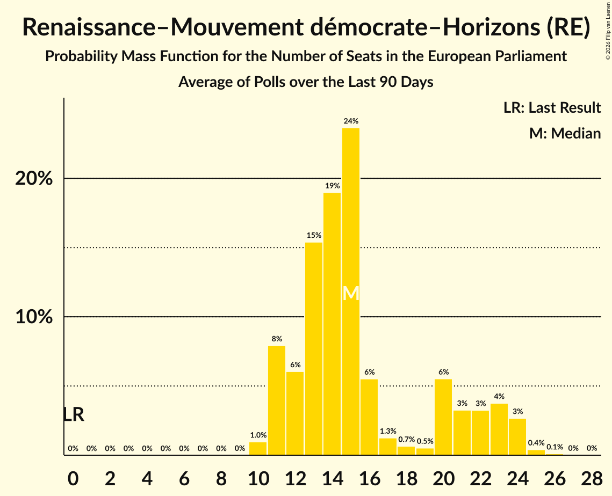

# Renaissance–Mouvement démocrate–Horizons (RE)

<a href="#voting-intentions">Voting Intentions</a> | <a href="#seats">Seats</a>

## Voting Intentions

Last result: **0.0%** (General Election of 9 June 2024)

### Confidence Intervals

| Period     | Polling firm/Commissioner(s) | Median | 80% Confidence Interval | 90% Confidence Interval | 95% Confidence Interval | 99% Confidence Interval |
|:----------:|:----------------:|:-----------:|:-----------------------:|:-----------------------:|:-----------------------:|:-----------------------:|
| N/A | [Poll Average](average.html) | 15.7% | 12.8–23.0% | 12.2–23.9% | 11.7–24.6% | 11.0–25.7% |
| [26–27 March 2026](2026-03-27-OpinionWay.html) | OpinionWay | 16.5% | 15.1–18.1% | 14.7–18.6% | 14.4–19.0% | 13.7–19.7% |
| [25–27 March 2026](2026-03-27-ELABE.html) | ELABE   BFMTV and La Tribune Dimanche | 15.2% | 14.1–16.5% | 13.7–16.9% | 13.4–17.2% | 12.9–17.8% |
| [25–26 March 2026](2026-03-26-Odoxa.html) | Odoxa   Public Sénat | 23.0% | 21.3–24.8% | 20.9–25.3% | 20.5–25.7% | 19.7–26.6% |
| [22 March 2026](2026-03-22-HarrisInteractive.html) | Harris Interactive   M6 and RTL | 15.3% | 14.0–16.9% | 13.6–17.3% | 13.2–17.7% | 12.6–18.5% |
| [26–27 February 2026](2026-02-27-Ifop–Fiducial.html) | Ifop–Fiducial   Le Figaro and Sud Radio | 12.8% | 11.6–14.2% | 11.3–14.6% | 11.0–14.9% | 10.4–15.6% |
| [18–20 November 2025](2025-11-20-Verian.html) | Verian | 16.8% | 15.3–18.5% | 14.9–18.9% | 14.6–19.4% | 13.9–20.2% |
| [19–20 November 2025](2025-11-20-Odoxa.html) | Odoxa   Public Sénat | 13.6% | 12.4–15.0% | 12.0–15.3% | 11.7–15.7% | 11.2–16.4% |
| [30–31 October 2025](2025-10-31-ELABE.html) | ELABE   BFMTV and La Tribune Dimanche | 15.2% | 14.1–16.5% | 13.7–16.9% | 13.5–17.2% | 12.9–17.8% |
| [7 October 2025](2025-10-07-HarrisInteractive.html) | Harris Interactive   RTL | 13.6% | 12.3–15.0% | 11.9–15.3% | 11.6–15.7% | 11.1–16.4% |
| [30 September–1 October 2025](2025-10-01-Cluster17.html) | Cluster17   Le Point | 18.0% | 16.8–19.3% | 16.4–19.7% | 16.1–20.0% | 15.6–20.6% |
| [24–25 September 2025](2025-09-25-Ifop–Fiducial.html) | Ifop–Fiducial   L’Opinion and Sud Radio | 11.3% | 10.2–12.6% | 9.9–13.0% | 9.6–13.3% | 9.1–14.0% |
| [19–20 May 2025](2025-05-20-Ifop–Fiducial.html) | Ifop–Fiducial   Le Figaro and Sud Radio | 21.0% | N/A | N/A | N/A | N/A |
| [19 May 2025](2025-05-19-HarrisInteractive.html) | Harris Interactive   LCI | 18.1% | N/A | N/A | N/A | N/A |
| [11–30 April 2025](2025-04-30-Ifop.html) | Ifop   Hexagone | 22.4% | N/A | N/A | N/A | N/A |
| [23–24 April 2025](2025-04-24-Odoxa.html) | Odoxa   Public Sénat | 20.0% | N/A | N/A | N/A | N/A |
| [2–4 April 2025](2025-04-04-ELABE.html) | ELABE   BFMTV and La Tribune Dimanche | 20.5% | N/A | N/A | N/A | N/A |
| [31 March 2025](2025-03-31-HarrisInteractive.html) | Harris Interactive   RTL | 24.1% | N/A | N/A | N/A | N/A |
| [26–27 March 2025](2025-03-27-Ifop.html) | Ifop   Le Journal du Dimanche | 21.5% | N/A | N/A | N/A | N/A |
| [6–9 December 2024](2024-12-09-Ifop–Fiducial.html) | Ifop–Fiducial   Le Figaro and Sud Radio | 23.7% | N/A | N/A | N/A | N/A |
| [11–12 September 2024](2024-09-12-OpinionWay.html) | OpinionWay | 29.6% | N/A | N/A | N/A | N/A |
| [6–9 September 2024](2024-09-09-Ifop–Fiducial.html) | Ifop–Fiducial   Sud Radio | 21.3% | N/A | N/A | N/A | N/A |
| [7–8 July 2024](2024-07-08-HarrisInteractive.html) | Harris Interactive   Challenges, M6 and RTL | 21.6% | N/A | N/A | N/A | N/A |

### Probability Mass Function

The following table shows the probability mass function per percentage block of voting intentions for the [poll average](average.html) for Renaissance–Mouvement démocrate–Horizons (RE).

| Voting Intentions | Probability | Accumulated | Special Marks |
|:-----------------:|:-----------:|:-----------:|:-------------:|
| 0.0–0.5% | 0% | 100% | Last Result |
| 0.5–1.5% | 0% | 100% |  |
| 1.5–2.5% | 0% | 100% |  |
| 2.5–3.5% | 0% | 100% |  |
| 3.5–4.5% | 0% | 100% |  |
| 4.5–5.5% | 0% | 100% |  |
| 5.5–6.5% | 0% | 100% |  |
| 6.5–7.5% | 0% | 100% |  |
| 7.5–8.5% | 0% | 100% |  |
| 8.5–9.5% | 0% | 100% |  |
| 9.5–10.5% | 0.1% | 100% |  |
| 10.5–11.5% | 2% | 99.9% |  |
| 11.5–12.5% | 6% | 98% |  |
| 12.5–13.5% | 9% | 92% |  |
| 13.5–14.5% | 12% | 83% |  |
| 14.5–15.5% | 18% | 71% |  |
| 15.5–16.5% | 18% | 53% | Median |
| 16.5–17.5% | 10% | 35% |  |
| 17.5–18.5% | 4% | 25% |  |
| 18.5–19.5% | 1.0% | 21% |  |
| 19.5–20.5% | 0.6% | 20% |  |
| 20.5–21.5% | 2% | 19% |  |
| 21.5–22.5% | 5% | 17% |  |
| 22.5–23.5% | 6% | 13% |  |
| 23.5–24.5% | 4% | 7% |  |
| 24.5–25.5% | 2% | 3% |  |
| 25.5–26.5% | 0.5% | 0.6% |  |
| 26.5–27.5% | 0.1% | 0.1% |  |
| 27.5–28.5% | 0% | 0% |  |

## Seats

Last result: **0** seats (General Election of 9 June 2024)

### Confidence Intervals

| Period     | Polling firm/Commissioner(s) | Median | 80% Confidence Interval | 90% Confidence Interval | 95% Confidence Interval | 99% Confidence Interval |
|:----------:|:----------------:|:------:|:-----------------------:|:-----------------------:|:-----------------------:|:-----------------------:|
| N/A | [Poll Average](average.html) | 15 | 12–21 | 11–23 | 11–23 | 10–24 |
| [26–27 March 2026](2026-03-27-OpinionWay.html) | OpinionWay | 14 | 12–15 | 12–16 | 12–16 | 11–17 |
| [25–27 March 2026](2026-03-27-ELABE.html) | ELABE   BFMTV and La Tribune Dimanche | 15 | 14–16 | 14–16 | 13–17 | 12–18 |
| [25–26 March 2026](2026-03-26-Odoxa.html) | Odoxa   Public Sénat | 21 | 20–23 | 19–24 | 18–24 | 18–25 |
| [22 March 2026](2026-03-22-HarrisInteractive.html) | Harris Interactive   M6 and RTL | 14 | 13–15 | 12–17 | 12–17 | 10–17 |
| [26–27 February 2026](2026-02-27-Ifop–Fiducial.html) | Ifop–Fiducial   Le Figaro and Sud Radio | 12 | 11–13 | 11–14 | 10–14 | 10–15 |
| [18–20 November 2025](2025-11-20-Verian.html) | Verian | 16 | 14–17 | 13–18 | 13–18 | 13–19 |
| [19–20 November 2025](2025-11-20-Odoxa.html) | Odoxa   Public Sénat | 12 | 11–13 | 11–14 | 10–14 | 10–15 |
| [30–31 October 2025](2025-10-31-ELABE.html) | ELABE   BFMTV and La Tribune Dimanche | 15 | 13–16 | 13–16 | 12–18 | 12–18 |
| [7 October 2025](2025-10-07-HarrisInteractive.html) | Harris Interactive   RTL | 12 | 11–13 | 11–14 | 10–14 | 10–14 |
| [30 September–1 October 2025](2025-10-01-Cluster17.html) | Cluster17   Le Point | 16 | 16–18 | 15–18 | 15–19 | 14–20 |
| [24–25 September 2025](2025-09-25-Ifop–Fiducial.html) | Ifop–Fiducial   L’Opinion and Sud Radio | 11 | 10–11 | 9–12 | 9–12 | 8–13 |
| [19–20 May 2025](2025-05-20-Ifop–Fiducial.html) | Ifop–Fiducial   Le Figaro and Sud Radio |  |  |  |  |  |
| [19 May 2025](2025-05-19-HarrisInteractive.html) | Harris Interactive   LCI |  |  |  |  |  |
| [11–30 April 2025](2025-04-30-Ifop.html) | Ifop   Hexagone |  |  |  |  |  |
| [23–24 April 2025](2025-04-24-Odoxa.html) | Odoxa   Public Sénat |  |  |  |  |  |
| [2–4 April 2025](2025-04-04-ELABE.html) | ELABE   BFMTV and La Tribune Dimanche |  |  |  |  |  |
| [31 March 2025](2025-03-31-HarrisInteractive.html) | Harris Interactive   RTL |  |  |  |  |  |
| [26–27 March 2025](2025-03-27-Ifop.html) | Ifop   Le Journal du Dimanche |  |  |  |  |  |
| [6–9 December 2024](2024-12-09-Ifop–Fiducial.html) | Ifop–Fiducial   Le Figaro and Sud Radio |  |  |  |  |  |
| [11–12 September 2024](2024-09-12-OpinionWay.html) | OpinionWay |  |  |  |  |  |
| [6–9 September 2024](2024-09-09-Ifop–Fiducial.html) | Ifop–Fiducial   Sud Radio |  |  |  |  |  |
| [7–8 July 2024](2024-07-08-HarrisInteractive.html) | Harris Interactive   Challenges, M6 and RTL |  |  |  |  |  |

### Probability Mass Function

The following table shows the probability mass function per seat for the [poll average](average.html) for Renaissance–Mouvement démocrate–Horizons (RE).

| Number of Seats | Probability | Accumulated | Special Marks |
|:---------------:|:-----------:|:-----------:|:-------------:|
| 0 | 0% | 100% | Last Result |
| 1 | 0% | 100% |  |
| 2 | 0% | 100% |  |
| 3 | 0% | 100% |  |
| 4 | 0% | 100% |  |
| 5 | 0% | 100% |  |
| 6 | 0% | 100% |  |
| 7 | 0% | 100% |  |
| 8 | 0% | 100% |  |
| 9 | 0% | 100% |  |
| 10 | 1.1% | 100% |  |
| 11 | 8% | 98.9% |  |
| 12 | 7% | 91% |  |
| 13 | 19% | 84% |  |
| 14 | 15% | 65% |  |
| 15 | 23% | 51% | Median |
| 16 | 5% | 27% |  |
| 17 | 2% | 22% |  |
| 18 | 1.0% | 20% |  |
| 19 | 0.3% | 19% |  |
| 20 | 8% | 19% |  |
| 21 | 2% | 11% |  |
| 22 | 3% | 9% |  |
| 23 | 4% | 6% |  |
| 24 | 1.3% | 2% |  |
| 25 | 0.3% | 0.4% |  |
| 26 | 0% | 0% |  |

