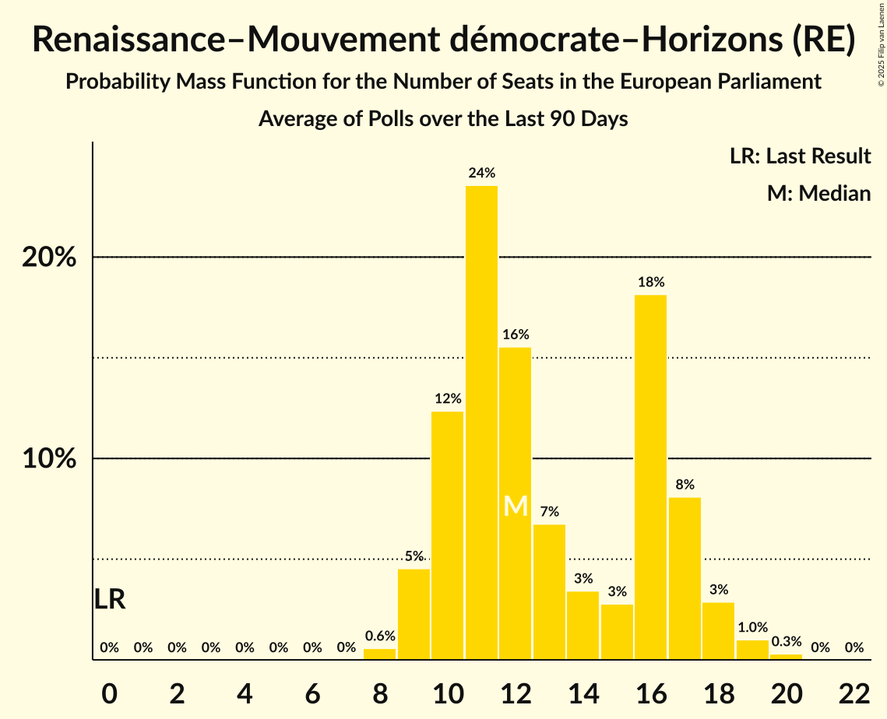

# Renaissance–Mouvement démocrate–Horizons (RE)

<a href="#voting-intentions">Voting Intentions</a> | <a href="#seats">Seats</a>

## Voting Intentions

Last result: **0.0%** (General Election of 9 June 2024)

### Confidence Intervals

| Period     | Polling firm/Commissioner(s) | Median | 80% Confidence Interval | 90% Confidence Interval | 95% Confidence Interval | 99% Confidence Interval |
|:----------:|:----------------:|:-----------:|:-----------------------:|:-----------------------:|:-----------------------:|:-----------------------:|
| N/A | [Poll Average](average.html) | 21.8% | 19.8–24.7% | 19.3–25.3% | 18.9–25.9% | 18.2–26.8% |
| [2–4 April 2025](2025-04-04-ELABE.html) | ELABE   BFMTV and La Tribune Dimanche | 20.5% | 19.2–22.0% | 18.8–22.4% | 18.5–22.7% | 17.9–23.4% |
| [31 March 2025](2025-03-31-HarrisInteractive.html) | Harris Interactive   RTL | 24.0% | 22.4–25.7% | 22.0–26.1% | 21.6–26.5% | 20.9–27.3% |
| [26–27 March 2025](2025-03-27-Ifop.html) | Ifop   Le Journal du Dimanche | 21.5% | 20.0–23.2% | 19.6–23.7% | 19.2–24.1% | 18.5–24.9% |
| [6–9 December 2024](2024-12-09-Ifop–Fiducial.html) | Ifop–Fiducial   Le Figaro and Sud Radio | 23.7% | 22.1–25.4% | 21.7–25.9% | 21.3–26.3% | 20.5–27.2% |
| [11–12 September 2024](2024-09-12-OpinionWay.html) | OpinionWay | 29.6% | 27.8–31.5% | 27.3–32.0% | 26.9–32.5% | 26.0–33.4% |
| [6–9 September 2024](2024-09-09-Ifop–Fiducial.html) | Ifop–Fiducial   Sud Radio | 21.3% | 19.7–22.9% | 19.3–23.4% | 18.9–23.8% | 18.2–24.6% |
| [7–8 July 2024](2024-07-08-HarrisInteractive.html) | Harris Interactive   Challenges, M6 and RTL | 21.7% | 20.5–23.2% | 20.2–23.6% | 19.9–23.9% | 19.3–24.6% |

### Probability Mass Function

The following table shows the probability mass function per percentage block of voting intentions for the [poll average](average.html) for Renaissance–Mouvement démocrate–Horizons (RE).

| Voting Intentions | Probability | Accumulated | Special Marks |
|:-----------------:|:-----------:|:-----------:|:-------------:|
| 0.0–0.5% | 0% | 100% | Last Result |
| 0.5–1.5% | 0% | 100% |  |
| 1.5–2.5% | 0% | 100% |  |
| 2.5–3.5% | 0% | 100% |  |
| 3.5–4.5% | 0% | 100% |  |
| 4.5–5.5% | 0% | 100% |  |
| 5.5–6.5% | 0% | 100% |  |
| 6.5–7.5% | 0% | 100% |  |
| 7.5–8.5% | 0% | 100% |  |
| 8.5–9.5% | 0% | 100% |  |
| 9.5–10.5% | 0% | 100% |  |
| 10.5–11.5% | 0% | 100% |  |
| 11.5–12.5% | 0% | 100% |  |
| 12.5–13.5% | 0% | 100% |  |
| 13.5–14.5% | 0% | 100% |  |
| 14.5–15.5% | 0% | 100% |  |
| 15.5–16.5% | 0% | 100% |  |
| 16.5–17.5% | 0.1% | 100% |  |
| 17.5–18.5% | 1.1% | 99.9% |  |
| 18.5–19.5% | 6% | 98.9% |  |
| 19.5–20.5% | 16% | 93% |  |
| 20.5–21.5% | 21% | 76% |  |
| 21.5–22.5% | 18% | 55% | Median |
| 22.5–23.5% | 14% | 38% |  |
| 23.5–24.5% | 12% | 24% |  |
| 24.5–25.5% | 8% | 12% |  |
| 25.5–26.5% | 3% | 4% |  |
| 26.5–27.5% | 0.7% | 0.8% |  |
| 27.5–28.5% | 0.1% | 0.1% |  |
| 28.5–29.5% | 0% | 0% |  |

## Seats

Last result: **0** seats (General Election of 9 June 2024)

### Confidence Intervals

| Period     | Polling firm/Commissioner(s) | Median | 80% Confidence Interval | 90% Confidence Interval | 95% Confidence Interval | 99% Confidence Interval |
|:----------:|:----------------:|:------:|:-----------------------:|:-----------------------:|:-----------------------:|:-----------------------:|
| N/A | [Poll Average](average.html) | 22 | 19–25 | 19–26 | 18–27 | 17–28 |
| [2–4 April 2025](2025-04-04-ELABE.html) | ELABE   BFMTV and La Tribune Dimanche | 20 | 18–21 | 18–22 | 18–23 | 17–24 |
| [31 March 2025](2025-03-31-HarrisInteractive.html) | Harris Interactive   RTL | 24 | 22–27 | 22–27 | 22–28 | 21–30 |
| [26–27 March 2025](2025-03-27-Ifop.html) | Ifop   Le Journal du Dimanche | 22 | 20–24 | 19–24 | 19–25 | 17–26 |
| [6–9 December 2024](2024-12-09-Ifop–Fiducial.html) | Ifop–Fiducial   Le Figaro and Sud Radio | 27 | 23–27 | 22–27 | 21–27 | 20–29 |
| [11–12 September 2024](2024-09-12-OpinionWay.html) | OpinionWay | 26 | 25–29 | 24–29 | 24–29 | 23–31 |
| [6–9 September 2024](2024-09-09-Ifop–Fiducial.html) | Ifop–Fiducial   Sud Radio | 21 | 19–23 | 18–23 | 18–24 | 17–25 |
| [7–8 July 2024](2024-07-08-HarrisInteractive.html) | Harris Interactive   Challenges, M6 and RTL | 22 | 20–23 | 20–23 | 20–23 | 19–25 |

### Probability Mass Function

The following table shows the probability mass function per seat for the [poll average](average.html) for Renaissance–Mouvement démocrate–Horizons (RE).

| Number of Seats | Probability | Accumulated | Special Marks |
|:---------------:|:-----------:|:-----------:|:-------------:|
| 0 | 0% | 100% | Last Result |
| 1 | 0% | 100% |  |
| 2 | 0% | 100% |  |
| 3 | 0% | 100% |  |
| 4 | 0% | 100% |  |
| 5 | 0% | 100% |  |
| 6 | 0% | 100% |  |
| 7 | 0% | 100% |  |
| 8 | 0% | 100% |  |
| 9 | 0% | 100% |  |
| 10 | 0% | 100% |  |
| 11 | 0% | 100% |  |
| 12 | 0% | 100% |  |
| 13 | 0% | 100% |  |
| 14 | 0% | 100% |  |
| 15 | 0% | 100% |  |
| 16 | 0.1% | 100% |  |
| 17 | 0.8% | 99.9% |  |
| 18 | 3% | 99.1% |  |
| 19 | 7% | 96% |  |
| 20 | 19% | 88% |  |
| 21 | 12% | 69% |  |
| 22 | 14% | 57% | Median |
| 23 | 12% | 43% |  |
| 24 | 17% | 31% |  |
| 25 | 5% | 14% |  |
| 26 | 4% | 8% |  |
| 27 | 3% | 4% |  |
| 28 | 1.1% | 2% |  |
| 29 | 0.2% | 0.5% |  |
| 30 | 0.2% | 0.3% |  |
| 31 | 0.1% | 0.1% |  |
| 32 | 0% | 0% |  |

