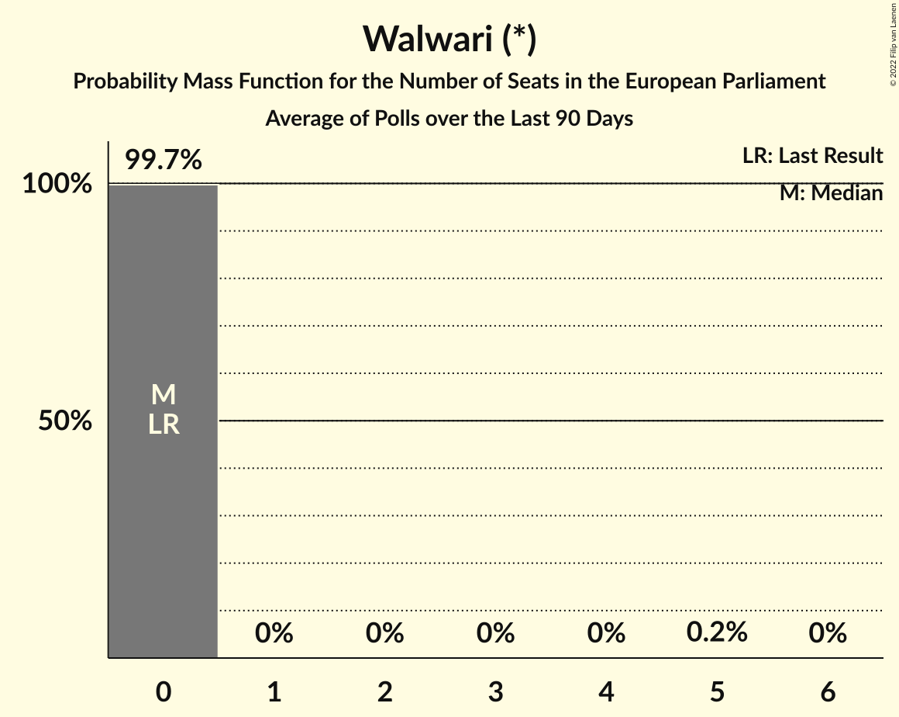

# Walwari (*)

<a href="#voting-intentions">Voting Intentions</a> | <a href="#seats">Seats</a>

## Voting Intentions

Last result: **0.0%** (General Election of 26 May 2019)

### Confidence Intervals

| Period     | Polling firm/Commissioner(s) | Median | 80% Confidence Interval | 90% Confidence Interval | 95% Confidence Interval | 99% Confidence Interval |
|:----------:|:----------------:|:-----------:|:-----------------------:|:-----------------------:|:-----------------------:|:-----------------------:|
| N/A | [Poll Average](average.html) | 3.5% | 2.6–4.7% | 2.4–5.0% | 2.2–5.2% | 1.9–5.6% |
| [8–11 January 2022](2022-01-11-OpinionWayandKéaPartners.html) | OpinionWay and Kéa Partners   Les Échos and Radio Classique | 0.0% | N/A | N/A | N/A | N/A |
| [6–10 January 2022](2022-01-10-Ifop-Fiducial.html) | Ifop-Fiducial   Paris Match, LCI and Sud Radio | 3.5% | 3.0–4.2% | 2.8–4.4% | 2.7–4.6% | 2.5–5.0% |
| [4–7 January 2022](2022-01-07-OpinionWayandKéaPartners.html) | OpinionWay and Kéa Partners   Les Échos and Radio Classique | 0.0% | N/A | N/A | N/A | N/A |
| [5–6 January 2022](2022-01-06-IpsosandSopraSteria.html) | Ipsos and Sopra Steria   France Info and Le Parisien | 3.0% | 2.3–4.0% | 2.2–4.3% | 2.0–4.5% | 1.7–5.1% |
| [5–6 January 2022](2022-01-06-BVA.html) | BVA   RTL & Orange | 0.0% | N/A | N/A | N/A | N/A |
| [3–5 January 2022](2022-01-05-Ifop-Fiducial.html) | Ifop-Fiducial   LCI and Le Figaro | 2.5% | N/A | N/A | N/A | N/A |
| [2–3 January 2022](2022-01-03-OpinionWayandKéaPartners.html) | OpinionWay and Kéa Partners   Les Échos and Radio Classique | 0.0% | N/A | N/A | N/A | N/A |
| [28–31 December 2021](2021-12-31-HarrisInteractive.html) | Harris Interactive   Challenges | 0.0% | N/A | N/A | N/A | N/A |
| [27–31 December 2021](2021-12-31-Cluster17.html) | Cluster17   Marianne | 4.5% | 3.9–5.2% | 3.7–5.4% | 3.6–5.6% | 3.4–6.0% |
| [21–22 December 2021](2021-12-22-OpinionWay.html) | OpinionWay   VSD | 3.0% | 2.4–3.7% | 2.2–4.0% | 2.1–4.2% | 1.8–4.6% |
| [19–22 December 2021](2021-12-22-Cluster17.html) | Cluster17 | 7.1% | N/A | N/A | N/A | N/A |
| [17–20 December 2021](2021-12-20-Elabe.html) | Elabe   BFMTV, L’Express and SFR | 0.0% | N/A | N/A | N/A | N/A |
| [13–15 December 2021](2021-12-15-OpinionWay.html) | OpinionWay   Les Echos, CNews and Radio Classique | 0.0% | N/A | N/A | N/A | N/A |
| [14–15 December 2021](2021-12-15-Ifop–Fiducial.html) | Ifop–Fiducial   Sud Radio | 0.0% | N/A | N/A | N/A | N/A |
| [12–15 December 2021](2021-12-15-Cluster17.html) | Cluster17 | 0.0% | N/A | N/A | N/A | N/A |
| [7–13 December 2021](2021-12-13-IpsosandSopraSteria.html) | Ipsos and Sopra Steria   CEVIPOF, FJJ and Le Monde | 0.0% | N/A | N/A | N/A | N/A |
| [10–13 December 2021](2021-12-13-HarrisInteractive.html) | Harris Interactive   Challenges | 0.0% | N/A | N/A | N/A | N/A |
| [8–9 December 2021](2021-12-09-OpinionWay.html) | OpinionWay   Mieux voter | 2.0% | N/A | N/A | N/A | N/A |
| [7–9 December 2021](2021-12-09-Odoxa.html) | Odoxa   L’Obs and Mascaret | 0.0% | N/A | N/A | N/A | N/A |
| [6–8 December 2021](2021-12-08-IpsosandSopraSteria.html) | Ipsos and Sopra Steria   France Info and Le Parisien | 0.0% | N/A | N/A | N/A | N/A |
| [4–8 December 2021](2021-12-08-Cluster17.html) | Cluster17 | 0.0% | N/A | N/A | N/A | N/A |
| [6–8 December 2021](2021-12-08-BVA.html) | BVA   RTL and Orange | 0.0% | N/A | N/A | N/A | N/A |
| [6–7 December 2021](2021-12-07-Elabe.html) | Elabe   BFMTV, L’Express and SFR | 0.0% | N/A | N/A | N/A | N/A |
| [5–6 December 2021](2021-12-06-Kantar.html) | Kantar | 4.9% | 3.9–6.4% | 3.6–6.8% | 3.3–7.1% | 2.9–7.9% |
| [4–6 December 2021](2021-12-06-Ifop–Fiducial.html) | Ifop–Fiducial   Le Figaro and LCI | 0.0% | N/A | N/A | N/A | N/A |
| [4–6 December 2021](2021-12-06-Ifop-Fiducial.html) | Ifop-Fiducial   Le Figaro and LCI | 0.0% | N/A | N/A | N/A | N/A |
| [3–6 December 2021](2021-12-06-HarrisInteractive.html) | Harris Interactive   Challenges | 0.0% | N/A | N/A | N/A | N/A |
| [26–29 November 2021](2021-11-29-HarrisInteractive.html) | Harris Interactive   Challenges | 0.0% | N/A | N/A | N/A | N/A |
| [23–25 November 2021](2021-11-25-Ifop–Fiducial.html) | Ifop–Fiducial   JDD and Sud Radio | 0.0% | N/A | N/A | N/A | N/A |
| [23–24 November 2021](2021-11-24-Elabe.html) | Elabe   BFMTV, L’Express and SFR | 0.0% | N/A | N/A | N/A | N/A |
| [19–22 November 2021](2021-11-22-HarrisInteractive.html) | Harris Interactive   Challenges | 0.0% | N/A | N/A | N/A | N/A |
| [15–17 November 2021](2021-11-17-OpinionWay.html) | OpinionWay   Les Echos, CNews and Radio Classique | 0.0% | N/A | N/A | N/A | N/A |
| [12–15 November 2021](2021-11-15-HarrisInteractive.html) | Harris Interactive   Challenges | 0.0% | N/A | N/A | N/A | N/A |
| [12–15 November 2021](2021-11-15-BVA.html) | BVA   RTL and Orange | 0.0% | N/A | N/A | N/A | N/A |
| [10–11 November 2021](2021-11-11-Elabe.html) | Elabe   BFMTV, L’Express and SFR | 0.0% | N/A | N/A | N/A | N/A |
| [5–8 November 2021](2021-11-08-Odoxa.html) | Odoxa   Saegus and L’Obs | 0.0% | N/A | N/A | N/A | N/A |
| [5–8 November 2021](2021-11-08-HarrisInteractive.html) | Harris Interactive   Challenges | 0.0% | N/A | N/A | N/A | N/A |
| [3–5 November 2021](2021-11-05-Ifop–Fiducial.html) | Ifop–Fiducial   Le Figaro and LCI | 0.0% | N/A | N/A | N/A | N/A |
| [28–30 October 2021](2021-10-30-HarrisInteractive.html) | Harris Interactive   Challenges | 0.0% | N/A | N/A | N/A | N/A |
| [25–27 October 2021](2021-10-27-Elabe.html) | Elabe   BFMTV, L’Express and SFR | 0.0% | N/A | N/A | N/A | N/A |
| [22–25 October 2021](2021-10-25-HarrisInteractive.html) | Harris Interactive   Challenges | 0.0% | N/A | N/A | N/A | N/A |
| [18–20 October 2021](2021-10-20-OpinionWay.html) | OpinionWay   Les Echos, CNews and Radio Classique | 0.0% | N/A | N/A | N/A | N/A |
| [15–18 October 2021](2021-10-18-HarrisInteractive.html) | Harris Interactive   Challenges | 0.0% | N/A | N/A | N/A | N/A |
| [14–15 October 2021](2021-10-15-Ifop–Fiducial.html) | Ifop–Fiducial   TFI and LCI | 0.0% | N/A | N/A | N/A | N/A |
| [7–13 October 2021](2021-10-13-IpsosandSopraSteria.html) | Ipsos and Sopra Steria   CEVIPOF, FJJ and Le Monde | 0.0% | N/A | N/A | N/A | N/A |
| [9–13 October 2021](2021-10-13-Ifop–Fiducial.html) | Ifop–Fiducial   Le Figaro and LCI | 0.0% | N/A | N/A | N/A | N/A |
| [5–11 October 2021](2021-10-11-Odoxa.html) | Odoxa   L’Obs | 0.0% | N/A | N/A | N/A | N/A |
| [8–11 October 2021](2021-10-11-HarrisInteractive.html) | Harris Interactive   Challenges | 0.0% | N/A | N/A | N/A | N/A |
| [7–11 October 2021](2021-10-11-BVA.html) | BVA   RTL and Orange | 0.0% | N/A | N/A | N/A | N/A |
| [5–6 October 2021](2021-10-06-Elabe.html) | Elabe   BFMTV, L’Express and SFR | 0.0% | N/A | N/A | N/A | N/A |
| [4–5 October 2021](2021-10-05-Ifop–Fiducial.html) | Ifop–Fiducial   Sud Radio | 0.0% | N/A | N/A | N/A | N/A |
| [1–4 October 2021](2021-10-04-HarrisInteractive.html) | Harris Interactive   Challenges | 0.0% | N/A | N/A | N/A | N/A |
| [29 September–1 October 2021](2021-10-01-Ifop–Fiducial.html) | Ifop–Fiducial   Le Figaro and LCI | 0.0% | N/A | N/A | N/A | N/A |
| [29–30 September 2021](2021-09-30-IpsosandSopraSteria.html) | Ipsos and Sopra Steria   Le Parisien and France Info | 0.0% | N/A | N/A | N/A | N/A |
| [24–27 September 2021](2021-09-27-HarrisInteractive.html) | Harris Interactive   Challenges | 0.0% | N/A | N/A | N/A | N/A |
| [22–23 September 2021](2021-09-23-Odoxa.html) | Odoxa   L’Obs | 0.0% | N/A | N/A | N/A | N/A |
| [17–20 September 2021](2021-09-20-HarrisInteractive.html) | Harris Interactive   Challenges | 0.0% | N/A | N/A | N/A | N/A |
| [10–13 September 2021](2021-09-13-HarrisInteractive.html) | Harris Interactive   Challenges | 0.0% | N/A | N/A | N/A | N/A |
| [11–13 September 2021](2021-09-13-Elabe.html) | Elabe   BFMTV, L’Express and SFR | 0.0% | N/A | N/A | N/A | N/A |
| [2–3 September 2021](2021-09-03-IpsosandSopraSteria.html) | Ipsos and Sopra Steria   Le Parisien and France Info | 0.0% | N/A | N/A | N/A | N/A |
| [31 August–2 September 2021](2021-09-02-Ifop–Fiducial.html) | Ifop–Fiducial   Le Figaro and LCI | 0.0% | N/A | N/A | N/A | N/A |
| [27–30 August 2021](2021-08-30-HarrisInteractive.html) | Harris Interactive   Challenges | 0.0% | N/A | N/A | N/A | N/A |
| [20–23 August 2021](2021-08-23-HarrisInteractive.html) | Harris Interactive   Challenges | 0.0% | N/A | N/A | N/A | N/A |
| [20–22 August 2021](2021-08-22-Ipsos.html) | Ipsos   Libres! | 0.0% | N/A | N/A | N/A | N/A |
| [2–5 July 2021](2021-07-05-HarrisInteractive.html) | Harris Interactive   Challenges | 0.0% | N/A | N/A | N/A | N/A |
| [29 June–2 July 2021](2021-07-02-Ifop–Fiducial.html) | Ifop–Fiducial   Le Figaro and LCI | 0.0% | N/A | N/A | N/A | N/A |
| [20–21 June 2021](2021-06-21-HarrisInteractive.html) | Harris Interactive | 0.0% | N/A | N/A | N/A | N/A |
| [4–7 June 2021](2021-06-07-HarrisInteractive.html) | Harris Interactive | 0.0% | N/A | N/A | N/A | N/A |
| [28–31 May 2021](2021-05-31-HarrisInteractive.html) | Harris Interactive | 0.0% | N/A | N/A | N/A | N/A |
| [21–24 May 2021](2021-05-24-HarrisInteractive.html) | Harris Interactive | 0.0% | N/A | N/A | N/A | N/A |
| [18–20 May 2021](2021-05-20-Ifop.html) | Ifop | 0.0% | N/A | N/A | N/A | N/A |
| [14–17 May 2021](2021-05-17-HarrisInteractive.html) | Harris Interactive | 0.0% | N/A | N/A | N/A | N/A |
| [16–19 April 2021](2021-04-19-HarrisInteractive.html) | Harris Interactive | 0.0% | N/A | N/A | N/A | N/A |
| [9–15 April 2021](2021-04-15-Ipsos.html) | Ipsos | 0.0% | N/A | N/A | N/A | N/A |
| [12–14 April 2021](2021-04-14-Elabe.html) | Elabe | 0.0% | N/A | N/A | N/A | N/A |
| [2–8 April 2021](2021-04-08-Ifop.html) | Ifop | 0.0% | N/A | N/A | N/A | N/A |
| [3–4 March 2021](2021-03-04-HarrisInteractive.html) | Harris Interactive   CommStrat and L’Opinion | 0.0% | N/A | N/A | N/A | N/A |
| [27–28 January 2021](2021-01-28-Ipsos.html) | Ipsos   FranceInfo and L’Obs | 0.0% | N/A | N/A | N/A | N/A |
| [19–21 January 2021](2021-01-21-HarrisInteractive.html) | Harris Interactive   CommStrat and L’Opinion | 0.0% | N/A | N/A | N/A | N/A |
| [28 September–1 October 2020](2020-10-01-Ifop-Fiducial.html) | Ifop-Fiducial   Le Journal du Dimanche and Sud Radio | 0.0% | N/A | N/A | N/A | N/A |
| [2–3 July 2020](2020-07-03-HarrisInteractive.html) | Harris Interactive   CommStrat | 0.0% | N/A | N/A | N/A | N/A |
| [30 June–1 July 2020](2020-07-01-ELABE.html) | ELABE   BFMTV | 0.0% | N/A | N/A | N/A | N/A |
| [18–19 June 2020](2020-06-19-Ifop-Fiducial.html) | Ifop-Fiducial   CNews and Sud Radio | 0.0% | N/A | N/A | N/A | N/A |
| [28–30 October 2019](2019-10-30-Ifop.html) | Ifop   Le Journal du Dimanche | 0.0% | N/A | N/A | N/A | N/A |
| [28–29 October 2019](2019-10-29-ELABE.html) | ELABE   BFMTV | 0.0% | N/A | N/A | N/A | N/A |

### Probability Mass Function

The following table shows the probability mass function per percentage block of voting intentions for the [poll average](average.html) for Walwari (*).

| Voting Intentions | Probability | Accumulated | Special Marks |
|:-----------------:|:-----------:|:-----------:|:-------------:|
| 0.0–0.5% | 0% | 100% | Last Result |
| 0.5–1.5% | 0% | 100% |  |
| 1.5–2.5% | 9% | 100% |  |
| 2.5–3.5% | 43% | 91% |  |
| 3.5–4.5% | 35% | 48% | Median |
| 4.5–5.5% | 13% | 13% |  |
| 5.5–6.5% | 0.8% | 0.8% |  |
| 6.5–7.5% | 0% | 0% |  |

## Seats

Last result: **0** seats (General Election of 26 May 2019)

### Confidence Intervals

| Period     | Polling firm/Commissioner(s) | Median | 80% Confidence Interval | 90% Confidence Interval | 95% Confidence Interval | 99% Confidence Interval |
|:----------:|:----------------:|:------:|:-----------------------:|:-----------------------:|:-----------------------:|:-----------------------:|
| N/A | [Poll Average](average.html) | 0 | 0 | 0–5 | 0–5 | 0–5 |
| [8–11 January 2022](2022-01-11-OpinionWayandKéaPartners.html) | OpinionWay and Kéa Partners   Les Échos and Radio Classique |  |  |  |  |  |
| [6–10 January 2022](2022-01-10-Ifop-Fiducial.html) | Ifop-Fiducial   Paris Match, LCI and Sud Radio | 0 | 0 | 0 | 0 | 0–5 |
| [4–7 January 2022](2022-01-07-OpinionWayandKéaPartners.html) | OpinionWay and Kéa Partners   Les Échos and Radio Classique |  |  |  |  |  |
| [5–6 January 2022](2022-01-06-IpsosandSopraSteria.html) | Ipsos and Sopra Steria   France Info and Le Parisien | 0 | 0 | 0 | 0 | 0–4 |
| [5–6 January 2022](2022-01-06-BVA.html) | BVA   RTL & Orange |  |  |  |  |  |
| [3–5 January 2022](2022-01-05-Ifop-Fiducial.html) | Ifop-Fiducial   LCI and Le Figaro |  |  |  |  |  |
| [2–3 January 2022](2022-01-03-OpinionWayandKéaPartners.html) | OpinionWay and Kéa Partners   Les Échos and Radio Classique |  |  |  |  |  |
| [28–31 December 2021](2021-12-31-HarrisInteractive.html) | Harris Interactive   Challenges |  |  |  |  |  |
| [27–31 December 2021](2021-12-31-Cluster17.html) | Cluster17   Marianne | 0 | 0–5 | 0–5 | 0–5 | 0–5 |
| [21–22 December 2021](2021-12-22-OpinionWay.html) | OpinionWay   VSD | 0 | 0 | 0 | 0 | 0 |
| [19–22 December 2021](2021-12-22-Cluster17.html) | Cluster17 |  |  |  |  |  |
| [17–20 December 2021](2021-12-20-Elabe.html) | Elabe   BFMTV, L’Express and SFR |  |  |  |  |  |
| [13–15 December 2021](2021-12-15-OpinionWay.html) | OpinionWay   Les Echos, CNews and Radio Classique |  |  |  |  |  |
| [14–15 December 2021](2021-12-15-Ifop–Fiducial.html) | Ifop–Fiducial   Sud Radio |  |  |  |  |  |
| [12–15 December 2021](2021-12-15-Cluster17.html) | Cluster17 |  |  |  |  |  |
| [7–13 December 2021](2021-12-13-IpsosandSopraSteria.html) | Ipsos and Sopra Steria   CEVIPOF, FJJ and Le Monde |  |  |  |  |  |
| [10–13 December 2021](2021-12-13-HarrisInteractive.html) | Harris Interactive   Challenges |  |  |  |  |  |
| [8–9 December 2021](2021-12-09-OpinionWay.html) | OpinionWay   Mieux voter |  |  |  |  |  |
| [7–9 December 2021](2021-12-09-Odoxa.html) | Odoxa   L’Obs and Mascaret |  |  |  |  |  |
| [6–8 December 2021](2021-12-08-IpsosandSopraSteria.html) | Ipsos and Sopra Steria   France Info and Le Parisien |  |  |  |  |  |
| [4–8 December 2021](2021-12-08-Cluster17.html) | Cluster17 |  |  |  |  |  |
| [6–8 December 2021](2021-12-08-BVA.html) | BVA   RTL and Orange |  |  |  |  |  |
| [6–7 December 2021](2021-12-07-Elabe.html) | Elabe   BFMTV, L’Express and SFR |  |  |  |  |  |
| [5–6 December 2021](2021-12-06-Kantar.html) | Kantar | 0 | 0–5 | 0–5 | 0–6 | 0–6 |
| [4–6 December 2021](2021-12-06-Ifop–Fiducial.html) | Ifop–Fiducial   Le Figaro and LCI |  |  |  |  |  |
| [4–6 December 2021](2021-12-06-Ifop-Fiducial.html) | Ifop-Fiducial   Le Figaro and LCI |  |  |  |  |  |
| [3–6 December 2021](2021-12-06-HarrisInteractive.html) | Harris Interactive   Challenges |  |  |  |  |  |
| [26–29 November 2021](2021-11-29-HarrisInteractive.html) | Harris Interactive   Challenges |  |  |  |  |  |
| [23–25 November 2021](2021-11-25-Ifop–Fiducial.html) | Ifop–Fiducial   JDD and Sud Radio |  |  |  |  |  |
| [23–24 November 2021](2021-11-24-Elabe.html) | Elabe   BFMTV, L’Express and SFR |  |  |  |  |  |
| [19–22 November 2021](2021-11-22-HarrisInteractive.html) | Harris Interactive   Challenges |  |  |  |  |  |
| [15–17 November 2021](2021-11-17-OpinionWay.html) | OpinionWay   Les Echos, CNews and Radio Classique |  |  |  |  |  |
| [12–15 November 2021](2021-11-15-HarrisInteractive.html) | Harris Interactive   Challenges |  |  |  |  |  |
| [12–15 November 2021](2021-11-15-BVA.html) | BVA   RTL and Orange |  |  |  |  |  |
| [10–11 November 2021](2021-11-11-Elabe.html) | Elabe   BFMTV, L’Express and SFR |  |  |  |  |  |
| [5–8 November 2021](2021-11-08-Odoxa.html) | Odoxa   Saegus and L’Obs |  |  |  |  |  |
| [5–8 November 2021](2021-11-08-HarrisInteractive.html) | Harris Interactive   Challenges |  |  |  |  |  |
| [3–5 November 2021](2021-11-05-Ifop–Fiducial.html) | Ifop–Fiducial   Le Figaro and LCI |  |  |  |  |  |
| [28–30 October 2021](2021-10-30-HarrisInteractive.html) | Harris Interactive   Challenges |  |  |  |  |  |
| [25–27 October 2021](2021-10-27-Elabe.html) | Elabe   BFMTV, L’Express and SFR |  |  |  |  |  |
| [22–25 October 2021](2021-10-25-HarrisInteractive.html) | Harris Interactive   Challenges |  |  |  |  |  |
| [18–20 October 2021](2021-10-20-OpinionWay.html) | OpinionWay   Les Echos, CNews and Radio Classique |  |  |  |  |  |
| [15–18 October 2021](2021-10-18-HarrisInteractive.html) | Harris Interactive   Challenges |  |  |  |  |  |
| [14–15 October 2021](2021-10-15-Ifop–Fiducial.html) | Ifop–Fiducial   TFI and LCI |  |  |  |  |  |
| [7–13 October 2021](2021-10-13-IpsosandSopraSteria.html) | Ipsos and Sopra Steria   CEVIPOF, FJJ and Le Monde |  |  |  |  |  |
| [9–13 October 2021](2021-10-13-Ifop–Fiducial.html) | Ifop–Fiducial   Le Figaro and LCI |  |  |  |  |  |
| [5–11 October 2021](2021-10-11-Odoxa.html) | Odoxa   L’Obs |  |  |  |  |  |
| [8–11 October 2021](2021-10-11-HarrisInteractive.html) | Harris Interactive   Challenges |  |  |  |  |  |
| [7–11 October 2021](2021-10-11-BVA.html) | BVA   RTL and Orange |  |  |  |  |  |
| [5–6 October 2021](2021-10-06-Elabe.html) | Elabe   BFMTV, L’Express and SFR |  |  |  |  |  |
| [4–5 October 2021](2021-10-05-Ifop–Fiducial.html) | Ifop–Fiducial   Sud Radio |  |  |  |  |  |
| [1–4 October 2021](2021-10-04-HarrisInteractive.html) | Harris Interactive   Challenges |  |  |  |  |  |
| [29 September–1 October 2021](2021-10-01-Ifop–Fiducial.html) | Ifop–Fiducial   Le Figaro and LCI |  |  |  |  |  |
| [29–30 September 2021](2021-09-30-IpsosandSopraSteria.html) | Ipsos and Sopra Steria   Le Parisien and France Info |  |  |  |  |  |
| [24–27 September 2021](2021-09-27-HarrisInteractive.html) | Harris Interactive   Challenges |  |  |  |  |  |
| [22–23 September 2021](2021-09-23-Odoxa.html) | Odoxa   L’Obs |  |  |  |  |  |
| [17–20 September 2021](2021-09-20-HarrisInteractive.html) | Harris Interactive   Challenges |  |  |  |  |  |
| [10–13 September 2021](2021-09-13-HarrisInteractive.html) | Harris Interactive   Challenges |  |  |  |  |  |
| [11–13 September 2021](2021-09-13-Elabe.html) | Elabe   BFMTV, L’Express and SFR |  |  |  |  |  |
| [2–3 September 2021](2021-09-03-IpsosandSopraSteria.html) | Ipsos and Sopra Steria   Le Parisien and France Info |  |  |  |  |  |
| [31 August–2 September 2021](2021-09-02-Ifop–Fiducial.html) | Ifop–Fiducial   Le Figaro and LCI |  |  |  |  |  |
| [27–30 August 2021](2021-08-30-HarrisInteractive.html) | Harris Interactive   Challenges |  |  |  |  |  |
| [20–23 August 2021](2021-08-23-HarrisInteractive.html) | Harris Interactive   Challenges |  |  |  |  |  |
| [20–22 August 2021](2021-08-22-Ipsos.html) | Ipsos   Libres! |  |  |  |  |  |
| [2–5 July 2021](2021-07-05-HarrisInteractive.html) | Harris Interactive   Challenges |  |  |  |  |  |
| [29 June–2 July 2021](2021-07-02-Ifop–Fiducial.html) | Ifop–Fiducial   Le Figaro and LCI |  |  |  |  |  |
| [20–21 June 2021](2021-06-21-HarrisInteractive.html) | Harris Interactive |  |  |  |  |  |
| [4–7 June 2021](2021-06-07-HarrisInteractive.html) | Harris Interactive |  |  |  |  |  |
| [28–31 May 2021](2021-05-31-HarrisInteractive.html) | Harris Interactive |  |  |  |  |  |
| [21–24 May 2021](2021-05-24-HarrisInteractive.html) | Harris Interactive |  |  |  |  |  |
| [18–20 May 2021](2021-05-20-Ifop.html) | Ifop |  |  |  |  |  |
| [14–17 May 2021](2021-05-17-HarrisInteractive.html) | Harris Interactive |  |  |  |  |  |
| [16–19 April 2021](2021-04-19-HarrisInteractive.html) | Harris Interactive |  |  |  |  |  |
| [9–15 April 2021](2021-04-15-Ipsos.html) | Ipsos |  |  |  |  |  |
| [12–14 April 2021](2021-04-14-Elabe.html) | Elabe |  |  |  |  |  |
| [2–8 April 2021](2021-04-08-Ifop.html) | Ifop |  |  |  |  |  |
| [3–4 March 2021](2021-03-04-HarrisInteractive.html) | Harris Interactive   CommStrat and L’Opinion |  |  |  |  |  |
| [27–28 January 2021](2021-01-28-Ipsos.html) | Ipsos   FranceInfo and L’Obs |  |  |  |  |  |
| [19–21 January 2021](2021-01-21-HarrisInteractive.html) | Harris Interactive   CommStrat and L’Opinion |  |  |  |  |  |
| [28 September–1 October 2020](2020-10-01-Ifop-Fiducial.html) | Ifop-Fiducial   Le Journal du Dimanche and Sud Radio |  |  |  |  |  |
| [2–3 July 2020](2020-07-03-HarrisInteractive.html) | Harris Interactive   CommStrat |  |  |  |  |  |
| [30 June–1 July 2020](2020-07-01-ELABE.html) | ELABE   BFMTV |  |  |  |  |  |
| [18–19 June 2020](2020-06-19-Ifop-Fiducial.html) | Ifop-Fiducial   CNews and Sud Radio |  |  |  |  |  |
| [28–30 October 2019](2019-10-30-Ifop.html) | Ifop   Le Journal du Dimanche |  |  |  |  |  |
| [28–29 October 2019](2019-10-29-ELABE.html) | ELABE   BFMTV |  |  |  |  |  |

### Probability Mass Function

The following table shows the probability mass function per seat for the [poll average](average.html) for Walwari (*).

| Number of Seats | Probability | Accumulated | Special Marks |
|:---------------:|:-----------:|:-----------:|:-------------:|
| 0 | 92% | 100% | Last Result, Median |
| 1 | 0% | 8% |  |
| 2 | 0% | 8% |  |
| 3 | 0% | 8% |  |
| 4 | 0.2% | 8% |  |
| 5 | 8% | 8% |  |
| 6 | 0.1% | 0.1% |  |
| 7 | 0% | 0% |  |

